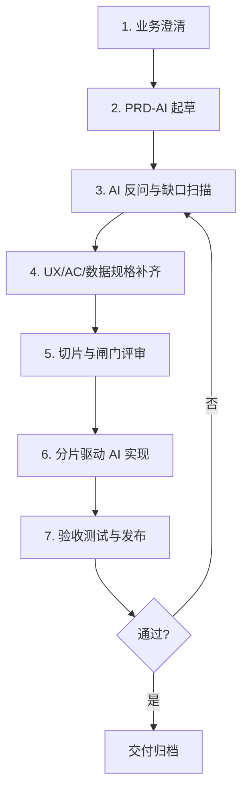

# AI 驱动产品开发方法论：产品经理完整指南

> **适用对象**：软件产品经理，从「需求 → 研发」转向「需求 → AI 编程工具」  
> **目标**：在保证效率的前提下，提高 AI 实现的**准确性、完整性、可验收性**  
> **版本**：v1.0 | 2026-06-01

---

## 目录

1. [为什么 AI 经常「不按需求做」或「自行想象」](#1-为什么-ai-经常不按需求做或自行想象)
2. [核心认知：AI 开发范式与传统研发的差异](#2-核心认知ai-开发范式与传统研发的差异)
3. [推荐文档体系：要什么、不要什么](#3-推荐文档体系要什么不要什么)
4. [端到端流程总览](#4-端到端流程总览)
5. [分阶段详解：产物、方法、提示词](#5-分阶段详解产物方法提示词)
6. [交给 AI 后的开发执行策略](#6-交给-ai-后的开发执行策略)
7. [质量保障：Checklist、测试与验收](#7-质量保障checklist测试与验收)
8. [推荐组合工作流（效率 × 准确度）](#8-推荐组合工作流效率--准确度)
9. [常见反模式与纠偏](#9-常见反模式与纠偏)
10. [附录：文档模板与提示词库](#10-附录文档模板与提示词库)

---

## 1. 为什么 AI 经常「不按需求做」或「自行想象」

### 1.1 表面现象 vs 根因

| 表面现象 | 常见根因（往往不是「AI 不听话」） |
|---------|----------------------------------|
| 功能做了但和想象不一致 | 需求存在**歧义**，AI 选择了概率最高的合理解释 |
| 漏做次要功能 | **范围边界**未写清（In/Out of Scope 缺失） |
| UI/交互和原型不一致 | **视觉与交互规格**未结构化，只有口头描述 |
| 自行增加字段、接口、页面 | **默认值填补**：模型对缺失信息会用「常见产品模式」补全 |
| 改 A 坏了 B | **缺少约束**：未声明不可改模块、兼容性、数据契约 |
| 一次对话做完，后期对不上 | **上下文丢失**：长任务未分片、未用文件作为「单一事实源」 |
| 说完成了但实际不能跑 | **完成定义（DoD）**缺失，AI 优化的是「像完成」而非「可验收」 |

### 1.2 六大根本原因（产品经理视角）

#### （1）自然语言的歧义性

同一句话「支持导出」，可理解为：CSV / Excel / PDF、当前页 / 全量、同步 / 异步、权限控制与否。  
**人类研发**会追问；**AI**在缺少追问机制时，倾向于**直接实现一个合理版本**。

#### （2）LLM 的「补全本能」

大模型训练目标是**续写合理内容**。需求文档中的空白（异常流、空状态、权限、边界值）会被模型用行业惯例填充——这就是你感受到的「自行想象」。

#### （3）目标函数不一致

你优化的：**业务正确 + 可上线 + 可验收**。  
模型默认优化的：**代码可运行 + 改动局部收敛 + 快速给出答案**。  
若未在 Prompt 中明确「禁止推断未写明需求」，模型会把**推断**当作**创造**。

#### （4）上下文窗口与注意力衰减

一次性塞入超长 PRD，靠后章节、附录、表格中的约束容易被弱化。  
没有**分阶段交付**和**文件化规格**时，多轮对话后早期约束会被「稀释」。

#### （5）缺少可执行的验收标准

「好用」「简洁」「类似某某 App」属于**主观标准**，无法被 AI 或测试自动验证。  
没有**Given-When-Then**、没有**页面状态矩阵**，就无法判定对错。

#### （6）把 AI 当「全栈单人」而非「受约束的执行者」

传统研发有评审、联调、测试分工；  
若对 AI 只给一段模糊需求、又不设**闸门（Gate）**，等价于跳过设计评审和测试评审。

### 1.3 结论（先建立正确预期）

> **AI 不是「读心术开发者」，而是「高产能、需强约束的执行者」。**  
> 准确度不主要来自「换一个更强的模型」，而来自：**结构化需求 + 分阶段交付 + 可验证规格 + 人机闸门**。

---

## 2. 核心认知：AI 开发范式与传统研发的差异

### 2.1 范式对比

| 维度 | 传统研发 | AI 驱动研发（推荐） |
|------|---------|-------------------|
| 需求载体 | PRD + 口头澄清 + 评审 | **机器可读规格**（结构化 MD/YAML/表格） |
| 沟通方式 | 会议追问 | **文档内嵌「决策记录」+ 显式禁止推断** |
| 设计产物 | 可简可繁 | **轻量但必须可测试**（状态机、接口表、页面矩阵） |
| 迭代单位 | 迭代/Sprint | **切片（Slice）**：每个切片可独立验收 |
| 质量关口 | 人审 | **人审 + 自动化验收清单 + 测试用例** |
| 真相来源 | 人脑 + 文档 | **仓库内固定路径的 Spec 文件**（Single Source of Truth） |

### 2.2 AI 开发第一性原理

```
业务目标清晰
    → 范围可判定（做 / 不做）
        → 行为可描述（正常 + 异常 + 权限）
            → 界面可定位（页面/组件/状态）
                → 数据可契约（字段/类型/来源）
                    → 验收可执行（Checklist + 测试用例）
                        → 分片实现（小步提交、每步可验）
```

### 2.3 产品经理的新职责（不是写更多字，而是写「更少歧义」）

1. **决策前置**：把「研发会问的 20 个问题」写进文档，而不是留给 AI 猜。  
2. **可测试化**：每个功能点都能对应至少一条验收项。  
3. **切片化**：大需求拆成 AI 单次可完整理解的交付单元（通常 0.5～2 人日）。  
4. **约束显式化**：技术栈、目录、不可改模块、风格、兼容范围写清楚。  
5. **闸门管理**：规划 → 规格 → 实现 → 测试，每步你确认后再进入下一步。

---

## 3. 推荐文档体系：要什么、不要什么

### 3.1 文档分层（由粗到细）

```
L0  业务简报（可选，内部对齐用）
L1  PRD-AI（产品需求规格，AI 主输入）
L2  产品交互与界面规格（UX Spec / 页面矩阵）
L3  技术实现规格（API、数据模型、状态机、错误码）
L4  开发执行包（切片计划 + 每片 Prompt + 约束）
L5  验收包（Dev Checklist + 测试用例 + 回归范围）
```

### 3.2 是否都需要？——按场景裁剪

| 文档 | 小功能/改字改色 | 中等功能 | 核心流程/多页面/多角色 |
|------|----------------|---------|----------------------|
| PRD-AI | ✅ 精简版 | ✅ 完整版 | ✅ 完整版 + 决策记录 |
| 产品详细设计（流程/状态） | 可合并进 PRD | ✅ 建议独立 | ✅ 必须 |
| 页面布局与操作规格 | ✅ 简表即可 | ✅ | ✅ 必须到按钮级 |
| 产品开发需求说明（给开发的 AC） | ✅ | ✅ | ✅ |
| 开发规范（技术约束） | 引用项目已有 | ✅ | ✅ 必须 |
| 切片计划（Implementation Slices） | 可选 | ✅ | ✅ 必须 |
| Dev Checklist | ✅ | ✅ | ✅ |
| 测试用例 | 简版 | ✅ | ✅ 含异常/权限 |

**原则**：文档不是为了「像大公司」，而是为了 **AI 不会猜**。  
文档总量 ≠ 质量；**结构化程度** 才决定准确度。

### 3.3 仓库内推荐目录（Single Source of Truth）

```
docs/
  product/
    BRD-xxx.md              # L0 可选
    PRD-xxx.md              # L1 主规格
    UX-xxx.md               # L2 页面矩阵、交互
    ADR-xxx.md              # 架构/产品决策记录
  engineering/
    TECH-CONSTRAINTS.md     # 技术栈、目录、禁止事项
    API-xxx.md              # L3 接口与错误码
    DATA-xxx.md             # 数据模型
  delivery/
    SLICES-xxx.md           # L4 切片计划
    CHECKLIST-xxx.md        # L5 开发自检
    TESTCASES-xxx.md        # L5 测试用例
```

在 Cursor 等工具中，用 `@docs/product/PRD-xxx.md` 引用，比粘贴聊天更稳定。

---

## 4. 端到端流程总览

### 4.1 七阶段流程（推荐）



### 4.2 各阶段「人的动作」vs「AI 的动作」

| 阶段 | 产品经理 | AI 工具 |
|------|---------|---------|
| 业务澄清 | 定目标、范围、角色、成功指标 | 可辅助生成问题清单 |
| PRD 起草 | 定稿、决策 | 扩写、结构化、找歧义 |
| 缺口扫描 | **确认/驳回** AI 推断 | 输出「待确认问题表」 |
| 规格补齐 | 确认交互与 AC | 生成 UX 表、测试用例草稿 |
| 切片评审 | 批准切片顺序 | 生成 Slice 计划 |
| 实现 | 每片验收 | 按片实现，禁止越界 |
| 测试发布 | 验收签字 | 跑测试、修 Bug（限定范围） |

---

## 5. 分阶段详解：产物、方法、提示词

### 5.1 阶段 1：业务澄清（输入：想法 / 工单 / 调研）

**产物**：`BRD-xxx.md`（1～2 页）或 PRD 第 0 章「背景与目标」

**必含要素**：

- 背景与问题陈述
- 目标用户与场景（User Story 级）
- 业务目标与**可量化成功指标**（如：转化率、时长、工单量）
- 范围：**In Scope / Out of Scope**（极其重要）
- 约束：上线时间、合规、平台（Web/小程序/App）
- 风险与依赖

**提示词范例（生成 BRD 草稿）**：

```markdown
你是资深 B 端产品经理。根据以下信息生成 BRD（中文），控制在 2 页内。

【输入】
- 业务背景：{粘贴}
- 目标用户：{角色}
- 期望结果：{指标}
- 明确不做：{如有}

【输出结构】
1. 背景与问题
2. 目标与成功指标（必须可量化）
3. 用户与核心场景（3～5 条 User Story）
4. In/Out of Scope（表格）
5. 约束与依赖
6. 风险

【规则】
- 不要编造我没有提供的业务数据；缺失处用「待确认：」列出
- 不要写技术实现方案
```

---

### 5.2 阶段 2：PRD-AI 起草（核心文档）

#### 5.2.1 PRD-AI 标准结构（建议固定模板，便于 AI 解析）

```markdown
# PRD-{功能编号}-{简称}

## 0. 元信息
- 版本 / 作者 / 日期 / 状态（Draft|Review|Approved）
- 关联：BRD、设计稿链接、原型链接

## 1. 概述
- 一句话描述
- 目标与指标
- 术语表（Glossary）

## 2. 用户与权限
- 角色矩阵（角色 × 能力）
- 权限规则（读/写/审批/导出等）

## 3. 范围
### 3.1 In Scope（编号 FR-001…）
### 3.2 Out of Scope（明确不做，防止 AI 扩 scope）

## 4. 功能需求（每条必须可验收）
### FR-001 {名称}
- 描述：
- 前置条件：
- 主流程：（步骤编号）
- 备选/异常流：
- 业务规则：（含计算公式、校验规则）
- 数据项：（字段、必填、长度、枚举）
- 验收标准 AC：（Given-When-Then）
- 非功能：（性能、审计、日志）如适用

## 5. 交互与界面（可引用 UX 文档）
- 页面清单
- 关键状态（空/加载/错误/无权限）

## 6. 集成与数据
- 上下游系统
- 核心实体与生命周期

## 7. 非功能需求 NFR

## 8. 决策记录 ADR（产品决策）
| 编号 | 问题 | 决策 | 原因 | 日期 |

## 9. 开放问题 Open Questions
| 编号 | 问题 | 负责人 | 截止日期 | 状态 |

## 10. 验收与发布
- 整体验收标准
- 回归范围
- 埋点/运营配置（如需要）
```

#### 5.2.2 功能点编写规范（按钮级）

每个 **FR** 建议拆到「用户可感知的最小单元」，并包含：

| 要素 | 说明 | 反例 |
|------|------|------|
| 触发入口 | 哪个页面、哪个按钮、什么文案 | 「支持删除」 |
| 前置条件 | 数据状态、权限 | 未写是否可批量 |
| 操作步骤 | 1、2、3 编号 | 「用户自行操作」 |
| 反馈 | Toast/弹窗/跳转，**原文案** | 「提示成功」 |
| 异常 | 每种失败的原因与展示 | 只写 happy path |
| 幂等与并发 | 重复点击、双人编辑 | 未写 |
| AC | 可测试的三段式 | 「体验良好」 |

**验收标准 AC 示例**：

```markdown
AC-001-1
Given 用户已登录且拥有「订单-导出」权限，订单列表有 ≥1 条记录
When 用户点击「导出 Excel」，在弹窗中选择「当前筛选结果」并确认
Then 系统下载 .xlsx 文件，文件名格式为 orders_{yyyyMMddHHmmss}.xlsx，列与列表一致，且 ≤30s 完成或显示异步任务入口
```

**提示词范例（BRD → PRD-AI）**：

```markdown
你是负责 {产品名} 的产品经理，请将 BRD 转为 PRD-AI（严格按我提供的章节模板输出）。

【输入】
{粘贴 BRD 或要点}

【硬性规则】
1. 每个功能使用 FR-001 编号，并包含：主流程、异常流、业务规则、数据项、AC（Given-When-Then）
2. Out of Scope 至少 5 条，用于防止 scope creep
3. 所有未在输入中出现的信息，不得虚构；列入「开放问题」表
4. 文案、按钮名称、错误提示如需占位，标注为「待 UI 确认：」
5. 输出 Markdown，表格齐全

【额外任务】
- 在文末输出「歧义与风险清单」（至少 10 条）
```

---

### 5.3 阶段 3：AI 反问与缺口扫描（关键闸门 ⭐）

在交给开发实现之前，**先让 AI 当「挑剔的测试/研发」审 PRD**，你只做决策。

**提示词范例（缺口扫描）**：

```markdown
你现在是「需求评审委员会」：产品经理 + 架构师 + 测试负责人。
请阅读 @docs/product/PRD-xxx.md，不要写代码。

【输出】
1. 歧义清单（引用 FR 编号，说明多种理解）
2. 缺失规格清单（异常流、权限、边界值、空状态、并发、审计、国际化…）
3. AI 若自行补全会采用的「默认假设」（逐条列出，供我确认或否决）
4. 建议拆分的实现切片（Slice-01…）
5. 必须人工确认的 Top 10 问题（按风险排序）

【规则】
- 不要实现功能
- 不要编造业务决策；需要决策的写入「待确认」
```

你对「默认假设」逐条回复：**确认 / 否决 / 修改**，并更新 PRD 第 8 章 ADR。  
这一步通常能**减少 50% 以上的返工**。

---

### 5.4 阶段 4：补齐 UX 规格、开发 AC、数据与技术规格

#### 5.4.1 UX 规格（`UX-xxx.md`）——页面矩阵

```markdown
# UX-{功能简称}

## 页面清单
| 页面 ID | 名称 | 路由/入口 | 关联 FR |

## 页面 P-001：订单列表
### 布局区块
| 区块 | 组件 | 说明 |
| 顶栏 | 标题+按钮 | 主按钮「新建订单」FR-002 |

### 控件级规格
| 控件 ID | 类型 | 文案 | 状态 | 点击行为 | 关联 FR/AC |
| BTN-001 | 主按钮 | 导出 Excel | default/disabled(无数据) | 打开弹窗 D-001 | FR-005 / AC-005-1 |

### 状态矩阵
| 状态 | 条件 | 界面表现 |
| 空 | 无订单 | 插图+「暂无订单」+ 引导创建 |
| 加载 | 请求中 | 表格 Skeleton |
| 错误 | 接口失败 | Banner「加载失败」+ 重试 |
```

**提示词范例（PRD → UX 矩阵）**：

```markdown
根据 @docs/product/PRD-xxx.md 生成 UX 规格文档。
要求：每个 FR 映射到页面/控件；按钮级；含状态矩阵（空/加载/错误/无权限）。
缺失信息列入 Open Questions，不要猜配色，除非 PRD 已规定。
```

#### 5.4.2 产品开发需求说明（`DEV-REQ-xxx.md`）

面向实现的**纯行为与契约**，去掉市场背景，方便 AI 每次实现时引用：

- 功能列表 + 优先级
- 接口概要（路径、方法、请求/响应示例）
- 错误码表
- 数据模型（表/字段/索引/约束）
- 前端路由与组件树（如适用）
- **禁止修改清单**（哪些文件/模块不可动）

#### 5.4.3 开发规范（`TECH-CONSTRAINTS.md`）

项目级一次编写，长期复用：

- 技术栈与版本
- 目录结构约定
- 代码风格、命名、i18n、日志
- 安全（鉴权、脱敏）
- 性能预算
- **AI 专用条款**：「未在 Spec 中出现的字段/接口/页面一律不得新增」

---

### 5.5 阶段 5：切片计划（Implementation Slices）

**原则**：一片 = 一次 AI 会话可完成 + 可独立验收 + 可回滚。

`SLICES-xxx.md` 示例：

```markdown
# SLICES-订单导出

| 切片 | 目标 | 包含 FR | 不包含 | 验收 |
| Slice-01 | 列表页骨架+空状态 | FR-001 | 导出 | AC-001 |
| Slice-02 | 导出弹窗+同步导出 | FR-005 | 异步 | AC-005-1 |
| Slice-03 | 异步导出+下载中心 | FR-006 | - | AC-006 |

依赖：Slice-02 依赖 Slice-01
```

**提示词范例（生成切片）**：

```markdown
根据 PRD 和 UX 文档，生成实现切片计划。
约束：每片 0.5～1.5 人日；每片必须有可执行验收项；标注依赖与风险。
不要生成代码。
```

**闸门**：你批准 `SLICES` 后，才进入实现阶段。

---

### 5.6 阶段 6：分片驱动 AI 实现

见第 6 章（执行策略）。

---

### 5.7 阶段 7：验收包

同时产出：

- `CHECKLIST-xxx.md`：开发自检（是否越界、是否漏 FR）
- `TESTCASES-xxx.md`：测试用例（含权限、异常、边界）
- 回归范围：本次改动影响的历史功能列表

**提示词范例（PRD → 测试用例）**：

```markdown
根据 PRD 中所有 AC，生成测试用例表：
列：用例 ID | 关联 FR/AC | 前置条件 | 步骤 | 预期 | 类型(功能/权限/异常/性能)
要求：每条 AC 至少 1 条用例；异常流覆盖；不要遗漏 Out of Scope 的负向用例（应验证「做不了」）。
```

---

## 6. 交给 AI 后的开发执行策略

### 6.1 三种模式对比

| 模式 | 做法 | 效率 | 准确度 | 适用 |
|------|------|------|--------|------|
| A. 一次性直给 | 整份 PRD +「帮我做完」 | 看似最高 | **最低** | 仅原型/Demo |
| B. 规格驱动分片（推荐） | 按 Slice + Spec 引用实现 | 高 | **高** | 正式功能 |
| C. TDD 驱动 | 先测试后实现 | 中 | **很高** | 规则复杂、回归风险大 |
| D. PDCA 循环 | 计划-执行-检查-行动 | 中高 | 高 | 与 B/C 组合 |

**推荐默认**：**B（分片）+ 选择性 C（核心逻辑 TDD）+ PDCA（每片验收）**  
不要裸用 A。

### 6.2 单片实现的标准 Prompt 结构（「五段式」）

每次实现一个 Slice，使用固定结构：

```markdown
## 角色
你是本仓库的资深工程师，严格遵守规格，禁止 scope creep。

## 规格（唯一事实源，冲突以 Spec 为准）
@docs/product/PRD-xxx.md
@docs/product/UX-xxx.md
@docs/delivery/SLICES-xxx.md
@docs/engineering/TECH-CONSTRAINTS.md

## 本次切片
- 实现：Slice-02
- 包含：FR-005, AC-005-1, AC-005-2
- 明确不做：{粘贴 Out of Scope + 本片不包含项}

## 约束
1. 未在 Spec 中出现的 API/字段/页面/按钮不得新增
2. 若 Spec 不清晰，停止并列出「阻塞问题」，不要猜测
3. 只修改与本片相关的文件；改动前先说明计划
4. 完成后对照 CHECKLIST 自检

## 交付物
- 代码变更
- 自检结果（逐条 CHECKLIST）
- 已知问题与未覆盖 AC
```

### 6.3 PDCA 如何嵌入每一 Slice

| PDCA | 在 AI 开发中的动作 |
|------|-------------------|
| Plan | 批准 Slice + AI 输出实现计划（文件列表） |
| Do | AI 实现本片 |
| Check | 你按 TESTCASES + AC 验收；跑自动化测试 |
| Act | 不通过 → 只开「修复 Slice」，附带失败现象；通过 → 下一片 |

### 6.4 何时用 TDD

建议在以下情况 **先写测试再让 AI 实现**：

- 计费、权限、状态机、库存、审批流等**高业务风险**逻辑
- 易回归的核心模块
- 有明确输入输出表的规则引擎

**TDD Prompt 范例**：

```markdown
仅针对 FR-010 的计费规则，先根据 AC 编写失败测试（不要实现生产代码）。
测试框架：{Jest/Pytest/...}
规则：覆盖边界值表 {粘贴}
完成后停止，等我确认测试再实现。
```

### 6.5 对话策略（Cursor / Claude Code 等）

1. **新功能新会话**：避免上下文污染。  
2. **用 @ 文件引用 Spec**，不要重复粘贴长 PRD。  
3. **一次只做一片**；通过后 `@CHECKLIST` 勾选再开下一片。  
4. **修复 Bug 时带「现象 + 期望 AC + 复现步骤」**，并限制「仅改与 FR-xxx 相关文件」。  
5. 在项目根添加 **`.cursor/rules` 或 `AGENTS.md`**，写入永久约束（禁止推断、必须先读 Spec）。

### 6.6 效率与准确性的平衡点

| 投入 | 回报 |
|------|------|
| +30min 缺口扫描 | 少 1～2 天返工 |
| +UX 页面矩阵 | UI 偏差显著下降 |
| +切片 | 上下文稳定，漏需求减少 |
| +CHECKLIST/测试 | 「说完成但未完成」减少 |

**经验法则**：规格准备时间 ≈ 实现时间的 **20%～40%**，总体周期通常仍短于「无规格直接让 AI 写」。

---

## 7. 质量保障：Checklist、测试与验收

### 7.1 开发 Checklist 模板（`CHECKLIST-xxx.md`）

```markdown
# CHECKLIST-{功能}

## 范围
- [ ] 仅实现已批准 Slice 中的 FR
- [ ] 未新增 Spec 外的 API/页面/字段
- [ ] Out of Scope 项确认未实现

## 功能
- [ ] FR-001 …（逐条勾选）
- [ ] 所有 AC 有对应实现或注明不适用

## 交互
- [ ] 按钮文案与 UX 表一致
- [ ] 空/加载/错误/无权限状态已实现

## 数据与安全
- [ ] 权限校验与 PRD 角色矩阵一致
- [ ] 敏感字段脱敏/审计日志符合 NFR

## 测试
- [ ] 单元测试通过
- [ ] TESTCASES 中 P0 用例已执行

## 文档
- [ ] 变更说明已写
- [ ] Open Questions 已关闭或延期
```

### 7.2 测试分层建议

| 层级 | 负责人 | 来源 |
|------|--------|------|
| 验收测试（业务） | 产品经理 | PRD 的 AC |
| 功能测试 | 你或 QA / AI | TESTCASES |
| 单元/集成测试 | AI + 研发规范 | 核心规则、API 契约 |
| 回归测试 | 你定义范围 | 影响分析 + 冒烟清单 |

### 7.3 验收会议（可 15 分钟）

按 **FR 编号** 演示，不是按页面随意点。  
未通过的记入 **缺陷单**，并映射到 FR/AC，下轮只修对应 Slice。

---

## 8. 推荐组合工作流（效率 × 准确度）

### 8.1 标准工作流（适合大多数需求）

```
业务要点（30min）
  → AI 生成 PRD 草稿（你改 1～2h）
  → AI 缺口扫描（你确认 30min～1h）
  → AI 生成 UX 表 + TESTCASES + SLICES 草稿（你改 1h）
  → 你批准闸门
  → 按 Slice 五段式 Prompt 实现（每片 30min～2h + 验收 15～30min）
  → 发布
```

### 8.2 小改动快速通道

```
变更说明（含 FR 编号）+ 受影响 AC + 回归点
  → 单 Slice 实现
  → 简版 CHECKLIST
```

### 8.3 大项目 / 多模块

```
PRD 总册 + 分模块 PRD（FR 全局编号）
  → 模块级 SLICES
  → 每模块循环 PDCA
  → 集成 Slice + 端到端测试
```

---

## 9. 常见反模式与纠偏

| 反模式 | 后果 | 纠偏 |
|--------|------|------|
| 「你先做着，细节后面补」 | AI 固化错误假设 | 先补齐 Open Questions 再写代码 |
| 只给原型图不给状态与异常 | UI 像但流程错 | 补状态矩阵 + 异常表 |
| 一次对话做完所有功能 | 后期全面偏差 | 强制切片 |
| 用「类似某某 App」代替规则 | 不可验收 | 改写成 AC 与业务规则表 |
| 不维护 Spec，只改代码 | 人与 AI 失忆 | Spec 与代码同步更新 |
| Bug 修复不引用 FR/AC | 修了又坏 | 修复 Prompt 带 AC + 回归范围 |
| 未写 Out of Scope | 功能膨胀 | 每条需求写「不做」 |

---

## 10. 附录：文档模板与提示词库

### 10.1 一页纸「需求交接包」检查（交给 AI 开发前）

- [ ] PRD 已 Approved，含 In/Out of Scope
- [ ] 每个 FR 有 AC（Given-When-Then）
- [ ] UX 页面矩阵覆盖所有按钮级操作
- [ ] 开放问题已关闭或已写入 ADR
- [ ] SLICES 已批准
- [ ] TECH-CONSTRAINTS 可引用
- [ ] CHECKLIST + TESTCASES 已生成
- [ ] 实现 Prompt 使用五段式，且标明「禁止推断」

### 10.2 通用「禁止推断」短句（可放入项目 Rules）

```text
若需求、UX、API、数据规格未明确写出，你必须停止实现，输出「阻塞问题清单」，不得用行业惯例私自补全。若我明确回复「按你的假设 A」，才可执行假设 A，并写入 ADR。
```

### 10.3 缺陷修复 Prompt 模板

```markdown
【缺陷】ID-BUG-012
【关联】FR-005 / AC-005-2
【现象】{实际}
【期望】{引用 AC 原文}
【复现步骤】1…2…3
【范围】仅允许修改 {文件/模块列表}
【回归】请执行 TESTCASES 中 TC-005-x, TC-001-smoke
```

### 10.4 从 0 到 1 的「提示词链」（可复制串联）

1. `BRD 生成` → 你审  
2. `BRD → PRD-AI` → 你审  
3. `PRD 缺口扫描` → 你答 ADR  
4. `PRD → UX + TESTCASES + SLICES` → 你审  
5. `Slice-N 五段式实现` → 你按 CHECKLIST 验收  
6. `未通过 → 缺陷修复模板` → 再验收  

---

## 结语：产品经理在 AI 时代的核心能力

不是「会写更长的 PRD」，而是：

1. **把模糊意图变成可判定规格**  
2. **用闸门管理 AI 的补全本能**  
3. **用切片和验收把交付变成工程过程**  

当你把 AI 当作**受 Spec 约束的高产能执行者**，而不是**懂业务的同事**，准确度会接近甚至超过传统「文档一般 + 靠研发追问」的模式——同时迭代速度更快。

---

*文档结束。可根据你司模板将章节并入现有 PRD 体系，或拆分为 `docs/product/` 下的多个文件。*
