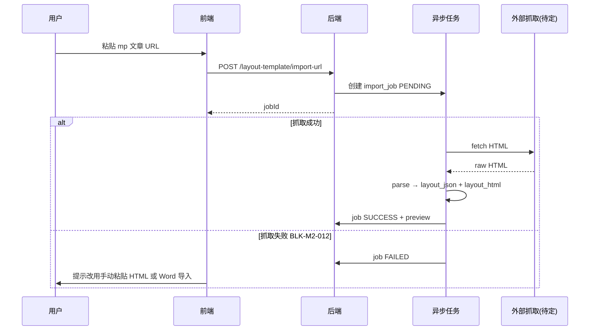

# ADR-019：M2 公推模板库 — 版式存储格式与导入管线（草案）

| 字段 | 值 |
|------|---|
| 编号 | ADR-019 |
| 标题 | 公众号推文版式模板存储格式 + URL/Word 导入管线 |
| 状态 | **Accepted** |
| 日期 | 2026-06-14 |
| 决策人 | 产品 + 架构（待签） |
| 关联 PRD | `PRD-M2-内容生产.md` · FR-M2-005 |
| 关联 Slice | S-14（见 `SLICES-M2-内容生产.md`） |

---

## 1. 背景

用户需求新增 **公推模板库**：管理公众号推文 **内容版式**（非 SOP 流程模板、非 M8 AI 提示词模板），支持手动创建、公众号链接导入、Word 导入，并在内容创作/审核/查看中以 **富版式** 编辑与展示。

当前 `oa_production_content.body` 为 **LONGTEXT 纯文本**（UX 使用 `<Textarea />`），无法满足版式保留需求。须先决存储格式与导入管线，再实现 Slice。

---

## 2. 决策（草案 — 待产品确认）

### 2.1 模板与内容的版式存储 — **方案 B（推荐）**

| 层 | 字段 | 格式 | 用途 |
|----|------|------|------|
| 模板表 `oa_wechat_layout_template` | `layout_json` | JSON（块编辑器 schema，见 §2.2） | 编辑态 SSOT；可 diff、可校验 |
| 同上 | `layout_html` | 消毒后 HTML 子集 | 只读预览、导出、审核展示 fallback |
| 内容表 `oa_production_content` | `body` | **保留** LONGTEXT | 纯文本 fallback / AI 生成文本 |
| 同上 | `layout_json` | 同模板 schema | 富版式正文 SSOT（`body_format=LAYOUT` 时） |
| 同上 | `layout_html` | 消毒 HTML | 只读渲染（查看/审核/列表摘要） |
| 同上 | `body_format` | `dict_content_body_format` | `PLAIN` / `LAYOUT` |
| 同上 | `layout_template_id` | FK → 模板（可空） | 记录应用来源，**非**强绑定（应用后可改） |

**不采用**「仅 HTML 单字段」为 SSOT 的原因：HTML 难以结构化编辑、diff 与块级操作（插入引用块、赛事数据块）扩展性差。

**不采用**「客户端-only 应用模板、不落库关联」的原因：审核/查看须服务端一致渲染；审计需知模板来源。

### 2.2 `layout_json` Schema（v1 最小集 — 待编辑器选型后细化）

```json
{
  "version": 1,
  "blocks": [
    { "type": "heading", "level": 2, "text": "标题" },
    { "type": "paragraph", "align": "left", "children": [{ "text": "正文", "bold": false }] },
    { "type": "image", "src": "https://...", "width": "100%" },
    { "type": "quote", "text": "引用" },
    { "type": "divider" }
  ]
}
```

- 块类型 v1：**heading / paragraph / image / quote / divider / list**
- 样式属性限于 **公众号常见子集**（字号、颜色、对齐、粗斜体）；不支持任意 CSS
- 服务端保存前：`layout_html = render(layout_json)` + **HTML sanitize**（防 XSS）

> **待产品确认（OQ-M2-020）**：是否 v1 即支持「赛事数据占位块」（与 M8 变量联动）？建议 **Phase 2**。

### 2.3 模板匹配规则

| 规则 | 值 |
|------|---|
| 内容 `content_type` | 必须为 **`ARTICLE`**（`dict_content_type`） |
| 模板 `content_type` | 固定 **`ARTICLE`**（表字段或常量） |
| 模板 `document_type` | `@InDict(dict_document_type)`，**可空** |
| 匹配逻辑 | `content_type` 一致 **且**（模板 `document_type` 为空 **或** 与内容 `document_type` 相等） |

**待产品确认（OQ-M2-021）**：用户需求表述「文档类型 = 文章」——现有 `dict_document_type` **无**「文章」枚举值（仅有短视频文案/新号引流等五类）。可选：

- **A**：模板不绑 `document_type`，凡 `ARTICLE` 均可选（**本 ADR 默认**）
- **B**：新增字典值 `WECHAT_ARTICLE`（公推文章）专用于模板与内容
- **C**：模板必须指定五类之一，与内容 `document_type` **严格相等**才可应用

### 2.4 导入管线

#### 2.4.1 公众号链接导入



- **BLK-M2-012**：微信文章 URL **无公开稳定 API**；反爬、合规、IP 封禁风险
- **Fallback（须 UX 支持）**：用户 **手动粘贴** 已复制 HTML / 富文本 → `POST /import-paste`
- 导入结果默认 **草稿模板**（`status=DRAFT`），用户预览确认后 `POST /publish`

#### 2.4.2 Word (.docx) 导入

- 上传 `multipart/form-data` → 存临时文件（ADR-001 本地磁盘或对象存储 **待 BLK-M2-013**）
- 异步 Job：`mammoth` / `Apache POI` / 自建规则 → `layout_json` + `layout_html`
- **BLK-M2-014**：Word 复杂版式（多栏、文本框、嵌入对象）**无法 100% 还原**；须在 UX 声明「导入后需人工微调」
- 文件大小上限：**待产品确认**（建议 10MB）

#### 2.4.3 手动创建

- 空模板或从内置空白版式创建 → 直接进入块编辑器

### 2.5 富文本编辑器选型 — **未决（BLK-M2-015）**

| 方案 | 优点 | 缺点 |
|------|------|------|
| **TipTap**（ProseMirror） | 块模型与 `layout_json` 自然映射；Vue3 生态 | 公众号样式需自定义 extension |
| **WangEditor v5** | 中文文档全；HTML 双向 | 块 schema 导出需适配 |
| **Quill Delta** | 成熟 | Delta→HTML 与块级 diff 较弱 |
| **iframe 135/秀米外链** | 版式精美 | 依赖第三方；数据出境/合规 |

**推荐**：TipTap + 自定义块扩展；只读态用同一 renderer 输出 `layout_html`（查看/审核一致）。

**须产品确认**：是否允许 Phase 1 **只读 HTML 渲染 + 简化编辑**（降级），完整块编辑 Phase 2。

### 2.6 应用模板到内容

- **服务端**：`POST /admin-api/oa/content/{id}/apply-layout-template`  
  - 校验类型匹配；将模板 `layout_json`/`layout_html` **复制**到内容（**覆盖**正文版式区，**不**改 title/metadata）  
  - 写入 `layout_template_id`；`body_format=LAYOUT`  
  - 若内容已有版式 → 二次确认（UX）
- **纯文本 `body`**：应用模板后 **保留**原 `body` 为「纯文本摘要」或清空 — **待产品确认（OQ-M2-022）**

AI 生成仍写入 `body`（PLAIN）；用户可再「应用模板」将文本粘贴入段落块 — **工作流待 UX 细化**。

---

## 3. 后果

| 层 | 变更 |
|----|------|
| 字典 | 新增 `dict_content_body_format`（PLAIN / LAYOUT）；可选 `dict_layout_template_status`；可选 `dict_layout_import_status` |
| DB | 新表 `oa_wechat_layout_template`；`oa_production_content` 增 `layout_json` / `layout_html` / `body_format` / `layout_template_id`；可选 `oa_layout_import_job` |
| API | §6 `API-M2-内容生产.md` |
| UX | P-M2-013~016；`ContentEditPanel` 升级 |
| GLOBAL | ER-DIAGRAM + §2 字典登记（Accept 后） |

---

## 4. 未决 / 阻塞

| 编号 | 问题 | 状态 |
|------|------|------|
| BLK-M2-012 | 公众号 URL 抓取：技术路径、合规、Fallback | 🔴 阻塞 |
| BLK-M2-013 | docx 临时文件存储与异步 Job 基础设施 | 🟡 待确认 |
| BLK-M2-014 | Word 版式还原率预期与用户提示 | 🟡 待确认 |
| BLK-M2-015 | 富文本/块编辑器组件选型 | 🔴 阻塞 |
| OQ-M2-020 | 赛事占位块是否 v1 | 🟡 待确认 |
| OQ-M2-021 | 「文档类型=文章」与 `dict_document_type` 映射 | 🔴 待产品确认 |
| OQ-M2-022 | 应用模板后 `body` 纯文本字段策略 | 🟡 待确认 |

---

## 5. 备选方案（未采纳）

| 方案 | 弃用原因 |
|------|----------|
| 模板仅存 HTML，编辑用 contenteditable | XSS 风险高；难做结构化校验 |
| 模板放知识库 `category=模板库` | 与「版式块结构 + 导入管线」需求不匹配；知识库为富文本非块 schema |
| 仅前端 apply，不写 `layout_template_id` | 审核端无法复现版式 |

---

*Accept 条件：产品确认 OQ-M2-021 + 选定 BLK-M2-015 编辑器方案。*
