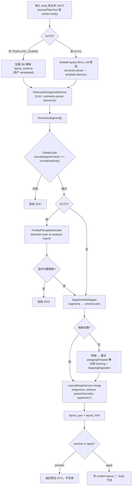

# ADR-028：M2 AI 排版 — 语义分段与模板映射

| 字段 | 值 |
|------|---|
| 编号 | ADR-028 |
| 标题 | M2 内容编辑器 — AI 排版（语义分段 + 模板映射 + 正文保真） |
| 状态 | **Accepted**（2026-09-08 产品决策关闭 OQ-M2-012-01~03，并批准 S-21a 与确定性模板决策补充） |
| 日期 | 2026-09-08 |
| 决策人 | 产品 + 架构 |
| 关联 | ADR-020 · ADR-021 · ADR-027 · ADR-053 · ADR-063 |
| 增量 Spec | `PRD-M2-AI排版增量.md` · `UX-M2-AI排版增量.md` · `API-M2-AI排版增量.md` |
| 关联资产 | `docs/football-layout/`（语义分段 taxonomy + 模板渲染参照） |

---

## 1. 背景

### 1.1 问题

ADR-027 §4.1 已定义版式资源工作台「一键排版」双模式：

| ADR-027 模式 | 行为 |
|--------------|------|
| `TEMPLATE` | `templateId` + `paramOverrides` → `LayoutMergeService.merge`（**顺序吃段**，无语义理解） |
| `AUTO` | `SMART_OPTIMIZE` 规则链 + 样式库 `styleRefs`（**规则驱动**，非语义理解） |

产品 **2026-09-08** 确认新需求：

1. **不改内容** — 套用/排版前后 `body` 纯文本一致（延续 ADR-020 铁律）
2. **AI 排版基于内容语义** — LLM 理解正文结构，**非**规则链硬匹配
3. **模板选择模式** — 用户可选模板；AI 识别该模板 `layout_schema` 槽位/块结构，将语义段映射后排版
4. **自动模式** — 用户不选模板时，走 `docs/football-layout/SKILL.md` 管线：语义解析 → **内置两模板**（决策扫读版 / 情报分析版）自动决策 → 参数 → 渲染

仓库内 `docs/football-layout/` 已沉淀 **足球分析文章** 的语义解析 taxonomy（`shared/semantic-parser.md`）与两套模板渲染规则，可作为 OPS AI 排版的 **分段 schema SSOT** 与 **渲染参照**，但运行时须走服务端 `LayoutMergeService` 以保证编辑/审核一致（ADR-020 §2.4）。

### 1.2 与既有 ADR 边界

| ADR | 关系 |
|-----|------|
| **ADR-020** | **继承**正文保真铁律；AI 排版输出仍经 merge/render，**禁止**改字 |
| **ADR-021** | **继承** `layout_html` 展示 SSOT；本 AI apply 是受控例外：不覆盖 `body` 原始字符串，但必须保证 `normalize(extractPlainText(layout_html)) = normalize(body)`；用户后续手工编辑保存仍按 ADR-021 派生/同步 `body` |
| **ADR-027** | **扩展**工作台「一键排版」Tab；新增 **AI 排版** 主能力；ADR-027 规则链一键排版 **保留为备选/legacy**（产品后续按 AI 效果再决策是否下线） |
| **ADR-053/063** | **复用** M8 系统「AI 模型配置」与 `AiLlmInvokeSupport` 的 OpenAI-compatible Chat Completion 调用栈；**新场景** `AI_TYPESET_SEMANTIC` |
| **ADR-029** | **依赖（S-21b）**：Shenyu H5 模板（如神鱼体育 id 12/17）错误 `layout_schema` 会致 `TEMPLATE_GUIDED` 大面积 `mappingDegraded`；S-21b 修复导入 SSOT 后做 P0 回归 |

---

## 2. 决策

### 2.0 AI 能力职责边界（2026-09-08 Accepted）

- `AI_TYPESET_SEMANTIC` 从当前租户系统「AI 模型配置」中选择 `ENABLED + CONNECTED` 的 LLM，通过 OpenAI-compatible Chat Completion 输出 `SemanticSegment[]`。
- API Key 仅经现有配置 API 进入 `api_key_encrypted`，必须使用 AES-256 加密落库；文档、seed、源码和日志不得保存明文。
- `jingcai.article` 继续负责 AI 文案首生成/润色；其异步文章任务协议不承担 AI 排版语义分段。两条链路不互相 fallback，不用文章结果冒充 segments。

### 2.1 两种 AI 排版模式

| 模式 | 请求字段 | 行为 |
|------|----------|------|
| **`TEMPLATE_GUIDED`** | `mode=TEMPLATE_GUIDED` + **`templateId` 必填** | 用户从 **公推模板库**（`oa_wechat_layout_template`）选模板 → 加载 `layout_schema` → LLM 按 schema 槽位语义分段 → 映射 → merge → 输出 |
| **`AUTO`** | `mode=AUTO`；**不传** `templateId` | 用户 **不选模板** → 走 **`docs/football-layout/SKILL.md` 管线 SSOT**：语义解析（`shared/semantic-parser.md`）→ **内置两模板自动决策**（`decision-scan` vs `analysis-report`，基于内容语义）→ 参数 → 映射到对应内置 `layout_schema` → merge → 输出。**非**以 DB 模板库 catalog 扫描为主路径 |

**命名说明**：与 ADR-027 `TEMPLATE` / `AUTO` 区分，AI 排版 API 使用 `TEMPLATE_GUIDED` / `AUTO`，避免与规则链 `AUTO` 混淆。

### 2.2 管线（两模式共用）



**MVP 路径**（与 prior analysis 一致）：

> LLM → `SemanticSegment[]` → **validate plainText fidelity** → **deterministic render** via `LayoutMergeService` + template `layout_schema`

**禁止**：LLM 直接输出 HTML 作为 SSOT（与 ADR-020 服务端渲染一致）；HTML 仅由 merge/render 产生。

### 2.3 正文保真门（Fidelity Gate）

**铁律**（延续 ADR-020 §2.2）：

```
plainTextBefore = normalizeWhitespace(content.body)
plainTextAfter  = normalizeWhitespace(concat(segments[i].text in document order))
ASSERT plainTextBefore === plainTextAfter
```

| 规则 | 说明 |
|------|------|
| 归一化 | 统一 `\r\n` → `\n`；连续空白折叠为单空格；首尾 trim |
| 分段来源 | 每段 `text` 必须是 `body` 的 **连续子串**，按序拼接后等于全文 |
| 失败处理 | **拒绝**请求，错误码 **2037**；**不** fallback 改字或丢弃段落 |
| apply 后 | `body` 字段 **字符串不变**；`body_format → LAYOUT`；`layout_html` 更新 |

### 2.4 `SemanticSegment` 与 football-layout 集成

**分段 taxonomy SSOT**：`docs/football-layout/shared/semantic-parser.md` 元素类型表。

| `segmentType` | 来源（semantic-parser） | 典型 `layout_schema` 映射 |
|---------------|-------------------------|----------------------------|
| `ARTICLE_TITLE` | 文章标题 | `heading` level=1 |
| `MATCH_HEADER` | 比赛头 | `heading` level=2 |
| `TEAM_VS` | 对阵行 | `slot` / 自定义 block |
| `MATCH_METADATA` | 元数据键值 | `slot` quote/list |
| `SUBHEADING` | 小标题（`：` 结尾） | `heading` level=3 |
| `ANALYSIS_PARAGRAPH` | 分析段落 | `slot` paragraph `repeat:true` |
| `RECOMMENDATION_LIST` | 竞彩/比分/指数推荐 | `slot` list |
| `IMAGE_PLACEHOLDER` | `【这里插入…图】` | `frame(image)` |
| `DIVIDER` | `---` / `***` | `divider` |
| `DISCLAIMER` | 免责声明 | 固定 `slot` 或尾部 paragraph |
| `QUOTE` | 引用语 | `slot` quote |
| `ORDERED_LIST` | 递进句 | `slot` list |
| `PLAIN_PARAGRAPH` | 兜底 | `slot` paragraph `repeat:true` |
| `CTA_BANNER` | 营销行动号召条（S-21a 增量） | `slot` paragraph；metadata 可选 `emphasisPhrase` |
| `HIGHLIGHT_LIST` | 要点列表（S-21a 增量） | `slot` paragraph；metadata 可选 `items[]` |

#### 2.4.1 营销组件增量（S-21a · 2026-09-11）

决策扫读版营销截图对齐新增两类可选 segment（须 LLM 输出或 HIGHLIGHT metadata 触发，渲染由 `FootballLayoutSemanticRenderer` 完成）：

| `segmentType` | 触发 | metadata | 渲染要点 |
|---------------|------|----------|----------|
| `CTA_BANNER` | 短 CTA 行；或 `HIGHLIGHT`/`PLAIN` + `variant=CTA_BANNER` | `emphasisPhrase`（金色尾句） | 深海军蓝底 `#1A2433`，白字 + 金色 `#D4AF37` 强调 |
| `HIGHLIGHT_LIST` | 多行要点；或 `HIGHLIGHT` + `items[]` | `items: string[]` | 奶油底 `#FDF8F5`，左红边 4px，`<ul><li>` |

**段内高亮增量**：`ParagraphEmphasisHelper` 追加营销关键词（`#A52A2A` 红棕）与行动词（`font-weight:700;color:inherit`），优先级低于球队/比分/赔率规则。

**模板渲染**：`docs/football-layout/template-*.md` 定义 **组件 HTML/CSS 意图**；OPS 实现期将其映射为 `layout_schema` 块类型 + `globalStyles`，**不**在运行时直接读取 markdown 文件。

**AUTO 选模板**（OQ-M2-012-02 **Accepted**）：**非** DB 模板库 catalog 扫描。SSOT = `docs/football-layout/SKILL.md` 工作流：

1. **语义解析** — `shared/semantic-parser.md`（Step 0~1）
2. **模板决策** — `FootballTemplateDecider` 在 **内置两模板** 间强制二选一：
   - `decision-scan`（决策扫读版，`template-decision-scan.md`）
   - `analysis-report`（情报分析版，`template-analysis-report.md`）
   - 决策依据：内容语义块分布（赛事档案 / 基本面 / 数据统计 / 战术 / 赔率 / 推荐预测等，见 SKILL.md Step 0）
3. **参数** — 模板默认参数（`shared/params.md`；MVP 用默认值，NL 调整 Phase 2）
4. **渲染** — 映射到 OPS 内置 seed 模板的 `layout_schema` + `LayoutMergeService`

**TEMPLATE_GUIDED** 仍走 DB 公推模板库（`templateId` → `oa_wechat_layout_template`）。

#### 2.4.2 `FootballTemplateDecider` 确定性评分（S-21a MVP）

最终模板**不得由 LLM 直接决定**。LLM 只按 §2.4 taxonomy 输出 `SemanticSegment[]`；服务端在 Fidelity Gate 通过后，从 `SemanticSegment[]` 与原文计算以下可观测特征并评分。所有字符串匹配均为大小写不敏感的字面/正则匹配，同一语义段对同一特征最多计 1 次。

**特征定义**：

| 特征 | 确定性定义 |
|------|------------|
| `bodyCharCount` | 原文统一 CRLF→LF 后，移除所有 Unicode 空白字符的 code point 数 |
| `matchCount` | `segmentType=MATCH_HEADER` 的段数；为 0 时以 `TEAM_VS` 段数补足（取两者最大值） |
| `analysisParagraphCount` | `ANALYSIS_PARAGRAPH` + `PLAIN_PARAGRAPH` 段数 |
| `recommendationCount` | `RECOMMENDATION_LIST` 段数 |
| `conclusionSegmentCount` | 文本命中 `推荐|结论|看好|竞彩推荐|比分推荐|指数推荐|综合推荐` 的段数 |
| `deepDimensionCount` | 六个维度中命中的**不同维度数**：基本面=`基本面|近期战绩|状态|伤停|阵容`；数据统计=`数据|统计|控球率|射门|射正|xG|预期进球`；战术=`战术|阵型|打法|逼抢|防反|控球`；赔率指数=`赔率|盘口|亚指|欧指|指数|水位|凯利|返还率`；历史交锋=`交锋|往绩|H2H|交手记录`；赛事档案=`赛事档案|比赛时间|联赛|排名|积分`。仅扫描 `SUBHEADING`、`ANALYSIS_PARAGRAPH`、`PLAIN_PARAGRAPH`、`MATCH_METADATA` |
| `numericDataSegmentCount` | 命中 `\d+(?:\.\d+)?%`、`\bxG\b`、`射门|射正|控球率|胜率|概率|积分|排名` 且含数字的段数 |
| `oddsSegmentCount` | 命中 `赔率|盘口|亚指|欧指|指数|水位|凯利|返还率` 的段数 |
| `subheadingCount` | `segmentType=SUBHEADING` 的段数 |

**权重**（每行互斥档位只取最高一档；不同特征累加）：

| 模板 | 条件 | 加分 |
|------|------|-----:|
| `decision-scan` | `bodyCharCount <= 1200` | +3 |
| `decision-scan` | `1200 < bodyCharCount <= 2000` | +1 |
| `decision-scan` | `matchCount <= 1` | +2 |
| `decision-scan` | `recommendationCount >= 1` | +3 |
| `decision-scan` | `conclusionSegmentCount >= 1` | +2 |
| `decision-scan` | `analysisParagraphCount <= 4` | +2 |
| `analysis-report` | `bodyCharCount >= 2200` | +3 |
| `analysis-report` | `1400 <= bodyCharCount < 2200` | +1 |
| `analysis-report` | `matchCount >= 2` | +3 |
| `analysis-report` | `deepDimensionCount >= 3` | +4 |
| `analysis-report` | `deepDimensionCount = 2` | +2 |
| `analysis-report` | `numericDataSegmentCount >= 2` | +3 |
| `analysis-report` | `numericDataSegmentCount = 1` | +1 |
| `analysis-report` | `oddsSegmentCount >= 1` | +3 |
| `analysis-report` | `analysisParagraphCount >= 6` | +2 |
| `analysis-report` | `subheadingCount >= 4` | +2 |

**阈值、同分与低置信度**：

1. `scoreGap = abs(decisionScanScore - analysisReportScore)`。
2. `analysisReportScore - decisionScanScore >= 2` → `analysis-report`；`decisionScanScore - analysisReportScore >= 2` → `decision-scan`，`confidence=HIGH`。
3. 两模板同分或 `scoreGap=1` 均属于低置信度，**固定选择 `decision-scan`**，`confidence=LOW`，`selectionReason=LOW_CONFIDENCE_FALLBACK`。同分不调用 LLM，不读取 DB catalog，不走 ADR-027 legacy 规则链。
4. 有效且通过保真校验的 `SemanticSegment[]` 必须总能按上述规则二选一。**2042 不用于分数相近**；仅用于选中标识无法解析到 ENABLED 内置 seed/schema 等模板基础设施不可用场景。空/非法分段仍为 2039，保真失败仍为 2037。
5. 输出须包含两模板分数、`scoreGap`、`confidence`、`selectionReason`、命中特征摘要与逐条 `decisionReasons`，以便单测与问题追踪；不得包含模型自由文本判断。

**示例与边界**：

| 输入特征摘要 | 扫读分 | 分析分 | 结果 |
|-------------|------:|------:|------|
| 800 字、1 场、3 行推荐、结论明确、3 个分析段 | 12 | 0 | `decision-scan` / HIGH |
| 2600 字、2 场、4 个深度维度、3 个数字数据段、含赔率、8 个分析段、5 个小标题 | 0 | 20 | `analysis-report` / HIGH |
| 1500 字、1 场、无推荐、5 个分析段、1 个小标题、无深度/数据/赔率证据 | 3 | 1 | `decision-scan` / HIGH |
| 1300 字、1 场、无推荐、5 个分析段、仅 1 个小标题 | 3 | 0 | `decision-scan` / HIGH（1200 边界不重复计分） |
| 分数同为 3，或分别为 4/3 | 见实际命中 | 见实际命中 | `decision-scan` / LOW；固定 fallback |

**段内样式（styleHints · Phase 1.5 / MVP+）**：可选增强。LLM 在 `SemanticSegment.styleHints` 中建议段内高亮（队名、比分、强调词等，规则参照 `semantic-parser.md` §段内语义高亮），merge/render 时注入 inline style/spans，**不得**改变 `text` 纯文本（延续 ADR-020 段内样式注入语义）。

### 2.5 溢出/不足策略

继承 ADR-020 PROPOSAL **OQ-v2-01/02 默认 B**：

| 场景 | 策略 |
|------|------|
| 段 **多于** 槽位 | 多余 `ANALYSIS_PARAGRAPH` / `PLAIN_PARAGRAPH` 追加到 **默认 repeat 段落槽**（样式默认） |
| 段 **少于** 槽位 | **隐藏**空槽（不插入占位文案） |
| 语义段无法映射任何槽 | **默认降级**（OQ-M2-012-01 **Accepted**）：映射到最近 `paragraph` / `repeat:true` 槽；服务端 **log warning**；preview 响应 `mappingDegraded=true` + `degradedSegments[]`；**不**整单拒绝 2041。2041 码保留供 **strict 模式**（可选配置，非 MVP 默认） |

### 2.6 API 与权限

| 项 | 决策 |
|----|------|
| Preview | `POST .../typeset/ai-semantic/preview` — 不写库 |
| Apply | `POST .../typeset/ai-semantic/apply` — 写 `layout_json` / `layout_html` / `layout_template_id` |
| 权限 | `oa:content:typeset`（ADR-027 已有） |
| 内容类型 | 仅 `content_type=ARTICLE` |
| 数据范围 | 与内容编辑一致（创建者 / IP 组数据权限） |
| 租户 | `tenant_id` 隔离模板与内容（1504） |

详见 `API-M2-AI排版增量.md`。

### 2.7 错误码

| 码 | 常量 | 含义 |
|----|------|------|
| **2036** | `LAYOUT_APPLY_BODY_EMPTY` | 正文为空（复用 S-14c） |
| **2031** | `LAYOUT_APPLY_OVERWRITE_REQUIRED` | 已有版式且 `overwrite=false`（apply） |
| **2037** | `LAYOUT_AI_FIDELITY_FAILED` | 保真 gate 失败 |
| **2039** | `LAYOUT_AI_SEGMENT_FAILED` | LLM 分段失败或输出不可解析 |
| **2041** | `LAYOUT_AI_SLOT_MAPPING_FAILED` | 语义段无法映射且 **strict 模式**未允许降级（MVP 默认走降级，通常不触发） |
| **2042** | `LAYOUT_AI_NO_TEMPLATE` | AUTO 已选中的内置模板无法解析到 ENABLED seed/schema |
| **1501** | — | `templateId` 不存在或类型不匹配 |
| **1504** | — | 跨租户 |

### 2.8 前端（概要）

- 版式资源工作台「一键排版」Tab 新增 **「AI 排版」** 主按钮（见 UX 增量）
- 可选 **模板选择器**（空 = AUTO）
- **对比预览**（排版前/后 `layout_html`）→ 确认 apply
- 与 ADR-027 规则链一键排版 **并存**（legacy 备选 Tab）；**默认 landing AI 排版**
- AUTO 时 UI 展示 football-layout 决策结果（如「决策扫读版」/「情报分析版」），非 DB 模板名 unless 内置 seed 与库中同名

---

## 3. Phase / MVP 范围

### 3.1 In Scope（MVP · Slice S-21a）

| # | 项 |
|---|-----|
| 1 | `TEMPLATE_GUIDED` + `AUTO` 两模式（AUTO = football-layout 内置两模板管线） |
| 2 | preview + apply API |
| 3 | `SemanticSegment` schema + Fidelity Gate + 映射降级（`mappingDegraded`） |
| 4 | `LayoutMergeService` 扩展：接受 segment 映射输入（非仅顺序吃段） |
| 5 | football-layout semantic-parser taxonomy 作为 LLM 输出约束 |
| 6 | 内置 seed 模板（`decision-scan` / `analysis-report`）与 `FootballTemplateDecider` |
| 7 | M8 场景 `AI_TYPESET_SEMANTIC` 提示词 seed |
| 8 | 工作台 UI：AI 排版 + 可选模板 + 预览 + legacy 规则链 Tab |

### 3.2 Out of Scope

| # | 项 | 归属 |
|---|-----|------|
| 1 | 135/秀米外部集成 | Phase 2（ADR-027 §5） |
| 2 | NL 排版参数调整（`football-layout/shared/params.md`） | Phase 2 |
| 3 | LLM **改写字** / 润色正文 | 禁止（ADR-020 §4 备选方案） |
| 3a | Shenyu H5 导入 Profile / template 12/17 schema 修复 | **S-21b**（ADR-029）；装饰片段克隆 **S-21b-2** |
| 4 | 批量排版 / 定时排版 | — |
| 5 | 非 `ARTICLE` 内容类型 | — |
| 6 | 删除 ADR-027 规则链 UI | **保留 legacy**；产品后续按 AI 效果决策（OQ-M2-012-03） |
| 7 | `styleHints` 段内 AI 高亮 | Phase 1.5 / MVP+（OQ-M2-012-01 可选增强） |

---

## 4. 后果

| 层 | 变更 |
|----|------|
| 服务 | 新增 `AiSemanticSegmentService`、`FootballLayoutPipeline`、`FootballTemplateDecider`、`SegmentSlotMapper`；扩展 `LayoutMergeService` |
| API | 新增 `typeset/ai-semantic/preview|apply` |
| M8 | 新提示词场景 `AI_TYPESET_SEMANTIC` |
| 前端 | 工作台 AI 排版流 + 预览 |
| 测试 | TESTCASES 增量：保真 P0、两模式 P0、错误码 P0 |

---

## 5. 备选方案（未采纳）

| 方案 | 弃用原因 |
|------|----------|
| 继续 ADR-027 `SMART_OPTIMIZE` 规则链作为「智能排版」主路径 | 产品确认 AI 排版为主；规则链保留 legacy 备选 |
| AUTO 从 DB 模板库 catalog 扫描选模板 | 产品确认 AUTO SSOT = football-layout 内置两模板管线 |
| LLM 直接生成 HTML 写入 `layout_html` | 无法保证服务端/客户端渲染一致；难保真 |
| 仅顺序 repeat 槽吃段（ADR-027 TEMPLATE） | 无法处理标题/推荐/元数据等异构结构（OQ-v2-05） |
| 套用时 AI 重写正文 | 违反 ADR-020 保真 |

---

## 6. 开放问题（已关闭）

| 编号 | 问题 | 决策 | 状态 |
|------|------|------|------|
| **OQ-M2-012-01** | 2041 映射失败是否允许降级 | **Accepted**：默认降级到最近 `paragraph` / repeat 槽；log warning；preview 展示 degraded mapping。可选增强：`styleHints` 段内样式建议（Phase 1.5 / MVP+），不改 plainText | ✅ |
| **OQ-M2-012-02** | AUTO 模式含义 | **Accepted**：AUTO = 用户不选 templateId → `football-layout/SKILL.md` 管线（内置两模板 + semantic-parser + template-decision）。TEMPLATE_GUIDED = 公推模板库 DB `templateId` | ✅ |
| **OQ-M2-012-03** | 是否隐藏 ADR-027 规则链 | **Accepted**：保留为 **备选/legacy**；AI 排版为主；产品后续按 AI 效果再决策 | ✅ |

---

## 7. Accept 条件

1. ✅ 产品批准本 ADR + 三份增量 Spec（PRD/UX/API）— **2026-09-08**
2. ✅ S-21a 已批准，`FootballTemplateDecider` 确定性评分已形成可单测契约
3. TESTCASES-M2-AI排版增量 P0 用例评审通过（实现前）
4. 实现 Slice S-21a 时以本 ADR + 增量 Spec 为 SSOT

---

*Accepted · 2026-09-08*
