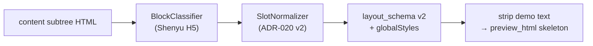
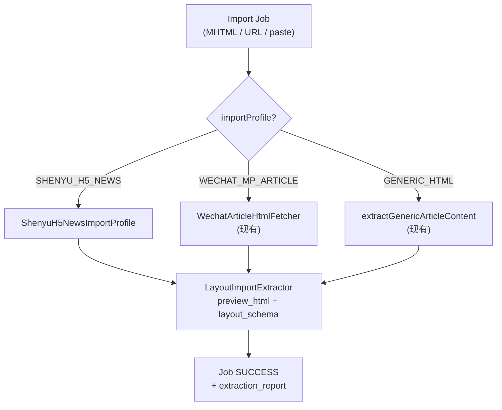

# ADR-029：M2 公推模板 — Shenyu H5 导入 Profile

| 字段 | 值 |
|------|---|
| 编号 | ADR-029 |
| 标题 | M2 公推模板库 — Shenyu H5（uni-app 资讯详情）导入 Profile |
| 状态 | **Accepted** |
| 日期 | 2026-09-09 |
| 决策人 | 产品 + 架构（OQ-M2-013-01~05 于 2026-09-09 闭合） |
| 关联 | ADR-019 · ADR-020 · ADR-027 · ADR-028 |
| 增量 Spec | `API-M2-Shenyu-H5导入增量.md`（import profile 参数与 extraction_report） |
| 建议 Slice | **S-21b**（一片一会话；见 §7） |

---

## 1. 背景

### 1.1 问题：神鱼体育-资讯详情（template 12 / 17）

运营从 **Shenyu H5**（`h5.shenyu.com` / `beta.h5.shenyu.com`）浏览器「另存为」离线 **MHTML**，经公推模板库 **导入向导** 创建模板 **「神鱼体育-资讯详情」**：

| 环境 | template id | 名称 |
|------|-------------|------|
| 本地 | **17** | 神鱼体育-资讯详情 |
| 测试 | **12** | 神鱼体育-资讯详情 |

样本文件：`神鱼体育.mhtml` — Shenyu H5 **uni-app 资讯详情页**（非微信公众号 DOM）。

**当前 generic 导入管线**（`WechatArticleHtmlFetcher.extractGenericArticleContent` → `LayoutImportExtractor`）产出 **错误 `layout_schema`**，导致：

| 症状 | 根因（prior analysis） |
|------|------------------------|
| 套用 / AI 排版后视觉与 H5 差距大 | `layout_schema` 骨架错误，非正文问题 |
| `preview_html` 含 `display:none` 等毒性样式 | 提取根节点为整页 shell，未 scoped 到正文 |
| `layout_schema` 出现 **11 个 `frame(image)`** | uni-app shell / tabbar / 占位图被当作正文图片块 |
| 含 `zp-paging` / refresher 外壳结构 | 列表容器 wrapper 未被剔除 |
| `style_css` 长度 ≈ **0**（无有效规则） | 样式来自 shell `<style>` / scoped attribute，未映射到 content  subtree |
| ADR-028 `TEMPLATE_GUIDED` 选该模板效果差 | AI 分段正确也救不了错误槽位/schema |
| ADR-027「一键排版 · 按模板」同理 | `LayoutMergeService.merge` 依赖 schema SSOT |

**结论**：神鱼体育 case 的阻塞点在 **导入 extraction**，不在 AI 排版算法本身。Prior analysis 建议 **短期** 引入 **Shenyu H5 专用 import profile**（本 ADR），而非先扩展 `layout_schema` v2 渲染器。

### 1.2 与既有 ADR 边界

| ADR | 关系 |
|-----|------|
| **ADR-019** | **继承** MHTML / URL / paste 导入入口；本 ADR **扩展** profile 分支，不替换 Job 模型 |
| **ADR-020** | **继承** 导入仅产出 `layout_schema` + `extraction_report`，**禁止**持久化样本正文为模板正文 |
| **ADR-027** | **修复** §4.2 导入高保真在 Shenyu H5 源的失效；`preview_html` 仍作视觉 SSOT |
| **ADR-028** | **解除阻塞**：`TEMPLATE_GUIDED` / 一键排版 `TEMPLATE` 依赖正确 schema；本 ADR **不修改** AI 分段管线 |

### 1.3 不在本 ADR 范围

- Shenyu H5 **方案详情**（`/pages/plan/planInfo`）、**专家主页** 等页面类型 — Phase 2 另立 profile
- 135 / 秀米 — ADR-027 Out of Scope
- `layout_schema` v2 **渲染器**增强（嵌套 section / 复杂装饰克隆）— Phase 2（见 §6.2）

---

## 2. 决策

### 2.1 引入 `importProfile`：`SHENYU_H5_NEWS`

在模板导入管线增加 **可显式指定、可自动推断** 的 **`importProfile`**（导入配置 Profile，**非** DB 租户 profile）。

| Profile 常量 | 适用来源 | 页面语义 |
|--------------|----------|----------|
| **`SHENYU_H5_NEWS`** | MHTML / URL 来自 `*.h5.shenyu.com` 且为 **资讯详情** | uni-app 资讯正文页 |
| **`WECHAT_MP_ARTICLE`**（既有） | `mp.weixin.qq.com` URL 抓取 / 微信 MHTML | 公众号文章 |
| **`GENERIC_HTML`**（默认） | paste HTML、未识别 MHTML、其他域名 | 现有 generic 行为 |

**命名说明**：Profile 描述 **提取规则包**，与 `dict_layout_template_source`（MANUAL / URL / DOCX / PASTE / MHTML）正交：

- `source_type` = **如何送达**（文件 / 链接 / 粘贴）
- `import_profile` = **如何解析 DOM**（微信 vs Shenyu H5 vs generic）

### 2.2 自动推断规则（MVP）

服务端在 Job 启动时按以下 **确定性** 顺序推断；用户可在导入向导 **覆盖**（见 API 增量）：

```
1. 请求显式 importProfile → 使用（校验 @InDict）
2. else sourceUrl / MHTML Snapshot-Content-Location host 匹配
     (h5|beta.h5).shenyu.com 且 path 含 /pages/ 且含 news|article|资讯 语义
     → SHENYU_H5_NEWS
3. else host = mp.weixin.qq.com → WECHAT_MP_ARTICLE
4. else → GENERIC_HTML
```

**MHTML 解析**：先从 `multipart/related` 取主 HTML part；`Content-Location` / 内嵌 URL 参与 host 推断。

**MHTML 自动推断增强**（`SHENYU_H5_NEWS`，OQ-M2-013-01 / OQ-M2-013-03）：

| 信号 | 条件 |
|------|------|
| Host | `Snapshot-Content-Location` 或内嵌 URL host 匹配 `(h5\|beta\.h5)\.shenyu\.com` |
| Path | URL path 含 `/pages/news/detail` 或 `newsDetail` |
| DOM（HTML part） | 存在 `uni-page` / `uni-page-body`，且含 `div.content` 或 `.w-92vw` 正文区；**不含**整页误判时可伴随 `zp-paging` shell（shell 不参与 root 选取） |

三项中 **host + path** 命中，或 **host + DOM** 命中 → 推断 `SHENYU_H5_NEWS`；用户可在向导覆盖。

### 2.3 `SHENYU_H5_NEWS` 提取规则（Extraction SSOT）

实现落点：新增 `ShenyuH5NewsImportProfile`（或 `LayoutImportProfile` 策略实现），**替代**该 profile 下对 `extractGenericArticleContent` 的全页解析。

#### 2.3.1 DOM 根节点（OQ-M2-013-01 · Accepted）

**推荐（架构）**：Shenyu H5 资讯详情以 **`div.content`** 为正文根；`神鱼体育.mhtml` 样本中正文标题、段落、配图均位于该节点内，页级 `zp-paging` / `uni-tabbar` 在其外。

**Fallback 选择器链**（按序尝试，首个命中且通过校验者即为 root；写入 `extraction_report.rootSelector`）：

| 优先级 | 选择器 | 说明 |
|--------|--------|------|
| **P0** | `div.content` | 主选；`class` 精确含 `content` 的 `div`（非任意 `.content` 后代） |
| **P1** | `[data-page="pages/news/detail"] div.content` | uni-app 页面 scope 内 `.content` |
| **P2** | `[data-page*="news/detail"] .content` | path 变体（query 参数不同） |
| **P3** | `uni-page-body div.content` | uni 页面 body 下正文容器 |
| **P4** | `uni-page-body .w-92vw` | 神鱼样本常见 92vw 宽正文 wrapper（无 P0~P3 时） |
| **P5** | `[data-page*="news/detail"] .w-92vw` | 页面 scope 内 92vw 正文区 |
| **P6** | `uni-page-body > div:not([class*="zp-"]):not(uni-tabbar)` | 取 **直接子 div** 中文本长度最大且 **无** `zp-paging` 祖先 的元素 |

**多候选消歧**（同一优先级命中多个节点时）：

1. 排除祖先链含 `zp-paging` / `uni-tabbar` / `uni-page-head` 的节点  
2. 取 **可见文本长度最大** 的候选  
3. 若仍并列，取 DOM 深度更浅者  

**失败**：整条链均无合法 root → Job **FAILED**，**2043**。

| 步骤 | 规则 |
|------|------|
| 1 | 按上表 P0→P6 顺序定位 root |
| 2 | 应用多候选消歧规则 |
| 3 | 后续所有提取 **限定在该 subtree** |

#### 2.3.2 Shell 剔除（黑名单）

自根节点向上/向下剔除，**不进入** schema / preview：

| 选择器 / 标记 | 说明 |
|---------------|------|
| `zp-paging`, `.zp-paging-*` | uni-app 分页列表外壳 |
| `.uni-scroll-view-refresher`, `.zp-scroll-view` | 下拉刷新壳 |
| `uni-page`, `uni-page-head`, `uni-tabbar` | uni-app 页面壳 |
| `[style*="display:none"]`, `[style*="display: none"]` | 毒性可见性（元素级剔除） |
| `script`, `style`（全局 shell） | 非 content-scoped 的不保留 |
| 宽高 ≤ 2px 的 spacer `img` | 占位图 |

#### 2.3.3 毒性样式过滤

写入 `globalStyles` / block inline / `style_css` 前：

| 规则 | 动作 |
|------|------|
| `display:none` / `visibility:hidden` / `opacity:0` | **丢弃**该声明 |
| `position:fixed` 且非 content 装饰 | **丢弃** |
| `-webkit-line-clamp` 等 H5 专有 | 保留（公众号兼容子集内） |
| scoped 样式（`data-v-*`） | 仅保留 **content subtree 内节点仍引用** 的规则 |

#### 2.3.4 图片 `frame(image)` 去重

| 规则 | 说明 |
|------|------|
| 仅统计 **content subtree** 内 `` | shell tabbar/icon **不计** |
| 同一 `src`（normalize 后）只生成 **1** 个 `frame(image)` | 避免 11 帧重复 |
| 连续段落间图片 | 按 DOM 顺序插入 `frame(image)` |
| 装饰性背景图（无 alt 且 ≤ 24×24） | 跳过或记入 `extraction_report.warnings` |

#### 2.3.5 CSS 作用域

| 输出 | 规则 |
|------|------|
| `style_css` | 从 MHTML 内联 `<style>` + content 节点 inline style 提取；**不得**为空（若为空 → `warnings` + 回退 content inline 聚合） |
| `preview_html` | ADR-027：消毒后 **完整正文 HTML**（content subtree + 必要 wrapper）；**不含** zp-paging shell |
| `layout_schema` | 见 §2.4 |

**与 generic 差异**：generic 路径保留 `WechatArticleHtmlFetcher.extractGenericArticleContent` **不变**；仅 `importProfile=SHENYU_H5_NEWS` 走本规则包。

### 2.4 `layout_schema` 归一化（`SHENYU_H5_NEWS`）

在 `LayoutImportExtractor.extractLayoutSchemaFromLayoutJson` 之前，对 content subtree 做 **Shenyu 语义归一化**：



| DOM 信号 | `layout_schema` 块 |
|----------|-------------------|
| 首个 `h1` / `.title` / 加粗大字单行 | `heading` level=1 |
| `h2`~`h3`、类名含 `subtitle`/`section-title` | `heading` level=2/3 |
| `p`、`.text`、无 class 的 `div` 文本块 | `slot` `slotKind=paragraph` `repeat:true` |
| `ul/ol` | `slot` `slotKind=list` |
| `blockquote` | `slot` `slotKind=quote` |
| content 内 `img`（去重后） | `frame(image)` |
| 赛事头 / 对阵行（类名或文本模式 `VS`/`vs`） | `slot` 自定义 + `styleRef`（MVP 映射为 `heading` level=2） |
| 推荐区（含「推荐」「竞彩」等关键词列表） | `slot` `slotKind=list` |

**铁律**（ADR-020）：

- schema blocks **不含**样本真实段落 `text`（仅 `demoText` 占位或空）
- `schema_version=2`
- `extraction_report` 记录：`profileUsed`、`rootSelector`、`imageFrameCount`、`warnings[]`、`degraded`

### 2.5 与 Generic MHTML / 微信导入的关系



| 路径 | 变更 |
|------|------|
| 微信 URL `import-url` | **无**；仍 `WECHAT_MP_ARTICLE` |
| 粘贴公众号 HTML | **无**；默认 `GENERIC_HTML` 或手动选 profile |
| Shenyu H5 MHTML / URL | **新增** `SHENYU_H5_NEWS` 分支 |
| 其他站点 MHTML | 仍 `GENERIC_HTML`（行为与现网一致） |

### 2.6 对 AI 排版与一键排版的影响

| 能力 | 影响 |
|------|------|
| **ADR-028 `TEMPLATE_GUIDED`** | 选用 template 12/17 时，LLM 分段 → `SegmentSlotMapper` → `LayoutMergeService` 基于 **修正后 schema**；**无需**改 AI API |
| **ADR-027 一键排版 · `TEMPLATE`** | 同上；`templateId` + schema merge |
| **ADR-027 一键排版 · `AUTO` / ADR-028 `AUTO`** | **无**直接依赖；仍走 football-layout 内置模板 |
| **正文保真** | ADR-020 铁律 **不变**；修复的是 **模板 SSOT**，非 `body` |

**验收标准（神鱼体育 case）**：同一正文对 template 17 **重新导入后**，`TEMPLATE_GUIDED` preview 的视觉与 H5 正文区 **可辨识一致**（允许 merge 阶段已知差距，见 ADR-027 §4.2 局限声明）。

### 2.7 错误码

| 码 | 常量 | 含义 |
|----|------|------|
| **2043** | `LAYOUT_IMPORT_PROFILE_ROOT_NOT_FOUND` | `SHENYU_H5_NEWS` root 选择器链 P0~P6 均未命中 |
| **2044** | `LAYOUT_IMPORT_MHTML_PARSE_FAILED` | MHTML multipart 解析失败 |
| **2045** | `LAYOUT_IMPORT_PROFILE_UNSUPPORTED` | 请求 `importProfile` 不在支持列表 |
| **2016** | （复用） | Job 不存在或已过期 |
| **1503** | （复用） | `importProfile` 字典值非法 |
| **1504** | （复用） | 跨租户 |

`extraction_report.warnings` **不**单独占错误码；Job 仍可 `SUCCESS` 但 UI 展示黄色警告（与 ADR-028 `mappingDegraded` 模式一致）。

### 2.8 字典

| dict_type | 新增值 | 说明 |
|-----------|--------|------|
| `dict_layout_import_profile` | `SHENYU_H5_NEWS`, `WECHAT_MP_ARTICLE`, `GENERIC_HTML` | 导入提取 profile |
| `dict_layout_template_source` | **`MHTML`** | 产品手册已支持 MHTML，API/字典补齐 |

---

## 3. Phase / MVP 范围

### 3.1 In Scope（MVP · Slice **S-21b**）

| # | 项 |
|---|-----|
| 1 | `importProfile` 请求字段 + 自动推断（§2.2） |
| 2 | `POST /layout-template/import-mhtml` 文档化并实现（与向导对齐） |
| 3 | `ShenyuH5NewsImportProfile` 提取规则包（§2.3） |
| 4 | `layout_schema` 归一化（§2.4）+ `extraction_report` 扩展 |
| 5 | 导入向导：Shenyu H5 MHTML 时展示 profile 推断结果 + warnings |
| 6 | **迁移**：template **12 / 17** **原地 re-import**（保留 id；OQ-M2-013-02） |
| 7 | `dict_layout_template_source.MHTML` seed（OQ-M2-013-04） |
| 8 | P0 测试：`神鱼体育.mhtml` 黄金样本 — image 帧 ≤ 正文图数、`style_css` 非空、无 `display:none` in schema |

**MVP 输入约束（OQ-M2-013-03）**：仅 **MHTML 文件**（运营从 `h5.shenyu.com` 浏览器另存为）；**不**实现直连 URL 抓取。`import-url` 可保留 `importProfile` 字段，但 Shenyu H5 URL 失败时 UX 引导 MHTML，不以 URL 作为 MVP 验收路径。

### 3.2 Out of Scope（MVP · S-21b）

| # | 项 | 归属 |
|---|-----|------|
| 1 | Shenyu H5 **方案详情** / 专家页 profile | ADR-029b 或 Phase 2 |
| 2 | 直连抓取 `h5.shenyu.com`（免 MHTML） | **S-21b 后 Phase 2**（反爬 / 登录态；OQ-M2-013-03） |
| 3 | 批量 re-import 全库 Shenyu 模板 | 运维脚本，非 MVP |
| 4 | AI 直接读 `preview_html` 绕过 schema | 违反 ADR-020 服务端渲染铁律 |
| 5 | 全页像素级 H5 clone 渲染器 | 非本 Profile 目标 |

### 3.3 Phase 2 跟进（已立项 · OQ-M2-013-05）

下列项 **不在 S-21b MVP**，但 **已纳入路线图与后续 Slice 范围**，不得静默无限 defer：

| Slice / 项 | 交付物 |
|------------|--------|
| **S-21b-2** · styleRef → preview HTML 片段克隆 | 导入或 merge 阶段：将 schema 块上 `styleRef` 映射回 `preview_html` 中对应 DOM 子树 HTML 片段；套用/AI 排版 apply 时保留赛事头、推荐区等装饰结构（ADR-027 §4.2 局限增强） |
| **S-21b-3**（可选）· Shenyu H5 URL 直连 | `import-url` + `SHENYU_H5_NEWS` 稳定抓取（登录态 / 反爬策略另 ADR） |
| ADR-029b | Shenyu H5 **方案详情** / 专家页独立 `importProfile` |

**S-21b-2 验收要点**：template 12/17 经 S-21b 修复 schema 后，对含 `styleRef` 的块（如对阵行、推荐区），apply 预览与 H5 正文区 **装饰结构可辨识**；仍允许 merge 阶段已知 typography 差距（ADR-027 §4.2 声明延续）。

---

## 4. 迁移与 Re-import（template 12 / 17）

### 4.1 策略（OQ-M2-013-02 · Accepted）

| 选项 | 决策 |
|------|------|
| 原地更新 vs 新建副本 | **原地 re-import 覆盖**（保留 template id **12 / 17** 及全部引用）；`layout_template_id` 审计不断裂 |
| 状态 | re-import 后保持原 `status`（ENABLED 仍为 ENABLED） |
| 备份 | re-import 前写入 `extraction_report.previousSchemaHash` 供回滚比对 |

### 4.2 操作路径（MVP 二选一，实现期择一）

**A. 向导 re-import（推荐运营）**

1. 导入向导 → MHTML → 上传 `神鱼体育.mhtml`
2. 确认 `importProfile=SHENYU_H5_NEWS`（自动推断）
3. Job 成功后 → **「覆盖已有模板」** → 选择 id **12 / 17**

**B. 管理端 re-extract API**

`POST /admin-api/oa/layout-template/{id}/re-extract`

```json
{
  "importProfile": "SHENYU_H5_NEWS",
  "sourceType": "MHTML",
  "mhtmlFileId": "temp-upload-uuid"
}
```

### 4.3 验收检查（神鱼体育-资讯详情）

| 检查项 | 期望 |
|--------|------|
| `layout_schema.blocks` 中 `frame(image)` 数量 | = 正文 `` 去重数（**非 11**） |
| `style_css` | 长度 > 0；含 content 相关字号/颜色 |
| `preview_html` | 无 `zp-paging`；正文可见 |
| `extraction_report.profileUsed` | `SHENYU_H5_NEWS` |
| AI `TEMPLATE_GUIDED` preview | 槽位映射 **无** 大面积 `mappingDegraded`（仍允许个别段落降级） |

---

## 5. 后果

| 层 | 变更 |
|----|------|
| 服务 | 新增 `LayoutImportProfile` 策略接口 + `ShenyuH5NewsImportProfile`；扩展 `LayoutImportExtractor` 入参 |
| API | `import-mhtml` + `importProfile`；可选 `re-extract`（见增量 Spec） |
| DB | `oa_layout_import_job.extraction_report` JSON 扩展；字典 seed |
| 前端 | 导入向导 profile 展示 / 覆盖；MHTML 分支对齐 API |
| 测试 | 黄金样本 `神鱼体育.mhtml` P0；template 12/17 回归 |
| AI 排版 | **无代码变更**；依赖 schema 修复后的集成回归 |

---

## 6. 备选方案（未采纳）

| 方案 | 弃用原因 |
|------|----------|
| 仅修 `layout_schema` v2 渲染器，不改导入 | 根因是错误 DOM 输入；渲染器无法猜 shell vs 正文 |
| LLM 从 `preview_html` 反推 schema | 不稳定；违反 ADR-020 确定性 merge |
| 神鱼体育 case 手工修 template 12/17 | 不可复现；下一篇资讯仍坏 |
| 统一加强 `extractGenericArticleContent` 启发式 | 误伤微信 / 通用 HTML；难维护 |
| ADR-028 AUTO 替代 TEMPLATE_GUIDED | 产品已选 DB 模板库路径；不解决模板库 SSOT |

---

## 7. 建议 Slice：**S-21b**

| 字段 | 值 |
|------|-----|
| Slice ID | **S-21b** |
| 目标 | Shenyu H5 资讯详情导入 Profile + template 12/17 迁移 |
| FR | FR-M2-005（导入管线增量） |
| 依赖 | S-14b（`layout_schema`）、S-21a（AI 排版集成回归）；**ADR-029 Accepted** ✅ |
| 后续 | **S-21b-2** styleRef 片段克隆（Phase 2 跟进，见 §3.3） |
| 工时 | 3~4 人日 |
| 优先级 | P0（神鱼体育模板阻塞 AI 排版验收） |

> **不在本 Slice 实现 ADR-028 本体**；S-21b 完成后对 S-21a 做 **P0 回归**（template 17 + `TEMPLATE_GUIDED`）。

---

## 8. 开放问题（已闭合）

| 编号 | 问题 | 决策 | 状态 |
|------|------|------|------|
| **OQ-M2-013-01** | `div.content` 是否为 Shenyu 资讯详情 **稳定** 根选择器 | **Accepted**：主选 `div.content`；fallback 链 P0~P6（§2.3.1）；MHTML 含 `h5.shenyu.com` + news/detail 标记时自动推断 `SHENYU_H5_NEWS` | ✅ Accepted |
| **OQ-M2-013-02** | re-import **原地覆盖** vs 新建 v2 模板 | **Accepted**：**原地 re-import 覆盖** template 12/17，保留 id（§4.1） | ✅ Accepted |
| **OQ-M2-013-03** | MVP 是否包含 **直连 h5 URL**（非 MHTML） | **Accepted**：**MHTML only** MVP；不验收 URL 直连 | ✅ Accepted |
| **OQ-M2-013-04** | `dict_layout_template_source` 新增 `MHTML` 是否在本 Slice 一并 seed | **Accepted**：**是**，与 `import-mhtml` 同 Slice seed | ✅ Accepted |
| **OQ-M2-013-05** | Phase 2 是否在 import 阶段做 **styleRef→preview 片段克隆** | **Accepted**：**是**；立项 **S-21b-2**，纳入路线图（§3.3），非静默 defer | ✅ Accepted |

---

## 9. Accept 条件

1. ✅ 产品批准本 ADR + `API-M2-Shenyu-H5导入增量.md`（2026-09-09）
2. ✅ OQ-M2-013-01~05 已闭合
3. ⏳ 黄金样本 `神鱼体育.mhtml` 提取结果评审通过（image 帧、style_css、zp-paging）— **实现后验收**
4. ⏳ S-21b TESTCASES P0 草案评审通过（实现前）
5. S-21b 实现代码在 ADR Accept **之后** 合并

---

## 10. 变更记录：结构保真修复（2026-09-09）

### 10.1 背景

用户反馈：template 17 选择后点击 **AI 排版预览**，效果与 `神鱼体育.mhtml` 原始视觉差距巨大：正文全部渲染为营销红字（`rgb(224,62,45)` 14pt）、图片丢失、章节序号徽章标题行/红框总结卡/黄色免责卡等装饰结构全部消失。

### 10.2 根因（4 项）

| # | 根因 | 位置 |
|---|------|------|
| 1 | `enrichGlobalStylesFromBlocks` 用 `putAll` 后写覆盖 → 文末营销段落样式污染 `globalStyles.paragraph` | `LayoutSchemaHelper` |
| 2 | `splitHtmlSegments` 不识别 `div` 容器 → flex 章节标题行、装饰卡被扁平化为散落段落；段落全部坍缩进首个 repeat slot，无 heading/fixed 块 | `LayoutJsonHelper` |
| 3 | `mergeSemantic` 无 `image` case（图片 segment 落 default 变文本段落），且完全不渲染 `divider/fixed` 装饰块 | `LayoutMergeService` |
| 4 | `aggregateInlineStyleHints` 只取第一个任意 inline 样本（容器 div 的 `font-family`）→ 产出空规则 `.content p,.content div{}`；另 `&quot;` 实体分号切断 `font-family` 声明产生 `"&quot"` 垃圾键 | `ShenyuH5NewsImportProfile` / `LayoutJsonHelper` |

### 10.3 修复内容（S-21b-2 部分落地）

| 文件 | 变更 |
|------|------|
| `ShenyuH5NewsImportProfile` | 新增 `normalizeStructureHtml`（仅作用于 schema 提取链路，`preview_html` 保持原 DOM）：flex 章节行→`h3`（序号徽章+粗体标题合并，保留标题样式）、居中图片容器→裸 `img`、带 background+border/padding 的文本装饰卡→`layout-fixed`（含图容器跳过以防丢图）；`aggregateInlineStyleHints` 改为 `<p>` 样本多数采样，无有效声明返回空 |
| `LayoutJsonHelper` | `splitHtmlSegments` 识别 `div.layout-fixed`；`segmentToBlock` 产出 v1 `fixed` 块（text+styles）；`renderBlock` fixed 输出固定文案；`attachInlineStyles` 将 style 值中 `&quot;` 还原为 `'` |
| `LayoutSchemaHelper` | v1 `fixed`→schema `fixed`（带文案、`styleRef:fixed`）；`enrichGlobalStylesFromBlocks` 改为**首个真实样本完整覆盖默认值、后续样本仅补缺**（隔离一次性营销样式污染）+ `&quot` 值过滤 |
| `LayoutMergeService` | `mergeSemantic` 补 `image` case（`isImageSegment` → `imageInstance`）；新增 `appendBracketingDecor`：schema 首个内容块前的 `divider/fixed` 渲染在输出头部、末个内容块后的渲染在尾部（fixed 带文案），中间装饰不对位跳过 |
| `LayoutImportExtractor` | `SHENYU_H5_NEWS` profile 在 v1 解析前调 `normalizeStructureHtml`；`extraction_report.structureNormalized` 标记 |
| 测试 | 修复 `ShenyuH5NewsImportProfileTest` 包声明（util→importprofile）；`countImageFrames` 改 public；`ShenyuMhtmlProbeTest` slotCount 上限 8→24（结构保真后合法增多） |

### 10.4 验证（黄金样本）

| 检查项 | 修复前 | 修复后 |
|--------|--------|--------|
| `layout_schema.blocks` | 1 slot + 6 frame 堆尾 | 8 heading（章节位穿插）+ 1 repeat slot + 6 frame（穿插）+ 1 fixed |
| `globalStyles.paragraph` | 营销红字 14pt | 15px `rgb(68,68,68)` 1.8 + 正确字体栈 |
| `globalStyles.heading3` / `fixed` | 默认值 / 无 | 18px bold `rgb(26,26,46)` / 淡红背景+红左边框 |
| `style_css` | 25 字符空规则 | `.content p{font-size:15px;color:rgb(68, 68, 68);line-height:1.8;}` |
| imageFrameCount | 6 | 6 |
| 定向测试 | — | LayoutImportExtractorTest / ShenyuH5NewsImportProfileTest / ShenyuMhtmlProbeTest 全绿 |

### 10.5 已知残留（延续 §3.3 / ADR-027 §4.2）

- 含图容器（尾部「添加小助理」引导区 + 黄色免责卡同容器）不转 fixed，降级为普通段落 + 图片，避免丢图；
- schema 中间的装饰块在 AI 语义模式不穿插（无对齐信息），仅首尾装饰生效；
- `styleRef → preview_html` 片段克隆（S-21b-2 完整体）仍未实现，本修复为 **schema 归一化 + merge 端装饰渲染** 的轻量替代，达成「可辨识一致」验收基线。

> 生效条件：后端重启 + template 17 re-import（§4.2 路径 A/B）。

### 10.6 E2E 验证与 trailing fixed 二次修复（2026-09-09 晚）

**E2E 结论**：全栈重启（新 JAR）+ template 17 re-import（import job 12，`overwriteTemplateId=17`）后，schema 即 §10.4 修复后结构（16 blocks、style_css 65 字符有效规则）；浏览器实测 AI 排版预览 5 检查点 4 PASS（正文 15px/1.8 黑灰、5 章节 18px bold 标题、frame 穿插、整体观感），2 个预置 GENERIC 模板回归正常。

**二次缺陷**（E2E 发现）：尾部淡红总结卡片仍不渲染。根因：`LayoutMergeService.CONTENT_BLOCK_TYPES` 将 `frame` 计入内容锚点，而神鱼 schema 尾序为 `[12]fixed → [13-15]frame`，`lastContent=15` 使 trailing 区间为空，`fixed[12]` 落入"中间装饰"被跳过。

**修复**：`frame`（optional 图片容器）移出 `CONTENT_BLOCK_TYPES`；新增 `LayoutMergeDecorTest`（trailing fixed 后置 frame、leading fixed 两用例）。**验证**：定向测试全绿；TEMPLATE_GUIDED 真实链路重放 `preview` 返回 blocks 含尾部 `fixed`（text=红框战绩总结）且渲染 HTML 含 `layout-fixed`。

> 注：`AUTO` 模式经 `FootballLayoutPipeline.resolve` 自动选模板（忽略指定 templateId），与本修复无关。

---

*Accepted · 2026-09-09*
