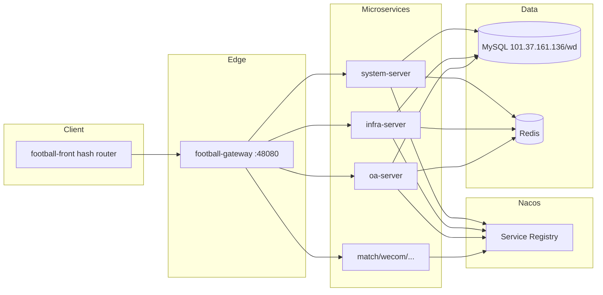

# ADR-047：Football × Ops 运营数据平台集成决策

| 字段 | 值 |
|------|---|
| 编号 | ADR-047-INT（与 [ADR-047-M4](./ADR-047-M4-平台账号凭证SSOT与Collector映射.md) 并列；文件名区分主题） |
| 标题 | Football SaaS 与 Ops 运营数据平台微服务集成 |
| 状态 | **Accepted** |
| 日期 | 2026-07-02 |
| 决策人 | 产品 / 架构（用户锁定） |
| 关联 | [ADR-003](./ADR-003-模拟鉴权与外部平台SSO对接.md) · [ADR-009](./ADR-009-API路径前缀分配.md) · [ADR-058](./ADR-058-OPS后端单仓与football-module-ops命名.md) · [INTEGRATION-S0-Football-Ops](../delivery/INTEGRATION-S0-Football-Ops.md) |
| 修订 | **§4.1 Superseded** — [ADR-058](./ADR-058-OPS后端单仓与football-module-ops命名.md)（2026-07-30：monorepo `football-module-ops`；终态 `ops-server` + `/admin-api/ops/**`） |

> **编号说明**：仓库内已有 ADR-047-M4（M10 采集凭证）。本 ADR 使用后缀 `-INT` 标识集成主题，文件名为 `ADR-047-Football-Ops平台集成决策.md`。

---

## 1. 背景

运营数据平台（Ops，`ops-platform-server` + `ops-platform-ui-vue`）需与 Football SaaS 基座（`football-backend-saas` + `football-front`）合并为统一产品。需在**不改动 Football 核心逻辑代码**的前提下，完成微服务注册、单库、鉴权与菜单集成。

---

## 2. 已锁定决策（6 项）

| # | 决策 | 说明 |
|---|------|------|
| D1 | **部署：直连微服务** | 采用 Nacos 服务发现 + Spring Cloud Gateway（端口 **48080**），**不走** monolith-first（`football-server` 聚合启动仅作本地参考，非集成目标） |
| D2 | **数据库：单库统一** | ~~全部业务表位于 MySQL **`101.37.161.136:3306/wd`**~~ → **Superseded by [ADR-050](./ADR-050-Ops与Football多库复用总纲.md) D1**（localhost 五库；远程单库暂保留至 cutover） |
| D3 | **M9：Football system 模块 SSOT** | 用户 / 角色 / 租户 / 菜单 / 权限以 **`football-module-system`** 为准；**废弃** Ops 侧 M9 用户/角色/租户页面与 API |
| D4 | **权限前缀：保留 `oa:*`** | 业务模块权限码不变（如 `oa:ip-group:list`）；写入 Football `system_menu.permission` / `system_role_menu`；与 Football 内置 `system:*` 并存。**过渡期仍有效**（[ADR-058](./ADR-058-OPS后端单仓与football-module-ops命名.md) D5：路径/服务先改名；`ops:*` 另 Slice） |
| D5 | **数据权限：OA 扩展规则** | 基于 Football `football-spring-boot-starter-biz-data-permission` 配置 OA 专属数据范围；**禁止**修改 `football-front/`、`football-backend-saas/` 内 Java/Vue **逻辑**代码 |
| D6 | **前端路由：沿用 Football 默认** | 使用 Football / Vben **hash 路由**（`createWebHashHistory`）；Ops 页面以子应用或路由挂载方式接入；**禁止**改 `football-front` 业务逻辑 |

---

## 3. 硬约束

| 约束 | 范围 |
|------|------|
| **禁止改逻辑** | `football-front/**` 下 `.vue/.ts/.tsx` 业务逻辑；`football-backend-saas/**` 下 `.java` 业务与框架逻辑 |
| **允许改配置/数据** | `application*.yaml`、`.env*`、Nacos 配置项、Gateway 路由 YAML、DB seed / Flyway、Nacos 注册数据 |
| **DB 目标** | `jdbc:mysql://101.37.161.136:3306/wd`（Ops `application-dev.yml` 已指向该实例） |
| **API 前缀** | ~~OA 业务 API 保持 `/admin-api/oa/**`~~ → **终态** `/admin-api/ops/**`（[ADR-058](./ADR-058-OPS后端单仓与football-module-ops命名.md)；过渡双路由见该 ADR §4；历史 [ADR-009](./ADR-009-API路径前缀分配.md)） |

---

## 4. 目标架构



### 4.1 模块边界：`football-module-oa`

> ⚠️ **Superseded by [ADR-058](./ADR-058-OPS后端单仓与football-module-ops命名.md)（2026-07-30）**  
> 本节「sibling `football-module-oa` + 禁止改 Football 根 POM」**废止**。目标态改为 monorepo **`football-module-ops`**（api/server）、Nacos **`ops-server`**、Gateway **`/admin-api/ops/**`**；OPS 数据源仍仅 **`wd`**。下文保留为历史决策原文。

| 层级 | 路径 | 职责 |
|------|------|------|
| **新建（目标）** | `wd/football-module-oa/` | 与 `football-backend-saas/` **平级**的独立 Maven 工程；含 `football-module-oa-api` + `football-module-oa-server` |
| **过渡（现状）** | `wd/ops-platform-server/ops-platform-module-oa/` | S1 可继续承载业务代码，通过 Nacos 以 **`oa-server`** 注册；S2+ 逐步迁移至 `football-module-oa` |
| **禁止** | 修改 `football-backend-saas/pom.xml` 的 `<modules>` 列表 | 不在 Football  monorepo 内新增 module 条目，避免触碰核心构建链 |

**选型理由**：在 `football-backend-saas` 内新增 `<module>football-module-oa</module>` 需改根 POM，且易与「不改 Football 核心」冲突。独立 sibling 工程引用 Football BOM（`football-dependencies`）即可复用 starter，仅通过 **Gateway 配置 + Nacos 服务名** 接入。

### 4.2 Gateway 路由（配置-only）

在 `football-gateway/src/main/resources/application.yaml`（或 Nacos `gateway-server-{profile}.yaml`）追加：

```yaml
# oa-server 服务（配置示例，S1 实施）
- id: oa-admin-api
  uri: grayLb://oa-server
  predicates:
    - Path=/admin-api/oa/**
  filters:
    - RewritePath=/admin-api/oa/v3/api-docs, /v3/api-docs
```

并在 `knife4j.gateway.routes` 增加 `oa-server` 文档聚合项。

现有路由注册位置：`football-gateway/src/main/resources/application.yaml` § `spring.cloud.gateway.server.webflux.routes`（system / infra / match / wecom 等已配置）。

### 4.3 单库连接配置

| 组件 | 配置项 | 目标值 |
|------|--------|--------|
| Ops OA（现状） | `spring.datasource.url` | `jdbc:mysql://101.37.161.136:3306/wd?...` |
| Football 微服务 | Nacos `system-server-dev.yaml` 等 | 统一改为同一 `wd` 库（**仅 Nacos/yaml 配置**，不改 Java） |
| Flyway | `ops-platform-module-oa` | 继续 `classpath:db/migration`；Football 侧表由 Football 自带迁移或已存在于 `wd` |
| 注意 | 凭证 | 开发凭证见 `application-dev.yml`；生产走 Nacos 加密 / 环境变量，**不得**提交生产密码 |

---

## 5. M9 废弃范围（Ops）

### 5.1 废弃（由 Football system-server 接管）

| 类型 | Ops 路径 / 组件 | Football 替代 |
|------|-----------------|---------------|
| API | `/admin-api/oa/system/user/**` | `/admin-api/system/user/**` |
| API | `/admin-api/oa/system/role/**` | `/admin-api/system/role/**` |
| API | `/admin-api/oa/system/tenant/**` | `/admin-api/system/tenant/**` |
| API | `/admin-api/oa/system/permission/**` | `/admin-api/system/menu/**` + 权限分配 |
| 前端 | `ops-platform-ui-vue`：`/system-user`、`/system-role`、`/system-tenant` | `football-front` 系统管理菜单 |
| 后端 | `UserController` / `RoleController` / `TenantController` / `PermissionController`（M9 核心） | 标记 `@Deprecated`，S2 移除 |
| DB | Ops 自建 `sys_user` / `sys_role` / `sys_tenant` 写路径 | 只读兼容期后停写；身份 SSOT 切至 Football `system_users` 等 |

### 5.2 保留在 OA 模块（非 M9 核心身份）

以下仍归属 **`oa-server`**，权限前缀仍为 `oa:*`：

| 功能 | 说明 |
|------|------|
| 系统参数 | `/admin-api/oa/system/param` |
| 业务字典 | `/admin-api/oa/dict/**`（ADR-006） |
| 操作 / 登录日志 | `/admin-api/oa/system/log/**` |
| 站内消息 | `/admin-api/oa/system/message/**` |
| 钉钉同步触发 | 调用 Football system API 或 OA 编排层（Phase 2 细化） |

### 5.3 鉴权衔接

- 登录 / Token：**Football system-server** 签发；Gateway 统一鉴权过滤器。
- Dev Token（ADR-003）：仅开发环境；权限仍从 DB 读取，**禁止**硬编码 userId/tenantId。
- Ops 业务 `@PreAuthorize("oa:...")` 保持不变；菜单导入时需同时写入 Football `system_menu`。

---

## 6. OA 数据权限扩展（不改 Football 框架 Java）

Football 通过 `football-spring-boot-starter-biz-data-permission` 提供部门 / 自定义数据范围。OA **不得**修改该 starter 与 `football-module-system` 内 Java。

### 6.1 允许的实现方式

| 方式 | 位置 | 说明 |
|------|------|------|
| **Starter 依赖** | `football-module-oa-server/pom.xml` | 引入 `football-spring-boot-starter-biz-data-permission` |
| **Customizer Bean** | `football.module.oa.framework.datapermission` | 新建 `@Configuration`，注册 `DeptDataPermissionRuleCustomizer` / 自定义 `DataPermissionRule` **Bean**（芋道标准扩展点） |
| **注解** | OA `Mapper` / `DO` | 使用 `@DataPermission` 声明表级规则 |
| **配置数据** | DB | `system_role_data_scope`、OA 扩展表（如 `oa_data_scope_rule`）存 IP 组 / 作者范围等业务规则 |
| **独立 Starter（可选）** | `wd/football-module-oa/football-spring-boot-starter-oa-data-permission` | 若规则复杂，封装 OA 专用 starter，仍不修改 Football 仓库 |

### 6.2 禁止

- 修改 `football-framework/football-spring-boot-starter-biz-data-permission/**`
- 修改 `football-module-system` 内 `PermissionService` / 数据权限 Service 源码
- Fork Football 框架类到 OA 后改包名覆盖 Bean（除非仅 copy 接口实现为新 Bean）

---

## 7. 前端集成策略

| 项 | 决策 |
|----|------|
| 壳 | `football-front`（hash 路由） |
| Ops 页面 | Phase 1：iframe / 微前端占位；Phase 2：Vue 组件迁入 football-front **views 目录**（仍算 football-front 变更 — 需单独 Slice 批准）；当前约束下优先 **独立构建 + Gateway 静态资源或子路径代理** |
| API Base | 统一 `VITE_GLOB_API_URL` → Gateway `http://{host}:48080` |
| 菜单 | 从 Ops `Layout.vue` + `router/index.ts` 提取映射表，写入 Football `system_menu` seed SQL |

---

## 8. 后果

### 正面

- 统一身份与租户模型，减少双套 M9 维护成本
- 微服务架构与 Football 现有 match/wecom 一致
- 单库消除跨库 JOIN / 事务问题

### 负面 / 风险

| 风险 | 缓解 |
|------|------|
| Flyway 版本冲突（Football vs OA） | 统一版本号段；集成 S0 冻结基线 |
| 双套 `sys_*` 表 | S1 做表归属清单；M9 表停写 |
| Ops 独立启动 8080 vs Gateway 48080 | S1 全面切 Gateway 入口 |
| `football-front` 已解压就位（`wd/football-front/`，Vben `apps/web-ele`） | S0 确认 hash 路由与 `apps/web-ele/.env*` 模板 |

---

## 9. Sign-off

| 角色 | 签名 | 日期 |
|------|------|------|
| 产品 | ☑ 用户锁定 | 2026-07-02 |
| 架构 | ☑ | 2026-07-02 |
