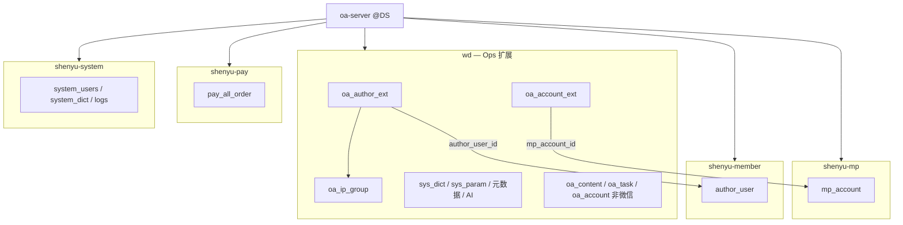

# ADR-050：Ops × Football 多库复用总纲

> **编号说明**：仓库内已有 [ADR-050-M4](./ADR-050-M4-采集Tab扫码登录.md)（M4 采集 Tab）。本 ADR 使用后缀标识 **多库集成总纲**，文件名为 `ADR-050-Ops与Football多库复用总纲.md`。

| 字段 | 值 |
|------|---|
| 编号 | ADR-050-INT-MULTIDB |
| 标题 | Ops 多库集成与 Football 表复用总纲 |
| 状态 | **Accepted**（2026-07-05，用户书面确认） |
| 日期 | 2026-07-05 |
| 决策人 | 架构 / 产品 |
| Supersedes | [ADR-047](./ADR-047-Football-Ops平台集成决策.md) **§2 D2**（单库 `wd`）、[ADR-049](./ADR-049-Ops与Football数据归属与松耦合集成.md) **§已确认 #1 作者部分、#4 平台账号（微信）** |
| 关联 | [ADR-051](./ADR-051-Ops与Football多库复用-作者域.md) · [ADR-050-REV1](./ADR-050-REV1-Football-G-RPC-Supersede.md) · [OPS-FOOTBALL-MULTI-DB-EXECUTION-PLAN](../delivery/OPS-FOOTBALL-MULTI-DB-EXECUTION-PLAN.md) · [OPS-FOOTBALL-MULTI-DB-REUSE-ANALYSIS](../delivery/OPS-FOOTBALL-MULTI-DB-REUSE-ANALYSIS.md) |
| 修订 | **§3.1 部分 Superseded** — [ADR-050-REV1](./ADR-050-REV1-Football-G-RPC-Supersede.md)（2026-07-28，G-* RPC 白名单） |

---

## 1. 背景

ADR-047/049 在 **单库 `101.37.161.136/wd`** 下完成 Football × Ops 集成（Gateway 58 路由、菜单 seed、P2b 订单只读）。Football 生产环境原生为 **四库分域**（member / mp / pay / system）。用户 2026-07-05 确认：

1. **配置留 Ops**（`wd` 内字典/参数/元数据/AI/大屏/SOP 模板等）
2. **业务以 Football 为准**（作者、微信公号、订单、平台字典/日志）
3. **wd 内业务 seed 均为测试数据，可 TRUNCATE**，不做 8↔35 作者映射或 app_id backfill

---

## 2. 数据原则（三条）

| # | 原则 | 说明 |
|---|------|------|
| P1 | **配置 SSOT = `wd`** | `sys_dict_*`（业务 `dict_*`）、`sys_param`、元数据、阈值、AI、大屏、SOP 模板、Flyway |
| P2 | **业务 SSOT = Football 四库** | `author_user`、`mp_account`、`pay_all_order`、`system_*`（身份/平台字典/日志） |
| P3 | **测试数据可弃** | wd B/C 组实例表 TRUNCATE；新建业务直接引用 Football ID 空间 |

---

## 3. 决策

| # | 决策 | 说明 |
|---|------|------|
| D1 | **localhost 五库拓扑** | `wd`（Ops 扩展）+ `shenyu-member` + `shenyu-mp` + `shenyu-pay` + `shenyu-system`；**远程 101.37.161.136 不在本期变更范围** |
| D2 | **微信公号 = `mp_account` + `oa_account_ext`** | SSOT 在 mp 库；Ops 扩展表存 M4 资产链字段；**不写** wd `oa_account` 微信行 |
| D3 | **作者 = `author_user` + `oa_author_ext`** | ext PK = `author_user_id`；**停写/弃用** `oa_author`；见 ADR-051 |
| D4 | **字典双轨** | 平台/infra → `system_dict_*`；Ops 业务 `dict_*` → `wd.sys_dict_*` |
| D5 | **`sys_param` 留 wd** | 菜单「运营参数配置」归配置管理（ADR-049 D3 不变） |
| D6 | **日志/消息读 Football** | UI 留 Ops 壳；数据源 S3 切 `@DS("system")` + Adapter |
| D7 | **订单跨库只读** | `@DS("pay")` 读 `pay_all_order`；禁止 ETL 至 `oa_order` |
| D8 | **无跨库事务** | 应用层 Saga + `sync_status` + 对账 job |
| D9 | **Flyway 仅跑 wd** | Football 四库 schema 由 `docs/sql/*.sql` 导入维护 |
| D10 | **不改 Football 业务代码与逻辑** | 见 **§3.1**；ADR-047 D5/D6 延续 |

### 3.1 硬约束：不改 Football 业务代码与逻辑

> **2026-07-05 用户原则**：多库集成**全部在 Ops 侧完成**；Football 业务微服务保持只读 SSOT 或既有 API，**不得**为其多库改造而改业务代码。  
> **2026-07-28 修订**：[ADR-050-REV1](./ADR-050-REV1-Football-G-RPC-Supersede.md) **有限 Supersede** 本节 — 仅允许 MUST-HAVE §7 白名单 **G-SYS / G-DICT / G-MEM / G-MP / G-PAY / G-DING** RPC 扩展；OPS Phase C Feign 切轨合法；**其余 Football 业务代码仍禁止改**。

| 范围 | 允许 | 禁止 |
|------|------|------|
| **`football-backend-saas/**` 业务模块** | — | 修改 member-server、mp-server、pay-server、system-server 的 **业务代码与逻辑** |
| **Gateway 集成基建** | **已完成的**路由、超时等配置 — **冻结**，不再新增改动 | 为 Ops 适配而扩展 Football 业务 API |
| **`football-front` 壳层** | Ops 挂载、路由、依赖链接（**集成层**，非 Football 业务逻辑） | 修改 Football 原生业务页面/Store/Service 逻辑 |
| **Ops 侧（改造面）** | `oa-server` 多数据源、`@DS` Adapter、写时 sync；`wd` Flyway 扩展表（`oa_*_ext` 等） | — |
| **读 Football 数据** | `oa-server` `@DS("member"\|"mp"\|"pay"\|"system")` 只读跨库；或 Feign 调 **既有** Football API | 要求 Football 侧新增/改接口以配合 Ops |

**一句话**：Football 四库 + 既有 API = SSOT；Ops 用 Adapter/扩展表/只读跨库 **包一层**，不反向改 Football。

### 3.2 验收约束（GATE-MDB-S0～S4）

| 项 | 约束 |
|----|------|
| **唯一 Gate 路径** | `start-integration-all.ps1` → Football UI **`http://localhost:5777`** · 登录 **admin/admin123** · 租户 **1** → Ops hash `#/ops/...` **实际操作** |
| **回归基线** | `run-uat-football-e2e.ps1` · Playwright `uat-football-ops-login.spec.ts`（`@uat-football`）**58/58 路由 PASS** |
| **阶段签收** | 各阶段人工场景见 [OPS-FOOTBALL-MULTI-DB-EXECUTION-PLAN §0.6](../delivery/OPS-FOOTBALL-MULTI-DB-EXECUTION-PLAN.md#06-验收总则强制-gate) |
| **辅助手段** | API curl · row count SQL · `@DS` smoke — **不可单独判定 Gate PASS** |
| **非 Gate** | standalone `ops-platform-ui-vue :3000` · `start-ops-standalone.ps1` — 仅开发参考 |

---

## 4. localhost 多数据源拓扑

| 数据源名 | JDBC 库 | 用途 |
|----------|---------|------|
| `master`（默认） | `wd` | Flyway、Ops 业务表、扩展表 |
| `member` | `shenyu-member` | 作者 SSOT |
| `mp` | `shenyu-mp` | 微信公众号 SSOT |
| `pay` | `shenyu-pay` | 订单只读 |
| `system` | `shenyu-system` | 身份/平台字典/日志 |

---

## 5. 与 ADR-047/049 关系

| 原文档 | 处理 |
|--------|------|
| ADR-047 D2 单库 | **Superseded** — 本地 dev 改五库；远程单库暂保留至 S4 cutover |
| ADR-049 D2 字典 | **部分修订** — 双轨（平台 Football / 业务 wd） |
| ADR-049 已确认 #1 作者 | **Superseded** — `author_user` SSOT + ext |
| ADR-049 已确认 #4 平台账号 | **部分修订** — 微信 mp+ext；非微信仍 wd |
| ADR-049 D5 同库只读订单 | **实现变更** — 改 `@DS("pay")`；原则（只读、无 ETL）保留 |
| ADR-047 D1/D3/D4/D5/D6 | **不变** |

---

## 6. 迁移与回滚

| 动作 | 说明 |
|------|------|
| S0 TRUNCATE | `scripts/integration-config/s0-wd-truncate-testdata.sql`（**仅 localhost/wd**） |
| IP 组 skeleton | `s0-wd-ip-group-skeleton.sql`（1 大组 + 2 小组） |
| V131 | 修订 `oa_author_ext` PK + 建 `oa_account_ext` |
| **V132** | **S4** DROP `oa_author` + wd 内 `author_user`/`pay_*` 副本（localhost ✅ 2026-07-05） |
| 回滚 | TRUNCATE 前 `mysqldump wd`；Flyway 不支持 down — 从备份 restore |

---

## 7. 后果

- 执行计划：[OPS-FOOTBALL-MULTI-DB-EXECUTION-PLAN.md](../delivery/OPS-FOOTBALL-MULTI-DB-EXECUTION-PLAN.md)
- Gate：**GATE-MDB-S0**～**GATE-MDB-S4**（见 MASTER-EXECUTION-TRACKER §19）；**S4 ✅ 2026-07-05** · E2E 58/58 · V132 cutover
- P2b `FootballPayAllOrderReadMapper` → `@DS("pay")` ✅ S3
- 集成 overlay / Nacos 分库化 → `mdb-s4-nacos-matrix.md`（localhost ✅；远程待批）

---

## 8. 不在本期

- 远程 101.37.161.136 库结构变更
- Football 业务微服务代码修改（§3.1 **除** [ADR-050-REV1](./ADR-050-REV1-Football-G-RPC-Supersede.md) G-* 白名单；gateway 已冻结集成基建除外）
- 历史 seed 映射 / backfill
- M10 采集全量（Phase 2）

---

## 9. 变更记录

| 日期 | 作者 | 说明 |
|------|------|------|
| 2026-07-05 | Agent | 初稿；用户确认数据原则 + localhost TRUNCATE + Accepted |
| 2026-07-05 | Agent | §3.1 硬约束：不改 Football 业务代码与逻辑（Ops 侧改造 + gateway 冻结例外） |
| 2026-07-05 | Agent | §3.2 验收约束：GATE-MDB-S0～S4 强制 Football :5777 UI 签收 |
| 2026-07-28 | Agent | §3.1 部分 Superseded — ADR-050-REV1（G-* RPC 白名单；D-ADR-050 选项 C） |
