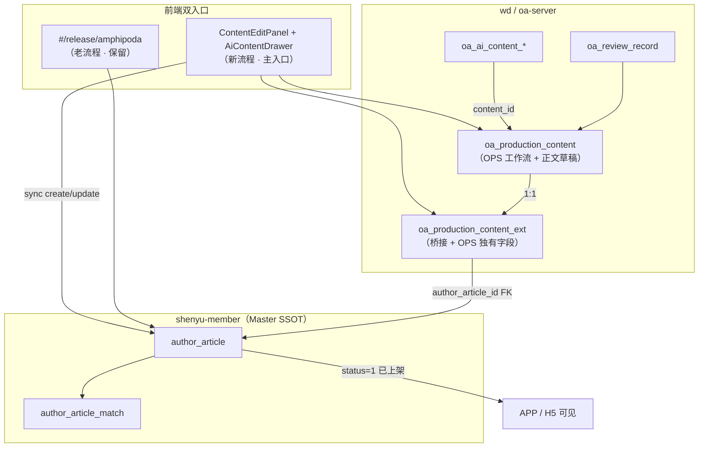

# ADR-054：OPS 内容生产 × Football 发布方案主表合并

| 字段 | 值 |
|------|---|
| 编号 | ADR-054 |
| 标题 | OPS 内容生产与 Football `author_article` Master + Extension 合并 |
| 状态 | **Accepted**（2026-07-18，用户书面确认过渡架构） |
| 日期 | 2026-07-18 |
| 决策人 | 架构 / 产品 |
| 关联 | [ADR-050](./ADR-050-Ops与Football多库复用总纲.md) · [ADR-051](./ADR-051-Ops与Football多库复用-作者域.md) · [ADR-053](./ADR-053-M2-AI内容对话生成.md) · [OPS-CONTENT-SCHEME-MERGE-ANALYSIS](../delivery/OPS-CONTENT-SCHEME-MERGE-ANALYSIS.md) §13 |

---

## 1. 背景

Football **发布方案**（`author_article`，`#/release/amphipoda`）与 OPS **内容生产**（`oa_production_content` + AI 对话）当前双轨运行。产品要求：

1. **Football 方案表为 C 端 SSOT**（上架后 APP/H5 可见）
2. **OPS 保留 SOP / 二级审核 / AI 工作流**
3. **双入口并存**：老 amphipoda 独立新建 + 新 OPS 内容生成同步同表
4. **不改 Football 业务代码**（ADR-050 §3.1）

本 ADR **Supersedes** `OPS-FOOTBALL-合并规划` §3「内容生产不合并」，采用与 ADR-051 作者域一致的 **Master + Extension** 模式。

---

## 2. 决策摘要

| # | 决策 | 说明 |
|---|------|------|
| D1 | **`author_article` = 发布方案 Master** | 标题、正文、售价、玩法、上架态等 C 端字段 SSOT |
| D2 | **`oa_production_content_ext` = OPS Extension** | 桥接 `production_content_id` ↔ `author_article_id`；存 OPS 独有维度 |
| D3 | **`oa_production_content` 保留** | OPS 审核态、任务、AI、版式等**不变**；`status` 枚举**不修改** |
| D4 | **OPS create 时双写 Football 草稿** | 同步创建 `author_article`（`status=-1`）；失败**不阻断** OPS create |
| D5 | **双 status 分轨** | OPS `oa_production_content.status` = 工作流；Football `author_article.status` = **上架状态** |
| D6 | **售卖字段迁入 ContentEditPanel** | `price`、`privilegeTypes`、`refundType` 等在 OPS 编辑页维护并 sync 至 Master |
| D7 | **OPS 双正文字段** | `paid_body`（付费内容）+ `free_body`（免费内容）**独立存储**于 `oa_production_content`（或 ext）；**正式方案可同时有付费与免费** |
| D8 | **AI 采纳：用户选择目标列** | 用户从 AI 生成片段**手动选择**写入 `paid_body` 或 `free_body`；**禁止**仅凭 `documentType` 自动映射 |
| D9 | **Football sync 正文规则** | OPS `paid_body` → `author_article.content`；OPS `free_body` → `author_article.free_content`；**两列可同时非空** |
| D10 | **可选 Football 字段：预设默认 / NULL** | Phase 1–4 **不要求** `matchScheme`；有 Football 默认值的字段用预设，无默认则 NULL（见 §8.5） |
| D11 | **`matchScheme` Out of Scope** | Phase 1–4 **不实现**；待产品明确要求后再 Slice |
| D12 | **全部改造在 Ops 侧** | oa-server + wd Flyway + football-front OPS 视图；**不改** member-server |

---

## 3. 目标架构

### 3.1 架构图



### 3.2 数据归属原则

| 数据类 | 存储位置 | 读写方 |
|--------|----------|--------|
| C 端发布（标题、付费/免费正文、售价、玩法、上架态） | `author_article` | sync 写 / Football 读 |
| OPS 工作流（DRAFT、PENDING_*、REJECTED…） | `oa_production_content.status` | OPS 独占 |
| OPS 付费/免费正文（编辑 SSOT 至 sync） | `oa_production_content.paid_body` / `free_body` | OPS 独占；sync → Master |
| OPS 运营（IP 组、任务、schemeTypes、competitionId、AI 会话） | `oa_production_content` + `ext` | OPS 独占 |
| 桥接与同步元数据 | `oa_production_content_ext` | OPS 写 |

**禁止**长期双写 `title/body` 至两库不一致：以 **sync 事件**（create / update / 审核通过）单向 OPS → Football，直至上架。

---

## 4. 扩展表 `oa_production_content_ext`

| 列 | 类型 | 说明 |
|----|------|------|
| `id` | BIGINT PK | |
| `tenant_id` | BIGINT NOT NULL | 租户隔离 |
| `production_content_id` | BIGINT **UK** NOT NULL | → `oa_production_content.id` |
| `author_article_id` | BIGINT UK NULL | → `author_article.id`；create 双写成功后回填 |
| `ip_group_id` | BIGINT | 冗余查询 |
| `task_id` | BIGINT NULL | |
| `scheme_types` | VARCHAR(256) | OPS `dict_scheme_type` 逗号分隔（**不写入** `author_article`） |
| `competition_id` | VARCHAR(64) | OPS 外部 scheduleId |
| `competition_name` | VARCHAR(128) | |
| `sync_football_at` | TIMESTAMP NULL | 最后一次 sync 成功时间 |
| `football_sync_error` | VARCHAR(512) NULL | 失败原因 |
| `source` | VARCHAR(32) DEFAULT `'OPS'` | 来源：`OPS` / `AMPHIPODA_LEGACY`（见 §7） |
| audit | creator/create_time/updater/update_time/deleted | 标准 |

> **区分键**：`production_content_id IS NOT NULL` ⇒ 新 OPS 流程；老 amphipoda 纯 Football 行 **无 ext 行**（或 `production_content_id` 为空且 `source=AMPHIPODA_LEGACY` 若后续批量标记）。

### 4.1 OPS 双正文字段（`oa_production_content`）

Phase 1 Flyway **新增**（列名实现时可二选一，语义固定）：

| 列名（推荐） | 备选 | 类型 | 说明 |
|--------------|------|------|------|
| `paid_body` | `content_body` | TEXT | **付费内容**（富文本/HTML）；sync → `author_article.content` |
| `free_body` | `free_content_body` | TEXT NULL | **免费内容**（富文本/HTML）；sync → `author_article.free_content` |

**迁移**：存量 `body` / `layout_html` 回填至 `paid_body`；`free_body` 默认 NULL。`body` 列可保留只读兼容或 deprecate（P2 实现时定）。

**原则**：OPS **独立维护**付费与免费两栏；`documentType=OFFICIAL_PLAN`（正式方案）**不排斥** `free_body` 非空——与 Football amphipoda 行为一致。

---

## 5. 双 Status 分轨

### 5.1 OPS 工作流状态（**保持不变**）

来源：`dict_content_status` / `oa_production_content.status`

| 值 | 含义 |
|----|------|
| `DRAFT` | 草稿 |
| `PENDING_FIRST_REVIEW` | 待一级审核 |
| `PENDING_SECOND_REVIEW` | 待二级审核 |
| `REJECTED` | 已驳回 |
| `PUBLISHED` / `FORMALLY_PUBLISHED` / … | OPS 侧发布态（微信等，与 Football 上架**独立**） |
| `COMPLETED` | 任务完成 |

**本 ADR 不新增、不修改** OPS status 枚举。

### 5.2 上架状态（Football Master）

来源：`author_article.status`（int）

| 值 | 含义 | UI 标签 |
|----|------|---------|
| `-1` | 草稿 | 草稿 |
| `0` | 已下架 | 已下架 |
| `1` | 已上架 | **已上架**（APP/H5 可见） |
| `2` | 审核中 | 审核中 |
| `3` | 预约发布 | 预约发布 |
| `4` | 审核不通过 | 审核不通过 |

### 5.3 UI 呈现（ContentEditPanel）

| 字段 | 数据源 | 可编辑 |
|------|--------|--------|
| 审核状态 | `oa_production_content.status` | OPS 工作流按钮（提交审核等） |
| **上架状态** | `author_article.status` | 只读展示 +「上架/下架」操作调 Football API（或 sync 后 member update） |

两字段**同屏分开展示**，禁止合并为一个下拉。

---

## 6. OPS 双正文与 AI 采纳 → Football 同步

### 6.1 OPS 存储（Approved）

| OPS 字段 | UI 标签 | Football 目标列 | 说明 |
|----------|---------|-----------------|------|
| `paid_body` | **付费内容** | `author_article.content` | 正式方案主文案；可与 `free_body` **同时非空** |
| `free_body` | **免费内容** | `author_article.free_content` | 预览/引流文案；正式方案也可填写 |

> **命名澄清**：「正式方案」= `dict_document_type.OFFICIAL_PLAN`，**不是** `dict_scheme_type`。`documentType` 仅影响 AI 生成上下文与 SOP，**不决定**正文写入哪一列。

### 6.2 AI 采纳：用户选择目标列（Approved）

**禁止**仅凭 `documentType` 自动映射至付费或免费。

| 步骤 | 行为 |
|------|------|
| AI 生成 | 多段/多版本候选（ADR-053） |
| 用户采纳 | AiContentDrawer 提供 **「写入付费内容」** / **「写入免费内容」**（或片段级勾选后合并写入） |
| 写回 OPS | 更新 `paid_body` 和/或 `free_body`（消毒后 HTML） |
| sync | `FootballArticleBridgeService.syncDraft` 分别映射两列 |

```
AiContentDrawer.adopt(target: PAID | FREE | BOTH)
  → ContentEditPanel 更新 formData.paidBody / formData.freeBody
  → save/update oa_production_content (paid_body, free_body)
  → FootballArticleBridgeService.syncDraft
      author_article.content      = sanitize(paid_body)   // 可为空串但不删列策略见 §6.3
      author_article.free_content = sanitize(free_body)   // 可为空
```

### 6.3 Football sync 与 Update 策略

| 场景 | 行为 |
|------|------|
| OPS 保存草稿 | `paid_body` → `content`；`free_body` → `free_content`；**分列独立覆盖** |
| 仅改付费栏 | 只 sync `content`；**不清空**已有 `free_content`（除非 OPS `free_body` 显式清空） |
| 仅改免费栏 | 只 sync `free_content`；**不清空**已有 `content` |
| 用户已在 amphipoda 手改售卖 | OPS sync 正文 + 标题；**不覆盖** OPS 表单未改的 `price` / `privilege_types` / `refund_type` |
| `match_scheme` | Phase 1–4 **不同步、不校验**；保持 NULL 或 amphipoda 手填值 |

---

## 7. 双入口并存

### 7.1 入口对比

| 维度 | 老流程 `#/release/amphipoda` | 新流程 OPS 内容生成 |
|------|------------------------------|---------------------|
| 创建 | 直接 `POST /member/article/create` | OPS create → 双写 `author_article` 草稿 |
| ext 行 | **无**（`production_content_id` 不存在） | **有**，`production_content_id` NOT NULL |
| OPS 审核 | 无 | 有（`oa_review_record`） |
| AI 对话 | 无 | 有（ADR-053） |
| 玩法选择 | amphipoda 原生 UI | Phase 1–4 **Out of Scope**；可选跳转 amphipoda（非阻塞） |
| 上架 | Football `status=1` | 同上（同一 `author_article` 行） |
| APP/H5 | `status=1` 后可见 | 同上 |

### 7.2 区分逻辑（列表 / 报表）

```sql
-- 新 OPS 流程
SELECT * FROM oa_production_content_ext WHERE production_content_id IS NOT NULL;

-- 纯 Football 老流程（无 OPS 内容）
SELECT aa.* FROM author_article aa
LEFT JOIN oa_production_content_ext ext ON ext.author_article_id = aa.id
WHERE ext.id IS NULL;
```

可选：amphipoda 新建成功后写 ext（`source='AMPHIPODA_LEGACY'`, `production_content_id=NULL`）便于统一列表——**P5 可选**，非 P0 阻塞。

---

## 8. ContentEditPanel 迁入字段（来自 amphipoda）

### 8.1 P3 正文双栏（Approved）

| OPS 字段 | UI 标签 | sync 目标 | 说明 |
|----------|---------|-----------|------|
| `paid_body` | **付费内容** | `author_article.content` | 富文本编辑器；必填策略按 `contentType` / SOP |
| `free_body` | **免费内容** | `author_article.free_content` | 富文本编辑器；**可选**；正式方案可填 |

### 8.2 P4 必迁售卖字段（Approved）

| Football 字段 | UI 标签 | DB 列 | 默认 / 校验 |
|---------------|---------|-------|-------------|
| `price` | 售价 | `price` | 默认 `88`；≥0；预设 88/128/168/208 |
| `privilegeTypes` | 是否同步至套餐 | `privilege_types` | 默认 `['2']` 不同步 |
| `refundType` | 优惠策略 | `refund_type` | 默认 `0`；选不中补券需 `compensateCouponId` |
| `intro` | 精彩简介 | `intro` | 可选；max 50 |
| `sortNum` | 排序 | `sort_num` | 默认 `0` |

### 8.3 P4 只读展示

| 字段 | UI 标签 | 说明 |
|------|---------|------|
| `author_article.status` | **上架状态** | §5.2 |
| `author_article.id` | 方案 ID | 便于跳转 amphipoda / 方案列表 |

### 8.4 Out of Scope — Phase 1–4（Approved）

| 字段 | UI 标签 | 策略 |
|------|---------|------|
| `matchScheme` | 比赛玩法 JSON | **不实现**；待产品明确要求后新 Slice；sync 时 **NULL** |
| `matchType` | 赛事类型（竞足/传足/北单…） | **不阻塞** OPS 流程；create 时可选预设 `1`（竞足）或 NULL |

**可选（非阻塞）**：ContentEditPanel 保留「在 amphipoda 完善玩法」外链 → `#/release/amphipoda?articleId=&fromContentId=`，**不上架前强制校验** `matchScheme`。

### 8.5 Football 可选字段预设（Phase 1–4 sync 默认）

原则：**Football 有 DB/UI 默认值的字段 → 用预设；无默认 → NULL/空，不臆造。**

| Football 字段 | sync 预设 | 说明 |
|---------------|-----------|------|
| `price` | `88` | amphipoda 同款默认 |
| `privilege_types` | `'2'` | 不同步至套餐 |
| `refund_type` | `0` | 无优惠 |
| `status` | `-1` | 草稿 |
| `sort_num` | `0` | |
| `match_type` | `1`（竞足）或 **NULL** | 可选；不阻塞 create |
| `match_scheme` | **NULL** | Out of Scope；amphipoda 可后续手填 |
| `content` / `free_content` | 来自 OPS `paid_body` / `free_body` | 分列 sync；可同时非空 |

### 8.6 不迁入 OPS 表单（Football 独占）

高级售卖：`visibleType`、`publishType`、`orderDeadline`、`tagIds`、`maxSaleCount` 等——仍由 amphipoda 或 P5 嵌入处理。

---

## 9. Sync 边界（create / update）

### 9.1 OPS create 时自动 sync → Football 草稿

| Football 字段 | 来源 | 备注 |
|---------------|------|------|
| `author_id` | OPS `authorId` | ADR-051 语义 |
| `title` | OPS `title` | 截断 35 字 + Football 字符集校验 |
| `content` | OPS `paid_body` | HTML 消毒；可为空仅当 OPS 未填 |
| `free_content` | OPS `free_body` | HTML 消毒；可为 NULL |
| `status` | `-1` | 草稿（§8.5） |
| `price` | 表单或 `88` | §8.5 |
| `privilege_types` | 表单或 `'2'` | §8.5 |
| `refund_type` | 表单或 `0` | §8.5 |
| `sort_num` | 表单或 `0` | §8.5 |
| `tenant_id` | OPS tenant | |
| `match_type` | `1` 或 NULL | 可选预设；不阻塞 |
| `match_scheme` | **NULL** | Out of Scope Phase 1–4 |

### 9.2 失败策略

| 事件 | 行为 |
|------|------|
| Football sync 失败 | OPS create **成功**；ext.`football_sync_error` 记录；UI 提示「方案同步失败，可重试」 |
| 重试 | `POST /oa/content/{id}/sync-football-scheme` 幂等（按 `production_content_id`） |

---

## 10. 实现分期（P0–P5）

| 阶段 | 目标 | 交付物 | 依赖 |
|------|------|--------|------|
| **P0** | 架构冻结 | 本 ADR + 更新 MERGE-ANALYSIS 状态 | 用户确认（✅） |
| **P1** | 数据面 | Flyway `oa_production_content_ext`；存量 `oa_production_content` 回填 ext；`oa_ai_content_*` 可选增 `author_article_id` | P0 |
| **P2** | 桥接服务 | `FootballArticleBridgeService`；create/update 双写草稿；`GET/POST .../sync-football-scheme`；mock-member article API 增强 | P1 |
| **P3** | UI 最小闭环 | 付费/免费双栏 + 上架状态 + sync 状态；AI adopt 用户选列 → sync | P2 |
| **P4** | 售卖字段 OPS 化 | price/privilegeTypes/refundType/intro/sortNum；双正文 sync §6 | P2 |
| **P5** | 收敛与回归 | 双入口列表统一；权限/菜单；Gate M2 P0 + Football 发布冒烟；存量 LEGACY_STUB 标记 | P3–P4 |

**Out of P0–P5（后续 Slice）**：`matchScheme` / 玩法内嵌、高级售卖字段 OPS 化、`AMPHIPODA_LEGACY` ext 回填。

---

## 11. 分层变更清单（无 Football 业务代码改动）

### 11.1 DB（wd Flyway）

| 动作 | 说明 |
|------|------|
| **NEW** `Vxxx__production_content_ext.sql` | §4 表结构 |
| **ALTER** `oa_production_content` | 新增 `paid_body`、`free_body`（§4.1）；存量 `body`/`layout_html` → `paid_body` 回填 |
| **ALTER** `oa_ai_content_adopt` / `session` | 可选 `author_article_id` 可空 |
| **BACKFILL** | 每条 `oa_production_content` INSERT ext（`author_article_id=NULL`） |
| **NO** member 库 DDL | ADR-050 §3.1 |

### 11.2 Backend（oa-server）

| 动作 | 说明 |
|------|------|
| **NEW** `OaProductionContentExtDO` + Mapper | |
| **NEW** `FootballArticleBridgeService` | `@DS("member")` 或 Feign → `/member/article/create|update` |
| **ALTER** `ProductionContentServiceImpl` | create/update 后 trigger syncDraft |
| **NEW** `POST /oa/content/{id}/sync-football-scheme` | 幂等重试 |
| **NEW** `GET /oa/content/{id}/football-scheme` | Master + ext 组装 VO（含上架状态） |
| **ALTER** `AiContentServiceImpl.adopt` | adopt 后可选 trigger sync |
| **NEW** VO 字段 | `shelfStatus`（int）、`authorArticleId`、`footballSyncError` |
| **KEEP** `/oa/ai-content/*` | ADR-053 契约不变 |

### 11.3 Frontend（football-front OPS 视图）

| 动作 | 说明 |
|------|------|
| **ALTER** `ContentEditPanel.vue` | 付费/免费双栏 §8.1；上架状态只读；售卖字段 §8.2；sync 状态/重试 |
| **ALTER** `AiContentDrawer.vue` | adopt 时用户选择 PAID/FREE 目标列；触发父组件 sync |
| **ALTER** API types | `ProductionContentVO` 增 Football 字段 |
| **MIN** `amphipoda.vue` | query 预填 `articleId/fromContentId`（壳层集成，非业务逻辑变更） |
| **ops-platform-ui-vue** | 若独立部署，镜像上述改动 |

### 11.4 集成 / 不改

| 范围 | 策略 |
|------|------|
| member-server 业务代码 | **不改** |
| `author_article` schema | **不改** |
| Gateway | 确保 `/admin-api/member/article/*` 可达 |
| mock-member | 增强 article create/update 校验回归 |

---

## 12. 风险与缓解

| ID | 风险 | 等级 | 缓解 |
|----|------|------|------|
| R1 | `matchScheme` 无法自动映射 | 🟡 | **Out of Scope P1–4**；sync NULL；amphipoda 可选补全；**不阻塞** OPS 草稿 |
| R2 | `schemeTypes` vs `match_type` 混淆 | 🟠 | UX/文档分离命名；schemeTypes 仅存 ext；`match_type` 可选预设 |
| R3 | 双 status 误用 | 🔴 | UI 分轨；代码禁止用 Football status 驱动 OPS 审核 |
| R4 | create 双写失败静默 | 🟠 | ext.`football_sync_error` + 重试 API |
| R5 | 标题/正文 OPS↔Football 漂移 | 🟠 | 单向 sync；`paid_body`/`free_body` 分列独立覆盖 |
| R6 | 老 amphipoda 与 OPS 重复编辑 | 🟠 | ext 桥接；列表区分 source |
| R7 | mock member 无 article API | 🟠 | Gate 前增强 mock 或指真实 member-server |
| R8 | Football 标题 35 字限制 | 🟡 | sync 前 sanitize + UI 预警 |
| R9 | AI 采纳误写入错误列 | 🟡 | 用户显式选 PAID/FREE；预览后再 save |
| R10 | 传足场次校验被注释（BUG-250） | 🟡 | 不假设 Football 侧校验强度；P1–4 不要求玩法 |

---

## 13. 开放问题（实现前需产品确认）

| ID | 问题 | 决策 / 建议默认 | 阻塞阶段 |
|----|------|-----------------|----------|
| Q1 | `match_type` 默认值：固定竞足(1) 还是跟 `competitionId` 推断？ | 可选预设 `1` 或 NULL；**不阻塞** create | — |
| Q2 | `matchScheme`：永久跳转 amphipoda vs OPS 内嵌组件？ | **Out of Scope P1–4**；产品提需求后新 Slice | — |
| Q3 | 老 amphipoda 新建是否写 `AMPHIPODA_LEGACY` ext 行？ | P5 可选；列表先 LEFT JOIN 区分 | P5 |
| Q4 | OPS 微信发布（`PUBLISHED`）与 Football 上架是否强制联动？ | **解耦**；Football 上架独立操作 | P3 |
| Q5 | OPS 是否独立维护免费内容栏？ | **是** — `free_body` 双栏 + AI 用户选列（§6） | P3 |

> Q1–Q2 **已关闭**（预设默认 / Out of Scope）；P3 上架闭环**不依赖** `matchScheme`。

---

## 14. 与用户目标对齐确认

| 用户目标 | ADR 结论 |
|----------|----------|
| 1. Football 主表 + OPS 扩展表 | ✅ D1/D2 |
| 2. OPS 付费/免费双栏；正式方案可同时有免费内容 | ✅ D7/D8/§6 |
| 3. amphipoda 售卖字段迁入 ContentEditPanel | ✅ §8.2 P4 |
| 4. OPS 原 status 不变 | ✅ D3/§5.1 |
| 5. 新增上架状态字段 | ✅ §5.2/§5.3 |
| 6. 主表 + 扩展均有数据 | ✅ create 双写 + ext 回填 |
| 7. 老 amphipoda 仍可用 | ✅ §7.1 |
| 8. 新 OPS 流程 sync 同表 | ✅ §9 |
| 9. 上架后 APP/H5 可见 | ✅ `author_article.status=1` |

**结论：YES — 本架构满足用户过渡目标。**

---

## 15. 变更记录

| 日期 | 作者 | 说明 |
|------|------|------|
| 2026-07-18 | Agent | 初稿；基于 OPS-CONTENT-SCHEME-MERGE-ANALYSIS §13 + 用户 9 点提案 formalize |
| 2026-07-18 | Agent | 修订：OPS `paid_body`/`free_body` 双栏；AI 用户选列；sync 分列；`matchScheme` Out of Scope P1–4；Football 可选字段预设 §8.5；风险降级 |
