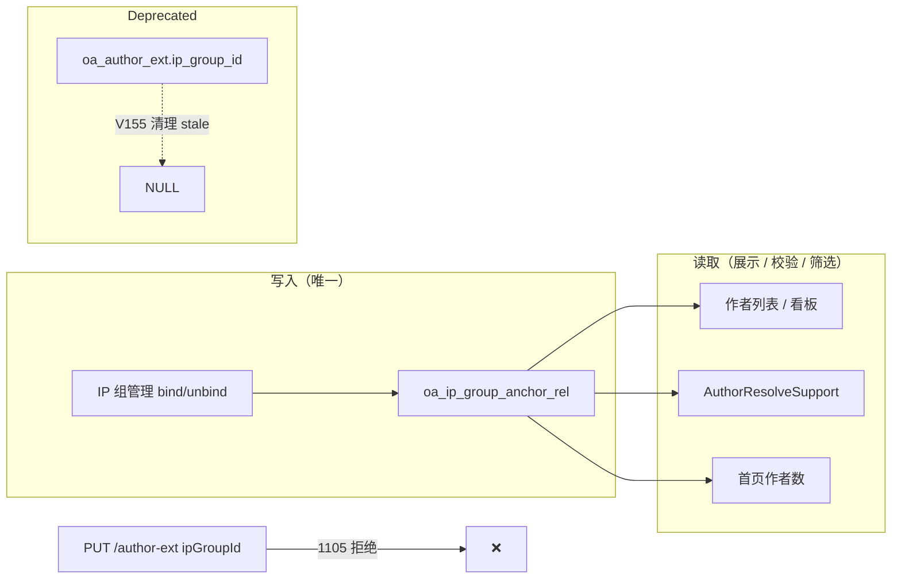

# ADR-055：作者 IP 组归属单向关联

| 字段 | 值 |
|------|---|
| 编号 | ADR-055 |
| 标题 | 作者 IP 组归属 SSOT = `oa_ip_group_anchor_rel` |
| 状态 | **Accepted**（2026-07-20，用户书面确认） |
| 日期 | 2026-07-20 |
| 决策人 | 架构 / 产品 |
| 关联 | [ADR-051](./ADR-051-Ops与Football多库复用-作者域.md) · M1 IP 组管理 · M1 作者管理 |

---

## 1. 背景

作者与 IP 组的关联曾存在**双写**：

| 写入路径 | 表 / 列 |
|---------|---------|
| IP 组管理 → 关联作者 | `oa_ip_group_anchor_rel` |
| IP 组 bind 时 lazy upsert | `oa_author_ext.ip_group_id`（`ensureExtOnIpGroupBind`） |
| 作者管理 → 运营扩展 | `oa_author_ext.ip_group_id`（`PUT /oa/author-ext`） |

双写导致：

1. bind/unbind 与 ext 列可能不一致
2. 作者列表、数据权限、内容校验各自读不同来源
3. 运维不清楚「以哪条路径为准」

用户确认：**单向关联 — IP 组管理为准**。

---

## 2. 决策摘要

| # | 决策 | 说明 |
|---|------|------|
| D1 | **SSOT = `oa_ip_group_anchor_rel`** | IP 组管理「关联作者 / 解绑」**仅**读写该表 |
| D2 | **停止 ext 双写** | 删除 `ensureExtOnIpGroupBind`；`bindAnchors` / `unbindAnchor` 不再写 `oa_author_ext.ip_group_id` |
| D3 | **禁止经 author-ext 改归属** | `PUT /oa/author-ext` 若携带 `ipGroupId` → **1105** |
| D4 | **读路径统一 anchor_rel** | 作者列表筛选、展示 IP 组、`AuthorResolveSupport` 校验/计数均走 `oa_ip_group_anchor_rel` |
| D5 | **ext.ip_group_id 列保留、不参与归属** | 列不删（Flyway 兼容）；**不作为**成员关系 SSOT；V155 清理与 anchor_rel 不一致的历史值 |
| D6 | **不反向回填 anchor** | 迁移**仅**清空 stale `ext.ip_group_id`；**不**从 ext 自动创建 anchor_rel（须用户在 IP 组管理操作） |

---

## 3. 数据流（决策后）



---

## 4. API / 错误码

| 场景 | 行为 |
|------|------|
| `POST .../ip-group/{id}/bind-anchors` | 仅 insert `oa_ip_group_anchor_rel` |
| `DELETE .../ip-group/{id}/anchors/{authorId}` | 仅 delete rel |
| `PUT /oa/author-ext/{id}` + `ipGroupId` | **1105** `AUTHOR_IP_GROUP_MANAGED_IN_IP_GROUP` |
| `GET /oa/author/list?ipGroupId=` | 筛选：`anchor_rel`；展示：该组 ID |
| `GET /oa/author-ext/{id}` | `ipGroupId` / `ipGroupName` 来自 **anchor_rel**（最早一条） |

---

## 5. 迁移 V155

```sql
-- 清空 ext.ip_group_id：不存在匹配 anchor_rel 的行
UPDATE oa_author_ext e SET e.ip_group_id = NULL ...
WHERE NOT EXISTS (matching oa_ip_group_anchor_rel)
```

**不做**：从 ext 有值但无 rel 的行自动 insert anchor_rel。

---

## 6. 影响面

| 模块 | 变更 |
|------|------|
| `IpGroupServiceImpl` | 移除 `ensureExtOnIpGroupBind` 调用；`listAnchors` 用当前组 level |
| `AuthorServiceImpl` | 读展示走 anchor_rel；`updateExt` 拒写 ipGroupId |
| `AuthorResolveSupport` | `countActiveAuthors` / `isAuthorBoundToIpGroup` 已/改走 anchor_rel |
| 前端作者管理 | 扩展表单不应再提交 `ipGroupId`（或忽略 1105） |

**Out of Scope**：`oa_production_content_ext.ip_group_id`、账号 `oa_account.ip_group_id` 等**非作者成员关系**冗余列 — 本 ADR 不涉及。

---

## 7. 验证清单

1. IP 组 bind 作者后：`oa_ip_group_anchor_rel` 有行，`oa_author_ext.ip_group_id` **不变**（或为 NULL）
2. IP 组 unbind 后：rel 删除，ext 列仍不自动变更
3. `PUT /author-ext` 带 `ipGroupId` → 1105
4. 作者列表按 IP 组筛选与 IP 组详情「关联作者」一致
5. Flyway V155 后：凡 ext.ip_group_id 与 anchor_rel 不一致者已 NULL

---

## 8. 状态

**Accepted** — 按本节实施；后续若需彻底 DROP `oa_author_ext.ip_group_id` 列，另开 ADR + 大版本迁移。
