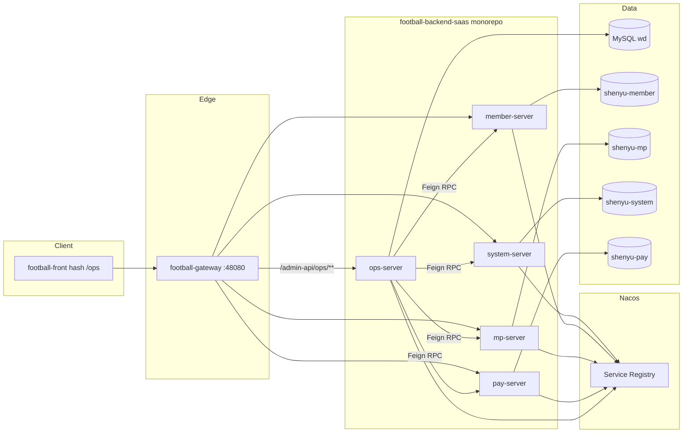

# ADR-058：OPS 后端单仓与 `football-module-ops` 命名

| 字段 | 值 |
|------|-----|
| 编号 | ADR-058 |
| 标题 | OPS 后端并入 Football monorepo；服务名 / API 路径统一为 ops |
| 状态 | **Accepted**（产品 mandate 2026-07-30） |
| 日期 | 2026-07-30 |
| 决策人 | 产品 / 架构 |
| Supersedes | [ADR-047](./ADR-047-Football-Ops平台集成决策.md) **§4.1**（sibling `football-module-oa` / 禁止改 Football 根 POM）；[ADR-049](./ADR-049-Ops与Football数据归属与松耦合集成.md) **D1**（S3 sibling 延期 → **Cancelled**）；[ADR-009](./ADR-009-API路径前缀分配.md) 中「`/admin-api/oa/` 为唯一规范前缀」的长期目标态（过渡期双路由，见 §4） |
| 关联 | [ADR-047](./ADR-047-Football-Ops平台集成决策.md) D3/D4/D5 · [ADR-050](./ADR-050-Ops与Football多库复用总纲.md) / [ADR-050-REV1](./ADR-050-REV1-Football-G-RPC-Supersede.md) · [ADR-056](./ADR-056-Football用户身份SSOT.md) · [WORK-PLAN](../delivery/OPS-FOOTBALL-MERGE-WORK-PLAN.md) · [MERGE-DECISIONS](../delivery/OPS-FOOTBALL-MERGE-DECISIONS.md) |
| 不在本期 | 980+ 类代码搬迁；权限码 `oa:*` → `ops:*` 全量切（见 §3 D5） |

---

## 1. 背景

ADR-047 §4.1 锁定 OPS 后端目标为 **sibling** 工程 `wd/football-module-oa/`（与 `football-backend-saas` 平级），并 **禁止** 在 Football monorepo 根 POM 新增 module，以避免触碰核心构建链。ADR-049 D1 将 S3 sibling 迁移标为 **Deferred**。

集成演进后：

1. Phase C Feign 切轨推进：OPS **目标态只连 `wd`**，Football 域经 **RPC/Feign**（MUST-HAVE / ADR-050-REV1），不再依赖 sibling 隔离来「不改 Football」。
2. 产品要求 OPS **最终命名与 Football 模块体系统一**（`football-module-ops`），长期保留 `oa-server` / `/admin-api/oa/**` / `ops-platform-module-oa` **不可接受**。
3. 数据库 **不合并**：OPS 进程继续只写/连 **`wd`**；`shenyu-*` 由对应 Football 微服务拥有，OPS 不直连。

本 ADR 废止「sibling / 禁止 monorepo module」边界，锁定 **单仓模块 + ops 命名终态** 与迁移窗口。

---

## 2. 已锁定决策

| # | 决策 | 说明 |
|---|------|------|
| **D1** | **Monorepo 模块** | OPS 后端以 **`football-module-ops`**（`football-module-ops-api` + `football-module-ops-server`）并入 **`football-backend-saas`** Maven 多模块；**废除** sibling `football-module-oa` 目标与「禁止改根 POM modules」禁令（ADR-047 §4.1） |
| **D2** | **DB 保持分离** | OPS 服务数据源 **仅 `wd`**（Flyway / `oa_*` / `sys_dict_*` / `sys_param` 等）；**不**合并库、**不**在 ops-server 进程配置 `shenyu-member|mp|pay|system` 业务直连。Football 域一律 **Feign → shenyu-\***（延续 MUST-HAVE §1 / Phase C） |
| **D3** | **服务名终态 = `ops-server`** | Nacos / `spring.application.name` = **`ops-server`**；端口过渡期 **保持 48094**（与现 `oa-server` 一致，降低联调摩擦）。废弃长期使用 `oa-server` 作为注册名 |
| **D4** | **Gateway 路径终态 = `/admin-api/ops/**`** | 路由：`Path=/admin-api/ops/**` → `grayLb://ops-server`。长期废除 `/admin-api/oa/**` 作为规范前缀（Supersede ADR-009 目标态；见 §4 双路由窗口） |
| **D5** | **权限码分阶段** | **默认更安全路径**：服务名 + Gateway/Controller 路径 **先**切到 ops；DB / `@PreAuthorize` 权限码 **过渡期继续 `oa:*`**（ADR-047 D4 仍有效直至独立菜单/权限 Slice）。**禁止**在路径切流同一会话强行全量 `ops:*` + Flyway 改菜单，除非单独 Slice 做映射与回归 |
| **D6** | **ADR-049 D1 Cancelled** | 「S3 sibling 延期」不再适用；后续工程迁移按本 ADR §4 阶段执行（仍可分期，但目标是 monorepo `football-module-ops`，不是 sibling） |

### 2.1 命名锁定（Canonical）

| 层 | 终态 | 过渡 / 废弃 |
|----|------|-------------|
| Maven 模块 | `football-module-ops`（api + server） | `ops-platform-module-oa` → 迁入后归档/删除 |
| Java 包（建议） | `football.module.ops.**` | `cn.iocoder.yudao.module.oa.**` 随搬迁 Slice 改包；可分批 |
| `spring.application.name` / Nacos | **`ops-server`** | `oa-server` 双注册窗口后下线 |
| HTTP 规范前缀 | **`/admin-api/ops/**`** | `/admin-api/oa/**` 双路由后下线 |
| Gateway `uri` | `grayLb://ops-server` | `grayLb://oa-server` |
| 权限码 | 终态可选 `ops:*`（**独立 Slice**） | **过渡默认保留 `oa:*`** |
| 前端 Vue 路由 | 可继续 `/ops/*`（页面路径已 ops） | API base 从 `/admin-api/oa` 切到 `/admin-api/ops` |
| 端口 | **48094**（初始不变） | Standalone `:8080` 仍非生产路径 |

**选型理由（简）**：

- **`football-module-ops`**：与 `football-module-system|member|mp|pay` 对称；产品名是 Ops，不是历史缩写 OA。
- **`ops-server`**：与模块名、Gateway 路径一致，避免「模块叫 ops、服务仍叫 oa」的长期分裂。
- **`/admin-api/ops/**`**：与前端 hash `#/ops/...`、产品称谓一致；ADR-009 的 `/oa/` 是历史「单模块单前缀」决策，终态应对齐产品命名。
- **权限分阶段**：`oa:*` 已写入 `system_menu.permission`、角色绑定、大量 `@PreAuthorize` 与 seed SQL；与路径/服务改名解耦可把回归面从「网关+前端+注册」扩大到「全租户 RBAC」的风险推迟到可控 Slice。

---

## 3. 目标架构（逻辑）

**硬边界**：`ops-server` **不**配置 Football 业务库 JDBC；跨域只读/写经 `/rpc-api/**` Feign（白名单见 ADR-050-REV1）。

---

## 4. 迁移阶段（推荐）

> 本 ADR **只定策略与命名**；不要求本会话搬迁代码。各阶段需独立 Slice / 工作包，Gate 绿后再进下一阶段。

| 阶段 | 内容 | 验收要点 | 粗估（OPS） |
|------|------|----------|-------------|
| **P0 文档锁定** | 本 ADR Accepted；ADR-047 §4.1 / ADR-049 D1 / ADR-009 指针；WORK-PLAN 记 Phase D（命名/单仓） | 文档交叉引用一致 | 0.5 人日 ✅ 本期 |
| **P1 双路由窗口** | Gateway **同时**挂载 `/admin-api/oa/**` 与 `/admin-api/ops/**` → 同一后端（先仍可指向现 `oa-server` 进程，或进程已改名 `ops-server` 但双 path）；Controller 双 `@RequestMapping` 或 Gateway Rewrite | curl 两前缀等价；既有 E2E 不破 | 1–2 人日 ✅ 2026-07-30（Gateway Rewrite；见 §8） |
| **P2 服务改名** | `spring.application.name=ops-server`；Nacos 注册；Gateway `uri=grayLb://ops-server`；脚本/健康检查/`start-*.ps1` 改名；端口 **48094** | Nacos 可见 `ops-server`；`oa-server` 下线或只读别名窗口结束 | 1–2 人日 ✅ 2026-07-30（见 §8） |
| **P3 前端 API 切流** | `ops-platform-ui-vue` / mount 后 football-front 内 API 客户端：`/admin-api/oa` → `/admin-api/ops`；Playwright / 手验清单更新 | 5777 全链路绿；无残留硬编码 `/oa/` API（文档/脚本可随后清） | 2–4 人日 ✅ 2026-07-30（见 §8） |
| **P4 关闭 oa 路径** | 移除 Gateway `/admin-api/oa/**`；保留 ops→oa Rewrite（Controller 仍 `/admin-api/oa`）；更新 ADR-009 Historical | 仅 `/admin-api/ops/**` 可达；`/admin-api/oa/**` 无路由 | 0.5–1 人日 ✅ 2026-07-30（见 §8） |
| **P5 Monorepo 搬迁** | 新建 `football-module-ops{,-api,-server}`；根 POM `<modules>` 纳入；代码/资源/Flyway 从 `ops-platform-module-oa` 迁入；包名分批；CI 构建链切换 | 分两子阶段：先 POC 空壳，再 MIGRATE 业务 | **大**（多会话；类规模 ~980，按域切片） |
| └ **P5-POC** ✅ | 空壳模块接入 + Boot 3.5 / actuator health；**不**搬业务类 | `mvn -pl football-module-ops/football-module-ops-server -am package` 绿；POC 端口 **48095**（不杀现网 :48094） | ✅ 2026-07-30 |
| └ **P5-MIGRATE-1 Foundation** ✅ | wd-only DS + Football BOM starters + Gateway login-user 鉴权桩；**不**搬业务 Controller/Service | `mvn package` 绿；`:48095` health UP + `/ops-foundation/ping`；`:48094` 仍存活 | ✅ 2026-07-30 |
| └ **P5-MIGRATE-2 IP 组** ✅ | `ipgroup` Controller/Service/Mapper/DO + OpsDataScope / LoginUserAssembly / FootballSystemUserValidator + Feign system/author | `mvn package` 绿；`:48095` `/admin-api/oa/ip-group/tree|list` code=0；`:48094` 仍存活 | ✅ 2026-07-30 |
| └ **P5-MIGRATE-3 Content** ✅ | `content` list/get/create/update/review-config + Football scheme sync；Feign `ArticleApi`；layout/publish/AI 延后 | `mvn package` 绿；`:48095` `content/list` total>0、`review-config` code=0；IP 组仍绿；`:48094` 仍存活 | ✅ 2026-07-30 |
| └ **P5-MIGRATE-4 Account / MP** ✅ | platform account list/CRUD + mp-followers；Feign `MpAccountInfoApi`/`MpUserApi`；collector bind 延后 | `mvn package` 绿；`:48095` `account/list` total>0、`mp-followers` code=0；IP/content 仍绿；`:48094` 仍存活 | ✅ 2026-07-30 |
| └ **P5-MIGRATE-5 SOP / Task** ✅ | sop template/node/review + task list/create/assign/complete；`FootballSystemUserValidator`；FileApi 上传延后 | `mvn package` 绿；`:48095` `task/list`/`sop/template/list` code=0；IP/content/account 仍绿；`:48094` 仍存活 | ✅ 2026-07-30 |
| └ **P5-MIGRATE-6 System 支撑** ✅ | dict Feign（`SystemDictAdapter`/`DictDataApi`）+ FileApi 上传 + `sys_param` 只读复用；消息中心/Metadata 延后 | `mvn package` 绿；`:48095` `dict/data` total>0、`file/upload` code=0；IP/content/account/task 仍绿；`:48094` 仍存活 | ✅ 2026-07-31 |
| └ **P5-MIGRATE-7 Analytics / 订单只读** ✅ | `FootballOrderRead*` + Feign `PayOrderApi.pageForOps`；Analytics/ROI/Screen 全套延后 | `mvn package` 绿；`:48095` `football-order/list` code=0 total>0；content/account/task 仍绿；`:48094` 仍存活 | ✅ 2026-07-31 |
| └ **P5-MIGRATE-8 Cutover** ✅ | monorepo JAR 承接 **:48094**；Nacos `ops-server`；旧 oa 归档；延后域 stub | Gateway smoke 绿；Nacos healthy `version=cutover-p5-migrate-8`；`-UseLegacyOa` 回滚 | ✅ 2026-07-31 |
| └ **P5-MIGRATE-9 Analytics / ROI** ✅ | FinanceRoi + AccountCost + OrderAttribution 实装；Dashboard/Screen/Perf 全套仍 stub | Gateway `finance/roi/*`/`finance/cost/list`/`order-attribution/*` code=0；回归 content/account/football-order；Nacos `version=cutover-p5-migrate-9` | ✅ 2026-07-31 |
| └ **P5-MIGRATE**（域切片）🟡 | 核心域 + ROI/归因已迁；Dashboard/Screen/Perf/layout 等仍 stub | 生产路径由 monorepo `ops-server:48094` 承载；旧模块 DEPRECATED 未删 | 🟡 见 §4.3 gaps |
| **P6 权限码（可选独立）** | Flyway：`system_menu.permission` `oa:`→`ops:`；Java `@PreAuthorize`；seed/脚本；角色缓存失效策略 | 菜单/按钮权限回归；租户抽检 | 2–5 人日（**勿与 P3 捆绑**） |

### 4.1 双运行窗口（Path / Service）

1. **开启**：Gateway 增加 ops 路由，**保留** oa 路由；后端接受两前缀（或 Gateway 将 `/admin-api/ops/**` Rewrite 为现有 Controller 前缀）。
2. **切换消费方**：前端与自动化先切 ops；观察错误率 / 404。
3. **关闭**：确认无流量后删除 oa 路由与兼容映射；Nacos 仅保留 `ops-server`。（**P4 ✅ 2026-07-30**：Gateway 对外 `/admin-api/oa/**` 已下线。**P-C ✅ 2026-07-31**：Controller 亦切 `/admin-api/ops/**`，Gateway **无** Rewrite。）

**禁止**：无双路由窗口的「大爆炸」改名（服务名 + 路径 + 前端 + 权限同一发布）。

### 4.2 与 Phase C 的关系

- Phase C（Feign / 只连 `wd`）与本 ADR **正交**：C 未整包 GO 不阻塞 P0–P2 文档与双路由准备；**P5 搬迁**建议在「生产路径已 Feign-only、multidb 配置已删」之后，避免搬迁时再带五库配置债务。
- 本 ADR **不**重新打开「合并 MySQL 库」议题。

### 4.3 P5-MIGRATE 域切片顺序（一片一会话）

> Foundation（本 Slice）已就绪；以下为建议下一刀，**禁止**单会话跨多域。

| 切片 | 范围（优先） | 依赖 / 备注 |
|------|-------------|-------------|
| **P5-MIGRATE-2 IP 组** ✅ | `ipgroup` Controller/Service/Mapper/DO + 数据权限支撑 | ✅ LoginUserAssembly + Feign AdminUser/Permission/OAuth2/Author；DictService 为 stub（members 岗位标签延后） |
| **P5-MIGRATE-3 Content** ✅ | `content` list/get/create/update/review-config + scheme sync | ✅ Feign `ArticleApi`；ParamService 只读；Notification/Todo/AI stub；layout/publish/typeset/AI 端点延后 |
| **P5-MIGRATE-4 Account / MP** ✅ | platform account、followers、collector bind | ✅ Feign `MpAccountInfoApi`/`MpUserApi`（:48086）；`MpAccountMapper`/`MpUserMapper` 仅注册 lambda 缓存；collector / fan-group / douyin / cert-renewal 延后 |
| **P5-MIGRATE-5 SOP / Task** ✅ | sop template/node/review + task list/create/assign/complete/execute（upload stub） | ✅ `FootballSystemUserValidator`；绩效延后；FileApi 上传 → MIGRATE-6 |
| **P5-MIGRATE-6 System 支撑** ✅ | dict Feign + FileApi + param 只读；message/metadata 延后 | ✅ `DictDataApi`/:48081、`FileApi`/:48082；`DictController` `/data`；`LocalFileStorageService` 实装；admin dict 410 |
| **P5-MIGRATE-7 Analytics / 订单只读** ✅ | football-order list via `pageForOps`；analytics 全套延后 | ✅ Feign `PayOrderApi`/:48085；`FootballOrderReadController` `/list`；ROI/Screen/AI stub 未迁 |
| **P5-MIGRATE-8 Cutover** ✅ | monorepo `:48094` + Nacos + 脚本切流；旧 oa DEPRECATED | ✅ Gateway smoke；`DeferredCutoverStubController`；回滚 `-UseLegacyOa` |
| **P5-MIGRATE-9 Analytics / ROI** ✅ | FinanceRoi / AccountCost / OrderAttribution（wd `oa_*`） | ✅ Gateway ROI/cost/归因 code=0；空归因 ROI 防 `selectBatchIds([])`；Dashboard/Screen/Perf 仍 stub |

**Foundation / 域切片延后项（Cutover 后仍开放）**：Football `Security`/`Swagger`/`ApiLogRpc` AutoConfig 排除；`biz-tenant` 未引入；~~Flyway 未搬~~ → **CLEANUP 2026-07-31**：Flyway SSOT 已在 `football-module-ops-server`（`enabled=true`，含 V113 Java migration；`ignore-migration-patterns: "*:missing"` 兼容历史 DELETE 行）；`ops-platform-server` 已删；~~未迁源码/IT 见 `legacy-archive/`~~ → **P-G ✅ 2026-07-31** 已 `git rm -r`（仅 git 历史；回滚 `checkout 7e5f1b709 -- …/legacy-archive`）。Content layout/publish/typeset/AI + P-A 分析/大屏等已迁；剩余 stub 见 GAP-INVENTORY（M10 OOS 等）。权限已 `ops:*`（**P-D ✅**）。

---

## 5. 对既有 ADR 的效力说明

| 原文 | 本 ADR 后 |
|------|-----------|
| ADR-047 §4.1 sibling + 禁根 POM | **废止**；改以 §2 D1 |
| ADR-047 §2 D4 保留 `oa:*` | **过渡期仍有效**；终态 `ops:*` 另 Slice（§2 D5） |
| ADR-047 §3「API 前缀保持 `/admin-api/oa/**`」 | **终态废止**；过渡双路由 |
| ADR-047 §4.2 Gateway → `oa-server` | 终态改为 `ops-server` + `/admin-api/ops/**` |
| ADR-049 D1 sibling Deferred | **Cancelled**（目标改为 monorepo ops，非延期 sibling） |
| ADR-009 `/admin-api/oa/` 唯一规范 | **目标态 Superseded**；文档标 Historical + 指向本 ADR；双路由期间 oa 仍为兼容前缀 |
| ADR-050 / REV1 / ADR-056 | **不变**（多库原则、G-* 白名单、用户 SSOT） |

---

## 6. 后果

### 正面

- 命名与产品、前端 `/ops`、Football 模块体系一致，消除 oa/ops 长期双名。
- Monorepo 共享 BOM / starter / CI，降低 sibling 版本漂移。
- DB 分离 + Feign 边界清晰，避免「进单仓就合库」的错误联想。

### 风险与缓解

| 风险 | 缓解 |
|------|------|
| 前端/脚本大量硬编码 `/admin-api/oa` | P1 双路由；P3 集中改 API client + ripgrep Gate |
| Nacos/Gateway 改名导致联调中断 | P2 短窗口双注册或先改 uri 再下线旧名；端口不变 |
| 权限与路径同时改导致大面积 403 | **默认 P6 独立**；过渡保留 `oa:*` |
| Monorepo 搬迁触碰 Football 构建 | P5 专用 Slice；先空模块接入再搬代码；禁止无关业务改动 |
| 文档/ADR 残留 oa 表述 | 跟随各 Slice 更新；本 ADR 为命名 SSOT |

---

## 7. Sign-off

| 角色 | 签名 | 日期 |
|------|------|------|
| 产品 | ☑ mandate（DB 分离 · 单仓 ops · 服务名与路径终态改名） | 2026-07-30 |
| 架构 | ☑ 本 ADR | 2026-07-30 |

---

## 8. 变更记录

| 日期 | 作者 | 说明 |
|------|------|------|
| 2026-07-30 | Agent | 初稿；用户锁定 monorepo + wd-only + ops 命名终态；权限分阶段 |
| 2026-07-30 | Agent | **P1 ✅**：`gateway-integration-local.yaml` / `gateway-integration-beta.yaml` 增加 `ops-admin-api-direct`（`Path=/admin-api/ops/**` → `:48094`，`RewritePath` → `/admin-api/oa/**`）；`football-gateway/.../application.yaml` 补齐 `oa-admin-api` + `ops-admin-api`（当时 `grayLb://oa-server`）与 knife4j。本地冒烟：两前缀等价 |
| 2026-07-30 | Agent | **P2 ✅**：`application-dev-nacos.yml` → `spring.application.name=ops-server`；Gateway / knife4j `grayLb://ops-server`（jar 已重打包）；local/beta overlay discovery `ops-server`（uri 仍 `http://127.0.0.1:48094`）；脚本/健康表改为 ops-server；Nacos DataId 默认 `ops-server-remote-multidb.yaml`（legacy 别名可推）。端口 **48094**。冒烟：Nacos `local` 可见 `ops-server@48094` healthy，`oa-server` hosts=0 |
| 2026-07-30 | Agent | **P3 ✅**：football-front `src/api/ops/**` + views/components 与 `ops-platform-ui-vue`：`/oa/`→`/ops/`、`/admin-api/oa`→`/admin-api/ops`（141 文件）；`VITE_API_BASE_URL=/admin-api/ops`；`mount-ops-all.py` 防 remount 回退。冒烟：login → `/admin-api/oa|ops/ip-group/tree` 与 content/list 均 code=0、结果一致。**未**关 Gateway oa（P4）；权限仍 `oa:*`（P6） |
| 2026-07-30 | Agent | **P4 ✅**：移除 Gateway `oa-admin-api` / overlay `oa-admin-api-direct`；仅保留 `/admin-api/ops/**` → ops-server + `RewritePath` → `/admin-api/oa/**`（Controller 未改）。ADR-009 标 Historical。冒烟：ops `ip-group/tree` / `content/list` code=0；oa 前缀无路由/404。权限仍 `oa:*`（P6）；未做 monorepo（P5） |
| 2026-07-30 | Agent | **P5-POC ✅**：`football-backend-saas` 新增 `football-module-ops`（api 占位 + server health-only）；根 POM `<modules>` 纳入；Boot 3.5 BOM；`spring.application.name=ops-server`；POC 端口 **48095**（现网生产仍 `ops-platform-module-oa:48094`，POC 不抢端口）。`mvn -pl football-module-ops-server -am package`。**未**搬 980 类；**P5-MIGRATE ⬜**；权限仍 `oa:*`（P6） |
| 2026-07-30 | Agent | **P5-MIGRATE-1 Foundation ✅**：`football-module-ops-server` 扩 POM（mybatis/security/rpc + Flyway + Nacos optional）；`master→wd` only；端口 **48095**；包保留 `cn.iocoder.yudao.module.oa`；Gateway `login-user` 鉴权桩（无 Feign check / 无 LoginUserAssembly DB）；冒烟 health UP + `/admin-api/oa/ops-foundation/ping`（wd=UP）；`:48094` 未杀。Football Security/Swagger/ApiLogRpc AutoConfig 排除；Flyway 默认关；biz-tenant 延后。下一刀见 §4.3（建议 **P5-MIGRATE-2 IP 组**） |
| 2026-07-30 | Agent | **P5-MIGRATE-2 IP 组 ✅**：迁入 `ipgroup` 全栈 + `OpsDataScopeSupport` / `IpGroupAccessSupport` / `FootballSystemUserValidator` / `LoginUserAssemblySupport` + Account/Author 硬依赖；Feign `AdminUserApi`/`PermissionCommonApi`/`OAuth2TokenCommonApi`/`AuthorApi`（直连 :48081/:48087）；`@LogRecord` noop；`DictService` stub。冒烟：`:48095` `ip-group/tree`（10 节点）/`list`（total=20）/`accessible-tree` 均 code=0；`:48094` health UP。**未**切 Gateway、**未**停 48094。下一刀建议 **P5-MIGRATE-3 Content** |
| 2026-07-30 | Agent | **P5-MIGRATE-3 Content ✅**：迁入 `ProductionContent` list/get/create/update/review + `ContentDataScopeSupport` / `ContentReviewConfigService` / `FootballArticleBridgeService` + `MemberArticleWriteService`；Feign 增 `ArticleApi`（:48087）；`ParamService` 只读；Notification/TodoReminder/AiLlm stub；Controller 不含 layout/publish/typeset/AI。冒烟：`:48095` `content/list` code=0 total=37、`review-config` code=0；`ip-group/list|tree` 仍绿；`:48094` health UP。**未**切 Gateway、**未**停 48094。下一刀建议 **P5-MIGRATE-4 Account / MP** |
| 2026-07-30 | Agent | **P5-MIGRATE-4 Account / MP ✅**：迁入 `PlatformAccount` list/CRUD + `WechatMpFollower` + `MpAccountDataService`/`MpUserDataService`/`PlatformAccountSyncService`/`OaAccountExt*`；Feign 增 `MpAccountInfoApi`/`MpUserApi`（:48086）；`AesUtil` + company/realname/phone/simcard mappers；`CollectedDataQueryService` noop；stub `MpAccountMapper`/`MpUserMapper` 注册 MP lambda 缓存（不直连 shenyu-mp）。冒烟：`:48095` `account/list` code=0 total=182、`WECHAT_OFFICIAL` total=166、`mp-followers/1000002` total=13；`ip-group/list`/`content/list` 仍绿；`:48094` health UP。**未**切 Gateway、**未**停 48094；collector-bind 延后。下一刀建议 **P5-MIGRATE-5 SOP / Task** |
| 2026-07-30 | Agent | **P5-MIGRATE-5 SOP / Task ✅**：迁入 `controller/service/dal/dto` 下 sop 全栈（`SopTemplate`/`SopNode`/`SopReview`/`Task`）+ `SysDictDataMapper` + `@AuditLog` 注解；`LocalFileStorageService` 上传 stub（FileApi → MIGRATE-6）；`TodoReminderSupport.onSopReviewStateChanged` noop；写路径 `assigneeId` 走 `FootballSystemUserValidator`（ADR-056）。冒烟：`:48095` `task/list` code=0 total=52、`sop/template/list` code=0 total=8；`ip-group/tree|list`、`content/list`、`account/list` 仍绿；`:48094` health UP。**未**切 Gateway、**未**停 48094；绩效 / ContentPlan 生成器延后。下一刀建议 **P5-MIGRATE-6 System 支撑** |
| 2026-07-31 | Agent | **P5-MIGRATE-6 System 支撑 ✅**：迁入 `DictDataApi`/`SystemDictAdapter`/`DictService` Feign-only + `DictController` `/data`；`FileApi` + 实装 `LocalFileStorageService`/`FileController`；`ParamService` 既有只读复用；`SystemDictService` 管理路径仍 410。Feign 直连 system `:48081` / infra `:48082`。冒烟：`:48095` `dict/data?type=dict_platform_type` total=9、`dict_position` total=7、`file/upload` code=0；`ip-group/list`/`content/list`/`account/list`/`task/list` 仍绿；`:48094` health UP。**未**切 Gateway、**未**停 48094；消息中心 / Metadata 延后。下一刀建议 **P5-MIGRATE-7 Analytics / 订单只读** |
| 2026-07-31 | Agent | **P5-MIGRATE-7 Analytics / 订单只读 ✅**：迁入 `FootballOrderReadController`/`FootballOrderReadServiceImpl` + vendored `PayOrderApi`/`OrderOpsPageReqDTO`/`AllOrderRespDTO`（ADR-057 `pageForOps`，非 Admin `getOrderPage`）。Feign 直连 pay `:48085`。冒烟：`:48095` `football-order/list?startDate=2026-01-01&endDate=2026-07-30` code=0 total=26341；`content/list`/`account/list`/`task/list` 仍绿；`:48094` health UP。**未**切 Gateway、**未**停 48094；Analytics/ROI/Screen/AI 全套延后。下一刀建议 **P5-MIGRATE-8 Cutover**（或剩余域） |
| 2026-07-31 | Agent | **P5-MIGRATE-8 Cutover ✅**：`application.yaml` 端口 **48094** + Nacos `local` 注册；停旧 `ops-platform-module-oa`；启 monorepo JAR；`DeferredCutoverStubController`（GET 空 / 写 410）覆盖未迁域；`start-integration-oa.ps1` 默认 JAR、`-UseLegacyOa` 回滚；旧 README DEPRECATED。冒烟 Gateway：`ip-group/tree`/`content/list`/`account/list`/`task/list`/`football-order/list`/`dict/data` 均 code=0；Nacos `ops-server` healthy `version=cutover-p5-migrate-8`。权限仍 `oa:*`（P6）；未删旧模块（CLEANUP 另 Slice） |
| 2026-07-31 | Agent | **P5-MIGRATE-9 Analytics / ROI ✅**：迁入 `FinanceRoi`/`AccountCost`/`OrderAttribution` Controllers+Services+Mappers/DO（wd `oa_account_cost`/`oa_order_attribution`/`oa_order`）；从 stub 移除 `/finance/roi|cost`、`/order-attribution`；订单列表仍 Feign `pageForOps`；空归因 ROI 防护 `selectBatchIds([])`。冒烟 Gateway：`finance/roi/analysis|trend|breakdown`、`finance/cost/list`（total=5）、`order-attribution/list|roi` code=0；回归 `football-order/list`/`content/list`/`account/list` 绿；Nacos `version=cutover-p5-migrate-9`。Dashboard/Screen/Perf 全套延后；回滚仍 `-UseLegacyOa`；未删旧模块；未做 P6 |
| 2026-07-31 | Agent | **CLEANUP ✅（用户授权删除）**：162 条 Flyway `V*.sql` 迁入 `football-module-ops-server/src/main/resources/db/migration/`；`spring.flyway.enabled=true`（table=`flyway_schema_history`，baseline-on-migrate / out-of-order 同 legacy）。未迁 Controller/Service/IT 归档至 `legacy-archive/`（不进编译路径；Gate E2E 为运行时 SSOT）。`start-integration-oa.ps1 -UseLegacyOa` fail-fast；ROLLBACK → git history。**`git rm -r ops-platform-server`**。脚本路径改指向 monorepo migration。Dashboard/Screen/Analysis 等仍 stub（见 GAP-INVENTORY）。权限仍 `oa:*`（P6） |
| 2026-07-31 | Agent | **P-C ✅（路径全切）**：全部 Controllers / helpers `/admin-api/oa`→`/admin-api/ops`（62 Java）；Gateway jar + local/beta overlay **移除** `RewritePath` ops→oa，直挂 `/admin-api/ops/**`；**无** Controllers 双路由别名。冒烟见 `e2e-artifacts/P-C-ROUTE-20260731`（GW+直连 code=0；旧 oa 业务 404）。权限仍 `oa:*`（P6 / 终态计划 P-D） |
| 2026-07-31 | Agent | **P-B ✅（包改名）**：生产源 `cn.iocoder.yudao.module.oa.**`→`football.module.ops.**`；ops 模块内 vendored `cn.iocoder.yudao.framework.**`→`football.module.ops.framework.**`；`OpsServerApplication` 单包扫描 + MapperScan；`legacy-archive` 未动。冒烟见 `e2e-artifacts/P-B-PACKAGE-20260731`（7/7）。HTTP 路径/权限未改（P-C 已完成；P-D 另 Slice） |
| 2026-07-31 | Agent | **P-B ✅（包改名）**：`football-module-ops-server` 生产源 `cn.iocoder.yudao.module.oa.**`→`football.module.ops.**`；ops-local `cn.iocoder.yudao.framework.**`→`football.module.ops.framework.**`；`OpsServerApplication` 单 `scanBasePackages` + MapperScan。`legacy-archive` 仍旧包（P-G）。冒烟见 `e2e-artifacts/P-B-PACKAGE-20260731`（GW account/content list code=0）。**未**改 HTTP 路径、**未**改 `oa:*`（P-D） |
| 2026-07-31 | Agent | **P6 / P-D ✅**：权限码 `oa:*`→`ops:*`；`@PreAuthorize` 已 `ops:*`；Flyway `V166` 改 `system_menu.permission`（跳过 B-WP4 stop-write 的 `sys_permission`）；本地 football-ops + shenyu-system 菜单 oa=0/ops=60；seeds 同步；冒烟见 `e2e-artifacts/P-D-PERM-20260731`（5/5）。路径仍 `/admin-api/ops/**` |
| 2026-07-31 | Agent | **P-G ✅**：`git rm -r football-module-ops-server/legacy-archive/`（422 tracked + 158 untracked disk = 580）；从未进 Maven classpath；回滚 `git checkout 7e5f1b709 -- …/legacy-archive`；冒烟见 `e2e-artifacts/P-G-LEGACY-ARCHIVE-20260731`（3/3）。**未**做 P-E |
