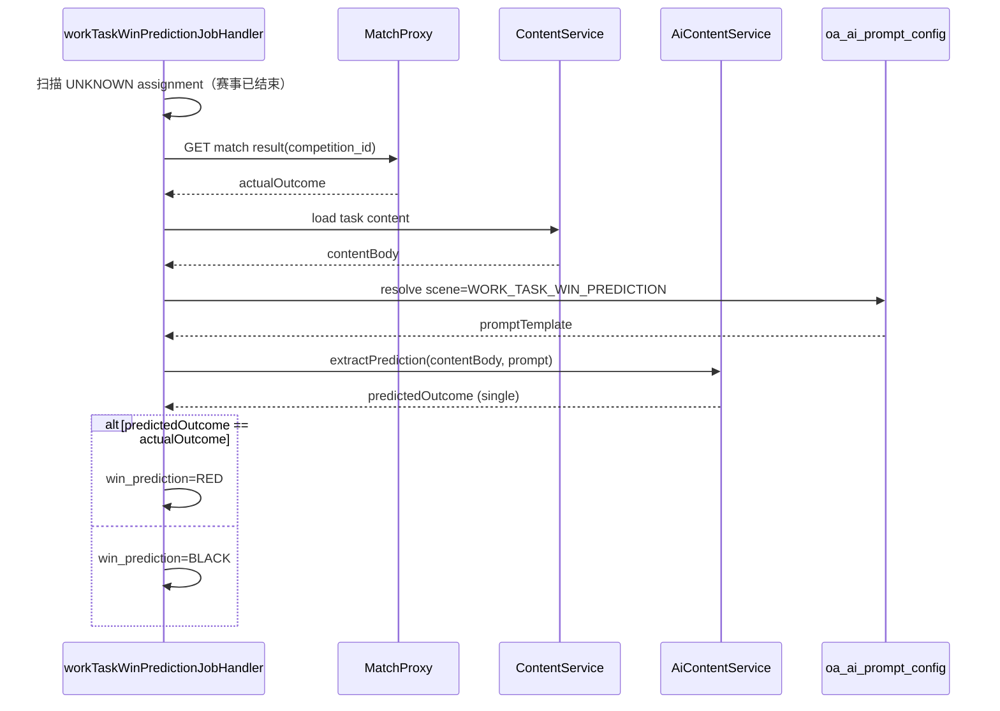

# ADR-072：工作任务红黑判定与 AI 提示词

| 字段 | 值 |
|------|---|
| 编号 | ADR-072 |
| 标题 | 工作任务赛后红黑判定 — AI 提取预测 +  hourly Job |
| 状态 | **Accepted** |
| 日期 | 2026-08-19 |
| 批准日期 | **2026-08-19**（产品 Owner 会话批准） |
| 决策人 | 产品 Owner |
| 关联 | [PRD-M2-工作任务管理](../product/PRD-M2-工作任务管理.md) · [ADR-071](./ADR-071-工作任务登记轻量Task生成.md) · [ADR-063](./ADR-063-AI内容提示词按文档类型.md) · [ADR-070](./ADR-070-Ops抓取统一XXL-JOB调度.md) · [ADR-014](./ADR-014-M8-配置管理数据模型.md) · [PRD-M8 §AI提示词](../product/PRD-M8-配置管理.md) |

---

## 1. 背景

FR-M2-010 Tab2 矩阵需展示每格「红黑」：任务关联内容中的 **单场胜负预测** 是否与 **实际赛果** 一致。

产品 Owner 2026-08-19 决议：

- **触发**：赛事结束后（match finished）
- **逻辑**：预测命中 → **红（RED）**；未命中 → **黑（BLACK）**
- **调度**：每小时轮询 Job（对齐 ADR-070 `@XxlJob` + `@TenantJob` 模板）
- **预测来源 Spec 缺口**：内容表 **无专用 prediction 字段**；通过 **AI 提示词配置**（`oa_ai_prompt_config`）从已发布任务内容中 **抽取 ONE 条预测 outcome**，再与赛果比对

登记期 Tab1 不调用 AI；`win_prediction` 默认 `UNKNOWN`，赛后 Job 写回。

---

## 2. 决策（Accepted）

| # | 决策 |
|---|------|
| **D1** | **预测 SSOT**：不新增 `oa_content` 结构化预测列（v1）；Job 运行时读取 task 关联内容正文/HTML，调用 AI **抽取**单场 outcome（胜/平/负或产品约定枚举），输出 **单一预测值**。 |
| **D2** | **AI 提示词 SSOT**：新增场景 **`scene=WORK_TASK_WIN_PREDICTION`**（`oa_ai_prompt_config`）；运营可在「配置管理 → AI提示词」维护模板（ADR-014 / PRD-M8）。若与现有 `AI_CONTENT_CHAT` 扩展冲突，优先独立 scene，避免与内容生成对话混用。 |
| **D3** | **提示词解析**：`tenant_id` + `scene=WORK_TASK_WIN_PREDICTION` + `status=ENABLED`；无 `document_type` 或按 assignment 营销计划扩展（Slice 实现可选）。无匹配配置 → 跳过该 assignment，保持 `UNKNOWN`，记录 warn 日志。 |
| **D4** | **赛果 SSOT**：外部赛事 API / Ops match 代理（`competition_id` → 全场结果枚举）；与 ADR-016 match 代理字段对齐，具体字段名在 API-M2-工作任务管理 锁定。 |
| **D5** | **判定规则**：AI 抽取的预测 outcome **等于** 实际赛果 → `win_prediction=RED`；**不等于** → `BLACK`。无预测 / 赛果未就绪 / AI 失败 → 保持 `UNKNOWN`，下轮 Job 重试。v1 **不含走水**；若需扩展走水枚举，另开 ADR 修订 `dict_win_prediction`。 |
| **D6** | **Job 调度**：Handler 名 **`workTaskWinPredictionJobHandler`**；`@XxlJob` + `@TenantJob`（ADR-070 模板）；cron 默认 **`0 0 * * * ?`**（每小时整点）。Ops standalone 引入 `football-spring-boot-starter-job` 后注册至 xxl-job-admin。 |
| **D7** | **扫描范围**：`oa_work_task_sheet.status=CONFIRMED` 下 assignment，且关联赛事 **已结束**、关联 task 已有可解析内容、`win_prediction=UNKNOWN`（或 `win_prediction_source` 为空）。 |
| **D8** | **写回**：更新 `oa_work_task_assignment.win_prediction`、`win_prediction_source=JOB`、`win_prediction_at=now()`；**不写** Football `author_article.win_result`（除非 Owner 另决）。 |
| **D9** | **人工改判**：`POST /assignment/{id}/refresh-win-prediction` 可选；`win_prediction_source=MANUAL`，不触发 AI。 |

---

## 3. AI 抽取流程

---

## 4. 数据与字典

| 项 | 说明 |
|----|------|
| `dict_win_prediction` | `UNKNOWN` / `RED` / `BLACK`（`@InDict` 1503） |
| `oa_work_task_assignment.win_prediction` | Job / 人工写回 |
| `oa_work_task_assignment.win_prediction_source` | `JOB` / `MANUAL` |
| `oa_ai_prompt_config.scene` | 新增种子 `WORK_TASK_WIN_PREDICTION`（Flyway 幂等 INSERT） |

**提示词变量（建议）**：`{{match_name}}`、`{{content_body}}`、`{{competition_id}}` — 具体占位符在 Flyway 种子与 `variable_desc` 中文档化。

---

## 5. 与 ADR-063 的关系

| 场景 | scene | 用途 |
|------|-------|------|
| 内容创作对话 | `AI_CONTENT_CHAT` | 生成/润色正文（ADR-063 按 document_type） |
| 红黑预测抽取 | **`WORK_TASK_WIN_PREDICTION`** | 从已完成内容 **只读抽取** outcome，不写入正文 |

二者共用 `oa_ai_prompt_config` 表与「AI提示词配置」管理页，**不**共用同一条 prompt 记录。

---

## 6. 失败与可观测

| 条件 | 行为 |
|------|------|
| 赛果未发布 | 跳过，下轮重试 |
| 内容为空 | 跳过 |
| 无 ENABLED 提示词 | 跳过 + warn |
| AI 返回无法解析 | 跳过 + error 日志 |
| 已 RED/BLACK | 不重复判定（除非人工 refresh） |

---

## 7. 后果

- Slice **S-19**：Job Handler + Flyway 种子 prompt + IT 用 mock AI/match。
- 依赖 ADR-070 Ops XXL-JOB 接入（或过渡期 `@Scheduled` + `@TenantJob` 仅限 dev，**生产须 XXL-JOB**）。
- Tab2 矩阵「红黑」列只读展示 assignment 字段；登记期显示 `—`（UNKNOWN）。

---

## 8. Out of Scope

- confirm 时同步 AI 判定
- 多预测 / 串关判定
- 自动回写作者战绩表

---

## 9. 变更记录

| 日期 | 说明 |
|------|------|
| 2026-08-19 | Draft：产品 Owner Q3 关闭；AI prompt scene + hourly Job + 无专用 prediction 字段 |
| 2026-08-19 | **Accepted**：产品 Owner 会话批准；S-16 Flyway V181 种子 `WORK_TASK_WIN_PREDICTION` |
| 2026-08-19 | **S-19 实现**：`WorkTaskWinPredictionJob`（handler `workTaskWinPredictionJobHandler`）+ `WorkTaskWinPredictionServiceImpl`；赛果经 `MatchProxyService.getFinishedMatchResult` → `GET /app-api/match/detail`（matchState=8）；AI scene `WORK_TASK_WIN_PREDICTION`；`POST /assignment/{id}/refresh-win-prediction` |
