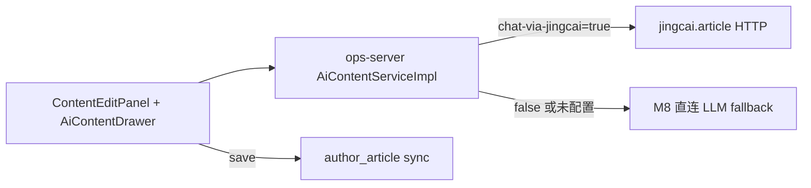

# ADR-076：OPS 内容生产 × amphipoda 玩法 / matchScheme 对齐

| 字段 | 值 |
|------|---|
| 编号 | ADR-076 |
| 标题 | OPS 内容编辑对齐 Football 发布方案玩法 UI + matchScheme SSOT + jingcai 全链路 |
| 状态 | **Accepted**（2026-08-31，产品 Owner 书面确认） |
| 日期 | 2026-08-31 |
| 决策人 | 产品 / 架构 |
| 关联 | [ADR-054](./ADR-054-OPS内容生产Football方案主表合并.md) · [ADR-053](./ADR-053-M2-AI内容对话生成.md) · [ADR-075](./ADR-075-工作任务合并执行组.md) · [PRD-M2-内容生产-amphipoda对齐增量](../product/PRD-M2-内容生产-amphipoda对齐增量.md) |

---

## 1. 背景

OPS 内容生产（`ContentEditPanel` + `AiContentDrawer`）当前为 **单场赛事 + `dict_scheme_type`**；Football 发布方案（`#/release/amphipoda`）为 **N 场 + `matchScheme` JSON + 竞足/传足/北单 Tab**。

ADR-054 §8.4 曾声明 `matchScheme` Phase 1–4 **Out of Scope**。产品 Owner **2026-08-31** 决议 supersede，在 **仅改 OPS 前后端** 前提下对齐 amphipoda 能力，并 **保持** OPS → `author_article` 双写。

---

## 2. 决策摘要

| # | 决策 | 说明 |
|---|------|------|
| **D1** | **`matchScheme` + `matchType` = C 端玩法 SSOT** | 存储于 `oa_production_content`；sync → `author_article.match_scheme` / `match_type` |
| **D2** | **1 篇内容 ↔ N 场** | amphipoda 模式；`competition_id` 保留为 **首场摘要**（列表/兼容） |
| **D3** | **玩法 UI 全量迁入 OPS** | 竞足 / 传足 / 北单 / 足球 Tab + 玩法 JSON + 主玩法；复用 `amphipoda` 组件（抽 shared） |
| **D4** | **`dict_scheme_type` 降级** | 不再表达竞彩玩法；可选保留于 AI 润色上下文（非 SSOT） |
| **D5** | **AI 首生成 + 润色均走 OPS → jingcai.article** | 默认 `ai.content.chat-via-jingcai=true`；**不**接 member `generateAiScheme` |
| **D6** | **润色上下文** | 每轮独立 jingcai 任务；OPS 将 `conversationHistory` + 上一轮正文 **注入** `writing.requirements` |
| **D7** | **合并执行任务预填 N 场** | 自 `oa_task.competition_ids_json` 预填赛程；**不带** `matchPlays`。**更新（[ADR-077](./ADR-077-SOP内容生成节点文档类型与登记自动草稿AI.md) D10）**：自动 Job 与手工 AI **均可**在 `matchPlays` 为空时调 jingcai；`matchScheme` 仍须 ≥1 场 |
| **D8** | **Football 双写不变** | create/update → `FootballArticleBridgeService` → `author_article`；全量 `match_scheme` |
| **D9** | **不改 member-server / jingcai 服务** | member `ArticleAiSchemeServiceImpl` 仅作 **组包参照**；OPS 独立 HTTP Client |
| **D10** | **权限不变** | 仍使用现有内容生产菜单与 `@PreAuthorize` |
| **D11** | **Supersedes ADR-054 §8.4** | `matchScheme` / `matchType` **In Scope**；§9.1 sync 表 `match_scheme` 由 NULL/stub → 全量 |

---

## 3. AI 路径（澄清）

| 阶段 | 路径 | Prompt SSOT |
|------|------|-------------|
| 首生成 | OPS → jingcai.article | jingcai 服务 + OPS 组包（events/requirements） |
| 润色（round≥2） | 同上；requirements 含历史对话摘要 | OPS 组包 |
| 降级 | `ai.content.chat-via-jingcai=false` | M8 `AI_CONTENT_CHAT`（ADR-053/063） |

**禁止**在 OPS 主流程调用 member `/member/article/generate-ai-scheme`（属 Football「我的发布→发布方案」入口，ADR-054 §7 双入口并存）。

---

## 4. 数据变更（OPS / wd）

### 4.1 `oa_production_content` 新增

| 列 | 类型 | 说明 |
|----|------|------|
| `match_scheme_json` | JSON | Football 同构 `MatchBaseVO[]`（含 `matchPlays`） |
| `match_type` | TINYINT | 1 竞足 / 2 传足 / 3 北单 / 4 足球 / 5 临场（与 amphipoda Tab 一致） |
| `competition_ids_json` | JSON NULL | 可选；N 场 scheduleId 快照（任务预填/列表） |

### 4.2 兼容

- 存量：`competition_id` / `competition_name` / `scheme_type` **保留只读**；编辑保存时若填了 `matchScheme` 则以新字段为准。
- `oa_production_content_ext`：继续桥接；`scheme_types` 冗余可保留，不参与 Football sync。

### 4.3 Football sync 映射

| OPS | `author_article` |
|-----|------------------|
| `match_scheme_json` → JSON 字符串 | `match_scheme` |
| `match_type` | `match_type` |
| `paid_body` / `free_body` | `content` / `free_content`（ADR-054 不变） |

---

## 5. jingcai 组包（OPS 实现要点）

参照 member `ArticleAiSchemeServiceImpl.buildAiSchemeEvents`（只读参照，不修改 member 代码）：

- `params.events[]`：N 场，每场 `matchName` / `teamName` / `matchTime` / `plays[]`
- `plays[]`：自 `matchScheme[].matchPlays` 映射 `playType` + `picks`
- `author.authorProfile`：OPS 只读作者 `persona`（与发布方案一致）
- 润色轮：`writing.requirements` 追加对话摘要 + 「待修改正文」+ 本轮 `message`

---

## 6. 与 ADR-054 / ADR-075 关系

| ADR | 关系 |
|-----|------|
| ADR-054 | Master+Extension **保留**；§8.4 作废；§9.1 `match_scheme` 改为全量 sync |
| ADR-075 | 合并组 task 的 `competition_ids_json` → 内容创建 **预填 N 场** |
| ADR-053 | AiContentDrawer 多轮 **保留**；jingcai 路径补上下文注入 |
| ADR-077 | 登记 confirm 自动 DRAFT + jingcai；允许空 `matchPlays`；`isPaywall` 仅请求上下文 |

---

## 7. 实现 Slice

**S-20**（见 `docs/delivery/SLICES-M2-S20-amphipoda对齐.md`）；独立 Gate，不与其他 Slice 混会话。

---

## 8. 风险与缓解

| 风险 | 缓解 |
|------|------|
| jingcai 润色上下文过长 | requirements 截断（最近 3 轮 + 正文上限 4000 字） |
| 传足场次精确约束 | UX 按 Tab 校验；合并预填不强制传足 |
| 双入口玩法不一致 | shared 组件复用 amphipoda 子模块 |
| sync 校验失败 | ext.`football_sync_error` + 重试 API 不变 |

---

## 9. 验收

- CHECKLIST-M2-amphipoda对齐增量 **100%**
- TESTCASES-M2-amphipoda对齐增量 **P0 100%**
- 上一阶段 M2 P0 冒烟仍绿
