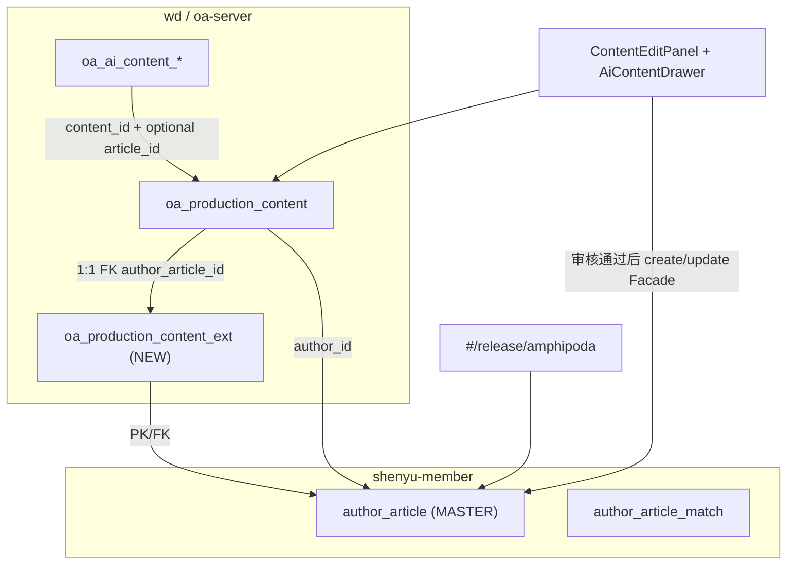

# OPS × Football 发布方案（内容生产）合并分析

> **版本**：v1.1 · 2026-07-18（ADR-054 修订：双正文 + matchScheme Out of Scope）  
> **范围**：OPS M2 内容生产（`oa_production_content` + AI 对话）与 Football 发布方案（`author_article` / `#/release/amphipoda`）的主从合并  
> **依据**：`amphipoda.vue` 实测 · `author_article` schema · ADR-053 · `OPS-AUTHOR-MERGE-ANALYSIS.md` · `OPS-FOOTBALL-合并规划与架构方案.md` · `Football-OPS-重复功能分析与合并建议.md`  
> **状态**：**已冻结** → 架构决策见 [ADR-054](../adr/ADR-054-OPS内容生产Football方案主表合并.md)（Accepted 2026-07-18；**2026-07-18 二次修订**：§4.1 双正文、§6 用户选列、§8.5 预设、`matchScheme` P1–4 Out of Scope）

---

## 1. 执行摘要

Football **发布方案**与 OPS **内容生产**当前是**双轨**：前者面向 C 端付费方案（member 库 `author_article`），后者面向运营 SOP/审核/AI 辅助（wd 库 `oa_production_content`）。产品规划（`OPS-FOOTBALL-合并规划` §3）曾写「**不合并**」，但「我的发布」菜单规划（Phase 6）又要求 Football 方案 + OPS 内容生产同域呈现——本分析按用户要求采用 **Master + Extension** 模型重新评估。

**推荐策略（Option B+，对齐 ADR-051 作者合并模式）**：

| 层级 | Football Master | OPS Extension |
|------|-----------------|---------------|
| 业务 SSOT | `author_article`（member）+ `author_article_match` | `oa_production_content_ext`（wd，PK=`author_article_id` 或双向 FK） |
| 写入口 | `/member/article/create|update`（member-server） | `/oa/content/*` 运营字段 + `/oa/ai-content/*` |
| UI | `#/release/amphipoda` 保留为**最终发布表单** | `ContentEditPanel` 承担 SOP/审核/AI；**必须补齐 Football 必填项**或审核通过后跳转/回填 amphipoda |

**规模评估**：**XL（Extra Large）** — 跨库、跨服务、赛事/玩法 JSON 结构差异、双审核语义、Gate 路径与 mock member-server 缺口。

**最大风险（v1.1 更新）**：OPS `schemeTypes` 与 Football `matchScheme` **语义不同** — ADR-054 已将 `matchScheme` **Out of Scope P1–4**（sync NULL，不阻塞草稿）；剩余主风险为双 status 分轨与跨库 sync 幂等。

**ADR-054 修订要点（cross-ref）**：

| 主题 | v1.0 分析 | ADR-054 修订 |
|------|-----------|--------------|
| OPS 正文 | 单 `body` → Football 一侧 | **`paid_body` + `free_body` 双栏**（§4.1） |
| AI 采纳 | 推断按 `documentType` 映射 | **用户选 PAID/FREE 列**（§6.2） |
| Football sync | 正式方案→content，其他→free | **`paid_body`→content，`free_body`→free_content**；可同时非空 |
| `matchScheme` | P3 强制 amphipoda 补全 | **P1–4 Out of Scope**；预设默认见 ADR §8.5 |

---

## 2. Football 发布方案（Master）

### 2.1 路由与前端

| 项 | 值 |
|----|-----|
| 菜单 | `system_menu.id=136`，名称「发布方案」，path `amphipoda`，component `release/amphipoda` |
| URL | `http://localhost:5777/#/release/amphipoda` |
| 主组件 | `football-front/apps/web-ele/src/views/release/amphipoda.vue` |
| 子组件 | `amphipoda/components/Forms/BaseSettingsForm.vue`、`AdvancedSettingsForm.vue`；玩法模板 `JingZuTemplate` / `ChuanZuTemplate` / `ZuQiuTemplate` |
| Tab → matchType | 竞足=1、传足=2、北单=3、足球=4、临场=5；直播总结/公推走独立 `ArticleForm` |

### 2.2 后端与数据

| 项 | 值 |
|----|-----|
| 主表 | **`author_article`**（shenyu-member） |
| 关联表 | `author_article_match`（比赛与赔率玩法）、`author_article_append`、`author_article_tag` |
| 创建 API | `POST /admin-api/member/article/create`（前端 `updatezuozheSet`） |
| 更新 API | `POST /admin-api/member/article/update`（`updateSchemeSet`） |
| 列表/详情 | `GET /member/article/page`、`GET /member/article/get?id=` |
| DO 命名 | member-server `ArticleDO`（本仓无源码；mapper namespace `football.module.member.dal.mysql.article.ArticleMapper`） |
| 服务 | **member-server**（集成环境 mock 于 `:48087`，**不实现 article/create 校验**） |

### 2.3 UI 必填项（`amphipoda.vue` · `formRules` + 子表单校验）

来源：`football-front/.../release/amphipoda.vue` L112–147、L644–669、L754–773；浏览器走查 `#/release/amphipoda`（竞足 Tab）。

| 字段 | UI 标签 | 规则 | 对应 DB 列 |
|------|---------|------|------------|
| `authorId` | 方案作者 * | required | `author_id` |
| `sortNum` | 排序 | required（formRules） | `sort_num` |
| `title` | 方案标题 * | required；禁止 `' " & < > ( )` 及空格；max 35 | `title` |
| `content` | 付费内容 * | required | `content` |
| `price` | 售价 | required；预设 88/128/168/208 或自定义 ≥0 | `price` |
| `privilegeTypes` | 是否同步至套餐 * | required；默认 `['2']` 不同步 | `privilege_types` |
| `schedulePublishTime` | 预售方案 | 当 `schedulePublishStatus=1` 时必填 | `schedule_publish_time` |
| `matchType` | Tab（竞足/北单/…） | 切换时写入 | `match_type` |
| `matchScheme` | 选比赛玩法 | 「确定」前：`queding()` 要求 ≥1 场（传足精确场次）；**发布时传足场次校验已注释**（BUG-250） | `match_scheme`（JSON text） |
| `refundType` | 优惠策略 | 默认 `0`；选不中补券需 `compensateCouponId` | `refund_type` / `compensate_coupon_id` |
| — | 免费内容 | 非 formRules 必填 | `free_content` |
| — | 精彩简介 | 非 required；max 50 | `intro` |

**高级设置（展开后，发布流程校验）**：

| 字段 | 条件 |
|------|------|
| `visibleMinNum` / `visibleMinAmt` | `visibleType='2'` 时至少填一项 |
| `publishTime` | `publishType` 自定义时 |
| `orderDeadline` | `orderDeadlineType` 自定义时 |
| `tagIds` / `visibleTagIds` / `visibleUserIds` | 按可见类型 |

**DB NOT NULL（schema 层，无 UI 星号但写入必有默认值）**：`price`、`refund_type`、`win_result`、`win_exc`、`status`、`tenant_id`。

### 2.4 与 OPS 的语义差异（关键）

| Football | 含义 |
|----------|------|
| `match_scheme` | 结构化竞彩/传足**玩法选择 JSON**（含 `matchPlays`、赔率玩法） |
| `match_type` | 赛事产品线：竞足/传足/北单/足球/临场（整型 1–5） |
| `content` / `free_content` | 付费/免费富文本（TinyMCE） |
| `schemeTypes`（OPS） | **不存在** — OPS 的「方案分析类型」是 AI/运营维度，不是 Football 玩法 |

---

## 3. OPS 内容生产（Extension）

### 3.1 模块与表

| 模块 | 路径/表 | 说明 |
|------|---------|------|
| 生产内容 | `oa_production_content` | 主业务表（wd） |
| 审核 | `oa_review_record` | 二级审核 |
| AI 对话 | `oa_ai_content_session`、`oa_ai_content_conversation`、`oa_ai_content_adopt`、`oa_ai_content_preference` | ADR-053 |
| 关联 | `oa_task`、`oa_content_plan_*` | 任务/计划驱动 |
| 前端 | `football-front/.../ops/production/content/ContentEditPanel.vue`、`AiContentDrawer.vue` | 挂载于 Football 壳 |
| 后端 | `ProductionContentController`、`AiContentController`、`ProductionContentServiceImpl`、`AiContentServiceImpl` | oa-server |

### 3.2 OPS 字段（当前）

`ProductionContentDO` / `ProductionContentCreateReq` 主要字段：

`title`, `body`, `bodyFormat`, `layoutJson`, `layoutHtml`, `layoutTemplateId`, `coverImage`, `creatorUserId`, `accountId(s)`, `platformType(s)`, `contentType`, `status`, `taskId`, `competitionId`, `competitionName`, `documentType`, `schemeType`（V141 起逗号分隔多值 `dict_scheme_type`）, `ipGroupId`, `authorId`, `aiGenerated`, 视频 URL, `knowledgeId` …

**ADR-054 新增（P1 Flyway）**：`paid_body`（付费内容）、`free_body`（免费内容）— 独立存储；存量 `body`/`layout_html` 回填 `paid_body`。

### 3.3 OPS UI 必填（`ContentEditPanel.vue` · `formRules` + 服务校验）

| 字段 | UI/后端 | 说明 |
|------|---------|------|
| `title` | required | max 200 |
| `contentType` | required | `dict_content_type` |
| `competitionId` | required | MatchSelectDialog；后端 `assertCompetitionSelection` |
| `competitionName` | 后端必填 | 快照 |
| `ipGroupId` | required | 非任务/任务模式均要 |
| `body` | required（多数类型） | ARTICLE 走 layout/rich |
| `documentType` | ARTICLE + 任务模式 required | |
| `schemeTypes` | AI 生成前必填（非 formRules） | `dict_scheme_type` 多选 |
| `authorId` | 由 IP 组推导 | `author_user.id` |
| `creatorUserId` | CreateReq `@NotNull` | 创作者系统用户 |

**OPS 无**：`price`、`privilegeTypes`、`refundType`、`matchScheme`、`matchType`（Football 意义）、`sortNum`、`freeContent`、Football 高级售卖设置。

### 3.4 AI 扩展字段

| 表/接口 | 字段 | 用途 |
|---------|------|------|
| `AiContentContextDTO` | `matchName`, `authorName`, `schemeTypes[]`, `anchorStyle`, … | 生成上下文 |
| `oa_ai_content_*` | `session_id`, `content_id`, `author_id`, `scheme_type` | 会话/采纳/偏好 |
| 采纳 | 写回 `paid_body` / `free_body`（用户选列） | sync → Football `content` / `free_content`（ADR-054 §6） |

---

## 4. 字段映射表（Football 必填 ↔ OPS）

图例：**✅ 已有** · **⚠️ 部分/语义不同** · **❌ 缺失**

| Football 必填/核心 | DB/API | OPS 字段 | 状态 | 合并备注 |
|-------------------|--------|----------|------|----------|
| 方案作者 | `author_id` | `author_id` | ✅ | 已 ADR-051 语义对齐 `author_user.id` |
| 方案标题 | `title` | `title` | ✅ | 长度/字符集不同：Football 35 且无特殊符；OPS 200 |
| 付费内容 | `content` | `paid_body`（+ `layout_html` 源） | ⚠️→✅ | sync 分列；HTML 消毒 |
| 免费内容 | `free_content` | `free_body` | ❌→✅ | ADR-054 §4.1；正式方案也可非空 |
| 精彩简介 | `intro` | — | ❌ | 可选扩展 |
| 排序 | `sort_num` | — | ❌ | OPS 表单无 |
| 售价 | `price` | — | ❌ | **Football 必填** |
| 套餐同步 | `privilege_types` | — | ❌ | 默认 `'2'` 可后端填，UI 仍需暴露 |
| 优惠策略 | `refund_type` | — | ❌ | 默认 0 |
| 赛事类型 | `match_type` | — | ❌ | 与 OPS `competitionId` 不同维度 |
| 比赛方案 JSON | `match_scheme` | — | ❌ | **ADR-054 Out of Scope P1–4**；sync NULL；产品提需求后再 Slice |
| 方案分析类型 | — | `scheme_type(s)` | OPS 独有 | 映射到 AI/运营，**不写入** `author_article` 除非 ADR 增列 |
| IP 组 | — | `ip_group_id` | OPS 独有 | 扩展表保留；Football 无 |
| 内容类型 | — | `content_type` | OPS 独有 | SOP/多平台 |
| 审核状态 | `status` | `status` | ⚠️ | 枚举完全不同（Football -1 草稿/1 上架 vs OPS `DRAFT`/`PENDING_*`） |
| 租户 | `tenant_id` | `tenant_id` | ✅ | |
| 任务/SOP | — | `task_id` | OPS 独有 | 扩展表 |
| AI 会话 | — | `oa_ai_content_*` | OPS 独有 | 扩展表，`author_article_id` 关联 |

---

## 5. 目标架构（Master + Extension）

### 5.1 扩展表建议 `oa_production_content_ext`

| 列 | 类型 | 说明 |
|----|------|------|
| `id` | BIGINT PK | |
| `tenant_id` | BIGINT | |
| `production_content_id` | BIGINT UK | → `oa_production_content.id` |
| `author_article_id` | BIGINT UK NULL | → `author_article.id`（发布后回填） |
| `ip_group_id` | BIGINT | 冗余便于查询 |
| `task_id` | BIGINT | |
| `workflow_status` | VARCHAR | OPS 审核态（与 Football status 分离） |
| `ai_session_id` | VARCHAR | 最近 AI 会话 |
| `scheme_types` | VARCHAR | OPS `dict_scheme_type` 逗号分隔 |
| `competition_id` | VARCHAR | OPS 外部 scheduleId |
| `competition_name` | VARCHAR | |
| `sync_football_at` | TIMESTAMP | 最后一次推送 Football 时间 |
| `football_sync_error` | VARCHAR | 失败原因 |

**原则**：Football 售卖/玩法/价格字段**只存 `author_article`**；OPS 工作流/AI/IP 组**只存 ext + oa_production_content 已有列**；禁止双写 `title/body` 到两库长期不一致——以 Football 为发布 SSOT，OPS 为草稿 SSOT 直至 `sync`。

---

## 6. 分层变更清单

### 6.1 DB / Flyway（wd）

| 动作 | 说明 |
|------|------|
| **NEW** `Vxxx__production_content_ext.sql` | 上表 + FK 注释 |
| **ALTER** `oa_production_content` | 可选 `author_article_id` 冗余索引（或仅 ext） |
| **KEEP** `oa_ai_content_*` | 增加 `author_article_id` 可空列（采纳追溯） |
| **NO** 修改 member 库表结构 | 除非 Football 团队接受增列（如 `ops_content_id`）— 标 **高风险** |

### 6.2 oa-server API

| 动作 | 说明 |
|------|------|
| **NEW** `FootballArticleBridgeService` | `@DS("member")` 调 member-server 或 Gateway `/member/article/*` |
| **NEW** `POST /oa/content/{id}/sync-football-scheme` | 将 OPS 内容映射为 ArticleCreateReq；返回 `author_article_id` |
| **NEW** `GET /oa/content/{id}/football-scheme` | 读 Master + ext 组装详情 |
| **ALTER** `ProductionContentServiceImpl` | 提交审核/发布前校验 Football 必填映射字段（可配置开关） |
| **ALTER** `AiContentServiceImpl.adopt` | 写 adopt 记录时带 `production_content_id` |
| **KEEP** `/oa/ai-content/*` | 不变更契约（ADR-053） |
| **DEPRECATE** 直连 mock 发布 | `DevStubPlatformPublishAdapter` 与 Football 方案发布区分 |

### 6.3 前端（football-front OPS 视图 + Football 原生）

| 动作 | 说明 |
|------|------|
| **ALTER** `ContentEditPanel.vue` | 增加 Football 必填区块：价格、套餐策略、refundType；（玩法仍建议跳转 amphipoda） |
| **ALTER** `AiContentDrawer.vue` | 采纳后提示「未完成 Football 玩法选择」 |
| **NEW** 按钮「去发布方案」 | 审核通过 → 打开 `#/release/amphipoda?authorId=&fromContentId=` 预填 title/body |
| **KEEP** `amphipoda.vue` | Master UI；最小改动：支持 query 预填与 `fromContentId` 回写 ext |
| **ops-platform-ui-vue** | 若仍独立部署：同步上述表单字段（当前主路径为 football-front 挂载） |

### 6.4 集成 / 挂载

| 动作 | 说明 |
|------|------|
| Gateway | 确保 `/admin-api/member/article/create` 在 Gate 路径可用（非 mock 404） |
| mock-member | 扩展 `mock-member-author-server.py` 实现 article create 校验回归 |
| 菜单 | 「我的发布」下 OPS 内容管理 + Football 发布方案并存；避免重复「发布」入口无关联 |
| 权限 | Football `author:article:*` + OPS `oa:content:*`；合并角色需双权限 |

### 6.5 不改或极少改 Football（member-server）

| 范围 | 策略 |
|------|------|
| `author_article` schema | **不改**（默认） |
| member-server 核心业务 | **不改**；仅通过已有 REST 创建/更新 |
| `amphipoda.vue` | **最小**：query 预填 + 发布成功后回调 oa ext（可选） |
| 玩法/订单/套餐 | Football 独占 |

---

## 7. 迁移策略（存量 OPS 数据）

| 阶段 | 动作 |
|------|------|
| M0 盘点 | `SELECT COUNT(*), status FROM oa_production_content GROUP BY status`；识别 `PUBLISHED*` 行 |
| M1 扩展表回填 | 为每条 `oa_production_content` 插入 ext 行（无 `author_article_id`） |
| M2 草稿 | 保持 OPS-only；UI 提示「未发布至 Football」 |
| M3 已发布（OPS DevStub） | **无 Football 对应物** — 标记 `football_sync_error=LEGACY_STUB`，不自动 create |
| M4 人工发布 | 运营对高价值内容在 amphipoda 手工发布 → 回填 `author_article_id` |
| M5 新流程 | 审核通过 → 自动/半自动 sync API |

**不回溯迁移** `oa_ai_content_*` 到 Football；仅保留 `content_id` 关联。

---

## 8. 风险

| ID | 风险 | 等级 | 缓解 |
|----|------|------|------|
| R1 | **玩法 JSON 缺口** — OPS 无 `matchScheme` | 🟡 | ADR-054：**P1–4 Out of Scope**；sync NULL；amphipoda 可选 |
| R2 | **schemeTypes vs match_type 混淆** | 🔴 | 文档/UX 分离命名；禁止 DB 混用 |
| R3 | **双 status 状态机** | 🔴 | ext.workflow_status vs `author_article.status` 分轨 |
| R4 | **ID 桥接** — content_id ↔ article_id | 🟠 | ext 表 UK + 幂等 sync |
| R5 | **tenant 一致性** | 🟠 | member/wd 同 tenant_id；集成测试 |
| R6 | **权限** — mock member 无 article API | 🟠 | Gate 全链路 IT |
| R7 | **dual-write 标题/正文** | 🟠 | 单向 sync OPS→Football 在发布点一次 |
| R8 | **Spec 缺口** — PRD v9.1 §5.11 仍写 `oa_content` 旧表名 | 🟡 | 更新 Slice/ADR 后再实现 |
| R9 | **Gate 路径** — oa-server DOWN 时无法联调 | 🟡 | `start-ops-dev.ps1` 健康检查 |
| R10 | **Football 标题字符集** | 🟡 | OPS 保存时预校验或 sync 前 sanitize |
| R11 | **传足场次校验被注释** | 🟡 | 勿在 OPS 侧假设 Football 校验强度 |

---

## 9. 推荐分期（可并行子任务）

| 阶段 | 目标 | 交付 | 依赖 |
|------|------|------|------|
| **P0 分析冻结** | ADR-054 内容方案合并 | 本文件 + ADR Accept | 产品确认 R1 玩法策略 |
| **P1 数据面** | ext 表 + 回填脚本 | Flyway Vxxx + seed 验证 | P0 |
| **P2 桥接 API** | sync-football-scheme | oa-server + member IT | P1 · 真实 member-server 或增强 mock |
| **P3 UI 最小闭环** | 审核通过 → amphipoda 预填 | ContentEditPanel + amphipoda query | P2 |
| **P4 Football 必填 OPS 表单** | price/privilege/refund 入 OPS 编辑 | 减少跳转摩擦 | P2 |
| **P5 玩法嵌入（可选）** | OPS 内嵌 JingZu 组件或 iframe amphipoda | 大 UI 工程 | P3 |
| **P6 权限/菜单/角色** | 「我的发布」统一 | seed role_menu | P3 |
| **P7 回归** | Gate M2 P0 + Football 发布冒烟 | TESTCASES + 走查 | 全阶段 |

**并行建议**：P1 与 P0 ADR 可并行；P4/P5 二选一（跳转 vs 嵌入）；P6 与 P3 并行。

---

## 10. 与既有合并文档关系

| 文档 | 关系 |
|------|------|
| `OPS-AUTHOR-MERGE-ANALYSIS.md` | 作者 ID、`oa_author_ext` 模式 **直接复用** |
| `OPS-FOOTBALL-合并规划与架构方案.md` §3 | 原「内容生产不合并」**需 ADR 修订**为本 Master+Extension |
| `Football-OPS-重复功能分析与合并建议.md` | Phase 6「我的发布」合并 **依赖本方案** |
| `ADR-053` | AI 对话 **保持 OPS**；`scheme_type` 不等同 Football `match_scheme` |
| `OPS-DICT-MERGE-FOOTBALL-PLAN.md` | `dict_scheme_type` 属 OPS wd 字典，**不迁入** Football system 字典 |

---

## 11. 阻塞问题清单（→ ADR-054 §13 开放问题）

| 原 # | 问题 | ADR-054 决策 |
|------|------|--------------|
| 1 | 审核通过后全自动 create 还是 amphipoda 确认玩法？ | **create 时即双写草稿**；`matchScheme` **Out of Scope P1–4** |
| 2 | `match_type` 默认值？ | 可选预设 `1` 或 NULL → ADR-054 §8.5 |
| 3 | OPS 微信发布 vs Football 双发布？ | **解耦**；Football 上架独立 → ADR-054 Q4 |
| 4 | `free_content` / `intro` 进 OPS 表单？ | **`free_body` P3 双栏** + `intro` P4 → ADR-054 §8 |
| 5 | OPS status 新增 `PUBLISHED_TO_FOOTBALL`？ | **否**；OPS status **不变**，上架态读 `author_article.status` |

---

## 12. 参考路径速查

| 资产 | 绝对路径 |
|------|----------|
| Football 发布页 | `d:\self\sy\运营数据平台\202606\wd\football-front\apps\web-ele\src\views\release\amphipoda.vue` |
| Football Article API | `d:\self\sy\运营数据平台\202606\wd\football-front\apps\web-ele\src\api\release\privileglist.ts` |
| member 表结构 | `d:\self\sy\运营数据平台\202606\wd\docs\sql\shenyu-member.sql`（`author_article`） |
| OPS 内容 DO | `d:\self\sy\运营数据平台\202606\wd\ops-platform-server\ops-platform-module-oa\src\main\java\cn\iocoder\yudao\module\oa\dal\dataobject\content\ProductionContentDO.java` |
| OPS 编辑 UI | `d:\self\sy\运营数据平台\202606\wd\football-front\apps\web-ele\src\views\ops\production\content\ContentEditPanel.vue` |
| AI 对话 | `d:\self\sy\运营数据平台\202606\wd\football-front\apps\web-ele\src\views\ops\production\content\AiContentDrawer.vue` |

---

## 13. Transition Strategy：OPS create 时双写 Football 草稿（过渡方案）

> **结论**：**PARTIAL（有条件可行）** — 保留 OPS 内容生产为主入口，OPS `create` 时**同步创建** Football `author_article` **草稿（status=-1）**可行；**Phase 1–4 不依赖 `matchScheme`**（ADR-054 §8.4/§8.5 预设默认）。

### 13.1 可行性判定

| 问题 | 结论 | 条件 |
|------|------|------|
| OPS 创建时同步 Football 方案？ | **YES（草稿级）** | 走 member-server 已有 `POST /admin-api/member/article/create`，或 oa-server `@DS("member")` 写 `author_article`；**不改 Football 源码** |
| 一次 create 即「可上架发布」？ | **部分 YES（P1–4）** | 双正文 + 售卖预设可 sync 草稿；**C 端完整方案**仍可能需 amphipoda 补 `matchScheme`（Out of Scope 至产品提需求） |
| oa-server 调 Football 无需改 Football？ | **YES** | 复用 **OperateLogCommonApi 模式**（Feign → Gateway → member-server），或 ADR-051 已有 **`@DS("member")` 跨库写**（作者已用）；Gateway 已路由 `/admin-api/member/**` → `:48087` |
| 过渡期内双入口并存？ | **YES** | Phase A–C 见下；需 `oa_production_content_ext.author_article_id` 幂等桥接 |

**阻塞项（实现前 ADR）**：`match_type` 默认值、`price` 默认策略、OPS create 失败时是否阻断 Football 同步（建议异步 + 可重试）。

### 13.2 Football `POST /member/article/create`（本仓可验证部分）

| 来源 | 说明 |
|------|------|
| 前端 | `privileglist.ts` → `updatezuozheSet` POST `/member/article/create`（payload 为方案对象，非 PrivilegeSet 语义） |
| DB `author_article` | `status` **DEFAULT -1（草稿）**；`price`/`refund_type`/`win_result`/`win_exc` 有 NOT NULL 默认值；`title`/`content`/`match_scheme`/`match_type` **可 NULL** |
| UI 必填（amphipoda） | 发布流程要求 `authorId`、`title`、`content`、`price`、`privilegeTypes`、`matchScheme`（≥1 场）等 — **UI 层严于 DB** |
| member-server 校验 | **本仓无源码**；集成 mock（`:48087`）**未实现** article/create — 联调需真实 member-server 或增强 mock |
| **能否部分草稿？** | **推断 YES**：以 `status=-1` + 后端填默认 `price`/`privilege_types`/`refund_type` 创建壳记录；**上架前**仍须 update 补全 `matchScheme` |

### 13.3 OPS `ProductionContentServiceImpl.create`（现状）

- 仅写 `oa_production_content`，`status=DRAFT`；校验 `title`、`contentType`、`competitionId`/`competitionName`、`ipGroupId`、`authorId`（IP 组推导）等。
- **不触达** Football / `author_article`。
- 双写挂点：`productionContentMapper.insert` **之后**（同事务或异步 Outbox，见风险）。

### 13.4 双写边界：create 可自动 vs 必须 amphipoda

| 可 OPS create 时同步（→ Football 草稿） | Out of Scope P1–4 / 可选 amphipoda |
|----------------------------------------|-------------------------------------|
| `author_id` ← OPS `authorId` | `match_scheme` — **NULL**（Out of Scope） |
| `title` ← OPS `title`（Football 字符集/35 字截断） | `match_type` — 可选预设 `1` 或 NULL |
| `content` ← OPS `paid_body`；`free_content` ← OPS `free_body`（可同时非空） | 高级可见/截止/标签 — Football 独占 |
| `status=-1` | 最终上架 `status=1`（独立操作） |
| `tenant_id` | `author_article_match` 关联行（若 member create 不自动写） |
| `price=88`、`privilege_types='2'`、`refund_type=0`、`sort_num=0`（ADR-054 §8.5） | OPS `schemeTypes` — **仅 ext** |
| ext 表 `author_article_id`、`sync_football_at` | `intro` — P4 迁入 OPS 表单 |

OPS `competitionId`（单场 scheduleId）**不能**等价替换 `matchScheme`；最多作 amphipoda 预填 query 参数。

### 13.5 推荐过渡三阶段

| 阶段 | 目标 | 行为 | 入口 |
|------|------|------|------|
| **Phase A** | 建立主从关联 | OPS create/update 标题正文 → **幂等** create/update Football **草稿**（-1）；写 ext.`author_article_id` | **内容生成（OPS）** 为主 |
| **Phase B** | 售卖/正文 OPS 化 | ContentEditPanel 双栏 + 售卖字段；可选 amphipoda 外链（**非阻塞** `matchScheme`） | OPS 为主 |
| **Phase C** | 收敛入口 | amphipoda 仅作玩法/售卖子表单或嵌入；方案列表统一「我的发布」；** deprecate** 无 `fromContentId` 的独立新建（可选保留老作者习惯） | **内容生成** 为唯一「新建」入口 |

Phase A 可与现有「方案发布」并行：**同一作者可能短期两条线**（纯 amphipoda 老流程 vs OPS 双写），靠 ext 桥接区分。

### 13.6 最小改动清单（无 Football 核心业务改动）

| 层 | 改动 |
|----|------|
| **wd DB** | `oa_production_content_ext`（`production_content_id` ↔ `author_article_id`） |
| **oa-server** | `FootballArticleBridgeService`（Feign `MemberArticleApi` 或 `@DS("member")` ArticleMapper）；`create`/`update` 后异步/sync 草稿；`GET /oa/content/{id}/football-scheme` |
| **RpcConstants** | 增 `MEMBER_NAME = "member-server"`（若 Feign） |
| **Gateway/mock** | 确保 article create 非 404；mock 增强回归 |
| **football-front** | ContentEditPanel 链 Football 状态；amphipoda query 预填 + 回写 ext（最小） |
| **ADR** | ADR-054 冻结 Phase A 默认与失败策略 |

### 13.7 过渡期风险

| 风险 | 说明 | 缓解 |
|------|------|------|
| **重复编辑** | OPS 与 amphipoda 同时改 title/body | 单向：**OPS→Football 至 Phase B**；amphipoda 改售卖/玩法；或锁「玩法未补全」前允许 OPS 覆盖 |
| **回滚** | OPS 删除/驳回后 Football 草稿残留 | 软删标记 ext；Football 草稿保持 -1 或逻辑删 |
| **ID 映射** | `content_id` ↔ `article_id` 丢失 | ext UK + create 幂等键（`production_content_id`） |
| **双写失败** | member 不可用 | **不阻断** OPS create（推荐）；ext.`football_sync_error` + 手动重试 |
| **标题/正文漂移** | 两次 save 不一致 | Phase A 仅 create 同步；update 策略 ADR 定稿 |
| **mock 缺口** | 本地无真实 article API | 增强 `mock-member-author-server.py` 或 Gate 指真实 member |

---

*文档结束 — 仅分析，未改代码。*
