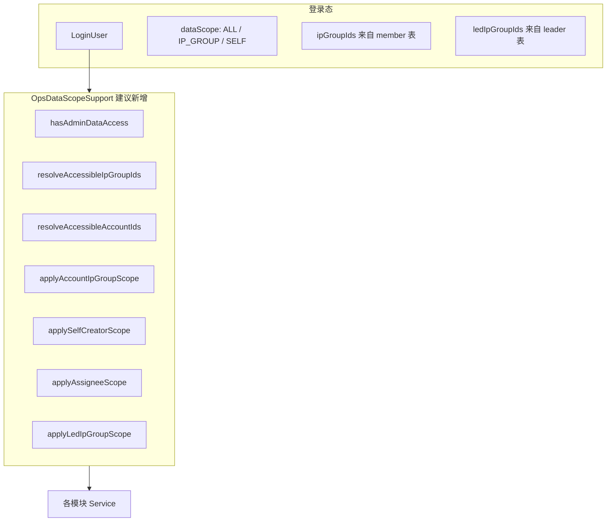

# OPS 数据权限差距分析

> **范围**：用户梳理表 20 个菜单（system_menu 6112–6174）  
> **对照 SSOT**：`docs/engineering/OPS-RBAC-DATA-SCOPE.md`、源码审计（2026-07-16）  
> **读者**：产品、架构师、后端/前端开发

---

## Executive Summary

| 维度 | 结论 |
|------|------|
| **现状（2026-07-17）** | Phase 0–4 **已完成**；20 个目标菜单后端 Service 强制过滤 + 前端 Phase 4 UX 对齐 |
| **Dev Token 验收** | `scripts/probe-ops-data-scope.py` **11/11**（oa-server :48094） |
| **Football 登录路径** | `FootballAuthProvider` 已注入 `memberIpGroupIds` / `ledIpGroupIds`（oa 模块内，非 Football 原生改动） |
| **差距规模** | 20 菜单 Gap = **NONE**（Dev Token + probe 覆盖）；Football 生产联调仍依赖 member 表数据 |
| **残余** | H2 IT 需 skip V137/V145（`system_menu` 表）；Layout 菜单仍硬编码（Out of Scope） |

**角色判定约定（本文默认，待产品确认）**

| 用户表述 | 技术映射（建议） |
|----------|------------------|
| admin / 系统管理员 | `LoginUser.dataScope == ALL`（含 `OA_ADMIN`、`TENANT_ADMIN`、`OPS_LEADER` seed 角色） |
| IP组长 | `oa_ip_group.leader_user_id` 或 `oa_ip_group_member.is_leader=1` 的用户（数据范围）；指派组长前须持有内置角色 `ip_group_leader`（V150，**非** `OPS_LEADER`） |
| others / 普通用户 | 非 ALL 且非 IP 组长 |
| IP组管理的账号 | 用户所属 IP 组（`oa_ip_group_member`）下绑定的 `oa_account`（**待确认**：是否含「组长管辖组」） |

---

## 1. 跨切面阻塞项（Cross-cutting Blockers）

### B1 — Football 登录态无 IP_GROUP（P0）

```119:125:ops-platform-server/ops-platform-module-oa/src/main/java/cn/iocoder/yudao/module/oa/service/auth/FootballAuthProvider.java
    private String resolveDataScope(List<FootballSystemRoleDO> roles) {
        boolean hasAll = roles.stream().anyMatch(role -> role.getDataScope() != null && role.getDataScope() == 1);
        if (hasAll) {
            return DataScopeSupport.ALL;
        }
        return DataScopeSupport.SELF;
    }
```

- `data_scope=1 → ALL`，否则一律 `SELF`；**无 `IP_GROUP` 档**
- `ipGroupId` 恒为 `null`（第 74 行）
- 影响：所有依赖 `DataScopeSupport.applyIpGroupScope` 的菜单在 Football 下**不过滤** → 非 admin 可见租户全量

### B2 — `applyIpGroupScope` 仅支持「单 IP 组 + IP_GROUP 档」（P0）

```16:25:ops-platform-server/ops-platform-module-oa/src/main/java/cn/iocoder/yudao/module/oa/framework/auth/DataScopeSupport.java
    public static <T> void applyIpGroupScope(LambdaQueryWrapper<T> wrapper, SFunction<T, Long> ipGroupColumn) {
        LoginUser user = LoginUserContext.get();
        if (user == null || !IP_GROUP.equals(user.getDataScope())) {
            return;
        }
        Long ipGroupId = user.getIpGroupId();
        if (ipGroupId != null) {
            wrapper.eq(ipGroupColumn, ipGroupId);
        }
    }
```

- 只读 `sys_user.ip_group_id`（单值），**未读** `oa_ip_group_member` 多组关系
- `SELF` 档用户调用时**直接跳过** → 与产品「others 看 IP 组账号」矛盾
- `ipGroupId=null` 时**静默不过滤**（安全漏洞）

### B3 — 三套「组长」语义冲突（P0/P1）

| 概念 | 载体 | 当前使用场景 |
|------|------|-------------|
| `sys_role OPS_LEADER` | RBAC，`data_scope=ALL` | Seed 运营组长，租户全量 |
| `oa_ip_group.leader_user_id` | 业务表 | 内容一级审核、IP 组详情 |
| `dict_position OPS_LEADER` | 岗位 | 计划终止审批、SOP 审核 |

产品表对 **6156 人效**、**6159 IP组** 使用「IP组长」指业务组长，但 seed 中 `OPS_LEADER` 角色为 ALL —— **角色与数据范围未对齐**。

### B4 — 「自己创建」缺少统一 userId 过滤（P1）

- `ContentPlanDO` / `FunnelDO` / `CustomQueryDO` / `MetricDO` 仅有 `creator`（username 字符串），无 `creator_user_id`
- 过滤需 `resolveMembershipUserIds` + username 匹配，Football/wd userId 漂移时易漏/误判

### B5 — 前端 IP 组筛选为可选参数，非强制（P1）

- 多数运营/分析页有 `IpGroupTreeSelect`，但**不传则后端 tenant 全量**
- 与「非 admin 默认限定范围」目标冲突；应后端强制，前端仅缩小范围

---

## 2. 分菜单差距表

图例：**Gap** = `NONE`（达标）/ `PARTIAL`（有机制但未满足）/ `MISSING`（无过滤）  
**Priority** = P0 必改 / P1 增强 / P2 已基本 OK

| Menu ID | 菜单 | 权限码 | 期望数据范围 | 当前行为 | Gap | Priority | 修复位置 |
|---------|------|--------|-------------|----------|-----|----------|----------|
| **6112** | 高粉账号分析 | `oa:high-fans:list` | admin ALL；others IP组账号 | `MonitorServiceImpl.followerAccountList`：`applyAccountIdIn(MEMBER_GROUPS)` | **NONE** | — | — |
| **6113** | 爆款作品分析 | `oa:hot-works:list` | admin ALL；others IP组账号作品 | `MonitorServiceImpl.hitList`：`ip_group_id IN memberIpGroupIds` + account 子查询 | **NONE** | — | — |
| **6115** | 低粉账号分析 | `oa:low-fans:list` | 同 6112 | 同 6112（`lowFollowerList`） | **NONE** | — | — |
| **6116** | 低分作品分析 | `oa:low-score:list` | admin ALL；others IP组账号作品 | `MonitorServiceImpl.lowScoreList`：同 6113 | **NONE** | — | — |
| **6117** | 内容管理 | `oa:content:list` | admin ALL；others 自己创建 | `ContentDataScopeSupport.applyOwnContentFilter`：`creator_user_id IN userIds` | **NONE** | — | — |
| **6118** | 内容审核 | `oa:content:list` | 审核人为自己 | `ContentDataScopeSupport.applyReviewListScope` + `canReview` 二阶段 | **NONE** | — | — |
| **6121** | 计划管理 | `oa:plan:list` | admin ALL；others 自己创建 | `ContentPlanServiceImpl.list`：`applySelfCreator` + 详情鉴权 | **NONE** | — | — |
| **6124** | 任务管理 | `oa:task:list` | admin ALL；others 执行人为自己 | `TaskServiceImpl.list`：默认 `applyAssigneeIn` | **NONE** | — | — |
| **6125** | 自定义查询 | `oa:custom-query:list` | admin ALL；others 自己创建 | `CustomQueryServiceImpl.list/execute`：`creator` 过滤 + 鉴权 | **NONE** | — | — |
| **6128** | 漏斗分析 | `oa:funnel-analysis:list` | admin ALL；others 自己创建 | `FunnelServiceImpl.list/getData`：`creator` + account scope | **NONE** | — | — |
| **6130** | 指标分析 | `oa:metric-analysis:list` | admin ALL；others 自己创建 | `AnalyticsMetricServiceImpl.list/preview`：`creator` 过滤 | **NONE** | — | — |
| **6146** | 账号成本管理 | `oa:cost:list` | admin ALL；others IP组账号 | `AccountCostServiceImpl.list`：`account_id IN resolveAccessibleAccountIds` | **NONE** | — | — |
| **6147** | ROI 分析 | `oa:roi:list` | admin ALL；others IP组账号 | `FinanceRoiServiceImpl`：强制 member 组 account/ipGroup 过滤 | **NONE** | — | — |
| **6149** | 平台账号管理 | `oa:platform-account:list` | admin ALL；others IP组账号 | `PlatformAccountServiceImpl`：`applyIpGroupIdIn` + `assertAccountReadable` | **NONE** | — | — |
| **6154** | 账号分析 | `oa:account-analysis:list` | admin ALL；others IP组账号 | `AccountAnalysisServiceImpl`：`applyAccountIdIn` + `assertAccountReadable` | **NONE** | — | — |
| **6156** | 人效盘点 | `oa:efficiency:list` | admin ALL；IP组长看组员；others 看自己 | `ProductivityReviewServiceImpl`：`applyProductivityUserScope` 三分支 | **NONE** | — | — |
| **6157** | 粉丝分析 | `oa:fans-analysis:list` | admin ALL；others IP组账号粉丝 | `FollowerAnalysisServiceImpl.resolveAccountIds`：member 组 account 过滤 | **NONE** | — | — |
| **6158** | 内部作品分析 | `oa:internal-content:list` | admin ALL；others IP组账号 | `ContentAnalysisServiceImpl.resolveAccountIds`：同上 | **NONE** | — | — |
| **6159** | IP组管理 | `oa:ip-group:list` | admin ALL；IP组长自己的组；others 不可见 | `IpGroupServiceImpl`：admin 全树 / 组长 led / others 403 | **NONE** | — | — |
| **6174** | 平台账号查询（按钮） | `oa:account:list` | admin ALL；others IP组账号 | 与 6149 共用 `PlatformAccountServiceImpl` | **NONE** | — | — |

### 2.1 差距统计

| 类别 | 数量 |
|------|------|
| **MISSING** | 0 |
| **PARTIAL** | 0 |
| **NONE（完全达标）** | **20** |
| **需改造** | **0 / 20** |
| **probe 验收** | **11/11**（`scripts/probe-ops-data-scope.py`） |

---

## 3. 推荐实现模式

### 3.1 统一数据权限分层



### 3.2 核心 Helper 设计（建议放在 `IpGroupAccessSupport` + 新 `OpsDataScopeSupport`）

| 方法 | 语义 | 用于菜单 |
|------|------|----------|
| `hasAdminDataAccess()` | `dataScope==ALL` | 全部 admin 分支 |
| `resolveMemberIpGroupIds(tenantId)` | `oa_ip_group_member` 全部组 ID | 6112–6116、6146–6158、6149、6174 |
| `resolveLedIpGroupIds(tenantId)` | 组长管辖组 ID | 6159、6156（组长看组员） |
| `resolveAccessibleAccountIds(tenantId)` | member 组下 `oa_account.id` 集合 | 账号/作品/粉丝/成本/ROI 类 |
| `applyAccountScope(wrapper, accountIdColumn)` | 非 admin → `accountId IN (...)` 或 `ip_group_id IN (...)` | 分析、监测、财务 |
| `applySelfCreatorScope(wrapper)` | `creator = username` 或 `creator_user_id IN userIds` | 6121、6125、6128、6130 |
| `applyAssigneeScope(wrapper)` | `assignee_id IN resolveMembershipUserIds` | 6124 |
| `applyReviewQueueScope(wrapper)` | 待审内容 ∩ 当前用户 ∈ `listEligibleReviewerUserIds` | 6118 |

### 3.3 Football 登录修复（与 Helper 同步）

1. `FootballAuthProvider`：`resolveDataScope` 增加 `data_scope=2 → IP_GROUP`（需 Football `system_role` seed）
2. 登录时查询 `oa_ip_group_member` → 填充 `LoginUser.ipGroupIds`（新字段，保留 `ipGroupId` 兼容单组）
3. `applyIpGroupScope` 改为：`ip_group_id IN (ipGroupIds)`，且 **SELF 档也执行 member 组过滤**（产品确认后）

### 3.4 前端配合（次要，后端为准）

| 页面 | 现状 | 建议 |
|------|------|------|
| 运营/分析页 `IpGroupTreeSelect` | 可选，默认「全部」 | 非 admin：下拉仅 `listMyIpGroups`；默认选首组；**后端仍强制过滤** |
| 内容/计划/任务 | 无范围提示 | 列表空态区分「无权限」与「无数据」 |
| IP组管理 | 全树可见 | 非 admin/非组长：403 或空列表 |

---

## 4. 预估改动文件（按模块）

| 模块 | 文件（核心） | 菜单 |
|------|-------------|------|
| **Auth 基础设施** | `FootballAuthProvider.java`、`DevAuthProvider.java`、`LoginUser.java`、`DataScopeSupport.java`、**新建** `OpsDataScopeSupport.java`、`IpGroupAccessSupport.java` | 全部 |
| **M7 作品监测** | `MonitorServiceImpl.java`、`MonitorController.java` | 6112–6116 |
| **M2 内容** | `ContentDataScopeSupport.java`、`ContentReviewConfigService.java`、`ProductionContentServiceImpl.java` | 6117–6118 |
| **M2 计划/任务** | `ContentPlanServiceImpl.java`、`TaskServiceImpl.java` | 6121、6124 |
| **M6 分析** | `CustomQueryServiceImpl.java`、`FunnelServiceImpl.java`、`AnalyticsMetricServiceImpl.java` | 6125、6128、6130 |
| **M5 财务** | `AccountCostServiceImpl.java`、`FinanceRoiServiceImpl.java` | 6146–6147 |
| **M4 账号** | `PlatformAccountServiceImpl.java`、`PlatformAccountController.java` | 6149、6174 |
| **M1 运营** | `AccountAnalysisServiceImpl.java`、`FollowerAnalysisServiceImpl.java`、`ContentAnalysisServiceImpl.java`、`ProductivityReviewServiceImpl.java`、`IpGroupServiceImpl.java` | 6154–6159 |
| **前端** | `football-front/.../HighFansAccountAnalysis.vue` 等监测页；`Efficiency.vue`；`IpGroup.vue` | 可选 P1 |
| **测试** | `M7MonitorS01IT.java`、`M6CustomQueryIT.java`、`M6FunnelS07IT.java`；**新建** 数据权限 IT | 回归 |
| **Seed/SQL** | Football `system_role.data_scope`；`V15__seed_auth.sql` 角色语义对齐 | 6156、6159 |

**粗估工作量**：基础设施 2–3d + 分模块 Service 3–4d + IT/联调 2d ≈ **7–9 人日**（不含产品确认阻塞项）

---

## 5. 分阶段落地计划

### Phase 0 — 基础设施（阻塞，1 周） ✅ 2026-07-16

- [x] Football `dataScope` 三档 + `ipGroupIds[]` 注入（oa 模块 `FootballAuthProvider`）
- [x] `OpsDataScopeSupport` + 扩展 `IpGroupAccessSupport.resolveAccessibleAccountIds`
- [x] 改造 `DataScopeSupport.applyIpGroupScope` → 支持多组 + SELF 档 member 过滤
- [x] 数据权限 IT：`OpsDataScopeIT.java`（H2 见 V137 skip 说明）

### Phase 1 — IP 组账号类菜单（P0，1 周） ✅ 2026-07-16

- [x] 6112、6115、6154、6157、6158、6149、6174、6146、6147
- [x] 6113、6116（作品经 account/ipGroup 过滤）
- [x] 统一走 `resolveAccessibleAccountIds`

### Phase 2 — 自己创建 / 执行人（P0，0.5 周） ✅

- [x] 6121 计划：`creator` 过滤 + 详情鉴权
- [x] 6124 任务：默认 list 等同 `myTasks` 语义
- [x] 6125、6128、6130：`creator` 过滤 + execute/preview 鉴权

### Phase 3 — 特殊三分支（P0，0.5 周） ✅

- [x] 6159 IP组：admin 全树 / 组长 `ledIpGroupIds` / others 403 on list+tree
- [x] 6156 人效：admin ALL / 组长管辖组 member / others `userId=self`
- [x] 6117 内容管理：P1 收窄为仅 `creator_user_id` 本人
- [x] 6118 内容审核：`applyReviewListScope` + `canReview` 二阶段过滤

### Phase 4 — 前端体验 + 文档（P1） ✅ 2026-07-17

- [x] 非 admin：`IpGroupTreeSelect scope=accessible`（分析/财务/运营页）；监测页 6112–6116 无下拉、后端强制 + 空态文案
- [x] 更新 `OPS-RBAC-DATA-SCOPE.md`
- [x] `oa-menu-permission-map.csv` 增 `data_scope` / `menu_id` 列
- [x] `scripts/probe-ops-data-scope.py` 11/11 验收

---

## 6. 开放问题（需产品/架构确认）

| # | 问题 | 影响菜单 | 默认假设 |
|---|------|----------|----------|
| Q1 | **「IP组管理的账号」** = 用户作为 **成员** 的组内账号，还是 **组长管辖** 的组内账号？ | 6112–6116、6146–6158、6149、6174 | 成员组（`oa_ip_group_member`） |
| Q2 | **「审核人为自己」** = ① 待审步骤中我是唯一/指定审核人；② 我属于可审核人集合；③ 我已审核过的历史？ | 6118 | ② 当前实现；产品表似指 ① |
| Q3 | **系统管理员** 是否严格等于 `OA_ADMIN` 角色？`OPS_LEADER`（seed ALL）是否也算 admin 全量？ | 全部 | `dataScope==ALL` 即 admin |
| Q4 | **6156 IP组长看组员**：组员 = 与我同 IP 组的 `sys_user`，还是 **我任组长的组** 下所有 member？ | 6156 | 后者（组长管辖组 member） |
| Q5 | **6113/6116 外部作品**：按 `oa_external_work.ip_group_id` 过滤，还是必须关联 `oa_account`？外部账号无 IP 组时如何处理？ | 6113、6116 | `ip_group_id IN 可访问组` + account 子查询 |
| Q6 | **6125/6130 已发布模板**：`PUBLISHED` 状态是否全员可见（只读），还是仍仅创建者？ | 6125 | 仅创建者（与表一致） |
| Q7 | Football `system_role` 是否新增 `data_scope=2 (IP_GROUP)` 及与 `oa_ip_group_member` 同步机制？ | 全部 Football 用户 | 登录时查 member 表，不依赖 `sys_user.ip_group_id` |

---

## 7. 优先级汇总

### P0 — 必改（安全/越权）

- Football `IP_GROUP` + `ipGroupIds`（B1）
- 统一账号 IP 组 Helper（B2）
- MISSING 的 12 个菜单 Service 过滤
- 6118 审核队列语义对齐
- 6159 IP组列表/详情访问控制

### P1 — 增强

- 6117 内容范围收窄为「仅自己创建」（去掉 author/task 扩展，或产品确认保留）
- 前端默认 IP 组、空态区分
- `creator_user_id` 字段补齐（计划/漏斗/自定义查询/指标）
- 三套「组长」语义统一 ADR

### P2 — 已基本 OK（Dev 局部）

- 无菜单在双轨登录下完全达标；Dev+`OPS_OPERATOR` 单组场景下 6149/6154/6157/6158 **接近** PARTIAL

---

## 8. 相关文档

- [OPS-RBAC-DATA-SCOPE.md](../engineering/OPS-RBAC-DATA-SCOPE.md)
- [OPS-MENU-LIST.md](./OPS-MENU-LIST.md)
- [oa-menu-permission-map.csv](./oa-menu-permission-map.csv)
- ADR-017（内容审核）、ADR-047/049（Football 权限合并）

---

*生成时间：2026-07-16 · 基于 ops-platform-module-oa 源码静态审计*  
*闭环更新：2026-07-17 · Phase 0–4 完成 · probe 11/11*
