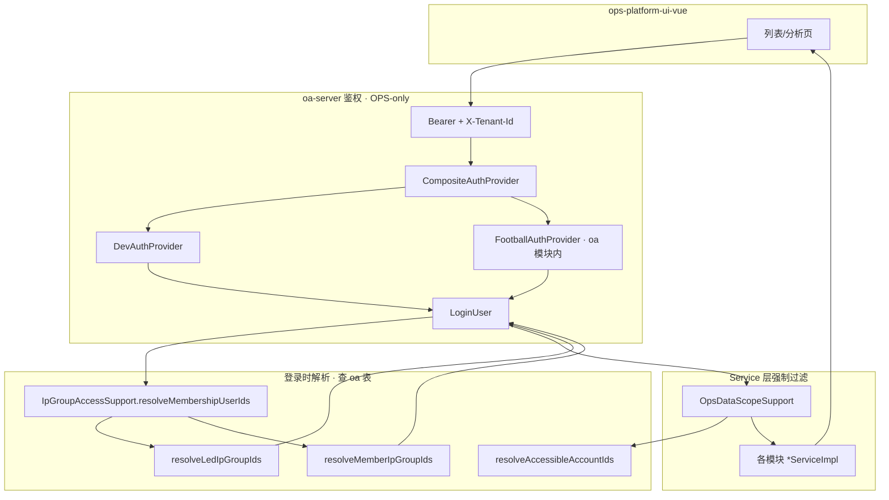
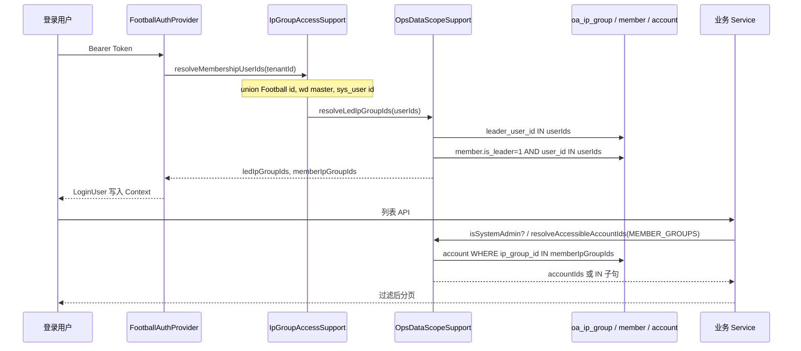

# OPS 数据权限实现方案（OPS-only）

> **范围**：仅 `ops-platform-module-oa`（oa-server）+ `ops-platform-ui-vue`  
> **输入**：`OPS-DATA-PERMISSION-GAP-ANALYSIS.md`、用户菜单表（6112–6159、6174）  
> **约束**：**不改动** `football-backend-saas`、`football-front` 原生模块、`member-server`  
> **生成**：2026-07-16

---

## Executive Summary

| 项 | 决策 |
|----|------|
| 中心组件 | 新建 `OpsDataScopeSupport`，扩展 `IpGroupAccessSupport` |
| 登录态增强 | **仅 oa-server** 内扩展 `FootballAuthProvider` / `DevAuthProvider` → `LoginUser` 注入 `memberIpGroupIds`、`ledIpGroupIds`（**不算 Football 改动**） |
| IP 组长判定 | `oa_ip_group.leader_user_id` **或** `oa_ip_group_member.is_leader=1`，经 `resolveMembershipUserIds` ID 桥接 |
| 账号类菜单默认范围 | 用户 **成员组**（`oa_ip_group_member`）下 `oa_account` |
| 人效 / IP 组管理 | **组长管辖组**（`ledIpGroupIds`）三分支 |
| 自己创建类 | `TenantBaseDO.creator`（username）匹配当前 `LoginUser.username` |
| 首推 PR | Phase 0 基础设施 + **6149/6174 平台账号**（可复用 Helper + 最高越权面） |

---

## 1. 架构总览

### 1.1 数据权限链路（mermaid）



### 1.2 与 Football 的边界

| 位置 | 是否改动 | 说明 |
|------|----------|------|
| `football-backend-saas` | **否** | 不碰 OAuth、不碰 `system_role` seed |
| `football-front` / `member-server` | **否** | 不碰 author/*、不碰 member API |
| `ops-platform-module-oa` 内 `FootballAuthProvider` | **是（OPS）** | 读 Football token 后 **在 oa-server 查 oa 表** 填充 `LoginUser` |
| `system_menu` / Football RBAC seed | **否（本期）** | 数据范围不依赖 `data_scope=2` seed；登录时动态查 member 表 |

> **澄清**：`FootballAuthProvider` 位于 `ops-platform-module-oa`，属于 OPS 鉴权适配层；扩展 `LoginUser.ledIpGroupIds[]` **不计入 Football 代码变更**。

---

## 2. Phase A — 中心 Helper（oa-server）

### 2.1 `LoginUser` 扩展

**文件**：`framework/auth/LoginUser.java`

```java
@Data @Builder
public class LoginUser {
    // ... 现有字段 ...
    private String dataScope;           // ALL | IP_GROUP | SELF（RBAC 档）
    private Long ipGroupId;             // Dev 兼容：sys_user 单组
    private Set<Long> memberIpGroupIds; // oa_ip_group_member 多组
    private Set<Long> ledIpGroupIds;    // 组长管辖组（登录时预计算）
    private Boolean ipGroupLeader;      // ledIpGroupIds 非空
}
```

### 2.2 `OpsDataScopeSupport` API 草案

**新建**：`service/auth/OpsDataScopeSupport.java`（`@Component`，依赖 `IpGroupAccessSupport`、`IpGroupMapper`、`IpGroupMemberMapper`、`AccountMapper`）

```java
public enum AccountScopeMode {
    /** admin：不过滤 */
    ALL,
    /** 用户成员 IP 组下的账号（6112–6116、6146–6158、6149、6174 默认） */
    MEMBER_GROUPS,
    /** 用户任组长的 IP 组下账号（6156 组长分支辅助） */
    LED_GROUPS,
    /** 仅与本人 userId 直接关联（6156 others） */
    SELF
}

// --- 角色 / 范围判定 ---

/** dataScope==ALL，或 authorities 含 ROLE_OA_ADMIN / OA_ADMIN 等（与 gap Q3 默认一致） */
boolean isSystemAdmin(LoginUser user);

/** ledIpGroupIds 非空；业务 IP 组长，非 sys_role OPS_LEADER */
boolean isIpGroupLeader(LoginUser user);

// --- IP 组 ID 解析（tenant 隔离 + ID 桥接） ---

/** 复用 ContentReviewConfigService.listIpGroupIdsLedByUser 逻辑，上提至此 */
Set<Long> resolveLedIpGroupIds(Long userId, Long tenantId);

/** oa_ip_group_member 中 userId ∈ resolveMembershipUserIds 的 ip_group_id */
Set<Long> resolveMemberIpGroupIds(Long userId, Long tenantId);

/** member ∪ led 去重并集（需「任一组」场景） */
Set<Long> resolveAccessibleIpGroupIds(Long userId, Long tenantId);

// --- 账号 ID 解析 ---

/** SELECT id FROM oa_account WHERE tenant_id=? AND ip_group_id IN (...) */
Set<Long> resolveAccessibleAccountIds(Long userId, Long tenantId, AccountScopeMode mode);

// --- Wrapper 应用（非 admin 强制；空集合 → id=-1 防越权） ---

<T> void applyIpGroupIdIn(LambdaQueryWrapper<T> w, SFunction<T, Long> col);
<T> void applyAccountIdIn(LambdaQueryWrapper<T> w, SFunction<T, Long> col, AccountScopeMode mode);
<T> void applySelfCreator(LambdaQueryWrapper<T> w, SFunction<T, String> creatorCol);
<T> void applyAssigneeIn(LambdaQueryWrapper<T> w, SFunction<T, Long> assigneeCol);

void assertAccountReadable(Long accountId);
void assertIpGroupLedReadable(Long ipGroupId);  // 6159 详情
void assertSelfCreator(String creatorUsername, Long entityId);
```

### 2.3 扩展 `IpGroupAccessSupport`

保留现有 ID 桥接方法；新增委托或内联调用 `OpsDataScopeSupport`：

| 现有方法 | 用途 |
|----------|------|
| `resolveMembershipUserIds(tenantId)` | Football/wd/`sys_user` 三轨 userId 并集 |
| `resolveEquivalentUserIds(userId, tenantId)` | 详情/历史记录 userId 匹配 |
| `listMemberships(tenantId)` | 前端 `listMyIpGroups`、Dev 预填 |
| `hasUnrestrictedIpGroupAccess()` | → 委托 `OpsDataScopeSupport.isSystemAdmin` |

**上提**：将 `ContentReviewConfigService.listIpGroupIdsLedByUser` 核心查询迁至 `OpsDataScopeSupport.resolveLedIpGroupIds`，Review 服务改为调用 Helper（避免双份 SQL）。

### 2.4 改造 `DataScopeSupport`

**文件**：`framework/auth/DataScopeSupport.java`

```java
// 旧：仅 IP_GROUP 档 + 单 ipGroupId，null 时静默不过滤
// 新：委托 OpsDataScopeSupport.applyIpGroupIdIn
public static <T> void applyIpGroupScope(LambdaQueryWrapper<T> w, SFunction<T, Long> col) {
    OpsDataScopeSupport.getInstance().applyIpGroupIdIn(w, col); // 或注入式静态 holder
}
```

**新语义**：

- `isSystemAdmin` → 跳过
- 否则 `ip_group_id IN (memberIpGroupIds)`；**空集合 → `eq(id, -1)`**（fail-closed）
- **SELF 档非 admin 也执行 member 组过滤**（与产品表「others 看 IP 组账号」一致）
- 请求参数 `ipGroupId` 仅作 **缩小**（`IN` 与用户可访问组求交），不可扩大

### 2.5 Football Token → LoginUser（oa-server only）

**文件**：`service/auth/FootballAuthProvider.java`、`DevAuthProvider.java`

```java
// FootballAuthProvider.authenticate() 末尾，build 前：
Set<Long> memberIds = opsDataScopeSupport.resolveMemberIpGroupIds(user.getId(), user.getTenantId());
Set<Long> ledIds = opsDataScopeSupport.resolveLedIpGroupIds(user.getId(), user.getTenantId());
String dataScope = resolveDataScope(roles); // 保持 ALL/SELF 来自 Football role
// 非 ALL 且 memberIds 非空 → 有效 dataScope 视为 IP_GROUP（LoginUser 字段，不写 Football DB）

LoginUser loginUser = LoginUser.builder()
    // ...
    .dataScope(dataScope)
    .ipGroupId(memberIds.size() == 1 ? memberIds.iterator().next() : null) // Dev 兼容
    .memberIpGroupIds(memberIds)
    .ledIpGroupIds(ledIds)
    .ipGroupLeader(!ledIds.isEmpty())
    .build();
```

**不依赖** Football `system_role.data_scope=2` seed；member 关系以 **oa 表实时查询** 为准。

### 2.6 IP 组长链 — 逐步说明（含代码锚点）



| 步骤 | 动作 | 代码锚点 |
|------|------|----------|
| 1 | 从 Token 解析 Football 用户 | `FootballAuthProvider.authenticate` L66–76 |
| 2 | ID 桥接：同 username 的 wd / shenyu / sys_user id | `IpGroupAccessSupport.resolveMembershipUserIds` L40–52 |
| 3 | 查组长组：`leader_user_id IN userIds` | `ContentReviewConfigService.listIpGroupIdsLedByUser` L157–164 |
| 4 | 查组长组：`member.is_leader=1` | 同上 L166–180 |
| 5 | 查成员组：`oa_ip_group_member.user_id IN userIds` | `IpGroupAccessSupport.listMemberships` L114–122 |
| 6 | 查组内账号：`oa_account.ip_group_id IN groupIds` | **新增** `OpsDataScopeSupport.resolveAccessibleAccountIds` |
| 7 | Service 强制 `account_id IN (...)` | 各 `*ServiceImpl`（见 §3） |

---

## 3. Phase B — 20 菜单过滤映射

**图例**

- **Admin**：`isSystemAdmin` → 仅 `tenant_id`
- **Others**：非 admin 的默认分支
- **IP组长**：`isIpGroupLeader` 的业务分支（6156、6159）

| Menu | 菜单 | 用户规则 | Service 方法 | SQL / 过滤模式 |
|------|------|----------|--------------|----------------|
| **6112** | 高粉账号分析 | Admin 全量；Others IP 组账号 | `MonitorServiceImpl.highFollowerList` → `followerAccountList` | `oa_account.id IN resolveAccessibleAccountIds(MEMBER_GROUPS)`；可选 `ipGroupId` 求交 |
| **6113** | 爆款作品分析 | Admin 全量；Others IP 组账号作品 | `MonitorServiceImpl.hitList` → `buildBaseWrapper` | `oa_external_work.ip_group_id IN memberIpGroupIds` **或** `account_id IN (...)` 子查询 |
| **6115** | 低粉账号分析 | 同 6112 | `MonitorServiceImpl.lowFollowerList` | 同 6112 |
| **6116** | 低分作品分析 | 同 6113 | `MonitorServiceImpl.lowScoreList` | 同 6113 |
| **6117** | 内容管理 | Admin 全量；Others 自己创建 | `ProductionContentServiceImpl.list` + `ContentDataScopeSupport` | **P1 收窄**：`creator_user_id IN userIds`（去掉 author/task 扩展，待产品确认）；现状见 `applyOwnContentFilter` |
| **6118** | 内容审核 | **审核人为自己** | `ContentDataScopeSupport.applyListScope` + `ContentReviewConfigService` | 待审态：`status IN (PENDING_*)` **且** `userId ∈ listEligibleReviewerUserIds(content, stage)`；一级 OPS_LEADER 配置时 = 内容 `ip_group_id ∈ ledIpGroupIds`；二级 = `hasRole(DEPT_HEAD)` |
| **6121** | 计划管理 | Admin 全量；Others 自己创建 | `ContentPlanServiceImpl.list` / `get` | `creator = LoginUser.username`（`ContentPlanDO` 继承 `TenantBaseDO.creator`） |
| **6124** | 任务管理 | Admin 全量；Others 执行人为自己 | `TaskServiceImpl.list` | `assignee_id IN resolveMembershipUserIds`；`list` 默认与 `myTasks` 同语义 |
| **6125** | 自定义查询 | Admin 全量；Others 自己创建 | `CustomQueryServiceImpl.list` / `execute` | `creator = username`；execute 前 `assertSelfCreator` |
| **6128** | 漏斗分析 | Admin 全量；Others 自己创建 | `FunnelServiceImpl.list` / `getData` | `creator = username`；`getData` 内账号维度额外 `applyAccountIdIn(MEMBER_GROUPS)` |
| **6130** | 指标分析 | Admin 全量；Others 自己创建 | `AnalyticsMetricServiceImpl.list` / `preview` | `creator = username`（与 6129 共用 Service，仅 list/preview 路径加过滤） |
| **6146** | 账号成本管理 | Admin 全量；Others IP 组账号 | `AccountCostServiceImpl.list` | 经 `account_id IN resolveAccessibleAccountIds(MEMBER_GROUPS)` join `oa_account` |
| **6147** | ROI 分析 | Admin 全量；Others IP 组账号 | `FinanceRoiServiceImpl` 各 aggregate 方法 | 强制 `account_id IN (...)` 或 `ip_group_id IN memberIpGroupIds`；忽略未授权的请求参数 |
| **6149** | 平台账号管理 | Admin 全量；Others IP 组账号 | `PlatformAccountServiceImpl.listOaAccounts` / `get` / `assertAccountReadable` | `applyIpGroupIdIn` on `AccountDO.ip_group_id`；详情 `assertAccountReadable` |
| **6154** | 账号分析 | Admin 全量；Others IP 组账号 | `AccountAnalysisServiceImpl` 列表/趋势 | 替换 `applyIpGroupScope` → `applyAccountIdIn`；`passesIpGroupDataScope` → `assertAccountReadable` |
| **6156** | 人效盘点 | Admin 全量；**IP 组长看组员**；Others 看自己 | `ProductivityReviewServiceImpl.list` / `detail` | 三分支：`ALL` → 现逻辑；`isIpGroupLeader` → `user_id IN (组长管辖组全部 member.user_id)`；else → `user_id IN resolveMembershipUserIds`（仅自己） |
| **6157** | 粉丝分析 | Admin 全量；Others IP 组账号 | `FollowerAnalysisServiceImpl.resolveAccountIds` | `account_id IN resolveAccessibleAccountIds(MEMBER_GROUPS)` |
| **6158** | 内部作品分析 | Admin 全量；Others IP 组账号 | `ContentAnalysisServiceImpl.resolveAccountIds` | 同 6157 |
| **6159** | IP 组管理 | Admin 全树；**IP 组长仅自己的组**；Others 不可见 | `IpGroupServiceImpl.getTree` / `listPage` / `getDetail` | Admin：tenant 全量；Leader：`id IN ledIpGroupIds`；Others：`403` 或空 + `assertIpGroupLedReadable`  on 写操作 |
| **6174** | 平台账号查询（按钮） | 同 6149 | `PlatformAccountController` → `PlatformAccountServiceImpl` | 同 6149 |

### 3.1 特殊场景说明

#### 6118 内容审核 —「审核人为自己」

| 层级 | 行为 |
|------|------|
| 列表 | `status` 为待审 **且** 当前用户对该 content+stage 满足 `canReview(userId, content, stage)` |
| 一级审核 + 配置 `OPS_LEADER` | 等价于 IP 组长：内容的 `ip_group_id` 必须在 `ledIpGroupIds` |
| 二级审核 | 用户拥有 `DEPT_HEAD`（或配置 role） |
| 与 6117 区别 | 6117 走 `applyOwnContentFilter`；6118 走审核队列分支（`ContentDataScopeSupport` L36–44） |

**改造点**：将 `listEligibleReviewerUserIds` 过滤下推到 SQL（子查询或内存 filter 二阶段），确保列表不会出现「可见但不可审」记录。

#### 6159 IP 组管理

- 复用已有 `listLedByCurrentUser()`（`IpGroupServiceImpl` L100–151）作为 Leader 列表数据源
- `getTree` / `listPage`：**禁止** tenant 全量；Leader 仅返回 `ledIpGroupIds` 子树
- Others：返回空列表 + 写接口 `403`（`OaErrorCodes.FORBIDDEN`）

#### 6156 人效盘点

- **组长看组员**：组员 = **组长管辖组**（`ledIpGroupIds`）下 `oa_ip_group_member.user_id`，再 union `resolveEquivalentUserIds` 匹配 Football 用户
- **Others 看自己**：`sys_user.id IN resolveMembershipUserIds` 或 Football 用户映射
- **注意**：Football 用户可能不在 `sys_user`；需通过 member 表反查 userId 列表，而非仅 `sys_user.ip_group_id`

#### 6125 / 6128 / 6130 —「自己创建」实体

| 菜单 | 实体 | 所有者字段 | 过滤 |
|------|------|------------|------|
| 6125 自定义查询 | `CustomQueryDO` | `creator`（username，`TenantBaseDO`） | `eq(creator, loginUser.username)` |
| 6128 漏斗分析 | `FunnelDO` | `creator` | 同上 |
| 6130 指标分析 | `MetricDO` | `creator` | 同上 |
| 6121 计划管理 | `ContentPlanDO` | `creator` | 同上 |

> **无 `creator_user_id`**：Phase 2 用 username 匹配；Phase 4（P1）可 Flyway 补列并双写迁移。

---

## 4. Phase C — 前端 OPS 改动（最小）

**范围**：`ops-platform-ui-vue` only

| 类型 | 文件示例 | 改动 |
|------|----------|------|
| 移除「不传 ipGroupId = 全量」依赖 | `HighFansAccountAnalysis.vue`、`AccountAnalysis.vue`、`FollowerAnalysis.vue`、`InternalContent.vue`、`FinanceRoi*.vue` | 删除默认「全部 IP 组」假设；`ipGroupId` 可选作 **缩小**；列表失败空态文案 |
| IP 组下拉 | 共用 `IpGroupTreeSelect` | 非 admin：调用 `GET /oa/ip-group/led` 或 `listMyMemberships`（若有）限制选项 |
| 人效 | `Efficiency.vue`（或等价路由） | 非组长隐藏「组员」筛选项；后端已强制 |
| IP 组管理 | `IpGroup.vue` | 非 admin 非组长：隐藏入口或展示无权限（**Layout 仍硬编码菜单 — 见限制**） |
| API 层 | `api/platform-account.ts`、`api/monitor.ts` 等 | 文档注释：`ipGroupId` 为 optional narrow |

**Layout 限制**：`Layout.vue` 菜单硬编码，本期 **不做** 按权限动态隐藏（仅 note）；功能权限仍靠后端 `@PreAuthorize` + 数据过滤。

---

## 5. Phase D — 明确不改

| 项 | 说明 |
|----|------|
| `football-backend-saas` | OAuth、system_role、system_menu |
| `football-front` views/author/* | 作者端原生模块 |
| `member-server` | 会员/作者服务 |
| Football RBAC seed | 不新增 `data_scope=2`；oa 登录时查 member 表 |
| `system_menu` 6112–6174 | 不改菜单 ID；可选更新 `oa-menu-permission-map.csv` data_scope 列 |

---

## 6. 分阶段落地（Phase 0–4）

### Phase 0 — 基础设施（阻塞，~2–3d） ✅ 2026-07-16

**目标**：LoginUser enriched + Helper + fail-closed + IT 骨架

| 任务 | 文件 | 状态 |
|------|------|------|
| `LoginUser` 新字段 | `framework/auth/LoginUser.java` | ✅ |
| 新建 `OpsDataScopeSupport` | `service/auth/OpsDataScopeSupport.java` | ✅ |
| 上提 `resolveLedIpGroupIds` | `OpsDataScopeSupport` + 改 `ContentReviewConfigService` | ✅ |
| 改造 `DataScopeSupport` | `framework/auth/DataScopeSupport.java` | ✅ |
| Football/Dev 登录注入 | `FootballAuthProvider.java`、`DevAuthProvider.java` | ✅ |
| IT：operator 仅见本组账号 | `OpsDataScopeIT.java` | ✅（H2 skip V137/V145，见 §6.1） |
| E2E probe | `scripts/probe-ops-data-scope.py` | ✅ 11/11 |

**DoD**：Dev Token `OPS_OPERATOR` + Football mock token；非 admin 空 member 组 → 列表 0 条（非全量）。

### Phase 1 — IP 组账号类（P0，~3–4d） ✅ 2026-07-16

**菜单**：6112、6113、6115、6116、6146、6147、6149、6154、6157、6158、6174

| 模块 | 文件 | 状态 |
|------|------|------|
| M7 监测 | `MonitorServiceImpl.java`、`MonitorController.java` | ✅ |
| M4 账号 | `PlatformAccountServiceImpl.java` | ✅ |
| M1 运营分析 | `AccountAnalysisServiceImpl.java`、`FollowerAnalysisServiceImpl.java`、`ContentAnalysisServiceImpl.java` | ✅ |
| M5 财务 | `AccountCostServiceImpl.java`、`FinanceRoiServiceImpl.java` | ✅ |
| 测试 | `M7MonitorS01IT.java`、账号相关 IT 补充 | ✅ |

### Phase 2 — 自己创建 / 执行人（P0，~2d） ✅

**菜单**：6121、6124、6125、6128、6130

| 模块 | 文件 | 状态 |
|------|------|------|
| 计划 | `ContentPlanServiceImpl.java` | ✅ list/get + 写操作 `assertSelfCreator` |
| 任务 | `TaskServiceImpl.java` | ✅ list 默认 `applyAssigneeIn`；executorId 求交 |
| 分析 | `CustomQueryServiceImpl.java`、`FunnelServiceImpl.java`、`AnalyticsMetricServiceImpl.java` | ✅ creator 过滤 + execute/getData 鉴权 |
| Helper | `OpsDataScopeSupport.java` | ✅ `applySelfCreator` / `applyAssigneeIn` / `assertSelfCreator` |
| 测试 | `OpsDataScopePhase2IT.java` | ✅ 任务/查询/漏斗/指标 scope IT |

### Phase 3 — 特殊三分支（P0，~2d） ✅

**菜单**：6117（P1 收窄）、6118、6156、6159

| 模块 | 文件 | 状态 |
|------|------|------|
| 内容 | `ContentDataScopeSupport.java`、`ProductionContentServiceImpl.java` | ✅ 6117 仅 creator_user_id；6118 SQL+canReview 二阶段 |
| 人效 | `ProductivityReviewServiceImpl.java` | ✅ admin/组长/自己 三分支 |
| IP 组 | `IpGroupServiceImpl.java` | ✅ admin 全树；组长 ledIpGroupIds；others 403 list+tree |
| Helper | `OpsDataScopeSupport.java` | ✅ productivity / ip-group management helpers |
| 测试 | `OpsDataScopePhase3IT.java` | ✅ 人效/IP组/内容审核 scope IT |

### Phase 4 — 前端体验（P1，~1d） ✅ 2026-07-17

见 §4；`docs/engineering/OPS-RBAC-DATA-SCOPE.md` 已同步。

| 项 | 状态 |
|----|------|
| `IpGroupTreeSelect scope=accessible`（6154/6157/6158/6146/6147/6156 等） | ✅ |
| 监测页 6112–6116：无 IP 组下拉，后端强制 + `DATA_SCOPE_EMPTY_TEXT` | ✅（按 RBAC 文档约定） |
| `oa-menu-permission-map.csv` `data_scope` / `menu_id` 列 | ✅ |
| `scripts/probe-ops-data-scope.py` | ✅ 11/11 |
| `scripts/mount-ops-all.py` | ✅ 无新增 UI 变更需 mount |

### 6.1 H2 IT 基础设施说明（已知债务 · 已缓解）

| 项 | 说明 |
|----|------|
| **现象** | Flyway V137 `sync_shenyu_system_menus` 依赖 MySQL `system_menu` 表，H2 test profile 无此表 → ApplicationContext 启动失败 |
| **修复** | `H2FlywaySkipCommentsConfiguration` 将 V137、V145 标记为 H2 skip（与 V126–133 同类） |
| **验收** | ApplicationContext **可启动**（V137 阻塞已解除）；IT 运行时可能因 H2 基线停在 V124、跳过 V128/V139 等列迁移而报 `Column not found` — 以 `probe-ops-data-scope.py` 11/11 为 Phase 0–4 主验收 |
| **残余** | 全量 H2 IT 绿需扩展 `h2-post124-*.sql` 或放宽 skip 策略；不阻塞数据权限闭环 |

## 7. 推荐首个 PR 范围

**最小有价值切片**：**Phase 0 + Phase 1 中的 6149/6174（平台账号）**

| 理由 | 说明 |
|------|------|
| 复用面 | `OpsDataScopeSupport` + `applyIpGroupIdIn` 被 10+ 菜单复用 |
| 风险 | 账号列表当前 Football 下 **tenant 全量**，越权面最大 |
| 可测 | 已有 `PlatformAccountServiceImpl` IT / 手工路径清晰 |
| 不含歧义 | 不涉及 6118 审核语义、6156 三分支产品确认 |

**PR 文件清单（建议 ≤12 files）**：

1. `LoginUser.java`
2. `OpsDataScopeSupport.java`（新）
3. `DataScopeSupport.java`
4. `IpGroupAccessSupport.java`（薄委托）
5. `FootballAuthProvider.java`
6. `DevAuthProvider.java`
7. `ContentReviewConfigService.java`（delegate led 查询）
8. `PlatformAccountServiceImpl.java`
9. `OpsDataScopeIT.java`（新）
10. Platform account 相关 IT 调整

**PR 标题建议**：`feat(oa): OpsDataScopeSupport + platform account data scope enforcement`

---

## 8. 开放问题（实现前默认假设）

| # | 问题 | 默认假设（本方案采用） |
|---|------|------------------------|
| Q1 | IP 组账号 = 成员组还是组长组？ | **成员组**（账号类）；组长组仅 6156/6159 |
| Q2 | 6118「审核人为自己」 | 当前用户 ∈ `listEligibleReviewerUserIds`（一级 IP 组长 = led 组内内容） |
| Q3 | 系统管理员 | `dataScope==ALL` |
| Q4 | 6156 组员范围 | **组长管辖组**全部 member |
| Q5 | 外部作品过滤 | `ip_group_id IN memberIpGroupIds` + account 子查询兜底 |
| Q6 | 6125 PUBLISHED 模板 | 仍仅创建者（与 gap 一致） |
| Q7 | Football data_scope=2 | **不依赖**；oa 登录查 member 表 |

---

## 9. 相关文档

- [OPS-DATA-PERMISSION-GAP-ANALYSIS.md](./OPS-DATA-PERMISSION-GAP-ANALYSIS.md)
- [OPS-RBAC-DATA-SCOPE.md](../engineering/OPS-RBAC-DATA-SCOPE.md)
- [OPS-MENU-LIST.md](./OPS-MENU-LIST.md)
- ADR-017（内容审核）、ADR-047/049（Football 权限合并）

---

*OPS-only · 不改动 Football 原生仓库 · oa-server FootballAuthProvider 扩展属 OPS 鉴权适配*  
*闭环：Phase 0–4 ✅ 2026-07-17 · probe 11/11*
