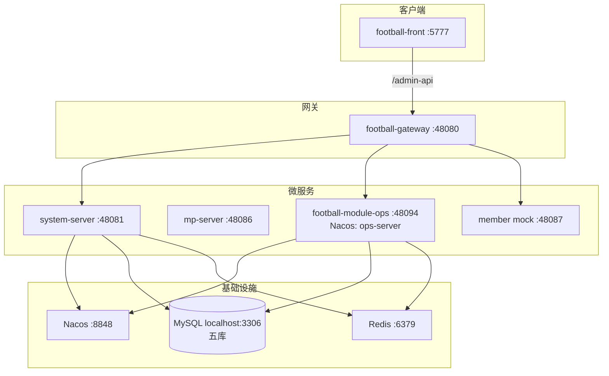

# Ops × Football 开发调试与部署操作指南

> **版本**：v1.2 | 2026-07-23  
> **性质**：运维/开发上手 SSOT（基于仓库现有脚本与配置，不编造未实现的 CI/CD）  
> **关联**：[OPS-STARTUP-MATRIX](./OPS-STARTUP-MATRIX.md)（启动路径对比）· [INTEGRATION-PROGRESS](./INTEGRATION-PROGRESS.md) · [ADR-047](../adr/ADR-047-Football-Ops平台集成决策.md) · [ADR-050](../adr/ADR-050-Ops与Football多库复用总纲.md) · [ADR-056](../adr/ADR-056-Football用户身份SSOT.md)

### 快速启动（日常默认）

```powershell
# 仓库根目录 — Gate / 集成栈一键启动（含 Redis/MySQL 预检，无需手改 redis-cli）
.\scripts\start-ops-dev.ps1
# OPS 页面重挂到 football-front（views/ops 缺失时脚本会自动 mount）：
.\scripts\start-ops-dev.ps1 -MountOps
```

登录：http://localhost:5777 · `admin` / `admin123` · 租户 **1**  
Gate 路径**不需要** `ops-platform-ui-vue :3000`。`football-front` / `football-backend-saas` 应在 Gitee **`ops`** 分支（见 [FOOTBALL-OPS-BRANCH.md](./FOOTBALL-OPS-BRANCH.md)）。

**DB 默认 = 本地**：MySQL `localhost:3306`（`shenyu-ops` / `shenyu-system` / `shenyu-member` / `shenyu-mp` / `shenyu-pay`，root/root）+ Redis `127.0.0.1:6379`（密码 `123456`）。历史本地库名 `football-ops` / `wd` 可保留作备份，应用默认已切 **`shenyu-ops`**（与 Beta 同名）。**Beta 远程**（`110.42.49.224`）仍为 `shenyu-ops`，仅 opt-in：见 [OPS-TEST-DB.md](./OPS-TEST-DB.md)（`ops-test-remote.env` + `dev-test-beta`）。

---

## 1. 概述

本仓库包含 **Ops 运营数据平台** 与 **Football SaaS 基座** 的集成单体工作区。**日常开发默认入口**为 **`.\scripts\start-ops-dev.ps1`**（Football 集成 / Gate 路径）。另有 **两条互补路径** 用于特定场景：

| 路径 | 用途 | 一键脚本 |
|------|------|----------|
| **B — Football 集成（Gate 路径，默认）** | Gate 签收、多库、Gateway 鉴权、5777 全菜单 E2E | **`.\scripts\start-ops-dev.ps1`**（推荐；内部调用 `start-integration-all.ps1`） |
| **A — Ops Standalone** | 快速改 Ops 页面/API，无需 Football 壳；**非 Gate 签收路径** | `.\scripts\start-ops-standalone.ps1` |
| **C — Standalone + Collector** | M10 采集真实联调（:8000 collector + :8080 oa） | `.\scripts\restart-all.ps1` |

**生产目标形态**（ADR-047 / ADR-058）：浏览器 → **football-front** → **Gateway :48080** → Nacos 发现 → 各微服务（含 **football-module-ops**，Nacos 注册名 **`ops-server`**）。Standalone `:3000/:8080` **不是**生产路径。

### 1.1 架构简图（集成路径）



---

## 2. 环境准备

### 2.1 软件依赖

| 组件 | 版本建议 | 用途 | 必需场景 |
|------|----------|------|----------|
| **JDK** | 17+ | football-module-ops、Football 后端 JAR | A / B / C |
| **Maven** | 3.8+ | 后端构建与 `spring-boot:run` | A / B / C |
| **Node.js** | 18+ | 前端 dev/build | A / B |
| **npm** | 随 Node | `ops-platform-ui-vue` | A / C |
| **pnpm** | 最新稳定 | `football-front` monorepo | B |
| **MySQL** | 8.x | 业务库 | B（五库）；A 默认远程单库 |
| **Docker Desktop** | 可用 CLI | Nacos、Redis 容器 | B（推荐） |
| **Python** | 3.11+ | member mock、schema patch、collector | B / C |
| **redis-cli** | 可选（脚本自动调用） | `Ensure-IntegrationRedis` 探测/设密 | B |
| **mysql 客户端** | 可选 | 五库存在性检查 | B |

### 2.2 仓库目录（关键子项目）

| 路径 | 说明 |
|------|------|
| `football-backend-saas/football-module-ops/` | Ops 后端（`football-module-ops-server`，Nacos **`ops-server`**，:48094） |
| `football-front/apps/web-ele/src/views/ops/` | Ops 集成前端（Gate UI :5777） |
| `football-backend-saas/` | Football 微服务（Gateway、system、mp、member 等） |
| `football-front/` | Football 前端壳（集成 UI :5777） |
| `unify-collector-api/` | M10 统一采集 API（Python FastAPI :8000） |
| `scripts/` | 一键启动/停止/验收 PowerShell 脚本 |
| `docs/sql/` | Football 四库 SQL 快照（如 `shenyu-system0708.sql`）；`wd-schema.sql` 为 wd **仅结构**导出（见 `scripts/export-wd-schema.py`） |

### 2.3 本地 MySQL 五库（集成路径 B 必需）

Integration / Gate 路径使用 **localhost:3306** 五个 schema（profile `dev-local-multidb`）：

| 数据源名 `@DS` | 数据库 | 用途 |
|----------------|--------|------|
| `master` | `shenyu-ops`（历史备份：`football-ops` / `wd`） | Ops 配置、Flyway、OA 业务表 |
| `member` | `shenyu-member` | 作者域 SSOT |
| `mp` | `shenyu-mp` | 微信公众号账号 |
| `pay` | `shenyu-pay` | 订单只读 |
| `system` | `shenyu-system` | Football 平台用户/角色/菜单/字典/日志（ADR-056：身份 + **OPS 菜单 RBAC** SSOT） |

默认凭证（见 `application-dev-local-multidb.yml`）：**root / root**

```sql
-- 最小建库（字符集 utf8mb4）
CREATE DATABASE IF NOT EXISTS `shenyu-ops` DEFAULT CHARSET utf8mb4;
CREATE DATABASE IF NOT EXISTS `shenyu-member` DEFAULT CHARSET utf8mb4;
CREATE DATABASE IF NOT EXISTS `shenyu-mp` DEFAULT CHARSET utf8mb4;
CREATE DATABASE IF NOT EXISTS `shenyu-pay` DEFAULT CHARSET utf8mb4;
CREATE DATABASE IF NOT EXISTS `shenyu-system` DEFAULT CHARSET utf8mb4;
```

Football 四库初始数据可参考 `docs/sql/shenyu-*.sql` 导入；`shenyu-ops` 由 **football-module-ops** 启动时 **Flyway** 自动迁移。多库程序细节见 [OPS-FOOTBALL-MULTI-DB-EXECUTION-PLAN](./OPS-FOOTBALL-MULTI-DB-EXECUTION-PLAN.md)。

### 2.4 首次依赖安装（手动，脚本不自动执行）

```powershell
# Ops 独立前端
cd ops-platform-ui-vue
npm install

# Football 前端（集成路径）
cd football-front
pnpm install
# Ops 图表等依赖软链（按需）
cd ..
.\scripts\link-ops-deps.ps1

# Collector（路径 C / M10 真实联调）
cd unify-collector-api
python -m venv .venv
.\.venv\Scripts\Activate.ps1
pip install -r requirements.txt
playwright install chromium   # 扫码登录类平台需要
```

### 2.5 Docker 本地中间件（集成路径）

| 容器名 | 镜像 | 端口 | 凭证 |
|--------|------|------|------|
| `nacos-standalone-local` | `nacos/nacos-server:v2.3.2` | 8848, 9848 | nacos / nacos（`NACOS_AUTH_ENABLE=false`） |
| `redis-integration-local` | `redis:7` | 6379 | 密码 **123456** |

由 `start-nacos-local.ps1` / `start-integration-all.ps1` 自动创建；也可手动：

```powershell
.\scripts\start-nacos-local.ps1
# Redis 由 start-ops-dev.ps1 内 Ensure-IntegrationRedis 处理
```

### 2.6 Redis 密码自动修复（集成路径）

集成栈要求 Redis **:6379** 密码为 **123456**（见 `gateway-integration-local.yaml` / `football-integration-overlay.yml`）。**无需手动 `redis-cli CONFIG SET`** — 日常只跑 `start-ops-dev.ps1` 即可。

| 脚本 / 函数 | 行为 |
|-------------|------|
| `lib/integration-preflight.ps1` → **`Ensure-IntegrationRedis`** | 探测 :6379 认证状态；无密码则 `CONFIG SET requirepass 123456` + `CONFIG REWRITE`；密码不匹配且 Docker 可用则起 `redis-integration-local` 容器 |
| **`start-ops-dev.ps1`** | 启动前调用预检；**失败即 exit 1**（避免 Gateway DOWN 后 UI 才报「内部服务错误」） |
| **`start-integration-all.ps1`** | 同样调用 `Ensure-IntegrationRedis`；预检失败 **fail-fast** |
| **`stop-integration-all.ps1`** | **默认不杀 :6379**（避免 Windows 本机 `redis-server` 服务重启后丢失 `requirepass`）；仅 `-StopRedis` 时额外释放 6379 |

**根因（已修复）**：旧版 `stop-integration-all.ps1` 在 `-Restart` 流程中会杀掉 :6379；Windows 本机 `redis-server` 以服务方式重启后**无密码**，而 Gateway/system 仍期望 **123456**，导致登录链失败、UI「内部服务错误」。现停止脚本默认保留 Redis 监听，启动脚本自动补设密码。

### 2.7 OPS 菜单 seed → `shenyu-system`（ADR-056）

system-server 本地 master 指向 **`localhost:3306/shenyu-system`** 后，Football 侧栏菜单从该库 `system_menu` / `system_role_menu` 读取。OPS 菜单块 **id 6100–6999**（权限前缀 **`ops:*`**，ADR-058 P-D）须灌入 **shenyu-system**，否则登录后看不到「运营数据」。

| 产物 | 路径 |
|------|------|
| SQL（幂等 DELETE+INSERT） | `scripts/integration-config/seed-oa-system-menu.sql` |
| UTF-8 导入器（**禁止** PowerShell 管道） | `scripts/integration-config/apply-seed-oa-menu.py` |
| 菜单↔权限映射 | `docs/delivery/oa-menu-permission-map.csv` |
| 从 Ops 路由重生成 SQL | `scripts/extract-oa-menu.py` |

**本地五库灌入（推荐）**

```powershell
# 仓库根目录 — stdin utf8mb4，避免中文变成 ????
python scripts/integration-config/apply-seed-oa-menu.py `
  --host localhost --port 3306 --user root --password root `
  --database shenyu-system
```

脚本行为：删除 `menu_id/id ∈ [6100,7000)` 的旧 OPS 行 → 插入完整菜单树 → 将全部 OPS 菜单授予 **`super_admin`（role_id=1, tenant_id=1）**。本地 `admin` 用户已绑定 role_id=1。

**已执行记录（localhost）**：2026-07-23 对 `shenyu-system` 执行上述命令。灌入前 OPS 菜单 **5** / role_menu **5**（残留 6137–6139 等）；灌入后菜单 **71** / role_menu **61**；`get-permission-info` 可见顶级「运营数据」(`/ops`) 与「IP组管理」等。

**校验 SQL**

```sql
SELECT COUNT(*) FROM `shenyu-system`.system_menu WHERE id >= 6100 AND id < 7000 AND deleted=0;
SELECT id, name, path FROM `shenyu-system`.system_menu WHERE id IN (6100,6159,6168);
```

**UI 校验**：http://localhost:5777 以 `admin` / `admin123`（租户 1）登录 → 侧栏应出现 **运营数据** → **运营管理 → IP组管理**；或调 `GET /admin-api/system/auth/get-permission-info`（Bearer）确认 `menus` 含 id 6100 / 6159。

**前端必须连本机 Gateway**（两处，改完后必须重启 `:5777`）：

1. **主路径**：`football-front/apps/web-ele/vite.config.mts` 里 `/admin-api` 的 `proxy.target` → `http://localhost:48080/admin-api`（`apiURL`=`VITE_GLOB_API_URL`=`/admin-api`，请求走 Vite 代理；若仍指向 `110.42.49.224` / `192.168.10.x`，菜单管理/侧栏读**远程库**，本地 OPS 6100+ 不可见）。
2. **辅路径**：`.env.development` 中 `VITE_BASE_URL=http://localhost:48080`（WebSocket / Swagger 等）。

`start-integration-all.ps1` 预检会校验 proxy target。

> Flyway `V159`/`V160` 作用于 **wd**（任务菜单拆分 / `sys_permission`），**不能**替代本 seed。历史文档若写「OPS 菜单在 wd.system_menu」，在 ADR-056 本地集成路径下以 **shenyu-system** 为准。

---

## 3. 开发调试启动

> **默认**：Gate / 多库 / 5777 集成开发 → **`.\scripts\start-ops-dev.ps1`**。Standalone（:3000/:8080）与 Collector 路径见 §3.1、§3.3。

### 3.1 路径 A — Ops Standalone（最小栈）

**场景**：日常改 Ops 页面/API，不需要 Football 菜单/Gateway/Nacos。

```powershell
# 仓库根目录
.\scripts\start-ops-standalone.ps1
# 仅后端：.\scripts\start-ops-standalone.ps1 -NoFrontend
```

| 组件 | 端口 | 启动方式 |
|------|------|----------|
| oa-server | **8080** | `mvn spring-boot:run '-Dspring-boot.run.profiles=dev'` |
| ops-platform-ui-vue | **3000** | `npm run dev` |

**访问**

- 前端：http://localhost:3000  
- 后端健康：http://localhost:8080/actuator/health  

**鉴权**

| Header | 值 |
|--------|-----|
| `Authorization` | `Bearer dev-token-oa-admin` |
| `X-Tenant-Id` | `1` |

前端 `.env.development` 已配置 `VITE_API_TOKEN=dev-token-oa-admin`。

**数据库**：profile **`dev` only** → `application-dev.yml` 默认 **101.37.161.136:3306/wd**（远程单库，**非** localhost 五库）。与 Gate 路径数据 **不是同一套**。

**日志**：`scripts/logs/backend-dev-run.log`、`frontend-dev-run.log`

---

### 3.2 路径 B — Football 集成栈（Gate 推荐）

**场景**：Gate 签收、MDB 多库、Football 登录、5777 全菜单 E2E。

#### 3.2.1 推荐一键启动

```powershell
# 日常：重启栈 + 跳过 Maven 构建（快）
.\scripts\start-ops-dev.ps1

# 首次 / 后端大改：含 Football 模块 Maven 构建（慢）
.\scripts\start-ops-dev.ps1 -FirstRun

# 不杀已有进程，只补缺失服务
.\scripts\start-ops-dev.ps1 -NoRestart

# 强制重挂 OPS 到 football-front（views/ops 为空时会自动 mount）
.\scripts\start-ops-dev.ps1 -MountOps

# 无 UI / 无 Nacos
.\scripts\start-ops-dev.ps1 -SkipFrontend
.\scripts\start-ops-dev.ps1 -SkipNacos
```

`start-ops-dev.ps1` 内部调用 `start-integration-all.ps1`，并做 Redis/MySQL/Docker、**ops 分支告警**、**views/ops mount**、**vite → localhost:48080** 预检。Gate UI 为 `:5777`（`pnpm dev:ele`），**不启动** standalone `:3000`。

#### 3.2.2 完整参数（start-integration-all.ps1）

```powershell
.\scripts\start-integration-all.ps1
.\scripts\start-integration-all.ps1 -Restart -SkipBuild
.\scripts\start-integration-all.ps1 -SkipNacos -SkipFrontend
.\scripts\start-integration-all.ps1 -SkipOa -SkipBuild
.\scripts\start-integration-all.ps1 -FullMemberServer   # 真 member JAR 替代 Python mock
```

| 参数 | 说明 |
|------|------|
| `-Restart` | 先执行 `stop-integration-all.ps1` 再启动 |
| `-SkipBuild` | 跳过 Football Maven 打包（需已有 JAR） |
| `-SkipNacos` | 不启 Docker Nacos（需 :8848 已存在） |
| `-SkipFrontend` | 不启 football-front |
| `-SkipOa` | 不启 football-module-ops（:48094） |
| `-FullMemberServer` | 使用 member-server JAR（:48087），默认 Python mock |
| `-WaitSeconds` | 健康等待超时（默认 300） |

#### 3.2.3 服务端口与访问地址

| 服务 | 端口 | 探针 URL | 说明 |
|------|------|----------|------|
| Nacos | 8848 | http://127.0.0.1:8848/nacos/ | 控制台 nacos/nacos |
| Redis | 6379 | (tcp) | 密码 **123456** |
| Gateway | **48080** | http://127.0.0.1:48080/admin-api/system/tenant/simple-list | 统一 API 入口 |
| system-server | 48081 | http://127.0.0.1:48081/actuator/health | Football 登录 |
| mp-server | 48086 | http://127.0.0.1:48086/actuator/health | 公众号域 |
| member mock | 48087 | http://127.0.0.1:48087/actuator/health | 登录 Feign 桩（Hybrid C） |
| **football-module-ops** | **48094** | http://127.0.0.1:48094/actuator/health | Ops 微服务（Nacos 注册名 **`ops-server`**） |
| **football-front** | **5777** | http://127.0.0.1:5777/ | 集成 UI（hash 路由 `#/ops/...`） |

**登录（Gate 路径唯一）**

| 项 | 值 |
|----|-----|
| URL | http://localhost:5777 |
| 账号 | **admin** |
| 密码 | **admin123** |
| 租户 ID | **1** |
| API 基址 | http://localhost:48080/admin-api |

前端配置见 `football-front/apps/web-ele/.env.development`（`VITE_PORT=5777`，`VITE_BASE_URL=http://localhost:48080`）。

**football-module-ops profiles**（经 `start-integration-oa.ps1`）：`dev,dev-nacos,dev-nacos-local,dev-local-multidb`

> **路由约定（ADR-058）**：Gate 路径下 API 统一 **`/admin-api/ops/**`**（Gateway → Nacos `ops-server`）；前端 hash 路由 **`#/ops/**`**；API 客户端相对路径 **`/ops/**`**（baseURL 已含 `/admin-api`）。Standalone `:8080` 仍用历史 oa-server 命名，非 Gate 签收路径。

**Football 后端 profiles**：`local,local-nacos` + overlay `scripts/integration-config/football-integration-overlay.yml`

**停止 / 重启**

```powershell
# 日常重启：直接重跑 start-ops-dev.ps1（内部 -Restart，默认保留 Redis :6379）
.\scripts\start-ops-dev.ps1

# 仅停止 Java/Node 微服务（默认不杀 :6379，避免 Redis 密码丢失）
.\scripts\stop-integration-all.ps1
.\scripts\stop-integration-all.ps1 -SkipDocker    # 保留 Nacos/Redis Docker 容器
.\scripts\stop-integration-all.ps1 -StopRedis     # 显式释放 :6379（一般不需要）
```

**日志目录**：`scripts/logs/`（如 `gateway-integration.log`、`ops-server-nacos-run.log`（football-module-ops 进程日志，文件名保留 ops-server 前缀）、`football-front-dev.log`）

#### 3.2.4 分步启动（调试单个服务）

```powershell
# 1. Nacos
.\scripts\start-nacos-local.ps1

# 2. 推送 Nacos 本地配置
.\scripts\push-integration-config-to-nacos.ps1

# 3. 仅 football-module-ops（集成 profile；脚本名 start-integration-oa.ps1）
.\scripts\start-integration-oa.ps1

# 4. Nacos + football-module-ops
.\scripts\start-integration-stack.ps1

# 5. Football system/mp（Gateway 已单独运行时）
.\scripts\start-football-system.ps1 -SkipBuild
```

#### 3.2.5 member mock vs 真服

| 模式 | 端口 | 说明 |
|------|------|------|
| **默认 mock** | 48087 | `mock-member-author-server.py` — 仅登录 Feign 桩 |
| **FullMemberServer** | 48087 | 真 `football-module-member-server` JAR；可能依赖 RocketMQ |

Ops 作者 CRUD 经 football-module-ops Feign/RPC 读 **shenyu-member**（历史 Standalone 曾 `@DS("member")` 直连）。

---

### 3.3 路径 C — Standalone + Collector

**场景**：M10 采集 Channel-A 真实 E2E（需 collector 非 stub）。

```powershell
.\scripts\restart-all.ps1
.\scripts\restart-all.ps1 -NoFrontend
```

| 组件 | 端口 |
|------|------|
| unify-collector-api | **8000** |
| oa-server (dev) | **8080** |
| ops-platform-ui-vue | **3000** |

Linux/macOS（Git Bash 在 Windows 上会转调 PowerShell）：

```bash
bash scripts/restart-all.sh
bash scripts/restart-all.sh --no-frontend
```

Collector 探活：`curl http://127.0.0.1:8000/livez`  
OA 对齐 token：默认 `test-key-2026`（见 `application-dev.yml` → `oa.unified-collector`）

真实采集需在 `application-dev-local.yml` 设 `oa.unified-collector.stub: false`（详见 `ops-platform-server/README.md`）。

---

### 3.4 重启单个服务 / 全量重启

| 目标 | 命令 |
|------|------|
| 集成全栈重启（推荐） | **`.\scripts\start-ops-dev.ps1`**（预检 Redis + `-Restart -SkipBuild`） |
| 集成全栈（底层脚本） | `.\scripts\start-integration-all.ps1 -Restart -SkipBuild` |
| 仅 football-module-ops（集成） | `.\scripts\start-integration-oa.ps1`（会先释放 :48094） |
| Standalone 后端 | 杀 :8080 进程后 `mvn spring-boot:run "-Dspring-boot.run.profiles=dev"` |
| Standalone 全栈 | `.\scripts\restart-all.ps1` 或 `start-ops-standalone.ps1` |
| 停止集成栈 | `.\scripts\stop-integration-all.ps1`（**默认保留 Redis :6379**；需停 Redis 加 `-StopRedis`） |

**PowerShell 释放端口示例（8080）**

```powershell
$conn = Get-NetTCPConnection -LocalPort 8080 -State Listen -ErrorAction SilentlyContinue | Select-Object -First 1
if ($conn) { Stop-Process -Id $conn.OwningProcess -Force }
```

---

### 3.5 验收与健康检查

| 检查项 | 命令 |
|--------|------|
| football-module-ops 健康 | `curl http://localhost:48094/actuator/health`（集成 Gate 路径） |
| Gateway | `curl http://localhost:48080/admin-api/system/tenant/simple-list` |
| post-MDB smoke | `python scripts/post-mdb-local-smoke.py` |
| 58 路由 E2E | `.\scripts\run-uat-football-e2e.ps1` |
| Standalone 浏览器 E2E | `.\scripts\run-uat-browser-e2e.ps1` |

---

### 3.6 常见问题

| 现象 | 原因 | 处理 |
|------|------|------|
| UI「内部服务错误」/ 登录失败 | **Gateway :48080 DOWN**（常见）；:5777 前端仍可能打开 | **首选**：`.\scripts\start-ops-dev.ps1`（预检 Redis 后重启全栈）；看脚本末尾健康表，Gateway 须 **UP**；查 `scripts/logs/gateway-integration.log` |
| Gateway/system 起不来，日志含 `AUTH, but no password is set` | 本机 **redis-server** 无密码占用 :6379（集成栈要求 **123456**）；常见于旧流程杀过 :6379 后 Windows 服务重启 | **首选**：`.\scripts\start-ops-dev.ps1` — `Ensure-IntegrationRedis` 自动 `CONFIG SET requirepass 123456`（见 §2.6）。仍失败：确认 `redis-cli` 在 PATH，或开 Docker Desktop 起 `redis-integration-local`。**勿**把手动 `redis-cli` 当日常步骤 |
| UI 登录后「系统错误」 | Gateway :48080 DOWN 或 Redis 密码不对 | 同上：`.\scripts\start-ops-dev.ps1`；Redis 须 **123456**；查 `scripts/logs/gateway-integration.log` |
| Gateway DOWN | 无 JAR / Redis 认证失败 | `.\scripts\start-ops-dev.ps1 -FirstRun` 构建；预检见 §2.6 |
| football-module-ops API 500 | localhost 五库缺失 | 建库并导入 `docs/sql/`；查 `dev-local-multidb` profile 是否生效 |
| Flyway checksum mismatch | 修改了已执行的 migration | 测试库 `flyway repair` 或勿改历史 `V*.sql` |
| 端口占用 | 旧进程未退出 | `stop-integration-all.ps1`（默认不杀 :6379）或按端口杀 PID |
| PowerShell Maven 报错 `Unknown lifecycle phase ".run.profiles=dev"` | `-D` 被拆参 | 参数加引号：`"-Dspring-boot.run.profiles=dev"` |
| Standalone dev-token 401 | localhost wd 被 S0 TRUNCATE | 改走 Integration 路径，或手工恢复 dev-token（见 OPS-STARTUP-MATRIX §4.4） |
| `-SkipBuild` 启动失败 | JAR 不存在 | `start-ops-dev.ps1 -FirstRun` |
| user/dict API 500（`user_type` 列） | schema 未 patch | 脚本会自动跑 `apply-system-role-menu-user-type.py`；或手动执行 |
| collector 联调无数据 | stub 模式 | `oa.unified-collector.stub: false` + collector :8000 运行 |
| Integration 用 dev-token 调 Gateway | 鉴权路径错误 | Gate 路径须 Football 登录 Bearer，**不用** dev-token |
| 登录后无「运营数据」/ IP组管理 | `shenyu-system.system_menu` 未灌 OPS seed（6100+） | 按 §2.7 执行 `apply-seed-oa-menu.py --database shenyu-system`；重新登录 |
| OPS 菜单中文 `????` | PowerShell 管道导入破坏 UTF-8 | 只用 `apply-seed-oa-menu.py`（utf8mb4 stdin），勿 `Get-Content \| mysql` |

---

## 4. 正式部署

> **当前仓库范围说明**：截至 2026-07-10，本 monorepo **未提供** 全栈 docker-compose、K8s manifest、或统一的 CI/CD 流水线。`docs/engineering/PROJECT-OVERVIEW.md` §8.3 仍将「Docker Compose / 部署文档 / 运维手册」标为**待交付**。远程 cutover（101.37.161.136）在 [POST-MDB-LOCAL-SIGNOFF](./POST-MDB-LOCAL-SIGNOFF-20260705.md) 中 **Deferred**。下文仅汇总**仓库内已有**的构建产物与配置入口，并给出**推荐部署顺序**供运维自行落地。

### 4.1 目标生产拓扑（ADR-047 / ADR-050）

```
用户浏览器
  → Nginx / CDN（football-front 静态资源）
  → football-gateway (:48080)
  → Nacos（服务发现 + 配置）
  → system-server / football-module-ops（Nacos **ops-server**）/ mp-server / member-server / …
  → MySQL（生产：member / mp / pay / system 四库 + shenyu-ops）
  → Redis（OAuth2 token / 缓存）
  → unify-collector-api（可选，M10 采集）
```

生产 UI 为 **football-front**（hash 路由），**不是** ops-platform-ui-vue :3000。

### 4.2 构建命令

#### 4.2.1 football-module-ops（Nacos 注册名 `ops-server`）

```powershell
cd football-backend-saas
mvn -pl football-module-ops/football-module-ops-server -am package -DskipTests
# 产物：football-module-ops/football-module-ops-server/target/football-module-ops-server.jar
```

运行示例（profile 由运维约定，仓库内**无** `application-prod.yml`）：

```powershell
java -Dfile.encoding=UTF-8 -jar football-module-ops-server.jar `
  --spring.profiles.active=dev,dev-nacos,dev-local-multidb `
  --spring.config.additional-location=optional:file:/path/to/prod-override.yml
```

生产须通过 **环境变量 / Nacos / 外部 YAML** 注入：数据源、Redis、Nacos 地址、钉钉密钥、`ops.crypto.aes-key` 等；**勿**将密码写入仓库。`spring.application.name` 保持 **`ops-server`**（勿改为 `football-module-ops-server`）。

#### 4.2.2 Football 微服务

```powershell
cd football-backend-saas
# Gateway + 集成所需模块（与 start-integration-all.ps1 一致）
mvn -pl football-gateway,football-module-mp/football-module-mp-server,football-module-system/football-module-system-server -am package -DskipTests
# 产物示例：
#   football-gateway/target/football-gateway.jar
#   football-module-system/.../football-module-system-server.jar
#   football-module-mp/.../football-module-mp-server.jar
```

#### 4.2.3 football-front（生产前端）

```powershell
cd football-front
pnpm install
pnpm run build:ele
# 产物：apps/web-ele/dist/
```

生产 `.env.production` 中 `VITE_BASE_URL=''`，API 通常由 **同域 Nginx 反代** `/admin-api` → Gateway。

构建脚本另有 `build:docker` → `./scripts/deploy/build-local-docker-image.sh`（Football 仓库内，需自行验证目标环境）。

#### 4.2.4 ops-platform-ui-vue（仅 Standalone / 过渡）

```powershell
cd ops-platform-ui-vue
npm run build
# 产物：dist/
```

仓库含简易 `Dockerfile`（Node 生产镜像，EXPOSE 3000），**非** Gate 生产路径。

#### 4.2.5 unify-collector-api

```powershell
cd unify-collector-api
docker build -t unify-collector-api:1.0.0 .
# 详见 unify-collector-api/README.md §11 生产部署
```

需配置 `API_TOKEN`、`CREDENTIAL_FERNET_KEY` 等环境变量；OA 侧 `oa.unified-collector.base-url` / `api-token` 与之对齐。

### 4.3 配置项清单（生产）

| 类别 | 配置位置 | 要点 |
|------|----------|------|
| football-module-ops 多库 | Nacos 或 `application-*.yml` | `spring.datasource.dynamic.datasource.{master,member,mp,pay,system}` |
| football-module-ops 注册 | `application-dev-nacos.yml` 同类 | `spring.application.name=ops-server`，`server.port=48094`，Nacos namespace |
| Gateway 路由 | Nacos / `gateway-*.yaml` | `/admin-api/ops/**` → `grayLb://ops-server`；长超时 300s（AI 生成） |
| Redis | overlay / Nacos | Football OAuth2 token；integration 本地密码 123456，**生产须独立强密码** |
| 鉴权 | — | 生产走 Football OAuth2 + Redis；**不用** dev-token |
| 采集 | football-module-ops | `ops.unified-collector.base-url`、`api-token`、`stub: false` |
| 钉钉 | 环境变量 | `DINGTALK_*`、`OA_PLATFORM_BASE_URL`（见 ops-platform-server/README.md） |
| 远程 cutover 预备 | `scripts/push-remote-multidb-config.ps1` | 推送 `oa-server-remote-multidb.yaml` 到 Nacos；**需用户书面审批**（见 POST-MDB-LOCAL-SIGNOFF） |

### 4.4 推荐部署顺序

1. **MySQL**：创建 shenyu-ops + shenyu-* 四库，导入 Football 基线数据；football-module-ops 首次启动跑 Flyway。  
2. **Redis**：部署实例，配置 requirepass。  
3. **Nacos**：启动并创建 namespace（如 `dev` / 生产 namespace）；导入各服务 `*-server-*.yaml` 配置。  
4. **Football 后端**：按依赖启动 infra → system → mp → member → … → **gateway 最后**（或同时注册到 Nacos）。  
5. **football-module-ops**：JAR + 生产 profile/Nacos；确认 Nacos 可见 **`ops-server`**，Gateway 路由 **`/admin-api/ops/**`** 可达。  
6. **football-front**：`pnpm run build:ele`，静态资源部署到 Nginx；反代 `/admin-api` → Gateway。  
7. **unify-collector-api**（若启用 M10）：Docker 部署，OA 配置 `stub: false`。  
8. **健康检查**：各服务 `/actuator/health`；Gateway 租户 API；浏览器登录生产域名验证 Ops 菜单。

### 4.5 健康检查端点

| 服务 | URL |
|------|-----|
| Gateway | `GET /admin-api/system/tenant/simple-list`（需鉴权或返回 401 亦表示存活） |
| system-server | `GET /actuator/health` |
| football-module-ops（Nacos `ops-server`） | `GET /actuator/health` |
| collector | `GET /livez` |

### 4.6 仓库尚未提供的内容（勿假设已存在）

- 根目录 **docker-compose** 全栈编排  
- **application-prod.yml** 或统一生产 profile  
- GitHub Actions / Jenkins 等 **CI/CD 配置**（本仓库）  
- 远程 101.37.161.136 **自动 cutover 脚本**（已 Deferred）  
- Gate 级生产签收 Runbook  

远程多库 Nacos 矩阵参考：`scripts/integration-config/mdb-s4-nacos-matrix.md`（本地集成 SSOT，生产需运维改编）。

---

## 5. 脚本与文档索引

### 5.1 PowerShell 脚本（`scripts/`）

| 脚本 | 用途 |
|------|------|
| `start-ops-dev.ps1` | **推荐** 集成栈一键启动（预检 + restart + 健康表） |
| `start-integration-all.ps1` | 集成全栈（Nacos/Redis/Gateway/Football/oa/front） |
| `stop-integration-all.ps1` | 停止集成栈（默认保留 Redis :6379；`-StopRedis` 显式释放） |
| `start-ops-standalone.ps1` | Ops Standalone :3000/:8080 |
| `restart-all.ps1` | Standalone + collector :8000/:8080/:3000 |
| `start-collector.ps1` | 仅启动 unify-collector-api :8000（M10 采集） |
| `start-integration-oa.ps1` | 仅 football-module-ops :48094（Nacos 注册名 `ops-server`） |
| `start-integration-stack.ps1` | Nacos + football-module-ops |
| `start-nacos-local.ps1` | Docker 本地 Nacos |
| `start-football-system.ps1` | infra + mp + system（不含 Gateway） |
| `push-integration-config-to-nacos.ps1` | 推送 `*-server-local.yaml` 到 Nacos |
| `push-remote-multidb-config.ps1` | 远程 cutover 预备（需审批） |
| `link-ops-deps.ps1` | football-front 依赖软链 |
| `lib/integration-preflight.ps1` | Redis/MySQL/Docker 预检（被 start-ops-dev 引用） |
| `run-uat-football-e2e.ps1` | Football 58 路由 E2E |
| `run-uat-browser-e2e.ps1` | Standalone 浏览器 E2E |
| `integration-config/apply-seed-oa-menu.py` | OPS 菜单 seed → 目标库（本地须 `--database shenyu-system`，见 §2.7） |
| `integration-config/seed-oa-system-menu.sql` | OPS `system_menu` + `super_admin` `system_role_menu`（6100–6999） |
| `extract-oa-menu.py` | 从 Ops 路由重生成 seed SQL / CSV |

Linux：`scripts/restart-all.sh`（Windows Git Bash 转调 `.ps1`）。

### 5.2 配置文件

| 文件 | 说明 |
|------|------|
| `ops-platform-module-oa/.../application-dev.yml` | Standalone 单库（远程 wd） |
| `ops-platform-module-oa/.../application-dev-local-multidb.yml` | localhost 五库 |
| `football-module-ops/.../application-dev-nacos.yml` | football-module-ops 注册 Nacos（`ops-server`），port 48094 |
| `ops-platform-module-oa/.../application-dev-nacos-local.yml` | Nacos 127.0.0.1:8848 |
| `scripts/integration-config/football-integration-overlay.yml` | Football 本地集成 DB/Redis/Feign |
| `scripts/integration-config/gateway-integration-local.yaml` | Gateway 本地直连路由 + Redis |
| `football-front/apps/web-ele/.env.development` | 前端 :5777 + Gateway URL |

### 5.3 相关文档

| 文档 | 用途 |
|------|------|
| [OPS-STARTUP-MATRIX](./OPS-STARTUP-MATRIX.md) | Standalone vs Integration 对比 SSOT |
| [INTEGRATION-PROGRESS](./INTEGRATION-PROGRESS.md) | 集成进度与 FAQ |
| [INTEGRATION-S0-Football-Ops](./INTEGRATION-S0-Football-Ops.md) | 集成基建 Checklist |
| [OPS-FOOTBALL-MULTI-DB-EXECUTION-PLAN](./OPS-FOOTBALL-MULTI-DB-EXECUTION-PLAN.md) | 五库 Gate 程序 |
| [POST-MDB-LOCAL-SIGNOFF-20260705](./POST-MDB-LOCAL-SIGNOFF-20260705.md) | localhost 签收记录 |
| [ops-platform-server/README.md](../../ops-platform-server/README.md) | 后端 dev / Flyway / collector / 钉钉 |
| [ops-platform-ui-vue/README.md](../../ops-platform-ui-vue/README.md) | Standalone 前端 |
| [unify-collector-api/README.md](../../unify-collector-api/README.md) | 采集 API 安装与 Docker 部署 |

---

## 6. 快速命令备忘

```powershell
# === 日常开发（Gate）===
.\scripts\start-ops-dev.ps1

# === 首次 / 大改后 ===
.\scripts\start-ops-dev.ps1 -FirstRun

# === 快速改 Ops 页面（无 Football）===
.\scripts\start-ops-standalone.ps1

# === M10 采集联调 ===
.\scripts\restart-all.ps1

# === 停止集成栈（默认保留 Redis :6379）===
.\scripts\stop-integration-all.ps1
# 确需释放 Redis：.\scripts\stop-integration-all.ps1 -StopRedis

# === 登录 ===
# Gate:     http://localhost:5777   admin / admin123   tenant 1
# Standalone: http://localhost:3000  dev-token-oa-admin (header)  tenant 1
```

---

*文档基于仓库脚本与配置现状编写；生产落地前须结合目标环境 Nacos/DB 运维规范与 [POST-MDB-LOCAL-SIGNOFF](./POST-MDB-LOCAL-SIGNOFF-20260705.md) 远程 cutover 审批流程。*
