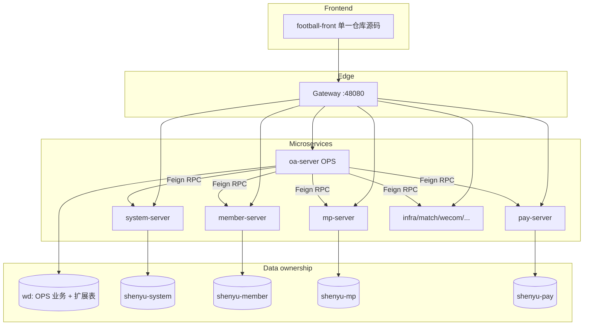

# OPS × Football 全量工程合并与 RPC 边界分析

> **精简版（仅必须项）见：[OPS-FOOTBALL-RPC-MUST-HAVE.md](./OPS-FOOTBALL-RPC-MUST-HAVE.md)**；本文档为完整分析归档，含已裁剪项说明。

| 字段 | 值 |
|------|---|
| 文档性质 | **架构评审用分析**（非实现规格 / 非 Slice） |
| 版本 | v1.8.1 |
| 日期 | 2026-07-23 |
| 受众 | 产品 / Football 后端 / OPS 后端 / 前端 / 架构评审 |
| 证据范围 | 仓库代码盘点（`football-backend-saas/**` Feign API + admin Controller；`ops-platform-module-oa/**` `@DS` / Bridge / Feign）；ADR-047 / 049 / 050 / 054 / 056；`OPS-DEV-DEPLOY-GUIDE`；`OPS-DICT-MERGE-FOOTBALL-PLAN`；既有合并文档 |
| 状态 | **Draft for Review** — Spec 未写明处标为「开放问题」，不臆造 API；§11 接口说明书均为 **提案（待 Football 评审）**，未实现；**去重原则 D-DEDUP-01** 已拍板 |

> **与既有文档关系**  
> - **[OPS-FOOTBALL-RPC-MUST-HAVE.md](./OPS-FOOTBALL-RPC-MUST-HAVE.md)**：仅 must-have 的精简交付清单（原则 / 拍板 / 缺口 / 保留接口说明书）。日常对齐优先看该文。  
> - [OPS-FOOTBALL-合并规划与架构方案.md](./OPS-FOOTBALL-合并规划与架构方案.md)：部署/产品合并总览（多库 `@DS` 现状）。  
> - 本文：**完整分析归档**（含已裁剪项对照）；目标态「禁止 OPS 直连 Football 库，跨域一律 RPC/Feign」。  
> - 与 [ADR-050](../adr/ADR-050-Ops与Football多库复用总纲.md) §3.1「不改 Football 业务代码」**冲突**——全量 RPC 合并若采纳，需新产品/架构决议 **Supersede ADR-050 §3.1**（见 §9）。

---

## 沟通摘要

> 对外同步优先用精简版 **[OPS-FOOTBALL-RPC-MUST-HAVE.md](./OPS-FOOTBALL-RPC-MUST-HAVE.md)**。下文短表为归档对照；细节与缺口编号见「执行摘要」及 §3–§5。人日为 Football 侧粗估（规划用），不含 OPS 切轨与联调。

### ⭐ 找 Football API 说明书（请先点这里）

**日常交付**：精简版 **[OPS-FOOTBALL-RPC-MUST-HAVE.md §7](./OPS-FOOTBALL-RPC-MUST-HAVE.md#7-必须做的接口说明书)**（仅 must-have）。  
**完整提案（含已裁剪项对照）**在文末：

👉 **[→ 跳转到 §11 Football 待支持接口说明书](#11-football-待支持接口说明书)**（文末 · 归档）

| 小节 | 缺口 | 跳转 |
|------|------|------|
| 11.1 | G-SYS-01 用户 simple-list Feign（**后端必须**） | [打开](#111-g-sys-01-用户-simple-list-feign) |
| 11.2 | G-SYS-02 用户/角色校验 RPC | [打开](#112-g-sys-02-用户角色校验-rpc) |
| 11.3 | ~~G-SYS-03 Token Introspect~~（**不做新建** · D-SYS-03） | [打开](#113-g-sys-03-token-introspect已裁剪d-sys-03) |
| 11.4 | G-DICT-01 字典 list-by-type 契约（**后端 RPC**） | [打开](#114-g-dict-01-字典-list-by-type-契约补齐) |
| 11.5 | G-INF-01 文件 FileApi 调用契约 | [打开](#115-g-inf-01-文件-fileapi--ops-调用契约d-inf-01) |
| 11.6 | G-MEM-01 作者等级进 DTO | [打开](#116-g-mem-01-作者等级进-dto) |
| 11.7 | G-MEM-02 作者只读 Feign | [打开](#117-g-mem-02-作者只读-feign) |
| 11.8 | G-MEM-03 文章写 Feign | [打开](#118-g-mem-03-文章写-feign) |
| 11.9 | G-MP-01 公众号 page/写 Feign | [打开](#119-g-mp-01-公众号-page写-feign) |
| 11.10 | G-PAY-01 订单运营列表对齐 | [打开](#1110-g-pay-01-订单运营列表对齐) |
| 11.11 | G-DING-01 通用钉钉推送 API | [打开](#1111-g-ding-01-通用钉钉推送-api) |
| 11.12 | ~~G-DING-02 通讯录同步 Feign~~（**Out of Scope**） | [打开](#1112-g-ding-02-钉钉通讯录同步-feign可选) |

> Cursor / VS Code：大纲（Outline）点「11. Football 待支持接口说明书」。

### 原则结论

| 项 | 内容 |
|----|------|
| **原则** | OPS **只访问 `wd`**；其他库（system / member / mp / pay 等）数据一律通过 **Football 模块 API**（RPC/Feign），禁止 `@DS` 直连 |
| **去重** | **D-DEDUP-01**：Football 为 SSOT；**禁止**在 OPS 平行建设已有管理能力；只保留 OPS 独有业务 must-have |
| **结论** | **可以达到，但不是现状**。需：① Football 补齐 **裁剪后**缺口 API；② OPS 去掉跨库 `@DS` 改走 Feign；③ 调整 / Supersede **ADR-050** §3.1（「不改 Football 业务代码」） |

### 去重原则与裁剪结果（D-DEDUP-01）

> 分类：**必须保留** = OPS 独有业务无法只靠 Football 前端/现有 API；**可砍 / 复用现有** = Football Admin/RPC 已有，OPS 不新建、不平行实现；**可选降级** = Gateway 透传 / 已有 check / 前端直调 Admin 等代替新建。

| 缺口 / 能力 | 分类 | 决议 | Football 人日 | 说明 |
|-------------|------|------|---------------|------|
| G-SYS-01 用户 simple-list | **必须保留**（后端 Feign） | 保留 Feign；前端可直调 Admin | **1–2** | **浏览器** UserSelect → Gateway `GET /admin-api/system/user/simple-list`（**无需 Feign**）；**后端**（IP 组候选、忽略数据权限的租户启用列表等）→ **必须 Feign**，前端 Admin 不能替代服务间调用 |
| G-SYS-02 用户/角色校验 RPC | **必须保留** | 扩现有 Api | **2–4** | ADR-056 写入校验只能在后端；禁止仅靠前端 Admin |
| ~~G-SYS-03 Token Introspect~~ | **可砍 / 复用现有** | **D-SYS-03：不新建 introspect** | **0** | 优先 Gateway 透传 login-user；必要时复用已有 `OAuth2TokenCommonApi.checkAccessToken`（`/rpc-api/system/oauth2/token/check`），**不做**平行 introspect |
| G-DICT-01 字典读契约 | **必须保留**（后端 RPC） | 契约薄补齐 + Adapter→Feign | **1–3** | **前端** DictSelect 可走 Football `/admin-api/system/dict-*`；**后端 `@InDict`** 仍须服务端 RPC（浏览器调 Admin ≠ 后端校验） |
| G-DICT-02 字典数据迁移 | **必须保留**（数据） | 按字典合并方案 | —（数据/IT，非 Feign 人日） | 非新建能力 |
| G-INF-01 文件 | **必须保留** | **D-INF-01** 统一 FileApi | **0–2** | API 已有；切轨/契约 |
| G-MEM-01 作者等级进 DTO | **必须保留** | 读 DTO 暴露 | **0.5–1** | OPS 只读展示/筛选需要 |
| G-MEM-02 作者只读 Feign | **必须保留** | 只读补齐；**无 CUD** | **1–2** | **D-AUTHOR-01**；管理归 Football Admin |
| ~~作者 CUD Feign~~ | **可砍** | **D-AUTHOR-01** | **0** | 管理归 Football，OPS 不要求 |
| G-MEM-03 文章写 Feign | **必须保留** | Admin→Feign | **3–6** | 内容生产同步 OPS 编排，非 Football 前端可替代 |
| G-MP-01 公众号 page/写 | **必须保留** | Admin→Feign | **2–4** | 与 `oa_account_ext` 编排绑定 |
| G-PAY-01 订单运营列表 | **必须保留** / 薄封装 | 对表后复用或薄封装 | **2–5** | 运营归因只读；优先复用现有 `PayOrderApi` |
| G-DING-01 通用钉钉推送 | **必须保留** | 新建统一 API | **8–15** | OPS 审核/任务通知；≠ MP 告警 |
| ~~G-DING-02 通讯录同步~~ | **可砍** | **D-DING-02：不做** | **0** | OPS **不维护**人员/部门 |
| 操作日志**写** | **必须保留**（已有） | 已接 Feign | **0** | `OperateLogCommonApi` |
| 操作/登录日志**读** UI | **可砍 / 复用现有** | **不平行建设** OPS 读页 | **0** | Football Admin 已有操作/登录日志菜单；OPS 壳内改挂原生页即可，**不**再做平行分页 API/UI |
| OPS UI：用户/部门/菜单/字典**管理** | **可砍 / 不下沉** | **不下沉到 OPS** | **0** | 一律 Football Admin；OPS 仅消费选择器/只读校验 |
| G-NTF-01 站内消息 | **可选降级** | 优先 Football Notify；或 OPS 自建保留 | **0**（本期不扩 Feign） | 已有 `NotifyMessageSendApi`；产品二选一，不做平行管理台 |
| ~~G-MATCH-01~~ / G-WECOM-01 | ~~可选降级~~ / 自建 | **G-MATCH-01 Closed-Accept** 外部 HTTP 代理（[ADR-059](../adr/ADR-059-G-MATCH-01-external-proxy.md)）；企微保持分离 | — | Match 非 Feign 缺口 |

**裁剪后人日（Football）**：**约 16–38**（相对 v1.7 的 16–43：去掉 Token introspect 上限 5；作者 CUD / 通讯录 / 操作日志读平行 / 平台管理 UI **不计**）。是否做 **G-DING-01** 仍主导上限；**不含** OPS 切轨与联调。

### 1. OPS 需要使用 Football 的能力

| 域 | OPS 用途 |
|----|----------|
| 用户 / 鉴权 | Gateway/`check`→LoginUser；UserSelect；租户内启用 / 角色校验（ADR-056）— **不做**新建 introspect |
| 字典 | 后端 `@InDict` / 薄封装读；**管理 UI 不下沉**（Football） |
| 文件 | 上传 / 预览 / 下载（统一 `FileApi` / `/infra/file`） |
| 操作日志 | **写**已接 Feign；**读**走 Football 原生菜单（不平行） |
| 作者 / 作者等级 | **只读**查询 + **authorLevel**；**不写**（D-AUTHOR-01） |
| 文章 / 方案 | 内容生产同步：create / update / 上下架 |
| 公众号 | 账号 page / create / update + 读（编排 + ext） |
| 订单 | 运营只读列表 / 归因字段 |
| 钉钉 | 通用工作通知（非仅 MP 告警）；**通讯录同步不做** |

### 2. Football 目前已满足的

| 能力 | 形态 | 备注 |
|------|------|------|
| Token 校验 | `OAuth2TokenCommonApi.checkAccessToken` + Gateway 鉴权透传 | **D-SYS-03**：复用，不新建 introspect |
| 操作日志写 | Feign `OperateLogCommonApi` | OPS **已接入** |
| 操作 / 登录日志读 UI | Football Admin 菜单 | OPS **不平行**读页 |
| 用户 / 部门 / 菜单 / 字典**管理** | Admin + 菜单 | **不下沉 OPS** |
| 字典读（前端） | Admin `/system/dict-*` | 前端可直调；后端校验仍要 Feign |
| 文件存储 | `FileApi` + `/infra/file` | **API 已有**；OPS 未切轨 |
| 用户 get / list / valid | `AdminUserApi` | **缺**后端 simple-list Feign（前端 Admin 已有） |
| 作者 / 文章 / 公众号读子集 | Author / Article / Mp Feign | 作者：**OPS 只读**（D-AUTHOR-01）；文章/公众号写仍缺 Feign |
| 订单统计类 | `PayOrderApi` | 列表字段对齐未证实 |
| 钉钉 MP 告警 | `MpMessageApi` | ≠ 通用运营推送 |

### 3. Football 目前不满足的 + 开发工作量粗估

| 缺口 | 难度 | 人日 | 说明 | 接口说明书 |
|------|------|------|------|------------|
| 用户 simple-list Feign（**后端**） | S | 1–2 | 前端可走 Admin；后端 IP 组等必须 Feign | [§11.1](#111-g-sys-01-用户-simple-list-feign) |
| 用户 / 角色校验改 RPC | S–M | 2–4 | 扩现有 Api | [§11.2](#112-g-sys-02-用户角色校验-rpc) |
| ~~Token Introspect~~ | — | **0** | **D-SYS-03**：复用 Gateway / `check`，不新建 | [§11.3](#113-g-sys-03-token-introspect已裁剪d-sys-03) |
| 字典 list-by-type 契约（**后端**） | S | 1–3 | 有 `DictDataApi`，或需扩 `sort` 等 | [§11.4](#114-g-dict-01-字典-list-by-type-契约补齐) |
| 文件（Football 侧） | S | 0–2 | API 已有；契约 / 租户对齐 | [§11.5](#115-g-inf-01-文件-fileapi--ops-调用契约d-inf-01) |
| 作者等级进 DTO | S | 0.5–1 | 读 DTO 字段暴露 | [§11.6](#116-g-mem-01-作者等级进-dto) |
| 作者只读 Feign（get/list/simple-list） | S | 1–2 | 读路径补齐；**不含** CUD | [§11.7](#117-g-mem-02-作者只读-feign) |
| ~~作者 CRUD Feign~~ | — | **0** | **D-AUTHOR-01** | — |
| 文章写 Feign | M | 3–6 | Admin→Feign + 字段对齐 | [§11.8](#118-g-mem-03-文章写-feign) |
| 公众号 page / 写 Feign | M | 2–4 | Admin→Feign | [§11.9](#119-g-mp-01-公众号-page写-feign) |
| 订单运营列表对齐 | S–M | 2–5 | 对表后复用或薄封装 | [§11.10](#1110-g-pay-01-订单运营列表对齐) |
| 通用钉钉推送 API | L | 8–15 | 新建 SSOT，收敛三套 Client | [§11.11](#1111-g-ding-01-通用钉钉推送-api) |
| ~~通讯录同步 Feign~~ | — | **0** | **D-DING-02** | — |
| **合计（Football）** | — | **约 16–38** | 视是否做钉钉推送；introspect/作者 CUD/通讯录/日志读平行 **不计**；**不含** OPS 切轨 | — |

### OPS 自建保留域（不要求 Football）

IP 组、SOP / 任务 / 绩效、`sys_param`、`oa_*` / `oa_*_ext`、非微信账号等运营自有能力继续落 **`wd`**，以 Football 主键做关联即可。

### 不下沉到 OPS 的 Football 管理能力（D-DEDUP-01）

| 能力 | Football SSOT | OPS 策略 |
|------|---------------|----------|
| 用户 / 角色 / 部门 / 岗位管理 | Admin `/system/user|role|dept|post` | **不下沉**；仅 UserSelect / 写入校验 |
| 菜单 / 权限管理 | Admin `/system/menu|permission` | **不下沉**；OPS 权限码仍挂 Football 菜单 |
| 字典类型/数据管理 | Admin 菜单 105 | **不下沉**（写已 410）；只保留读/`@InDict` |
| 操作 / 登录日志查询 | Admin `/system/operate-log` 等 | **不下沉读页**；写仍 Feign |
| 作者主数据 CUD | Admin `/member/author` | **不下沉**（D-AUTHOR-01） |
| 钉钉通讯录 / 人员部门维护 | Admin sync-users 等 | **不做**（D-DING-02） |

---

## 执行摘要

**现状**：OPS（`oa-server`）已作为 Football Gateway 下的微服务运行（`:48094`），前端以 `mount-ops-all.py` 挂载到 `football-front`。跨域数据以 **ADR-050 五库 `@DS` 直连**为主（system / member / mp / pay），Feign **几乎仅**操作日志写入（`OperateLogCommonApi`）。

**目标**：OPS 完全并入 Football 工程体系；跨 Football 域（用户、作者、公众号、方案/文章、订单、通知等）**只走 RPC/API**；Football 不足处由 Football 团队补 API；OPS 独有域继续落 `wd` **扩展表**（`oa_*_ext` 等）。

**关键结论**：Football 管理端（admin Controller）能力明显多于 Feign（`*-api`）。OPS 今日依赖的写路径（文章同步、公众号更新）与多项读路径（用户校验、作者等级、订单列表）在 Feign 层 **缺口大**。按 **D-DEDUP-01** 裁剪后：平台管理 UI（用户/部门/菜单/字典/操作日志读）与作者 CUD、钉钉通讯录、新建 Token introspect **一律不平行建设**。**作者**：OPS 只读（D-AUTHOR-01）。**Token**：复用 Gateway / `OAuth2TokenCommonApi.check`（D-SYS-03）。钉钉通用推送仍缺统一 Feign（G-DING-01）；作者等级未进 `AuthorSimpleRespDTO`。

> **v1.0 覆盖诚实说明**：初稿对 **字典 / 文件上传 / 参数等基础组件** 仅在 §3.1、§3.5、§4 矩阵与 `G-INF-01` 中有 **一行级提及**，**未**做调用链与迁移建议盘点——相对业务域（作者/文章/公众号）属于 **覆盖不足**。v1.1 增补 **§3.7 基础组件/平台能力**（详见该节）。

### 执行摘要表（评审速览）

> **人日为粗估（规划用）**：S≈仅封装已有 Admin；M≈扩 DTO/Feign + 字段对齐；L≈新建跨服务能力。不含 OPS 侧切轨与联调。

#### A. OPS 需要 Football 提供的能力

| 域 | OPS 用途 |
|----|----------|
| 用户/鉴权 | Gateway/`check`→LoginUser；UserSelect；租户内启用/角色校验（ADR-056） |
| 字典 | 后端 `@InDict` + 薄读；**管理 UI 不下沉** |
| 文件 | 上传/预览/下载（**D-INF-01**） |
| 操作日志 | **写**已接；**读**走 Football 原生菜单（不平行） |
| 作者 / 作者等级 | **只读** + **authorLevel**；**不写**（D-AUTHOR-01） |
| 文章/方案 | 内容生产同步：create/update/上下架 |
| 公众号 | 账号 page/create/update + 读（+ ext） |
| 订单 | 运营只读列表/归因字段 |
| 钉钉 | 通用工作通知；**通讯录同步不做** |
| 自建保留 | IP 组、SOP/任务/绩效、`sys_param`、`oa_*_ext`、非微信账号等 |

#### B. Football 已满足（可复用）

| 能力 | 形态 | 备注 |
|------|------|------|
| Token 校验 | Gateway + `OAuth2TokenCommonApi.checkAccessToken` | **D-SYS-03**：不新建 introspect |
| 操作日志写 | Feign `OperateLogCommonApi` | OPS **已接入** |
| 操作/登录日志读 UI | Football Admin | OPS **不平行** |
| 用户/部门/菜单/字典管理 | Admin | **不下沉 OPS**（D-DEDUP-01） |
| 字典管理 CRUD | Admin + 菜单 105 | OPS 写已 410 |
| 文件存储 API | `FileApi` + `/infra/file` | **API 已有**；OPS 未切轨 |
| 用户 get/list/valid + Admin simple-list | `AdminUserApi` + Admin | **缺**后端 simple-list Feign |
| 作者/文章/公众号读子集 | Author/Article/Mp Feign | 作者：**OPS 只读**；文章/公众号写仍缺 |
| 订单统计类 | `PayOrderApi` | 列表字段对齐未证实 |
| 钉钉 MP 告警 | `MpMessageApi` | ≠ 通用推送 |

#### C. Football 尚未满足（缺口 + 粗估人日 · 裁剪后）

| 缺口 | 难度 | Football 粗估 | 说明 | 接口说明书 |
|------|------|---------------|------|------------|
| G-SYS-01 用户 simple-list Feign（后端） | S | **1–2** | 前端可走 Admin | [§11.1](#111-g-sys-01-用户-simple-list-feign) |
| G-SYS-02 用户/角色校验改 RPC | S–M | **2–4** | 扩现有 Api | [§11.2](#112-g-sys-02-用户角色校验-rpc) |
| ~~G-SYS-03 Token Introspect~~ | — | **0** | **D-SYS-03**：复用 Gateway/`check` | [§11.3](#113-g-sys-03-token-introspect已裁剪d-sys-03) |
| G-DICT-01 字典 list-by-type 契约（后端） | S | **1–3** | 有 `DictDataApi`，或需扩 | [§11.4](#114-g-dict-01-字典-list-by-type-契约补齐) |
| G-INF-01 文件（Football 侧） | S | **0–2** | API 已有；契约/租户对齐 | [§11.5](#115-g-inf-01-文件-fileapi--ops-调用契约d-inf-01) |
| G-MEM-01 作者等级进 DTO | S | **0.5–1** | 读 DTO 字段暴露 | [§11.6](#116-g-mem-01-作者等级进-dto) |
| G-MEM-02 作者只读 Feign | S | **1–2** | get/list/simple-list；**不含** CUD | [§11.7](#117-g-mem-02-作者只读-feign) |
| ~~作者 CUD~~ | — | **0** | **D-AUTHOR-01** | — |
| G-MEM-03 文章写 Feign | M | **3–6** | Admin→Feign + 字段对齐 | [§11.8](#118-g-mem-03-文章写-feign) |
| G-MP-01 公众号 page/写 Feign | M | **2–4** | Admin→Feign | [§11.9](#119-g-mp-01-公众号-page写-feign) |
| G-PAY-01 订单运营列表对齐 | S–M | **2–5** | 对表后复用或薄封装 | [§11.10](#1110-g-pay-01-订单运营列表对齐) |
| G-DING-01 通用钉钉推送 API | L | **8–15** | 新建 SSOT，收敛三套 Client | [§11.11](#1111-g-ding-01-通用钉钉推送-api) |
| ~~G-DING-02 通讯录同步~~ | — | **0** | **D-DING-02** | — |
| **合计（Football）** | — | **约 16–38 人日** | 视是否做钉钉推送；introspect/CUD/通讯录/日志读平行不计；不含 OPS 切轨 | — |

---

## 1. 现状：OPS ↔ Football 集成模式

### 1.1 部署与调用链（已落地）

```mermaid
flowchart LR
  FF[football-front :5777]
  GW[football-gateway :48080]
  OA[oa-server :48094]
  SYS[system-server :48081]
  MEM[member-server :48087]
  MP[mp-server :48086]
  PAY[pay-server 未稳定进本地 overlay]
  DBW[(wd)]
  DBS[(shenyu-system)]
  DBM[(shenyu-member)]
  DBP[(shenyu-mp)]
  DBPay[(shenyu-pay)]

  FF --> GW
  GW -->|/admin-api/oa/**| OA
  GW -->|/admin-api/system/**| SYS
  GW -->|/admin-api/member/**| MEM
  GW -->|/admin-api/mp/**| MP
  OA -->|Feign 少量| SYS
  OA -->|@DS 直连 主路径| DBS & DBM & DBP & DBPay & DBW
```

| 组件 | 服务名 | 本地集成端口（证据） | 说明 |
|------|--------|----------------------|------|
| Gateway | `gateway-server`（应用名以部署为准） | **48080** | `football-gateway/.../application.yaml` `server.port: 48080` |
| system-server | `system-server` | **48081** | `ApiConstants.NAME`；overlay Feign URL |
| infra-server | `infra-server` | **48082** | overlay Feign URL |
| mp-server | `mp-server` | **48086** | overlay / gateway simple discovery |
| member-server | `member-server` | **48087** | 默认可为 mock；`-FullMemberServer` 真服 |
| match-server | `match-server` | **48088** | 赛事域 |
| **oa-server** | `oa-server` | **48094**（集成）/ **8080**（standalone） | OPS 微服务 |
| pay-server | `pay-server` | **48085**（模块 `application.yaml`；本地 overlay 常未启） | Gateway `grayLb://pay-server` |
| bpm / report / live / wecom | 对应 `*-server` | 48083 / 48084 / 48092 / 48093 | report **无** `*-api` Feign 模块 |

证据：`scripts/integration-config/football-integration-overlay.yml`、`gateway-integration-local.yaml`、`docs/delivery/OPS-DEV-DEPLOY-GUIDE.md` §集成端口表。

### 1.2 数据访问模式（主路径 = 多库直连）

| 数据源 `@DS` | JDBC 库 | OPS 用途（代码证据） |
|--------------|---------|----------------------|
| `master` | `wd` | Flyway、业务表、`oa_*_ext` |
| `system` | `shenyu-system` | 用户/角色/权限/字典读、OAuth2 token、`FootballSystemUserValidator` |
| `member` | `shenyu-member` | `author_user` 读、`author_article` 写（`MemberArticleWriteService`） |
| `mp` | `shenyu-mp` | `mp_account` / `mp_user` 读写（`MpAccountDataService`） |
| `pay` | `shenyu-pay` | `pay_all_order` 只读（`FootballPayAllOrderReadMapper`） |

**ADR 依据**：ADR-050 D1–D8；ADR-051 作者；ADR-054 内容→方案；ADR-056 用户身份 SSOT。

### 1.3 Feign / RPC（今日极少）

| OPS 组件 | 调用 | 目标 |
|----------|------|------|
| `OaOperateLogConfiguration` + `OaLogRecordServiceImpl` | Feign `OperateLogCommonApi` | system-server 写 `system_operate_log` |
| （仓库检索） | **未** `@EnableFeignClients` 启用 `AuthorApi` / `ArticleApi` / `AdminUserApi` / `MpAccountInfoApi` / `PayOrderApi` | — |

> OPS 侧自带兼容接口：`ops-platform-module-oa/.../OperateLogCommonApi.java`（`@FeignClient(name = RpcConstants.SYSTEM_NAME)`），与 Football `OperateLogApi extends OperateLogCommonApi` 对齐。

### 1.4 关键桥接类（OPS 侧）

| 类 | 路径（简） | 职责 | 访问方式 |
|----|------------|------|----------|
| `FootballAuthProvider` | `service/auth/` | Gateway Token → `LoginUser`（读 system 用户/角色/权限） | `@DS("system")` Mapper + Redis |
| `FootballSystemUserValidator` | `service/support/` | 用户 id 校验/normalize/presentable（ADR-056） | `@DS("system")` |
| `MemberAuthorReadService` | `service/author/` | 作者读 | `@DS("member")` |
| `MpAccountDataService` / `MpUserDataService` | `service/account/` | 公众号读/写 | `@DS("mp")` |
| `OaAccountExtDataService` | `service/account/` | 微信账号扩展 | `@DS("master")` |
| `FootballArticleBridgeServiceImpl` | `service/content/` | 内容生产 → `author_article` 同步 | `@DS("member")` 写 |
| `MemberArticleWriteService` | `service/football/` | 文章 insert/update | `@DS("member")` |
| `FootballPayAllOrderReadMapper` | `dal/mysql/football/` | 订单只读列表 | `@DS("pay")` |
| `OaLogRecordServiceImpl` | `framework/operatelog/` | 操作日志写入 | **Feign** |

### 1.5 前端现状

| 路径 | 角色 |
|------|------|
| `ops-platform-ui-vue` `:3000` | Standalone / QA harness（ADR-049 D6） |
| `football-front` `:5777` + `#/ops/...` | **集成目标壳** |
| `scripts/mount-ops-all.py` | 批量复制 views/api/components/types → `football-front/.../ops/`，改写 `@/` → `#/ops/` |

---

## 2. 目标架构

### 2.1 原则（用户锁定方向）

1. **工程合并**：OPS 作为 Football 体系内微服务启动（延续 `oa-server`；长期可迁 `football-module-oa` sibling，ADR-047/049 已规划但 S3 延期）。  
2. **前端合并**：源码级并入 `football-front`，淘汰双仓复制。  
3. **跨域 RPC**：OPS **不得**再 `@DS` 直连 Football 四库业务表；经 Feign / Gateway 管理 API 调用。  
4. **扩展表边界**：Football 无对应域或仅 OPS 运营字段 → 留在 `wd` 的 `oa_*` / `oa_*_ext`，以 Football 主键做外键语义关联。

### 2.2 目标拓扑



### 2.3 RPC 边界 vs 扩展表边界

| 归属 | 典型对象 | 访问方 |
|------|----------|--------|
| **Football SSOT** | `system_users`、菜单角色、操作/登录日志、`author_user`、`author_article`、`mp_account`、`pay_all_order`、钉钉消息（通讯录同步 **不**由 OPS 触发） | 仅对应 `*-server`；OPS 经 Feign；管理 UI **不下沉 OPS**（D-DEDUP-01） |
| **OPS 扩展表** | `oa_author_ext`、`oa_account_ext`、`oa_production_content_ext` | OPS 写 `wd`；引用 Football id |
| **OPS 独有域** | IP 组、M4 资产链（非微信）、SOP/计划/任务、绩效模板、采集、竞品、`sys_param`；业务字典目标 SSOT 为 Football `system_dict_*`（见 §3.7，非长期 wd 独有） | 参数/业务编排仅 OPS；字典读改 RPC |

### 2.4 与 ADR-050 的刻意差异

| ADR-050（现状） | 本文目标 |
|-----------------|----------|
| OPS `@DS` 直连四库 | **禁止**业务直连 |
| 「不改 Football 业务代码」 | Football **需增强 Feign/RPC**（缺口清单 §5） |
| 读可用 Adapter 直连 | 读/写一律服务边界 |

---

## 3. Football 能力盘点（按服务模块）

> RPC 前缀惯例：`RpcConstants.RPC_API_PREFIX + "/{module}"`（如 `/rpc-api/system/...`）。  
> 管理端前缀：Gateway `/admin-api/{module}/...`。  
> 下表 **Feign** = `*-module-*-api` 中 `@FeignClient`；**Admin** = `controller.admin`。

### 3.1 system-server（`system-server`）

| 域 | Admin 路径（示例） | Feign API | 能力摘要 |
|----|-------------------|-----------|----------|
| 用户 | `/system/user`（含 `/simple-list`、`/list-all-simple`） | `AdminUserApi`：`get`/`list`/`valid`/`create`/`update`/`updateStatus`/`getUserInfo`/`get-super-admin`/`resetAuthorPassword`… | 管理端选择器完整；Feign **无** `simple-list` 分页/模糊检索专用接口 |
| 角色/权限/菜单 | `/system/role`、`/system/menu`、`/system/permission` | `RoleApi.valid`；`PermissionApi`（角色用户、作者权限、dataScope） | 菜单管理主要走 Admin，非完整 Feign CRUD |
| 部门/岗位 | `/system/dept`、`/system/post` | `DeptApi`、`PostApi` | 有 |
| 字典 | `/system/dict-*`（`dict-type` / `dict-data`） | `DictDataApi`（校验 + CommonApi） | 平台 SSOT=`system_dict_*`；OPS 运行时读已 `@DS("system")` Adapter（见 §3.7，勿仅按「仍在 wd」理解） |
| 操作日志 | `/system/operate-log/page` | `OperateLogApi`（`create` via CommonApi + `page`） | **写已接 OPS**；分页 Feign 存在 |
| 登录日志 | `/system/login-log/page` | `LoginLogApi` | 有创建与统计类 RPC |
| 站内信 | notify 相关 Admin | `NotifyMessageSendApi`：`send-single-admin` / `send-single-member` | **站内信**有；≠ 钉钉 |
| 短信/邮件 | — | `SmsSendApi`、`SmsCodeApi`、`MailSendApi` | 有 |
| 社交/钉钉 | `/system/dingtalk/callback/{clientId}`、`POST /system/dingtalk/sync-users` | `SocialClientApi`、`SocialUserApi` | 通讯录同步仅 Admin；**OPS 不要求同步 Feign**（D-DING-02）；通用消息推送见 §3.6 / G-DING-01 |
| 租户 | `/system/tenant` | `TenantSplitApi` | 有 |

### 3.2 member-server（`member-server`）

| 域 | Admin 路径（示例） | Feign API | 能力摘要 |
|----|-------------------|-----------|----------|
| **作者** | `/member/author`：`page`/`get`/`create`/`update`/`updateStatus`/`simple-list`/`all`… | `AuthorApi`：按 id/手机号查询、权限作者列表、关注、账号更新片段、`getDingDingAuthor`、`generate-wecom-live-code`… | Admin CRUD **完整**（**管理归 Football**）；Feign **读子集**（缺 page/simple-list 等）；`AuthorSimpleRespDTO` **无 `authorLevel`**。**OPS 不要求 CUD**（D-AUTHOR-01） |
| 作者等级 | Admin VO/DO：`authorLevel`（**0=作者，1=专家**） | **未进入 AuthorApi DTO** | Admin 可读写；OPS **只读**需 RPC 暴露（G-MEM-01） |
| 文章/方案 | `/member/article`：`create`/`update`/`delete`/`status-change`/`page`… | `ArticleApi`：simple/get/page/uv/count/onsales… | Admin 可写；Feign **只读**（OPS 今日直写表） |
| 会员用户 | `/member/user` | `MemberUserApi`（get/list/create/update-account/wxLogin…） | C 端会员域；≠ 后台 `system_users` |
| 会员等级 | — | `MemberLevelApi` | **会员经验等级**，不是作者等级 |
| 其他 | 活动/优惠券/活码/分销/风控/报表等 | `ActivityApi`、`CouponApi`、`LiveCodeApi`… | OPS 主链路较少直接依赖 |

**钉钉（member 内部）**：`DingtalkServiceClient#sendMsg` + `AuthorDingDingJobHandler`（作者/平台日报）— **无 Feign**。

### 3.3 mp-server（`mp-server`）

| 域 | Admin 路径 | Feign API | 能力摘要 |
|----|------------|-----------|----------|
| 公众号账号 | `/mp/account`：`create`/`update`/`delete`/`page`/`list-all-simple`/`list-by-author`… | `MpAccountInfoApi`：按 ids 查、推送配置、二维码、`getMpAccountByAppId`… | Admin CRUD 全；Feign **偏读/推送辅助**，无完整 page/create/update |
| 粉丝/用户 | `/mp/user`、`/mp/fans` | `MpUserApi`、`MpAccountFansApi` | 有部分 RPC |
| 消息/模板 | `/mp/message*`、`/mp/template-*` | `MpMessageApi`、`MpTemplatePushLogApi` | 有 |
| 授权 | `/mp/mpAuth` | `MpAuthApi` | 有 |

**钉钉（mp）**：内部 `DingtalkServiceClient#sendMsg`；Feign 仅有 `MpMessageApi.sendDingMessage` / `sendPushDing`（按 `accountId` 的公众号推送告警，**非**通用运营通知）。

### 3.4 pay-server（`pay-server`）

| 域 | Admin 路径 | Feign API | 能力摘要 |
|----|------------|-----------|----------|
| 订单 | `/pay/order`（`AllOrderController`：page/get/export/统计…） | `PayOrderApi`：大量统计/已购/作者订单数等 | Feign **统计丰富**；与 OPS `FootballPayAllOrderReadMapper` 列表字段是否对齐 **需对表**（开放问题） |
| 退款/钱包/分账 | `/pay/*` | `PayRefundApi`、`PayWalletApi`、`PartnerSplitApi`… | 有 |
| 钉钉 | 内部 `pay.framework.dingtalk.DingtalkServiceClient` | **未找到 Feign** | 内部通知 |

### 3.5 其他服务（OPS 弱依赖 / 可选）

| 服务 | Feign 代表 | Admin 前缀 | OPS 相关性 |
|------|------------|------------|------------|
| infra-server | `FileApi`、`ConfigApi`、`WebSocketSenderApi` | `/infra/**` | 文件：**已拍板** OPS 统一接入 `FileApi` / `/infra/file`（§3.7.2） |
| match-server | `MatchScheduleApi`、`NewsApi`… | `/match/**` | OPS **不**走 Feign；`MatchController`→外部 HTTP 代理（[ADR-059](../adr/ADR-059-G-MATCH-01-external-proxy.md) / G-MATCH-01 Closed） |
| wecom-server | `WecomUserApi`、LiveCode* | `/wecom/**` | 企微；OPS 另有自建 `oa_wework_*` |
| live / bpm / report | 各 `*Api` | `/live` `/bpm` `/report` | 非 OPS 主链路 |

### 3.6 Football「有内部能力、无公开 Feign」速查

| 能力 | 内部位置 | 公开 Feign |
|------|----------|------------|
| 钉钉通用工作通知/机器人推送 | member / mp / pay `DingtalkServiceClient`；member 作者日报 Job | **无统一 Feign**（mp 仅有账号告警 RPC） |
| 钉钉通讯录同步 | `POST /admin-api/system/dingtalk/sync-users` | **Out of Scope / 不做** Feign（D-DING-02：OPS 不维护人员与部门）；Admin 仍可用 |
| 作者只读 + `authorLevel`（OPS） | Admin 完整 CRUD；Feign 读子集 | **OPS 不要求 CUD**（D-AUTHOR-01）；缺 page/simple-list 等只读 Feign；DTO **无 level** |
| 文章/方案写 | `ArticleController` create/update/status | ArticleApi **只读** |
| 公众号 CRUD/分页 | `MpAccountController` | MpAccountInfoApi **无 create/update/page** |
| 后台用户 simple-list | `UserController` `/simple-list` | AdminUserApi **无等价** |

### 3.7 基础组件 / 平台能力（字典 · 文件 · 参数 · 其它 infra）

> **诚实结论**：v1.0 **未充分覆盖**本节；下列为补盘。本仓库当前 `football-backend-saas` 源码树可能未完整检出，Football 侧能力以既有盘点清单、Admin 路径约定、`OPS-DICT-MERGE-FOOTBALL-PLAN` / ADR-050 与 OPS 调用方代码交叉印证；开放问题不臆造 Feign 方法签名。

#### 3.7.1 字典（Dict）

| 维度 | 现状 |
|------|------|
| **OPS 前端** | `DictSelect` / `fetchDictData` → `GET /admin-api/oa/dict/data?type=`；类型列表 `/oa/dict/types`；管理页目标态指向 Football `#/dict`（菜单 105，见字典合并方案） |
| **OPS 后端读** | `DictController` → `DictService`（5min 缓存）→ **`SystemDictAdapter`** → `@DS("system")` `FootballSystemDict*Mapper` 读 `shenyu-system.system_dict_*` |
| **OPS 后端写** | `SystemDictServiceImpl` CRUD **已废弃**（`DICT_CRUD_DEPRECATED` / 410），管理写归 Football 菜单 105 |
| **校验** | 大量 DTO `@InDict` → `InDictValidator` → `DictService.isValidValue`（同上 Adapter，**仍直连库**） |
| **残留** | `SysDictDataMapper` / `sys_dict_*` 仍有个别引用（如 `TaskServiceImpl` 岗位字典）；合并方案目标为停写 deprecate |
| **Football Admin** | `GET /admin-api/system/dict-data/type`、`dict-type/page`、`dict-data/page` + CRUD（权限 `system:dict:*`） |
| **Football Feign** | `DictDataApi`（校验 + CommonApi）— **偏校验/通用读**；**未见** OPS 已启用 Feign 调用 |
| **缺口** | ① 读路径仍是 `@DS`，不符合「跨域一律 RPC」目标；② Feign 是否覆盖「按 type 列表 + label/value/sort/status」需对照 `DictDataApi` 契约（开放问题）；③ 业务 `dict_*` 数据是否已全部迁入 `system_dict_*` 以 [OPS-DICT-MERGE-FOOTBALL-PLAN](./OPS-DICT-MERGE-FOOTBALL-PLAN.md) / DM-01 为准 |
| **迁移建议** | **P1**：Adapter 改为 Feign `DictDataApi`（**后端 `@InDict` 必须 RPC**）；前端 DictSelect 可改挂 Admin `/system/dict-data/type` 或保留 `/oa/dict/data` 薄封装；**管理 UI 不下沉 OPS**（D-DEDUP-01）；清理 `SysDict*` 与 wd 表（DM-07） |

#### 3.7.2 文件上传 / 存储（File）

> **已拍板（2026-07-23）**：统一接入 Football **`FileApi` / `/admin-api/infra/file`**。`LocalFileStorageService` **不得**作为长期选项，仅允许迁移过渡期双读；终态必须下线本地盘存储。

| 维度 | 现状 |
|------|------|
| **OPS 前端** | `uploadContentImage` → `POST /admin-api/oa/file/upload`（原生 `fetch`+FormData）；消费方：`ImageUploadField`、`MultiImageUploadField`、`RichTextEditor`、手机管理封面等；任务附件走 `/oa/task/{id}/execute/upload` |
| **OPS 后端** | `FileController` + **`LocalFileStorageService`**：本地磁盘（`OaFileProperties.uploadDir`，默认 `./data/uploads`）；key 形如 `{tenantId}/content/...`；`/view`、`/download` 按 key 读流；**未**调用 infra |
| **Football Admin** | `/admin-api/infra/file/**`（上传/管理，随 infra-server `:48082`） |
| **Football Feign** | `FileApi`（infra-module-api；overlay 已配 `infra-server` URL）— OPS **今日未接入** |
| **缺口（实施前仍须对齐契约）** | ① 本地盘与 Football OSS/infra 双轨，多实例/容器下文件不共享；② 返回 url/key、租户隔离、富文本内嵌 url 鉴权需对照 infra 契约；③ view/download 鉴权白名单在 `DevAuthFilter` 等处有 OPS 特判，切轨后需收敛 |
| **迁移建议（已锁定方案 A）** | OPS **必须**淘汰 `LocalFileStorageService`，改接 Feign `FileApi`，或前端经 Gateway 直调 `/admin-api/infra/file`（见下「迁移步骤」）。**不**建议前端 multipart 直打 Feign 内部 RPC（优先 Admin `/infra/file` 或 OPS `/oa/file/*` 薄代理再转 FileApi）。 |

**迁移步骤（评审用，非实现 Slice）**

| 步骤 | 动作 | 说明 |
|------|------|------|
| 1. 上传 API 切换 | 后端：`FileController` 上传改为 Feign `FileApi`；或前端上传改挂 `POST /admin-api/infra/file/**`，DB/业务字段只存 infra 返回的 **fileId / path / url** | 可短期保留 `/oa/file/upload` 代理以兼容 `ImageUploadField` 等，内部不再写本地盘 |
| 2. 预览 / 下载 URL | 统一为 Football infra 约定格式（通常 Gateway `/admin-api/infra/file/{id}` 或配置的 CDN/OSS 公网 URL）；废弃 OPS `/oa/file/view|download` 本地读流（过渡期可 302/代理到 infra） | 富文本已内嵌的旧 `/oa/file/view?...` URL 需兼容或批量改写 |
| 3. 存量本地文件 | **开放问题（实施细节，不改拍板）**：一次性迁移脚本上传到 infra vs 过渡期「本地 miss → 再读盘」双读；迁移完成后删除 `./data/uploads` 与 `LocalFileStorageService` | 多节点上线前必须完成或具备双读，避免丢图 |
| 4. 验收 | 关闭本地 `uploadDir` 后，内容图/封面/任务附件上传与回显仍可用；多实例共享同一对象存储 | 与 P1/P2 分期联动（见 G-INF-01） |

#### 3.7.3 系统参数 / 配置（Config）

| 维度 | 现状 |
|------|------|
| **OPS** | `ParamController` `/admin-api/oa/system/param/*` → wd **`sys_param`**（业务调参） |
| **Football** | infra `ConfigApi` + `infra_config`（运行时配置）；与 `sys_param` **不同域**（ADR-049 / 数据归属分析已倾向分离） |
| **缺口 / 建议** | **非合并刚需**；RPC 目标下 **勿**把 `sys_param` 强行迁 `infra_config`。保持 OPS 自建；仅当产品要求「统一配置中心」再开题 |

#### 3.7.4 其它平台能力（OPS 使用面盘点）

| 能力 | Football | OPS 现状 | 合并相关性 |
|------|----------|----------|------------|
| 短信 `SmsSendApi` / 验证码 `SmsCodeApi` | 有 Feign | **主链路未用**（登录走 Football OAuth2/Dev Token） | 低；无需为 OPS 扩缺口 |
| 邮件 `MailSendApi` | 有 Feign | **未用** | 低 |
| 验证码 / Captcha | Admin/infra 常见能力 | OPS **无**独立 captcha 调用 | 无 |
| 地区 Area | system/infra 常见 | OPS **无**依赖 | 无 |
| i18n | Football 前端/框架能力 | OPS 文案基本写死中文 | 无 |
| WebSocket `WebSocketSenderApi` | 有 Feign | OPS **未用** | 低 |
| 操作日志写 | 已 Feign（见 §1.3） | 已接 | 有（对照基线） |
| 操作/登录日志读 UI | Football Admin 菜单 | OPS 若有平行页 → **改挂原生、不平行**（D-DEDUP-01） | 有（复用 UI） |

#### 3.7.5 本节判定汇总

| 能力 | 今日实现 | Feign/Admin 可用性 | RPC 目标态判定 | 优先级 |
|------|----------|-------------------|----------------|--------|
| 字典读 + `@InDict` | `@DS("system")` Adapter | Admin 完整；Feign `DictDataApi` **部分** | **部分→需改 RPC**（G-DICT-01） | P1 |
| 字典管理 CRUD | OPS 410；Football 菜单 | Admin CRUD | **有**（走 Football UI/API） | 已收敛 |
| 文件上传/访问 | OPS 本地盘 | `FileApi` + `/infra/file` | **已拍板→统一 FileApi**（G-INF-01）；实施待切轨 | P1 |
| `sys_param` | wd 自建 | 不等价 `ConfigApi` | **自建保留** | — |
| 短信/邮件/captcha/area/i18n | 基本不用 | 有则闲置 | **不纳入本期缺口** | — |

---

## 4. OPS 能力依赖矩阵

图例：**有** = Feign 已可覆盖主路径；**部分** = Feign 仅覆盖子集或需 Admin 旁路；**无** = 需 Football 新增或今日靠 `@DS`。

| OPS 业务模块 | 需要的 Football 能力 | 现有映射 | 现状实现 | 判定 |
|--------------|----------------------|----------|----------|------|
| 鉴权 / 登录上下文 | OAuth2 Token + 用户角色权限 | Gateway 透传；已有 `OAuth2TokenCommonApi.check` | `FootballAuthProvider` `@DS("system")` | **部分**→**D-SYS-03**：Gateway/`check`，**不新建** introspect |
| UserSelect / 用户校验 | 租户内用户列表、启用校验、角色 | Admin `/system/user/simple-list`；Feign `AdminUserApi.get/list/valid` | `FootballSystemUserValidator` + IP 组自建列表 API | **部分**（缺 simple-list Feign；校验未走 Feign） |
| 操作日志写 | 创建操作日志 | `OperateLogCommonApi` | 已 Feign | **有** |
| 操作/登录日志读（Ops 壳） | 分页查询 | Football Admin 菜单 + `OperateLogApi.page` | **D-DEDUP-01：不平行建设** OPS 读页；改挂 Football 原生菜单 | **有（复用 UI）** |
| 作者主数据 | **只读** get/list/simple-list + **authorLevel** 可读；**不写**作者（管理归 Football） | Admin `/member/author/*`（管理）；Feign 只读子集 | `MemberAuthorReadService` + OPS 编排 + `oa_author_ext` | **部分**（读/等级）/**CUD 出范围**（D-AUTHOR-01） |
| IP 组绑定作者 | 按 id 批量取作者 | `AuthorApi.getAuthors` / `listByAuthorIds` | 现多为 `@DS` | **部分** |
| 微信公众号 | 账号 CRUD/分页 + 运营扩展字段 | Admin `/mp/account`；Feign 按 id 读 | `MpAccountDataService` + `oa_account_ext` | **部分** |
| 内容生产→方案 | 创建/更新/上下架 `author_article` | Admin `/member/article`；Feign 只读 | `FootballArticleBridgeService` **直写 member** | **无**（写） |
| 订单归因/只读订单 | 订单列表与金额字段 | `PayOrderApi` 统计多；Admin `/pay/order/page` | `@DS("pay")` Mapper | **部分** |
| 站内消息 | 发 Admin 站内信 | `NotifyMessageSendApi` | OPS 自有 `MessageController`（wd） | **开放问题**：是否统一 Football 站内信 |
| **钉钉消息推送** | 按运营用户发工作通知/机器人 | `MpMessageApi` 仅公众号告警；通用推送无 Feign | OPS `DingTalkDevController` 等开发向；业务推送未统一 | **无**（通用） / **部分**（MP 告警） |
| 平台/业务字典 | 按 type 读、校验、`@InDict`、DictSelect | Admin `/system/dict-*`；Feign `DictDataApi` | `SystemDictAdapter` `@DS("system")` + `/oa/dict/*`；CRUD 已 410 | **部分**（数据多已在 system；访问仍直连，见 §3.7.1） |
| 文件 | 上传/预览/下载 | `FileApi`；Admin `/infra/file` | `LocalFileStorageService` 本地盘 | **已拍板：统一 FileApi /infra/file**（§3.7.2；淘汰本地盘） |
| 系统参数 | 业务键值 | `ConfigApi`/`infra_config`（**不等价**） | wd `sys_param` | **自建**（§3.7.3） |
| 赛事 | 赛程查询 | match Feign / Admin | OPS `MatchController` | **部分** |
| 企微 | 员工/客户 | wecom Feign | OPS 大量 `oa_wework_*` 自建 | **弱相关 / 自建** |
| M4 非微信账号、采集、绩效、SOP、竞品 | — | Football 无对等域 | 纯 `wd` | **自建** |

---

## 5. 缺口清单（给 Football 改造）

> 优先级建议见 §8。每项注明：**现状证据** / **建议 API 形态（评审用，非已实现）** / **OPS 消费方**。

### 5.1 P0 — 鉴权与用户

| ID | 缺口 | 证据 | 建议（供评审） | OPS 消费方 | 说明书 |
|----|------|------|----------------|------------|--------|
| G-SYS-01 | 租户内用户 **simple-list**：**后端**无 Feign（前端 Admin 已有） | Admin：`GET /system/user/simple-list`；`AdminUserApi` 无对等方法 | **保留**后端 `listSimple` Feign（IP 组等）；前端 UserSelect 可直调 Admin（D-DEDUP-01） | `IpGroupController`、后端候选列表；UserSelect（浏览器） | [§11.1](#111-g-sys-01-用户-simple-list-feign) |
| G-SYS-02 | 用户校验/角色查询仍依赖直连库 | `FootballSystemUserValidator` `@DS("system")` | 扩展 `AdminUserApi` + `PermissionApi`/`RoleApi`（**必须 Feign**） | 全模块 `*_user_id` 写入（ADR-056） | [§11.2](#112-g-sys-02-用户角色校验-rpc) |
| ~~G-SYS-03~~ | ~~新建 Token Introspect~~ | `FootballAuthProvider`；已有 `OAuth2TokenCommonApi.checkAccessToken` | **D-SYS-03：不做新建 introspect**；Gateway login-user 透传 **优先**，必要时复用 `check` | `FootballAuthProvider` | [§11.3](#113-g-sys-03-token-introspect已裁剪d-sys-03) |

### 5.2 P0/P1 — 作者与内容

| ID | 缺口 | 证据 | 建议（供评审） | OPS 消费方 | 说明书 |
|----|------|------|----------------|------------|--------|
| G-MEM-01 | **作者等级**未进 RPC 读 DTO | `AuthorUserDO.authorLevel`；Admin VO 有；`AuthorSimpleRespDTO` **无此字段** | 读 DTO 增加 `authorLevel`（OPS **只读**） | 作者列表/筛选/展示 | [§11.6](#116-g-mem-01-作者等级进-dto) |
| G-MEM-02 | 作者 **get/list/simple-list（及必要 page）** 只读 Feign 不足 | Admin 有完整读；`AuthorApi` 仅部分按 id/手机号读 | 补齐只读 Feign；**create/update/delete/status 不纳入 OPS 缺口**（D-AUTHOR-01，管理归 Football） | 作者只读页、IP 组绑定、编排 | [§11.7](#117-g-mem-02-作者只读-feign) |
| G-MEM-03 | 文章/方案 **写路径**无 Feign | `ArticleController` create/update/status-change；`ArticleApi` 只读 | `ArticleApi` 增写接口 | `FootballArticleBridgeService` | [§11.8](#118-g-mem-03-文章写-feign) |
| G-MEM-04 | 批量按条件查作者（IP 组场景）能力不完整 | 现有 `getAuthors(ids)` | 保持 ids 批量即可；条件查询是否需要 **开放问题** | IP 组、分析 | — |

### 5.3 P1 — 公众号与订单

| ID | 缺口 | 证据 | 建议（供评审） | OPS 消费方 | 说明书 |
|----|------|------|----------------|------------|--------|
| G-MP-01 | 公众号 **page/create/update** 无 Feign | `MpAccountController`；`MpAccountInfoApi` 仅 ids/appId 读 | 管理写 Feign | `PlatformAccountSyncService` | [§11.9](#119-g-mp-01-公众号-page写-feign) |
| G-PAY-01 | 订单 **运营列表字段**是否与 `PayOrderApi` 对齐未证实 | OPS：`FootballPayAllOrderReadMapper`；Pay：`PayOrderApi` | 对字段后复用/薄封装 `pageForOps` | `FootballOrderReadController`、归因 | [§11.10](#1110-g-pay-01-订单运营列表对齐) |

### 5.4 P1/P2 — 通知（含用户举例）

| ID | 缺口 | 证据 | 建议（供评审） | OPS 消费方 | 说明书 |
|----|------|------|----------------|------------|--------|
| G-DING-01 | **通用钉钉消息推送**无跨服务 API | member/mp/pay 各有 `DingtalkServiceClient#sendMsg`；`MpMessageApi` 仅公众号告警 | system-server `DingTalkMessageApi` | 审核通知、任务提醒、告警 | [§11.11](#1111-g-ding-01-通用钉钉推送-api) |
| ~~G-DING-02~~ | ~~钉钉用户同步无 Feign~~ | `POST /system/dingtalk/sync-users` | **Out of Scope / 不做**（D-DING-02：OPS 不维护人员与部门） | — | [§11.12](#1112-g-ding-02-钉钉通讯录同步-feign可选) |
| G-NTF-01 | OPS 站内消息 vs Football Notify | `NotifyMessageSendApi` 已有；OPS `MessageController` 独立 | **可选降级**（D-DEDUP-01）：优先 Football Notify；或 OPS 自建保留；**不**平行扩管理 Feign | M9 消息页 | — |

### 5.5 P1/P2 — 基础组件（字典 / 文件）与其它

| ID | 缺口 | 证据 | 建议（供评审） | OPS 消费方 | 说明书 |
|----|------|------|----------------|------------|--------|
| G-DICT-01 | 字典**后端**读/校验仍 `@DS("system")` | `SystemDictAdapter`；Feign `DictDataApi` 缺 `sort` 等；前端可直调 Admin dict | 契约补齐后 Adapter→Feign；**管理 UI 不下沉**；前端可走 Football dict | `@InDict`（必须 RPC）；`DictSelect`（可 Admin） | [§11.4](#114-g-dict-01-字典-list-by-type-契约补齐) |
| G-DICT-02 | 业务 `dict_*` 数据迁移与残留 `sys_dict_*` | [OPS-DICT-MERGE-FOOTBALL-PLAN](./OPS-DICT-MERGE-FOOTBALL-PLAN.md) | 按 DM-01/DM-07 收敛 | 种子/IT | — |
| G-INF-01 | 文件存储未统一；本地盘 vs infra | `LocalFileStorageService`；`FileApi` 未接 | **已拍板 D-INF-01**：统一 `FileApi`/`/infra/file` | 富文本图、封面、附件 | [§11.5](#115-g-inf-01-文件-fileapi--ops-调用契约d-inf-01) |
| ~~G-MATCH-01~~ | ~~赛事选择器~~ | **Accepted / Closed**（2026-07-31）：继续外部 HTTP 代理，**不**切 match-server Feign | [ADR-059](../adr/ADR-059-G-MATCH-01-external-proxy.md) | `MatchController` → `MatchProxyService` | — |
| G-WECOM-01 | 企微双轨 | Football wecom vs OPS `oa_wework_*` | ADR-049 倾向分离 | 企微运营页 | — |

---

## 6. OPS 仍自建 / 扩展表范围

### 6.1 原则

1. Football **已有主实体** → OPS **不复制主表**；仅 `oa_*_ext` 存运营字段 + `sync_status`。  
2. Football **无域**（IP 组、M4 资产链、SOP、采集、竞品、`sys_param`）→ 完整自建于 `wd`；业务字典按 §3.7 / 字典合并方案归 `system_dict_*`，非永久 wd 独有。  
3. 扩展表 PK/FK 使用 Football id（字符串 JSON 传雪花 id，ADR-056）。  
4. **禁止**跨库事务；写 Football 经 RPC 成功后再写 ext（Saga / 对账，延续 ADR-050 D8）。

### 6.2 已存在扩展表（保留）

| 扩展表 | FK | 存 OPS 侧字段示例 |
|--------|----|-------------------|
| `oa_author_ext` | PK=`author_user_id` → member.`author_user` | IP 组、运营扩展、`sync_status`（ADR-051） |
| `oa_account_ext` | `mp_account_id` → mp.`mp_account` | 公司/实名/手机/SIM/cookie/token、管理员（ADR-050 D2） |
| `oa_production_content_ext` | `production_content_id`；`author_article_id` | 方案同步状态/错误、赛事快照（ADR-054） |

### 6.3 明确自建（Football 无对等）

IP 组、`oa_production_content`（编排主数据）、任务/SOP、绩效模板与记录、订单归因（引用 pay 订单 id）、非微信 `oa_account`、个微/企微运营表、采集任务、竞品监测、`sys_param`、元数据/AI/大屏配置等。业务字典以 Football `system_dict_*` 为目标 SSOT（残留 `sys_dict_*` 待 deprecate，见 §3.7）。

### 6.4 迁移后应删除的反模式

| 反模式 | 目标 |
|--------|------|
| `@DS("member\|mp\|pay\|system")` 访问 Football 业务表 | 删除 Mapper；改 Feign |
| 直接 `insert/update author_article` | `ArticleApi` 写接口 |
| OPS 内嵌 Football DO 镜像长期双写 | 仅保留 DTO + ext |

---

## 7. 前端合并方案

### 7.1 现状问题

- `mount-ops-all.py` **复制**导致双源：改 `ops-platform-ui-vue` 需重跑脚本，易漂移。  
- 依赖改写规则（`@/` → `#/ops/`）脆弱。  
- Standalone `:3000` 与集成 `:5777` 双轨（ADR-049 允许过渡）。

### 7.2 建议路径

| 阶段 | 动作 | 退出标准 |
|------|------|----------|
| **F0** | 冻结「新功能只改 football-front `/ops`」；脚本仅紧急回灌 | 团队约定 |
| **F1** | 将 `ops-platform-ui-vue` 标为 deprecated；CI 检查禁止新增文件 | README + CI |
| **F2** | 源码迁入：`football-front/apps/web-ele/src/{views,api,components,types}/ops` 为唯一 SSOT；删除复制脚本或改为 no-op | 单仓构建 |
| **F3** | 路由：继续 hash + 动态菜单（system_menu 6100+）；公共组件逐步与 Vben 对齐 | E2E 58 路由仍绿 |
| **F4** | 下线 standalone 启动文档主路径（可留 docker 调试 profile） | 发布说明 |

### 7.3 与后端合并的衔接

- 前端调用保持 `/admin-api/oa/**`（OPS 编排）+ 直接 `/admin-api/system|member|mp|pay/**`（纯 Football 页）。  
- **UserSelect（浏览器）**：直调 Gateway Admin `GET /admin-api/system/user/simple-list` 即可，**无需**经 oa-server Feign。  
- **后端** IP 组/校验候选列表：必须 `AdminUserApi` Feign（G-SYS-01），浏览器 Admin 不能替代服务间调用。  
- 用户/部门/菜单/字典**管理页**、操作日志**查询页**：**不下沉 OPS**，挂 Football 原生菜单（D-DEDUP-01）。  
- 避免前端直连多套 axios baseURL；统一 Gateway。

---

## 8. 迁移分期建议

### P0 — 鉴权 / 用户 / 操作日志（先断 system 直连）

- 用户校验改 `AdminUserApi` / Permission（G-SYS-02）；后端 simple-list Feign（G-SYS-01）；前端 UserSelect 可直调 Admin。  
- 操作日志：**写**已 Feign；**读**改挂 Football 原生菜单（**不**平行做 OPS 读页）。  
- `FootballAuthProvider`：**D-SYS-03** — Gateway login-user 透传优先；必要时 `OAuth2TokenCommonApi.checkAccessToken`；**不新建** introspect。  
- **验收**：关闭 `@DS("system")` 业务 Mapper 后，登录、UserSelect、IP 组成员、操作日志写仍可用。

### P1 — 作者（只读）/ 内容方案 / 公众号读

- Football 交付 G-MEM-01/02（**只读** get/list/simple-list + `authorLevel`）、G-MEM-03、G-MP-01（读优先可先 ids）。作者 CUD **不纳入**（D-AUTHOR-01）。  
- OPS：`MemberAuthorReadService` / Article Bridge / Mp 读路径切 Feign；**保留 ext 表**；作者页改为只读消费 Football 数据。  
- **验收**：作者只读页、内容同步上下架、公众号列表不访问 member/mp JDBC。

### P2 — 账号写 / 订单 / 通知

- 公众号写、订单列表字段对齐（G-PAY-01）、钉钉推送 API（G-DING-01）。  
- 删除 `@DS("pay"|"mp")` 写/读 Mapper。  
- **验收**：多库动态数据源配置可缩减为 **仅 master(wd)**（理想终态）。

### 工程并行（任意阶段）

- 前端 F0–F2。  
- ADR：新 ADR 明确「RPC 优先、Supersede ADR-050 §3.1」。  
- `football-module-oa` 物理迁仓（ADR-049 S3）可与 P1 并行，非阻断。

---

## 9. 风险与开放问题

### 9.1 风险

| 风险 | 影响 | 缓解 |
|------|------|------|
| Feign 字段少于今日直连列 | 功能回退 | 缺口清单联评后再切；契约测试 |
| 写文章绕过 member 领域校验；作者侧绕过管理边界 | 数据坏账 / 双写 | 文章写必须走 member 服务；作者 **OPS 禁止 CUD**（D-AUTHOR-01），管理仅 Football Admin |
| Gateway 超时 / 鉴权透传 | 跨服务调用失败 | 统一 `tenant-id`、user 头；长超时沿用 300s 先例 |
| 本地 member mock 与真服行为差 | 联调假绿 | P1 起强制 FullMemberServer |
| ADR-050「不改 Football」与本目标冲突 | 排期僵持 | 架构会书面 Supersede |
| 钉钉三套 Client 行为不一致 | 推送不可靠 | G-DING-01 收敛到 system |

### 9.2 开放问题（需产品 / Football 确认）

1. **是否正式 Supersede ADR-050 §3.1**，允许 Football 为 OPS 增加 Feign？  
2. OPS 调用 Football：**仅 Feign**，还是允许经 Gateway 调 **Admin API**（需服务账号/权限透传规范）？  
3. ~~**作者等级** OPS 是否只读还是可改？~~ → **已拍板 D-AUTHOR-01：OPS 只读不写作者**；枚举语义（0=作者 / 1=专家）是否仍需产品书面确认？  
4. 钉钉推送：**工作通知** vs **群机器人** vs 两者；接收人主键用 `system_users` 还是钉钉 userId？  
5. 订单：OPS 归因所需字段列表是否 100% 可由现有 `PayOrderApi` 提供？  
6. 站内消息：统一 Football Notify 还是保留 OPS `oa` 消息表？  
7. ~~`FootballAuthProvider` 最终是否允许保留对 Redis/token 表的只读（特例）？~~ → **已拍板 D-SYS-03**：不新建 introspect；优先 Gateway 透传，必要时复用 `OAuth2TokenCommonApi.check`；过渡期直连 token 表应下线。  
8. 远程环境是否仍多库，RPC 后 OPS 是否 **只连 wd**？  
9. `ops-platform-ui-vue` 下线时间表？  
10. M10 采集 / 外部 SSO 仍 Out of Scope（阶段 Gate 协议）——是否写进本合并范围外声明？  
11. **字典**：`DictDataApi` 是否足以替换 `SystemDictAdapter` 的 list-by-type（后端 `@InDict`），还是必须扩 Feign 字段；前端是否统一改挂 Admin dict？  
12. ~~**文件**：是否强制 OPS 改用 infra `FileApi`（多节点）？历史 `/oa/file` key 如何迁移？~~ → **已拍板：统一接入 FileApi /infra/file**（见 §9.4 / §3.7.2）。**仍开放（实施细节）**：存量本地文件「一次性迁移 vs 双读过渡」及富文本旧 URL 改写策略。  
13. 操作日志读：确认 OPS 菜单是否已有/将删除平行页，统一链到 Football 原生「操作日志 / 登录日志」。

### 9.3 明确不在本文实现范围

- 不编写 Football 新 API 代码。  
- 不修改 `@DS` 实现（待评审通过后另开 Slice）。  
- 不宣称 Gate 已满足 RPC 终态。  
- **不**在 OPS 平行建设：用户/部门/菜单/字典管理、操作日志读 UI、作者 CUD、钉钉通讯录同步、新建 Token introspect（见 D-DEDUP-01 / D-SYS-03 / D-DING-02 / D-AUTHOR-01）。

### 9.4 已拍板事项

| ID | 日期 | 事项 | 决议 |
|----|------|------|------|
| D-INF-01 | 2026-07-23 | 文件上传 / 存储统一 | **统一接入 Football `FileApi` / `/admin-api/infra/file`**；OPS **必须**替换 `LocalFileStorageService`，本地盘**不得**作为长期方案（G-INF-01 / §3.7.2） |
| D-AUTHOR-01 | 2026-07-23 | 作者主数据职责边界 | **OPS 只读不写作者**（仅 get/list/simple-list 等查询 + `authorLevel` 可读）；**作者管理（create/update/delete/改状态）归 Football** Admin/域服务；不要求为 OPS 暴露作者 CUD Feign（G-MEM-02 降级为只读；见 §11.6 / §11.7） |
| D-DING-02 | 2026-07-23 | 钉钉通讯录同步 Feign | **Out of Scope / 不做**：OPS **不维护人员与部门**，不要求 Football 暴露通讯录同步 Feign（G-DING-02 出范围，人日不计）；**G-DING-01 通用钉钉推送仍保留**（见 §11.11 / §11.12） |
| D-DEDUP-01 | 2026-07-23 | 不重复建设 | Football 为 SSOT；OPS **只保留**独有业务 must-have；已有 Admin/RPC 能力 **不**在 OPS 平行实现；用户/部门/菜单/字典管理与操作日志读 UI **不下沉 OPS**（见沟通摘要「去重原则与裁剪结果」） |
| D-SYS-03 | 2026-07-23 | Token 可信来源 | **不新建** Token Introspect API；优先 Gateway login-user 透传；必要时复用已有 `OAuth2TokenCommonApi.checkAccessToken`（`/rpc-api/system/oauth2/token/check`）；G-SYS-03 / §11.3 出范围（人日 0） |

---

## 10. 附录

### A. Football Feign API 文件清单（完整）

见仓库：

- `football-module-system-api/.../api/**/*.java`（AdminUser、OperateLog、Permission、Role、Dict、Notify、Sms、Mail、Social、Dept、LoginLog、TenantSplit…）  
- `football-module-member-api/.../api/**/*.java`（Author、Article、MemberUser、MemberLevel、Coupon…）  
- `football-module-mp-api/.../api/**/*.java`（MpAccountInfo、MpUser、MpMessage…）  
- `football-module-pay-api/.../api/**/*.java`（PayOrder、Refund、Wallet…）  
- 以及 infra / match / wecom / live / bpm / report 各 `*Api.java`

### B. OPS `@DS` 触点（迁移时删除清单草稿）

| 注解 | 代表类 |
|------|--------|
| `@DS("system")` | `FootballSystemUserLookupMapper`、`FootballOAuth2TokenMapper`、Dict Football Mapper… |
| `@DS("member")` | `AuthorUserMapper`、`AuthorArticleMapper`、`MemberAuthorReadService`、`MemberArticleWriteService` |
| `@DS("mp")` | `MpAccountMapper`、`MpUserMapper`、`MpAccountDataService` |
| `@DS("pay")` | `FootballPayAllOrderReadMapper` |
| `@DS("master")` | 全部 OPS 自有表与 `oa_*_ext`（**保留**） |

### C. 关键 ADR 索引

| ADR | 与本文关系 |
|-----|------------|
| ADR-047 | 微服务接入、菜单 `oa:*`、前端挂载 — **仍有效** |
| ADR-049 | 数据归属、订单只读、UI 双轨 — 订单「只读」保留；访问方式改为 RPC |
| ADR-050 | 五库 `@DS` — **访问方式将被本文目标取代**；扩展表原则保留 |
| ADR-054 | 内容→方案 — 桥接逻辑保留，传输改 Article RPC |
| ADR-056 | 用户 id SSOT — **仍有效**；实现从 JDBC 校验改为 Feign 校验 |

### D. 修订记录

| 日期 | 版本 | 说明 |
|------|------|------|
| 2026-07-23 | v1.0 | 初稿：基于代码盘点的全量合并 + RPC 缺口分析，供评审 |
| 2026-07-23 | v1.0.1 | 吸收子代理盘点：补全端口矩阵；修正 `MpMessageApi` 钉钉告警 RPC 与 `authorLevel` 枚举（0/1） |
| 2026-07-23 | v1.1 | **补覆盖不足**：新增 §3.7 基础组件/平台能力（字典、文件上传、sys_param、短信/邮件等）；扩充 G-DICT-01/02、G-INF-01；§4/§9 同步 |
| 2026-07-23 | v1.2 | **拍板 D-INF-01**：文件统一接入 Football `FileApi` / `/infra/file`；§3.7.2 迁移步骤、G-INF-01、§4 矩阵、§9.2#12、新增 §9.4 拍板表 |
| 2026-07-23 | v1.3 | 执行摘要下增补「执行摘要表」A/B/C（需求 / 已满足 / 缺口人日粗估），供评审速览 |
| 2026-07-23 | v1.4 | 文首新增「沟通摘要」：原则结论 + 三表（需求 / 已满足 / 缺口人日）+ 自建保留域；便于对外同步；正文详细节保留 |
| 2026-07-23 | v1.5 | 新增 **§11 Football 待支持接口说明书**（12 组缺口 API 提案：入参/出参/示例/与 Admin 关系）；沟通摘要与 §5 缺口表增加说明书锚点链接 |
| 2026-07-23 | v1.5.1 | **导航增强**：沟通摘要文首增加「找 Football API 说明书」醒目跳转 + §11.1–11.12 目录表（说明书正文仍在文末 §11） |
| 2026-07-23 | v1.6 | **拍板 D-AUTHOR-01**：OPS **只读不写作者**，作者管理归 Football；沟通摘要/执行摘要/§4/§5/§11.6–11.7 对齐；去掉作者 CUD Feign 人日，保留 get/list/simple-list + `authorLevel` 读缺口 |
| 2026-07-23 | v1.7 | **拍板 D-DING-02**：钉钉通讯录同步 Feign（G-DING-02 / §11.12）**Out of Scope / 不做**（用户确认：OPS 不维护人员与部门）；合计人日 **17–45 → 16–43**；**G-DING-01 通用推送仍保留** |
| 2026-07-23 | v1.8 | **拍板 D-DEDUP-01 / D-SYS-03**：去重裁剪；**不新建** Token introspect（复用 Gateway/`check`）；操作日志读与用户/部门/菜单/字典管理 **不下沉 OPS**；澄清 simple-list/字典「前端 Admin vs 后端 Feign」；合计人日 **16–43 → 16–38**；沟通摘要新增「去重原则与裁剪结果」表 |
| 2026-07-23 | v1.8.1 | 文首指向精简版 [OPS-FOOTBALL-RPC-MUST-HAVE.md](./OPS-FOOTBALL-RPC-MUST-HAVE.md)（仅 must-have）；本文定位为完整分析归档；沟通摘要增加精简版入口 |

---

## 11. Football 待支持接口说明书

> **状态**：本节为 **提案（待 Football 评审）**，**未实现**；其中 §11.3 / §11.12 及作者 CUD 已按拍板 **出范围**。  
> **位置**：本文 **文末**（附录 §10 之后）；沟通摘要顶部有 [跳转入口](#-找-football-api-说明书请先点这里)。  
> **原则**：优先扩展现有 `*-api` Feign（`/rpc-api/{module}/...`），对齐 `CommonResult` / `PageResult`；字段来自 OPS 代码、Football Admin VO、既有 Feign DTO，不臆造业务规则；**D-DEDUP-01** 禁止为 OPS 平行新建已有 Admin 能力。  
> **调用惯例（与现网 Feign 一致）**：
>
> | 项 | 约定 |
> |----|------|
> | 前缀 | `RpcConstants.RPC_API_PREFIX` = `/rpc-api`；如 system = `/rpc-api/system/...` |
> | 包装 | `CommonResult<T>`：`{ "code": 0, "data": ..., "msg": "" }` |
> | 分页 | `PageResult<T>`：`{ "list": [...], "total": N }` |
> | 租户 | 请求头 `tenant-id`（Long）；服务间透传 |
> | 用户上下文 | 服务间透传登录用户（框架既有 `LoginUser` 头，具体头名以 Football RPC 过滤器为准） |
> | JSON id | 雪花 id 建议字符串序列化（ADR-056）；下表示例对 id 用字符串 |

### §11 小节目录

| 小节 | 缺口 | 跳转 |
|------|------|------|
| 11.1 | G-SYS-01 用户 simple-list Feign（**后端必须**） | [↓](#111-g-sys-01-用户-simple-list-feign) |
| 11.2 | G-SYS-02 用户/角色校验 RPC | [↓](#112-g-sys-02-用户角色校验-rpc) |
| 11.3 | ~~G-SYS-03 Token Introspect~~（**不做新建** · D-SYS-03） | [↓](#113-g-sys-03-token-introspect已裁剪d-sys-03) |
| 11.4 | G-DICT-01 字典 list-by-type 契约（**后端 RPC**） | [↓](#114-g-dict-01-字典-list-by-type-契约补齐) |
| 11.5 | G-INF-01 文件 FileApi 调用契约 | [↓](#115-g-inf-01-文件-fileapi--ops-调用契约d-inf-01) |
| 11.6 | G-MEM-01 作者等级进 DTO | [↓](#116-g-mem-01-作者等级进-dto) |
| 11.7 | G-MEM-02 作者只读 Feign | [↓](#117-g-mem-02-作者只读-feign) |
| 11.8 | G-MEM-03 文章写 Feign | [↓](#118-g-mem-03-文章写-feign) |
| 11.9 | G-MP-01 公众号 page/写 Feign | [↓](#119-g-mp-01-公众号-page写-feign) |
| 11.10 | G-PAY-01 订单运营列表对齐 | [↓](#1110-g-pay-01-订单运营列表对齐) |
| 11.11 | G-DING-01 通用钉钉推送 API | [↓](#1111-g-ding-01-通用钉钉推送-api) |
| 11.12 | ~~G-DING-02 通讯录同步 Feign~~（**Out of Scope** · D-DING-02） | [↓](#1112-g-ding-02-钉钉通讯录同步-feign可选) |
| 11.13 | 本节开放问题汇总 | [↓](#1113-本节开放问题汇总待-football--产品评审) |

### 11.1 G-SYS-01 用户 simple-list Feign

> **调用方分层（D-DEDUP-01）**  
> - **浏览器 / UserSelect**：可直调 Gateway Admin `GET /admin-api/system/user/simple-list`，**无需** Feign、**无需**经 oa-server 代理。  
> - **oa-server 后端**（IP 组候选、忽略数据权限的租户启用列表、服务端编排）：**必须**本 Feign；浏览器 Admin 不能替代服务间 RPC。

| 项 | 内容 |
|----|------|
| 接口名称 | 租户内启用用户精简列表（**服务间**） |
| 所属服务 | `system-server` |
| 建议 Feign | `AdminUserApi`（扩展，勿新建平行 Client） |
| Method + Path | `GET /rpc-api/system/user/simple-list` |
| 权限/调用方 | 仅内部服务（oa-server 等）；**不做** Admin `@PreAuthorize`；租户由 `tenant-id` 头隔离；返回**当前租户启用用户**（对齐 Admin `UserController#getSimpleUserList`：`status=ENABLE`） |
| 与现有 Admin | 封装 `GET /admin-api/system/user/simple-list`（`UserSimpleRespVO`）；Feign **新建方法**供后端；前端继续用 Admin，**不**在 OPS 再做用户管理页 |

**请求入参**

| 字段 | 类型 | 必填 | 说明 |
|------|------|------|------|
| （Header）`tenant-id` | Long | 是 | 租户 |
| `keyword` | String | 否 | 昵称模糊（OPS UserSelect / IP 组成员筛选需要；Admin 现网无此参 → **扩展点**） |
| `status` | Integer | 否 | 默认仅启用；若传则按 `CommonStatusEnum` 过滤 |
| `deptId` | Long | 否 | 部门过滤（可选；Admin simple-list 本身不筛部门） |

**响应出参** `CommonResult<List<AdminUserSimpleRespDTO>>`（可复用 Admin `UserSimpleRespVO` 字段）

| 字段 | 类型 | 说明 |
|------|------|------|
| id | Long/String | `system_users.id`（SSOT） |
| nickname | String | 昵称 |
| deptId | Long | 部门 id |
| deptName | String | 部门名 |
| status | Integer | 建议一并返回便于 OPS 校验（Admin simple VO 现无；**扩展**） |
| mobile | String | 可选；敏感字段是否返回 → 开放问题 |

**请求示例**

```http
GET /rpc-api/system/user/simple-list?keyword=张 HTTP/1.1
tenant-id: 1
```

**响应示例**

```json
{
  "code": 0,
  "data": [
    { "id": "1024", "nickname": "张三", "deptId": 10, "deptName": "运营部", "status": 0 }
  ],
  "msg": ""
}
```

**备注**：前端 UserSelect **保持** Admin 直调即可；目标态仅 **后端** IP 组候选/校验改 Feign，避免数据权限把「租户全量启用用户」滤空（见 `IpGroupController` 注释）。  
**开放问题**：Feign 是否需「忽略数据权限、仅按租户返回全量启用用户」开关（OPS IP 组场景明确需要）。

---

### 11.2 G-SYS-02 用户/角色校验 RPC

| 项 | 内容 |
|----|------|
| 接口名称 | 租户内用户存在/启用校验；按角色 code 判断；可存储 id 解析 |
| 所属服务 | `system-server` |
| 建议 Feign | `AdminUserApi` + `PermissionApi`（扩展）；对齐 ADR-056 `FootballSystemUserValidator` |
| 权限/调用方 | 内部服务；`tenant-id` 必填 |

#### 11.2.1 用户在租户内且启用

| 项 | 内容 |
|----|------|
| Method + Path | `GET /rpc-api/system/user/assert-enabled` |
| 与现有 | 扩展；现有 `AdminUserApi.validateUserList` 仅校验「存在且未禁用」，**无租户参数显式化**（依赖上下文） |

**请求入参**

| 字段 | 类型 | 必填 | 说明 |
|------|------|------|------|
| id | Long | 是 | 提交的用户 id（Football SSOT） |
| （Header）`tenant-id` | Long | 是 | 必须与用户所属租户一致 |

**响应** `CommonResult<Boolean>`（`true`=通过；失败抛业务错误码，建议映射 OPS 1501/1504 语义由 OPS 转译）

```json
{ "code": 0, "data": true, "msg": "" }
```

#### 11.2.2 是否拥有角色 code

| 项 | 内容 |
|----|------|
| Method + Path | `GET /rpc-api/system/permission/has-role-code` |
| 与现有 | `PermissionCommonApi.hasAnyRoles` 已有（`roles` 为角色 code 可变参）；**优先复用**，不足再补「按 code 列表用户」 |

**请求入参**

| 字段 | 类型 | 必填 | 说明 |
|------|------|------|------|
| userId | Long | 是 | |
| roles | String[] | 是 | 角色 code，如 `IP_GROUP_LEADER` |

**响应** `CommonResult<Boolean>`

```http
GET /rpc-api/system/permission/has-any-roles?userId=1024&roles=oa_ip_leader
```

```json
{ "code": 0, "data": true, "msg": "" }
```

#### 11.2.3 （建议）按角色 code 列出用户 id

| 项 | 内容 |
|----|------|
| Method + Path | `GET /rpc-api/system/permission/user-ids-by-role-code` |
| 与现有 | `PermissionApi.getUserRoleIdListByRoleIds` 按 **roleId**；OPS `listPresentableUserIdsByRoleCode` 需 **roleCode** → **新建** |

**请求入参**：`roleCode`（必填）、`tenant-id` 头  
**响应**：`CommonResult<List<Long>>`

**备注**：`resolveStorableUserId` / `resolvePresentableUserId`（wd/legacy 桥接）逻辑可继续留在 OPS；Football RPC 只保证 **Football id** 的租户/启用/角色校验。  
**开放问题**：是否提供批量 `assert-enabled`（ids）；错误时返回 Football 全局码还是约定 Boolean+msg。

---

### 11.3 G-SYS-03 Token Introspect（已裁剪 · D-SYS-03）

> **状态：不做新建 introspect**（**已拍板 D-SYS-03**，2026-07-23）  
> 人日 **0**（原可选 2–5 已从合计剔除）。以下历史提案仅作对照，**不纳入交付**。

| 项 | 内容 |
|----|------|
| 接口名称 | ~~OAuth2 AccessToken 自省（新建）~~ |
| 所属服务 | `system-server` |
| 决议 | **不新建** `/rpc-api/system/oauth2/token/introspect` |
| 复用路径 | ① **优先** Gateway 已鉴权后向下游透传 login-user（`user-id` / `tenant-id` / 权限上下文）；② 必要时复用**已有** `OAuth2TokenCommonApi.checkAccessToken` → `GET /rpc-api/system/oauth2/token/check?accessToken=`（证据：`football-framework/.../OAuth2TokenCommonApi.java`） |
| OPS 动作 | `FootballAuthProvider` 改为消费 Gateway 头或调用 `check`；**停止** `@DS("system")` 直读 token 表作为终态 |

**方案对照（已锁定）**

| 方案 | 说明 | Football 工作量 | 状态 |
|------|------|-----------------|------|
| **A. Gateway 透传** | 下游信任 Gateway 注入的 LoginUser 头 | ≈0 | **推荐默认** |
| **C. 复用 check** | 调现有 `checkAccessToken`，按 `OAuth2AccessTokenCheckRespDTO` 组装上下文 | ≈0（契约已有） | **备选** |
| ~~B. 新建 Introspect~~ | ~~平行自省 API~~ | ~~2–5~~ | **不做**（D-SYS-03 / D-DEDUP-01） |

<details>
<summary>历史提案字段（已作废，折叠）</summary>

曾提案 `POST /rpc-api/system/oauth2/token/introspect` 与 `TokenIntrospectRespDTO`（active/userId/tenantId/roleCodes/permissionCodes 等）。现一律以 Gateway 透传或 `check` 覆盖，不再扩展平行契约。

</details>

**备注**：IP 组 member/led 预计算仍属 OPS 域（查 `wd`），不进 token check。权限码若 `check` 响应不足，优先从 Gateway/框架 LoginUser 透传补齐，而非新建 introspect。

---

### 11.4 G-DICT-01 字典 list-by-type 契约补齐

> **前端 vs 后端（D-DEDUP-01）**  
> - **浏览器 DictSelect**：可直调 Football Admin `GET /admin-api/system/dict-data/type`（或现有合并方案目标页）；**字典管理 CRUD 不下沉 OPS**（已 410）。  
> - **后端 `@InDict` / `InDictValidator` / 薄封装 `/oa/dict/data`**：必须服务端 RPC（`DictDataApi`），**不能**用「前端已打 Football dict」代替。

| 项 | 内容 |
|----|------|
| 接口名称 | 按字典类型获取数据列表（含校验）— **服务间** |
| 所属服务 | `system-server` |
| 建议 Feign | **已有** `DictDataApi` / `DictDataCommonApi`；补齐 DTO 字段 |
| Method + Path | **已有** `GET /rpc-api/system/dict-data/list?dictType=`；校验 `GET /rpc-api/system/dict-data/valid` |
| 权限/调用方 | 内部服务；OPS Adapter 切轨后调用 |
| 与现有 Admin | Admin：`GET /admin-api/system/dict-data/type`；Feign list **已存在**，缺口在 **响应字段与过滤语义**（如 `sort`） |

**现状 Feign 响应 `DictDataRespDTO`**：`label` / `value` / `dictType` / `status`  
**OPS 需要（`DictDataRespVO` / `@InDict`）**：另需 **`sort`**；`status` 建议统一 Integer（OPS 现有 VO 为 String，薄封装可转换）

**提案：扩展 `DictDataRespDTO`**

| 字段 | 类型 | 必填 | 说明 |
|------|------|------|------|
| label | String | 是 | 标签 |
| value | String | 是 | 值 |
| dictType | String | 是 | 类型，如 `dict_platform_type` |
| status | Integer | 是 | `CommonStatusEnum`；0 启用等 |
| sort | Integer | 是 | **新增**；DictSelect 排序 |

**请求示例**

```http
GET /rpc-api/system/dict-data/list?dictType=dict_platform_type
tenant-id: 1
```

**响应示例**

```json
{
  "code": 0,
  "data": [
    { "dictType": "dict_platform_type", "label": "微信公众号", "value": "wechat_mp", "status": 0, "sort": 1 }
  ],
  "msg": ""
}
```

**校验示例**

```http
GET /rpc-api/system/dict-data/valid?dictType=dict_platform_type&values=wechat_mp
```

```json
{ "code": 0, "data": true, "msg": "" }
```

**备注**：若 list **默认返回全部状态**，OPS `@InDict` / DictSelect 只取启用——需约定「list 仅启用」或 OPS 过滤。  
**开放问题**：list 是否仅启用；`sort` 字段名是否与 Admin 一致。

---

### 11.5 G-INF-01 文件 FileApi — OPS 调用契约（D-INF-01）

> **已拍板**：统一接入 Football `FileApi` / `/admin-api/infra/file`。以下描述 **OPS 终态调用契约**（API **已存在**；Football 侧以契约对齐/租户校验为主，非新建业务能力）。

| 项 | 内容 |
|----|------|
| 接口名称 | 文件创建 / 预签名读取 |
| 所属服务 | `infra-server` |
| Feign | **已有** `FileApi`（`football.module.infra.api.file.FileApi`） |
| 权限/调用方 | oa-server Feign；前端 multipart **优先** Gateway Admin，或 OPS `/oa/file/*` 代理转 FileApi |

#### 11.5.1 Feign 创建文件（服务端持有 bytes）

| 项 | 内容 |
|----|------|
| Method + Path | `POST /rpc-api/infra/file/create` |
| 请求体 | `FileCreateReqDTO` |

| 字段 | 类型 | 必填 | 说明 |
|------|------|------|------|
| name | String | 否 | 原文件名，如 `cover.png` |
| directory | String | 否 | 目录；OPS 建议 `{tenantId}/content` 等 |
| type | String | 否 | MIME，如 `image/png` |
| content | byte[] | 是 | 文件内容（JSON 传输为 base64，框架惯例） |

**响应** `CommonResult<String>` — **文件访问路径/URL**（现网返回 String path/url，非 fileId）

```json
{
  "code": 0,
  "data": "https://cdn.example.com/xxx/cover.png",
  "msg": ""
}
```

#### 11.5.2 Feign 预签名读

| 项 | 内容 |
|----|------|
| Method + Path | `GET /rpc-api/infra/file/presigned-url?url={完整url}&expirationSeconds=` |
| 响应 | `CommonResult<String>` 临时可读 URL |

#### 11.5.3 Admin（前端直传，推荐上传路径）

| Method + Path | 说明 |
|---------------|------|
| `POST /admin-api/infra/file/upload` | multipart；返回 `CommonResult<String>` url/path |
| `GET /admin-api/infra/file/presigned-url` | 前端直传 OSS 的 put 预签名 |
| `POST /admin-api/infra/file/create` | 直传完成后登记元数据，返回 `CommonResult<Long>` **fileId** |

**OPS 落地约定（D-INF-01）**

1. 业务表存 infra 返回的 **url/path**（及如有则 fileId）；不再写 `LocalFileStorageService`。  
2. 过渡期可保留 `/oa/file/upload` 代理 → 内部调 `FileApi.createFile`。  
3. 预览不再走 `/oa/file/view` 本地流（终态）。

**开放问题**：存量本地 key 迁移策略（§3.7.2）；Feign `create` 返回 String 与 Admin `create` 返回 Long 的双模型如何统一给前端。

---

### 11.6 G-MEM-01 作者等级进 DTO

| 项 | 内容 |
|----|------|
| 接口名称 | 作者 RPC **读** DTO 暴露 `authorLevel` |
| 所属服务 | `member-server` |
| 建议 Feign | **扩展** `AuthorSimpleRespDTO`（被 `AuthorApi.getAuthor` / `getAuthors` / `listByAuthorIds` 及 §11.7 只读接口复用） |
| Method + Path | **无新 path**；所有返回 `AuthorSimpleRespDTO`（或等价读 DTO）的现有/新增只读接口自动带上字段 |
| 与现有 Admin | Admin `AuthorUserRespVO.authorLevel` / `AuthorUserSaveReqVO.authorLevel`：**0=作者，1=专家**（写仍仅 Admin） |
| OPS 边界 | **已拍板 D-AUTHOR-01**：OPS **只读**该字段，不通过 Feign 创建/更新作者等级 |

**DTO 增补字段**

| 字段 | 类型 | 必填 | 说明 |
|------|------|------|------|
| authorLevel | Integer | 否（老数据可 null） | `0` 作者 / `1` 专家 |

**响应片段示例**（`GET /rpc-api/member/author/getAuthor?id=1001`）

```json
{
  "code": 0,
  "data": {
    "id": "1001",
    "nickname": "专家甲",
    "avatarUrl": "https://...",
    "status": 0,
    "userId": "2001",
    "tenantId": 1,
    "authorLevel": 1,
    "accessMode": 0
  },
  "msg": ""
}
```

**备注**：本项仅 **读模型**补齐；作者 CUD **不在 OPS 需求内**（见 §11.7）。  
**开放问题**：null 是否视为 0；筛选「仅专家」是否另需 query 参数（非本期强制）。

---

### 11.7 G-MEM-02 作者只读 Feign

> **已拍板 D-AUTHOR-01**：OPS **只读不写作者**；作者管理（create / update / delete / 改状态）归 **Football Admin**。  
> 本节 **仅**提案 OPS 所需的 **读** API；**不再**将 create/update/delete/updateStatus 列为 OPS→Football 缺口。

| 项 | 内容 |
|----|------|
| 接口名称 | 作者 get / list / simple-list（及必要 page）只读 |
| 所属服务 | `member-server` |
| 建议 Feign | **扩展** `AuthorApi`（复用/对齐现有 get 系方法 + Admin 只读能力） |
| 权限/调用方 | 内部服务；OPS **禁止**直写 `author_user`；扩展字段仍写 `oa_author_ext` |
| 与现有 Admin | 只读封装对齐 `AuthorUserController`：`/get` `/simple-list` `/page`（读）；**不**封装 `/create` `/update` `/updateStatus` `/delete` 给 OPS |
| CUD 范围 | **Out of Scope for OPS** — Football 管理台继续用 Admin；不为 OPS 另开 CUD Feign |

#### 11.7.1 按 id 查询（已有能力对齐）

`GET /rpc-api/member/author/getAuthor?id={id}`（或现有等价 path）  
**响应** `CommonResult<AuthorSimpleRespDTO>` — 须含 §11.6 `authorLevel`。

#### 11.7.2 批量按 id 列表

`GET/POST /rpc-api/member/author/list-by-ids`（对齐现有 `getAuthors` / `listByAuthorIds`）  
**请求**：`ids: Set<Long>`  
**响应** `CommonResult<List<AuthorSimpleRespDTO>>` — 含 `authorLevel`。

#### 11.7.3 simple-list（OPS 选择器 / 轻量列表）

`GET /rpc-api/member/author/simple-list`  
对齐 Admin `simple-list` 常用筛选项：

| 字段 | 类型 | 必填 | 说明 |
|------|------|------|------|
| nickname | String | 否 | 模糊 |
| status | Integer | 否 | 0 启用 1 禁用 |
| authorLevel | Integer | 否 | 0/1（可选筛选） |

**响应** `CommonResult<List<AuthorSimpleRespDTO>>`  
字段至少：`id,nickname,avatarUrl,status,authorLevel,userId,tenantId`。

#### 11.7.4 分页只读（若 OPS 作者只读页需要）

`GET /rpc-api/member/author/page`（或 POST + body，与项目分页惯例对齐）

| 字段 | 类型 | 必填 | 说明 |
|------|------|------|------|
| pageNo / pageSize | Integer | 是 | 分页 |
| nickname | String | 否 | 模糊 |
| mobile | String | 否 | |
| status | Integer | 否 | 0/1 |
| authorLevel | Integer | 否 | 0/1 |
| authorIds | Set\<Long\> | 否 | IP 组已绑定 id 批量页 |

**响应** `CommonResult<PageResult<AuthorSimpleRespDTO>>`（或略丰富的只读 DTO）  
字段至少含：`id,userId,nickname,mobile,avatarUrl,status,authorLevel,authorSource,tenantId`。

#### 11.7.5 明确不纳入（OPS Out of Scope）

| 原提案（已废弃为 OPS 需求） | 处理 |
|------------------------------|------|
| `POST .../create` | **不要求**；作者创建走 Football Admin |
| `POST .../update` | **不要求**；作者更新走 Football Admin |
| `POST .../update-status` | **不要求**；改状态走 Football Admin |
| delete | **不要求** |

**备注**：OPS 运营扩展（IP 组绑定等）继续写 `oa_author_ext`，不进本 API。若 Football 内部其它服务未来需要作者 CUD Feign，属 Football 自身演进，**不计入**本合并对 OPS 的缺口人日。  
**开放问题**：simple-list 与 page 是否都必须提供，或仅 ids 批量 + get 即可覆盖 OPS 只读页（产品确认交互后定）。

---

### 11.8 G-MEM-03 文章写 Feign

| 项 | 内容 |
|----|------|
| 接口名称 | 方案（文章）创建 / 更新 / 上下架 |
| 所属服务 | `member-server` |
| 建议 Feign | `ArticleApi` 扩展 |
| 权限/调用方 | 内部；OPS `FootballArticleBridgeService` 切轨后调用 |
| 与现有 Admin | 封装 `ArticleController`：`/create` `/update` `/status-change`；字段对齐 `ArticleSaveReqVO` + OPS 桥接实际写入列 |

#### 11.8.1 创建（OPS 同步草稿）

`POST /rpc-api/member/article/create`

**OPS 桥接最小必填集**（来自 `FootballArticleBridgeServiceImpl#buildArticleFromContent` + Admin 校验）

| 字段 | 类型 | 必填 | 说明 |
|------|------|------|------|
| authorId | Long | 是 | |
| title | String | 是 | OPS 限制约 35 字（OPS 侧 sanitize） |
| content | String | 是 | 付费正文 |
| freeContent | String | 否 | 免费栏；null=不传 |
| status | Integer | 是 | OPS 草稿同步用 **-1**；Admin 枚举：-1 草稿 / 0 下架 / 1 上架 / … |
| price | BigDecimal | 是 | OPS 默认 `88.00`（业务默认是否由 member 承接 → 开放问题） |
| privilegeTypes | List\<Integer\> | 是 | OPS 默认 `[2]`（不同步套餐） |
| refundType | Integer | 是 | OPS 默认 0 |
| matchType | Integer | 是 | OPS 默认 1 |
| sortNum | Integer | 否 | 默认 0 |
| schedulePublishStatus | Integer | 是* | Admin `@NotNull`；OPS 直写表时未设 → **Feign 封装需给默认 0** 或放宽校验 |
| intro / matchScheme / … | | 否 | |

```json
{
  "authorId": "1001",
  "title": "周末竞足方案",
  "content": "<p>付费内容</p>",
  "freeContent": "<p>免费导读</p>",
  "status": -1,
  "price": 88.00,
  "privilegeTypes": [2],
  "refundType": 0,
  "matchType": 1,
  "sortNum": 0,
  "schedulePublishStatus": 0
}
```

**响应** `CommonResult<Long>` — `author_article.id`（写入 `oa_production_content_ext.author_article_id`）

#### 11.8.2 更新

`POST /rpc-api/member/article/update`  
**id 必填**。OPS 更新语义：改 `title`/`content`；`freeContent` **仅当 OPS 传入非 null 时覆盖**（ADR-054 §6.3）——Feign 层可用「字段缺省=不更新」或显式 `patchFreeContent` 标志（开放问题）。

#### 11.8.3 上下架

`POST /rpc-api/member/article/status-change`  
对齐 `ArticleStatusChangeVO`：

| 字段 | 类型 | 必填 | 说明 |
|------|------|------|------|
| id | Long | 是 | |
| status | Integer | 是 | **0** 下架 / **1** 上架 |

```json
{ "id": "90001", "status": 1 }
```

**响应** `CommonResult<Boolean>`

**备注**：OPS 上架时还会补 `publishTime` / `orderDeadline`（直写逻辑）；若走 Admin `statusChange`，需确认 member 服务是否已设置同等默认值，否则说明书要求 Feign 实现与 Admin 行为一致或增加可选字段。  
**开放问题**：是否提供「OPS 精简 Create DTO」以免强制 Admin 全部 `@NotNull`；上下架是否自动写 publishTime。

---

### 11.9 G-MP-01 公众号 page/写 Feign

| 项 | 内容 |
|----|------|
| 接口名称 | 公众号账号分页 / 创建 / 更新 / 详情 |
| 所属服务 | `mp-server` |
| 建议 Feign | `MpAccountInfoApi` 扩展（或 `MpAccountAdminApi`） |
| 与现有 Admin | `MpAccountController`：`/page` `/create` `/update` `/get`；读子集已有 `getAccountList` / `getMpAccountByAppId` |

#### 11.9.1 分页

`GET /rpc-api/mp/account/page`（或 POST）  
入参对齐 `MpAccountPageReqVO`：`pageNo,pageSize,name,account,appId,authorId,status,type,...`

**响应** `CommonResult<PageResult<MpAccountDTO>>`（可扩展 `bindAuthorId`）

OPS `MpAccountDO` 使用字段：`id,name,account,appId,appSecret,token,remark,status,bindAuthorId,tenantId`

#### 11.9.2 创建

`POST /rpc-api/mp/account/create`  
Body 对齐 `MpAccountBaseVO` / `MpAccountCreateReqVO`：

| 字段 | 类型 | 必填 | 说明 |
|------|------|------|------|
| name | String | 是 | 公众号名称 |
| account | String | 是 | 微信号 |
| appId | String | 是 | |
| appSecret | String | 是 | 敏感 |
| token | String | 是 | |
| aesKey | String | 否 | |
| remark | String | 否 | |
| bindAuthorId | Long | 否 | |
| status | Integer | 否 | 0 启用 1 停用 |
| type / isPrimary / pushLimitNum / targetGroupId | | 否 | Admin 有则透传 |

**响应** `CommonResult<Long>` — `mp_account.id`

#### 11.9.3 更新

`POST /rpc-api/mp/account/update`（Admin 为 PUT；Feign 建议 POST 与项目 RPC 惯例一致）  
Body：Create 字段 + **id 必填**。

#### 11.9.4 详情

`GET /rpc-api/mp/account/get?id=` → `CommonResult<MpAccountDTO>`  
（若与 `getAccountList` 重复可只补 page/create/update）

**备注**：OPS `oa_account_ext`（公司/实名/手机/管理员等）**不进**本 API。敏感字段 Feign 是否脱敏 → 开放问题（内部服务可全文）。

---

### 11.10 G-PAY-01 订单运营列表对齐

| 项 | 内容 |
|----|------|
| 接口名称 | 运营只读订单分页（pay_all_order） |
| 所属服务 | `pay-server` |
| 建议 Feign | `PayOrderApi` 扩展 `pageForOps` |
| 与现有 | Admin `/pay/order/page`；现有 Feign 多为统计/按用户或文章取列表，**无** OPS 同款租户时间窗分页 |

**请求** `POST /rpc-api/pay/order/page-for-ops`

| 字段 | 类型 | 必填 | 说明 |
|------|------|------|------|
| startTime | LocalDateTime | 是 | 创建时间起（含） |
| endTime | LocalDateTime | 是 | 创建时间止（不含） |
| authorId | Long | 否 | |
| status | Integer | 否 | 0 待支付 1 成功 2 失败（OPS VO 另注 3 取消，以 pay 枚举为准） |
| pageNo | Integer | 是 | |
| pageSize | Integer | 是 | |
| （Header）`tenant-id` | Long | 是 | 对应 `pay_all_order.tenant_id` |

**响应** `CommonResult<PageResult<OpsPayOrderRespDTO>>`  
字段对齐 OPS `FootballOrderListVO` / `FootballPayAllOrderReadDO`：

| 字段 | 类型 | 说明 |
|------|------|------|
| id | Long | |
| orderNo | String | |
| userId | Long | C 端会员用户 |
| authorId | Long | |
| amount | BigDecimal | |
| payAmount | BigDecimal | |
| status | Integer | |
| orderType | Integer | 0 方案 1 订阅 2 专栏 |
| payTime | LocalDateTime | |
| createTime | LocalDateTime | |
| sourceTable | String | 固定 `"pay_all_order"`（可选，便于归因） |

```json
{
  "code": 0,
  "data": {
    "total": 1,
    "list": [
      {
        "id": "70001",
        "orderNo": "P202607230001",
        "userId": "3001",
        "authorId": "1001",
        "amount": 88.00,
        "payAmount": 88.00,
        "status": 1,
        "orderType": 0,
        "payTime": "2026-07-23T10:00:00",
        "createTime": "2026-07-23T09:59:00",
        "sourceTable": "pay_all_order"
      }
    ]
  },
  "msg": ""
}
```

**备注**：只读；归因扩展表仍在 wd。若现有某 Feign 已 100% 覆盖字段，可改为「文档化复用」而不新建（§9.2#5）。  
**开放问题**：是否需要 `orderNo` 精确查；导出是否另接口。

---

### 11.11 G-DING-01 通用钉钉推送 API

| 项 | 内容 |
|----|------|
| 接口名称 | 钉钉工作通知 / 机器人单聊推送（通用） |
| 所属服务 | **`system-server`（推荐 SSOT）** |
| 建议 Feign | **新建** `DingTalkMessageApi` |
| Method + Path | `POST /rpc-api/system/dingtalk/message/send` |
| 权限/调用方 | 内部服务；收敛 member/mp/pay `DingtalkServiceClient#sendMsg` |
| 与现有 | **勿**复用 `MpMessageApi.sendDingMessage`（公众号账号告警维度）；Admin 仅有通讯录同步 |

**请求** `DingTalkMessageSendReqDTO`

| 字段 | 类型 | 必填 | 说明 |
|------|------|------|------|
| userId | Long | 二选一 | `system_users.id`；服务内解析钉钉 userid |
| dingUserId | String | 二选一 | 直传钉钉用户 id（对齐现 `sendMsg(dingUserId,title,message)`） |
| title | String | 是 | |
| content | String | 是 | 文本/markdown 正文 |
| contentType | String | 否 | 默认 `markdown`；可选 `text` |
| （Header）`tenant-id` | Long | 是 | 用于取 SocialClient 配置 |

```json
{
  "userId": "1024",
  "title": "任务提醒",
  "content": "## 待办\n请处理 IP 组审核",
  "contentType": "markdown"
}
```

**响应** `CommonResult<Boolean>` 或带 `msgId` 的 DTO

```json
{ "code": 0, "data": true, "msg": "" }
```

**备注**：内部实现可迁入现有 `BatchSendOTO` / 机器人逻辑；OPS 业务通知统一调此 API。  
**开放问题**：工作通知 vs 群机器人 webhook 是否同一接口（建议 `channel` 枚举：`OTO` / `ROBOT_GROUP`）；接收人主键最终规范（§9.2#4）。

---

### 11.12 G-DING-02 钉钉通讯录同步 Feign（可选）

> **状态：Out of Scope / 不做**（**已拍板 D-DING-02**，2026-07-23）  
> 用户确认：OPS **不维护人员与部门**，本合并 **不要求** Football 为 OPS 暴露通讯录同步 Feign。  
> 人日 **不计**（原粗估 1–2 已从合计剔除）。**G-DING-01 通用钉钉推送仍保留**（§11.11）。  
> 以下原提案仅作历史对照，**不纳入交付**。

| 项 | 内容 |
|----|------|
| 接口名称 | ~~触发钉钉通讯录用户同步~~ |
| 所属服务 | `system-server` |
| 建议 Feign | ~~新建 `DingTalkUserSyncApi`~~ → **不做** |
| Method + Path | ~~`POST /rpc-api/system/dingtalk/sync-users`~~ |
| 权限/调用方 | — |
| 与现有 Admin | Admin `POST /admin-api/system/dingtalk/sync-users` 仍可由 Football 管理台使用；**不要求** Feign 化供 OPS |

**备注（决议）**：人员/部门以 Football 侧为准；OPS 不触发、不依赖通讯录同步 RPC。若未来产品变更需同步能力，另开决议，不默认可恢复本节提案。

<details>
<summary>历史提案字段（已作废，折叠）</summary>

**请求**：无 body（或可选 `clientId`）；`tenant-id` 头

**响应** `CommonResult<DingTalkUserSyncRespDTO>`：`deptCount` / `dingUserCount` / `createCount` / `updateCount` / `skipCount` / `failCount` / `failMessages`

原备注：曾为 ADR-047「同步触发」可选 RPC 化；现已出范围。

</details>

---

### 11.13 本节开放问题汇总（待 Football / 产品评审）

1. simple-list Feign 是否提供「忽略数据权限」的租户全量启用列表（OPS IP 组强依赖）。  
2. ~~Token：Gateway 透传（A）还是新建 Introspect（B）？~~ → **已拍板 D-SYS-03**：Gateway / 复用 `check`，不新建 introspect。  
3. 字典 list 是否仅返回启用；`sort` 补齐确认；前端 DictSelect 是否统一改挂 Admin。  
4. 文章 Feign 是否采用 OPS 精简 DTO，以及 `freeContent` 三态（null=不改）。  
5. 订单 `page-for-ops` 是否可被现有 `PayOrderApi` 某方法替代（对表后决定）。  
6. 钉钉：接收人用 `system_users.id` 还是 dingUserId；是否含群机器人。  
7. 是否正式 Supersede ADR-050 §3.1 以启动上述 Feign 开发（§9.2#1）。

---

**评审请重点拍板**：裁剪后 §5 缺口是否纳入 Football 迭代、§9.2 开放问题 1/2/4、§11 仍有效说明书字段/路径、以及 P0 启动是否以「Supersede ADR-050 §3.1」为前提。  
**已拍板**：文件 → FileApi（D-INF-01）；作者只读（D-AUTHOR-01）；钉钉通讯录同步 **不做**（D-DING-02）；**不重复建设**（D-DEDUP-01）；Token **不新建 introspect**（D-SYS-03）；契约见 [§11.5](#115-g-inf-01-文件-fileapi--ops-调用契约d-inf-01)、[§11.6](#116-g-mem-01-作者等级进-dto)、[§11.7](#117-g-mem-02-作者只读-feign)。
