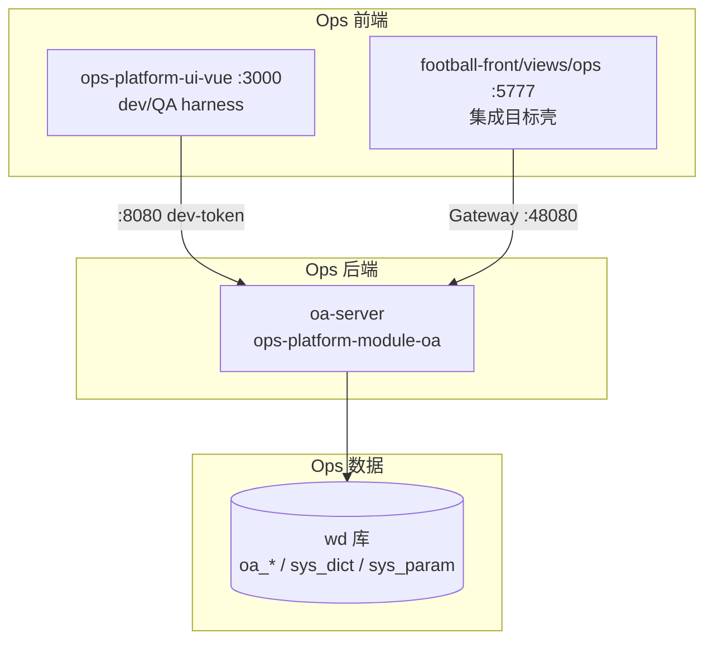
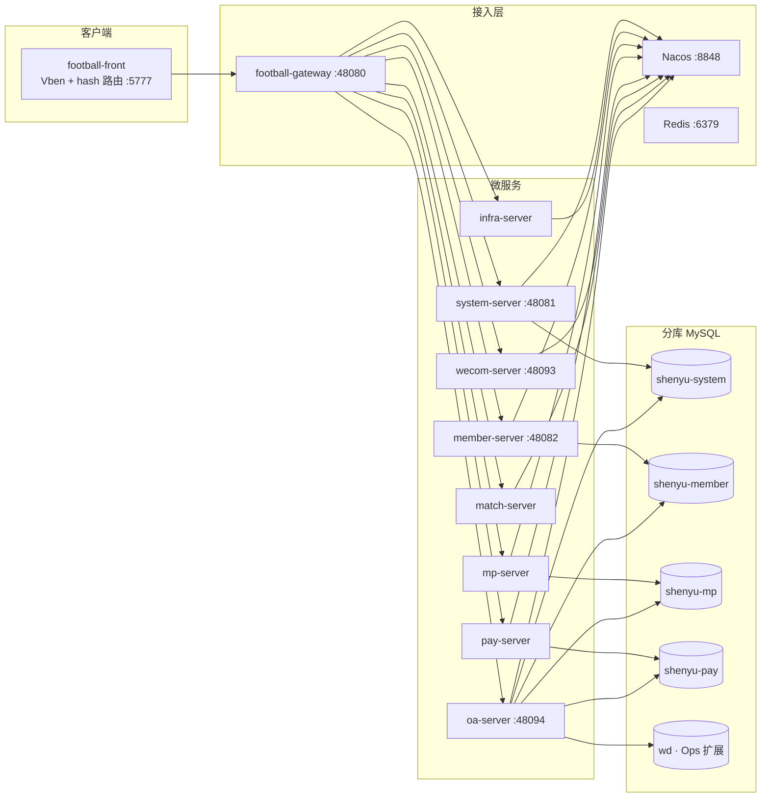
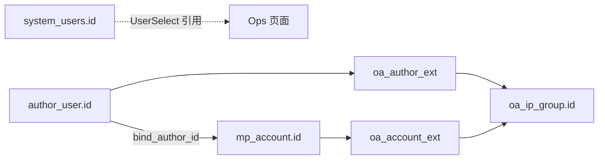
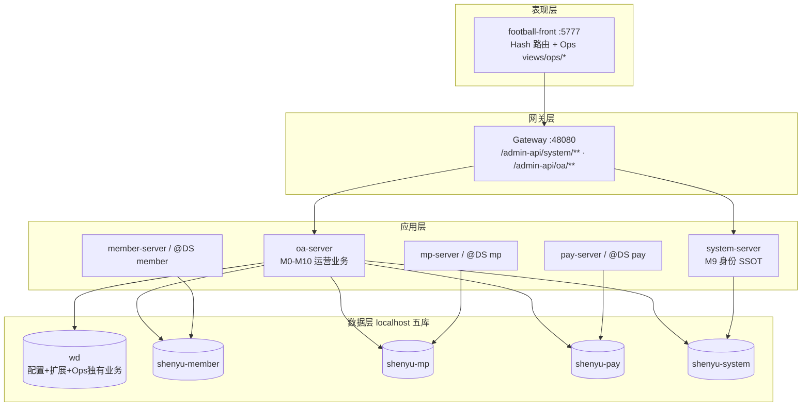
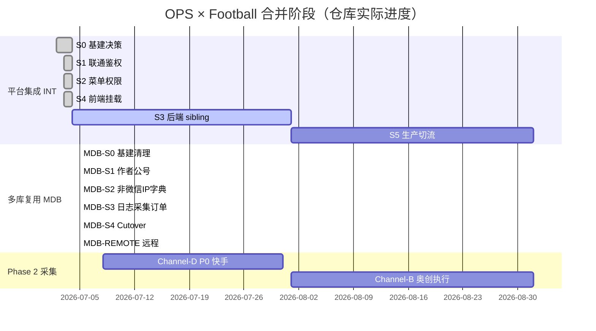

# OPS × Football 合并规划与架构方案

> **文档性质**：对外交付 · 合并规划与架构说明  
> **版本**：v1.0 | 2026-07-09  
> **受众**：外部协作团队（Football 主仓、Ops 产品/研发、运维）  
> **证据来源**：仓库 ADR-047/049/050/051/052、INTEGRATION-PROGRESS、OPS-FOOTBALL-* 分析、PRD M0–M10、Gate 报告  
> **状态**：基于 2026-07-05 本地签收事实；远程 cutover 与部分 Phase 2 能力标注为待决/假设

---

## 执行摘要

**OPS 运营数据平台**（`ops-platform-server` + `ops-platform-ui-vue`）是面向多平台内容矩阵的**运营管理中枢**，覆盖 IP 组、内容生产、账号资产、采集、分析、绩效等 M0–M10 模块。**Football SaaS**（`football-backend-saas` + `football-front`）是面向体育/内容付费场景的**多租户 SaaS 基座**，承载作者、公众号、订单支付、身份权限等核心业务，原生采用 **member / mp / pay / system 四库分域**。

双方合并目标：**以 Football 为统一登录壳与 M9 身份 SSOT**，将 Ops 业务以微服务 **`oa-server`** 接入 Nacos + Gateway，前端挂载至 `football-front`（`:5777`），API 统一经 Gateway（`:48080`）。数据策略已从 ADR-047 单库共存演进为 **ADR-050 五库拓扑**：配置留 `wd`，业务读 Football 四库，Ops 以扩展表（`oa_*_ext`）与 `@DS` 跨库适配层衔接。

**当前进度（仓库证据）**：集成 S0/S1/S2/S4 ✅；多库 GATE-MDB-S0～S4 ✅（localhost）；58 路由 E2E 全绿；S3 后端 sibling 工程 ⏸ 延期；S5 生产切流 ⬜ 待启动；远程 101.37.161.136 cutover ⏸ 用户取消。

---

## 1. OPS 运营数据平台

### 1.1 产品定位与价值

| 维度 | 说明 |
|------|------|
| **一句话** | 围绕 **IP 组** 的多平台账号矩阵日常运营阵地，串联组织、作者、账号、内容、采集、分析、绩效全链路 |
| **核心价值** | 替代 Excel 手工统计；爆款/低分/高低粉自动识别；ROI 与绩效可归因到人；资产台账合规（实名人/手机/SIM 全链绑定） |
| **目标用户** | 运营管理者、运营组长/人员、数据分析师、财务 |
| **差异化** | **IP 组组织维度**、**M4 资产链**、**内容生产 SOP/计划/审核**、**多通道采集**、**竞品监测** — Football 无等价能力 |

### 1.2 技术架构

| 层级 | 技术选型 | 说明 |
|------|----------|------|
| **后端** | Spring Boot 3.2.5 · Java 17 · MyBatis-Plus · Flyway | 单体模块 `ops-platform-module-oa`，Nacos 注册名 `oa-server` |
| **前端** | Vue 3 · Element Plus · Vite | 独立仓 `ops-platform-ui-vue`；集成时复制至 `football-front/apps/web-ele/src/views/ops/**` |
| **API 前缀** | `/admin-api/oa/**` | ADR-009 路径分配 |
| **权限码** | `oa:*` | 写入 Football `system_menu.permission` 并存 |
| **鉴权（独立模式）** | Dev Token + `sys_user` 遗留链 | ADR-003；仅 standalone 开发 |
| **鉴权（集成模式）** | Football OAuth2 Token | `FootballAuthProvider` 读 `system_users` |
| **数据库（演进）** | 远程单库 `wd` → localhost 五库 | ADR-050 取代 ADR-047 D2 单库策略（本地） |

### 1.3 功能模块结构（M0–M10）

| 模块 | 业务域 | 核心能力 | PRD 状态 |
|------|--------|----------|----------|
| **M0 首页** | 全局仪表盘 | IP 组筛选、4 指标卡、待办、快捷入口 | Draft · 已实现 |
| **M1 运营管理** | IP 组/作者/分析 | IP 组树、作者、账号/粉丝/作品分析、人效盘点、数据补录 | Draft · 试点 |
| **M2 内容生产** | SOP/计划/任务/内容 | DAG SOP、计划编排、二级审核、AI 辅助、公推模板库、知识库 | Draft |
| **M3 绩效核算** | 考核/归因 | 考核模板、自动算分、订单归因、ROI | Draft |
| **M4 账号管理** | 资产链 | 公司→实名人→手机→SIM→平台账号；个微/企微；五选择器强绑定 | Draft · 关键模块 |
| **M5 财务管理** | 成本/ROI | 购买成本、过程成本、ROI 趋势 | Draft |
| **M6 数据分析** | 报表/大屏 | 8 张报表、漏斗、自定义查询、指标、数据大屏 | Draft |
| **M7 作品监测** | 竞品监测 | 外部账号/作品、高/低粉、IP 主题、行业分析 | Draft |
| **M8 配置管理** | 系统配置 | 内外采集配置、阈值、AI 模型/Prompt、元数据维护 | 已实现 |
| **M9 系统管理** | 身份/字典/日志 | **集成后废弃身份页**；保留字典/参数/日志/消息于 Ops 壳 | Draft |
| **M10 数据采集** | 采集引擎 | 四通道采集（见 §5.3）；任务调度、质量检查 | Phase 2 Channel-A MVP |

**菜单分组（集成后 Football 侧栏）**：首页 · 运营管理 · 内容生产 · 绩效核算 · 账号管理 · 数据分析 · 作品监测 · 数据采集 · 配置管理 · 系统管理(OA) — 共 **96 路由映射 / 69 system_menu 种子 / 58 验收路由**（`oa-menu-permission-map.csv`）。

### 1.4 数据域（Ops SSOT）

| 类别 | 代表表 | 归属 |
|------|--------|------|
| **运营组织** | `oa_ip_group*` | Ops 独有（Football 无等价） |
| **内容/计划/任务** | `oa_content*`、`oa_task`、`oa_sop_*` | Ops |
| **M4 资产链** | `oa_company`、`oa_realname`、`oa_phone`、`oa_sim_card`、`oa_account`（非微信） | Ops |
| **个微/奥创** | `oa_personal_wechat_account`、`oa_aocreate_*` | Ops |
| **企微** | `oa_wework_account`、`oa_wework_employee`、`oa_wework_daily_stats` | Ops |
| **采集** | `oa_collect_*`、`oa_collector_account_bind` | Ops |
| **竞品（规划）** | `oa_external_account`、`oa_external_work` | Ops（ADR-052） |
| **业务字典** | `sys_dict_type`、`sys_dict_data`（`dict_*` 类型） | Ops SSOT |
| **运营参数** | `sys_param` | Ops SSOT |
| **元数据** | `sys_metadata_*` | Ops（M8） |
| **配置/模板** | `oa_ai_*`、`oa_threshold_config`、`oa_dashboard`、`oa_sop_template` 等 | Ops |

---

## 2. Football SaaS 平台

### 2.1 产品定位与价值

| 维度 | 说明 |
|------|------|
| **一句话** | 面向 **体育/内容付费** 场景的多租户 SaaS 基座，承载作者生态、公众号运营、订单支付与平台治理 |
| **核心价值** | C 端用户与作者管理、公众号矩阵、订单/分成/提现、租户与权限、App 运营配置 |
| **目标用户** | 平台管理员、租户运营、作者、C 端会员 |
| **证据边界** | 本仓库 **不含** `football-backend-saas` 完整源码（以 SQL 导出、集成脚本、JAR 元数据为据）；以下功能结构来自 **四库 schema + 集成文档** |

### 2.2 技术架构

| 层级 | 技术选型 | 说明 |
|------|----------|------|
| **后端** | Spring Cloud · Nacos · Gateway · 芋道/RuoYi 衍生框架 | 微服务分模块部署 |
| **前端** | Vben Admin · Element Plus · **hash 路由** | `football-front/apps/web-ele` |
| **API 前缀** | `/admin-api/system/**`、`/admin-api/infra/**`、各业务模块前缀 | Gateway 统一入口 |
| **权限码** | `system:*` 及业务模块前缀 | M9 SSOT |
| **数据库** | **原生四库分域** | `shenyu-member` / `shenyu-mp` / `shenyu-pay` / `shenyu-system` |

### 2.3 功能模块结构（按微服务/分库）

#### 2.3.1 system-server（`shenyu-system`）

| 能力 | 代表表/功能 | 说明 |
|------|-------------|------|
| **M9 身份治理** | `system_users`、`system_role`、`system_menu`、`system_tenant` | **集成后 SSOT**；Ops M9 身份页废弃 |
| **组织** | `system_dept`、`system_post` | 部门/岗位 |
| **平台字典** | `system_dict_*` | `trade_*`、`pay_*`、`system_user_sex` 等平台枚举 |
| **日志/通知** | `system_login_log`、`system_operate_log`、`system_notify_*` | S3 后 Ops UI 改读此库 |
| **OAuth2** | `system_oauth2_*` | 登录 Token 签发 |
| **App 运营** | `app_banner`、`app_version`、`app_help_center` 等 | C 端 App 配置 |
| **基础设施** | `infra_config`、`infra_job`、`infra_file` 等 | 运行时配置、定时任务、文件 |

#### 2.3.2 member-server（`shenyu-member`）

| 能力 | 代表表 | 说明 |
|------|--------|------|
| **作者生态** | `author_user`（35 行实测） | 作者身份、粉丝、分成、推送 — **业务 SSOT** |
| **作者内容** | `author_article*`、`author_performance` | 文章、战绩、绩效 |
| **渠道/活码** | `channel_live_code*` | 渠道引流 |
| **C 端会员** | `member_user*`（语义层） | 与 Ops 运营粉丝域 **不合并**（ADR-049） |
| **奥创用户** | `aoc_user`、`aoc_user_bind_record` | Football 侧奥创绑定（与 Ops 奥创采集通道独立） |

#### 2.3.3 mp-server（`shenyu-mp`）

| 能力 | 代表表 | 说明 |
|------|--------|------|
| **微信公众号** | `mp_account`（187 行实测） | 公号 SSOT；Ops 以 `oa_account_ext` 扩展 |
| **粉丝/素材/菜单** | `mp_account_fans`、`mp_material`、`mp_menu` | 公号运营能力 |
| **消息/模板** | `mp_message`、`mp_template_*` | 推送与模板消息 |

#### 2.3.4 pay-server（`shenyu-pay`）

| 能力 | 代表表 | 说明 |
|------|--------|------|
| **订单** | `pay_all_order`（178,006 行实测） | **本部署订单 SSOT**（非 ruoyi `trade_order`） |
| **鱼币充值** | `pay_gold_order` | C 端虚拟货币 |
| **财务/分成** | `finance_*` | 作者账户、渠道分成、提现 |

#### 2.3.5 其他微服务（集成文档提及）

| 服务 | 端口（本地） | 职责 |
|------|-------------|------|
| **wecom-server** | 48093 | 企微相关业务（Football 域） |
| **match-server** | — | 赛事/竞足等体育场景 |
| **infra-server** | — | 基础设施 API |

### 2.4 产品方向与价值（归纳）

Football 的核心价值在 **「作者 × 公号 × 订单 × 会员」商业闭环** 与 **多租户 SaaS 治理**，而非 Ops 所强调的 **跨平台运营矩阵、内容生产工作流、资产合规台账、竞品情报**。Football 提供 Ops 合并所需的 **身份、作者主数据、微信公号、订单只读、平台字典与日志** 等基座能力。

---

## 3. 产品方向与价值差异

| 维度 | OPS | Football | 合并含义 |
|------|-----|----------|----------|
| **主战场** | 多平台内容矩阵运营（抖音/快手/视频号/小红书/公号/个微/企微） | 体育内容付费与作者商业化 | Ops 补「运营中台」；Football 保「交易与作者基座」 |
| **组织模型** | **IP 组**（大组/小组/成员/主播） | 作者层级（`parent_id`）· 部门（`system_dept`） | IP 组 **仅 Ops**；经 `oa_author_ext.ip_group_id` 关联 |
| **账号资产** | 公司→实名人→设备→多平台账号全链 | 公号（`mp_account`）· 作者账号 | 微信公号 SSOT 迁 Football；非微信平台 **Ops** |
| **内容生产** | SOP/计划/任务/审核/发布全流程 | 作者文章（`author_article`） | **不合并**；Ops 管运营流程，Football 管作者发文 |
| **订单/财务** | 归因展示、ROI、成本台账 | `pay_all_order`、分成、提现 | Ops **只读**订单；不写 Football 财务 |
| **粉丝** | 运营侧粉丝分析（`oa_*_follower`） | C 端 `member_*` | **语义不同，不合并** |
| **竞品情报** | M7 外部监测 + M10 Channel-D | 无 | **Ops 独有** |
| **系统管理** | 遗留 `sys_user`（废弃中） | `system_*` 完整 M9 | Football **接管身份** |
| **字典** | 业务 `dict_*`（作者类型、平台、采集等） | 平台 `system_dict_*` | **双轨并存**，命名空间隔离 |

---

## 4. 重叠、交叉与共享域

### 4.1 重叠矩阵

| 域 | Football SSOT | Ops 侧 | 集成策略 |
|----|---------------|--------|----------|
| **用户/角色/租户/菜单** | `system_*` | `sys_user` 等（废弃） | Football SSOT；`oa:*` 写入 `system_menu` |
| **作者** | `author_user` | `oa_author`（弃用）→ `oa_author_ext` | ext PK = `author_user_id`；ADR-051 |
| **微信公众号** | `mp_account` | `oa_account` 微信行（弃用）→ `oa_account_ext` | 双写：mp 写主表 + wd 写扩展 |
| **订单** | `pay_all_order` | `oa_order_attribution` | `@DS("pay")` 只读；禁止 ETL |
| **字典** | `system_dict_*` | `sys_dict_*` | 双轨；类型命名空间不同 |
| **登录/操作日志** | `system_login_log`、`system_operate_log` | `sys_login_log`、`sys_operation_log` | S3 后 UI 读 Football + Adapter |
| **消息** | `system_notify_*` | `sys_message` | 分场景；Ops 广播 vs Football 站内信 |
| **参数** | `infra_config` | `sys_param` | 边界分离：平台运行时 vs 运营调参 |

### 4.2 共享但不合并的关联点

| 关联 | 说明 | 风险/债务 |
|------|------|-----------|
| `oa_author.user_id` → `system_users.id` | 作者绑定管理端用户 | **技术债**：部分字段仍指 `sys_user.id`；P2a 已改 UserSelect |
| `author_channel_sales.author_id` ↔ `oa_author.id` | 同名未验证 | **延期** — 需显式映射表 |
| `member_user` ↔ `oa_*` 粉丝 | 不同业务语义 | **明确不合并** |

### 4.3 采集通道交叉（M10）

| 通道 | 名称 | 对象 | 凭证 SSOT | 状态 |
|------|------|------|-----------|------|
| **A** | INTERNAL | 自有平台账号 | M4 `oa_account` + `oa_collector_account_bind` | ✅ MVP |
| **B** | 奥创 | 个微 | M8 `oa_aocreate_api` + `oa_aocreate_account` | 架构已定；任务执行 Phase 2 |
| **C** | 企微 | 企微应用 | `oa_wework_account` | ✅ `WeComAdapter` |
| **D** | EXTERNAL | 竞品外部账号 | M8 `oa_collect_config` + `oa_tenant_collector_credential` | ADR-052 草案 · P0 待开发 |

**关键约束**：Channel-D **禁止**复用 M4 bind 流程；collector 爬虫逻辑在 **unify-collector-api** 外部仓库。

---

## 5. 合并后目标架构

### 5.1 逻辑架构（目标态）

### 5.2 数据归属总表（ADR-050 原则）

| 原则 | 含义 |
|------|------|
| **P1 配置留 Ops** | `sys_dict_*`（业务）、`sys_param`、元数据、AI/大屏/SOP 模板 → `wd` |
| **P2 业务以 Football 为准** | `author_user`、`mp_account`、`pay_all_order`、`system_users` → 各分库 |
| **P3 Ops 独有维度扩展** | IP 组、M4 非微信账号、采集、竞品 → `wd`；挂 Football ID |

### 5.3 RBAC 与菜单

| 项 | 决策 |
|----|------|
| **登录/Token** | Football `system-server` 签发；Gateway 统一鉴权 |
| **M9 页面** | 用户/角色/租户 **仅 Football 原生菜单** |
| **Ops 业务菜单** | `system_menu` id 6100+；权限 `oa:*`；组件路径 `ops/**` |
| **Ops 系统页** | 字典/参数/日志/消息/元数据 — **保留 Ops 壳**（菜单 6137–6141、6165） |
| **Dev Token** | 仅 standalone；生产禁止 |

### 5.4 服务与端口矩阵（本地集成）

| 组件 | 端口 | 职责 |
|------|------|------|
| football-front | **5777** | 统一 UI 壳 |
| football-gateway | **48080** | API 入口 |
| system-server | **48081** | 登录/M9 |
| member-server / mock | **48082** / **48087** | 登录 Feign 走 mock（Hybrid C） |
| oa-server | **48094** | Ops 全部业务 API |
| wecom-server | **48093** | Football 企微 |
| Nacos | **8848** | 注册/配置 |
| Redis | **6379** | Token 缓存 |
| ops-platform-ui-vue（独立） | **3000** | dev/QA only |
| oa-server（独立） | **8080** | dev/QA only |

### 5.5 技术栈对照

| 层 | OPS | Football | 合并后 |
|----|-----|----------|--------|
| 语言 | Java 17 | Java（Boot 3.5.x 系） | 共存；oa-server 暂 Boot 3.2.5 |
| 前端 | Vue 3 + EP | Vben + Vue 3 + EP | **Football 壳** + Ops 组件 |
| 注册发现 | Nacos（集成 profile） | Nacos | 统一 |
| 路由 | Vue Router history（独立） | **Hash** | **Hash**（ADR-047 D6） |
| ORM | MyBatis-Plus | MyBatis-Plus | 一致 |
| 多数据源 | `@DS` dynamic-datasource | 各服务原生分库 | oa-server 五 DS |
| 迁移 | Flyway（仅 wd） | SQL 导入 + 各服务迁移 | Flyway **仅跑 wd** |

---

## 6. 合并策略与实施路线

### 6.1 核心原则

| # | 原则 | 来源 |
|---|------|------|
| 1 | **Football 为壳**：登录、菜单、M9 身份 | ADR-047 D3/D6 |
| 2 | **不改 Football 业务代码**：member/mp/pay/system-server Java 逻辑冻结 | ADR-050 §3.1 |
| 3 | **Ops 侧适配**：`@DS` 跨库、扩展表、双写 Saga | ADR-050/051 |
| 4 | **权限双前缀**：`system:*` + `oa:*` 并存 | ADR-047 D4 |
| 5 | **无跨库事务**：应用层 Saga + `sync_status` + 对账 | ADR-050 D8 |
| 6 | **Gate 驱动**：每阶段 Checklist + E2E 58/58 + Football UI 签收 | EXECUTION-PLAN §0.6 |
| 7 | **一片一会话**：Slice 级交付，禁止跨 Slice 顺手改 | PHASE-DEV-METHOD |

### 6.2 阶段路线总览

### 6.3 平台集成线（ADR-047）

| 阶段 | 目标 | 状态 | 关键产出 |
|------|------|------|----------|
| **INT-S0** | 决策锁定、环境矩阵、Gateway 路由扩展点 | ✅ | ADR-047、INTEGRATION-S0 |
| **INT-S1-A** | oa-server Nacos 注册、Gateway `/admin-api/oa/**` | ✅ | :48094 联通 |
| **INT-S1-B** | 鉴权对齐、Redis/Nacos 修复、登录 code=0 | ✅ | member-mock :48087 |
| **INT-S2** | 菜单 CSV + `system_menu` seed（69 菜单） | ✅ | 排除 M9 身份页 |
| **INT-S4** | `mount-ops-all.py` 批量挂载 103 vue | ✅ | 58/58 E2E |
| **INT-S3** | `football-module-oa` sibling 工程迁移 | ⏸ Deferred | 待用户 ID 债务清理 |
| **INT-S5** | UAT 签收、下线独立 Ops 入口（评估） | ⬜ | 生产切流 |

### 6.4 多库复用线（ADR-050）

| 阶段 | 目标 | 状态 | 关键变更 |
|------|------|------|----------|
| **MDB-S0** | localhost 五库、wd TRUNCATE、V131 ext 表 | ✅ | `dev-local-multidb` profile |
| **MDB-S1** | 作者 `author_user` + `oa_author_ext`；微信 `mp_account` + `oa_account_ext` | ✅ | 停写 `oa_author` |
| **MDB-S2** | 非微信 `oa_account`、IP 组、字典双轨 | ✅ | M4 选择器 5/5 |
| **MDB-S3** | 日志/消息读 system；订单 `@DS("pay")`；采集 bind | ✅ | P2b 订单只读 API |
| **MDB-S4** | V132 DROP `oa_author`；全场景复验 | ✅ | E2E 58/58 |
| **MDB-REMOTE** | 101.37.161.136 远程五库 cutover | ⏸ **用户取消** | 非部署环境 |

### 6.5 什么留在哪里（合并后稳态）

| 资产/能力 | 归属 | 访问方式 |
|-----------|------|----------|
| 登录、OAuth2、租户 | Football system | Gateway `/admin-api/system/**` |
| 作者主数据 | Football member | oa-server `@DS("member")` |
| 微信公众号 | Football mp | oa-server `@DS("mp")` + `oa_account_ext` |
| 订单/分成 | Football pay | oa-server `@DS("pay")` 只读 |
| 平台字典、原生日志 | Football system | oa-server `@DS("system")` |
| IP 组、内容生产、M4 资产、采集、分析、竞品 | Ops wd | oa-server `@DS("master")` |
| 业务字典、运营参数、元数据、AI/大屏配置 | Ops wd | 不变 |
| Ops 全部 UI | football-front `views/ops/**` | hash `#/ops/...` |
| M9 身份管理 UI | football-front 原生 | 非 Ops 路径 |
| 独立 Ops 入口 | ops-platform-ui-vue :3000 | **仅 dev/QA**（S5 评估下线） |

### 6.6 模块工程放置

| 工程 | 路径 | 阶段 |
|------|------|------|
| **当前承载** | `ops-platform-server/ops-platform-module-oa` | S1–S4 过渡 |
| **目标 sibling** | `wd/football-module-oa/`（与 `football-backend-saas` 平级） | S3 启动 |
| **禁止** | 修改 `football-backend-saas/pom.xml` modules 列表 | 硬约束 |

### 6.7 Phase 2 采集扩展（ADR-052）

| 优先级 | 平台 | Ops 工作 | 外部依赖 |
|--------|------|----------|----------|
| P0 | 快手 | `ExternalCollectorAdapter` + 落库 | collector `user-videos` ✅ |
| P1 | 公众号 | 租户凭账号 + 图文采集 | collector internal 路由 |
| P2 | 抖音 | 任务模型 | collector 补 `user-videos` |
| P3 | 视频号 | 任务壳 | collector 全链路待补 |

### 6.8 风险与缓解

| 风险 | 缓解 |
|------|------|
| 双套身份 `sys_user` / `system_users` | UserSelect 已切 Football；批量 FK 迁移延期 |
| 双写不一致（作者/公号） | `sync_status` + 对账 job；无跨库事务 |
| Flyway 与 Football 迁移冲突 | Flyway **仅 wd**；版本号段隔离 |
| Football Boot 3.5 vs Ops Boot 3.2 | sibling 工程时对齐 BOM；短期共存 |
| member-server mock vs 真服 | Hybrid C：登录 mock + `@DS` 直连库 |
| 远程环境与 localhost 分叉 | 明确：Gate 以 localhost 五库为准；远程另批 |

---

## 7. 对外协作建议

### 7.1 给 Football 团队

1. **合并改动清单**见 `docs/delivery/FOOTBALL-PROJECT-CHANGES.md`（Gateway 路由、Nacos 配置、菜单 seed、前端 `views/ops/**` 挂载）。
2. **禁止**修改业务微服务 Java 逻辑以适配 Ops；需求通过 **oa-server Adapter** 或 **既有 API** 满足。
3. **允许**：Gateway/Nacos yaml、DB seed、`football-front` **集成层**（路由、Ops 组件复制）。
4. M9 菜单与 `oa:*` 权限码需与 Ops seed **同步维护**。

### 7.2 给 Ops 团队

1. 新功能默认在 **`oa-server` + `wd`** 实现；读 Football 数据走 `@DS` 或 Feign。
2. 生产验收 **必须**走 `start-integration-all.ps1` → `:5777` 登录链；standalone 不作为签收依据。
3. 字典/参数 **不合并** 至 `system_dict_*` / `infra_config`。
4. M10 新通道遵守 ADR-047/048/052 分工，collector 能力缺口在 **unify-collector-api** 单独立项。

### 7.3 验收基线（可引用 Gate 报告）

| 验收项 | 期望 | 证据 |
|--------|------|------|
| Football 登录 | admin/admin123 · tenant 1 · code=0 | GATE-INT-S1 |
| Ops 路由 E2E | **58/58 PASS** | UAT-FOOTBALL-E2E-20260704 |
| 多库作者列表 | ≥35（member） | GATE-MDB-S1 |
| 微信公号列表 | ≥187（mp） | GATE-MDB-S1 |
| 订单只读 | `GET /admin-api/oa/football-order/list` code=0 | P2b |
| post-MDB 签收 | E2E 58/58 + DB SSOT | POST-MDB-LOCAL-SIGNOFF-20260705 |

---

## 8. 待决事项与假设

### 8.1 仓库证据缺口（标注为 **假设** 或 **待决**）

| # | 项 | 说明 |
|---|-----|------|
| 1 | Football **完整 PRD / 产品路线图** | 本仓库无 Football 产品文档；§2 功能来自 SQL schema 与集成分析 |
| 2 | **生产部署拓扑** | 远程 101.37.161.136 已取消 cutover；生产环境地址/拓扑 **待运维确认** |
| 3 | `match-server` / C 端 App 与 Ops 边界 | 仅知存在 match 微服务；与 Ops 集成范围 **未定义** |
| 4 | `author_channel_sales` 与 Ops 作者映射 | **延期** — 需产品决策 |
| 5 | `sys_dict_*` 是否重命名为 `oa_dict_*` | S3 可选，非必须 |
| 6 | S5 是否完全下线 `:3000` standalone | ADR-049 D6：S5 再评估 |
| 7 | member-server 真服替换 mock | 本地 Hybrid C 已签收；生产 **假设** 使用真服 |
| 8 | Channel-D / 奥创 Channel-B **完整上线时间** | ADR-052 草案 / Phase 2 backlog |

### 8.2 已确认不再争议（2026-07-04～05 产品签字）

- `sys_dict_*` = Ops 业务字典 SSOT  
- `sys_param` = Ops 运营参数  
- 订单：Ops 只读 `pay_all_order`，禁止 ETL  
- 粉丝：不合并 `oa_*` ↔ `member_*`  
- M9 身份：仅 Football  
- 作者：`author_user` SSOT + `oa_author_ext`  
- 微信公号：`mp_account` SSOT + `oa_account_ext`  

---

## 9. 文档索引

| 文档 | 用途 |
|------|------|
| [ADR-047-Football-Ops平台集成决策](../adr/ADR-047-Football-Ops平台集成决策.md) | 集成六大决策 |
| [ADR-049-Ops与Football数据归属与松耦合集成](../adr/ADR-049-Ops与Football数据归属与松耦合集成.md) | 表归属与松耦合 |
| [ADR-050-Ops与Football多库复用总纲](../adr/ADR-050-Ops与Football多库复用总纲.md) | 五库拓扑与三原则 |
| [ADR-051-Ops与Football多库复用-作者域](../adr/ADR-051-Ops与Football多库复用-作者域.md) | 作者双表策略 |
| [ADR-052-Ops外部竞品四平台采集通道](../adr/ADR-052-Ops外部竞品四平台采集通道.md) | Channel-D 草案 |
| [INTEGRATION-PROGRESS](./INTEGRATION-PROGRESS.md) | 集成进度看板 |
| [OPS-FOOTBALL-DATA-OWNERSHIP-ANALYSIS](./OPS-FOOTBALL-DATA-OWNERSHIP-ANALYSIS.md) | 数据归属四问 |
| [OPS-FOOTBALL-MULTI-DB-REUSE-ANALYSIS](./OPS-FOOTBALL-MULTI-DB-REUSE-ANALYSIS.md) | 多库可行性 |
| [OPS-FOOTBALL-MULTI-DB-EXECUTION-PLAN](./OPS-FOOTBALL-MULTI-DB-EXECUTION-PLAN.md) | MDB 执行计划 |
| [FOOTBALL-PROJECT-CHANGES](./FOOTBALL-PROJECT-CHANGES.md) | Football 主仓合并清单 |
| [OPS-STARTUP-MATRIX](./OPS-STARTUP-MATRIX.md) | Standalone vs Integration 启动 |
| [oa-menu-permission-map.csv](./oa-menu-permission-map.csv) | 路由/权限映射 |

---

## 10. 版本记录

| 日期 | 版本 | 说明 |
|------|------|------|
| 2026-07-09 | v1.0 | 首版：对外合并规划与架构方案；基于仓库至 2026-07-08 证据 |

---

*本文档由仓库 Spec/ADR/Gate 证据汇编，供外部团队评审合并方案。假设与待决项见 §8；实施签收以各 Gate 报告为准。*
