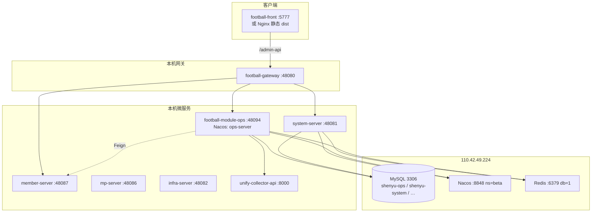

# Ops × Football 测试环境部署操作指南

> **版本**：v1.0 | 2026-08-04  
> **性质**：测试机 / Beta 远程联调 SSOT（基于仓库现有脚本与配置，不编造未实现的 CI/CD）  
> **关联**：[OPS-DEV-DEPLOY-GUIDE](./OPS-DEV-DEPLOY-GUIDE.md)（本地开发）· [OPS-TEST-DB](./OPS-TEST-DB.md)（Beta 连接矩阵）· [OPS-STARTUP-RELIABILITY-FIX-20260803](./OPS-STARTUP-RELIABILITY-FIX-20260803.md) · [ADR-058](../adr/ADR-058-OPS后端单仓与football-module-ops命名.md) · [ADR-068](../adr/ADR-068-M10-统一外部数据采集任务.md) · [ADR-069](../adr/ADR-069-采集完成阈值预警触发.md)

### 快速启动（Beta 远程 DB）

```powershell
# 1. 填写凭据（仅本地，勿提交 git）
Copy-Item scripts\integration-config\ops-test-remote.env.example scripts\integration-config\ops-test-remote.env
# 编辑 ops-test-remote.env 填入真实密码

# 2. 首次 / 大改后：构建 JAR
.\scripts\start-ops-dev.ps1 -Beta -FirstRun

# 3. 日常：重启集成栈（跳过 Maven）
.\scripts\start-ops-dev.ps1 -Beta

# 4. 启动采集服务（M10 真实联调）
.\scripts\start-collector.ps1
```

登录：http://localhost:5777 · `admin` / `admin123` · 租户 **1**  
Gateway：http://localhost:48080/admin-api  
Ops 微服务：http://localhost:48094/actuator/health  
Collector：http://127.0.0.1:8000/livez

---

## 1. 架构概览

### 1.1 测试环境拓扑

测试环境分两层：

| 层 | 位置 | 说明 |
|----|------|------|
| **基础设施** | `110.42.49.224` | MySQL 5.7、Nacos、Redis（Beta namespace） |
| **应用进程** | 运维机 / 测试机本机 | Gateway、Football 微服务、football-module-ops、football-front、unify-collector-api |

日常脚本模式：**进程监听本机端口**，通过 `ops-test-remote.env` + `*-overlay-beta.yml` 连远程 DB/Nacos/Redis。这与「全部进程跑在 110.42.49.224 上」等价于同一套 JAR/配置，只是启动脚本以 Windows PowerShell 为主（Linux 见 §7.3）。



### 1.2 端口与注册名（ADR-058）

| 组件 | 端口 | Nacos / 路由 | 说明 |
|------|------|--------------|------|
| **football-gateway** | **48080** | 统一 API 入口 | Beta 用 `gateway-integration-beta.yaml` 直连本机微服务 |
| **football-module-ops** | **48094** | 注册名 **`ops-server`** | JAR：`football-module-ops-server.jar` |
| **system-server** | 48081 | system-server | Football 登录 / 菜单 RBAC |
| **infra-server** | 48082 | infra-server | 文件上传 |
| **mp-server** | 48086 | mp-server | 公众号域 |
| **member-server** | 48087 | member-server | 作者 / 方案列表（默认真 JAR，非 mock） |
| **pay-server** | 48085 | pay-server | 集成栈会占用；`-FirstRun` 前须释放 |
| **football-front** | **5777** | dev 模式 | 或 `pnpm build:ele` 静态部署 |
| **unify-collector-api** | **8000** | 无 Nacos | M10 采集 HTTP 服务 |
| **Nacos** | 8848 | 远程 beta | 本机 `-Beta` 模式**不**启 Docker Nacos |
| **Redis** | 6379 | 远程 db=1 | OAuth2 token / 缓存 |
| **MySQL** | 3306 | 远程 | `shenyu-ops`（OPS master）+ `shenyu-system` 等 |

HTTP 规范前缀：**`/admin-api/ops/**`** → Gateway → `ops-server` :48094（ADR-058）。

### 1.3 数据库 SSOT

| 数据源 | 库名 | 用途 |
|--------|------|------|
| OPS master | **`shenyu-ops`** | Flyway、`oa_*`、`sys_param`、`sys_dict_*` |
| Football system | **`shenyu-system`** | 用户/角色/菜单/字典（ADR-056 身份 SSOT） |
| member / mp / pay | `shenyu-member` 等 | Football 域；ops-server 经 Feign 访问 |

Beta 主机 MySQL **5.7.x**；从 MySQL 8 导入时注意 collation（`utf8mb4_0900_*` → `utf8mb4_general_ci`）。

---

## 2. 环境准备

### 2.1 软件依赖

| 组件 | 版本建议 | 用途 | 必需 |
|------|----------|------|------|
| **JDK** | 17+ | football-module-ops、Football JAR | ✅ |
| **Maven** | 3.8+ | 后端构建 | ✅ |
| **Node.js** | 18+ | football-front | ✅（UI） |
| **pnpm** | 最新稳定 | football-front monorepo | ✅（UI） |
| **Python** | 3.11+ | collector、Flyway 修复脚本、seed | ✅（采集 / DB 维护） |
| **uv** 或 **pip** | 任选 | unify-collector-api 依赖 | ✅（采集） |
| **mysql 客户端** | 8.x CLI | seed / repair 脚本 | 推荐 |
| **Playwright Chromium** | 随 collector 安装 | 扫码登录类平台 | 采集扫码时 |
| **Docker Desktop** | 可选 | 本地 Nacos/Redis（**Beta 模式通常不需要**） | 可选 |
| **Git** | 2.x | 多仓库 checkout | ✅ |

### 2.2 防火墙与端口

运维机 / 测试机需放行（本机监听）：

| 端口 | 方向 | 说明 |
|------|------|------|
| 48080 | 入站（若对外提供 UI/API） | Gateway |
| 5777 | 入站（dev UI） | football-front |
| 48094 | 本机 / 内网 | ops-server（Gateway 直连） |
| 8000 | 本机 / 内网 | collector（ops-server 调用） |
| 出站 3306、6379、8848 | → `110.42.49.224` | MySQL / Redis / Nacos |

### 2.3 凭据文件（勿提交 git）

| 文件 | 说明 |
|------|------|
| `scripts/integration-config/ops-test-remote.env` | Beta MySQL / Nacos / Redis 密码（从 `.example` 复制） |
| `unify-collector-api/.env` | `API_TOKEN`、`CREDENTIAL_FERNET_KEY`、平台 Cookie 等 |
| `scripts/_tmp_wechat_cookie.txt` | 本地 cookie 桥接脚本输出（gitignore） |

模板路径：

- `d:\self\sy\运营数据平台\202606\wd\scripts\integration-config\ops-test-remote.env.example`
- `unify-collector-api/.env.example`（或 README §3 生成密钥）

---

## 3. 代码检出与分支

### 3.1 wd 根仓库（文档 / 脚本 / 集成配置）

```powershell
git clone <wd-repo-url> wd
cd wd
git checkout ops
git pull origin ops
```

本仓库提供：`scripts/start-ops-dev.ps1`、`scripts/integration-config/*`、Flyway 手工脚本、E2E 冒烟、交付文档。

### 3.2 Football 后端（football-module-ops）

| 项 | 值 |
|----|-----|
| Remote | `git@gitee.com:taste-and-play/football-backend-saas.git` |
| **工作分支** | **`ops`**（勿用 master） |
| Ops 模块 | `football-backend-saas/football-module-ops/` |

```powershell
cd football-backend-saas
git fetch origin
git checkout -B ops origin/ops
```

详见 [FOOTBALL-OPS-BRANCH.md](./FOOTBALL-OPS-BRANCH.md)。

### 3.3 Football 前端

| 项 | 值 |
|----|-----|
| Remote | `git@gitee.com:taste-and-play/football-front.git` |
| **工作分支** | **`ops`** |
| Ops 页面 | `apps/web-ele/src/views/ops/` |

```powershell
cd football-front
git fetch origin
git checkout -B ops origin/ops
pnpm install
```

### 3.4 unify-collector-api

| 来源 | 说明 |
|------|------|
| **wd 子目录** | `wd/unify-collector-api/`（与 ops 联调常用） |
| **operations-platform** | Gitee 产品仓 `operations-platform` 分支（若独立维护） |
| **collector-api** | 亦可从 GitHub `donnyskyWu/collector-api` 同步 |

```powershell
# 已在 wd 内时
cd unify-collector-api
git pull

# 或独立 clone（按团队约定 remote）
git clone <collector-repo-url> unify-collector-api
cd unify-collector-api
git checkout operations-platform   # 或 main / 团队指定分支
```

---

## 4. 数据库

### 4.1 Flyway vs 手工脚本（Beta 必读）

| 环境 | Flyway | 说明 |
|------|--------|------|
| **本地 localhost** | ✅ 启用 | ops-server 启动自动迁移 |
| **Beta 110.42.49.224** | ❌ **`spring.flyway.enabled=false`** | MySQL 5.7 + 无 performance_schema 变量；改用手工脚本 |

Beta 启动前，`start-ops-dev.ps1 -Beta` 会自动执行 Flyway 预检（见 [OPS-STARTUP-RELIABILITY-FIX-20260803](./OPS-STARTUP-RELIABILITY-FIX-20260803.md)）：

- `python scripts/integration-config/repair-flyway-failed.py`
- `python scripts/integration-config/apply_v173_live_collect.py`
- `python scripts/integration-config/apply_v175_external_collect.py`
- `python scripts/integration-config/apply_v177_wechat_external_cookie_param.py`（按需）

**关键迁移版本（M10 / M8）**

| 版本 | 内容 | 手工脚本 |
|------|------|----------|
| V173 | 直播采集（抖音 / 视频号） | `apply_v173_live_collect.py` |
| V175 | 外部统一采集、`collect_enabled` | `apply_v175_external_collect.py` |
| V176 | 阈值 metric 字典 | `apply_v176_threshold_metric.py` |
| V177 | `collect.external.wechat_official.cookie` 系统参数 | `apply_v177_wechat_external_cookie_param.py` |

**Flyway 失败行清理**

```powershell
# Beta（读 ops-test-remote.env）
python scripts/integration-config/repair-flyway-failed.py

# 本地五库
python scripts/integration-config/repair-flyway-failed.py --local
```

**MySQL 5.7 + Flyway 版本**：`football-module-ops` 已 pin Flyway **10.22.0**（Community 支持 5.7）。若仍见 `FlywayEditionUpgradeRequiredException`，须 `-FirstRun` 重编译 JAR（见 [OPS-TEST-DB](./OPS-TEST-DB.md) §Flyway）。

### 4.2 Beta 远程 env 模式

```powershell
Copy-Item scripts\integration-config\ops-test-remote.env.example scripts\integration-config\ops-test-remote.env
# 编辑：OPS_TEST_* 占位符 → 真实密码（仅本地）
```

加载方式（脚本内自动；手动调试时）：

```powershell
Get-Content scripts\integration-config\ops-test-remote.env | ForEach-Object {
  if ($_ -match '^\s*#' -or $_ -notmatch '=') { return }
  $k, $v = $_.Split('=', 2)
  Set-Item -Path "env:$($k.Trim())" -Value $v.Trim()
}
```

关联 overlay：

| 文件 | 用途 |
|------|------|
| `scripts/integration-config/ops-test-beta-multidb.yml` | ops-server 五库 + Redis + Nacos → 110.42.49.224 |
| `scripts/integration-config/football-integration-overlay-beta.yml` | Football 服务共用 beta |
| `scripts/integration-config/gateway-integration-beta.yaml` | Gateway 直连本机 + 远程 Redis |

### 4.3 测试库 seed（菜单 / 字典 / 角色）

首次或菜单缺失时：

```powershell
.\scripts\integration-config\seed-ops-test-remote.ps1
# 仅验证：
.\scripts\integration-config\seed-ops-test-remote.ps1 -VerifyOnly
```

期望：`system_menu` id 6100–6999 共 **71** 行；`super_admin` role_menu 对齐。  
**禁止** PowerShell 管道直灌 SQL（中文变 `?`）；一律走 `apply-seed-oa-menu.py` utf8mb4 stdin。

证据：[OPS-TEST-SEED-RUNLOG.md](./OPS-TEST-SEED-RUNLOG.md) · [OPS-TEST-DB](./OPS-TEST-DB.md) §ADR-064 六角色测试账号。

### 4.4 sys_param 种子（采集 / 阈值 / 钉钉）

| param_key | 默认值 / 说明 | 关联 |
|-----------|---------------|------|
| `collect.external.unified.cron` | `0 0 22 * * ?` | ADR-068 外部统一任务调度 |
| `collect.external.wechat_official.cookie` | 空（运维填入） | ADR-068 §2.2；V177；敏感项 UI 脱敏 |
| `dingtalk.enabled` | `false` | M9 通知；启用后填 `dingtalk.*` |
| `dingtalk.client-id` / `client-secret` / `agent-id` | 空 | 钉钉工作通知 |
| `dingtalk.robot.webhook` / `robot.secret` | 可选 | 群机器人降级 |
| `monitor.scan.cron` | P1 兜底扫描 | ADR-069 |

运维入口：登录 `:5777` → **运营数据 → 系统管理 → 系统参数**；或直接 UPDATE `shenyu-ops.sys_param`（敏感值勿写入可提交文档）。

**公众号 Cookie 解析顺序**（ADR-068）：`oa_tenant_collector_credential`（租户 AES）> **`sys_param.collect.external.wechat_official.cookie`** > env `WECHAT_OFFICIAL_COOKIE` > collector `.env` `WECHAT_MP_COOKIE`。

---

## 5. unify-collector-api 部署

### 5.1 安装（uv / pip）

**Windows（推荐脚本）**

```powershell
.\scripts\start-collector.ps1
# 首次会自动：python -m venv .venv && pip install -r requirements.txt
# 扫码平台还需：
cd unify-collector-api
.\.venv\Scripts\Activate.ps1
playwright install chromium
```

**手动 / Linux**

```bash
cd unify-collector-api
python3.11 -m venv .venv
source .venv/bin/activate   # Windows: .venv\Scripts\activate
pip install -r requirements.txt
playwright install chromium
cp .env.example .env        # 若存在
python run.py               # 或 uvicorn app.main:app --host 0.0.0.0 --port 8000
```

### 5.2 `.env` 模板（占位符，勿填真实密钥到文档）

在 `unify-collector-api/.env` 配置：

```dotenv
# 服务
HOST=0.0.0.0
PORT=8000
LOG_LEVEL=INFO
DATA_DIR=./data

# 与 ops-server 对齐（默认联调值）
API_TOKEN=<与 oa.unified-collector.api-token 一致，示例 test-key-2026>

# Fernet 加密 accounts.db 凭据（生成方式见 README §3）
CREDENTIAL_FERNET_KEY=<GENERATE_FERNET_KEY>

# 平台 Cookie 回退（可选；真实值仅放 .env）
WECHAT_MP_COOKIE=<WECHAT_OFFICIAL_SESSION_COOKIE>
KUAI_SHOU_COOKIE=<KUAISHOU_CP_COOKIE>

# 视频号 SDK（三端部署见 unify-collector-api/SETUP_3PLATFORM.md）
WX_SDK_PATH=./libs/wx_video_sdk

# 可选告警
ALERT_WEBHOOK_URL=
```

生成密钥示例（README）：

```bash
python -c "from cryptography.fernet import Fernet; print(Fernet.generate_key().decode())"
```

### 5.3 accounts.db 与 QR 登录

| 项 | 路径 / 说明 |
|----|-------------|
| SQLite | `unify-collector-api/data/accounts.db` |
| 扫码登录 | `unify-collector-api/tools/local_qr_login.py <platform>` |
| Ops UI | 运营数据 → 账号管理 → 扫码绑定（经 ops-server → collector） |
| 健康 | `GET http://127.0.0.1:8000/livez` |
| API 文档 | `http://127.0.0.1:8000/docs`（需 `Authorization: Bearer <API_TOKEN>`） |

Cookie 失效时：重新 QR 登录 → 若走外部采集公众号，同步更新 `sys_param.collect.external.wechat_official.cookie`（可用 `scripts/_tmp_copy_wechat_cookie_to_param.py` 类脚本，输出 gitignore）。

### 5.4 与 ops-server 对齐

`football-module-ops` 配置（`application.yaml` / Nacos / 环境变量）：

```yaml
oa:
  unified-collector:
    base-url: http://127.0.0.1:8000    # 同机部署；异机改为 collector 内网 URL
    api-token: <与 collector API_TOKEN 一致>
    timeout-ms: 30000
    stub: false                         # 测试环境真实采集须 false
```

**stub: true** 时 ops 不调 collector，外部采集无真实数据。

启动顺序建议：collector :8000 → 集成栈（含 ops-server :48094）。

```powershell
.\scripts\start-collector.ps1
.\scripts\start-ops-dev.ps1 -Beta
```

日志：`scripts/logs/collector-run.log` · 停止：`scripts/stop-collector.ps1`

---

## 6. Ops 后端部署（football-module-ops-server）

### 6.1 构建 JAR（ADR-058）

```powershell
cd football-backend-saas
mvn -pl football-module-ops/football-module-ops-server -am package -DskipTests
# 产物：
# football-module-ops/football-module-ops-server/target/football-module-ops-server.jar
```

或一键： `.\scripts\start-ops-dev.ps1 -Beta -FirstRun`

### 6.2 Profile 与 Beta 叠加

ops-server 配置 SSOT 在 JAR 内五文件：`application.yaml`（共享）+ `application-local.yaml`（本地）+ `application-dev-test-beta.yaml`（Beta 远程 DB/Nacos/Redis，本机 JAR）+ `application-beta-server.yaml`（**Beta 测试机部署**，110.42.49.224）+ `application-prod.yaml`（正式生产）。`start-integration-oa.ps1` 将 legacy `OaProfiles` 映射为 Spring profile：`local`（默认）或 `dev-test-beta`（`-Beta` / `ops-test-remote.env`）。

| 模式 | Spring profile | 启动示例 |
|------|----------------|----------|
| 本地 | `local` | `.\scripts\start-integration-oa.ps1` |
| Beta 本机 JAR | `dev-test-beta` | `.\scripts\start-ops-dev.ps1 -Beta` |
| **Beta 测试机** | `beta-server` | 见下方 §6.2.1 |
| 正式 | `prod` | `java -jar football-module-ops-server.jar --spring.profiles.active=prod` |

**Profile 差异摘要**

| 项 | local | dev-test-beta | beta-server | prod |
|----|-------|---------------|-------------|------|
| MySQL | localhost `shenyu-ops` | 远程 `${OPS_TEST_*}` | 110.42.49.224 `shenyu-ops`（**overlay 硬编码**） | `${OPS_DB_*}` 环境变量 |
| Nacos | localhost namespace `local` | 远程 namespace `beta` | 110.42.49.224 namespace **`beta`**（**overlay 硬编码**） | `${NACOS_*}`，namespace 默认 `prod` |
| Feign | 5 服务名 localhost 直连 | 同 local（本机 JAR） | **无 URL**，Nacos 服务发现 | **无 URL**，Nacos 服务发现 |
| Flyway | enabled | **disabled** | **disabled** | `${FLYWAY_ENABLED:true}` |
| AES 密钥 | jar 内 dev 默认 | jar 内 dev 默认 | dev 默认（**overlay 硬编码**） | **必设** `${OA_AES_KEY}` |
| 鉴权 | Gateway login-user | Gateway + football-redis | Gateway + football-redis，**禁用 dev-token** | 同 beta-server |
| Admin UI | localhost :48080 | localhost :48080 | **`https://beta.h5.shenyu.com`**（**overlay 硬编码**） | `${ADMIN_UI_URL}` |

手动 JAR：

```powershell
# 本地
java -jar football-module-ops-server.jar --spring.profiles.active=local

# Beta 本机 JAR（先加载 ops-test-remote.env）
java -jar football-module-ops-server.jar --spring.profiles.active=dev-test-beta

# 正式（注入 NACOS_* / OPS_DB_* / OA_AES_KEY 等后启动）
java -jar football-module-ops-server.jar --spring.profiles.active=prod
```

#### 6.2.1 Beta 测试机部署（110.42.49.224）

进程跑在测试机上、与其他 Football 服务同 Nacos `beta` namespace 时使用 **`beta-server`** profile（**无 Feign URL 硬编码**，与 `prod` 一致走服务发现）。

**推荐 — 外部 overlay（全部 literal 值，无需环境变量）**

```bash
# 1. 本地生成（gitignore，从 example 复制并填入 ops-test-remote.env 凭据）：
#    scripts/integration-config/ops-server-beta-server.yaml
# 2. 复制到测试机：
#    /opt/ops/config/ops-server-beta-server.yaml
java -jar football-module-ops-server.jar \
  --spring.profiles.active=beta-server \
  --spring.config.additional-location=file:/opt/ops/config/ops-server-beta-server.yaml
```

overlay 含完整 `spring.cloud.nacos.*`、`spring.datasource.*`（Druid 连接池）、`spring.data.redis.*`、`spring.flyway.enabled: false`、`oa.auth`、`oa.crypto.aes-key`、`oa.unified-collector.*`、`football.web.admin-ui.url` 等全部硬编码值，**无 `${...}` 占位符**。

| 文件 | 用途 | 可提交 git |
|------|------|------------|
| `application-beta-server.yaml`（JAR 内） | 薄 profile 标记（Flyway disabled 兜底） | 是（submodule） |
| `ops-server-beta-server.yaml.example` | 运维复制模板（口令 `xxx`） | 是 |
| `ops-server-beta-server.yaml` | 真实口令 overlay（copy-to-server） | **否**（gitignore） |

旧 overlay `scripts/integration-config/ops-test-beta-multidb.yml` 已弃用，内容已迁入 `application-dev-test-beta.yaml`。

### 6.3 Nacos 注册

| 项 | Beta 值 |
|----|---------|
| `spring.application.name` | **`ops-server`**（勿改为 football-module-ops-server） |
| `server.port` | **48094** |
| Nacos | `${OPS_TEST_NACOS_ADDR}` namespace **`beta`** |
| Gateway 路由 | `/admin-api/ops/**` → `http://127.0.0.1:48094`（beta yaml 直连） |

### 6.4 关键配置项

| 类别 | 配置 | 说明 |
|------|------|------|
| AES 敏感字段 | `oa.crypto.aes-key` | Base64 AES-256；Cookie / 租户凭账号加密；**生产须独立密钥** |
| 采集 | `oa.unified-collector.*` | 见 §5.4 |
| 鉴权 | `oa.auth.gateway-login-user.enabled=true` | Beta 走 Gateway + Redis OAuth2 |
| Redis | `spring.data.redis.*` | Beta 指向 110.42.49.224 db=1 |
| 调度 | `oa.collect.schedule.enabled=true` | 内部 + 外部 cron 扫描 |

开发默认 `oa.crypto.aes-key` 见 jar 内 `application.yaml`（**测试环境勿用于生产**）。

进程日志：`scripts/logs/ops-server-nacos-run.log`

---

## 7. Gateway 与依赖服务

### 7.1 完整集成栈（推荐）

```powershell
# Beta 远程 DB + 本机全栈
.\scripts\start-ops-dev.ps1 -Beta

# 等价底层
.\scripts\start-integration-all.ps1 -Restart -SkipBuild -Beta
```

启动顺序（脚本内）：预检 Flyway → 释放端口 → Football Maven（`-FirstRun`）→ Gateway → system / infra / mp / member / pay → **ops-server** → football-front。

| 服务 | 默认 Beta 行为 |
|------|----------------|
| member-server :48087 | **真 JAR**（`-UseMemberMock` 仅登录桩） |
| Nacos | 远程 110.42.49.224:8848，不启本地 Docker |
| Redis | 远程，跳过本地 `requirepass 123456` 预检 |

### 7.2 最小栈（仅 Ops API 调试）

若只需 ops API + Gateway + 登录：

```powershell
.\scripts\start-integration-all.ps1 -Beta -SkipFrontend -SkipBuild
# 或跳过部分 Football 服务（按需 -SkipOa 反向）
```

至少保留：**Gateway :48080**、**system-server :48081**、**ops-server :48094**、远程 Redis（登录 token）。

### 7.3 Linux / 生产式部署（仓库无统一 systemd）

仓库**未提供**测试机 systemd / docker-compose 全栈编排。运维可按 §6.1 产物自行：

1. `java -jar football-module-ops-server.jar --spring.profiles.active=beta-server --spring.config.additional-location=file:/opt/ops/config/ops-server-beta-server.yaml`（见 §6.2.1）  
2. `java -jar football-gateway.jar` + `gateway-integration-beta.yaml`  
3. 其余 Football JAR 同 `start-integration-all.ps1` 端口矩阵  
4. Nginx 托管 `football-front/apps/web-ele/dist`，反代 `/admin-api` → `:48080`  
5. collector：`docker build` 或 `uvicorn` + systemd（见 `unify-collector-api/README.md` §11）

Windows 日常仍以 **`start-integration-oa.ps1`** / **`start-ops-dev.ps1 -Beta`** 为准。

---

## 8. 前端

### 8.1 开发模式（默认）

```powershell
cd football-front
pnpm install
pnpm dev:ele
# → http://localhost:5777
```

`start-ops-dev.ps1 -Beta` 会自动启动 `:5777` 并校验 Vite 代理。

### 8.2 Vite / 环境变量

| 文件 | 键 | Beta 测试建议 |
|------|-----|---------------|
| `football-front/apps/web-ele/.env.development` | `VITE_PORT=5777` | 保持 |
| 同上 | `VITE_BASE_URL=http://localhost:48080` | WebSocket / Swagger |
| `vite.config.mts` | `/admin-api` proxy → `http://localhost:48080` | **必须本机 Gateway**；勿指远程 IP 否则菜单读错库 |

若 UI 需从其他机器访问 Gateway，改 `VITE_BASE_URL` 为测试机可达地址并重启 `pnpm dev:ele`。

### 8.3 静态构建（测试机 Nginx）

```powershell
cd football-front
pnpm install
pnpm run build:ele
# 产物：apps/web-ele/dist/
```

Nginx 示例：

```nginx
location / {
  root /path/to/apps/web-ele/dist;
  try_files $uri $uri/ /index.html;
}
location /admin-api/ {
  proxy_pass http://127.0.0.1:48080/admin-api/;
}
```

生产式 `.env.production` 通常 `VITE_BASE_URL=''`（同域反代）。

---

## 9. 配置检查清单

部署完成后逐项确认：

### 9.1 基础设施

- [ ] `ops-test-remote.env` 已填写且**未提交** git  
- [ ] 本机可连 `110.42.49.224:3306` / `:6379` / `:8848`  
- [ ] `seed-ops-test-remote.ps1` 已执行（菜单 6100+ 可见）  
- [ ] Flyway 预检通过或 V173/V175/V177 已手工 apply  

### 9.2 采集（ADR-068）

- [ ] collector `:8000/livez` UP  
- [ ] `oa.unified-collector.base-url` 指向 collector  
- [ ] `oa.unified-collector.api-token` = collector `API_TOKEN`  
- [ ] `oa.unified-collector.stub=false`  
- [ ] `sys_param.collect.external.unified.cron` 存在（默认 22:00）  
- [ ] `sys_param.collect.external.wechat_official.cookie` 已填（公众号外部采集 P0）  
- [ ] 外部账号 / 关键词 **`collect_enabled=1`** 已开启  
- [ ] `POST /admin-api/ops/collect/task/ensure-external-unified` 返回 taskId  

### 9.3 阈值预警（ADR-069）

- [ ] `oa_threshold_config` 有 ENABLED 规则（FANS / WORK）  
- [ ] `dict_threshold_metric` 已在 shenyu-system seed（`apply_v176_threshold_metric.py`）  
- [ ] 采集 run 完成后可写 `sys_notification_event`（钉钉未配时 graceful skip）  

### 9.4 钉钉（M9，可选）

- [ ] `dingtalk.enabled=true`  
- [ ] `dingtalk.client-id` / `client-secret` / `agent-id`  
- [ ] 用户 `dingtalk_user_id` 已同步  
- [ ] `GET /admin-api/ops/dev/dingtalk/status` code=0  

### 9.5 安全

- [ ] 文档 / git 中**无**真实密码、Cookie、Fernet key  
- [ ] `oa.crypto.aes-key` 与测试环境约定一致  

---

## 10. 验收与冒烟

### 10.1 健康端点

| 检查 | URL / 命令 |
|------|------------|
| Gateway | `curl http://127.0.0.1:48080/admin-api/system/tenant/simple-list` |
| system-server | `curl http://127.0.0.1:48081/actuator/health` |
| ops-server | `curl http://127.0.0.1:48094/actuator/health`（503 且 JSON 有 status 亦可接受，见可靠性修复） |
| ops 文档 fallback | `curl http://127.0.0.1:48094/v3/api-docs` |
| collector | `curl http://127.0.0.1:8000/livez` |
| 集成脚本健康表 | `.\scripts\start-ops-dev.ps1 -Beta` 末尾 `=== START OK ===` |

### 10.2 登录

| 项 | 值 |
|----|-----|
| URL | http://localhost:5777 |
| 账号 | **admin** |
| 密码 | **admin123** |
| 租户 | **1** |

侧栏应见 **运营数据** → IP组管理 / 采集任务 / 系统参数等（seed 6100+）。

### 10.3 E2E 脚本路径

| 场景 | 脚本 |
|------|------|
| 外部统一采集 | `docs/delivery/e2e-artifacts/EXTERNAL-COLLECT-20260803/smoke_external_collect.py` |
| 公众号 cookie + 外部采集 | `docs/delivery/e2e-artifacts/WECHAT-EXTERNAL-COLLECT-E2E-20260804/smoke_wechat_external_collect_e2e.py` |
| 阈值触发 ADR-069 | `docs/delivery/e2e-artifacts/THRESHOLD-TRIGGER-20260804/smoke_threshold_trigger.py` |
| Football 路由 | `scripts/run-uat-football-e2e.ps1` |
| 多库冒烟 | `python scripts/post-mdb-local-smoke.py` |

环境变量（可选）：

```powershell
$env:E2E_GATEWAY = "http://127.0.0.1:48080"
python docs/delivery/e2e-artifacts/EXTERNAL-COLLECT-20260803/smoke_external_collect.py
```

### 10.4 浏览器走查（外部采集）

1. 系统参数确认 `collect.external.wechat_official.cookie`  
2. 外部采集配置 → 开启「是否采集」  
3. 采集任务 → **确保外部统一任务** → 查看外部成员  
4. **立即执行** → 采集日志 SUCCESS / PARTIAL  
5. 外部作品列表有新增行（平台与 Cookie 有效时）  

---

## 11. 故障排查

| 现象 | 原因 | 处理 |
|------|------|------|
| ops-server :48094 DOWN | Flyway 失败 / V173 冲突 | `repair-flyway-failed.py` + `apply_v173/v175/v177`；`-Rebuild` |
| `FlywayEditionUpgradeRequiredException` | MySQL 5.7 + 旧 Flyway | 确认 pom Flyway 10.22.0；`-FirstRun` 重编译 |
| 健康检查超时但服务已起 | Actuator 503（Nacos/Redis degraded） | 正常；看脚本是否 `START OK`；查 `/v3/api-docs` |
| UI「内部服务错误」 | Gateway DOWN 或 Redis 不对 | `start-ops-dev.ps1 -Beta` 全栈重启；查 `gateway-integration.log` |
| 登录后无「运营数据」 | shenyu-system 未 seed | `seed-ops-test-remote.ps1`；重新登录 |
| 菜单中文 `????` | seed 非 utf8mb4 | 只用 `apply-seed-oa-menu.py`，勿 PowerShell 管道 mysql |
| 采集无数据 | `stub=true` 或 collector 未启 | `stub: false` + `start-collector.ps1` |
| 公众号外部采集 Cookie 失效 | collector session 过期 | QR 重登；更新 sys_param / `.env` WECHAT_MP_COOKIE |
| `已保存登录态已失效` | 同上 | `unify-collector-api/tools/local_qr_login.py wechat_mp` |
| Maven JAR 锁 | pay-server :48085 占用 | `stop-integration-all.ps1` 后 `-FirstRun` |
| member 方案列表 404 | Python mock 代替真 JAR | 默认 FullMemberServer；勿 `-UseMemberMock` |
| 阈值无通知 | 钉钉未启用 / 无 ding_user_id | 配 `dingtalk.*`；或查 `sys_notification_event` 是否写入 |
| Beta 改 schema 后仍旧行为 | 未 `-Rebuild` ops JAR | `start-integration-oa.ps1 -Rebuild` |

---

## 12. 脚本与文档索引

### 12.1 PowerShell（`scripts/`）

| 脚本 | 用途 |
|------|------|
| `start-ops-dev.ps1 -Beta` | **推荐** Beta 一键启动 + 健康表 |
| `start-integration-all.ps1 -Beta` | 集成全栈底层 |
| `start-integration-oa.ps1` | 仅 football-module-ops :48094 |
| `start-collector.ps1` | unify-collector-api :8000 |
| `stop-integration-all.ps1` | 停止集成栈 |
| `stop-collector.ps1` | 停止 collector |
| `integration-config/seed-ops-test-remote.ps1` | Beta 菜单/字典/角色 seed |
| `integration-config/repair-flyway-failed.py` | 清理失败 Flyway 行 |
| `integration-config/apply_v173_live_collect.py` | V173 手工 apply |
| `integration-config/apply_v175_external_collect.py` | V175 手工 apply |
| `integration-config/apply_v177_wechat_external_cookie_param.py` | V177 手工 apply |
| `integration-config/apply_v176_threshold_metric.py` | 阈值 metric 字典 |

### 12.2 配置文件

| 文件 | 说明 |
|------|------|
| `scripts/integration-config/ops-test-remote.env.example` | Beta 凭据模板 |
| `scripts/integration-config/ops-server-beta-server.yaml.example` | Beta 测试机 ops-server overlay 模板 |
| `scripts/integration-config/ops-test-beta-multidb.yml` | ops-server Beta overlay（已弃用，见 dev-test-beta profile） |
| `scripts/integration-config/gateway-integration-beta.yaml` | Gateway Beta |
| `scripts/integration-config/football-integration-overlay-beta.yml` | Football Beta |
| `football-front/apps/web-ele/.env.development` | 前端 dev |
| `unify-collector-api/.env` | collector 本地密钥 |

### 12.3 相关文档

| 文档 | 用途 |
|------|------|
| [OPS-DEV-DEPLOY-GUIDE](./OPS-DEV-DEPLOY-GUIDE.md) | 本地 localhost 开发 |
| [OPS-TEST-DB](./OPS-TEST-DB.md) | Beta 连接细节 |
| [FOOTBALL-OPS-BRANCH](./FOOTBALL-OPS-BRANCH.md) | Gitee ops 分支 |
| [OPS-UNIFY-COLLECTOR-0722-IMPACT](./OPS-UNIFY-COLLECTOR-0722-IMPACT.md) | collector 升级影响 |
| [unify-collector-api/README.md](../../unify-collector-api/README.md) | 采集 API 安装 / Docker |
| [ADR-058](../adr/ADR-058-OPS后端单仓与football-module-ops命名.md) | monorepo JAR / ops-server |
| [ADR-068](../adr/ADR-068-M10-统一外部数据采集任务.md) | 外部统一采集 |
| [ADR-069](../adr/ADR-069-采集完成阈值预警触发.md) | 阈值预警 |

---

## 13. 快速命令备忘

```powershell
# === Beta 日常 ===
.\scripts\start-ops-dev.ps1 -Beta
.\scripts\start-collector.ps1

# === 首次 / 后端大改 ===
.\scripts\start-ops-dev.ps1 -Beta -FirstRun

# === 仅 ops-server ===
.\scripts\start-integration-oa.ps1 -Profiles "dev,dev-nacos,dev-nacos-local,dev-local-multidb,dev-test-beta" -Rebuild

# === Beta DB seed ===
.\scripts\integration-config\seed-ops-test-remote.ps1

# === Flyway 手工（Beta）===
python scripts/integration-config/repair-flyway-failed.py
python scripts/integration-config/apply_v173_live_collect.py
python scripts/integration-config/apply_v175_external_collect.py
python scripts/integration-config/apply_v177_wechat_external_cookie_param.py

# === 停止 ===
.\scripts\stop-integration-all.ps1
.\scripts\stop-collector.ps1

# === 登录 ===
# http://localhost:5777  admin / admin123  tenant 1
```

---

*文档基于 wd 仓库脚本与 Beta 环境现状编写；真实口令 / Cookie 仅保存在本地 `ops-test-remote.env` 与 `unify-collector-api/.env`。生产 cutover 须单独审批（见 POST-MDB-LOCAL-SIGNOFF）。*
