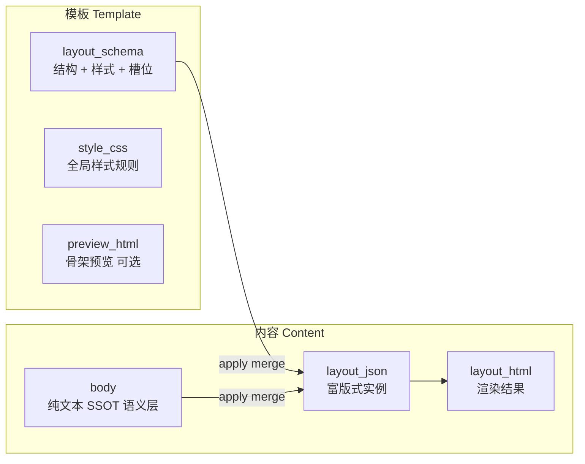
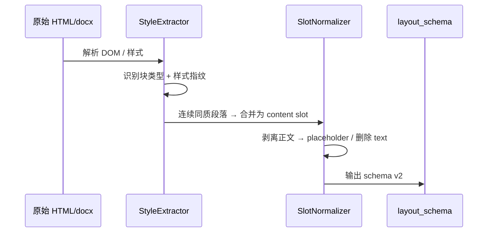

# PROPOSAL：M2 公推模板库 — 版式套用语义 v2

| 字段 | 值 |
|------|---|
| 版本 | **v2.0**（修订 S-14 语义） |
| 日期 | 2026-06-15 |
| 状态 | **Revision Approved · Implemented** |
| 关联 | `FR-M2-005` · `ADR-019`（Accepted，语义将被 ADR-020  supersede） · `ADR-020`（Draft） |
| 触发 | 产品反馈：S-14 当前实现将「整篇导入文章」存为模板，套用时会覆盖正文文案 |

---

## 0. 执行摘要

S-14 已按 ADR-019 实现 **「模板 = 完整 layout_json（含正文文本）」+「套用 = 整份复制到内容」**。这与公众号/电商行业惯例 **「模板 = 版式/样式骨架，套用 = 保留用户正文、仅注入样式」** 不符。

本提案 **不改 PRD 目标**（公推模板库、导入、应用、富版式展示），**修订**：

1. **模板存储物**：从「带正文的 blocks」改为 **Layout Schema（结构 + 样式 + 槽位定义）**
2. **导入管线**：从「全文解析入库」改为 **样式/骨架提取 + 正文剥离**
3. **套用算法**：从「复制 template → content」改为 **content 文本 × template 样式 → 新 layout_json**

**批准前不得重新实现 S-14 后端/前端逻辑。**

---

## 1. 问题陈述

### 1.1 当前实现（S-14 / ADR-019 §2.6）

| 环节 | 实际行为 | 代码/Spec 依据 |
|------|----------|----------------|
| URL/Word/HTML 导入 | 抓取/解析 HTML → `parseHtmlToLayout()` → **每个 `<p>`/`<h*>` 的文本写入 block** | `WechatLayoutTemplateServiceImpl#importUrl` · `LayoutJsonHelper#parseHtmlToLayout` |
| 模板存储 | `layout_json.blocks[]` 含 **完整段落文字**（如竞品文章全文） | `oa_wechat_layout_template.layout_json` |
| 套用模板 | **直接复制** `template.layoutJson` + `layoutHtml` 到内容；**不读取** `content.body` | `WechatLayoutTemplateServiceImpl#applyLayoutTemplate` L343-345 |
| 前端（未保存内容） | 同样复制模板 detail 到表单 | `ContentEditPanel.vue#handleApplyTemplate` L557-561 |

### 1.2 用户期望

| 环节 | 期望行为 | 行业类比 |
|------|----------|----------|
| 模板 | 仅存 **标题样式、段落样式、引用框、图片框、分隔线** 等视觉规则 | 公众号「样式库」、Word「样式」面板 |
| 导入 | 从链接/Word **学版式**，不把原文当模板正文 | 135/秀米：「范例文字仅供参考，发布请替换」 |
| 套用 | **保留** 内容已有 `body` 文字（或 layout 内 text nodes），**套用**模板视觉布局 | 公众号「一键排版」、淘宝「插入模块」 |

### 1.3 典型场景对比

**场景 A：AI 生成文案后套用团队模板**

| | 当前（错误） | 期望（正确） |
|---|-----------|-------------|
| 内容 `body` | 「本周英超焦点战…」（AI 生成） | 同左，**不变** |
| 套用「赛事战报」模板 | 正文变成模板里竞品文章的段落 | 同一段 AI 文案，套上战报模板的标题/引用/配图框样式 |

**场景 B：从公众号链接导入模板**

| | 当前（错误） | 期望（正确） |
|---|-----------|-------------|
| 导入结果 | 模板库出现一篇 **可读的完整外链文章** | 模板预览为 **骨架**：「标题样式示例」「正文段落样式」「引用样式」等占位 |
| 再次套用 | 所有内容创作者正文都被换成该外链文章 | 各创作者自己的正文，统一视觉风格 |

**场景 C：已有富版式再换模板**

| | 当前 | 期望 |
|---|------|------|
| 行为 | 整篇 layout 被新模板 **覆盖**（含文字） | **提取** 现有 layout 纯文本 → 用新模板样式 **重排** |

---

## 2. 概念模型

### 2.1 核心定义



| 概念 | 定义 | 存储位置 |
|------|------|----------|
| **Layout Schema（版式模式）** | 模板的 SSOT：块类型序列、每块样式属性、槽位（slot）类型与容量规则；**不含用户正文** | `oa_wechat_layout_template.layout_schema` |
| **Style CSS** | 公众号兼容的内联/CSS 子集；块级默认字号/颜色/边距等 | `layout_schema.globalStyles` 或独立 `style_css` 字段 |
| **Content Body（语义正文）** | 创作者/AI 的 **文字 SSOT**；套用前后 **字符串集合不变**（允许分段，不允许改字） | `oa_production_content.body` |
| **Layout Instance（版式实例）** | 套用 **输出**：schema 样式 + body 文本填入槽位后的 blocks | `oa_production_content.layout_json` |
| **Demo / Preview 内容** | 仅用于模板库预览的占位文案；**不参与套用** | `layout_schema.previewBlocks` 或 `preview_html`（可选，可弃用 demo 正文） |

### 2.2 与 ADR-019 v1 的差异

| ADR-019 v1 | 本提案 v2 |
|------------|-----------|
| 模板 `layout_json` = 可编辑完整文档 | 模板 `layout_schema` = 样式骨架；`layout_json` 字段 **deprecated 用于模板表** |
| 内容 `layout_json` = 从模板复制 | 内容 `layout_json` = **merge 算法输出** |
| 导入 = 全文 → blocks | 导入 = 样式提取 + 槽位化 + **strip text** |
| 套用 = copy | 套用 = **merge(body, schema)** |

### 2.3 内容保真规则（Content Preservation Rule）

> **套用模板不得增删改用户正文的语义文字**（标点、换行分段映射除外）。

| 允许 | 不允许 |
|------|--------|
| 将 `body` 按段落拆入 paragraph 槽 | 用模板 demo 文本替换 `body` |
| 为段落块注入 align/fontSize/color 等样式 | 用模板 import 时的外链文章段落覆盖内容 |
| 在槽位之间插入 **固定装饰块**（divider、品牌 footer 等 schema 定义的非文本块） | 未经确认删除用户段落 |
| 图片槽保留 **内容已有** 图片 URL（若 v2 支持） | 静默丢弃超长溢出文本（须 UX 告警） |

---

## 3. 行业参考模式

### 3.1 微信公众号第三方编辑器（135 / 96 / 365）

| 维度 | 做法 |
|------|------|
| **模板存什么** | 样式组件序列（标题/正文/引用/图文组合）；官方文案明确 **「模板文字、图片内容作为范例，仅供参考，发布请替换自有内容」** |
| **套用做什么** | 用户先在编辑器 **粘贴/输入正文** → 选择「一键排版」规则 → 系统按 **样式序列循环映射** 到段落（标题识别可规则或 AI） |
| **内容保真** | 用户文字保留；仅包裹样式 DOM / 内联 CSS |

**对本系统的启示**：模板库条目应是 **可复用的样式序列**，不是 **可发布的完整文章**。

### 3.2 淘宝/天猫详情「模块池」

| 维度 | 做法 |
|------|------|
| **模板存什么** | **可复用模块**（尺码表、购物须知、品牌头图框）；模块有结构无商品专属文案 |
| **套用做什么** | 在 **已有商品描述** 上 **插入/套用** 模块；商品标题、卖点正文仍在商品字段 |
| **内容保真** | 模块 = 版式容器；商品文字不被模块模板覆盖 |

**对本系统的启示**：区分 **固定装饰块**（每次套用都出现）与 **内容槽**（填入用户正文）。

### 3.3 通用：CSS Theme + HTML Skeleton / Word「样式」

| 维度 | 做法 |
|------|------|
| **模板存什么** | HTML skeleton + CSS class/theme；槽位为 `{{content}}` 或 empty `<p>` with `class="body-style"` |
| **套用做什么** | Markdown/纯文本 → 按样式规则渲染为 HTML；**theme 切换不换文字** |
| **内容保真** | 文字与样式层分离（内容与表现分离） |

**对本系统的启示**：`body` 可视为 Markdown/纯文本源；`layout_schema` 为表现层。

---

## 4. 导入改造

### 4.1 原则

导入 **不是**「保存一篇文章为模板」，而是 **「从样本文章逆向提取版式模式」**。

### 4.2 提取管线（修订）



### 4.3 各导入源提取范围

| 来源 | 提取 | **不**存储 |
|------|------|-----------|
| 公众号 URL | 块结构、inline style、class 映射、图片框比例 | 文章段落原文、外链图（除非标记为装饰性占位） |
| Word .docx | 段落 Style 名 → 块类型映射、字号/对齐 | 段落文字内容 |
| 粘贴 HTML | 同上 | 用户粘贴的全文 |

### 4.4 槽位化规则（草案）

| 块类型 | 导入后 schema 表示 | 正文处理 |
|--------|-------------------|----------|
| heading | `{ type, level, styleRef }` | 文本 → `"标题样式"` 或空 + `slot: "heading-demo"` |
| paragraph | `{ type: "slot", slotKind: "paragraph", styleRef, repeat: true }` | **strip** 原文；`repeat:true` 表示套用时可接多个段落 |
| quote | `{ type: "slot", slotKind: "quote", styleRef }` | strip |
| image | `{ type: "frame", slotKind: "image", styleRef, aspectRatio }` | src → 占位图或空 |
| divider | `{ type: "divider", styleRef }` | 无文本 |
| list | `{ type: "slot", slotKind: "list", ordered, styleRef }` | strip items |

### 4.5 导入向导 UX 声明（须新增）

> 「系统将 **仅提取版式与样式** 作为模板，**不会**保存原文正文。导入预览中的文字为样式示意，套用模板时将 **保留您内容中的原有文字**。」

### 4.6 与现有 `parseHtmlToLayout` 的关系

| 现状 | v2 |
|------|-----|
| `parseHtmlToLayout` → 带 text 的 blocks | 新增 `extractLayoutSchema(html)` → 无用户正文的 schema |
| 导入 Job `previewLayoutJson` 展示全文 | `previewSchema` + `previewHtml`（骨架渲染，占位符文案） |

---

## 5. 套用算法

### 5.1 输入 / 输出

| 输入 | 说明 |
|------|------|
| `content.body` | 纯文本；优先作为语义 SSOT |
| `content.layout_json`（可选） | 若已是 LAYOUT，先 **extractText(layout_json)** 合并回 body 分段（避免丢字） |
| `template.layout_schema` | 样式骨架 |

| 输出 | 说明 |
|------|------|
| `content.layout_json` | merge 结果 |
| `content.layout_html` | `render(merged layout_json)` |
| `content.body` | **保持不变**（或同步为 extractText 结果，须一致） |
| `content.body_format` | `LAYOUT` |
| `content.layout_template_id` | 模板 ID |

### 5.2 步骤（单槽位串行模型 — 默认草案）

```
1. segments ← splitBody(content.body)        // 按 \n\n 或 \n 分段，保留顺序
2. schemaBlocks ← template.layout_schema.blocks
3. out ← []
4. segIdx ← 0
5. for each block in schemaBlocks:
     if block is fixed (divider / brand-footer):
         out.append(clone(block))
     else if block.slotKind == "paragraph" && block.repeat:
         while segIdx < len(segments) && next block is not special marker:
             out.append(paragraph(segments[segIdx], block.styleRef))
             segIdx++
     else if block.slotKind == "heading":
         out.append(heading(pickTitle(segments, segIdx), block.styleRef))  // 待确认策略
     else if block.slotKind == "quote":
         out.append(quote(nextSegment or skip, block.styleRef))
     ...
6. if segIdx < len(segments):               // 溢出
     append default paragraph style for remaining segments  // 或 UX 告警
7. layout_json ← { version: 2, blocks: out }
8. layout_html ← render(layout_json)
```

### 5.3 边缘情况

| 场景 | 建议处理 | 待确认 |
|------|----------|--------|
| **正文长于槽位** | 剩余段落用 schema 的 **默认 paragraph styleRef** 追加 | OQ-v2-01 |
| **正文短于槽位** | 空槽跳过或保留空 styled 块 | OQ-v2-02 |
| **多段落 → 单 paragraph repeat 槽** | repeat 槽吃掉连续段落直到遇到 heading/quote 槽 | 默认 |
| **内容含图片** | v2.0：图片 URL 保留为 image 块插入段落间；或 Phase 2 | OQ-v2-03 |
| **AI 生成后 body 为空** | 拒绝套用或仅应用固定装饰块 | OQ-v2-04 |
| **已有 LAYOUT 换模板** | 先 extractText → 再 merge（**不**直接丢 layout） | 默认 |
| **标题识别** | 方案 A：首段作 h2；方案 B：Markdown `#`；方案 C：AI | OQ-v2-05 |

### 5.4 API 语义变更

| 端点 | v1 | v2 |
|------|----|----|
| `POST .../apply-layout-template` | copy template layout | **merge**；响应含 `appliedPreview` 可选 |
| 新增（建议） | — | `POST .../apply-layout-template/preview` 仅返回 merge 预览，不写库 |

---

## 6. 数据模型变更

### 6.1 模板表 `oa_wechat_layout_template`

| 字段 | v1 (S-14) | v2 提案 | 说明 |
|------|-----------|---------|------|
| `layout_json` | TEXT，完整 blocks | **Deprecated**（迁移后只读） | 保留兼容读取 |
| `layout_schema` | — | **JSON TEXT，NOT NULL（新模板）** | SSOT |
| `style_css` | — | TEXT，可空 | 全局样式；或并入 schema |
| `layout_html` | 渲染 HTML | **preview_html** 骨架预览 | 不含用户正文 |
| `schema_version` | — | INT，默认 `2` | |
| `slot_config` | — | JSON，可空 | 槽位映射策略 override |

**`layout_schema` v2 最小示例**：

```json
{
  "version": 2,
  "globalStyles": {
    "paragraph": { "fontSize": "16px", "lineHeight": "1.75", "color": "#333" },
    "heading2": { "fontSize": "18px", "fontWeight": "bold", "color": "#1a1a1a" }
  },
  "blocks": [
    { "type": "heading", "level": 2, "styleRef": "heading2", "demoText": "标题样式" },
    { "type": "slot", "slotKind": "paragraph", "styleRef": "paragraph", "repeat": true, "maxRepeat": null },
    { "type": "quote", "styleRef": "quote", "slotKind": "quote", "optional": true },
    { "type": "divider", "styleRef": "divider" },
    { "type": "frame", "slotKind": "image", "styleRef": "image", "optional": true }
  ]
}
```

### 6.2 内容表 `oa_production_content`

| 字段 | 变更 |
|------|------|
| `body` | **始终保留语义正文**；套用不覆盖 |
| `layout_json` | v2 block 实例（含真实 text） |
| `body_format` | 逻辑不变 |

### 6.3 导入 Job 表

| 字段 | 变更 |
|------|------|
| `preview_layout_json` | 改为 `preview_layout_schema` |
| 新增 | `extraction_report` JSON（剥离字数、识别槽位数、警告） |

---

## 7. UI/UX 变更

| 页面 | v1 | v2 |
|------|----|----|
| P-M2-013 模板列表 | 缩略图可能含完整文章 | 缩略图为 **骨架预览** |
| P-M2-015 模板编辑 | 编辑带正文的 blocks | 编辑 **样式与槽位**；demo 文案可编辑但标记「仅预览」 |
| P-M2-014 导入向导 | 预览全文 | 预览 **提取后的骨架** + 免责声明（§4.5） |
| 内容编辑 - 套用 | 确认覆盖版式 | **套用前预览** side-by-side：左原文 / 右套用效果 |
| 内容编辑 - 套用 | 无 body 时仍复制模板文 | body 为空 → 禁用或提示先填写正文 |

---

## 8. API 变更草案

### 8.1 模板 CRUD

| 方法 | 变更 |
|------|------|
| `POST/PUT layout-template` | 请求体 `layoutSchema` 替代 `layoutJson`；服务端校验 **无用户正文**（slot/demo 以外 text 为空或 demo 标记） |
| `GET layout-template/{id}` | 响应含 `layoutSchema`、`previewHtml` |

### 8.2 导入

| 方法 | 变更 |
|------|------|
| `POST import-url` / `import-docx` / `import-paste` | Job 产出 `previewLayoutSchema` + `extractionReport` |
| `POST import-job/{id}/confirm` | 从 schema 创建模板（非 layout_json 全文） |

### 8.3 套用

| 方法 | 变更 |
|------|------|
| `POST content/{id}/apply-layout-template` | 执行 merge；`overwrite` 语义改为「是否覆盖已有 layout 实例」（**不**覆盖 body 文字） |
| `POST content/{id}/apply-layout-template/preview` | **新增**：返回 merge 预览，不写库 |

**错误码（建议新增）**：

| 码 | 含义 |
|----|------|
| 2013 | `LAYOUT_APPLY_BODY_EMPTY` — 正文为空无法套用 |
| 2014 | `LAYOUT_APPLY_OVERFLOW` — 正文段落超出 schema 容量（若采用 strict 模式） |

---

## 9. 迁移策略

### 9.1 已有模板（DB 中 `layout_json` 含全文）

| 策略 | 说明 | 推荐 |
|------|------|------|
| **M1 自动提取** | 批处理：`layout_json` → `extractLayoutSchema()` → 写 `layout_schema`；原 `layout_json` 保留只读 | ✅ 默认 |
| **M2 标记 legacy** | `schema_version=1` + 套用走旧 copy 逻辑 | 仅过渡 |
| **M3 人工重导** | 通知管理员重新导入 | 提取失败时 |

### 9.2 已有内容（已套用 v1 模板）

- **不自动回滚**；用户若需「保留文字换版式」，提供 **「按当前正文重新套用模板」** 操作（extractText → merge）
- `layout_template_id` 保留审计

### 9.3 迁移脚本（实现期）

1. Flyway `V79__layout_schema_v2.sql`：加列 `layout_schema`、`schema_version`
2. Java 批任务：`LayoutSchemaMigrationJob`
3. 提取失败 → `status=NEEDS_REVIEW`（**待确认**是否新增状态）

---

## 10. 开放问题（OQ）

| 编号 | 问题 | 选项 | 默认建议 |
|------|------|------|----------|
| **OQ-v2-01** | 正文段落 **多于** schema 段落槽 | A strict 报错 B 默认样式追加 C AI 分段 | **B** |
| **OQ-v2-02** | 正文 **少于** 槽位 | A 留空 B 隐藏空槽 | **B** |
| **OQ-v2-03** | 正文中的 **图片** | A v2 不支持 B URL 保留 C 上传素材库 | **B**（P1） |
| **OQ-v2-04** | body 为空时套用 | A 禁止 B 仅装饰块 | **A** |
| **OQ-v2-05** | **标题/引用** 如何映射 | A 首段作标题 B Markdown C AI 结构识别 | **A** v2.0；C Phase 2 |
| **OQ-v2-06** | 单槽 vs **多区段** schema | A 单一 repeat 段落槽 B 多 section（导语/正文/结语） | **B** 更贴近战报模板 |
| **OQ-v2-07** | demo 占位文案 | A 固定「标题样式」B 可编辑 C 无文案纯灰块 | **C** |
| **OQ-v2-08** | ADR-019 状态 | Supersede by ADR-020 vs 修订 ADR-019 | **ADR-020 新文档** |
| **OQ-v2-09** | S-14 已实现代码 | 回滚 vs 原地重构 | **原地重构** + 迁移 |
| **OQ-v2-10** | AI 辅助分段（M8） | v2 是否纳入 | **Phase 2** |
| **OQ-v2-11** | 预置模板：清单（8 vs 5）、租户策略、原条目可编辑性 | 见 §14 Q3 · `SEED-M2-公推预置模板草案.md` | **P0 五款 + per-tenant seed** |

---

## 11. 实施切片估算（无代码）

| 切片 | 范围 | 依赖 | 估算 |
|------|------|------|------|
| **S-14b** | Schema 模型 + `extractLayoutSchema` + 导入改造 + 迁移脚本 | ADR-020 Accepted | 1 会话 |
| **S-14c** | `LayoutMergeService` + apply/preview API + 错误码 | S-14b | 1 会话 |
| **S-14d** | 前端：骨架预览、套用预览、导入免责声明 | S-14c | 1 会话 |
| **S-14e** | 迁移批处理 + IT/TC 修订 + CHECKLIST | S-14b~d | 0.5 会话 |

**Gate 条件**：TESTCASES-M2 套用相关 P0 **全部重写**并通过；旧「复制全文」用例 **废弃**。

**与 S-15+ 边界**：S-14b~e **不**含 M8 AI 分段、不含 135/秀米集成。

---

## 12. 批准清单

| # | 确认项 | 阻塞 |
|---|--------|------|
| 1 | 模板 **仅存版式**，不存导入文章正文 | 🔴 |
| 2 | 套用 = **merge**，不 copy 模板正文 | 🔴 |
| 3 | `body` 为语义 SSOT，套用 **不改字** | 🔴 |
| 4 | OQ-v2-01~07 选项 | 🟡 |
| 5 | 已有模板迁移策略 M1 | 🟡 |
| 6 | ADR-020 Accept → 启动 S-14b | 🔴 |

---

## 13. 相关文档

| 文档 | 动作 |
|------|------|
| `docs/adr/ADR-020-M2-公推模板版式套用语义.md` | 新建（Draft） |
| `docs/adr/ADR-019-M2-公推模板库存储与导入.md` | Accept 后标注 **Superseded by ADR-020 §套用/导入** |
| `docs/product/PRD-M2-内容生产.md` FR-M2-005 | Accept 后修订 §4.5.4-D、§4.5.6 |
| `docs/delivery/CHANGELOG-REQ-公推模板库-20260614.md` | 已链入本提案，状态 Revision Pending |
| `docs/delivery/SEED-M2-公推预置模板草案.md` | 新建（预置 catalog 草案） |

---

## 14. FAQ 产品答疑（2026-06-15 Review）

> 本节回应产品对 v2 提案的三项跟进问题。**批准前仍为 Spec 修订，不含实现。**

### Q1：模板的新增/编辑功能是不是也要修改？

**结论：是，必须改。** 当前 P-M2-015（`layout-template/edit.vue`）与 `LayoutEditor.vue` 按 ADR-019 v1 设计为 **「完整文档块编辑器」**——用户可直接编辑标题文字、段落正文、引用全文、图片 URL，保存为 `layout_json`。这与 v2「模板 = 版式骨架、不含用户正文」直接冲突。

#### 与现状的差异

| 维度 | 当前（S-14 / v1） | v2 目标 |
|------|-------------------|---------|
| 编辑对象 | `layout_json` 完整 blocks（含真实 text） | `layout_schema`（结构 + 样式 + 槽位） |
| 编辑器心智 | 像写一篇文章 | 像配置 Word「样式」或 135「样式组件序列」 |
| 段落块 | 可输入任意营销文案 | **槽位**：`slotKind=paragraph` + `styleRef` + `repeat`；无用户正文 |
| 标题/引用 | 可填真实标题句 | 仅占位（灰块 / `demoText` 标记「仅预览」，**不参与套用**，见 OQ-v2-07） |
| 预览 | `layout_html` 展示完整可读文章 | **骨架预览**：块类型标签 + 样式示意，非可发布文案 |
| 保存 API | `POST/PUT` 提交 `layoutJson` | 提交 `layoutSchema`；服务端校验 **禁止** 持久化未标记的用户正文 |
| 存储 | `oa_wechat_layout_template.layout_json` SSOT | `layout_schema` SSOT；`layout_json` 只读兼容 |

#### 手动创建流程（v2）

1. 填写元数据：`template_name`、`description`、可选 `document_type`、状态（与现网一致）。
2. 在 **样式/槽位编辑器** 中按顺序添加块类型：标题槽 → 段落 repeat 槽 → 引用槽（可选）→ 分隔线 → 图片框（可选）等。
3. 为每块配置 `styleRef`（指向 `globalStyles` 中的字号/颜色/对齐/行高等），**不输入真实营销文案**。
4. 预览区渲染 **骨架 HTML**（灰块或固定占位符如「标题样式」「正文段落样式」），并展示声明：「占位文字仅用于预览，套用时将保留内容正文」。
5. 保存 → 服务端生成 `preview_html` + `layout_schema`；**不**写入 demo 营销段落（默认采纳 OQ-v2-07 选项 C：纯灰块）。

#### 编辑页 UX 变更清单（P-M2-015）

| # | 变更项 |
|---|--------|
| 1 | 表单字段 `layoutJson` → `layoutSchema`；`LayoutEditor` 拆为或扩展为 **StyleSlotEditor** |
| 2 | 工具栏：「添加段落」→「添加正文槽（可重复）」；「添加标题槽」「添加引用槽」「添加装饰块」 |
| 3 | 块编辑区：样式面板（字号/颜色/对齐）为主；**移除**大段 textarea 正文输入（或仅限 demo 且标「仅预览」） |
| 4 | 段落块 UI：显示「内容槽 · 段落 · 可重复」标签，而非可编辑正文 |
| 5 | 预览卡：改为骨架预览；列表缩略图同步（§7 P-M2-013） |
| 6 | 保存校验失败提示：「模板不得包含未标记的正文内容」 |
| 7 | 导入确认后的编辑页：与手动创建同一套编辑器（编辑的是 schema，不是导入全文） |
| 8 | Legacy 模板（`schema_version=1`）：只读展示旧 `layout_json`，提示「请重新导入或迁移」；不可按 v1 方式继续编辑正文 |

**切片归属**：S-14d（前端骨架预览 + 模板编辑改造）。

---

### Q2：内容记录（`oa_production_content`）的数据结构是不是也要修改？

**结论：表结构 **小幅演进**，语义 **显著修订**；现有列 **基本保留**，新增列 **主要在模板表**，内容表以 JSON 内部版本升级为主。**

#### 保留不变的列（内容 SSOT 分层不变）

| 字段 | v2 角色 |
|------|---------|
| `body` | **语义正文 SSOT**；套用前后字符串一致（仅允许 `\n` 分段解析，不允许改字） |
| `body_format` | `PLAIN` / `LAYOUT`；套用后设为 `LAYOUT` |
| `layout_json` | **富版式实例 SSOT**（套用 **输出**）：含用户真实 text 的 blocks，`version: 2` |
| `layout_html` | 由 `layout_json` 渲染的消毒 HTML；审核/查看用 |
| `layout_template_id` | 记录最近套用的模板 FK；审计用，非强绑定 |

#### 可能新增/变更（按 ADR-020，**内容表无强制新列**）

| 项 | 说明 |
|----|------|
| `layout_json.version` | 由 `1` 升为 `2`；块结构为 merge 输出，非模板 copy |
| `layout_json` 内 metadata（可选） | 如 `mergedAt`、`schemaVersion`、`overflowSegmentCount`；可先嵌在 JSON 根级，**不强制独立列** |
| `body` 与 `layout_json` 关系 | v1 套用后 `body` 可能与 `layout_json` 脱节；v2 要求一致或 `body` 为 extractText 的权威源 |
| **不新增** `layout_schema` 到内容表 | Schema 仅存模板表；内容只存 **实例** |

#### 模板表变更（对比，供迁移评估）

| 表 | 新增/变更列 |
|----|-------------|
| `oa_wechat_layout_template` | `layout_schema` JSON NOT NULL（新模板）、`schema_version` INT、`style_css` TEXT、`slot_config` JSON；`layout_json` deprecated |
| `oa_layout_import_job` | `preview_layout_schema` 替代 `preview_layout_json`；`extraction_report` JSON |

#### 对已有内容记录的影响

| 场景 | 策略 |
|------|------|
| 已用 v1 **copy 套用** 的内容 | **不自动回滚**；`layout_json` 仍含模板导入时的外链/样本文字 |
| 用户要「保留自己的字、换版式」 | 提供 **「按当前正文重新套用」**：`extractText(layout_json)` → 合并回 `body` → `merge(body, newSchema)` |
| `body` 为空但 `layout_json` 有字 | v1 遗留；重新套用前须先 **同步 body** 或手工整理 |
| `layout_template_id` | 保留；仅表示历史来源，不触发自动更新 |
| 新套用（v2） | `body` 不变；`layout_json`/`layout_html` 由 `LayoutMergeService` 重写 |

#### 表/列 diff 摘要

```
oa_production_content     — 无 Flyway 新列（默认）；layout_json 文档 version 2
oa_wechat_layout_template — +layout_schema, +schema_version, +style_css, +slot_config
                          — layout_json 只读；layout_html 语义改为 preview_html 骨架
oa_layout_import_job      — preview_layout_json → preview_layout_schema；+extraction_report
```

**切片归属**：S-14b（Schema 模型 + 迁移）、S-14c（Merge 服务）。

---

### Q3：能否从电商、自媒体运营默认预置几个模板进来？

**结论：可以，建议作为 S-14e 或独立 Seed 切片交付**；须产品确认预置清单与租户策略后方可实现。

#### 建议预置目录（8 款 — 仅骨架，无营销全文）

| # | 名称 | 场景 / `document_type` | 结构（槽位） | 行业参考 |
|---|------|------------------------|--------------|----------|
| 1 | 公众号长文导读 | 通用（`document_type` 空） | H2 标题槽 → 导语引用槽 → 段落 repeat 槽 → 分隔线 → 段落 repeat 槽 | 135「导读框 + 正文」一键排版 |
| 2 | 活动预告 | `PREHEAT_PREVIEW` | 居中 H2 → 高亮引用槽（时间/地点示意）→ 段落 repeat → 图片框 → 分隔线 → 结语段落槽 | 公众号活动推文版式 |
| 3 | 电商种草清单 | `NEW_ACCOUNT_TRAFFIC` | H2 → 编号列表槽（repeat）→ 分隔线 → 段落 repeat → 双图横排框（可选） | 淘宝「种草清单」模块 |
| 4 | 新品卖点卡片 | 通用 | H2 → 三列「图标+短标题」frame 组（固定装饰）→ 段落 repeat → 强调引用槽 | 淘宝「卖点提炼」模块 |
| 5 | 赛事战报 | `POST_MATCH_REVIEW` | H2 → 比分/数据高亮框（固定装饰）→ 段落 repeat → 引用槽（点评）→ 图片框 | 体育自媒体战报体 |
| 6 | FAQ 问答 | `OFFICIAL_PLAN` | H2 → Q/A 交替（heading 槽 level=3 + paragraph 槽）×N → 分隔线 | 客服/方案类 FAQ 排版 |
| 7 | 赛后数据复盘 | `POST_MATCH_REVIEW` | H2 → 表格占位 frame（固定）→ 段落 repeat → 引用槽 | 数据向复盘（装饰块为主） |
| 8 | 短视频引流贴片 | `SHORT_VIDEO_SCRIPT` | 短 H2 → 居中口号引用槽 → 单段落槽 → 引导分隔线 + footer 装饰 | 新号引流短文 |

> 各模板 **仅含** `globalStyles` + 槽位序列 + 可选固定装饰块；**不含** 真实商品名、赛果、活动文案。

#### 交付方式（草案）

| 项 | 建议 |
|----|------|
| 字典 | `dict_layout_template_source` 新增 `PRESET`（系统预置） |
| 状态 | `status=ENABLED`，创建即可在模板选择器可见 |
| 租户 | **OQ-v2-11**：A) 每租户 seed（`tenant_id=1` 与现有 seed 一致）B) 平台全局模板（`tenant_id=0` + 查询 union）— **默认 A** |
| 脚本 | Flyway `V80__seed_m2_layout_preset.sql`（依赖 V79 schema 列） |
| 权限 | 预置模板 **不可删除**，可 **停用**；复制后可编辑为用户自有模板 |
| 缩略图 | 骨架 `preview_html` 服务端渲染；`thumbnail_url` 可后续批量生成 |

#### 工作量与维护

| 项 | 估算 |
|----|------|
| 8 款 schema 编写 + preview 渲染 | 0.5 会话（与 S-14e 合并） |
| Flyway seed + 字典 + IT（`SeedVerificationIT` 扩展） | 含在上项 |
| 后续维护 | 样式微调随 Flyway 新版本；**不**自动覆盖租户已复制副本 |
| 与 135/秀米关系 | 预置为 **自研骨架**，非第三方 iframe；命名与结构 **对标** 行业模块，**不**拷贝其 HTML/CSS（合规） |

#### 待产品确认（OQ-v2-11）

- 上表 8 款是否全部首批上线，或缩减为 P0 五款（#1、#2、#5、#6、#8）？
- 预置模板是否允许租户管理员编辑原条目，还是仅「复制后编辑」？
- 是否需按业务线（电商 vs 赛事）分包展示？

**详细骨架 JSON 规格**：见 `docs/delivery/SEED-M2-公推预置模板草案.md`。

---

*起草：AI Spec · 2026-06-15 · 待产品 Review & Approve*
