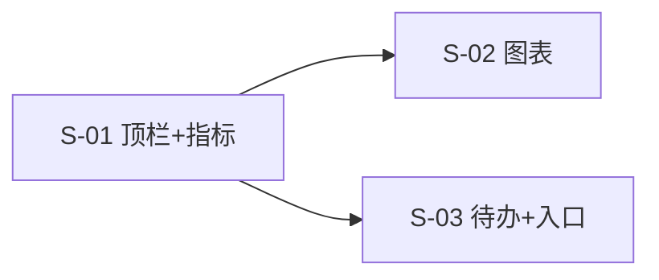

# SLICES-M0-首页

> **切片计划**：M0 首页（FR-M0-001）
> **版本**：v1.0 | 2026-06-07
> **总切片数**：3 片
> **预估总工时**：约 3 人日

---

## 1. 切片总览

| Slice | 目标 | 包含 FR | 依赖 | 工时 | 优先级 |
|-------|------|--------|------|------|--------|
| **S-01** | 顶栏 + 指标卡（4 个） | FR-M0-001（顶部+指标） | - | 1.0 | P0 |
| **S-02** | 2 个图表（趋势 + 分布） | FR-M0-001（图表） | S-01 | 1.0 | P0 |
| **S-03** | 待办 + 快捷入口 | FR-M0-001（待办+入口） | S-01 | 1.0 | P0 |

---

## 2. 依赖图

---

## 3. 切片详述

### S-01：顶栏 + 4 个指标卡

**包含**：
- 后端：`/dashboard/home/metrics` API
- 前端：`<IpGroupTreeSelect />`、`<DateRangePicker />`、`BTN-REFRESH`、4 个 `<MetricCard />`
- 缓存：5min ConcurrentHashMap
- 数据：4 指标查询 SQL

**关联全局规范**：
- F-IP 必须是 `<IpGroupTreeSelect />`（GLOBAL-CONVENTIONS § 4.1）
- `totalAuthors` 来自 `oa_author` 状态=启用（`dict_author_status`）

**验收**：AC-M0-001-1, AC-M0-001-2, AC-M0-001-3

---

### S-02：2 个图表（趋势 + 分布）

**包含**：
- 后端：`/dashboard/home/trend`、`/dashboard/home/platform-dist`
- 前端：ECharts 折线图 + 饼图
- 字典联动：F-PLATFORM 用 `<DictSelect dict-type="dict_platform_type" />`

**关联全局规范**：
- `platform` 字段使用 `dict_platform_type` value
- 折线图按 `platform_type` 字典聚合

**验收**：AC-M0-001-4

---

### S-03：待办 + 快捷入口

**包含**：
- 后端：`/dashboard/home/todos`、`/dashboard/home/quick-actions`
- 前端：待办表格 + 快捷入口卡片网格
- 菜单管理新增字段 `is_home_quick_action`

**关联全局规范**：
- `source` 字段使用 `dict_alert_type`
- 快捷入口基于 `sys_menu` 权限过滤

**验收**：AC-M0-001-5, AC-M0-001-6

---

## 4. 资源分配

| 时间 | 后端 | 前端 |
|------|------|------|
| 第 1 天 | S-01 | S-01 |
| 第 2 天 | S-02 | S-02 |
| 第 3 天 | S-03 | S-03 |

---

*下一步：CHECKLIST + TESTCASES。*

---

## AC 映射表（验收条件）

每个 Slice 都对应 PRD 中的一个或多个 AC（Acceptance Criteria），保证可追溯。

| Slice ID | 关联 AC | 标题 | 估时 |
|----------|---------|------|------|
| S-M0-01 | AC-M0-01 | 首次进入加载所有仪表盘数据 | 1.5d |
| S-M0-02 | AC-M0-02 | IP 组切换后刷新全部数据 | 0.5d |
| S-M0-03 | AC-M0-03 | 快捷入口基于权限动态渲染 | 1d |

### 估算单位
- `d` = 人天（1 人 = 8 小时）
- 总估时 = sum of all slices

### 与测试用例的映射
每个 AC 对应 [`TESTCASES-*.md`](../delivery/) 中的 TC-F-* 用例。
