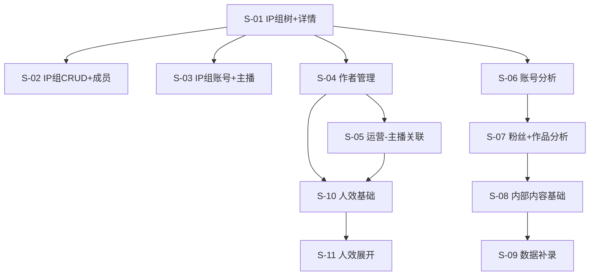

# SLICES-M1-运营管理

> **切片计划**：M1 运营管理（FR-M1-001 ~ FR-M1-007）
> **版本**：v1.0 | 2026-06-07
> **总切片数**：11 片
> **预估总工时**：约 14 人日
> **关联 PRD**：`docs/product/PRD-M1-运营管理.md`

---

## 1. 切片总览

| Slice | 目标 | 包含 FR | 依赖 | 工时(人日) | 优先级 |
|-------|------|--------|------|-----------|--------|
| **S-01** | IP 组树 + 详情骨架 | FR-M1-001（基础） | - | 1.5 | P0 |
| **S-02** | IP 组 CRUD + 成员管理 | FR-M1-001（成员部分） | S-01 | 1.5 | P0 |
| **S-03** | IP 组账号关联 + 主播关联 | FR-M1-001（账号/主播） | S-01 | 1.0 | P0 |
| **S-04** | 作者管理 + 主推号绑定 | FR-M1-002（基础） | S-01 | 1.5 | P0 |
| **S-05** | 运营→主播关联 | FR-M1-002（关联） | S-04 | 0.5 | P0 |
| **S-06** | 账号分析（Tab 切换 + 列表） | FR-M1-003 | S-01 | 1.0 | P0 |
| **S-07** | 粉丝分析 + 作品分析 | FR-M1-004 / FR-M1-005 | S-06 | 1.0 | P0 |
| **S-08** | 内部内容分析（基础） | FR-M1-006（基础） | S-07 | 1.0 | P0 |
| **S-09** | 数据补录功能（v9.1 新增） | FR-M1-006（补录） | S-08 | 2.0 | P0 |
| **S-10** | 人效盘点（基础列表） | FR-M1-007（基础） | S-04, S-05 | 1.0 | P0 |
| **S-11** | 人效盘点展开详情 | FR-M1-007（展开） | S-10 | 1.0 | P1 |

---

## 2. 依赖图



---

## 3. 切片详述

### S-01：IP 组树 + 详情骨架

**目标**：实现 IP 组树形结构展示、详情 Tab 框架（空数据）。

**包含**：

- 后端：`GET /ip-group/tree`、`GET /ip-group/{id}`（含统计聚合）
- 前端：树形组件 + 右侧 Tab 容器（基本信息/成员/账号/主播/统计）
- 数据：导入测试数据（5 大组、15 小组、50 成员、200 账号）

**不包含**：

- ❌ IP 组新建/编辑/删除（→ S-02）
- ❌ 成员/账号/主播配置（→ S-02, S-03）

**验收**：

- AC-M1-001-4 权限校验（看到树和 Tab 容器）
- 树加载 ≤ 500ms（200 节点内）
- 详情 Tab 切换流畅

**风险**：树的展开性能（>500 节点需懒加载）— 解决方案：默认折叠 + 异步加载子节点

---

### S-02：IP 组 CRUD + 成员管理

**目标**：完成 IP 组的增删改查、成员管理。

**包含**：

- 后端：`POST /ip-group/create`、`PUT /ip-group/update`、`DELETE /ip-group/delete`
- 后端：成员 4 个 API（list/create/update/delete）
- 前端：新建/编辑弹窗、删除二次确认、成员表格 + 增删改
- 校验：名称唯一性、组长存在性、删除保护

**依赖**：S-01

**验收**：

- AC-M1-001-1 新建大组
- AC-M1-001-2 名称重复
- AC-M1-001-3 删除受保护
- AC-M1-001-4 权限校验（新增/编辑/删除按钮置灰）

**风险**：删除保护逻辑需覆盖所有级联资源（成员/账号/主播）— 单元测试覆盖

---

### S-03：IP 组账号关联 + 主播关联

**目标**：账号与 IP 组关联、主播与 IP 组关联。

**包含**：

- 后端：`POST /ip-group/{id}/accounts`、`POST /ip-group/{id}/anchors`
- 前端：账号选择器、主播选择器（多选）
- 校验：账号唯一性、账号类型（仅 OFFICIAL_ACCOUNT 可作主推号）

**依赖**：S-01, S-04（账号数据）

**验收**：

- 账号"已属于其他 IP 组"提示 → 1007
- 大组下不可直接关联账号 → 1008

---

### S-04：作者管理 + 主推号绑定

**目标**：作者新建/编辑/删除、主推号绑定、看板入口。

**包含**：

- 后端：作者 5 个 API
- 前端：作者列表、弹窗、看板入口（看板页面 stub）
- 校验：IP 组必须为 SMALL、主推号类型校验、绑定唯一性

**依赖**：S-01

**验收**：

- AC-M1-002-1 新建作者
- AC-M1-002-2 IP 组类型校验
- AC-M1-002-3 运营→主播关联（S-05）

---

### S-05：运营→主播关联

**目标**：实现"运营人员 → 主播"的关联，含时间区间和重叠校验。

**包含**：

- 后端：`/ops-anchor/*` 5 个 API
- 前端：关联管理页（增删改）
- 校验：日期段不重叠 → 1201

**依赖**：S-04

**验收**：

- AC-M1-002-3
- 跨年/跨月日期段重叠检查

---

### S-06：账号分析（Tab 切换 + 列表）

**目标**：多平台 Tab 切换、账号列表、粉丝/作品详情入口。

**包含**：

- 后端：`GET /account-analysis/list`
- 前端：9 个平台 Tab、筛选区、表格、行内操作（查看粉丝/作品 → 跳转 S-07）
- 性能：列表分页 200 条 ≤ 1.5s

**依赖**：S-01

**验收**：

- AC-M1-003-1 Tab 切换
- AC-M1-003-2 粉丝详情跳转

---

### S-07：粉丝分析 + 作品分析

**目标**：粉丝趋势图 + 作品列表（爆款识别）。

**包含**：

- 后端：`/follower-analysis/*`、`/content-analysis/*` 全部 API
- 前端：粉丝 `#extra` 导出 + `statColSpan` 指标卡；作品 KPI 卡置顶、日期默认全部 + 快捷范围、详情趋势 7d 筛选
- 业务规则：BR-003 爆款判定

**依赖**：S-06

**验收**：

- AC-M1-004-1 趋势图
- AC-M1-004-2 导出
- AC-M1-005-1 爆款识别

---

### S-08：内部内容分析（基础）

**目标**：多平台 Tab、内部作品列表、不含补录。

**包含**：

- 后端：`GET /internal-content/list`、`GET /internal-content/{id}/trend`
- 前端：Tab 切换、筛选；列表日期默认空（全量），趋势抽屉默认 7 日
- 数据来源：API / IMPORT（（已替换为具体内容）

**依赖**：S-07

**验收**：基础列表可用

---

### S-09：数据补录功能（v9.1 新增）⭐

**目标**：v9.1 核心新增——实现完整的数据补录流程。

**包含**：

- 后端：
  - `POST /internal-content/import`（补录提交）
  - `GET /internal-content/import/list`（补录记录列表）
  - `GET /internal-content/import/{id}`（补录详情）
  - `PUT /internal-content/import/{id}/review`（审核）
- 后端：补录状态机（`STATE-M1-运营管理.md § 3`）
- 后端：`ContentDailyMergeService`（数据合并）
- 前端：
  - 作品列表新增"补录"按钮 + "数据来源"标签
  - 补录弹窗（表单 + 90 天校验）
  - "我的补录"页（待审核/已通过/已驳回 3 个 Tab）
  - 数据分析师"待审核列表"页 + 审核操作
- 数据库：`oa_content_data_import` 表新增
- 业务规则：BR-024（90 天限制）、状态机 5 个转移

**依赖**：S-08

**验收**：

- AC-M1-006-1 补录提交
- AC-M1-006-2 审核生效
- AC-M1-006-3 审核驳回
- AC-M1-006-4 时间窗口限制

**风险**：

- 补录与 API 数据冲突的处理（API 优先，详见 ADR-M1-001）
- 补录人/审核人权限严格隔离（补录人不能审自己的记录）

**特殊注意**：

- 此切片是 **v9.1 的核心新功能**，需重点测试
- 补录状态机需要 4 个转移路径全覆盖
- 数据合并逻辑（API 优先 vs IMPORT 覆盖）需要明确文档化

---

### S-10：人效盘点（基础列表）

**目标**：人效列表（不含展开）。

**包含**：

- 后端：`GET /productivity-review/list`
- 前端：人效列表（经办人、IP 组、完成率、ROI、产出）
- 计算：完成率 = completed / (completed + in_progress + overdue)

**依赖**：S-04, S-05

**验收**：列表可用，按周/月切换

---

### S-11：人效盘点展开详情

**目标**：经办人行内"+"展开 4 个 Card（任务/财务/内容/趋势）。

**包含**：

- 后端：`GET /productivity-review/detail/{userId}`、`GET /productivity-review/detail/anchors`
- 前端：展开行 + 4 个 Card + 趋势图

**依赖**：S-10

**验收**：

- AC-M1-007-1 展开详情
- AC-M1-007-2 时间维度切换

---

## 4. 切片执行顺序

### 4.1 推荐顺序（一期 P0 上线）

```
S-01 → S-02 → S-03 (并行: S-04 → S-05)
                  ↓
                 S-06 → S-07 → S-08 → S-09
                                ↓
                                S-10
                                ↓
                                S-11 (P1)
```

**关键路径**：S-01 → S-02 → S-04 → S-05 → S-10（人效依赖运营-主播关联）

### 4.2 资源分配（假设 2 个后端 + 1 个前端）

| 时间 | 后端 A | 后端 B | 前端 |
|------|--------|--------|------|
| 第 1 周 | S-01 | S-04 | S-01 |
| 第 2 周 | S-02 | S-05 | S-02 + S-04 |
| 第 3 周 | S-06 | S-03 + S-08 | S-05 + S-06 |
| 第 4 周 | S-07 | S-09（重点） | S-07 + S-08 |
| 第 5 周 | S-10 | S-09 收尾 | S-09（前端） |
| 第 6 周 | S-11 | - | S-10 + S-11 |

---

## 5. 切片实现 Prompt 模板（五段式）

> 每个 Slice 实现时使用以下 Prompt 模板（参考 `AI驱动产品开发方法论 § 6.2`）

```markdown
## 角色
你是本仓库的资深工程师，严格遵守规格，禁止 scope creep。

## 规格（唯一事实源，冲突以 Spec 为准）
@docs/product/PRD-M1-运营管理.md
@docs/product/UX-M1-运营管理.md
@docs/engineering/API-M1-运营管理.md
@docs/engineering/STATE-M1-运营管理.md
@docs/engineering/TECH-CONSTRAINTS.md

## 本次切片
- 实现：Slice-{N} {名称}
- 包含：{FR 列表}
- 明确不做：{Out of Scope + 本片不包含的项}

## 约束
1. 未在 Spec 中出现的 API/字段/页面/按钮不得新增
2. 若 Spec 不清晰，停止并列出「阻塞问题」，不要猜测
3. 只修改与本片相关的文件；改动前先说明计划
4. 完成后对照 @docs/delivery/CHECKLIST-M1-运营管理.md 自检

## 交付物
- 代码变更
- 自检结果（逐条 CHECKLIST）
- 已知问题与未覆盖 AC
```

---

## 6. 切片闸门

- 每片完成后，**先自检** `CHECKLIST-M1-运营管理.md`
- 再交**测试**（`TESTCASES-M1-运营管理.md`）
- 通过后才能进入下一片
- 不通过 → 开"修复 Slice"（仅限本片范围）

---

*下一步：基于本 SLICES 生成 CHECKLIST（`docs/delivery/CHECKLIST-M1-运营管理.md`）和 TESTCASES（`docs/delivery/TESTCASES-M1-运营管理.md`）。*


---

## 🔴 M1 全局规范补丁（2026-06-07）

> 本模块必须严格遵循 [`GLOBAL-CONVENTIONS.md`](../engineering/GLOBAL-CONVENTIONS.md) 的三大铁律。

### 三大铁律（必查）

#### 铁律一：关联属性必须用"选择器"，禁止手动填写

M1 中所有 `*_id` 字段必须通过选择器：

| 字段 | 选择器 |
|------|--------|
| `ip_group_id` | `<IpGroupTreeSelect />` |
| `parent_id` | `<IpGroupTreeSelect />` |
| `account_id` | `<AccountSelect />`（**强关联** ⭐，需从 M4 选择） |
| `author_id` | `<UserSelect />` |
| `assignee_id` | `<UserSelect />` |
| `anchor_user_id` | `<UserSelect />` |
| `ops_user_id` | `<UserSelect />` |
| `metric_id` | `<MetricSelect />` |

#### 铁律二：枚举属性（方式/状态/类型/平台）必须从数据字典选择

| 字段 | 字典 type |
|------|----------|
| `platform_type` | `dict_platform_type` |
| `account_type` | `dict_account_type` |
| `account_status` | `dict_account_status` |
| `ip_group_type` | `dict_ip_group_type` |
| `ip_group_status` | `dict_ip_group_status` |
| `author_type` | `dict_author_type` |
| `author_status` | `dict_author_status` |
| `content_type` | `dict_content_type` |
| `import_type` | `dict_content_import_type` |
| `data_source` | `dict_data_source` |
| `position` | `dict_position` |
| `is_primary` | `dict_yes_no` |
| `need_review` | `dict_yes_no` |
| `is_public` | `dict_yes_no` |

#### 铁律三：实体关系必须在 ER 图中明确

所有跨实体的关联已在 `PRD-M1-运营管理.md § 5 集成与数据` 中明确。

### 与 M4 账号管理的关键关联

M1 中所有平台账号必须通过 M4 的"实名人/手机/手机卡/公司"选择：

```
M1 IP 组 → M1 账号 → M4 实名人（强关联）
                     → M4 手机（强关联）
                     → M4 手机卡（强关联）
                     → M4 公司（强关联）
```

**校验**：
- 已停用实名人/手机/手机卡 不可被新账号引用（错误码 1501）
- 已绑定到其他账号的实名人/手机/手机卡 需"强制替换"（错误码 1502）
- 跨租户过滤（错误码 1504）

### 错误码

| 错误码 | 含义 |
|--------|------|
| 1500 | 关联的实体不存在 |
| 1501 | 关联的实体已停用/注销 |
| 1502 | 关联的实体已被其他记录引用 |
| 1503 | 字典值不合法 |
| 1504 | 跨租户访问禁止 |

详见 [`GLOBAL-CONVENTIONS.md § 5.3`](../engineering/GLOBAL-CONVENTIONS.md)

---

*补丁完成：M1 全套文档（M0/M1/M2/M3/M4/M5/M6/M7/M8/M9/M10）已统一遵循全局规范。*
