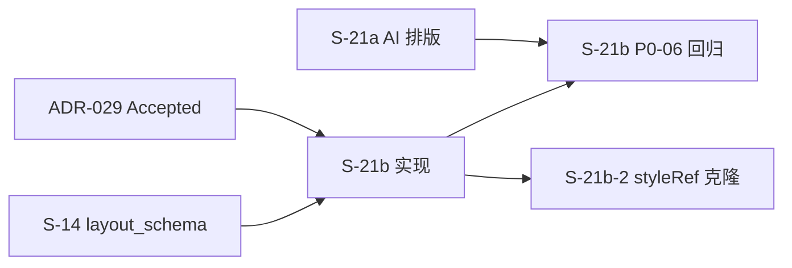

# SLICES-M2-S21b — Shenyu H5 资讯详情导入 Profile

> **Slice**：S-21b  
> **版本**：v1.0 | 2026-09-09  
> **状态**：**Approved / Ready**（ADR-029 Accepted；OQ-M2-013-01~05 已闭合；尚未实现、尚未通过 Gate）  
> **优先级**：P0  
> **预估工时**：3~4 人日  
> **关联 FR**：FR-M2-005（导入管线增量）  
> **Gate 边界**：M2 独立 Slice；**一片一会话**；不得据此宣称阶段 Gate 已通过

---

## 1. 目标与规格引用

修复 Shenyu H5 uni-app **资讯详情页** MHTML 导入时 generic 提取导致的错误 `layout_schema`（神鱼体育 template **12 / 17**），解除 ADR-028 `TEMPLATE_GUIDED` / ADR-027 一键排版对该模板的阻塞。

实现会话必须用 `@` 引用以下 SSOT：

- `@docs/adr/ADR-029-M2-Shenyu-H5导入Profile.md`
- `@docs/engineering/API-M2-Shenyu-H5导入增量.md`
- `@docs/delivery/SLICES-M2-S21b-Shenyu-H5导入Profile.md`
- `@docs/adr/ADR-019-M2-公推模板导入.md`（Job 模型）
- `@docs/adr/ADR-020-M2-公推模板版式套用语义.md`（schema v2）
- `@docs/adr/ADR-027-M2-版式资源工作台.md`（preview_html SSOT）
- `@docs/adr/ADR-028-M2-AI排版语义分段.md`（TEMPLATE_GUIDED 回归）

---

## 2. Scope / Out of Scope

### 2.1 In Scope（MVP · S-21b）

| # | 项 |
|---|-----|
| 1 | `importProfile` 请求字段 + `@InDict(dict_layout_import_profile)` |
| 2 | MHTML 自动推断 `SHENYU_H5_NEWS`（host + path + DOM 标记，ADR-029 §2.2） |
| 3 | `ShenyuH5NewsImportProfile`：P0~P6 root 选择器链、shell 剔除、毒性样式过滤、image 去重 |
| 4 | `POST /layout-template/import-mhtml`（multipart） |
| 5 | `import-paste` / `import-url` 可选 `importProfile` + `overwriteTemplateId`（URL **不**作 MVP 验收） |
| 6 | 可选 `POST /layout-template/{id}/re-extract` |
| 7 | `layout_schema` v2 归一化 + `extraction_report` 扩展 |
| 8 | 导入向导：推断 profile 展示、warnings、覆盖已有模板（12/17） |
| 9 | **原地 re-import** 覆盖 template 12/17（保留 id） |
| 10 | 字典 seed：`dict_layout_import_profile`、`dict_layout_template_source.MHTML` |
| 11 | P0 黄金样本 `神鱼体育.mhtml` + template 17 `TEMPLATE_GUIDED` 回归 |

### 2.2 Out of Scope（S-21b MVP）

| # | 项 |
|---|-----|
| 1 | 直连 `h5.shenyu.com` URL 抓取（MHTML only MVP） |
| 2 | 全页像素级 H5 clone / 独立渲染器 |
| 3 | Shenyu H5 方案详情、专家页等新 profile |
| 4 | ADR-028 AI 排版本体代码变更 |
| 5 | 批量全库 re-import 运维脚本 |

### 2.3 Phase 2 跟进（立项 · 非 S-21b DoD）

| Slice | 项 | 交付物 |
|-------|-----|--------|
| **S-21b-2** | styleRef → preview HTML 片段克隆 | merge/apply 时将 schema 块 `styleRef` 映射回 `preview_html` 对应 DOM 子树；保留赛事头、推荐区等装饰（ADR-027 §4.2 增强） |
| **S-21b-3**（可选） | Shenyu H5 URL 直连 | 稳定 `import-url` + 反爬/登录态策略 |

> S-21b-2 **已纳入路线图**（OQ-M2-013-05），不得静默无限 defer；S-21b 完成后可独立开 Slice。

---

## 3. DoD

- [ ] ADR-029 §3.1 全部 In Scope 项实现
- [ ] `神鱼体育.mhtml`：`frame(image)` = 正文去重图数（≠11）；`style_css` 非空；`preview_html` 无 `zp-paging`
- [ ] re-import template 12/17：id 不变、`profileUsed=SHENYU_H5_NEWS`
- [ ] TC-M2-013-P0-01~06（API 增量 §7）100%
- [ ] S-21a TC-M2-013-P0-06：`TEMPLATE_GUIDED` + template 17 回归绿
- [ ] 字典 seed 通过 SeedVerificationIT
- [ ] `@PreAuthorize`、tenant_id、1503/1504/2043~2045 错误码符合 Spec
- [ ] 未实现 §2.2、未宣称 Gate 通过

---

## 4. 文件范围（计划）

### 4.1 后端（计划）

| 类型 | 路径模式 |
|------|----------|
| Profile 策略 | `.../service/content/import/ShenyuH5NewsImportProfile.java`（或 `LayoutImportProfile` 实现） |
| 提取入口 | 扩展 `LayoutImportExtractor`、`WechatArticleHtmlFetcher`（generic 不变） |
| Controller | `WechatLayoutTemplateController` — `import-mhtml`、`re-extract` |
| DTO | `LayoutTemplateImportMhtmlReq`、`LayoutTemplateReExtractReq`、`ExtractionReport` 扩展 |
| 错误码 | OPS 内容模块 2043~2045 |
| 测试资源 | `src/test/resources/fixtures/神鱼体育.mhtml` |
| 单测/IT | `ShenyuH5NewsImportProfileTest`、`LayoutImportMhtmlIT` |

### 4.2 前端（计划）

| 类型 | 路径 |
|------|------|
| 导入向导 | 公推模板库导入 MHTML 分支、`importProfile` 展示/覆盖、`overwriteTemplateId` |

### 4.3 SQL / seed

| 交付 | 说明 |
|------|------|
| `dict_layout_import_profile` | GENERIC_HTML / WECHAT_MP_ARTICLE / SHENYU_H5_NEWS |
| `dict_layout_template_source.MHTML` | 与 import-mhtml 同批 Flyway |

### 4.4 文档（实施后回填）

- `TESTCASES-M2-Shenyu-H5导入增量.md`（若尚未创建，实现前补 P0 草案）
- `CHECKLIST-M2-Shenyu-H5导入增量.md`（可选）

---

## 5. 测试大纲

| ID | 场景 | 层 |
|----|------|-----|
| TC-M2-013-P0-01 | `神鱼体育.mhtml` → 自动 `SHENYU_H5_NEWS` | IT |
| TC-M2-013-P0-02 | image 帧数 = 正文去重图数 | 单测 |
| TC-M2-013-P0-03 | `style_css` 非空；无毒性 `display:none` in schema | 单测 |
| TC-M2-013-P0-04 | 剔除 root 后 → 2043 | IT |
| TC-M2-013-P0-05 | re-extract template 17，id 不变 | IT |
| TC-M2-013-P0-06 | template 17 + TEMPLATE_GUIDED preview 回归 | IT/E2E |
| TC-M2-013-P0-07 | fallback P4 `uni-page-body .w-92vw`（合成 HTML fixture） | 单测 |
| TC-M2-013-P0-08 | `dict_layout_template_source.MHTML` seed 可读 | SeedVerificationIT |

---

## 6. 依赖与顺序

1. 确认 ADR-029 Accepted ✅  
2. 实现 S-21b → re-import 12/17  
3. 跑 S-21a `TEMPLATE_GUIDED` 回归  
4. S-21b Gate 通过后，可启动 **S-21b-2**

---

## 7. 当前声明

本文件表示 **S-21b 已批准且可进入实现前检查**，不表示代码已实现、P0 已通过，也不表示任何阶段 Gate 已通过。

---

*Approved / Ready · 2026-09-09*
