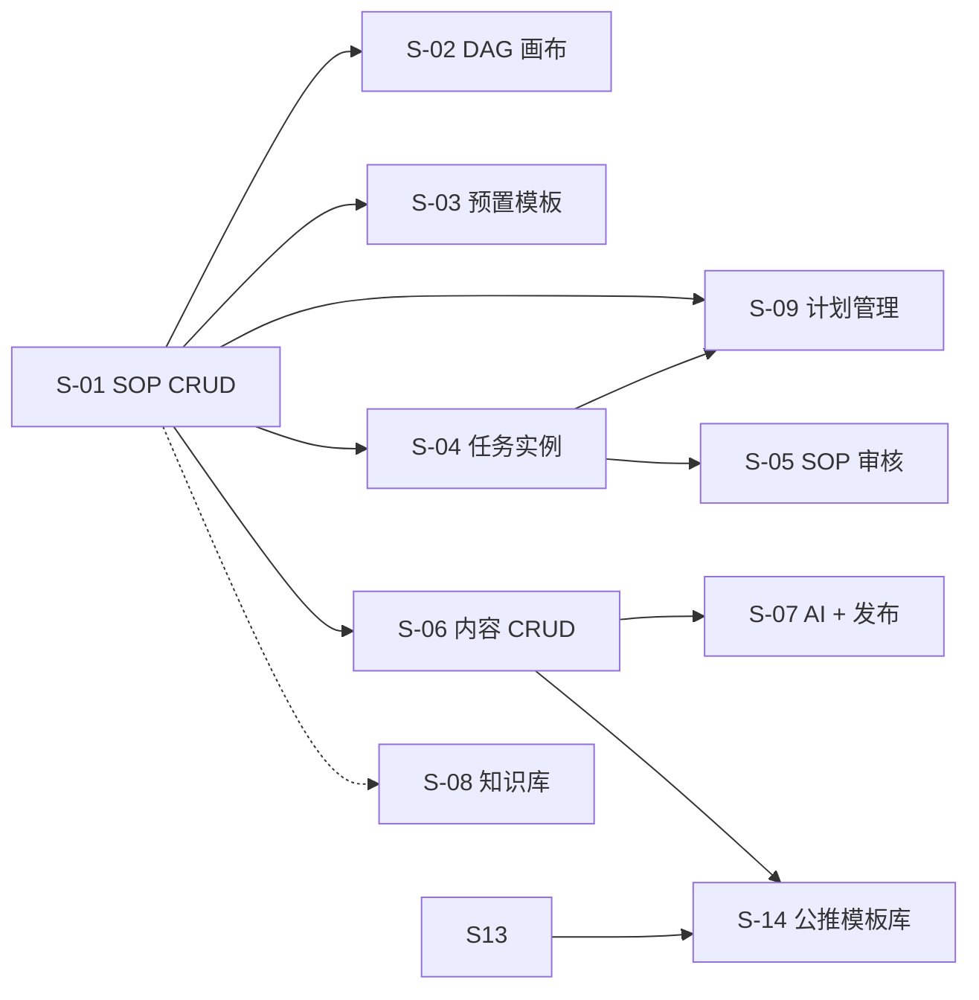

# SLICES-M2-内容生产

> **切片计划**：M2 内容生产
> **版本**：v1.4 | 2026-07-12
> **总切片数**：20 片（S-01~S-15 + **S-16~S-19 FR-M2-010** + **S-20 FR-M2-011 amphipoda 对齐**）| 预估总工时：约 59~61 人日

---

## 1. 切片总览

| Slice | 目标 | 包含 FR | 依赖 | 工时 | 优先级 |
|-------|------|--------|------|------|--------|
| S-01 | SOP 模板 CRUD | FR-M2-001 (1/2) | - | 2.0 | P0 |
| S-02 | SOP 节点编辑（DAG 画布） | FR-M2-001 (2/2) | S-01 | 4.0 | P0 |
| S-03 | 预置 SOP 模板初始化 | FR-M2-001 (初始化) | S-01 | 1.0 | P0 |
| S-04 | 任务实例 + 状态机 | FR-M2-002 (1/2) | S-01 | 3.0 | P0 |
| S-05 | SOP 审核流 | FR-M2-001 (3/3) + FR-M2-002 (2/2) | S-04 | 2.0 | P0 |
| S-06 | 内容 CRUD + 三级审核 | FR-M2-003 (1/2) | S-01 | 3.0 | P0 |
| S-07 | AI 辅助创作 + 自动发布 | FR-M2-003 (2/2) | S-06 | 3.0 | P1 |
| S-08 | 知识库 | FR-M2-004 | - | 2.0 | P1 |
| S-09 | 计划管理 + 任务联动 | FR-M2-009 | S-01, S-04 | 2.0 | P0 |
| S-10 | SOP 节点类型 | FR-M2-001（node_type） | S-02 | 1.0 | P0 |
| S-11 | 计划步骤分配赛事 | FR-M2-009（步骤 competition） | S-09 | 1.5 | P0 |
| S-12 | 任务执行页 + 任务-内容关联 | FR-M2-002（执行页） | S-04, S-10, S-11 | 3.0 | P0 |
| S-13 | 任务驱动内容编辑 + AI 生成 | FR-M2-003（模式 B） | S-12, M8-S-05 | 4.0 | P0 |
| **S-14** | **公推模板库 + 富版式正文** | **FR-M2-005** | **S-06, S-13, ADR-019** | **6.0** | **P0** |
| **S-15** | **AI 内容对话生成抽屉** | **PRD-AI-内容生成 P0** | **S-06, M8, ADR-053** | **4.0** | **P0** |
| **S-16** | **工作任务 Schema + 字典 + 菜单** | **FR-M2-010（基础）** | **ADR-071/072 Accepted** | **1.5** | **P0** |
| **S-17** | **工作任务登记后端 + Tab1** | **FR-M2-010-1/3** | **S-16** | **3.5** | **P0** |
| **S-18** | **工作任务矩阵 + 统计** | **FR-M2-010-2** | **S-17** | **2.0** | **P0** |
| **S-19** | **红黑赛后 Job + 人工改判** | **FR-M2-010-4** | **S-17, ADR-072** | **2.0** | **P0** |
| **S-20** | **内容编辑 amphipoda 玩法 + matchScheme + jingcai N 场** | **FR-M2-011** | **S-06, S-15, ADR-054, ADR-076** | **8~10** | **P0** |
| **S-21a** | **AI 排版：语义分段 + 确定性 Football 模板决策** | **FR-M2-012** | **S-14c, S-15~17, M8, ADR-028** | **6~8** | **P0** |
| **S-21b** | **Shenyu H5 资讯详情导入 Profile（神鱼体育 12/17）** | **FR-M2-005** | **S-14, ADR-029, S-21a 回归** | **3~4** | **P0** |
| **S-22** | **工作任务 confirm 钉钉提醒执行人** | **FR-M2-010-6 / ADR-078** | **S-17, ADR-026** | **0.5** | **P0** |
| **S-23** | **任务完成工作说明与内容审核通过门禁** | **FR-M2-002 / ADR-079** | **S-12** | **0.5** | **P0** |
| **S-24** | **节点名称=SOP 节点名；执行页登记备注与隐藏 SLA** | **FR-M2-010 / ADR-080** | **S-12, S-17** | **0.5** | **P0** |

> S-20 详述见 [`SLICES-M2-S20-amphipoda对齐.md`](./SLICES-M2-S20-amphipoda对齐.md)（**一片一会话**；仅改 OPS 前后端）。
>
> S-21a 已批准，详述见 [`SLICES-M2-S21a-AI排版.md`](./SLICES-M2-S21a-AI排版.md)（**Approved / Ready**；不表示已实现或阶段 Gate 已通过）。
>
> S-21b 已批准，详述见 [`SLICES-M2-S21b-Shenyu-H5导入Profile.md`](./SLICES-M2-S21b-Shenyu-H5导入Profile.md)（**Approved / Ready**；ADR-029 Accepted；解除 template 12/17 导入 SSOT）。

---

## 2. 依赖图

```mermaid
graph LR
    S01[S-01 SOP CRUD] --> S02[S-02 DAG 画布]
    S01 --> S03[S-03 预置模板]
    S01 --> S04[S-04 任务实例]
    S01 --> S09[S-09 计划管理]
    S04 --> S09
    S01 --> S06[S-06 内容 CRUD]
    S04 --> S05[S-05 SOP 审核]
    S06 --> S07[S-07 AI + 发布]
    S06 --> S14[S-14 公推模板库]
    S13 --> S14
    S01 -.-> S08[S-08 知识库]
```

---

## 3. 切片详述

### S-01 SOP 模板 CRUD

**包含**：
- 后端：5 个 API（list/create/update/delete/activate）
- 前端：列表页 + 新增/编辑弹窗
- 数据：`oa_sop_template` 表

**全局规范**：
- 状态 `status` 用 `<DictSelect dict-type="dict_yes_no" />`（或自定义）
- `content_type` / `platform_type` 用 `<DictSelect />`

**验收**：AC-M2-001-3, AC-M2-001-4

---

### S-02 SOP 节点编辑（DAG 画布）

**包含**：
- 后端：节点 CRUD + `validate-dag` API
- 前端：基于 `@antv/x6` 或 `vue-flow` 实现 DAG 画布
- 业务：拓扑排序检测环

**全局规范**：
- `executor_role` / `reviewer_role` 必须 `<DictSelect dict-type="dict_position" />`
- `need_review=1` → `reviewer_role` 必填（前端联动校验）

**验收**：AC-M2-001-1, AC-M2-001-2, AC-M2-001-4

---

### S-03 预置 SOP 模板初始化

**包含**：
- `db/init_sop.sql`：插入"标准内容生产运营流程"（14 节点）

**验收**：AC-M2-001-3

---

### S-04 任务实例 + 状态机

**包含**：
- 后端：5 个 API（list/my-tasks/start/complete/submit-review）
- 前端：任务列表 + 详情
- 业务：状态机实现、DAG 顺序激活、并行组

**全局规范**：
- `status` / `executor_role` 用 `<DictSelect />`

**验收**：AC-M2-002-1, AC-M2-002-2, AC-M2-002-4

---

### S-05 SOP 审核流

**包含**：
- 后端：`/sop/review/pending`、`/approve`、`/reject`
- 前端：待审核列表 + 审核弹窗
- 钉钉通知（v1.0 用 @Async 异步；v2.0 改推送）

**全局规范**：
- 审核人必须岗位匹配

**验收**：AC-M2-001-5（节点审核）、AC-M2-002-4（任务审核驳回）

---

### S-06 内容 CRUD + 三级审核

**包含**：
- 后端：5 个 API（list/create/update/submit-review/review）
- 前端：列表 + 编辑器 + 审核页
- 状态机：三级审核串行

**全局规范（🔴 重点）**：
- `accountId` 必须 `<AccountSelect :platformType="..." />`（联动）
- `platformType` / `contentType` 用 `<DictSelect />`
- 后端校验：`account.platformType == content.platformType`

**验收**：AC-M2-003-1, AC-M2-003-2, AC-M2-003-3, AC-M2-003-4

---

### S-07 AI 辅助创作 + 自动发布

**包含**：
- 后端：`/content/ai-generate`（SSE 流式）+ 终审后 `@Async` 发布
- 前端：AI 弹窗 + 流式显示
- 第三方：调 AI API（v1.0 简化为 mock）

**验收**：AC-M2-003-4, AC-M2-003-5

---

### S-08 知识库

**包含**：
- 后端：4 个 API（list/create/update/search）
- 前端：列表 + 详情 + 富文本编辑器
- 业务：公开/私有 + 标签搜索

**全局规范**：
- `isPublic` 用 `<DictSelect dict-type="dict_yes_no" />`
- `category` v1.0 用固定值，v2.0 改字典（**开 ADR**）

**验收**：AC-M2-004-1, AC-M2-004-2, AC-M2-004-3

---

### S-09 计划管理

**包含**：
- 后端：8 个 API（list/get/create/start/terminate/approve/reject/delete）— `ContentPlanController`
- 前端：列表 + 新增弹窗 + 详情抽屉 — `plan/index.vue`
- 数据：`oa_content_plan` / `_competition` / `_step`；`oa_task` 扩展 `plan_id`、`visible_in_list`
- 业务：草稿任务隐藏、启动可见、组长终止审批（ADR-012）
- 赛事：外部 API 经 `MatchController` 代理（**BLK-M2-004 已决**）；前端 `MatchSelectDialog.vue`

**全局规范**：
- `templateId` / `ipGroupIds`（或兼容 `ipGroupId`，见 ADR-070）/ `assigneeIds` 强制选择器
- `status` 用 `<DictSelect dict-type="dict_plan_status" />`

**验收**：AC-M2-009-1, AC-M2-009-2, AC-M2-009-3  
**测试**：`M2PlanS09IT`

---

### S-10 SOP 节点类型（需求 2）

**包含**：
- 字典 `dict_sop_node_type` 三值（ADR-016）
- 后端：SopNode CRUD 增 `nodeType` 校验
- 前端：属性面板 `<DictSelect dict-type="dict_sop_node_type" />`

**阻塞**：无（可与 S-02 合并实现）

**验收**：AC-M2-001-6

---

### S-11 计划步骤分配赛事（需求 3）

**包含**：
- DB：`oa_content_plan_step.competition_id`、`oa_task.competition_id`
- 后端：计划 create/update 校验 step.competitionId ∈ plan.competitions
- 前端：步骤表增赛事列 `<Select />`（计划赛事池）

**阻塞**：~~**BLK-M2-004**~~（已决：外部赛事 API 代理 + 选择器）

**验收**：AC-M2-009-4

---

### S-12 任务执行页（需求 4–5）

**包含**：
- 后端：GET `/task/{id}/execute`、POST `execute/complete`；`oa_content.task_id`
- 前端：P-M2-012 + 我的任务「执行」按钮；内容生成节点跳转带参
- 业务：完成门禁 ADR-079（1500；取代 2008 / COMPLETED）

**阻塞**：**BLK-M2-007**（附件）、**BLK-M2-008**（执行说明）、**BLK-M2-009**（发布节点）

**验收**：AC-M2-002-5, AC-M2-002-6, AC-M2-002-7

---

### S-23 任务完成门禁（ADR-079）

**包含**：
- 后端：`complete` / `execute/complete` / SOP `submit-review` 共用校验
- 前端：列表 + 执行页工作说明；内容生成「提交审核」复用内容 API
- **不**改 ADR-077 jingcai

**验收**：AC-M2-002-6~9、AC-M2-010-16

---

### S-24 节点名称与执行页登记备注（ADR-080）

**包含**：
- 后端：`TaskVO`/`TaskExecuteVO.nodeName` = `oa_sop_node.node_name`；execute VO read-through 登记行备注四字段
- 前端：执行页隐藏 SLA；展示营销计划 / 是否直播 / 直播时间 / 销售平台
- **不**改 `plan_name` 格式（ADR-077 D5）；**不**改 ADR-079 门禁；**无** Flyway

**验收**：AC-M2-002-10、AC-M2-010-17、AC-M2-010-18

---

### S-25 内容列表批量操作（ADR-081）

**包含**：
- 前端：勾选 + 批量删除 / 提交审核 / 转知识库；串行现有单条 API
- **不**新增批量后端路径

**验收**：AC-M2-003-13

---

### S-13 任务驱动内容编辑（需求 6）

**包含**：
- 字典 `dict_document_type`；`dict_content_status` +COMPLETED
- 后端：content create 扩展字段；`/confirm`；`/script-ref`；AI 生成扩展（占位）
- 前端：P-M2-007 模式 B（IP 组/作者/文档类型/生成/确认）
- 依赖：M8 提示词（**BLK-M2-005**）、AI 视频（**BLK-M2-010**）

**验收**：AC-M2-003-6 ~ AC-M2-003-10

---

### S-14 公推模板库 + 富版式正文（草案 · 待 ADR-019 Accept）

**包含**：

| 层 | 交付物 |
|----|--------|
| DB | `oa_wechat_layout_template`；`oa_production_content` 增 `body_format` / `layout_json` / `layout_html` / `layout_template_id`；可选 `oa_layout_import_job`；Flyway V77+ |
| 字典 | `dict_content_body_format` · `dict_layout_template_status` · `dict_layout_template_source` |
| 后端 | `LayoutTemplateController`：list/get/create/update/delete/select-list · import-url/docx/paste · import-job · `POST /content/{id}/apply-layout-template` |
| 前端 | P-M2-013 列表 · P-M2-014 导入向导 · P-M2-015 编辑 · `LayoutEditor` / `LayoutViewer` · `ContentEditPanel` 集成 |
| 组件 | `LayoutTemplateSelectDialog`（强关联选择器） |

**建议分期（若 BLK 未闭合）**：

| 子阶段 | 范围 | 前置 |
|--------|------|------|
| S-14a | 模板 CRUD + 手动块编辑 + 应用模板 + 查看/审核渲染 | BLK-M2-015 编辑器选型 |
| S-14b | import-paste（HTML Fallback） | S-14a |
| S-14c | import-docx 异步 Job | BLK-M2-013/014 |
| S-14d | import-url | BLK-M2-012 |

**阻塞**：**BLK-M2-012** · **BLK-M2-014** · **BLK-M2-015** · **OQ-M2-021**

**验收**：AC-M2-005-1 ~ AC-M2-005-7

**测试**：`M2LayoutTemplateS14IT`（P0）；E2E 应用模板 → 提交审核 → 审核页渲染

**DoD**：
- CHECKLIST-M2 §S-14 100%
- TESTCASES-M2 P0 100%
- ADR-019 **Accepted**
- 不跨 Slice 改无关模块

---

### S-15 AI 内容对话生成抽屉

**包含**：
- 后端：`/admin-api/oa/ai-content/*` 五端点（ADR-053）
- 迁移 V139：`dict_scheme_type`、`dict_anchor_style`、`scheme_type` 列、会话/采纳表
- 前端：`AiContentDrawer.vue` 720px 抽屉 + `useAiContentSession` + `api/aiContent.ts`
- `ContentEditPanel`：方案类型字段；「生成」打开抽屉（替代旧 ai-generate 弹窗）

**验收**：`docs/内容生成/PRD.md` R-001 ~ R-010（P0 子集）

**依赖**：S-06 · M8 模型配置 · ADR-053

---

*下一步：CHECKLIST + TESTCASES。*

---

## 全局规范引用

> 本切片文档遵循 [`GLOBAL-CONVENTIONS.md`](../engineering/GLOBAL-CONVENTIONS.md) 中定义的全局规范：
> - 强关联属性 → 5 类选择器组件（RealNameSelect / PhoneSelect / SimCardSelect / CompanySelect / AccountSelect）
> - 枚举属性 → 统一从数据字典（`dict_*`）选择
> - 跨租户 + 状态校验 → 错误码 1500-1504
> - 数据安全 → 敏感字段脱敏展示，凭证类字段 AES-256 加密存储
> - 详见 [`GLOBAL-CONVENTIONS.md § 1`](../engineering/GLOBAL-CONVENTIONS.md) (铁律)、[`§ 2`](../engineering/GLOBAL-CONVENTIONS.md) (字典)

---

## AC 映射表（验收条件）

每个 Slice 都对应 PRD 中的一个或多个 AC（Acceptance Criteria），保证可追溯。

| Slice ID | 关联 AC | 标题 | 估时 |
|----------|---------|------|------|
| S-09 | AC-M2-009-1~3 | 计划管理-任务联动 | 2d |
| S-10 | AC-M2-001-6 | SOP 节点类型 | 1d |
| S-11 | AC-M2-009-4 | 步骤分配赛事 | 1.5d |
| S-12 | AC-M2-002-5~7 | 任务执行页 | 3d |
| **S-23** | **AC-M2-002-6~9 / AC-M2-010-16** | **任务完成门禁 ADR-079** | **0.5d** |
| **S-24** | **AC-M2-002-10 / AC-M2-010-17~18** | **节点名与执行页登记备注 ADR-080** | **0.5d** |
| S-13 | AC-M2-003-6~10 | 任务驱动内容编辑 | 4d |
| **S-14** | **AC-M2-005-1~7** | **公推模板库** | **6d** |
| **S-15** | **PRD-AI-内容生成 R-001~R-010** | **AI 对话生成抽屉** | **4d** |
| **S-21a** | **AC-M2-012-1~15、17、19~20** | **AI 排版（styleHints AC-16/18 为 Phase 1.5+）** | **6~8d** |
| **S-21b** | **FR-M2-005 导入增量 / ADR-029** | **Shenyu H5 MHTML 导入 Profile + 12/17 re-import** | **3~4d** |
| S-04 | AC-M2-002-1~4 | SOP 任务状态机 | 3d |
| S-06 | AC-M2-003-1~4 | 内容三级审核 | 3d |
| S-08 | AC-M2-004-1~3 | 知识库 | 2d |

### 估算单位
- `d` = 人天（1 人 = 8 小时）
- 总估时 = sum of all slices

### 与测试用例的映射
每个 AC 对应 [`TESTCASES-*.md`](../delivery/) 中的 TC-F-* 用例。
