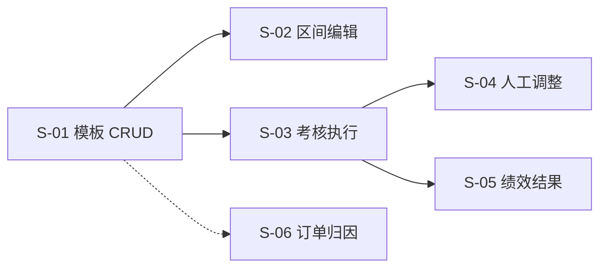

# SLICES-M3-绩效核算

> **切片计划**：M3 绩效核算
> **版本**：v1.0 | 2026-06-07
> **总切片数**：6 片 | 预估总工时：约 15 人日

---

## 1. 切片总览

| Slice | 目标 | 包含 FR | 依赖 | 工时 | 优先级 |
|-------|------|--------|------|------|--------|
| S-01 | 考核模板 CRUD | FR-M3-001 (1/2) | - | 2.0 | P0 |
| S-02 | 区间编辑器 | FR-M3-001 (2/2) | S-01 | 2.0 | P0 |
| S-03 | 考核执行（自动算分） | FR-M3-002 (1/2) | S-01 | 4.0 | P0 |
| S-04 | 人工调整 | FR-M3-002 (2/2) | S-03 | 1.0 | P0 |
| S-05 | 绩效结果（趋势） | FR-M3-003 | S-03 | 3.0 | P0 |
| S-06 | 订单归因 + ROI | FR-M3-004 | - | 3.0 | P0 |

---

## 2. 依赖图

---

## 3. 切片详述

### S-01 考核模板 CRUD

**包含**：
- 后端：5 个 API（list/create/update/activate/items）
- 前端：列表 + 弹窗
- 业务：每岗位仅 1 个 ACTIVE 模板

**全局规范**：
- `position` 用 `<DictSelect dict-type="dict_position" />`
- `isActive` 用 `<DictSelect dict-type="dict_yes_no" />`
- `metricId` 用 `<MetricSelect />`

**验收**：AC-M3-001-1, AC-M3-001-5

---

### S-02 区间编辑器

**包含**：
- 前端：区间可视化编辑器
- 校验：权重合计 100%、区间无 gap、无重叠

**验收**：AC-M3-001-2, AC-M3-001-3, AC-M3-001-4

---

### S-03 考核执行（自动算分）

**包含**：
- 后端：6 个 API（list/create/calculate/adjust/detail/confirm）
- 前端：列表 + 详情
- 业务：自动算分逻辑、状态机

**全局规范**：
- `targetUserId` 用 `<UserSelect />`
- `periodType` 用 `<DictSelect dict-type="dict_perf_period" />`
- 周期内单条记录校验

**验收**：AC-M3-002-1, AC-M3-002-2, AC-M3-002-5, AC-M3-002-6

---

### S-04 人工调整

**包含**：
- 前端：调整弹窗
- 后端：调整幅度 ±20% 校验

**验收**：AC-M3-002-3, AC-M3-002-4

---

### S-05 绩效结果（趋势）

**包含**：
- 后端：3 个 API（list/trend/export）
- 前端：列表 + 趋势图
- 权限：个人/部门/全部

**验收**：AC-M3-003-1, AC-M3-003-2, AC-M3-003-3

---

### S-06 订单归因 + ROI

**包含**：
- 后端：3 个 API（list/roi/export）
- 前端：归因列表 + ROI 卡片

**全局规范**：
- `ipGroupId` 用 `<IpGroupTreeSelect />`
- `accountId` 用 `<AccountSelect />`

**验收**：AC-M3-004-1, AC-M3-004-2, AC-M3-004-3

---

*下一步：CHECKLIST + TESTCASES。*

---

## 全局规范引用

> 本切片文档遵循 [`GLOBAL-CONVENTIONS.md`](../engineering/GLOBAL-CONVENTIONS.md) 中定义的全局规范：
> - 强关联属性 → 5 类选择器组件（RealNameSelect / PhoneSelect / SimCardSelect / CompanySelect / AccountSelect）
> - 枚举属性 → 统一从数据字典（`dict_*`）选择
> - 跨租户 + 状态校验 → 错误码 1500-1504
> - 数据安全 → 敏感字段脱敏展示，凭证类字段 AES-256 加密存储
> - 详见 [`GLOBAL-CONVENTIONS.md § 1`](../engineering/GLOBAL-CONVENTIONS.md) (铁律)、[`§ 2`](../engineering/GLOBAL-CONVENTIONS.md) (字典)

---

## AC 映射表（验收条件）

每个 Slice 都对应 PRD 中的一个或多个 AC（Acceptance Criteria），保证可追溯。

| Slice ID | 关联 AC | 标题 | 估时 |
|----------|---------|------|------|
| S-M3-01 | AC-M3-01 | 绩效规则配置（权重/阈值） | 1d |
| S-M3-02 | AC-M3-02 | 绩效计算引擎（指标+规则） | 2d |
| S-M3-03 | AC-M3-03 | 绩效查询（按作者/时间/等级） | 1d |

### 估算单位
- `d` = 人天（1 人 = 8 小时）
- 总估时 = sum of all slices

### 与测试用例的映射
每个 AC 对应 [`TESTCASES-*.md`](../delivery/) 中的 TC-F-* 用例。
