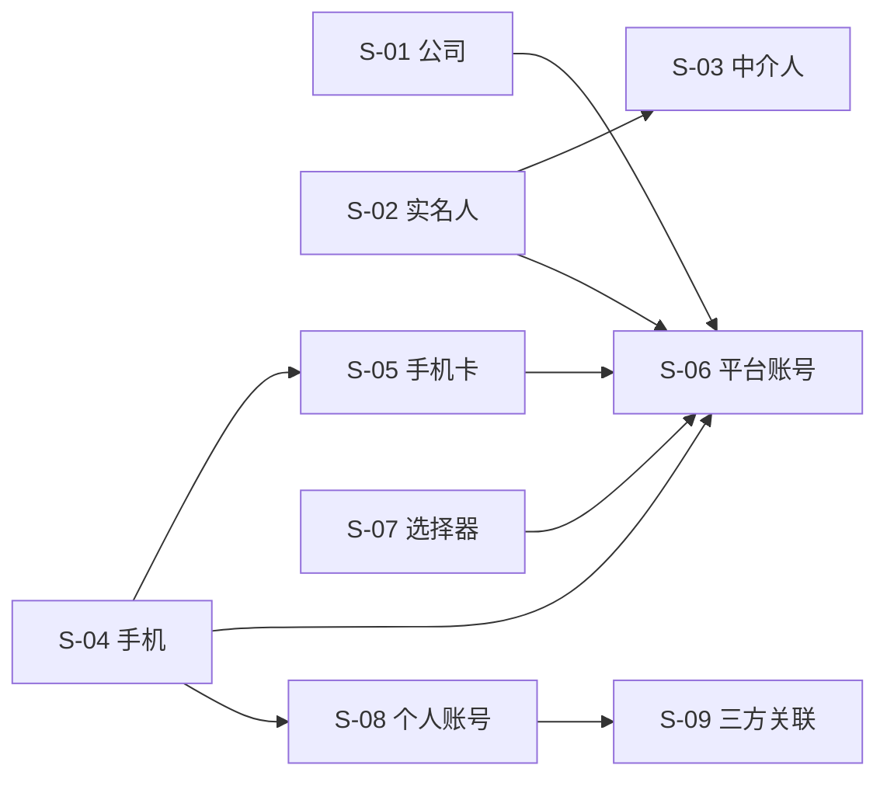

# SLICES-M4-账号管理

> **切片计划**：M4 账号管理（核心模块）
> **版本**：v1.0 | 2026-06-07
> **总切片数**：9 片 | 预估总工时：约 28 人日
> **🔴 关键**：强关联 + 数据字典 + 加密

---

## 1. 切片总览

| Slice | 目标 | 包含 FR | 依赖 | 工时 | 优先级 |
|-------|------|--------|------|------|--------|
| S-01 | 公司管理 + 公众号容量 | FR-M4-001 | - | 2.0 | P0 |
| S-02 | 实名人 CRUD + 加密 | FR-M4-002 (1/2) | - | 3.0 | P0 |
| S-03 | 中介人 | FR-M4-002 (2/2) | S-02 | 2.0 | P0 |
| S-04 | 手机管理 | FR-M4-003 | - | 1.5 | P0 |
| S-05 | 手机卡管理 + 跨平台聚合 | FR-M4-004 | S-04 | 4.0 | P0 |
| S-06 | **平台账号 CRUD + 强关联** | FR-M4-005 (1/2) | S-01/02/04/05 | 6.0 | P0 |
| S-07 | **强关联选择器组件库** | FR-M4-005 (1/2) | S-06 | 2.0 | P0 |
| S-08 | 个人账号（个微/企微） | FR-M4-006 | S-04 | 3.0 | P0 |
| S-09 | 三方关联 | FR-M4-007 | S-08 | 1.5 | P1 |

---

## 2. 依赖图

---

## 3. 切片详述

### S-01 公司管理 + 公众号容量

**包含**：
- 后端：5 个 API（list/create/update/delete/expand/mp-stats）
- 前端：列表 + 详情
- 业务：公众号容量自动统计、扩容

**全局规范**：
- `status` 用 `<DictSelect dict-type="dict_company_status" />`

**验收**：AC-M4-001-1, AC-M4-001-2, AC-M4-001-3, AC-M4-001-4

---

### S-02 实名人 CRUD + 加密

**包含**：
- 后端：4 个 API（list/create/update/delete）
- 前端：列表 + 详情
- 业务：AES-256 加密、字段脱敏

**全局规范**：
- `idType` / `gender` / `status` 用 `<DictSelect />`
- 敏感字段脱敏

**验收**：AC-M4-002-1, AC-M4-002-3, AC-M4-002-4

---

### S-03 中介人

**包含**：
- 后端：4 个 API（list/create/update/delete）
- 前端：中介人列表 + 弹窗
- 业务：1 对多、佣金脱敏

**验收**：AC-M4-002-2, AC-M4-002-5

---

### S-04 手机管理

**包含**：
- 后端：4 个 API（list/create/update/delete）
- 前端：列表
- 业务：phone_number 唯一

**验收**：AC-M4-003-1, AC-M4-003-2

---

### S-05 手机卡 + 跨平台聚合（⭐）

**包含**：
- 后端：4 个 API + `linked-accounts` 接口
- 前端：列表 + 跨平台详情侧滑
- 业务：跨平台账号聚合查询

**全局规范**：
- `operator` / `isPrimary` / `status` 用 `<DictSelect />`
- `assignedUserId` 用 `<UserSelect />`

**验收**：AC-M4-004-1, AC-M4-004-2, AC-M4-004-3, AC-M4-004-4

---

### S-06 平台账号 CRUD + 强关联（⭐⭐）

**包含**：
- 后端：5 个 API（list/create/update/delete/replace）
- 前端：列表 + 详情 + 编辑弹窗
- 业务：**强关联校验、强制替换、AES-256、跨租户**

**🔴 关键全局规范**：
- `companyId` 用 `<CompanySelect />`
- `realnameId` 用 `<RealNameSelect />`
- `phoneId` 用 `<PhoneSelect />`
- `simCardId` 用 `<SimCardSelect />`
- `intermediaryId` 用 `<RealNameSelect />`
- `ipGroupId` 用 `<IpGroupTreeSelect />`
- `platformType` / `accountType` / `status` 用 `<DictSelect />`
- 后端强校验：跨租户、已停用、已引用
- 强制替换：弹窗 + reason

**验收**：AC-M4-005-1 ~ AC-M4-005-12 全部

---

### S-07 强关联选择器组件库（🔴 共用）

**包含**：
- 前端：5 个共用组件
  - `<RealNameSelect />` `<PhoneSelect />` `<SimCardSelect />` `<CompanySelect />` `<AccountSelect />`
- 通用：禁用手动输入、跨租户过滤、停用过滤、远端搜索、显示"名称+标识"

**关键**：
- **禁用**手 input（`<input :readonly="true" />` 或 `<el-select :filterable="true" />`）
- 已停用实名人/手机 不可选
- 跨租户实名人 不可见

**验收**：S-07 自检 10 条

---

### S-08 个人账号（个微/企微）

**包含**：
- 后端：4 个 API
- 前端：列表 + 详情（奥创只读区域）
- 业务：奥创凭证脱敏、企微凭证加密

**验收**：AC-M4-006-1, AC-M4-006-2, AC-M4-006-3

---

### S-09 三方关联

**包含**：
- 后端：3 个 API（create/query/graph）
- 前端：图谱展示

**验收**：AC-M4-007-1, AC-M4-007-2, AC-M4-007-3

---

*下一步：CHECKLIST + TESTCASES。*

---

## 全局规范引用

> 本切片文档遵循 [`GLOBAL-CONVENTIONS.md`](../engineering/GLOBAL-CONVENTIONS.md) 中定义的全局规范：
> - 强关联属性 → 5 类选择器组件（RealNameSelect / PhoneSelect / SimCardSelect / CompanySelect / AccountSelect）
> - 枚举属性 → 统一从数据字典（`dict_*`）选择
> - 跨租户 + 状态校验 → 错误码 1500-1504
> - 数据安全 → 敏感字段脱敏展示，凭证类字段 AES-256 加密存储
> - 详见 [`GLOBAL-CONVENTIONS.md § 1`](../engineering/GLOBAL-CONVENTIONS.md) (铁律)、[`§ 2`](../engineering/GLOBAL-CONVENTIONS.md) (字典)

---

## AC 映射表（验收条件）

每个 Slice 都对应 PRD 中的一个或多个 AC（Acceptance Criteria），保证可追溯。

| Slice ID | 关联 AC | 标题 | 估时 |
|----------|---------|------|------|
| S-M4-01 | AC-M4-01 | 实名人管理（CRUD + 启停） | 1.5d |
| S-M4-02 | AC-M4-02 | 手机/手机卡管理 | 1d |
| S-M4-03 | AC-M4-03 | 账号创建（5 选择器） | 2d |
| S-M4-04 | AC-M4-04 | 强制替换流程 | 1d |
| S-M4-05 | AC-M4-05 | 账号状态机 | 1d |

### 估算单位
- `d` = 人天（1 人 = 8 小时）
- 总估时 = sum of all slices

### 与测试用例的映射
每个 AC 对应 [`TESTCASES-*.md`](../delivery/) 中的 TC-F-* 用例。
