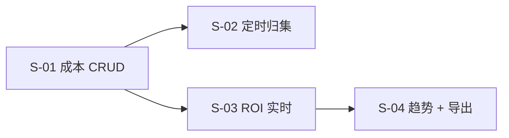

# SLICES-M5-财务管理

> **切片计划**：M5 财务管理
> **版本**：v1.0 | 2026-06-07
> **总切片数**：4 片 | 预估工时：约 8 人日

---

## 1. 切片总览

| Slice | 目标 | FR | 依赖 | 工时 | 优先级 |
|-------|------|----|------|------|--------|
| S-01 | 账号成本 CRUD | FR-M5-001 | - | 2.0 | P0 |
| S-02 | 成本定时归集 | FR-M5-001 | S-01 | 2.0 | P0 |
| S-03 | ROI 实时分析 | FR-M5-002 | S-01 | 3.0 | P0 |
| S-04 | ROI 趋势 + 导出 | FR-M5-002 | S-03 | 1.0 | P0 |

---

## 2. 依赖图

---

## 3. 切片详述

### S-01 账号成本 CRUD

**全局规范**：
- `accountId` 用 `<AccountSelect />`（成本记录侧）
- `costType` / `payMethod` / `period` 用 `<DictSelect />`

**前端**（2026-06-11）：
- 路由 `/account-cost` · `AccountCostManage.vue`
- 平台 Tab + 账号维度成本汇总表
- 「查看」抽屉 + 「成本管理」弹窗（采购 + 过程 CRUD）
- 复用 `getAccountList` + `getCostList` 前端聚合

**验收**：AC-M5-001-1 ~ AC-M5-001-5

### S-02 成本定时归集

**业务**：Spring `@Scheduled` 每月 1 号将过程成本分摊到账号

### S-03 ROI 实时分析

**验收**：AC-M5-002-1, AC-M5-002-2

### S-04 ROI 趋势 + 导出

**验收**：AC-M5-002-3

---

*下一步：CHECKLIST + TESTCASES。*

---

## 全局规范引用

> 本切片文档遵循 [`GLOBAL-CONVENTIONS.md`](../engineering/GLOBAL-CONVENTIONS.md) 中定义的全局规范：
> - 强关联属性 → 5 类选择器组件（RealNameSelect / PhoneSelect / SimCardSelect / CompanySelect / AccountSelect）
> - 枚举属性 → 统一从数据字典（`dict_*`）选择
> - 跨租户 + 状态校验 → 错误码 1500-1504
> - 数据安全 → 敏感字段脱敏展示，凭证类字段 AES-256 加密存储
> - 详见 [`GLOBAL-CONVENTIONS.md § 1`](../engineering/GLOBAL-CONVENTIONS.md) (铁律)、[`§ 2`](../engineering/GLOBAL-CONVENTIONS.md) (字典)

---

## AC 映射表（验收条件）

每个 Slice 都对应 PRD 中的一个或多个 AC（Acceptance Criteria），保证可追溯。

| Slice ID | 关联 AC | 标题 | 估时 |
|----------|---------|------|------|
| S-M5-01 | AC-M5-01 | 收入/支出登记 | 1d |
| S-M5-02 | AC-M5-02 | 审批流（初审/复审/终审） | 1.5d |
| S-M5-03 | AC-M5-03 | 财务报表导出 | 1d |

### 估算单位
- `d` = 人天（1 人 = 8 小时）
- 总估时 = sum of all slices

### 与测试用例的映射
每个 AC 对应 [`TESTCASES-*.md`](../delivery/) 中的 TC-F-* 用例。
