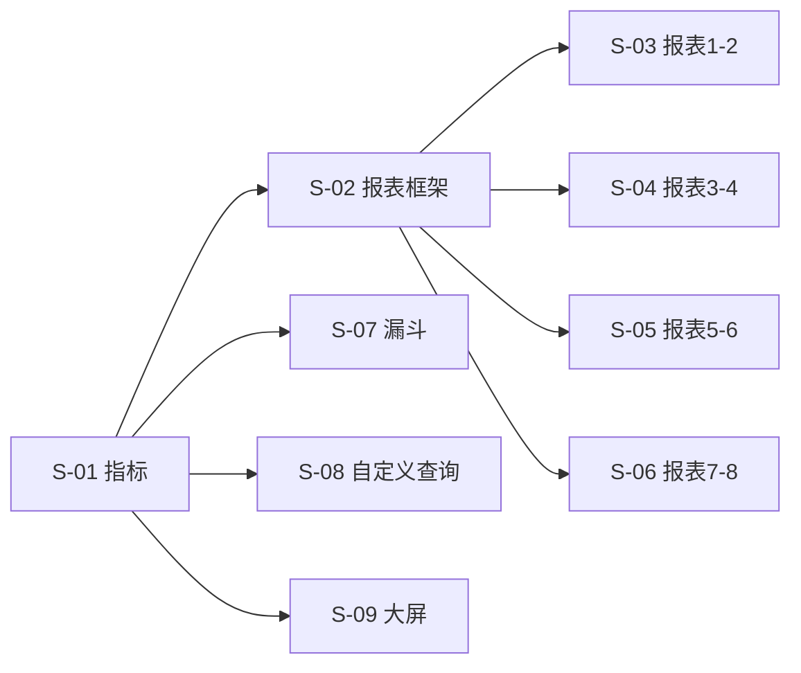

# SLICES-M6-数据分析

> **切片计划**：M6 数据分析
> **版本**：v1.0 | 2026-06-07
> **总切片数**：9 片 | 预估工时：约 30 人日

---

## 1. 切片总览

| Slice | 目标 | FR | 依赖 | 工时 | 优先级 |
|-------|------|----|------|------|--------|
| S-01 | 指标管理 | FR-M6-001 | - | 3.0 | P0 |
| S-02 | 报表通用框架 | - | - | 4.0 | P0 |
| S-03 | 报表 1-2（账号视图/状态监控） | FR-M6-002 (1/4) | S-02 | 4.0 | P0 |
| S-04 | 报表 3-4（短视频/直播） | FR-M6-002 (2/4) | S-02 | 3.0 | P0 |
| S-05 | 报表 5-6（成本/ROI） | FR-M6-002 (3/4) | S-02 | 3.0 | P0 |
| S-06 | 报表 7-8（IP 团队/异常预警） | FR-M6-002 (4/4) | S-02 | 3.0 | P0 |
| S-07 | 漏斗分析（预置+自定义） | FR-M6-004 | S-01 | 4.0 | P0 |
| S-08 | 自定义查询 | FR-M6-005 | - | 4.0 | P1 |
| S-09 | 数据大屏 | FR-M6-006/007 | S-01 | 2.0 | P1 |

---

## 2. 依赖图

---

## 3. 关键全局规范

- `ipGroupId` 用 `<IpGroupTreeSelect />`
- `accountId` 用 `<AccountSelect />`
- `platformType` 用 `<DictSelect dict-type="dict_platform_type" />`
- `contentType` 用 `<DictSelect dict-type="dict_content_type" />`
- `reportType` / `reportPeriod` 用 `<DictSelect />`
- `funnelType` / `queryStatus` / `dashboardType` 用 `<DictSelect />`
- `metricType` / `alertType` / `alertLevel` / `alertStatus` 用 `<DictSelect />`

---

*下一步：CHECKLIST + TESTCASES。*

---

## 全局规范引用

> 本切片文档遵循 [`GLOBAL-CONVENTIONS.md`](../engineering/GLOBAL-CONVENTIONS.md) 中定义的全局规范：
> - 强关联属性 → 5 类选择器组件（RealNameSelect / PhoneSelect / SimCardSelect / CompanySelect / AccountSelect）
> - 枚举属性 → 统一从数据字典（`dict_*`）选择
> - 跨租户 + 状态校验 → 错误码 1500-1504
> - 数据安全 → 敏感字段脱敏展示，凭证类字段 AES-256 加密存储
> - 详见 [`GLOBAL-CONVENTIONS.md § 1`](../engineering/GLOBAL-CONVENTIONS.md) (铁律)、[`§ 2`](../engineering/GLOBAL-CONVENTIONS.md) (字典)

---

## AC 映射表（验收条件）

每个 Slice 都对应 PRD 中的一个或多个 AC（Acceptance Criteria），保证可追溯。

| Slice ID | 关联 AC | 标题 | 估时 |
|----------|---------|------|------|
| S-M6-01 | AC-M6-01 | 报表查询（多维度） | 1.5d |
| S-M6-02 | AC-M6-02 | 数据导出（Excel/CSV/PDF） | 1d |
| S-M6-03 | AC-M6-03 | 自定义仪表盘 | 2d |

### 估算单位
- `d` = 人天（1 人 = 8 小时）
- 总估时 = sum of all slices

### 与测试用例的映射
每个 AC 对应 [`TESTCASES-*.md`](../delivery/) 中的 TC-F-* 用例。
