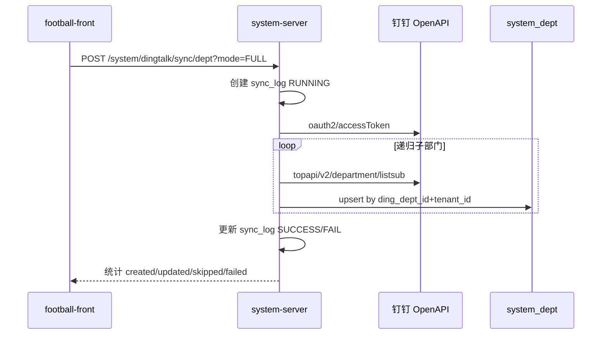
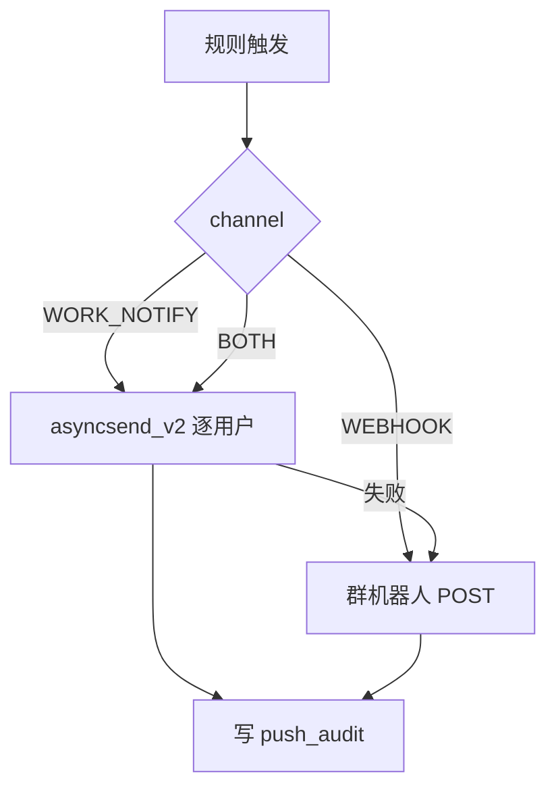

# PRD-Football-钉钉同步与消息推送

> **产品域**：Football 系统管理（原生）  
> **版本**：v1.0 | 2026-07-16  
> **状态**：Draft  
> **方法论**：[`AI驱动产品开发方法论-产品经理指南.md`](../../AI驱动产品开发方法论-产品经理指南.md)  
> **关联 UX**：[`UX-Football-钉钉同步与消息推送.md`](./UX-Football-钉钉同步与消息推送.md)  
> **交付索引**：[`README.md`](./README.md)

---

## 0. 元信息

| 字段 | 值 |
|------|---|
| 产品 | Football SaaS 管理后台 |
| 模块 | 系统管理 — 用户 / 部门 / 消息中心 |
| 归属团队 | Football（`system-server` + `football-front`） |
| 关联 ADR（参考） | ADR-013（Ops 同步参考）、ADR-026（推送参考）、ADR-047/049（集成边界） |
| 禁止修改 | `oa-server`、`ops-platform-ui-vue`、`football-spring-boot-starter-*` 框架源码 |

---

## 1. 概述

### 1.1 一句话描述

在 Football 原生**用户管理、部门管理**中接入钉钉组织架构同步（授权、全量/增量、可配置冲突策略与定时任务）；在**消息中心**新增钉钉推送配置（按角色、定时 Cron、Webhook、模板、测试与审计）。

### 1.2 背景与问题

| 痛点 | 现状 | 业务影响 |
|------|------|----------|
| 组织数据手工维护 | Football `system_dept` / `system_users` 需管理员手工录入 | 入职/调岗滞后，权限与部门树不准 |
| 无钉钉用户标识 | `system_users` 无 `ding_user_id` | 无法点对点工作通知；Ops 等业务模块无法关联钉钉身份 |
| 消息触达单一 | Football 消息中心以站内信为主（`system_notify_*`） | 关键通知无法及时触达移动办公场景 |
| 推送规则僵化 | 无按角色、按时间的钉钉推送策略配置 | 运营/管理员无法自助配置日报、提醒类消息 |

Football 表 `system_social_client` 已存在钉钉社交客户端种子数据，但**组织同步与可配置推送**尚未在 Football 系统模块产品化。

### 1.3 目标与成功指标

| 维度 | 目标 | 可量化指标 |
|------|------|------------|
| 组织同步效率 | 一键/定时同步钉钉组织 | 全量同步 500 人规模 ≤ 5min 完成；增量同步 ≤ 30s |
| 数据准确性 | 部门树与钉钉一致 | 同步后部门匹配率 ≥ 99%（以 `ding_dept_id` 为键） |
| 消息触达 | 可配置角色+定时钉钉推送 | 配置保存后 5min 内测试推送成功率 100%（凭证正确前提下） |
| 可运维 | 同步/推送可审计 | 100% 手动/定时任务有日志；失败可重试 |

### 1.4 术语表

| 术语 | 定义 |
|------|------|
| **CorpId** | 钉钉企业 ID |
| **AgentId** | 钉钉企业内部应用 AgentId（工作通知） |
| **ding_dept_id** | 钉钉部门 ID，同步幂等键 |
| **ding_user_id** | 钉钉用户 ID，同步幂等键 |
| **全量同步** | 从钉钉根部门递归拉取全部部门/用户 |
| **增量同步** | 基于上次同步时间点或钉钉变更事件拉取差异 |
| **工作通知** | 钉钉 `asyncsend_v2` 点对点消息 |
| **群机器人 Webhook** | 钉钉群自定义机器人 HTTP 推送 |
| **推送规则** | 绑定角色、Cron、模板、通道开关的配置实体 |

---

## 2. 用户与权限

### 2.1 目标用户

| 角色 | 典型岗位 | 核心诉求 |
|------|----------|----------|
| 系统管理员 | IT / 平台运维 | 配置钉钉凭证、首次全量同步、排错 |
| 租户管理员 | 企业管理员 | 本租户组织同步、推送规则维护 |
| 普通用户 | 业务人员 | 接收站内信 + 钉钉通知（只读） |

### 2.2 角色 × 能力矩阵

| 能力 | super_admin | tenant_admin | 其他角色 |
|------|-------------|--------------|----------|
| 查看钉钉连接状态 | ✅ | ✅（本租户） | ❌ |
| 配置钉钉应用凭证 | ✅ | ✅（本租户） | ❌ |
| 手动触发部门/用户同步 | ✅ | ✅（本租户） | ❌ |
| 配置同步策略（定时/冲突） | ✅ | ✅（本租户） | ❌ |
| 查看同步日志 | ✅ | ✅（本租户） | ❌ |
| 钉钉推送规则 CRUD | ✅ | ✅（本租户） | ❌ |
| 测试推送 | ✅ | ✅（本租户） | ❌ |
| 查看推送审计 | ✅ | ✅（本租户） | ❌ |
| 接收钉钉消息 | ✅ | ✅ | ✅（按规则） |

### 2.3 权限点（建议写入 `system_menu`）

| 权限码 | 说明 |
|--------|------|
| `system:dingtalk:config:query` | 查看钉钉连接与同步配置 |
| `system:dingtalk:config:save` | 保存凭证与同步策略 |
| `system:dept:sync-dingtalk` | 触发部门同步 |
| `system:user:sync-dingtalk` | 触发用户同步 |
| `system:dingtalk:sync-log:query` | 查看同步日志 |
| `system:dingtalk:push-rule:query` | 查看推送规则 |
| `system:dingtalk:push-rule:create` | 新增推送规则 |
| `system:dingtalk:push-rule:update` | 编辑推送规则 |
| `system:dingtalk:push-rule:delete` | 删除推送规则 |
| `system:dingtalk:push-rule:test` | 测试推送 |
| `system:dingtalk:push-audit:query` | 查看推送审计 |

---

## 3. 范围

### 3.1 In Scope — 功能清单

| FR 编号 | 名称 | 优先级 |
|---------|------|--------|
| FR-FT-001 | 钉钉应用授权与连接配置 | P0 |
| FR-FT-002 | 部门钉钉同步（全量/增量） | P0 |
| FR-FT-003 | 用户钉钉同步（全量/增量） | P0 |
| FR-FT-004 | 同步策略（字段映射、冲突、定时、重试） | P0 |
| FR-FT-005 | 同步日志与失败处理 | P0 |
| FR-FT-006 | 钉钉推送规则管理 | P0 |
| FR-FT-007 | 推送执行（定时 + 手动测试） | P0 |
| FR-FT-008 | 推送审计与监控 | P1 |

### 3.2 Out of Scope

见 [`README.md`](./README.md) §2.2。

---

## 4. 功能需求详述

### FR-FT-001 钉钉应用授权与连接配置

**描述**：管理员在 Football 后台配置钉钉企业内部应用凭证，系统验证连通性并持久化连接状态（ per `tenant_id`）。

**前置条件**：已在钉钉开放平台创建企业内部应用，并开通「通讯录只读」「工作通知」权限。

**主流程**：

1. 管理员进入「部门管理 → 钉钉同步配置」或「用户管理 → 钉钉同步」抽屉
2. 填写 `corpId`、`clientId`（AppKey）、`clientSecret`（AppSecret）、`agentId`（工作通知，消息推送必填）
3. 可选填写默认 `rootDeptId`（同步起点，默认钉钉根 `1`）
4. 点击「测试连接」→ 后端获取 `accessToken` 并调用 `topapi/v2/department/get` 验证
5. 保存成功后展示「已连接」状态与最近验证时间

**数据项**：

| 字段 | 必填 | 说明 |
|------|------|------|
| `corpId` | 是 | 企业 ID |
| `clientId` | 是 | AppKey |
| `clientSecret` | 是 | AppSecret，AES-256 加密存储，界面脱敏 |
| `agentId` | 消息推送必填 | 工作通知 AgentId |
| `rootDeptId` | 否 | 同步根部门，默认 `1` |
| `enabled` | 是 | 是否启用钉钉集成 |

**业务规则**：

- 凭证仅存服务端（Nacos 环境变量或 `system_dingtalk_config` 表加密字段），**禁止**提交 git
- 每租户最多一条有效配置（`tenant_id` 唯一）
- `clientSecret` 保存后界面仅显示 `****` + 后四位

**验收标准**：

| AC | Given-When-Then |
|----|-----------------|
| AC-FT-001-1 | Given 管理员有 `system:dingtalk:config:save` 权限，凭证正确 — When 点击「测试连接」— Then 返回成功，状态显示「已连接」 |
| AC-FT-001-2 | Given 凭证错误 — When 测试连接 — Then 提示「钉钉凭证无效，请检查 AppKey/AppSecret」，不更新为已连接 |
| AC-FT-001-3 | Given 已保存配置 — When 无权限用户访问 — Then 403，不暴露 Secret |

---

### FR-FT-002 部门钉钉同步（全量/增量）

**描述**：将钉钉部门树同步至 `system_dept`，支持手动全量/增量与定时触发。

**入口**：

- 部门管理页工具栏「同步钉钉部门」
- 用户管理页左侧部门树区域「同步钉钉部门」（同 API）
- 同步配置中「立即全量同步」「立即增量同步」

**主流程（全量）**：

**字段映射**：

| 钉钉字段 | Football `system_dept` | 规则 |
|----------|------------------------|------|
| `dept_id` | `ding_dept_id`（新增列） | 幂等键 |
| `name` | `name` | 冲突见 FR-FT-004 |
| `parent_id` | `parent_id` | 映射为本地父部门 `id`（先部门后关联） |
| `order` | `sort` | 数值同步 |
| — | `status` | 钉钉无对应时默认 `0`（正常） |
| `dept_manager_userid_list[0]` | `leader_user_id` | 按 `ding_user_id` 反查 `system_users.id`，未找到则 NULL |

**业务规则**：

- 幂等键：`ding_dept_id + tenant_id`
- 保留本地-only 部门：`ding_dept_id IS NULL` 的部门不删除、不被覆盖名称（除非配置「钉钉优先」且手动合并）
- 钉钉侧删除的部门：默认**软停用**本地部门（`status=1`），不物理删除；有子部门或用户时不得物理删除（错误码 `1502`）
- 同步进行中：同租户同类型任务互斥（返回 `1501` 同步进行中）

**验收标准**：

| AC | Given-When-Then |
|----|-----------------|
| AC-FT-002-1 | Given 凭证有效、钉钉有 3 级部门树 — When 全量同步 — Then `system_dept` 新增/更新记录数与钉钉一致，且 `parent_id` 树结构正确 |
| AC-FT-002-2 | Given 已同步过 — When 增量同步且钉钉仅改名一个部门 — Then 仅该部门 `name` 更新，`sync_log` 记录 `updated=1` |
| AC-FT-002-3 | Given 同步执行中 — When 再次触发 — Then 拒绝并提示「同步任务进行中」 |

---

### FR-FT-003 用户钉钉同步（全量/增量）

**描述**：按已同步部门拉取钉钉用户，写入/更新 `system_users`。

**前置条件**：FR-FT-002 至少完成一次部门全量同步。

**主流程**：

1. 遍历本租户 `ding_dept_id IS NOT NULL` 的部门
2. `topapi/user/listid` 获取部门用户 ID 列表
3. `topapi/v2/user/get` 拉取用户详情
4. 按 `ding_user_id + tenant_id` upsert `system_users`

**字段映射**：

| 钉钉字段 | Football `system_users` | 规则 |
|----------|-------------------------|------|
| `userid` | `ding_user_id`（新增列） | 幂等键 |
| `name` | `nickname` | 冲突见 FR-FT-004 |
| `mobile` | `mobile` | 非空时同步 |
| `email` | `email` | 非空时同步 |
| `avatar` | `avatar` | URL 同步 |
| `dept_id_list[0]` | `dept_id` | 映射本地部门 id |
| — | `username` | 新用户默认 `ding_{userid}`；已存在用户不强制改 username |
| — | `password` | 新用户随机密码（不可逆）；不推送给用户 |
| — | `status` | 钉钉 `active=false` → `status=1`（停用） |

**业务规则**：

- **不删除**本地已有用户（与 ADR-013 一致）
- 新用户默认角色：可配置，默认 `tenant_admin` 以外的「普通角色」（`system_role` code=`common`，可配置项）
- 已存在用户（按 `ding_user_id` 或按 `mobile` 匹配，见冲突策略）：更新资料，不重置密码
- 缺少 `ding_user_id` 的用户：不受同步影响

**验收标准**：

| AC | Given-When-Then |
|----|-----------------|
| AC-FT-003-1 | Given 部门已同步、钉钉部门有 10 人 — When 用户全量同步 — Then 10 条用户写入或更新，且 `dept_id` 正确 |
| AC-FT-003-2 | Given 本地手工用户无 `ding_user_id` — When 用户同步 — Then 该用户记录保留不变 |
| AC-FT-003-3 | Given 钉钉用户离职（active=false）— When 同步 — Then 本地用户 `status=1`，不删除 |

---

### FR-FT-004 同步策略（字段映射、冲突、定时、重试）

**描述**：统一配置同步行为，供 FR-FT-002/003 与定时任务读取。

**配置项**：

| 配置键 | 类型 | 默认值 | 说明 |
|--------|------|--------|------|
| `sync.mode.default` | 枚举 | `INCREMENTAL` | 定时任务默认模式：`FULL` / `INCREMENTAL` |
| `sync.cron.dept` | Cron | `0 0 2 * * ?` | 部门定时同步（每日 02:00） |
| `sync.cron.user` | Cron | `0 30 2 * * ?` | 用户定时同步（每日 02:30，在部门之后） |
| `sync.conflict.dept` | 枚举 | `DINGTALK_WINS` | `DINGTALK_WINS` / `LOCAL_WINS` / `SKIP` |
| `sync.conflict.user` | 枚举 | `DINGTALK_WINS` | 同上 |
| `sync.match.userBy` | 枚举 | `DING_USER_ID` | 匹配已存在用户：`DING_USER_ID` / `MOBILE` |
| `sync.retry.maxAttempts` | 整数 | `3` | 失败自动重试次数 |
| `sync.retry.backoffSec` | 整数 | `60` | 重试间隔秒 |
| `sync.newUser.defaultRoleIds` | 角色 ID 数组 | `[]` | 新同步用户默认角色 |

**冲突策略说明**：

| 策略 | 部门/用户字段冲突时 |
|------|---------------------|
| `DINGTALK_WINS` | 以钉钉为准覆盖本地 |
| `LOCAL_WINS` | 保留本地，仅写入 `ding_*_id` 关联 |
| `SKIP` | 记录冲突，跳过该条，写入 `sync_log_detail` |

**定时任务**：

- 注册于 `infra-server` 定时任务（或 `system-server` 内置 Scheduler），任务名 `dingtalkSyncDept` / `dingtalkSyncUser`
- 任务执行前检查 `enabled=true` 且凭证有效
- 失败按 `maxAttempts` 重试，仍失败则 `sync_log` 状态 `FAIL` 并告警（可选站内信通知管理员）

**验收标准**：

| AC | Given-When-Then |
|----|-----------------|
| AC-FT-004-1 | Given `sync.conflict.dept=LOCAL_WINS` 且本地部门名与钉钉不同 — When 同步 — Then 本地 `name` 不变，`ding_dept_id` 写入 |
| AC-FT-004-2 | Given Cron 到达且启用 — When 定时任务触发 — Then 自动执行增量同步并写日志 |
| AC-FT-004-3 | Given 钉钉 API 超时 — When 重试 3 次仍失败 — Then `sync_log` 标记失败，记录 error_message |

---

### FR-FT-005 同步日志与失败处理

**描述**：每次同步（手动/定时）产生可追溯日志，支持查看明细与手动重试。

**数据模型（建议新增表）**：

**`system_dingtalk_sync_log`**：

| 列 | 说明 |
|----|------|
| `id` | 主键 |
| `tenant_id` | 租户 |
| `sync_type` | `DEPT` / `USER` |
| `sync_mode` | `FULL` / `INCREMENTAL` |
| `trigger_type` | `MANUAL` / `CRON` / `RETRY` |
| `status` | `RUNNING` / `SUCCESS` / `PARTIAL` / `FAIL` |
| `started_at` / `finished_at` | 时间 |
| `created_count` / `updated_count` / `skipped_count` / `failed_count` | 统计 |
| `error_message` | 摘要 |
| `operator_user_id` | 手动触发人 |

**`system_dingtalk_sync_log_detail`**（可选，失败/跳过时写入）：

| 列 | 说明 |
|----|------|
| `sync_log_id` | 外键 |
| `biz_type` | `DEPT` / `USER` |
| `ding_id` | 钉钉 id |
| `action` | `CREATE` / `UPDATE` / `SKIP` / `FAIL` |
| `message` | 原因 |

**主流程**：

1. 用户在「同步日志」页按时间/类型筛选
2. 点击一条失败记录 → 查看明细 →「重试」重新触发同模式同步

**验收标准**：

| AC | Given-When-Then |
|----|-----------------|
| AC-FT-005-1 | Given 完成一次手动部门同步 — When 打开同步日志 — Then 有一条 `MANUAL`+`DEPT` 记录且统计正确 |
| AC-FT-005-2 | Given 失败记录 — When 点击重试 — Then 新建 `RETRY` 类型日志并执行 |

---

### FR-FT-006 钉钉推送规则管理

**描述**：在消息中心新增「钉钉推送配置」子页，支持按角色、Cron、通道、模板配置推送规则。

**入口**：`系统管理 → 消息中心 → Tab「钉钉推送配置」`（路由建议 `#/system/notify/dingtalk-push`）

**规则实体 `system_dingtalk_push_rule`**：

| 字段 | 必填 | 说明 |
|------|------|------|
| `name` | 是 | 规则名称，租户内唯一 |
| `enabled` | 是 | 开关 |
| `role_ids` | 是 | 目标角色（多选，`system_role.id`） |
| `channel` | 是 | `WORK_NOTIFY` / `WEBHOOK` / `BOTH` |
| `cron_expression` | 是 | 定时 Cron（如 `0 0 9 * * ?` 每日 9 点） |
| `template_id` | 是 | 关联 `system_notify_template.id` 或专用钉钉模板 |
| `webhook_url` | channel 含 WEBHOOK 时必填 | 机器人地址 |
| `webhook_secret` | 否 | 加签 Secret，加密存储 |
| `msg_type` | 是 | `TEXT` / `MARKDOWN` / `LINK` |
| `title` | LINK 时必填 | 消息标题 |
| `content_template` | 是 | 支持占位符 `{{date}}` `{{roleName}}` `{{userCount}}` |
| `dedup_key` | 否 | 去重键（同日同规则只推一次） |

**业务规则**：

- 接收人计算：规则启用时，解析 `role_ids` → `system_user_role` → 用户集合；仅推送 `ding_user_id IS NOT NULL` 的用户
- `WORK_NOTIFY` 使用 FR-FT-001 的 `agentId`
- `WEBHOOK` 推送不区分用户，群广播
- 规则禁用后不参与调度
- 模板内容长度：Text ≤ 500 字，Markdown ≤ 5000 字

**验收标准**：

| AC | Given-When-Then |
|----|-----------------|
| AC-FT-006-1 | Given 管理员新建规则，选择角色 A、Cron 每日 9 点 — When 保存 — Then 列表展示该规则且 `enabled` 默认 false 或按表单 |
| AC-FT-006-2 | Given 规则名称重复 — When 保存 — Then 提示「规则名称已存在」 |
| AC-FT-006-3 | Given channel=WEBHOOK 且未填 webhook — When 保存 — Then 校验失败 |

---

### FR-FT-007 推送执行（定时 + 手动测试）

**描述**：按规则 Cron 定时推送；支持管理员「测试推送」验证配置。

**推送顺序**（与 ADR-026 对齐）：

**测试推送**：

- 按钮「测试推送」：立即向当前登录管理员（若有 `ding_user_id`）+ Webhook（若配置）发送一条测试消息
- 文案前缀 `[测试]`，不计入业务去重

**定时执行**：

- Job 名称 `dingtalkPushRuleExecutor`，扫描 `enabled=true` 且 Cron 命中的规则
- 去重：同一 `dedup_key` + 自然日 只执行一次

**验收标准**：

| AC | Given-When-Then |
|----|-----------------|
| AC-FT-007-1 | Given 规则启用、目标角色用户均有 `ding_user_id` — When 测试推送 — Then 管理员钉钉收到 `[测试]` 消息 |
| AC-FT-007-2 | Given Cron 到点 — When 调度执行 — Then `push_audit` 新增记录且 `success_count` 正确 |
| AC-FT-007-3 | Given 用户无 `ding_user_id` — When 工作通知推送 — Then 跳过该用户，`push_audit` 记录 skip |

---

### FR-FT-008 推送审计与监控

**描述**：记录每次推送执行的请求/结果，供排错与合规审计。

**`system_dingtalk_push_audit`**：

| 列 | 说明 |
|----|------|
| `rule_id` | 规则 |
| `trigger_type` | `CRON` / `TEST` / `MANUAL` |
| `channel` | 实际通道 |
| `target_user_count` / `success_count` / `fail_count` / `skip_count` | 统计 |
| `request_payload` | 脱敏摘要 |
| `response_payload` | 钉钉返回摘要 |
| `status` | `SUCCESS` / `PARTIAL` / `FAIL` |
| `created_at` | 时间 |

**验收标准**：

| AC | Given-When-Then |
|----|-----------------|
| AC-FT-008-1 | Given 完成测试推送 — When 打开审计页 — Then 可见对应记录与成功/失败数 |
| AC-FT-008-2 | Given 审计列表 — When 无权限用户访问 — Then 403 |

---

## 5. 数据模型变更摘要

| 表 | 变更 |
|----|------|
| `system_dept` | 新增 `ding_dept_id` VARCHAR(64) NULL，索引 `(tenant_id, ding_dept_id)` |
| `system_users` | 新增 `ding_user_id` VARCHAR(64) NULL，索引 `(tenant_id, ding_user_id)` |
| `system_dingtalk_config` | 新增，租户级凭证与连接状态 |
| `system_dingtalk_sync_log` | 新增，同步批次日志 |
| `system_dingtalk_sync_log_detail` | 新增，同步明细（可选） |
| `system_dingtalk_push_rule` | 新增，推送规则 |
| `system_dingtalk_push_audit` | 新增，推送审计 |

**约束**：

- 全表 `tenant_id` 隔离
- 敏感字段 `client_secret`、`webhook_secret` AES-256 加密
- 业务错误码沿用 1500–1504 段（同步冲突 `1502`、进行中 `1501`、凭证无效 `1503`）

---

## 6. 接口概要

> 完整契约由 Football 团队在 `API-Football-钉钉同步与消息推送.md` 中展开。以下为 PRD 级概要。

**前缀**：`/admin-api/system`（Gateway → `system-server`）

### 6.1 钉钉配置

| 方法 | 路径 | 说明 |
|------|------|------|
| GET | `/dingtalk/config` | 获取配置（脱敏） |
| PUT | `/dingtalk/config` | 保存配置 |
| POST | `/dingtalk/config/test` | 测试连接 |

### 6.2 组织同步

| 方法 | 路径 | 说明 |
|------|------|------|
| POST | `/dingtalk/sync/dept` | 触发部门同步，body: `{ mode, trigger }` |
| POST | `/dingtalk/sync/user` | 触发用户同步 |
| GET | `/dingtalk/sync/log/page` | 同步日志分页 |
| GET | `/dingtalk/sync/log/{id}/detail` | 同步明细 |
| POST | `/dingtalk/sync/log/{id}/retry` | 重试 |
| GET | `/dingtalk/sync/strategy` | 获取同步策略 |
| PUT | `/dingtalk/sync/strategy` | 保存同步策略 |

### 6.3 推送规则

| 方法 | 路径 | 说明 |
|------|------|------|
| GET | `/dingtalk/push-rule/page` | 规则列表 |
| POST | `/dingtalk/push-rule/create` | 新增 |
| PUT | `/dingtalk/push-rule/update` | 更新 |
| DELETE | `/dingtalk/push-rule/delete` | 删除 |
| POST | `/dingtalk/push-rule/test` | 测试推送 |
| GET | `/dingtalk/push-audit/page` | 审计列表 |

### 6.4 钉钉 OpenAPI 依赖

| 用途 | API |
|------|-----|
| Token | `POST https://api.dingtalk.com/v1.0/oauth2/accessToken` |
| 子部门 | `POST /topapi/v2/department/listsub` |
| 部门详情 | `POST /topapi/v2/department/get` |
| 部门用户 ID | `POST /topapi/user/listid` |
| 用户详情 | `POST /topapi/v2/user/get` |
| 工作通知 | `POST /topapi/message/asyncsend_v2` |
| 机器人 | Webhook HTTP POST + 加签 |

---

## 7. 非功能需求（NFR）

| 编号 | 类别 | 要求 |
|------|------|------|
| NFR-01 | 性能 | 500 用户全量同步 ≤ 5min；API 分页默认 20 条 |
| NFR-02 | 安全 | 密钥 AES-256；操作写 `system_operate_log` |
| NFR-03 | 多租户 | 所有查询带 `tenant_id` |
| NFR-04 | 可用性 | 钉钉 API 限流时指数退避重试 |
| NFR-05 | 审计 | 同步/推送/配置变更可追溯 90 天 |
| NFR-06 | 兼容 | 不破坏现有 `/system/user`、`/system/dept` CRUD |

---

## 8. 用户故事

| ID | 角色 | 故事 | 验收 |
|----|------|------|------|
| US-01 | 系统管理员 | 作为管理员，我希望配置钉钉凭证并一键同步部门，以便组织树与钉钉一致 | AC-FT-001-1, AC-FT-002-1 |
| US-02 | 租户管理员 | 作为租户管理员，我希望每晚自动增量同步用户，以便新入职账号自动出现 | AC-FT-004-2, AC-FT-003-1 |
| US-03 | 系统管理员 | 作为管理员，我希望查看同步失败明细并重试，以便快速排错 | AC-FT-005-2 |
| US-04 | 租户管理员 | 作为管理员，我希望按角色配置每日 9 点钉钉日报推送，以便团队准时收到提醒 | AC-FT-006-1, AC-FT-007-2 |
| US-05 | 租户管理员 | 作为管理员，我希望测试推送规则，以便上线前验证 Webhook 与模板 | AC-FT-007-1 |

---

## 9. 里程碑建议

| 阶段 | 交付 | 预估 | 验收 |
|------|------|------|------|
| M1 | FR-FT-001 + 配置页 + 测试连接 | 3 人日 | AC-FT-001-* |
| M2 | FR-FT-002/003 手动全量同步 + 字段映射 | 5 人日 | AC-FT-002-*、AC-FT-003-* |
| M3 | FR-FT-004/005 策略、定时、日志 | 4 人日 | AC-FT-004-*、AC-FT-005-* |
| M4 | FR-FT-006/007 推送规则 + 测试推送 | 5 人日 | AC-FT-006-*、AC-FT-007-* |
| M5 | FR-FT-008 审计 + 联调 + 文档 | 3 人日 | AC-FT-008-*，P0 全绿 |

---

## 10. 开放问题

| 编号 | 问题 | 负责人 | 状态 |
|------|------|--------|------|
| OQ-01 | 新同步用户默认角色 code 是否固定为 `common` 还是可租户配置？ | 产品 | 待确认 |
| OQ-02 | 增量同步是否接入钉钉事件订阅（Stream）还是仅时间戳 diff？ | Football 后端 | 待确认 |
| OQ-03 | Ops 业务通知是否改为读取 `system_users.ding_user_id`？ | 集成 | 非本期 |
| OQ-04 | 多企业 Corp 绑定一租户是否 Phase 2？ | 产品 | 默认否 |

---

## 11. 整体验收标准

1. Football 原生菜单「用户管理」「部门管理」「消息中心」可完成钉钉配置、同步、推送配置全流程  
2. P0 FR（FR-FT-001～007）AC 100% 通过  
3. `oa-server` 与 `ops-platform-ui-vue` **零代码变更**  
4. 密钥不出现在仓库与操作日志明文  
5. 现有用户/部门 CRUD 回归通过  

---

*下一步：Football 团队基于本 PRD 编写 API / SLICES / CHECKLIST / TESTCASES，并按 UX 规格实现 `football-front` 页面。*
