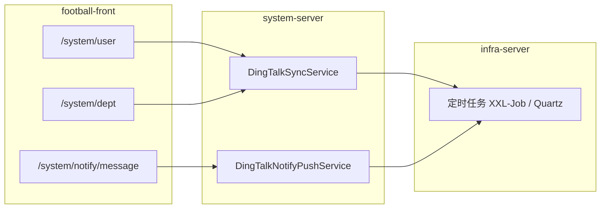

# Football 迭代交付包：钉钉组织同步与消息推送

> **交付对象**：Football 主仓库团队（`football-backend-saas` · `football-front`）  
> **版本**：v1.0 | 2026-07-16  
> **状态**：Draft — 待 Football 团队评审  
> **方法论**：[`AI驱动产品开发方法论-产品经理指南.md`](../../AI驱动产品开发方法论-产品经理指南.md)

---

## 1. 交付说明

本文件夹为 **Football 原生系统管理** 的增量需求规格，供 Football 团队独立实现与验收。**不包含** Ops 平台（`oa-server` / `ops-platform-ui-vue`）的任何开发任务。

| 文档 | 路径 | 用途 |
|------|------|------|
| 交付索引（本文） | `README.md` | 范围边界、模块归属、阅读顺序 |
| 产品需求规格 | [`PRD-Football-钉钉同步与消息推送.md`](./PRD-Football-钉钉同步与消息推送.md) | FR/AC、业务规则、接口概要、验收与里程碑 |
| 界面交互规格 | [`UX-Football-钉钉同步与消息推送.md`](./UX-Football-钉钉同步与消息推送.md) | 页面线框、组件、状态、错误处理 |
| **UI 原型（HTML）** | [`index.html`](./index.html) | 开发者视觉参考；Element Plus / Vben Admin 风格静态线框 |

### 1.1 建议阅读顺序

1. 本文 §2 范围边界 → 确认 In/Out of Scope  
2. PRD §1–§3 背景与 FR 清单  
3. UX 全文（实现前必读）  
4. PRD §6 接口概要 + §9 里程碑（排期）

### 1.2 实现前引用（Football 仓库）

实现 Slice 时，在 Cursor / AI 工具中 `@` 引用本文件夹文档，**禁止推断** Spec 未写明的内容。

### 1.3 UI 原型（HTML）

静态 HTML 线框供前端开发对齐布局与控件文案，**非可运行 Vue 代码**。

| 打开方式 | 说明 |
|----------|------|
| 浏览器打开 [`index.html`](./index.html) | 原型索引页，含全部页面链接与交付说明 |

| 文件 | 对应 UX 页面 |
|------|-------------|
| `user-manage-dingtalk.html` | P-FT-001 用户管理（增量） |
| `dept-manage-dingtalk.html` | P-FT-002 部门管理（增量） |
| `dingtalk-sync-config-drawer.html` | P-FT-003 钉钉同步配置抽屉 |
| `sync-log-dialog.html` | P-FT-004 同步日志 Dialog |
| `notify-dingtalk-push.html` | P-FT-005 消息中心 — 钉钉推送配置 Tab |
| `push-rule-drawer.html` | P-FT-006 推送规则编辑 Drawer |
| `push-audit-drawer.html` | P-FT-007 推送审计 Drawer |

样式：`common.css`（Element Plus 主色 `#409EFF`）；数据均为 Mock。

---

## 2. 范围边界

### 2.1 In Scope（Football 团队负责）

| 域 | 能力 | 归属服务 | 归属前端 |
|----|------|----------|----------|
| 组织同步 | 钉钉应用授权、部门/用户全量与增量同步、字段映射、冲突策略、定时任务、失败重试、同步日志 | `system-server`（`football-module-system`） | `football-front` → 用户管理、部门管理 |
| 消息推送 | 钉钉推送规则（按角色）、Cron 定时、Webhook/Secret、消息模板、开关、测试推送、推送审计 | `system-server`；定时调度可复用 `infra-server` Job | `football-front` → 消息中心「钉钉推送配置」 |

### 2.2 Out of Scope（明确不做）

| 项 | 说明 |
|----|------|
| **Ops 平台实现** | 不修改 `oa-server`、`ops-platform-ui-vue`、`sys_*` 表及 `oa:*` 权限 |
| **Ops 业务通知** | `sys_message`、运营事件（任务待办、内容审核、作品监测告警等）仍由 Ops 维护；本需求仅覆盖 **Football 消息中心** 的钉钉通道配置 |
| **钉钉 OAuth 登录** | 扫码/免登 SSO 属 Phase 2（见 ADR-003 方向） |
| **同步删除本地用户** | 钉钉侧离职用户不自动删除 `system_users`，仅标记停用（可配置） |
| **多企业 Corp 切换 UI** | 本期每租户绑定单一钉钉企业；多 Corp 为开放问题 |
| **短信 / 邮件 / 企微通道** | 仅扩展钉钉；其他通道沿用 Football 既有能力 |
| **修改 Football 框架 Starter** | 不得修改 `football-spring-boot-starter-*` 源码；扩展以 Bean / 模块内实现为准 |

### 2.3 与 Ops 集成的关系

- **身份 SSOT**：Football `system_users` / `system_dept`（[ADR-049](../../adr/ADR-049-Ops与Football数据归属与松耦合集成.md)）  
- Ops 侧曾在 `oa-server` 实现类似钉钉同步（[ADR-013](../../adr/ADR-013-钉钉组织用户同步.md)），写入 `sys_dept` / `sys_user` —— **该路径废弃**，本需求在 Football `system_*` 表上重建  
- Ops 业务钉钉推送（[ADR-026](../../adr/ADR-026-M9-钉钉工作通知与业务事件去重.md)）读取 `sys_user.ding_user_id`；Football 同步完成后，Ops 可通过只读 `system_users` 获取 `ding_user_id`（集成 Slice，**非本交付包实现范围**）

---

## 3. 模块与代码归属

| 层级 | 建议路径（Football 仓库） |
|------|---------------------------|
| 后端 API | `football-module-system/.../controller/admin/dept`、`.../user`、`.../notify` |
| 后端 Service | `football-module-system/.../service/dingtalk/` |
| 数据表 | `system_dept`、`system_users` 扩展字段；新增 `system_dingtalk_*` 配置/日志表 |
| 前端页面 | `football-front/apps/web-ele/src/views/system/user`、`.../dept`、`.../notify` |
| 配置 | Nacos `system-server-*.yaml` 或 `infra_config`；密钥 **禁止入库** |

---

## 4. 参考文档（只读，不修改）

| 文档 | 用途 |
|------|------|
| [ADR-047](../../adr/ADR-047-Football-Ops平台集成决策.md) | Football × Ops 集成边界 |
| [ADR-013](../../adr/ADR-013-钉钉组织用户同步.md) | Ops 侧同步规则参考（字段映射、API 行为） |
| [ADR-026](../../adr/ADR-026-M9-钉钉工作通知与业务事件去重.md) | 双通道推送顺序参考 |
| [UX-M9-系统管理.md](../../product/UX-M9-系统管理.md) | Ops 侧用户管理布局参考（左树右表） |
| [import-football-system-tables.sql](../../../scripts/integration-config/import-football-system-tables.sql) | `system_dept` / `system_users` / `system_notify_*` 基线 schema |

---

## 5. 后续交付物（本包未包含，实现阶段由 Football 团队补充）

| 文档 | 说明 |
|------|------|
| `API-Football-钉钉同步与消息推送.md` | 接口契约、错误码 |
| `SLICES-Football-钉钉.md` | 实现切片计划 |
| `CHECKLIST-Football-钉钉.md` | 开发自检 |
| `TESTCASES-Football-钉钉.md` | P0 测试用例 |

---

## 6. 联系人

| 角色 | 职责 |
|------|------|
| 产品（本仓库） | Spec 维护、验收标准 |
| Football 后端 | `system-server` API、钉钉 SDK、定时任务 |
| Football 前端 | `football-front` 页面与交互 |
| Ops 集成（可选） | 同步完成后 `ding_user_id` 只读对接评估 |

---

*本交付包为 Spec 单一事实源（SSOT）；实现偏差须先更新 PRD/UX 或写入 ADR 后再改代码。*
