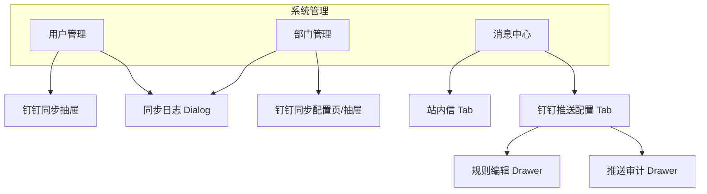

# UX-Football-钉钉同步与消息推送

> **版本**：v1.0 | 2026-07-16  
> **状态**：Draft  
> **关联 PRD**：[`PRD-Football-钉钉同步与消息推送.md`](./PRD-Football-钉钉同步与消息推送.md)  
> **交付索引**：[`README.md`](./README.md)  
> **技术栈**：Vue 3 + Vben Admin + Element Plus（`football-front/apps/web-ele`）  
> **参考布局**：[`UX-M9-系统管理.md`](../../product/UX-M9-系统管理.md)（左树右表模式）

---

## 0. 设计原则

| 原则 | 说明 |
|------|------|
| 风格一致 | 延续 Football 系统管理现有列表、抽屉、Dialog 模式；不引入新 UI 库 |
| 渐进披露 | 凭证/策略放「钉钉同步配置」抽屉；日常仅暴露「同步」按钮 |
| 安全可见 | Secret 脱敏；测试连接结果明确成功/失败 |
| 可排错 | 同步日志、推送审计独立可查，失败可一键重试 |

**路由约定**（hash 模式，与 Football 一致）：

| 页面 | 路由 | 菜单 |
|------|------|------|
| 用户管理 | `#/system/user` | 系统管理 → 用户管理 |
| 部门管理 | `#/system/dept` | 系统管理 → 部门管理 |
| 消息中心 | `#/system/notify/message` | 系统管理 → 消息中心 |
| 钉钉推送配置 | `#/system/notify/dingtalk-push` | 消息中心 Tab 或子菜单 |

---

## 1. 信息架构



---

## 2. 全局组件与 Token

| 元素 | 规范 |
|------|------|
| 主按钮 | `el-button type="primary"` — 「保存」「测试连接」「立即同步」 |
| 次按钮 | `el-button` — 「取消」「查看日志」 |
| 危险操作 | `el-button type="danger"` — 「删除规则」需二次确认 |
| 同步中 | 按钮 `loading` + 文案「同步中…」；禁止重复提交 |
| 连接状态 | `el-tag`：`success` 已连接 / `info` 未配置 / `danger` 连接失败 |
| 表格 | `el-table` + `el-pagination`，与现有 system 模块一致 |
| 表单 | `el-form` `label-width="120px"` |
| 抽屉宽度 | 配置类 `480px`；规则编辑 `560px`；日志 `720px` |
| 空态 | `el-empty` + 引导文案 + 主操作按钮 |

---

## 3. P-FT-001 用户管理页（增量）

### 3.1 布局（在现有页面上增量）

```
+------------------+----------------------------------------+
| 部门树 (260px)   | 工具栏 + 筛选 + 用户表格                |
| [搜索部门____]   | [同步钉钉▼] [钉钉配置] [新增用户]       |
|                  | 用户名/昵称/手机/状态/角色 筛选           |
| 树节点           | +------------------------------------+ |
|  · 研发部门      | | 表格：用户名列、部门、手机、状态…   | |
|  · 市场部门      | +------------------------------------+ |
|                  | 分页                                    |
+------------------+----------------------------------------+
```

### 3.2 控件清单

| 控件 ID | 类型 | 文案 | 行为 | 权限 |
|---------|------|------|------|------|
| BTN-SYNC-DINGTALK | `el-dropdown` | 同步钉钉 | 下拉：「同步部门」「同步用户」 | `system:dept:sync-dingtalk` / `system:user:sync-dingtalk` |
| BTN-DINGTALK-CONFIG | `el-button` link | 钉钉配置 | 打开 `DRW-DINGTALK-SYNC` | `system:dingtalk:config:query` |
| BTN-SYNC-LOG | `el-button` link | 同步日志 | 打开 `DLG-SYNC-LOG` | `system:dingtalk:sync-log:query` |
| TREE-DEPT | `el-tree` | — | 点击筛选 `deptId`；节点显示本地部门名；钉钉同步部门带 `el-tag`「钉」可选 | 既有 |
| COL-DING-USER | 表格列 | 钉钉 ID | 显示 `ding_user_id` 或 `—` | 既有列表扩展 |

### 3.3 「同步钉钉」下拉交互

1. 用户点击「同步钉钉」→ 选择「同步部门」或「同步用户」
2. 弹出 `el-message-box` 确认：
   - 部门：「将从钉钉全量/增量同步部门树，是否继续？」选项：`全量` / `增量`（单选，默认增量）
   - 用户：「将按已同步部门拉取钉钉用户，是否继续？」选项：`全量` / `增量`
3. 确认后按钮 loading，调用 API
4. 成功：`ElMessage.success('同步完成：新增 {created}，更新 {updated}，跳过 {skipped}')`
5. 失败：`ElMessage.error` 展示后端 `msg`；若 `1501` 提示「同步任务进行中」

### 3.4 未配置凭证空态

当 `GET /dingtalk/config` 返回 `enabled=false` 或无配置：

- 工具栏下方 `el-alert type="warning"`：「尚未配置钉钉应用，请先完成配置后再同步。」
- 「同步钉钉」下拉禁用；「钉钉配置」高亮

---

## 4. P-FT-002 部门管理页（增量）

### 4.1 布局

```
+------------------------------------------------------------------+
| 部门管理                                    [钉钉同步配置] [新增] |
+------------------------------------------------------------------+
| el-alert（连接状态条，可选）                                        |
+------------------------------------------------------------------+
| 部门树表格（或左树右表，与 Football 现有 dept 页保持一致）          |
| 列：部门名称 | 排序 | 负责人 | 钉钉部门ID | 状态 | 操作          |
+------------------------------------------------------------------+
```

### 4.2 增量列

| 列 | 字段 | 说明 |
|----|------|------|
| 钉钉部门 ID | `dingDeptId` | 无则显示 `—` |
| 来源 | 计算 | `dingDeptId` 有值 → Tag「钉钉」；无 → Tag「本地」 |

### 4.3 BTN-DINGTALK-SYNC-CONFIG

打开 **`DRW-DINGTALK-SYNC`**（与用户管理共用组件），默认 Tab「连接配置」。

部门页额外提供：

| 控件 | 文案 | 行为 |
|------|------|------|
| BTN-SYNC-DEPT-NOW | 立即同步部门 | 同用户页部门同步确认流 |
| LINK-SYNC-STRATEGY | 同步策略 | 切换至策略 Tab |

---

## 5. P-FT-003 钉钉同步配置抽屉 `DRW-DINGTALK-SYNC`

**宽度**：`520px`  
**标题**：钉钉同步配置  
**结构**：`el-tabs`

### 5.1 Tab「连接配置」

| 字段 | 控件 | 校验 |
|------|------|------|
| 启用 | `el-switch` | — |
| 企业 CorpId | `el-input` | 必填 |
| AppKey | `el-input` | 必填 |
| AppSecret | `el-input` `show-password` | 必填；编辑时 placeholder「留空则不修改」 |
| AgentId | `el-input` | 推送必填；同步可提示「消息推送需要」 |
| 根部门 ID | `el-input` | 默认 `1` |
| 连接状态 | 只读 `el-tag` + 最近验证时间 | — |

**底部操作**：

| 按钮 | 行为 |
|------|------|
| 测试连接 | `POST /dingtalk/config/test`；成功/失败 Message |
| 保存 | `PUT /dingtalk/config` |
| 取消 | 关闭抽屉 |

### 5.2 Tab「同步策略」

| 字段 | 控件 | 说明 |
|------|------|------|
| 默认定时模式 | `el-radio-group` | 全量 / 增量 |
| 部门 Cron | `el-input` + Cron 帮助链接 | 旁注「每日 02:00」示例 |
| 用户 Cron | `el-input` | 旁注「建议晚于部门 30 分钟」 |
| 部门冲突策略 | `el-select` | 钉钉优先 / 本地优先 / 跳过 |
| 用户冲突策略 | `el-select` | 同上 |
| 用户匹配方式 | `el-select` | 钉钉用户 ID / 手机号 |
| 新用户默认角色 | `RoleSelect` 多选 | 同 Football 现有角色选择器 |
| 失败重试次数 | `el-input-number` min=0 max=5 | |
| 重试间隔(秒) | `el-input-number` min=30 | |

**保存**：`PUT /dingtalk/sync/strategy`

### 5.3 Tab「同步日志」（可选嵌入，或独立 Dialog）

精简列表 5 条 + 「查看全部」→ `DLG-SYNC-LOG`

---

## 6. P-FT-004 同步日志 Dialog `DLG-SYNC-LOG`

**宽度**：`800px`  
**标题**：钉钉同步日志

### 6.1 筛选区

| 控件 | 类型 |
|------|------|
| 同步类型 | `el-select`：全部 / 部门 / 用户 |
| 状态 | `el-select`：全部 / 进行中 / 成功 / 部分成功 / 失败 |
| 时间范围 | `el-date-picker` type="datetimerange" |
| 查询 | 按钮 |

### 6.2 表格列

| 列 | 说明 |
|----|------|
| 开始时间 | `startedAt` |
| 类型 | 部门 / 用户 |
| 模式 | 全量 / 增量 |
| 触发 | 手动 / 定时 / 重试 |
| 状态 | Tag 色：成功绿、失败红、进行中蓝 |
| 统计 | 新增/更新/跳过/失败 |
| 操作 | 「明细」「重试」— 仅失败/部分成功显示重试 |

### 6.3 明细 Drawer

展示 `sync_log_detail` 列表：钉钉 ID、动作、原因。

---

## 7. P-FT-005 消息中心 — 钉钉推送配置 Tab

### 7.1 入口

在 `#/system/notify/message` 页面顶部增加：

```
el-tabs:  [ 站内信 ]  [ 钉钉推送配置 ]
```

或子路由 `#/system/notify/dingtalk-push` 在侧栏「消息中心」下隐藏子页（`visible=0`），由 Tab 切换加载。

### 7.2 推送规则列表布局

```
+------------------------------------------------------------------+
| 钉钉推送配置                          [新增规则] [推送审计]        |
+------------------------------------------------------------------+
| 筛选：规则名称 [____]  状态 [全部▼]  [查询] [重置]               |
+------------------------------------------------------------------+
| 表格                                                              |
| 规则名称 | 目标角色 | 通道 | Cron | 状态开关 | 最近执行 | 操作    |
+------------------------------------------------------------------+
| 分页                                                              |
+------------------------------------------------------------------+
```

### 7.3 表格列与控件

| 列 | 说明 |
|----|------|
| 规则名称 | `name` |
| 目标角色 | 多角色 `el-tag` 展示，超过 2 个折叠 +N |
| 通道 | 工作通知 / Webhook / 双通道 |
| Cron | 原文 + 人类可读副文案（`0 0 9 * * ?` → 每日 09:00） |
| 状态 | `el-switch` 行内切换 `enabled` |
| 最近执行 | 审计表最近一条时间 + 成功/失败 Tag |
| 操作 | 编辑 / 测试推送 / 删除 |

### 7.4 规则编辑 Drawer `DRW-PUSH-RULE`

**宽度**：`600px`  
**标题**：新增规则 / 编辑规则

| 区块 | 字段 | 控件 |
|------|------|------|
| 基础 | 规则名称 | `el-input` |
| 基础 | 启用 | `el-switch` |
| 受众 | 目标角色 | `RoleSelect` 多选，必填 |
| 调度 | Cron 表达式 | `el-input` +「常用模板」下拉（每日9点、每周一9点、每月1号） |
| 通道 | 推送通道 | `el-radio-group`：工作通知 / Webhook / 双通道 |
| Webhook | URL | `el-input`，通道含 Webhook 时显示 |
| Webhook | Secret | `el-input` password，选填 |
| 内容 | 消息类型 | TEXT / MARKDOWN / LINK |
| 内容 | 标题 | LINK 时必填 |
| 内容 | 模板 | `el-input` textarea，占位符提示 `{{date}}` |
| 内容 | 关联站内模板 | `NotifyTemplateSelect` 可选，选中后填充 content |
| 高级 | 去重键 | `el-input`，hint「同日同规则仅推一次」 |

**底部**：保存 | 测试推送 | 取消

**测试推送**：不关闭抽屉；结果 `ElMessage` + 可在审计中查看。

---

## 8. P-FT-006 推送审计 Drawer `DRW-PUSH-AUDIT`

**宽度**：`800px`  
**从规则列表「推送审计」或规则行「最近执行」进入**

| 列 | 说明 |
|----|------|
| 执行时间 | |
| 规则名称 | |
| 触发方式 | 定时 / 测试 / 手动 |
| 通道 | |
| 目标/成功/失败/跳过 | 数字 |
| 状态 | Tag |
| 操作 | 查看详情（展示脱敏 request/response JSON） |

---

## 9. 页面状态矩阵

### 9.1 用户/部门同步

| 状态 | 表现 |
|------|------|
| 未配置 | Alert 警告；同步按钮禁用 |
| 配置未测试 | Tag「未验证」；允许同步但提示风险 |
| 同步中 | 按钮 loading；Message「同步任务已提交」 |
| 同步成功 | Success Message + 刷新树/表 |
| 同步部分成功 | Warning Message + 引导查看日志 |
| 同步失败 | Error Message + 重试入口 |
| 无权限 | 隐藏同步与配置入口 |

### 9.2 推送规则

| 状态 | 表现 |
|------|------|
| 空列表 | Empty「暂无推送规则」+ 按钮「新增规则」 |
| 规则禁用 | 行内开关 off，Cron 不执行（灰显 Cron 列可选） |
| 测试推送中 | 测试按钮 loading |
| Webhook 无效 | 测试返回失败，审计记录 FAIL |

---

## 10. 错误与提示文案

| 场景 | 文案（前端固定或后端 msg） |
|------|---------------------------|
| 凭证无效 | 钉钉凭证无效，请检查 AppKey / AppSecret |
| 同步进行中 | 同步任务进行中，请稍后再试 |
| 部门未同步就同步用户 | 请先完成部门同步 |
| 无钉钉用户 ID | 目标用户未绑定钉钉账号，已跳过（审计可见） |
| Cron 非法 | Cron 表达式格式不正确 |
| Webhook 必填 | 选择 Webhook 通道时必须填写 Webhook 地址 |
| 删除规则 | 确定删除规则「{name}」？删除后不可恢复。 |

---

## 11. API 与前端文件建议（Football 仓库）

| 类型 | 建议路径 |
|------|----------|
| API | `src/api/system/dingtalk-sync.ts`、`dingtalk-push.ts` |
| 组件 | `src/views/system/user/components/DingtalkSyncDrawer.vue` |
| 组件 | `src/views/system/notify/components/DingtalkPushRuleDrawer.vue` |
| 组件 | `src/views/system/notify/dingtalk-push.vue` |
| 复用 | 角色选择器、分页、权限指令 `v-access` |

---

## 12. 与现有 Football 页面对齐检查项

- [ ] 用户管理左侧部门树宽度与筛选交互与现网一致  
- [ ] 表格操作列宽度不挤压新增列  
- [ ] 暗色模式：Alert / Tag / Table 使用 Element Plus CSS 变量  
- [ ] 权限：无权限不渲染按钮（非仅 disabled）  
- [ ] 路由：hash 模式刷新不 404  
- [ ] 与 Ops `ops/system-user` **无代码共用**（Football 原生实现）

---

## 13. 线框 — 消息中心 Tab 切换

```
┌─────────────────────────────────────────────────────────────┐
│ 消息中心                                                     │
├─────────────────────────────────────────────────────────────┤
│ [ 站内信 ]  [ 钉钉推送配置 ● ]                               │
├─────────────────────────────────────────────────────────────┤
│                                    [ + 新增规则 ] [ 推送审计 ]│
│ ┌─────────────────────────────────────────────────────────┐ │
│ │ 晨会日报提醒 │ 运营组长 │ 工作通知 │ 每天09:00 │ [ON]  │ │
│ │ 运维群广播   │ 全部角色 │ Webhook  │ 每天18:00 │ [OFF] │ │
│ └─────────────────────────────────────────────────────────┘ │
│                      < 1 / 1 >                               │
└─────────────────────────────────────────────────────────────┘
```

---

*本 UX 规格与 PRD 配套使用；界面变更须同步更新 PRD §5 或本文件后再实现。*
