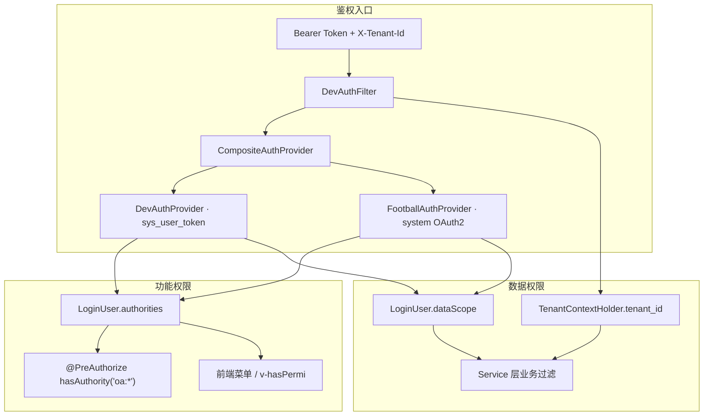

# OPS 功能权限与数据权限管理策略

> **范围**：`oa-server`（`ops-platform-module-oa`）+ `ops-platform-ui-vue`  
> **数据来源**：`oa-menu-permission-map.csv`、`V15__seed_auth.sql`、`V12__m9_auth.sql`、ADR-017/047/049、源码审计（2026-07）  
> **读者**：架构师、后端/前端开发、权限治理

---

## Executive Summary

- **双层模型**：功能权限 = `oa:*` 菜单/按钮 RBAC（能否进页面/调接口）；数据权限 = `LoginUser.dataScope`（ALL / IP_GROUP / SELF）+ 各模块 Service 内业务过滤（能否看哪条记录）。
- **鉴权双轨**：`CompositeAuthProvider` 优先 Dev Token（`sys_user_token`），否则 Football OAuth2；Football 侧通过 `mergeOaPermissions` 合并同名 `sys_user` 的 `oa:*` 权限。
- **后端 enforcement 不均**：84 个 Controller 中仅约 22 个使用 `@PreAuthorize`；多数业务 API 仅要求 `authenticated()`，功能权限主要靠前端菜单 + 少数敏感动作（发布、排版、M9 CRUD）。
- **Football 数据范围缺口**：~~`FootballAuthProvider` 只映射 `data_scope=1→ALL`，否则一律 `SELF`，**不支持 `IP_GROUP`**~~ → Phase 0–3 已通过 `OpsDataScopeSupport` + member 表注入修复；前端 Phase 4 对齐 UX。
- **三套「组长」概念并存**：`sys_role OPS_LEADER`（RBAC）、`dict_position OPS_LEADER`（岗位/SOP/计划终止）、`oa_ip_group.leader_user_id` / `is_leader=1`（内容一级审核范围 / `ledIpGroupIds`）——职责重叠、校验入口不一致。
- **内置角色 IP组长**：Football `system_role.code=ip_group_leader`（V150，id 建议 160，type=1）；指派 `leader_user_id` 时后端强制校验持有该角色（错误码 1500）；数据范围仍由 `ledIpGroupIds` 决定，与本角色 `data_scope` 无关。
- **ID 桥接是数据权限基础**：`IpGroupAccessSupport.resolveMembershipUserIds` / `resolveEquivalentUserIds` union wd master、shenyu-system、`sys_user` 三套 userId，解决 Football 与 OA 用户 ID 漂移。
- **内容模块数据权限最完整**：`ContentDataScopeSupport` 对非 ALL 用户限制「本人创建 / 关联作者 / 任务指派」；审核队列单独走 `ContentReviewConfigService`（一级 OPS_LEADER = IP 组长范围）。
- **前端权限弱 enforcement**：`Layout.vue` 菜单硬编码、无路由级 permission guard；`v-hasPermi` 仅少量按钮；与 CSV 映射的「菜单→权限」目标态未对齐。

---

## 4.1 总体架构



| 层级 | 机制 | SSOT |
|------|------|------|
| 租户隔离 | 请求头 `X-Tenant-Id` → `TenantContextHolder`；业务 SQL 显式 `.eq(tenant_id)` | 全表 `tenant_id` |
| 功能权限 | Spring `@EnableMethodSecurity` + `@PreAuthorize`；权限码 `oa:{域}:{动作}` | `sys_permission` / Football `system_menu.permission` |
| 数据权限 | `sys_role.data_scope` → `LoginUser.dataScope`；模块内二次过滤 | `DataScopeSupport` + 各 `*DataScopeSupport` / `*AccessSupport` |

**权限命名约定**（`oa-menu-permission-map.csv`，96 路由）：

| 模式 | 示例 | 用途 |
|------|------|------|
| `oa:{模块}:list` | `oa:content:list`、`oa:ip-group:list` | 菜单可见 + 列表 API |
| `oa:{模块}:{动作}` | `oa:content:publish`、`oa:metadata:create` | 按钮/写操作 |
| `oa:home:view` | 首页、待办 | M0 |
| `ROLE_{code}` | `ROLE_OA_ADMIN` | 角色标识（非 oa 前缀） |

---

## 4.2 功能权限（RBAC）

### 4.2.1 数据模型

| 表 | 说明 | 状态 |
|----|------|------|
| `sys_user` / `sys_user_role` / `sys_role` / `sys_permission` / `sys_role_permission` | OA 本地 RBAC | 过渡期；Football 合并后废弃（ADR-049） |
| Football `system_users` / `system_role` / `system_role_menu` | 平台 SSOT | 生产登录来源 |
| `dict_position` | 用户/成员 **岗位**（非 RBAC） | **保留** |

### 4.2.2 Seed 业务角色（`V15__seed_auth.sql` 等）

| code | 名称 | data_scope | 典型 oa:* 权限 |
|------|------|------------|----------------|
| `OA_ADMIN` | 系统管理员 | ALL | 全部 |
| `TENANT_ADMIN` | 租户管理员 | ALL | 用户/角色查询 |
| `OPS_LEADER` | 运营组长 | ALL | `oa:user/role/permission/account` 查询 |
| `OPS_OPERATOR` | 运营专员 | **IP_GROUP** | `oa:user/account` 查询 |
| `FINANCE` | 财务 | ALL | `oa:user` 查询 |
| `DEPT_HEAD` | 部门负责人 | ALL | 二级内容审核（`V74`） |

Dev Token 对照：`dev-token-oa-admin` / `-leader` / `-operator` / `-finance` 等。

### 4.2.3 Controller 级 enforcement

**有 `@PreAuthorize` 的模块**（节选）：

- **M9**：User/Role/Tenant/Dept/Log/Message/SystemDict/Permission
- **M2**：内容发布/排版/转知识库（`ProductionContentController`）
- **M4/M10**：账号绑定、采集绑定（`oa:account:list`）
- **M8**：元数据 CRUD；Metadata 删除额外要求 `ROLE_OA_ADMIN`
- **M3**：Football 订单只读（`oa:order-attribution:list` 或 `oa:roi:list`）

**无 `@PreAuthorize` 的模块**（登录即可调用）：IP 组、计划、任务、SOP、绩效、采集、分析、大屏、大部分运营 API 等。

> **策略含义**：功能权限的「硬门」主要在 M9 与少数写操作；业务模块默认「能登录就能调 API」，依赖前端菜单隐藏 + 数据权限挡数据。

### 4.2.4 前端（ops-platform-ui-vue）

| 能力 | 实现 | 缺口 |
|------|------|------|
| 菜单 | `Layout.vue` 硬编码 | 未按 `oa:*` 动态过滤 |
| 按钮 | `v-hasPermi` + `setUserPermissions` | 使用面窄 |
| 路由 | `router/index.ts` | 无 `beforeEach` 权限校验 |
| 快捷入口 | `HomeDashboardServiceImpl.getQuickActions` | **唯一**后端按 authorities 过滤菜单 |
| **数据范围 UX（Phase 4，2026-07）** | `IpGroupTreeSelect scope=accessible` + `GET /oa/ip-group/accessible-tree`；分析/财务列表后端强制过滤，`ipGroupId` 仅缩小；人效页非组长隐藏组员筛选项；IP 组管理 403 空态 | 菜单仍硬编码，无路由 guard |

**Phase 4 前端约定**（`ops-platform-ui-vue`）：

| 场景 | 行为 |
|------|------|
| 运营/分析/财务筛选 | `IpGroupTreeSelect` 使用 `scope="accessible"`；不选 IP 组 ≠ 租户全量，后端已按 `memberIpGroupIds` 过滤 |
| 平台账号绑定 | 已有 `scope="accessible"`（`InternalAccountManage`） |
| 人效盘点 6156 | 非 admin 且非 IP 组长：隐藏 IP 组/组员筛选，仅展示本人 |
| IP 组管理 6159 | `GET /oa/ip-group/tree` 403 → 全页空态提示，非弹窗堆叠 |
| 监测页 6112–6116 | 无 IP 组下拉；空表文案注明「已按数据权限过滤」 |

---

## 4.3 数据权限

### 4.3.1 三档 dataScope（Phase 0 后）

```java
// DataScopeSupport.java + OpsDataScopeSupport
ALL       // 租户内全量（isSystemAdmin）
IP_GROUP  // memberIpGroupIds 多组过滤
SELF      // 默认兜底 + member 组账号过滤（账号类菜单）
```

| Provider | dataScope 解析 | ipGroupIds |
|----------|----------------|------------|
| `DevAuthProvider` | 角色 `ALL` > `IP_GROUP` > `SELF` | `sys_user.ip_group_id` + `oa_ip_group_member` |
| `FootballAuthProvider` | `system_role.data_scope==1` → ALL；否则查 member 表 → IP_GROUP 或 SELF | 登录时填充 `memberIpGroupIds` / `ledIpGroupIds` |

### 4.3.2 租户隔离

- 入口：`DevAuthFilter` 校验 token 与 `X-Tenant-Id` 一致后写入 `TenantContextHolder`
- 业务层：各 Service `requireTenantId()` + 查询 `.eq(*::getTenantId, tenantId)`
- 无 MyBatis 全局 TenantLine 插件；靠显式条件

### 4.3.3 Football ↔ OA 用户 ID 桥接

`IpGroupAccessSupport` 核心方法：

| 方法 | 用途 |
|------|------|
| `resolveMembershipUserIds(tenantId)` | 当前登录用户 → union 本 token userId + 同名 sys_user.id + wd/shenyu Football userId |
| `resolveEquivalentUserIds(userId, tenantId)` | 指定 userId（如任务 assignee）→ 同上 union |
| `listMemberships` / `isMemberOfIpGroup` | IP 组成员判定 |
| `hasUnrestrictedIpGroupAccess()` | `dataScope==ALL` 时跳过 IP 组限制 |

### 4.3.4 审核与岗位（非 RBAC 的功能门）

**内容审核** — `ContentReviewConfigService` + ADR-017：

| 参数 | 默认 | 规则 |
|------|------|------|
| `content.review.level1.role` | **`ip_group_leader`**（ADR-064；兼容旧值 `OPS_LEADER`） | **特殊语义**：非全角色用户，而是 **内容所属 IP 组的组长**（`leader_user_id` / `ledIpGroupIds`） |
| `content.review.level2.role` | **`ops_manager`**（ADR-064；原 `DEPT_HEAD`） | 全租户持有该 Football `system_role` 的用户 |

角色解析顺序：`sys_user_role` → Football `system_role`（`hasRoleForUserId`）。

**SOP 审核** — `SopReviewServiceImpl`：按 `sys_user.position`（`dict_position`）匹配 `reviewer_role`；Football 用户不在 `sys_user` 时 **待审列表为空**。

**计划终止审批** — `ContentPlanServiceImpl.requireOpsLeader()`：硬编码 `position == OPS_LEADER`（查 `sys_user`，Football 用户会 403）。

---

## 4.4 分模块策略表

| 模块 | 功能权限点（代表） | 数据范围规则 | 关键角色 |
|------|-------------------|-------------|---------|
| **M0 首页** | `oa:home:view` | 可选 `ipGroupId` 过滤账号/内容；**未传则租户全量**；快捷入口按 authorities | 全部登录用户 |
| **M1 运营** | `oa:ip-group:list`、`oa:account-analysis:list`、`oa:fans-analysis:list`、`oa:internal-content:list`、`oa:efficiency:list` | IP 组：admin 全树 / 组长 led / others 403；账号分析/粉丝/作品：`applyAccountIdIn(MEMBER_GROUPS)`；人效：三分支 productivity scope | OPS_LEADER、OPS_OPERATOR |
| **M2 内容/计划/任务/SOP** | `oa:content/plan/sop/task/knowledge/layout-template:list`；写：`oa:content:publish/typeset/transfer-knowledge` | **内容**：6117 仅 creator_user_id；6118 审核队列 + canReview；**计划/查询/漏斗/指标**：creator 过滤；**任务**：assignee 过滤 | OPS_LEADER（审核/终止）、OPERATOR/EDITOR/ANCHOR（执行）、DEPT_HEAD（二级审核） |
| **M3 绩效** | `oa:perf:list`、`oa:order-attribution:list` | **仅 tenant_id**（Out of Scope 本期数据权限） | OPS_LEADER（发起）、FINANCE/管理者（结果） |
| **M4 账号** | `oa:company/platform-account/personal-account/phone/realname/simcard/triple-rel:list`；`oa:account:list` | 平台账号：`applyIpGroupIdIn` + `assertAccountReadable`；公司/实名为 tenant 级 | OPS_OPERATOR（本组）、OA_ADMIN |
| **M5 采集** | `oa:collect:task/quality/log/bridge:list` | **仅 tenant_id**（Out of Scope） | 运营管理者、系统管理员 |
| **M6 分析/财务** | `oa:report/funnel/custom-query/metric/metric-analysis/financial-analysis:list`；`oa:cost/roi/finance:list` | 漏斗/指标/自定义查询：creator；ROI/成本/财务分析：member 组 account 强制过滤 | 数据分析师（ALL）、FINANCE |
| **M7 监测** | `oa:high-fans/low-fans/hot-works/low-score:list` | member 组 account / external_work 强制过滤；前端无 IP 组下拉 | 运营专员 |
| **M7 大屏** | `oa:screen:view`、`oa:screen-config:list` | 大屏数据加载按 dashboard 配置 + 可选 ipGroupId；tenant 级 | 数据分析师、运营管理者 |
| **M8 配置** | `oa:config:*:list`、`oa:metadata:query/create/update/delete` | **tenant 级**配置项；元数据删除需 `ROLE_OA_ADMIN` | OA_ADMIN、运营管理者 |
| **M9 系统** | `oa:dict/param/log/message` + 废弃 `oa:user/role/tenant:*` | 租户级；M9 用户/角色/租户页 `excluded_m9=Y`，归 Football `system:*` | OA_ADMIN、TENANT_ADMIN |

---

## 4.5 Football 集成与缺口

### 4.5.1 Token → 权限映射（`FootballAuthProvider`）

1. 校验 token → `system_users`（wd master + shenyu-system 映射）
2. 加载 `system_role` → `ROLE_{code}`
3. 加载 `system_role_menu.permission` → `oa:*` / `system:*`
4. 若无任何 `oa:` 权限 → fallback shenyu-system 菜单权限
5. **`mergeOaPermissions`**：同名 `sys_user` 追加 `sys_permission` 码

### 4.5.2 已知 Gap（Phase 0–4 后）

| # | 问题 | 影响 | 状态 |
|---|------|------|------|
| G1 | Football 用户无 `oa:*` 且未映射 `sys_user` | 快捷入口/按钮权限缺失；部分 `@PreAuthorize` API 403 | 未改（Football seed Out of Scope） |
| G2 | ~~Football `dataScope` 无 `IP_GROUP`~~ | ~~账号分析、人效等 IP 组过滤失效~~ | **已修复**（member 表注入） |
| G3 | ~~Football `ipGroupId=null`~~ | ~~applyIpGroupScope 不生效~~ | **已修复**（`memberIpGroupIds`） |
| G4 | 计划终止 / SOP 审核查 `sys_user.position` | Football 纯用户无法审批/看不到待审 | 未改 |
| G5 | 前端菜单无 permission 过滤 | 无 oa 权限仍可手工访问路由 URL | 未改（Layout Out of Scope） |
| G6 | 多数业务 API 无 `@PreAuthorize` | 功能权限形同虚设 | 未改 |
| G7 | 三套「组长」语义 | 审核/终止/SOP 各用一套 | 未改 |
| G8 | ~~首页/报表 ipGroupId=null 默认全量~~ | 越权风险 | **已修复**（后端强制 + accessible-tree） |
| G9 | H2 IT：V137/V145 依赖 `system_menu` | OpsDataScope* IT ApplicationContext 失败 | **已 skip**（见 IMPLEMENTATION-PLAN §6.1） |

### 4.5.3 已修复模式（对话/近期代码）

| 模式 | 处理 |
|------|------|
| Football/wd userId 不一致 | `resolveMembershipUserIds` / `resolveEquivalentUserIds` union 多源 ID |
| 内容 creator 客户端传错 ID | `ProductionContentServiceImpl` 以登录用户 SSOT，忽略漂移 ID |
| IP 组组长判定 | 同时看 `oa_ip_group.leader_user_id` 与 `oa_ip_group_member.is_leader=1` |
| SOP 待审 Football 用户 | 不在 sys_user 时返回空列表（避免 1500），但功能仍不可用 |
| 内容审核角色 | 先查 sys_role，再查 Football system_role |

---

## 4.6 目标态建议（与 Football 合并对齐）

1. **功能权限**：Football `system_role_menu` 为 SSOT；废弃 `sys_permission`；业务 API 补齐 `@PreAuthorize('oa:xxx')` 或与菜单 permission 一致。
2. **数据权限**：扩展 Football `data_scope` 或登录态注入 `ipGroupIds[]`（来自 `oa_ip_group_member`）；统一 `IP_GROUP` 语义。
3. **岗位与角色分离**：`dict_position` 仅 SOP 执行人解析；审核/审批统一走 **RBAC role code** + IP 组长表；计划终止改查 role 而非 position。
4. **前端**：菜单从后端 authorities 动态生成（CSV 为 SSOT）；路由 guard + `v-hasPermi` 全覆盖写操作。
5. **移除 `mergeOaPermissions`**：Football 角色 seed 完整 `oa:*` 后停用 sys 表合并。

---

## 关键代码锚点

```java
// OpsDataScopeSupport — 中心 Helper（Phase 0）
applyAccountIdIn(wrapper, AccountDO::getId, AccountScopeMode.MEMBER_GROUPS);
applySelfCreator(wrapper, TenantBaseDO::getCreator);
applyProductivityUserScope(wrapper, ProductivityReviewDO::getUserId);
```

```36:45:ops-platform-server/ops-platform-module-oa/src/main/java/cn/iocoder/yudao/module/oa/service/content/ContentDataScopeSupport.java
    public void applyListScope(LambdaQueryWrapper<ProductionContentDO> wrapper, Long tenantId, String status) {
        if (ipGroupAccessSupport.hasUnrestrictedIpGroupAccess()) {
            return;
        }
        // ... 审核队列例外 → 否则 creator/author/task 过滤
    }
```

```103:117:ops-platform-server/ops-platform-module-oa/src/main/java/cn/iocoder/yudao/module/oa/service/content/ContentReviewConfigService.java
    public boolean hasLevel1ListAccess(Long userId) {
        // ...
        if (IP_GROUP_LEADER_ROLE.equals(level1Role)) {
            return !listIpGroupIdsLedByUser(userId).isEmpty();
        }
        return hasRole(userId, level1Role);
    }
```

---

## 功能 vs 数据权限 — 核心结论

| 维度 | 功能权限 | 数据权限 |
|------|---------|---------|
| **回答的问题** | 能不能进这个功能/调这个 API | 进了之后能看到哪些行 |
| **主要载体** | `oa:*` authorities + `@PreAuthorize` | `dataScope` + Service 过滤 |
| **Football 就绪度** | 部分（依赖 merge + 菜单 seed） | **Dev/probe 就绪**；生产 Football 联调需 member 数据 |
| **最强模块** | M9、内容发布/排版 | M2 内容、M4 账号、M1 运营分析、M7 监测（20 菜单 NONE） |
| **最弱模块** | M1/M2/M3/M5/M6 列表 API（功能权限） | M3 绩效、M5 采集（tenant 全量，Out of Scope） |

---

## 相关文档

- [Football SaaS 与 OPS 重复功能分析与合并规整建议 — §三、角色与权限体系分析](../Football-OPS-重复功能分析与合并建议.md#三角色与权限体系分析)
