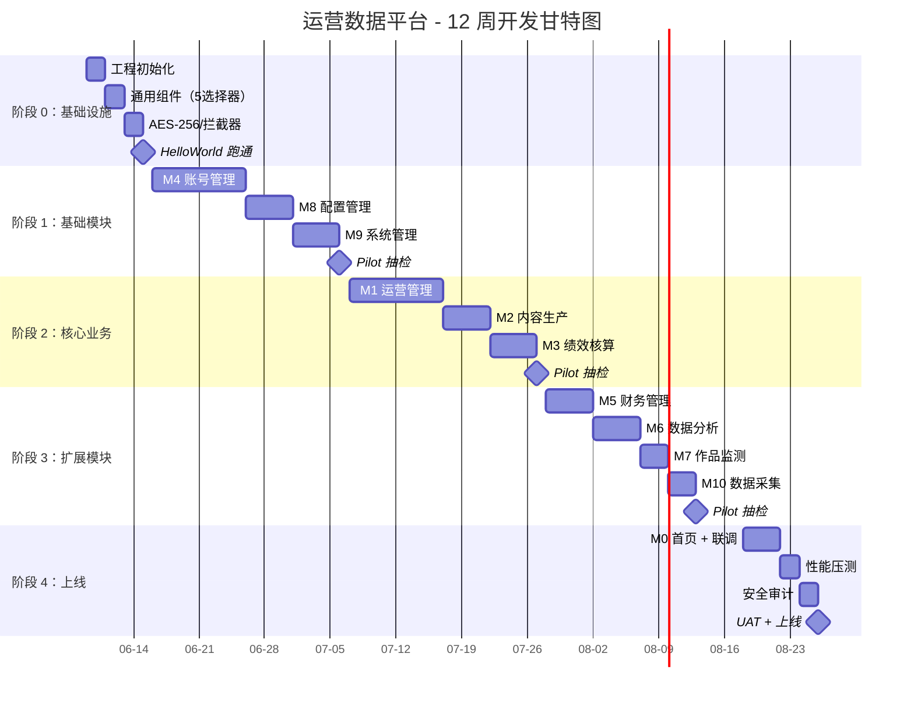

# 项目总览与甘特图

> **版本**：v1.0 | 2026-06-07
> **目的**：一张图看清项目全局
> **关联**：[`DEV-PLAN.md`](./DEV-PLAN.md) | [`QUALITY-GATES.md`](./QUALITY-GATES.md) | [`AI-IMPL-GUIDE.md`](./AI-IMPL-GUIDE.md)

---

## 1. 项目数据一览

| 项 | 数值 |
|----|------|
| **模块** | 11 个（M0-M10）|
| **文档** | 79 个（约 410 KB）|
| **Pilot** | 7 个（验证 93%）|
| **总工期** | 12 周（3 个月）|
| **迭代** | 8 个（S0-S8）|
| **团队** | 7 人 |
| **代码量** | 50K-100K 行 |
| **测试用例** | 200+ 条 |

---

## 2. 项目甘特图（Mermaid）



---

## 3. 模块优先级矩阵

| 优先级 | 模块 | 估时 | 文档完备度 | Pilot 评分 |
|--------|------|------|----------|----------|
| **P0** | M4 账号管理 | 2 周 | 95% | **94%** ⭐ |
| **P0** | M8 配置管理 | 1 周 | 90% | 94% |
| **P0** | M9 系统管理 | 1 周 | 85% | - |
| **P1** | M1 运营管理 | 2 周 | 90% | 94% |
| **P1** | M2 内容生产 | 1 周 | 85% | 92% |
| **P1** | M3 绩效核算 | 1 周 | 85% | - |
| **P2** | M5 财务管理 | 1 周 | 80% | 92% |
| **P2** | M6 数据分析 | 1 周 | 80% | - |
| **P2** | M7 作品监测 | 0.5 周 | 80% | - |
| **P2** | M10 数据采集 | 0.5 周 | 80% | 94% |
| **P3** | M0 首页 | 0.5 周 | 90% | - |

---

## 4. 文档体系架构图

```
┌─────────────────────────────────────────────────────────────┐
│                  运营数据平台 - 文档体系                        │
└─────────────────────────────────────────────────────────────┘
                              │
        ┌─────────────────────┼─────────────────────┐
        │                     │                     │
        ▼                     ▼                     ▼
  ┌──────────┐          ┌──────────┐          ┌──────────┐
  │  方法论  │          │  规范层  │          │  决策层  │
  │          │          │          │          │          │
  │ AI驱动   │          │ GLOBAL-  │          │ ADR-001  │
  │ 产品开发 │          │ CONVEN-  │          │ 中间件   │
  │ 方法论   │          │ TIONS    │          │          │
  │          │          │          │          │ ADR-002  │
  │ (5 段式  │          │ TECH-    │          │ 前端规范 │
  │  Prompt) │          │ CONSTRA- │          │          │
  │          │          │ INTS     │          │          │
  └──────────┘          └──────────┘          └──────────┘
                              │
        ┌─────────────────────┼─────────────────────┐
        ▼                     ▼                     ▼
  ┌──────────┐          ┌──────────┐          ┌──────────┐
  │  产品层  │          │ 工程层   │          │ 交付层   │
  │ (L1+L2)  │          │ (L3)     │          │ (L4+L5)  │
  │          │          │          │          │          │
  │ PRD × 11 │          │ API × 11 │          │ SLICES   │
  │ UX  × 11 │          │ STATE×11 │          │ × 11     │
  │          │          │          │          │ CHECK    │
  │          │          │          │          │ LIST×11  │
  │          │          │          │          │ TEST     │
  │          │          │          │          │ CASES×11 │
  └──────────┘          └──────────┘          └──────────┘
                              │
                              ▼
                      ┌──────────────┐
                      │ 验证层       │
                      │              │
                      │ Pilot × 7    │
                      │ 93% 综合评分 │
                      └──────────────┘
```

---

## 5. AI 实现工作流

```
┌────────────────────────────────────────────────────┐
│                  1. 阅读 5 文档                       │
│  PRD / UX / API / STATE / SLICES / TESTCASES        │
└────────────────────────────────────────────────────┘
                       ↓
┌────────────────────────────────────────────────────┐
│            2. 输出阻塞问题清单（如有）                │
│  → 产品确认 → 更新文档 → 继续                       │
└────────────────────────────────────────────────────┘
                       ↓
┌────────────────────────────────────────────────────┐
│            3. 五段式 Prompt 启动 AI                  │
│  Context / Task / Constraints / Deliverables / Self │
└────────────────────────────────────────────────────┘
                       ↓
┌────────────────────────────────────────────────────┐
│            4. AI 输出代码 + 自检                      │
│  DO / DTO / Service / Controller / Test             │
└────────────────────────────────────────────────────┘
                       ↓
┌────────────────────────────────────────────────────┐
│            5. 自动化扫描（CI）                        │
│  5 铁律 / 9 检查 / 字段一致性 / 字典 / 多租户        │
└────────────────────────────────────────────────────┘
                       ↓
┌────────────────────────────────────────────────────┐
│            6. 人工审查（1 审查者）                    │
│  按 QUALITY-GATES.md 清单                            │
└────────────────────────────────────────────────────┘
                       ↓
┌────────────────────────────────────────────────────┐
│            7. 合并到 main                            │
│  触发 Pilot 抽检（每迭代 1 个）                       │
└────────────────────────────────────────────────────┘
```

---

## 6. 关键指标（KPI）

### 6.1 质量指标

| 指标 | 目标 | 测量方法 |
|------|------|---------|
| 5 铁律符合率 | 100% | CI 扫描 |
| 测试覆盖率 | ≥ 80% | JaCoCo |
| F+P+E 用例通过率 | 100% | JUnit |
| 阻塞 PR 率 | < 5% | GitHub |
| Pilot 抽检通过率 | 100% | Pilot 报告 |

### 6.2 效率指标

| 指标 | 目标 | 测量 |
|------|------|------|
| AI 推断率 | ≤ 5% | Pilot |
| Slice 平均完成时间 | 3-5 天 | Jira |
| 审查反馈时间 | < 24h | GitHub |
| 文档与代码同步率 | 100% | diff 工具 |

### 6.3 业务指标

| 指标 | 目标 |
|------|------|
| 上线时间 | 12 周 |
| Bug 率 | < 0.5/Slice |
| 用户满意度 | ≥ 4/5 |
| 性能达标率 | 100% |

---

## 7. 风险与缓解

| 风险 | 概率 | 影响 | 缓解 |
|------|------|------|------|
| AI 推断过多 | 中 | 中 | 阻塞清单 + Pilot |
| 性能不达标 | 中 | 中 | 阶段 0 基线 + 阶段 4 压测 |
| 多租户漏洞 | 低 | 高 | AOP 强制 + 渗透测试 |
| 加密失效 | 低 | 高 | 单元测试 + 安全审计 |
| 团队不熟悉 AI | 高 | 中 | 培训 + Pair 工作 |
| 第三方依赖变更 | 中 | 中 | Lock 文件 + ADR |

---

## 8. 交付物清单

### 8.1 文档（已交付）

- ✅ 79 个产品/工程/交付文档
- ✅ 2 份顶层规范（GLOBAL-CONVENTIONS + TECH-CONSTRAINTS）
- ✅ 2 份 ADR（中间件 + 前端规范）
- ✅ 7 份 Pilot 报告
- ✅ 3 份开发规范（DEV-PLAN + AI-IMPL-GUIDE + QUALITY-GATES）
- ✅ 1 份项目总览（本文件）

### 8.2 代码（待交付）

- 后端：~50K 行 Java（Spring Boot 3 + MyBatis Plus）
- 前端：~30K 行 TypeScript（Vue 3 + Element Plus）
- DDL：~30 张表（oa_ 前缀）
- 测试：~200 条用例
- 工具：~5 个通用组件

### 8.3 部署（待交付）

- Docker Compose 配置
- 部署文档
- 运维手册
- 监控告警配置

---

## 9. 团队分工

| 角色 | 人数 | 职责 |
|------|------|------|
| **产品** | 1 | 需求澄清、阻塞问题确认、UAT |
| **后端** | 2 | Java/Spring Boot/状态机/测试 |
| **前端** | 2 | Vue 3/Element Plus/选择器/测试 |
| **测试** | 1 | F+P+E 用例 + Pilot 抽检 |
| **AI 协调** | 1 | 提示工程 + 代码审查 + 自动化脚本 |
| **合计** | **7** | |

---

## 10. 沟通机制

### 10.1 每日站会（15 min）

```
昨日：[完成内容]
今日：[计划内容]
阻塞：[问题列表]
```

### 10.2 周会（1h）

- 本周交付汇报
- Pilot 抽检结果
- 阻塞问题 review
- 下周计划

### 10.3 阶段评审（半天）

- 阶段交付 demo
- 质量指标 review
- 风险 review
- 下阶段计划

---

## 11. 投资回报

| 投入 | 产出 |
|------|------|
| 79 文档 + 7 Pilot + 3 规范 + 1 总览 | 11 模块完整产品 |
| 12 周工期 + 7 人团队 | 50K-100K 代码 |
| 100% 错误码/字典/多租户/加密一致性 | 节省 50-100 人天 |
| 1.7 推断/Pilot | 风险可控 |

---

## 12. 总结

| 维度 | 数据 |
|------|------|
| 项目规模 | 11 模块 / 79 文档 / 7 Pilot |
| 工期 | 12 周 / 8 迭代 / 5 阶段 |
| 质量 | 5 铁律 / 9 检查 / 3 级门控 |
| 团队 | 7 人 |
| 风险 | 中（有完整应对）|

**项目状态**：✅ 可启动
**下一步**：召开 Kick-off 会议，启动 S0 迭代
