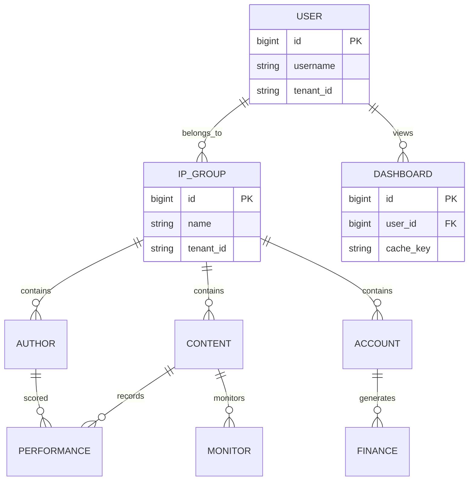
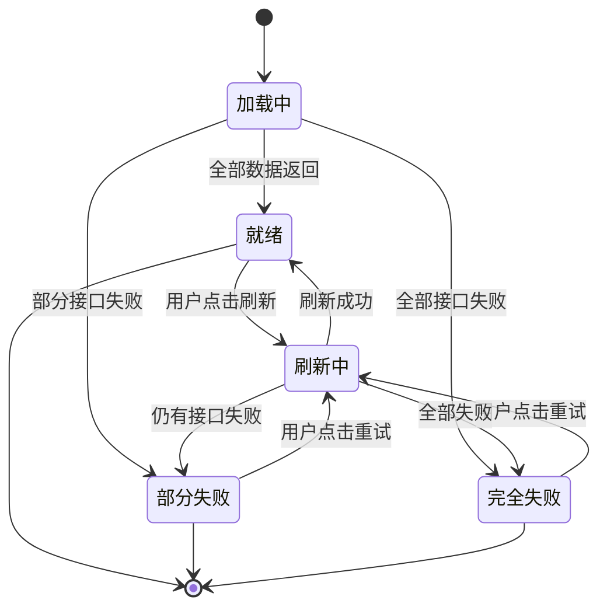

# STATE-M0-首页

> **版本**：v1.0 | 2026-06-07
> **关联 PRD**：[`PRD-M0-首页.md`](../product/PRD-M0-首页.md)

---

## 1. 状态机说明

M0 首页**无独立业务状态机**。它是一个**只读仪表盘**，所有数据来源于各业务模块的实体状态。

### 1.1 数据来源（复用状态）

| 展示数据 | 来源模块 | 状态字段 |
|---------|---------|---------|
| 总作者数 | M1 运营管理 | `oa_author.status` |
| 内容总数 | M2 内容生产 | `oa_content.status` |
| SOP 完成率 | M2 内容生产 | `oa_task.status` |
| 平均绩效 | M3 绩效核算 | `oa_perf_record.grade` |
| 平台分布 | M1/M2/M4 | `dict_platform_type` |
| 待办提醒 | 跨模块 | `oa_task` + `oa_alert` |

### 1.2 缓存状态

- 首页数据走本地缓存（`ConcurrentHashMap`）
- key = `userId:ipGroupId:dateRange`
- TTL = 5 分钟
- 手动刷新 → 清空当前用户缓存

### 1.3 业务规则

- **BR-M0-001**（一次加载）：首次进入加载所有数据，不轮询
- **BR-M0-002**（IP 组联动）：IP 组切换 → 全部数据刷新
- **BR-M0-003**（权限过滤）：所有数据按 BR-006 4 级权限过滤
- **BR-M0-004**（快捷入口）：基于用户权限动态渲染

---

## 2. 错误处理

- 任一接口失败 → 顶部 Banner + 重试
- 跨租户 → 错误码 1504
- 字典值不合法 → 错误码 1503

---

*下一步：基于本 STATE 规格生成 SLICES（已生成 `docs/delivery/SLICES-M0-首页.md`）。*

---

## 全局规范引用

> 本文档遵循 [`GLOBAL-CONVENTIONS.md`](./GLOBAL-CONVENTIONS.md) 中定义的全局规范：
> - 强关联属性 → 强制使用 5 类选择器组件（RealNameSelect / PhoneSelect / SimCardSelect / CompanySelect / AccountSelect），禁用手动输入
> - 枚举属性（方式/状态/类型/平台/阶段）→ 统一从数据字典（`dict_*`）选择，页面只读下拉
> - 跨租户 + 状态校验 → 错误码 1500-1504 统一语义
> - 数据安全 → 敏感字段（身份证/手机/API 密钥）强制脱敏展示，凭证类字段 AES-256 加密存储
> - 详见 [`GLOBAL-CONVENTIONS.md § 2`](./GLOBAL-CONVENTIONS.md) (字典)、[`§ 3`](./GLOBAL-CONVENTIONS.md) (选择器)、[`§ 4`](./GLOBAL-CONVENTIONS.md) (错误码)

---

## 核心 ER 图

详见 [`GLOBAL-CONVENTIONS.md § 1`](../engineering/GLOBAL-CONVENTIONS.md) (数据架构铁律)

---

## 数据状态机（缓存 + 权限）

虽然 M0 本身无业务实体，但**展示数据来源于各模块实体**，因此仍需要状态管理。

### 状态说明

| 状态 | 含义 | UI 表现 |
|------|------|---------|
| 加载中 | 首次进入或切换 IP 组 | 骨架屏 |
| 就绪 | 全部数据加载成功 | 正常数据展示 |
| 部分失败 | 至少 1 个接口失败 | 顶部 Banner 提示 + 重试 |
| 完全失败 | 全部接口失败 | 全屏错误 + 重试按钮 |
| 刷新中 | 用户主动刷新 | Loading |

### 转移约束

- `就绪 → 刷新中`：手动触发
- `刷新中 → 就绪`：所有数据返回
- `刷新中 → 部分失败/完全失败`：保留旧数据
- 跨租户 → 错误码 1504
- 字典值变更 → 错误码 1503

详见 [`GLOBAL-CONVENTIONS.md § 4`](../engineering/GLOBAL-CONVENTIONS.md) (错误码)
