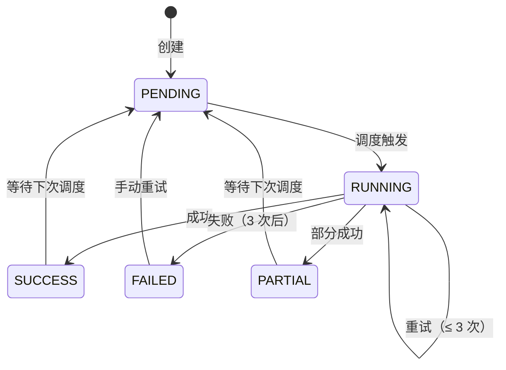
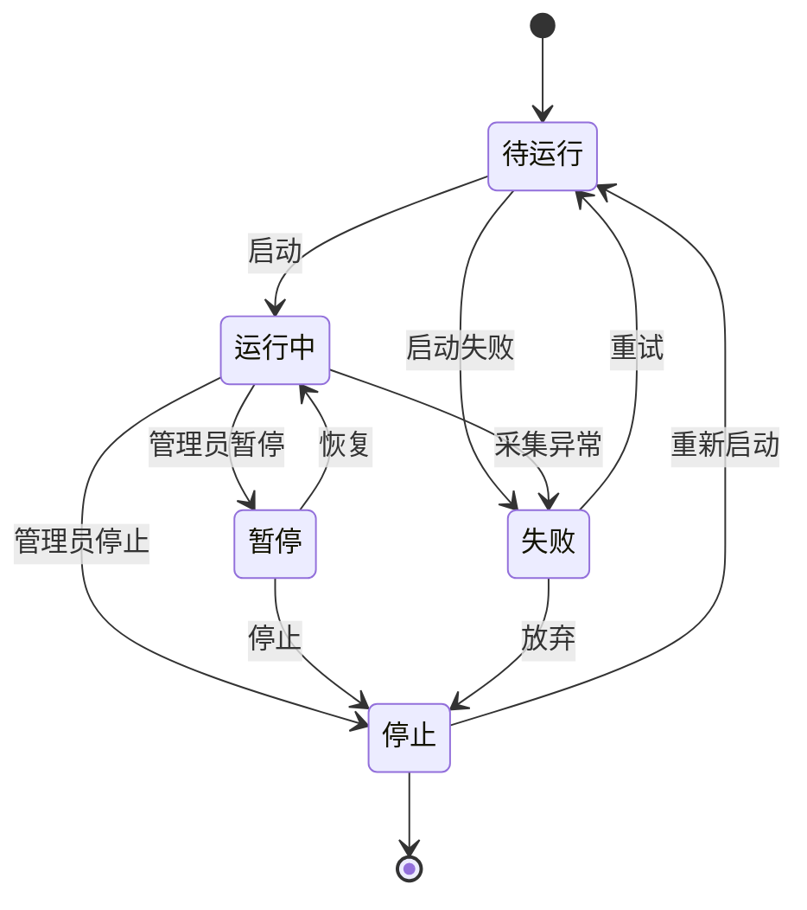
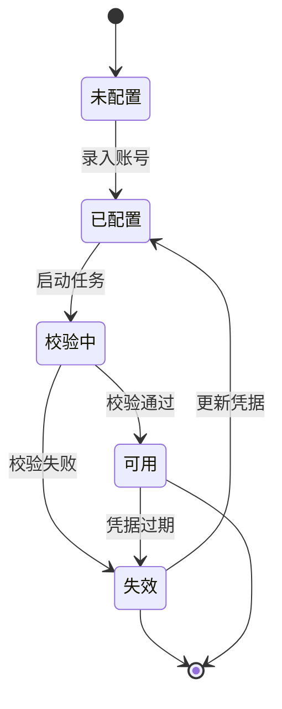

# STATE-M10-数据采集

> **版本**：v1.0 | 2026-06-07

---

## 1. 采集任务状态机

### 1.1 状态（`dict_collect_status`）

| 状态 | value | 含义 |
|------|-------|------|
| 待执行 | `PENDING` | 待调度 |
| 执行中 | `RUNNING` | 正在执行 |
| 成功 | `SUCCESS` | 执行成功 |
| 失败 | `FAILED` | 执行失败（3 次重试后） |
| 部分成功 | `PARTIAL` | 部分数据成功 |

### 1.2 状态机

### 1.3 重试策略

- 指数退避：1min, 5min, 15min
- 3 次失败后 → FAILED
- 失败告警 → 钉钉通知

---

## 2. 数据质量（无状态机）

- 检查结果记录到日志
- 优/良/中/差 为派生字段

---

*下一步：SLICES / CHECKLIST / TESTCASES。*

---

## 全局规范引用

> 本文档遵循 [`GLOBAL-CONVENTIONS.md`](./GLOBAL-CONVENTIONS.md) 中定义的全局规范：
> - 强关联属性 → 强制使用 5 类选择器组件（RealNameSelect / PhoneSelect / SimCardSelect / CompanySelect / AccountSelect），禁用手动输入
> - 枚举属性（方式/状态/类型/平台/阶段）→ 统一从数据字典（`dict_*`）选择，页面只读下拉
> - 跨租户 + 状态校验 → 错误码 1500-1504 统一语义
> - 数据安全 → 敏感字段（身份证/手机/API 密钥）强制脱敏展示，凭证类字段 AES-256 加密存储
> - 详见 [`GLOBAL-CONVENTIONS.md § 2`](./GLOBAL-CONVENTIONS.md) (字典)、[`§ 3`](./GLOBAL-CONVENTIONS.md) (选择器)、[`§ 4`](./GLOBAL-CONVENTIONS.md) (错误码)

---

## 核心状态机

### 1. 采集任务状态机

### 2. 凭据状态机

### 状态定义（dict 引用）

| 状态 | dict-type | 取值 |
|------|-----------|------|
| 采集任务状态 | `dict_collect_status` | 待运行/运行中/暂停/失败/停止 |
| 凭据状态 | `dict_auth_status` | 未配置/已配置/校验中/可用/失效 |

### 转移约束

| 转移 | 触发 | 错误码 |
|------|------|--------|
| 待运行 → 运行中 | 凭据可用 | 校验失败 → 1500 |
| 运行中 → 暂停 | admin | 1403（非 admin） |
| 任意 → 跨租户 | tenantId 不匹配 | 1504 |
| 字典非法 | 任意 | 1503 |
| Cookie 解密失败 | 任意 | 1500 |

详见 [`GLOBAL-CONVENTIONS.md § 5`](../engineering/GLOBAL-CONVENTIONS.md) (数据安全 - AES-256 加密存储)
