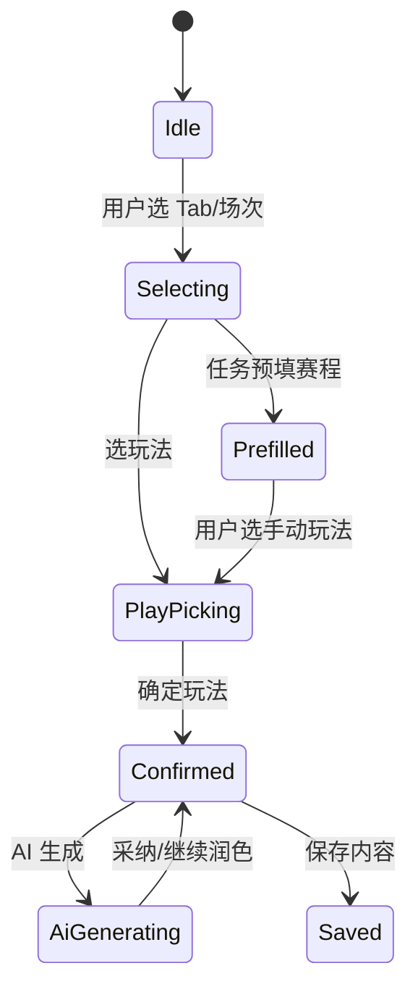

# STATE-M2-内容生产 — amphipoda 玩法对齐增量

> **版本**：v1.0 | 2026-08-31  
> **关联 ADR**：[ADR-076](../adr/ADR-076-OPS内容生产amphipoda玩法与matchScheme对齐.md)

---

## 1. 实体状态增量

### 1.1 `ProductionContent` 编辑态

| 字段 | 类型 | SSOT | 说明 |
|------|------|------|------|
| `matchType` | `1\|2\|3\|4\|5` | 用户 Tab 选择 | 与 amphipoda 一致 |
| `matchScheme` | `MatchSchemeItem[]` | 玩法区确认后 | 含 matchPlays |
| `playConfirmed` | boolean | 前端 | 「确定玩法」态；未确认不可 AI |
| `competitionIdsJson` | snapshot[] | 任务预填或保存快照 | 可选 |

### 1.2 与 Football 关系（不变 + 增强）

```
oa_production_content (workflow SSOT)
  │ match_scheme_json ──sync──► author_article.match_scheme
  │ match_type      ──sync──► author_article.match_type
  │ paid_body       ──sync──► author_article.content
  │ free_body       ──sync──► author_article.free_content
  └─ oa_production_content_ext.author_article_id
```

---

## 2. 前端状态机（ContentEditPanel）



| 转移 | 守卫 |
|------|------|
| → AiGenerating | `playConfirmed && matchScheme.length>=1 && 至少一场有 matchPlays` |
| → Saved | 现有标题/作者/IP 组校验 |

---

## 3. AI 会话态（AiContentDrawer）

| 字段 | 说明 |
|------|------|
| `conversationHistory` | UI 展示 + 传 API；jingcai 路径由 OPS 注入 requirements |
| `roundCount` | 1~10；≥2 触发润色组包 |
| `sessionId` | 不变 |

---

## 4. 存量兼容

| 存量 | 行为 |
|------|------|
| 仅 `competition_id` | 只读打开；列表用 competitionName |
| 已有 stub sync | 下次保存带 matchScheme 时全量覆盖 Football |
| `scheme_type` 有值 | 可带入 AI requirements；不参与 sync |

---

## 5. 任务 → 内容初始态

```json
{
  "matchType": 1,
  "matchScheme": [
    { "matchId": 123, "homeName": "A", "awayName": "B", "matchPlays": [] }
  ],
  "playConfirmed": false,
  "competitionIdsJson": [{ "scheduleId": "123", "label": "A VS B" }]
}
```

合并组：数组长度 = `task.competitions.length`。
