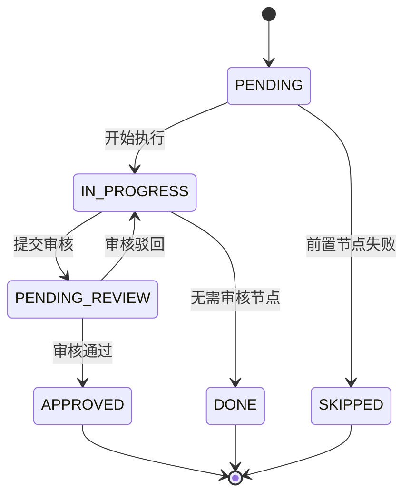
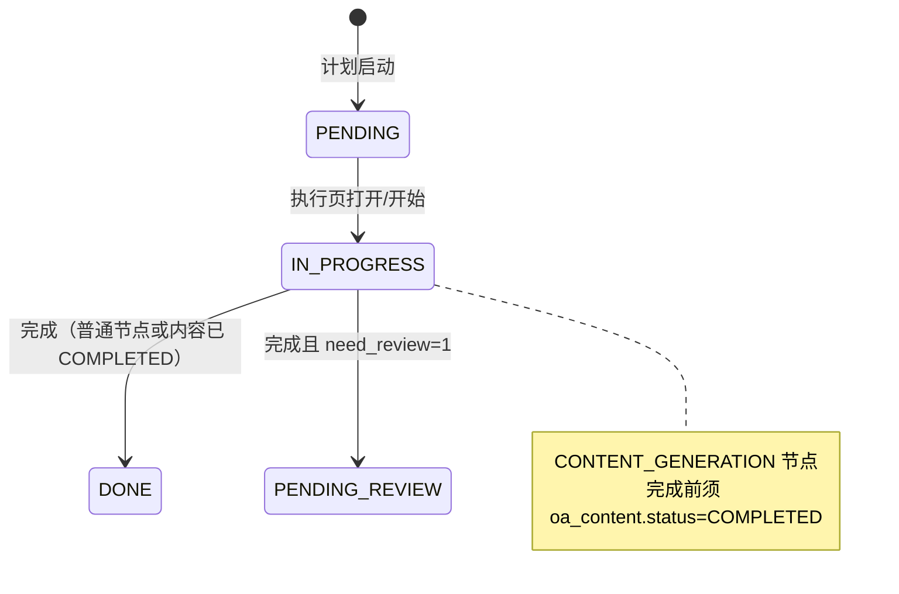
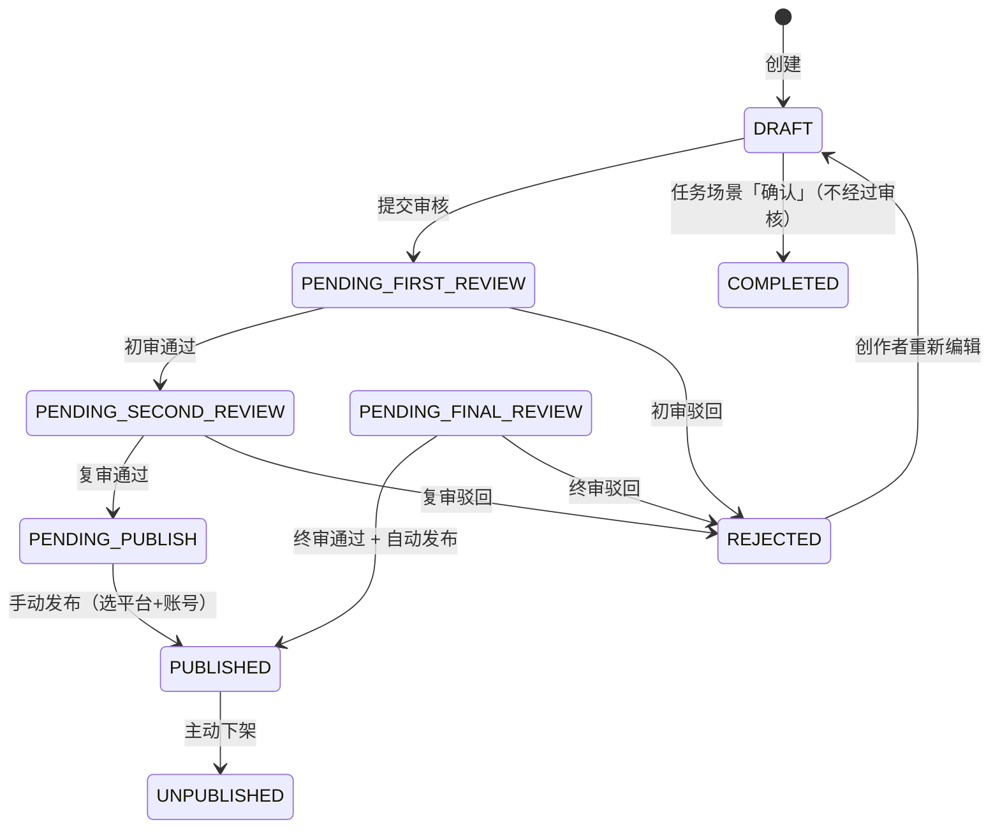
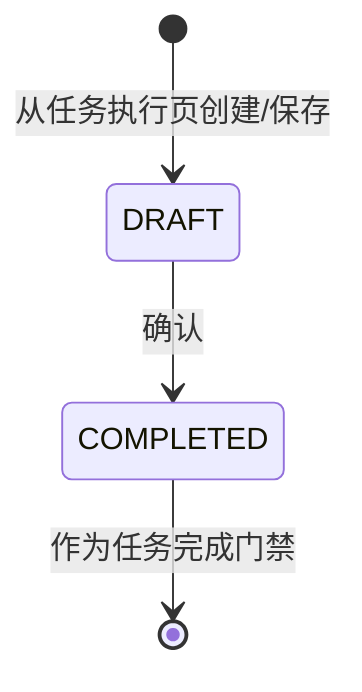
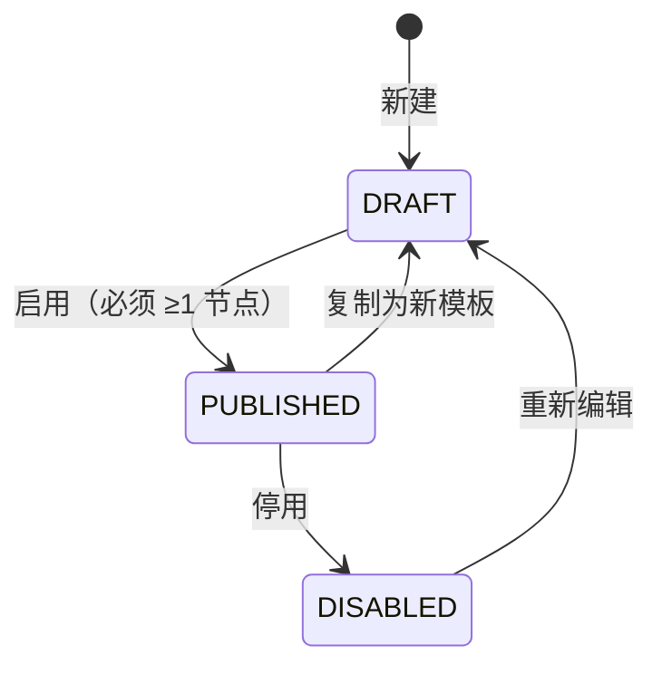
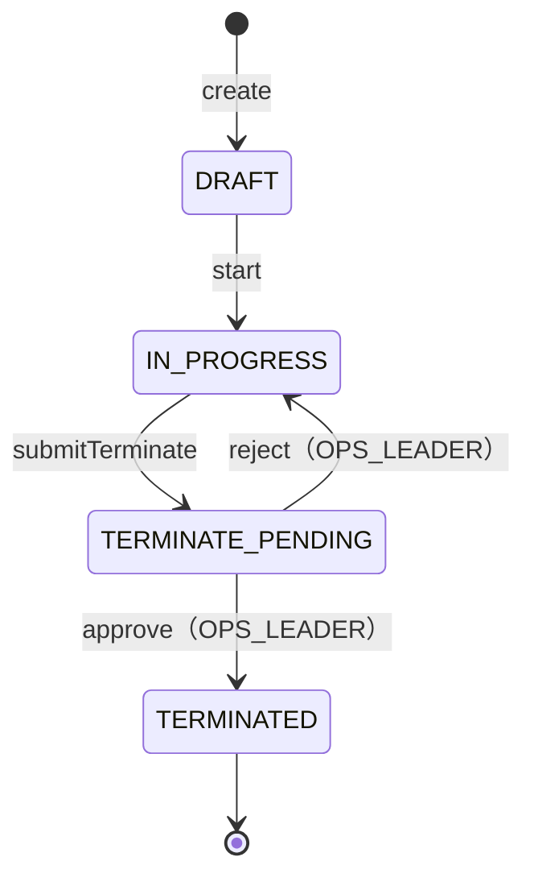
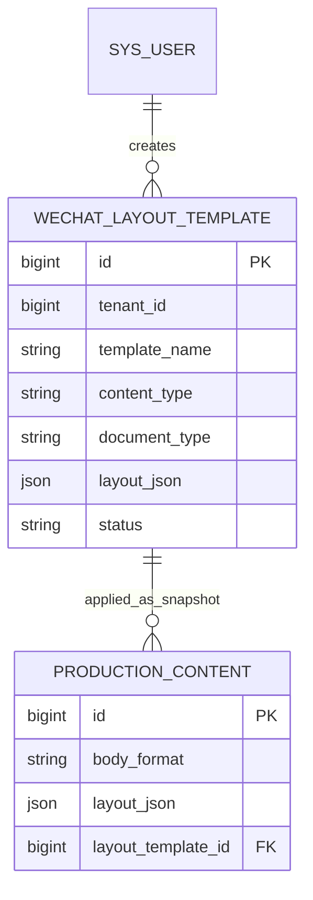
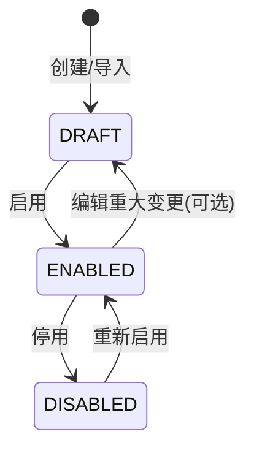

# STATE-M2-内容生产

> **版本**：v1.4 | 2026-06-14
> **关联 PRD**：[`PRD-M2-内容生产.md`](../product/PRD-M2-内容生产.md)
> **关联全局规范**：[`GLOBAL-CONVENTIONS.md`](./GLOBAL-CONVENTIONS.md)

---

## 1. SOP 任务状态机

### 1.1 状态定义

| 状态 | 字典 value | 含义 |
|------|-----------|------|
| 待执行 | `PENDING` | 任务创建，但前置节点未完成 |
| 执行中 | `IN_PROGRESS` | 执行人已开始 |
| 待审核 | `PENDING_REVIEW` | 已完成，需审核 |
| 审核通过 | `APPROVED` | 审核通过（最终态） |
| 审核驳回 | `REJECTED` | 审核驳回，回到执行中 |
| 已跳过 | `SKIPPED` | 因业务规则跳过（如并行组中其他节点失败） |
| 已完成 | `DONE` | 节点完成（仅适用于无需审核节点） |
| 已超时 | `TIMEOUT` | SLA 超时（事件型状态，不影响流程） |
| 计划草稿 | `PLAN_DRAFT` | 计划保存为草稿，任务未启动（ADR-012） |
| 已终止 | `TERMINATED` | 计划终止审批通过（ADR-012） |

> 计划草稿期任务另设 `visible_in_list=0`，任务列表 API 默认过滤。

### 1.2 状态机

### 1.3 转移约束

| From | To | 条件 | 副作用 |
|------|----|------|--------|
| PENDING | IN_PROGRESS | 当前用户 = `assignee_id` | 记录 `start_time` |
| IN_PROGRESS | DONE | `need_review=0` | DAG 计算后续节点 |
| IN_PROGRESS | PENDING_REVIEW | `need_review=1` | 创建 `oa_sop_review` 记录 |
| PENDING_REVIEW | APPROVED | 审核通过 | DAG 计算后续节点；通知执行人 |
| PENDING_REVIEW | IN_PROGRESS | 审核驳回 | 通知原执行人 |

### 1.4 业务规则索引

- **BR-011**（DAG 顺序激活）：前置节点未完成 → 后续节点 PENDING
- **BR-012**（并行组）：同 `parallel_group` 节点同时激活
- **BR-013**（SLA 超时）：超时 → 钉钉通知 + 标红
- **BR-014**（审核驳回）：驳回 → 状态回到 IN_PROGRESS
- **BR-015**（执行人变更）：任务分配后不可变更执行人
- **BR-016**（任务可撤回）：PENDING/IN_PROGRESS 可撤回
- **BR-017**（执行入口）：我的任务 + `PENDING` → 任务执行页（需求 4）
- **BR-018**（内容生成完成门禁）：`node_type=CONTENT_GENERATION` 须关联内容 `status=COMPLETED`（需求 5，ADR-016）

### 1.5 任务执行流（需求 4–5）

---

## 2. 内容可配置二级审核状态机（ADR-017）

> 原「三级审核」改为系统参数驱动；默认 **一级（IP 组长范围）+ 二级（部门负责人）** 均开启。

### 2.1 状态定义

| 状态 | 字典 value | 含义 |
|------|-----------|------|
| 草稿 | `DRAFT` | 创作者编辑中 |
| 待一级审核 | `PENDING_FIRST_REVIEW` | 已提交；一级 enabled |
| 待二级审核 | `PENDING_SECOND_REVIEW` | 一级通过；二级 enabled |
| 待终审 | `PENDING_FINAL_REVIEW` | **遗留**；默认配置不使用 |
| 已驳回 | `REJECTED` | 任一环节驳回 |
| 待发布 | `PENDING_PUBLISH` | 末级审核通过，待运营手动发布（ADR-022） |
| 已发布 | `PUBLISHED` | 手动发布成功 |
| 已下架 | `UNPUBLISHED` | 主动下架 |
| 已完成 | `COMPLETED` | 任务驱动创作确认完成（ADR-016；**不**等同已发布） |

> `COMPLETED` 为任务场景遗留；新流程统一 **submit-review**（ADR-017）。审核均关闭 → 提交后 `PENDING_PUBLISH`（ADR-022 手动发布）。

### 2.2 状态机

### 2.2.1 任务驱动内容子状态机（需求 6）

### 2.3 转移约束

| From | To | 条件 | 副作用 |
|------|----|------|--------|
| DRAFT | PENDING_FIRST_REVIEW | 创作者提交 | 创建 `oa_review_record` |
| PENDING_FIRST_REVIEW | PENDING_SECOND_REVIEW | 初审人通过 | 通知复审人 |
| PENDING_FIRST_REVIEW | REJECTED | 初审人驳回 | 通知创作者 |
| PENDING_SECOND_REVIEW | PENDING_PUBLISH | 复审人通过 | 待运营发布 |
| PENDING_SECOND_REVIEW | REJECTED | 复审人驳回 | 通知创作者 |
| PENDING_PUBLISH | PUBLISHED | 运营发布成功 | 写入 `oa_content_publish_record` |
| PENDING_FINAL_REVIEW | PUBLISHED | 终审人通过 | 触发 `@Async` 发布 |
| PENDING_FINAL_REVIEW | REJECTED | 终审人驳回 | 通知创作者 |
| REJECTED | DRAFT | 创作者编辑 | 重新进入草稿 |
| PUBLISHED | UNPUBLISHED | 主动下架 | 撤销已发布内容 |

### 2.4 业务规则索引

- **BR-021**（三级串行）：任一环节驳回 → 流程结束
- **BR-022**（AI 内容必须人工审核）：`ai_generated=1` 必须走完三级
- **BR-023**（手动发布）：末级审核通过 → `PENDING_PUBLISH`；运营调用 `POST /publish`（ADR-022）
- **BR-024**（内容审核权限）：仅匹配阶段的审核人可操作
- **BR-025**（驳回可重新编辑）：被驳回后创作者可重新编辑并再次提交

---

## 3. SOP 模板启用状态

### 3.1 状态定义

| 状态 | 字典 value | 含义 |
|------|-----------|------|
| 草稿 | `DRAFT` | 模板编辑中，未启用 |
| 已发布 | `PUBLISHED` | 模板启用中 |
| 已停用 | `DISABLED` | 模板停用 |

### 3.2 状态机

### 3.3 业务规则

- 启用前必须 ≥ 1 节点
- 已发布的模板编辑后会自动变回 DRAFT（需重新启用）
- 停用的模板**不能**被新任务引用

---

## 4. 计划状态机（FR-M2-009）

### 4.1 状态定义（`dict_plan_status`）

| 状态 | value | 含义 |
|------|-------|------|
| 草稿 | `DRAFT` | 已保存，任务 PLAN_DRAFT 且不可见 |
| 进行中 | `IN_PROGRESS` | 已启动，任务 PENDING 且可见 |
| 终止审批中 | `TERMINATE_PENDING` | 已提交终止申请 |
| 已终止 | `TERMINATED` | 组长批准终止 |

### 4.2 状态机

### 4.3 联动副作用

| 转移 | 任务副作用 |
|------|-----------|
| create | 每 (node, assignee) 插入 `oa_task`：`PLAN_DRAFT` + `visible_in_list=0` + `competition_id` 继承 step |
| start | 计划任务 → `PENDING` + `visible_in_list=1` |
| approve 终止 | 计划任务 → `TERMINATED` |

---

## 5. 知识库状态（轻量）

仅 `is_public`（公开/私有）+ `status`（草稿/已发布）。

详见 `oa_knowledge_base` 表，无复杂状态机。

---

## 6. 公推模板库实体与内容版式（FR-M2-005 · 草案）

> **ADR**：[`ADR-019`](../adr/ADR-019-M2-公推模板库存储与导入.md)

### 6.1 实体：`oa_wechat_layout_template`

| 字段 | 类型 | 说明 |
|------|------|------|
| `id` | BIGINT PK | - |
| `tenant_id` | BIGINT | 租户隔离 |
| `template_name` | VARCHAR(100) | 模板名称 |
| `description` | VARCHAR(500) | 描述 |
| `content_type` | VARCHAR(20) | 固定 `ARTICLE` |
| `document_type` | VARCHAR(50) | `dict_document_type`，**可 NULL**（通用模板） |
| `layout_json` | JSON | 块结构 SSOT |
| `layout_html` | LONGTEXT | 渲染+消毒 HTML |
| `thumbnail_url` | VARCHAR(512) | 列表缩略图 |
| `source_type` | VARCHAR(30) | `dict_layout_template_source` |
| `source_url` | VARCHAR(1024) | 导入来源 URL |
| `status` | VARCHAR(20) | `dict_layout_template_status` |
| `creator_user_id` | BIGINT | FK → `sys_user` |
| 审计字段 | | `created_at` / `updated_at` / `deleted` |

**ER**：

### 6.2 内容表扩展：`oa_production_content`

| 字段 | 类型 | 说明 |
|------|------|------|
| `body_format` | VARCHAR(20) | `dict_content_body_format`：`PLAIN` / `LAYOUT` |
| `layout_json` | JSON | 富版式正文（`body_format=LAYOUT` 时 SSOT） |
| `layout_html` | LONGTEXT | 只读展示（查看/审核/列表摘要） |
| `layout_template_id` | BIGINT | FK → `oa_wechat_layout_template`，**可 NULL**；仅记录应用来源 |
| `transferred_to_knowledge` | TINYINT(1) | 是否已转知识库（0/1，ADR-023） |
| `knowledge_id` | BIGINT | FK → `oa_knowledge_base`，转入后写入 |

**与现有 `body` 关系**：

| `body_format` | `body` | `layout_json` | 编辑 UX |
|---------------|--------|---------------|---------|
| `PLAIN` | 主正文 | NULL | Textarea（现状） |
| `LAYOUT` | 可选摘要/AI 纯文本 | 主正文 | LayoutEditor |

### 6.3 模板状态（`dict_layout_template_status`）

| 状态 | value | 含义 |
|------|-------|------|
| 草稿 | `DRAFT` | 导入后未确认 / 编辑中 |
| 已启用 | `ENABLED` | 可在内容创作中选择 |
| 已停用 | `DISABLED` | 不可选；已应用的内容不受影响 |

### 6.4 导入 Job（可选表 `oa_layout_import_job`）

| 状态 | value |
|------|-------|
| 待处理 | `PENDING` |
| 执行中 | `RUNNING` |
| 成功 | `SUCCESS` |
| 失败 | `FAILED` |

### 6.5 业务规则索引

- **BR-031**（类型匹配）：应用模板时 `content_type=ARTICLE` 且 document_type 规则见 ADR-019 §2.3
- **BR-032**（快照复制）：应用模板 = 复制 JSON/HTML，模板后续变更 **不** 影响已创建内容
- **BR-033**（审核展示）：审核/查看 **必须** 使用 `layout_html` 渲染，禁止仅展示 `body` 当 `body_format=LAYOUT`
- **BR-034**（租户隔离）：模板 CRUD/列表 `tenant_id` 过滤（1504）

### 6.6 新增字典（Accept ADR-019 后登记 GLOBAL-CONVENTIONS）

| dict_type | 值示例 |
|-----------|--------|
| `dict_content_body_format` | PLAIN / LAYOUT |
| `dict_layout_template_status` | DRAFT / ENABLED / DISABLED |
| `dict_layout_template_source` | MANUAL / URL / DOCX / PASTE |

---

*下一步：SLICES / CHECKLIST / TESTCASES。*
