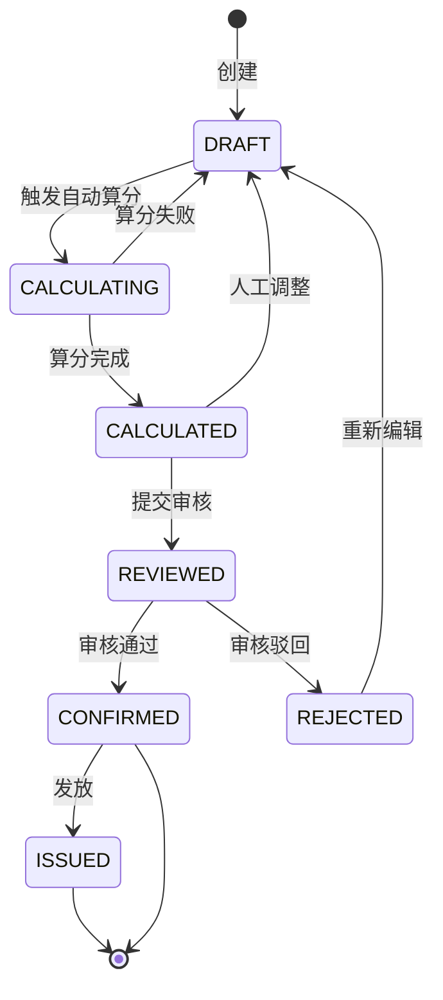
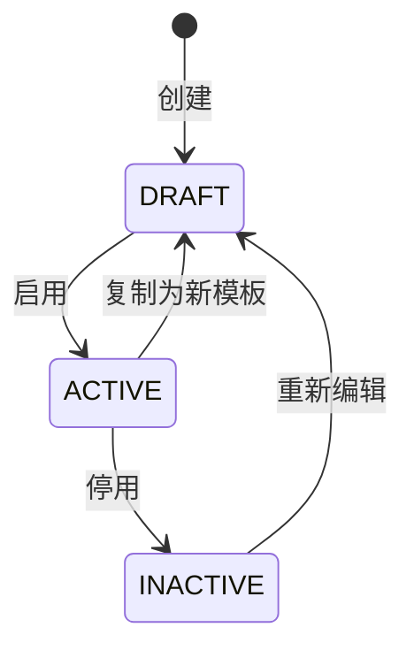

# STATE-M3-绩效核算

> **版本**：v1.0 | 2026-06-07
> **关联 PRD**：[`PRD-M3-绩效核算.md`](../product/PRD-M3-绩效核算.md)
> **关联全局规范**：[`GLOBAL-CONVENTIONS.md`](./GLOBAL-CONVENTIONS.md)

---

## 1. 考核记录状态机

### 1.1 状态定义（`dict_perf_status`）

| 状态 | 字典 value | 含义 |
|------|-----------|------|
| 草稿 | `DRAFT` | 考核人创建，尚未计算/确认 |
| 计算中 | `CALCULATING` | 自动算分执行中 |
| 已计算 | `CALCULATED` | 自动算分完成 |
| 已审核 | `REVIEWED` | 部门负责人审核 |
| 已确认 | `CONFIRMED` | 最终确认，锁定 |
| 已发放 | `ISSUED` | 与薪酬挂钩 |
| 已驳回 | `REJECTED` | 审核驳回（可重提） |

### 1.2 状态机

### 1.3 转移约束

| From | To | 条件 | 副作用 |
|------|----|------|--------|
| DRAFT | CALCULATING | 点击"自动算分" | 异步任务 |
| CALCULATING | CALCULATED | 算分成功 | 写入 item 记录 |
| CALCULATED | DRAFT | 点击"调整" | - |
| CALCULATED | REVIEWED | 点击"提交审核" | 通知审核人 |
| REVIEWED | CONFIRMED | 审核通过 | 锁定记录 |
| REVIEWED | REJECTED | 审核驳回 | 通知考核人 |
| CONFIRMED | ISSUED | 财务触发 | 触发薪酬接口 |

### 1.4 业务规则索引

- **BR-031**（每周期单条记录）：同周期内同员工仅 1 条
- **BR-032**（自动算分必须计算所有指标）：未达成的指标 score=0
- **BR-033**（人工调整后必须重算总分）
- **BR-034**（确认后不可修改）
- **BR-035**（调整幅度 ≤ 20%）

---

## 2. 考核模板状态机

### 2.1 状态

- **草稿** `DRAFT` / **启用** `ACTIVE` / **停用** `INACTIVE`

### 2.2 转移

### 2.3 业务规则

- 每岗位仅 1 个 ACTIVE 模板
- ACTIVE → 启动新模板时自动 INACTIVE 旧模板
- ACTIVE 模板被新任务引用后，停用不影响历史任务

---

## 3. 订单归因（无状态机）

订单归因为**只读**统计，无状态机。

---

*下一步：SLICES / CHECKLIST / TESTCASES。*
