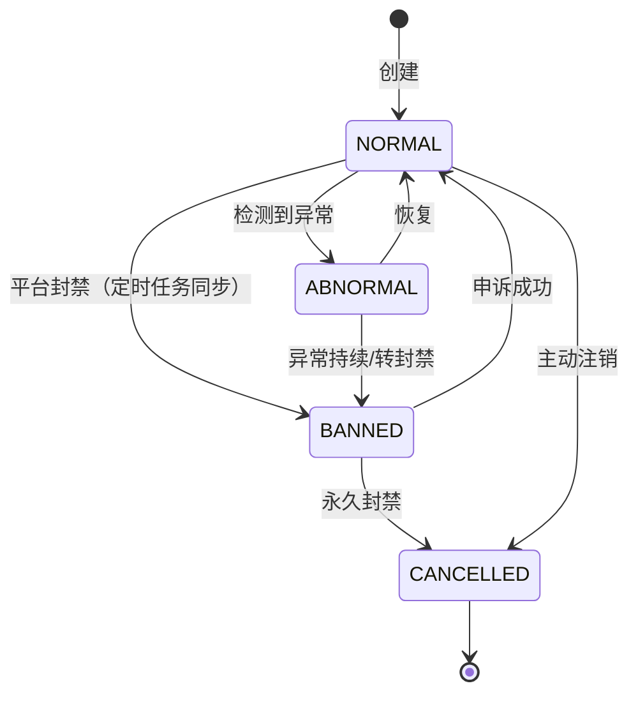

# STATE-M4-账号管理

> **版本**：v1.0 | 2026-06-07
> **关联 PRD**：[`PRD-M4-账号管理.md`](../product/PRD-M4-账号管理.md)
> **关联全局规范**：[`GLOBAL-CONVENTIONS.md`](./GLOBAL-CONVENTIONS.md)

---

## 1. 平台账号状态机

### 1.1 状态定义（`dict_account_status`）

| 状态 | 字典 value | 含义 |
|------|-----------|------|
| 正常 | `NORMAL` | 账号正常使用 |
| 异常 | `ABNORMAL` | 数据异常/登录异常 |
| 封禁 | `BANNED` | 平台封禁 |
| 注销 | `CANCELLED` | 已注销 |

### 1.2 状态机



### 1.3 转移约束

| From | To | 条件 | 副作用 |
|------|----|------|--------|
| NORMAL | ABNORMAL | 定时任务检测到数据缺失/异常 | 触发告警 |
| NORMAL | BANNED | 平台推送封禁事件 | 通知运营 |
| ABNORMAL | NORMAL | 手动恢复 | - |
| BANNED | NORMAL | 手动标记"申诉成功" | 重新拉取数据 |
| NORMAL | CANCELLED | 主动注销 | 软删除 |
| BANNED | CANCELLED | 永久封禁 | 软删除 |

### 1.4 业务规则索引

- **BR-M4-011**（状态变更自动同步数据）：BANNED → NORMAL 触发重新拉取
- **BR-M4-012**（状态变更触发告警）：BANNED → 自动钉钉通知运营
- **BR-M4-013**（软删除）：CANCELLED 状态保留 90 天

---

## 2. 实名人状态机

### 2.1 状态

- 启用 / 停用

### 2.2 规则

- 停用 → 拒绝被新账号引用（错误码 1501）
- 已有引用 → 停用失败（错误码 1502）

---

## 3. 手机/手机卡状态机

### 3.1 手机

- 在用 / 闲置 / 损坏 / 丢失

### 3.2 手机卡

- 在用 / 闲置 / 停机 / 注销

### 3.3 规则

- 停机/注销 → 不可被新账号引用
- 注销 → 物理删除

---

## 4. 公司状态机

- 启用 / 停用

停用后不可被新账号引用；历史账号保留。

---

## 5. 中介人（无状态机）

中介人为辅助数据，无独立状态机。

---

## 6. 个人账号（个微/企微）

- 启用 / 停用 / 注销

---

*下一步：SLICES / CHECKLIST / TESTCASES。*


---

## 5. 强关联选择器约束（🔴 状态机必含）

M4 模块所有"关联到其他实体"的状态变更都必须通过强关联选择器，禁止手动输入。

### 5.1 5 类强关联选择器

| 选择器 | 关联实体 | 关联字段 | 状态约束 |
|--------|---------|---------|---------|
| `<RealNameSelect />` | 实名人 | `realnameId` | 仅"启用"+本租户+未停用 |
| `<PhoneSelect />` | 手机 | `phoneId` | 仅"启用"+本租户+未停用 |
| `<SimCardSelect />` | 手机卡 | `simCardId` | 仅"启用"+本租户+未停用 |
| `<CompanySelect />` | 公司 | `companyId` | 仅"启用"+本租户+未停用 |
| `<AccountSelect />` | 平台账号 | `accountId` | 同平台+启用+本租户 |

### 5.2 状态变更时的选择器约束

| 状态转移 | 必选选择器 | 错误码（约束不满足时） |
|---------|-----------|---------------------|
| 账号创建 → 选择实名人 | `<RealNameSelect />` | 1501 / 1504 |
| 账号创建 → 选择手机 | `<PhoneSelect />` | 1501 / 1504 |
| 账号创建 → 选择手机卡 | `<SimCardSelect />` | 1501 / 1504 |
| 账号创建 → 选择公司 | `<CompanySelect />` | 1501 / 1504 |
| 账号绑定 → 选择平台账号 | `<AccountSelect />` | 1501 / 1504 |
| 账号解绑 → 强制替换 | `<RealNameSelect />` + `forceReplace=true` | 1502 |

### 5.3 状态机 × 选择器约束

```
[未激活] --(选择 RealName + Phone + SimCard)--> [已绑定/待激活]
[已绑定/待激活] --(选择 Account)--> [运营中]
[运营中] --(选择 强制替换 RealName)--> [运营中] (replace)
[运营中] --(选择 Company 切换)--> [运营中] (transfer)
[运营中] --> [停用] (无选择器)
[停用] --> [注销] (无选择器)
```

### 5.3.1 联动状态机事件命名

| 实体 | 状态机事件 | 触发条件 | 错误码 |
|------|----------|---------|--------|
| Realname | `BOUND` | 账号创建/绑定时 | - |
| Realname | `UNBOUND` | 账号删除/强制替换时 | - |
| Realname | `DISABLE` | 管理员停用 | 1501 |
| Realname | `ENABLE` | 管理员启用 | - |
| Phone | `BOUND` / `UNBOUND` | 同 Realname | - |
| SimCard | `BOUND` / `UNBOUND` | 同 Realname | - |
| Company | 不进入状态机 | 仅关联 | 1501 |
| Account | `CREATE` / `ENABLE` / `DISABLE` / `LOGOUT` | 业务操作 | 1500 |

**事件命名规范**：`{动作}_{对象}`，全部大写下划线。

**BOUND 状态机联动**：
- 账号创建成功 → Realname/Phone/SimCard 同步触发 `BOUND` 事件
- 强制替换 → 旧实体触发 `UNBOUND`，新实体触发 `BOUND`
- 账号删除 → 所有关联实体触发 `UNBOUND`

### 5.4 错误码语义

- 1500：选择器未传 / 参数格式错误
- 1501：关联实体不存在
- 1502：关联实体已绑定（需强制替换）
- 1503：字典值不合法
- 1504：跨租户访问

详见 [`GLOBAL-CONVENTIONS.md § 3.1`](./GLOBAL-CONVENTIONS.md) (选择器)、[`§ 4`](./GLOBAL-CONVENTIONS.md) (错误码)

