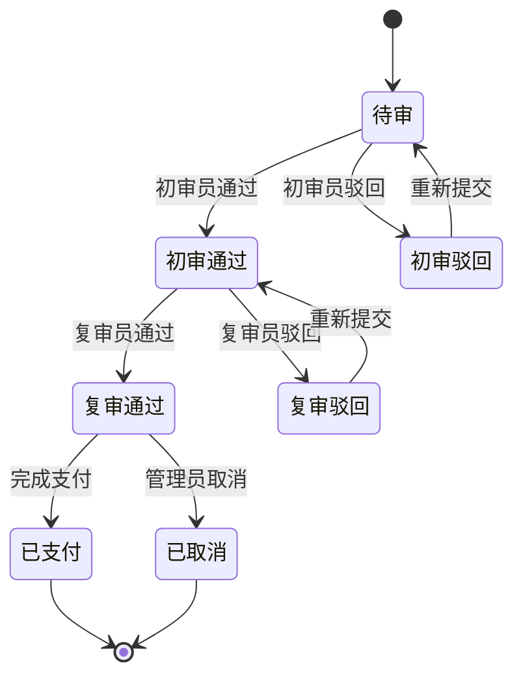

# STATE-M5-财务管理

> **版本**：v1.0 | 2026-06-07
> **关联全局规范**：[`GLOBAL-CONVENTIONS.md`](./GLOBAL-CONVENTIONS.md)

---

## 1. 成本状态

成本为只读数据，**无状态机**。

- 录入后不可修改（只能作废 + 重录）
- 作废 → 软删除（`status=0`），保留审计

---

## 2. ROI（无状态机）

ROI 为聚合统计，无状态机。

- 5min 定时任务刷新
- 实时查询 → 优先缓存

---

*下一步：SLICES / CHECKLIST / TESTCASES。*

---

## 1. 核心状态机

### 1.1 财务记录状态机

### 1.2 字典引用

| 字段 | dict-type | 取值 |
|------|-----------|------|
| recordType | `dict_finance_type` | 收入/支出/转账/退款 |
| payMethod | `dict_pay_method` | 微信/支付宝/银行卡/对公转账 |
| status | `dict_finance_status` | 待审/初审/复审/已支付/已取消 |
| voucherType | `dict_voucher_type` | 发票/收据/合同/无 |

### 1.3 业务规则

- **BR-M5-001**：金额必须 > 0
- **BR-M5-002**：初审通过后才能复审
- **BR-M5-003**：跨租户 → 错误码 1504
- **BR-M5-004**：字典值非法 → 错误码 1503

详见 [`GLOBAL-CONVENTIONS.md § 4`](../GLOBAL-CONVENTIONS.md)
