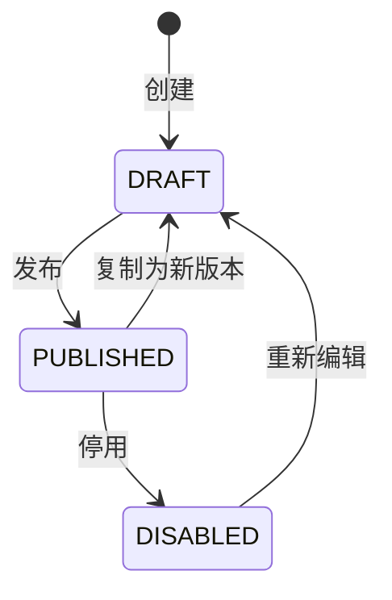
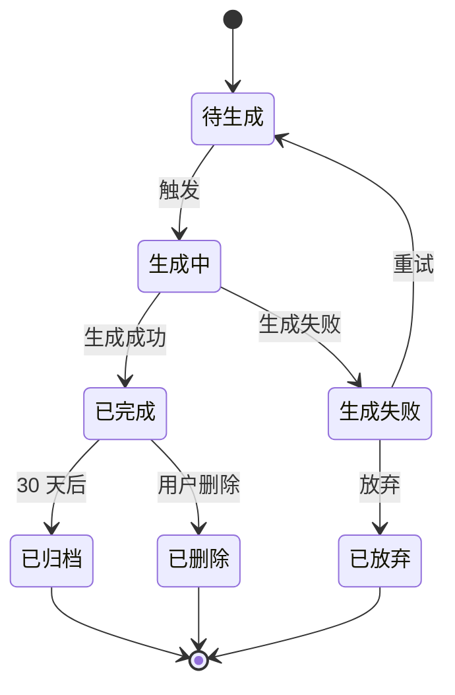
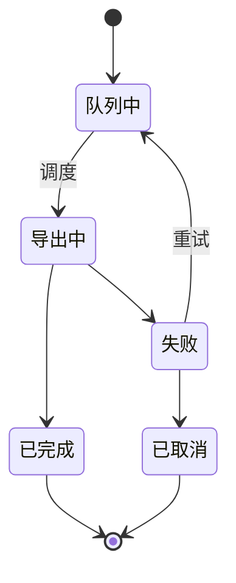

# STATE-M6-数据分析

> **版本**：v1.0 | 2026-06-07
> **关联全局规范**：[`GLOBAL-CONVENTIONS.md`](./GLOBAL-CONVENTIONS.md)

---

## 1. 指标（无状态机）

- 草稿 / 已发布 / 已停用
- 引用前必须 = 已发布

---

## 2. 漏斗（无状态机）

- 草稿 / 已发布 / 已停用

---

## 3. 自定义查询状态机

### 3.1 状态（`dict_query_status`）

| 状态 | 字典 value |
|------|-----------|
| 草稿 | `DRAFT` |
| 已发布 | `PUBLISHED` |
| 已停用 | `DISABLED` |

### 3.2 状态机

---

## 4. 大屏状态

- 草稿 / 已发布 / 已停用

---

*下一步：SLICES / CHECKLIST / TESTCASES。*

---

## 1. 核心状态机

### 1.1 报表任务状态机

### 1.2 导出任务状态机

### 1.3 字典引用

| 字段 | dict-type | 取值 |
|------|-----------|------|
| reportType | `dict_report_type` | 日报/周报/月报/自定义 |
| dim | `dict_report_dim` | 平台/IP组/作者/时间 |
| metric | `dict_metric_type` | 浏览/点赞/评论/转化 |
| exportFormat | `dict_export_format` | Excel/CSV/PDF |

### 1.4 业务规则

- **BR-M6-001**：自定义时间范围 endDate >= startDate
- **BR-M6-002**：跨租户 → 错误码 1504
- **BR-M6-003**：字典值非法 → 错误码 1503

详见 [`GLOBAL-CONVENTIONS.md § 4`](../GLOBAL-CONVENTIONS.md)
