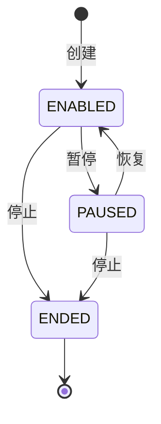
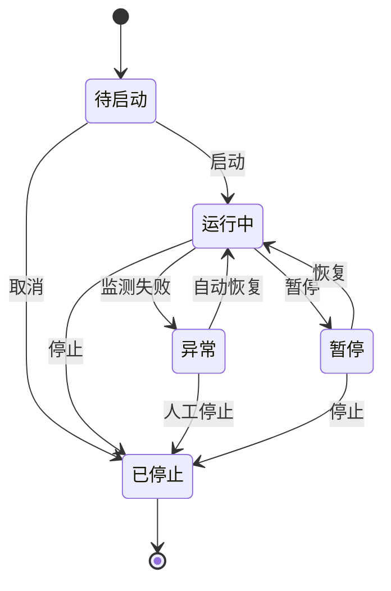
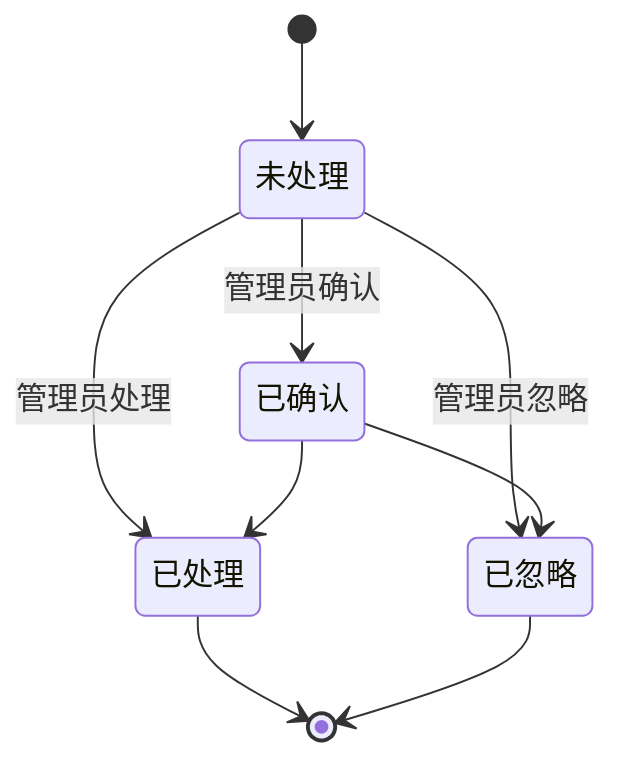

# STATE-M7-作品监测

> **版本**：v1.0 | 2026-06-07

---

## 1. 监测状态机

### 1.1 状态（`dict_monitor_status`）

| 状态 | value | 含义 |
|------|-------|------|
| 启用 | `ENABLED` | 监测中 |
| 暂停 | `PAUSED` | 暂停 |
| 已结束 | `ENDED` | 停止 |

### 1.2 状态机

---

*下一步：SLICES / CHECKLIST / TESTCASES。*

---

## 全局规范引用

> 本文档遵循 [`GLOBAL-CONVENTIONS.md`](./GLOBAL-CONVENTIONS.md) 中定义的全局规范：
> - 强关联属性 → 强制使用 5 类选择器组件（RealNameSelect / PhoneSelect / SimCardSelect / CompanySelect / AccountSelect），禁用手动输入
> - 枚举属性（方式/状态/类型/平台/阶段）→ 统一从数据字典（`dict_*`）选择，页面只读下拉
> - 跨租户 + 状态校验 → 错误码 1500-1504 统一语义
> - 数据安全 → 敏感字段（身份证/手机/API 密钥）强制脱敏展示，凭证类字段 AES-256 加密存储
> - 详见 [`GLOBAL-CONVENTIONS.md § 2`](./GLOBAL-CONVENTIONS.md) (字典)、[`§ 3`](./GLOBAL-CONVENTIONS.md) (选择器)、[`§ 4`](./GLOBAL-CONVENTIONS.md) (错误码)

---

## 1. 核心状态机

### 1.1 监测任务状态机

### 1.2 告警状态机

### 1.3 字典引用

| 字段 | dict-type | 取值 |
|------|-----------|------|
| monitorFreq | `dict_monitor_freq` | 5min/30min/1h/24h |
| alertLevel | `dict_alert_level` | 低/中/高/紧急 |
| workType | `dict_work_type` | 视频/图文/直播/动态 |
| alertType | `dict_alert_type` | 流量异常/评论异常/删除/限流 |

### 1.4 业务规则

- **BR-M7-001**：URL 必须以 http(s):// 开头
- **BR-M7-002**：监测频率必须从字典取值
- **BR-M7-003**：跨租户 → 错误码 1504
- **BR-M7-004**：账号选择器缺失 → 错误码 1501

详见 [`GLOBAL-CONVENTIONS.md § 4`](../GLOBAL-CONVENTIONS.md)
