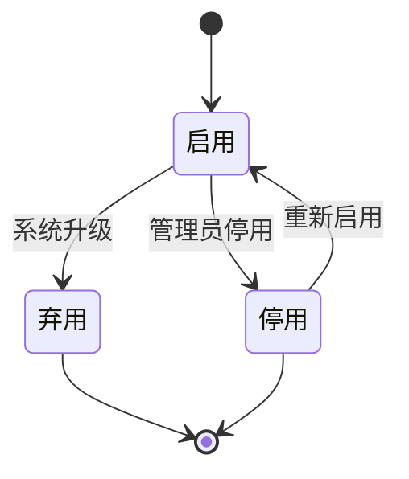
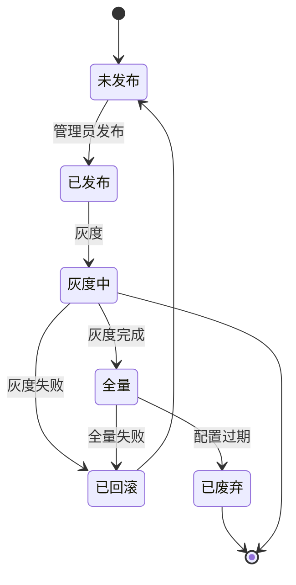

# STATE-M8-配置管理

> **版本**：v1.0 | 2026-06-07

---

## 1. 采集配置状态

`dict_collect_status`：
- 待执行 / 执行中 / 成功 / 失败 / 部分成功

---

## 2. 阈值配置（无状态机）

阈值配置为只读 + 启用/停用，无状态机。

---

*下一步：SLICES / CHECKLIST / TESTCASES。*

---

## 全局规范引用

> 本文档遵循 [`GLOBAL-CONVENTIONS.md`](./GLOBAL-CONVENTIONS.md) 中定义的全局规范：
> - 强关联属性 → 强制使用 5 类选择器组件（RealNameSelect / PhoneSelect / SimCardSelect / CompanySelect / AccountSelect），禁用手动输入
> - 枚举属性（方式/状态/类型/平台/阶段）→ 统一从数据字典（`dict_*`）选择，页面只读下拉
> - 跨租户 + 状态校验 → 错误码 1500-1504 统一语义
> - 数据安全 → 敏感字段（身份证/手机/API 密钥）强制脱敏展示，凭证类字段 AES-256 加密存储
> - 详见 [`GLOBAL-CONVENTIONS.md § 2`](./GLOBAL-CONVENTIONS.md) (字典)、[`§ 3`](./GLOBAL-CONVENTIONS.md) (选择器)、[`§ 4`](./GLOBAL-CONVENTIONS.md) (错误码)

---

## 1. 核心状态机

### 1.1 字典项状态机

### 1.2 系统配置状态机

### 1.3 字典引用

| 字段 | dict-type | 取值 |
|------|-----------|------|
| configType | `dict_config_type` | 系统/业务/集成/界面 |
| valueType | `dict_value_type` | 字符串/数字/布尔/JSON |
| effectiveRange | `dict_effective_range` | 全局/IP组/用户/作者 |

### 1.4 业务规则

- **BR-M8-001**：dictType 唯一
- **BR-M8-002**：禁用前检查是否被引用
- **BR-M8-003**：跨租户 → 错误码 1504
- **BR-M8-004**：仅 admin 可操作 → 错误码 1403

详见 [`GLOBAL-CONVENTIONS.md § 4`](../GLOBAL-CONVENTIONS.md)
