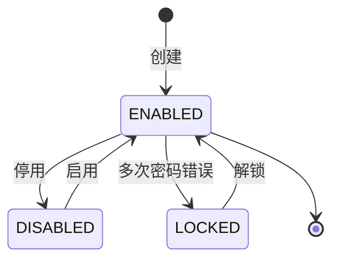
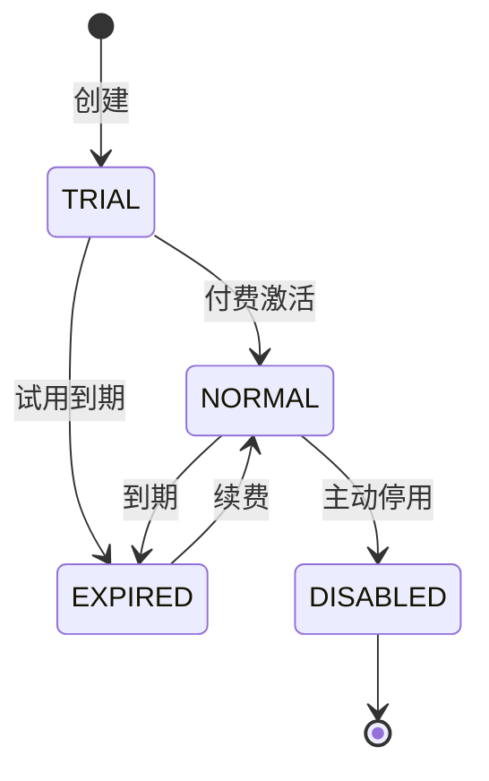
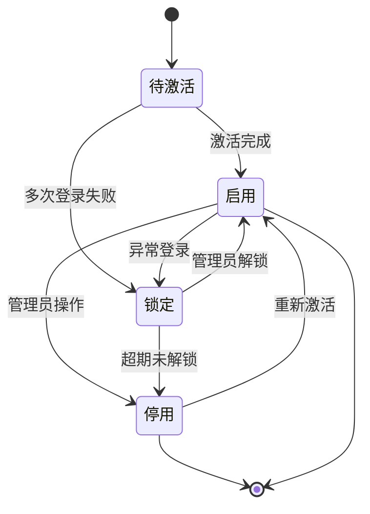
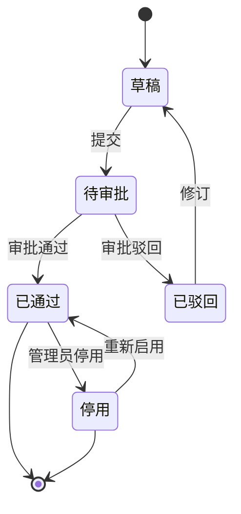

# STATE-M9-系统管理

> **版本**：v1.0 | 2026-06-07

---

## 1. 用户状态机

### 1.1 状态（`dict_user_status`）

| 状态 | value |
|------|-------|
| 启用 | `ENABLED` |
| 停用 | `DISABLED` |
| 锁定 | `LOCKED` |

### 1.2 状态机

---

## 2. 租户状态机

### 2.1 状态（`dict_tenant_status`）

| 状态 | value |
|------|-------|
| 正常 | `NORMAL` |
| 试用 | `TRIAL` |
| 已到期 | `EXPIRED` |
| 已停用 | `DISABLED` |

### 2.2 状态机

---

## 3. 字典状态

- 启用 / 停用（停用不可删）

---

*下一步：SLICES / CHECKLIST / TESTCASES。*

---

## 全局规范引用

> 本文档遵循 [`GLOBAL-CONVENTIONS.md`](./GLOBAL-CONVENTIONS.md) 中定义的全局规范：
> - 强关联属性 → 强制使用 5 类选择器组件（RealNameSelect / PhoneSelect / SimCardSelect / CompanySelect / AccountSelect），禁用手动输入
> - 枚举属性（方式/状态/类型/平台/阶段）→ 统一从数据字典（`dict_*`）选择，页面只读下拉
> - 跨租户 + 状态校验 → 错误码 1500-1504 统一语义
> - 数据安全 → 敏感字段（身份证/手机/API 密钥）强制脱敏展示，凭证类字段 AES-256 加密存储
> - 详见 [`GLOBAL-CONVENTIONS.md § 2`](./GLOBAL-CONVENTIONS.md) (字典)、[`§ 3`](./GLOBAL-CONVENTIONS.md) (选择器)、[`§ 4`](./GLOBAL-CONVENTIONS.md) (错误码)

---

## 核心状态机

### 1. 用户状态机

### 2. 角色状态机

### 3. 日志状态

日志为**追加型**，无状态机，仅按 `dict_log_type` 和 `dict_log_level` 分类。

### 转移约束

| 状态机 | 转移 | 错误码 |
|--------|------|--------|
| 用户 | 任意 → 启用 | 仅 admin（错误码 1403） |
| 用户 | 锁定 → 启用 | admin 操作 + 解锁原因 |
| 角色 | 草稿 → 待审批 | 当前用户是角色创建者 |
| 角色 | 待审批 → 已通过 | 审批员权限 |
| 跨租户 | 任意 | 1504 |
| 字典非法 | 任意 | 1503 |

详见 [`GLOBAL-CONVENTIONS.md § 4`](../engineering/GLOBAL-CONVENTIONS.md) (错误码)
