# OPS 业务操作手册 · IP 组与工作任务

> **版本**：v1.0 | 2026-08-25  
> **读者**：系统管理员 / 运营主管 / IP 组长 / 内容执行人  
> **范围**：两条核心业务线 —— **IP 组搭建 + 组长任务登记执行创作**；**运营主管任务管理与内容审核**  
> **环境示例**：Football 壳 `http://localhost:5777` · 账号 `admin` / `admin123` · 租户 `1`  
> **截图目录**：[`manual-screenshots/workflow/`](./manual-screenshots/workflow/)（Playwright 自动采集，2026-08-25）  
> **关联 Spec**：[`PRD-M2-工作任务管理.md`](./PRD-M2-工作任务管理.md) · [`UX-M1-运营管理.md`](./UX-M1-运营管理.md) · ADR-017 / ADR-071 / ADR-072 / ADR-073

---

## 目录

| 章 | 标题 |
|----|------|
| 1 | [角色与业务全景](#1-角色与业务全景) |
| 2 | [业务线 A：IP 组管理（管理员）](#2-业务线-aip-组管理管理员) |
| 3 | [业务线 A：IP 组长 · 任务登记](#3-业务线-aip-组长--任务登记) |
| 4 | [业务线 A：执行人 · 执行任务与创作内容](#4-业务线-a执行人--执行任务与创作内容) |
| 5 | [业务线 B：运营主管 · 任务登记管理](#5-业务线-b运营主管--任务登记管理) |
| 6 | [业务线 B：运营主管 / IP 组长 · 内容审核](#6-业务线-b运营主管--ip-组长--内容审核) |
| 7 | [常见问题](#7-常见问题) |
| 附录 | [菜单路由速查](#附录-菜单路由速查) |

---

## 1. 角色与业务全景

### 1.1 两条业务线

```text
【业务线 A · 从下往上搭建与执行】
  管理员：新建/设置 IP 组（组长、成员、关联作者）
      ↓
  IP 组长：工作任务登记 → 确认登记
      ↓
  执行人：我的任务 → 执行任务 → 内容创作 → 提交审核

【业务线 B · 主管管理与把关】
  运营主管：任务管理矩阵（纵览各组/作者登记情况）
      ↓
  运营主管 / IP 组长：内容审核（一级/二级）→ 待发布
```

### 1.2 角色与菜单

| 角色 | 典型菜单 | 本手册章节 |
|------|----------|------------|
| 系统管理员 | IP 组管理 | 第 2 章 |
| IP 组长 | 工作任务管理 · 任务登记；内容审核（一级） | 第 3、6 章 |
| 内容执行人 | 我的任务；内容管理 | 第 4 章 |
| 运营主管 | 工作任务管理 · 任务管理；内容审核（二级） | 第 5、6 章 |

> 具体可见菜单与按钮以登录账号权限为准（来自数据库菜单配置，非前端写死）。

### 1.3 与「计划管理」的区别

| 维度 | 计划管理（SOP 全流程） | 工作任务管理（本手册重点） |
|------|------------------------|----------------------------|
| 驱动 | 完整 SOP 模板 + 多节点 | **单日/短周期**，以内容产出为主 |
| 创建人 | 运营计划员 | **IP 组长** |
| 粒度 | IP 组 × SOP 节点 × 赛事 | **赛事 × 作者 × 营销计划** |
| 确认后 | 启动计划 → 多节点任务 | **确认登记即生成**「内容生成」类任务 |

---

## 2. 业务线 A：IP 组管理（管理员）

**入口**：侧栏 **运营数据 → 运营管理 → IP 组管理**  
**URL**：`/ops/operations/ip-group`

  
*图 2-1 IP 组管理 · 左侧树 + 右侧详情*

### 2.1 页面结构

- **左侧**：IP 组树（大组 / 小组层级），显示成员数 / 账号数 / 作者数
- **右侧**：选中组的详情，含 5 个 Tab —— 基本信息、成员管理、关联作者、关联账号、统计

### 2.2 新建大组

**步骤**：

1. 打开 IP 组管理页。
2. 点击左上角 **「新建大组」**。
3. 在弹窗中填写：
   - **组名**（必填）
   - **等级**（字典 `dict_ip_group_level`）
   - **组长**（用户选择器，存 Football `system_users.id`）
   - 备注等
4. 点击 **确定** 保存。

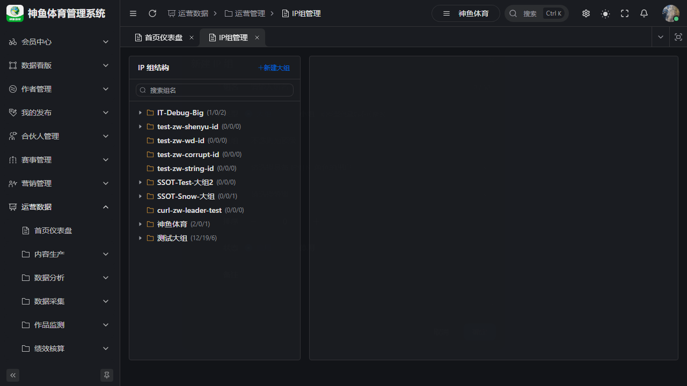  
*图 2-2 新建大组 / 小组对话框*

**结果**：左侧树出现新大组；该组可作为计划、任务登记、数据权限的范围单元。

### 2.3 新建小组

**步骤**：

1. 在左侧树 **选中一个大组**。
2. 点击右侧 **「新建小组」**。
3. 填写组名、指定 **组长**、等级等 → 保存。

**结果**：小组挂在大组下；**工作任务登记、一级内容审核** 均以 **小组** 为权限范围。

### 2.4 设置组长与成员

选中目标 **小组** 后：

#### 成员管理 Tab

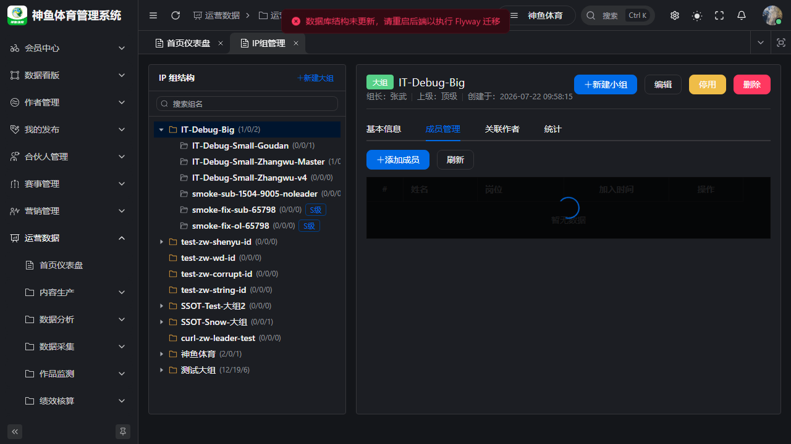  
*图 2-3 成员管理 · 添加成员并设置岗位*

**步骤**：

1. 切换到 **「成员管理」** Tab。
2. 点击 **添加成员**，从用户选择器选择 Football 用户。
3. 为成员设置 **岗位**（字典 `dict_position`）。
4. 保存。

**说明**：

- **组长**在「基本信息」或编辑对话框中指定；组长 **自动视为** 该组成员（可被选为任务执行人）。
- 成员是「工作任务登记 → 执行人下拉」和「数据权限」的基础。

#### 关联作者 Tab

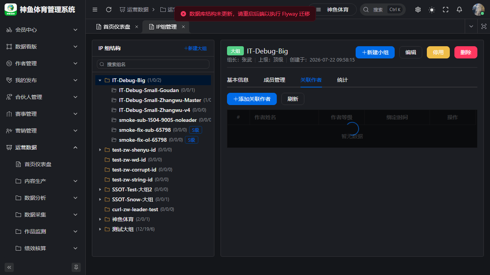  
*图 2-4 关联作者 · 绑定内容作者（主播）*

**步骤**：

1. 切换到 **「关联作者」** Tab。
2. 点击 **添加作者**，从作者列表选择（`author_user.id`）。
3. 保存。

**结果**：该 IP 组下的 **工作任务登记** 才能选到对应作者；矩阵视图以作者为列维度。

> **注意**：若登记页「作者」下拉为空，通常是该组尚未绑定作者，请回到此 Tab 维护。

### 2.5 组详情概览

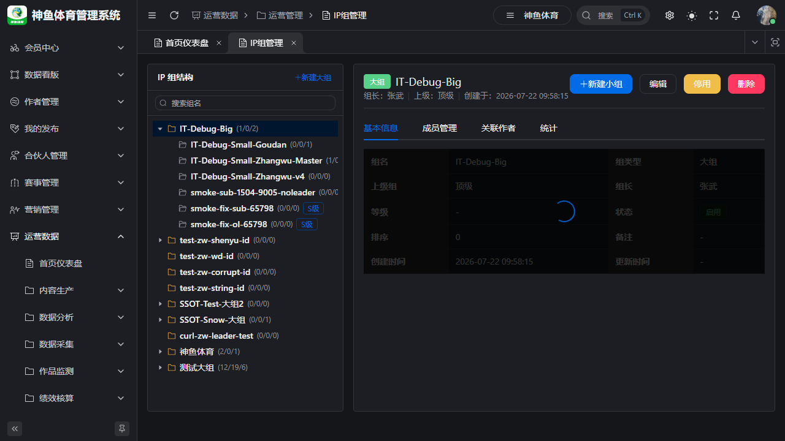  
*图 2-5 选中 IP 组后的详情头（组名、组长、操作按钮）*

常用操作：

| 操作 | 说明 |
|------|------|
| 编辑 | 修改组名、组长、等级 |
| 停用 / 启用 | 停用后不可用于新计划/登记 |
| 删除 | 有成员/账号/作者关联时系统会拦截 |

---

## 3. 业务线 A：IP 组长 · 任务登记

**入口**：侧栏 **运营数据 → 内容生产 → 工作任务管理**  
**URL**：`/ops/production/work-task`  
**Tab**：**任务登记**

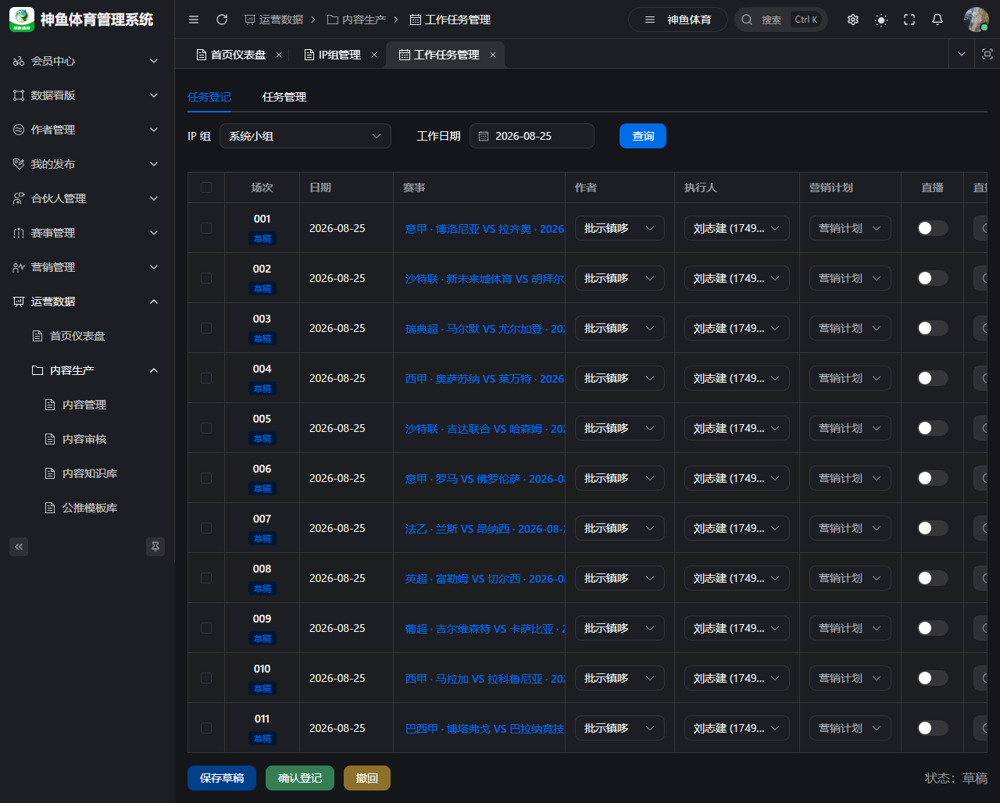  
*图 3-1 工作任务管理 · 任务登记 Tab*

### 3.1 前置条件

| 条件 | 说明 |
|------|------|
| 角色 | 当前用户为某 IP 组的 **组长**（`leader_user_id`） |
| 权限 | `ops:work-task:register` |
| 数据 | 该组已 **关联作者**；运营主管已配置当期 **赛事池**（严格模式下） |

若页面提示「您不是 IP 组长」，请联系管理员在 IP 组管理中指定组长。

### 3.2 选择 IP 组与工作日期

**步骤**：

1. 打开 **工作任务管理**，确认在 **「任务登记」** Tab。
2. **IP 组**：下拉选择（若仅管理一个组则自动选中）。
3. **工作日期**：选择登记日期（默认当天）。
4. 点击 **查询** —— 系统自动 **获取或创建** 当日登记单（10 行草稿）。

  
*图 3-2 登记单加载 · 场次序号 + 各列编辑*

### 3.3 填写登记行

每行代表：**一个作者 + 一场赛事 + 一个工作日期**。

| 列 | 必填 | 说明 |
|----|------|------|
| 场次 | 自动 | 001、002… 按 sheet 内递增 |
| 日期 | 自动 | 工作日期 |
| 赛事 | ✅ | 点击链接打开 **赛事选择器**；严格模式下仅限当期赛事池 |
| 作者 | ✅ | 来自该 IP 组关联作者 |
| 执行人 | ✅ | 默认 **IP 组长**，可改为组内任一成员 |
| 营销计划 | ✅ | 如「直播公推」「付费销售」 |
| 直播 | 选填 | 开关 + 直播时间 |
| 销售平台 | 选填 | 多选，如私域、抖音 |
| 红黑 | 自动 | 赛后 Job 判定，登记时显示「—」 |

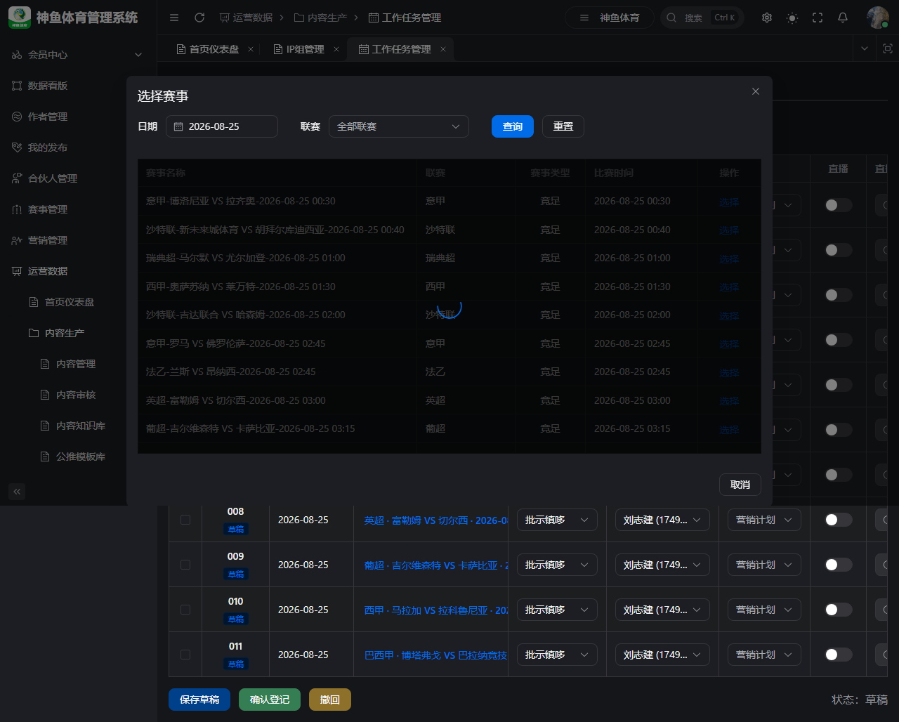  
*图 3-3 赛事选择器 · 按日期筛选竞彩赛事*

**填写步骤（单行示例）**：

1. **勾选**要保存的行（表格左侧复选框）。
2. 点击 **赛事** 列链接 → 在弹窗中按日期筛选 → 选择一场比赛。
3. 选择 **作者**、确认 **执行人**（通常为运营同学）。
4. 选择 **营销计划**、按需设置直播/平台。
5. 点击 **保存草稿**（仅保存勾选行）。

### 3.4 确认登记

**步骤**：

1. 勾选信息完整且未确认的行。
2. 点击 **确认登记**。
3. 在确认框中确认。

**结果**：

- 登记单状态变为 **已确认**。
- 每一确认行生成 **1 条**「内容生成」类任务，出现在执行人 **「我的任务」** 中。
- 任务命名规则：`{赛事名称}-{节点名称}`。

### 3.5 撤回登记（如需修改）

若已确认但需修改：

1. 勾选 **已确认** 的行。
2. 点击 **撤回**。
3. 登记单回到 **草稿**，关联任务 **取消** 且不再出现在「我的任务」。
4. 修改后重新 **保存草稿 → 确认登记**。

---

## 4. 业务线 A：执行人 · 执行任务与创作内容

任务登记确认后，**执行人**（登记行上指定的 `assignee`）在「我的任务」中收到待办。

### 4.1 我的任务

**入口**：侧栏 **运营数据 → 内容生产 → 我的任务**  
**URL**：`/ops/production/task`

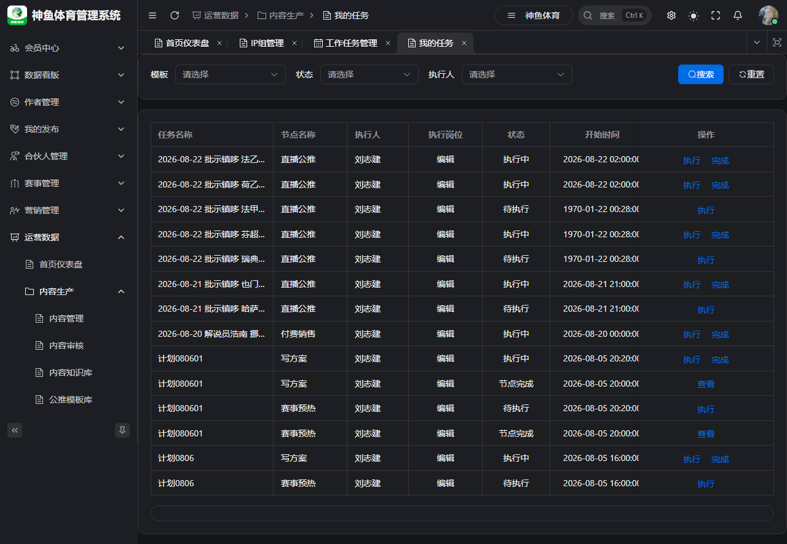  
*图 4-1 我的任务 · 待执行的 CONTENT_GENERATION 任务*

**步骤**：

1. 打开「我的任务」，可按状态筛选。
2. 找到工作任务登记生成的任务（状态 **待开始** / **进行中**）。
3. 点击 **执行** 进入任务执行页。

### 4.2 执行任务 · 内容创作

  
*图 4-2 任务执行页 · 内容创作入口*

**步骤**：

1. 进入执行页后，系统自动关联或创建一条 **内容**（带赛事、IP 组、作者上下文）。
2. 点击 **内容创作**（或等价入口）进入内容编辑。
3. 填写标题、正文；可使用 **AI 生成助手** 辅助写作（选文档类型、赛事、作者后生成）。
4. **保存** 内容。
5. 在内容侧点击 **提交审核**（进入审核流，见第 6 章）。
6. 回到任务执行页，点击 **完成**。

> **门禁**：内容生成类任务要求关联内容 **已提交审核**（不能仍为草稿/驳回），否则「完成」会提示内容未完成。

### 4.3 内容管理（独立入口）

**入口**：侧栏 **运营数据 → 内容生产 → 内容管理**  
**URL**：`/ops/production/content`

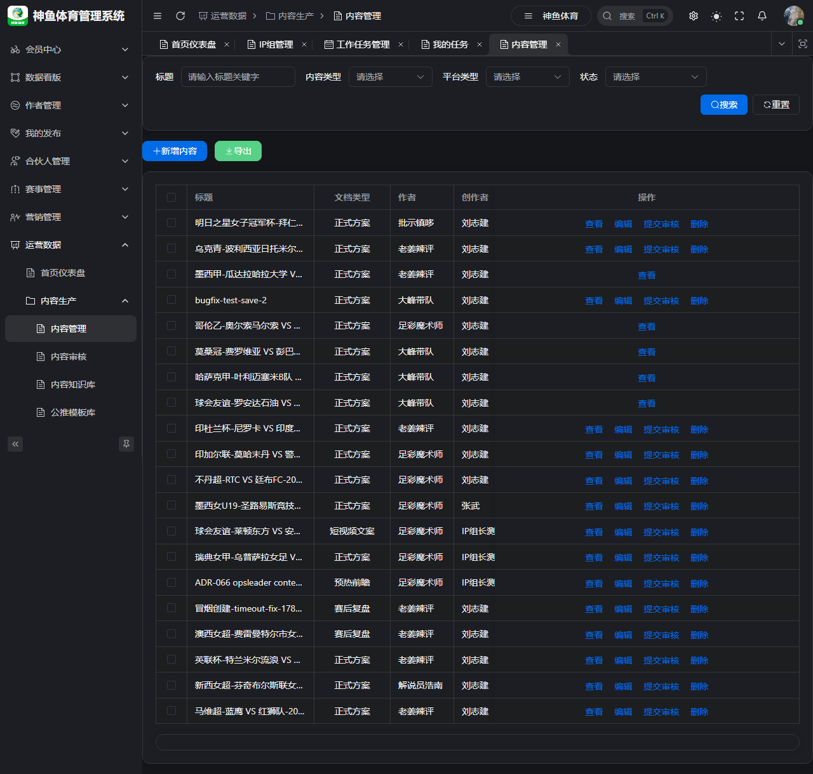  
*图 4-3 内容管理 · 列表与筛选*

也可从内容管理 **新增内容** 或打开已有内容编辑：

  
*图 4-4 新增内容 · 编辑抽屉（选 IP 组、作者、赛事、文档类型）*

| 步骤 | 操作 |
|------|------|
| 1 | 点击 **新增内容** |
| 2 | 选择 IP 组、作者、关联赛事（选择器，禁止手输 ID） |
| 3 | 编辑正文；文章类可设付费/免费栏 |
| 4 | **保存** → **提交审核** |

---

## 5. 业务线 B：运营主管 · 任务登记管理

**入口**：同一页面 **工作任务管理 → 任务管理** Tab  
**URL**：`/ops/production/work-task`（切换 Tab）

  
*图 5-1 任务管理矩阵 · 运营主管纵览*

### 5.1 矩阵视图说明

| 元素 | 含义 |
|------|------|
| **行** | 工作日期 + 场次 + 赛事 |
| **列** | 各作者 `{作者名}【{IP组名}-{组长名}】` |
| **单元格** | 该作者在该场的登记信息：营销计划、直播、平台、红黑标签 |
| **顶部统计** | 总任务数、直播公推数、付费销售数等 |

### 5.2 查询操作

**步骤**：

1. 切换到 **「任务管理」** Tab。
2. 设置 **日期范围**（默认本周）。
3. 可选：筛选 **IP 组**（主管可见权限内全部组）。
4. 点击 **查询**。

**用途**：

- 检查各 IP 组/作者是否完成当日登记。
- 查看 **红黑** 判定结果（赛后自动刷新）。
- 发现漏登记时，通知对应 **IP 组长** 补登。

### 5.3 赛事池配置（运营主管）

> 依据 ADR-073：IP 组长登记时只能从运营主管配置的 **当期赛事池** 选赛。

**权限**：`ops:work-task:match-config`（运营主管角色）

**维护要点**（界面在「工作任务管理」赛事配置 Tab，若已上线）：

| 项 | 规则 |
|----|------|
| 周期 | 默认 **本周（周一至周日）**，可调整 |
| 场次上限 | 每周期最多 **10 场** |
| 作用 | 登记行按 `work_date` 预填池内赛事；矩阵行以配置赛事为 SSOT |

未配置赛事池时，组长选赛/保存可能失败，提示联系运营主管。

---

## 6. 业务线 B：运营主管 / IP 组长 · 内容审核

**入口**：侧栏 **运营数据 → 内容生产 → 内容审核**  
**URL**：`/ops/production/content/review`

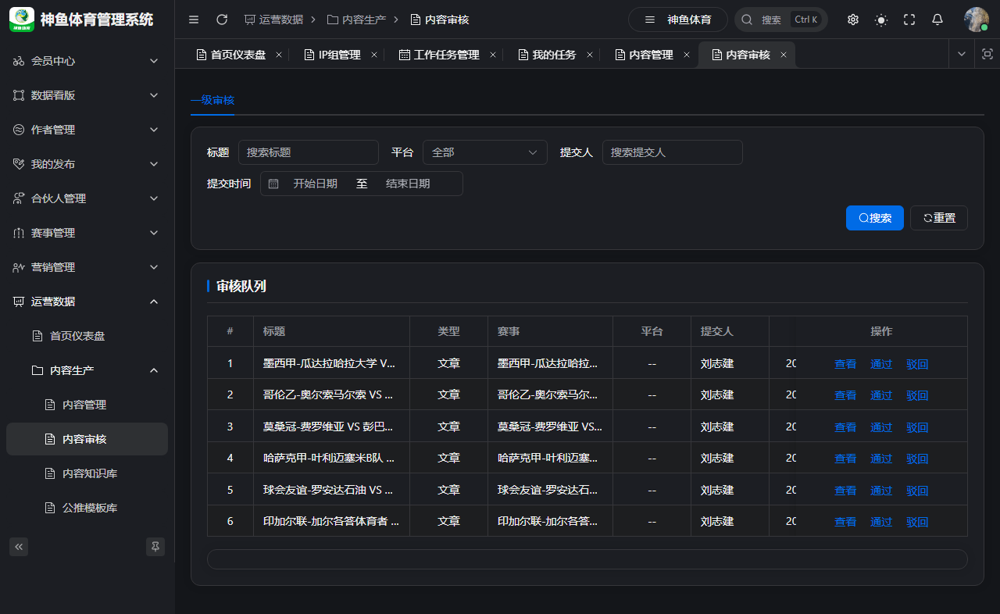  
*图 6-1 内容审核 · 一级/二级 Tab + 待审队列*

### 6.1 审核级别

由 **系统参数 → 内容审核** Tab 配置：

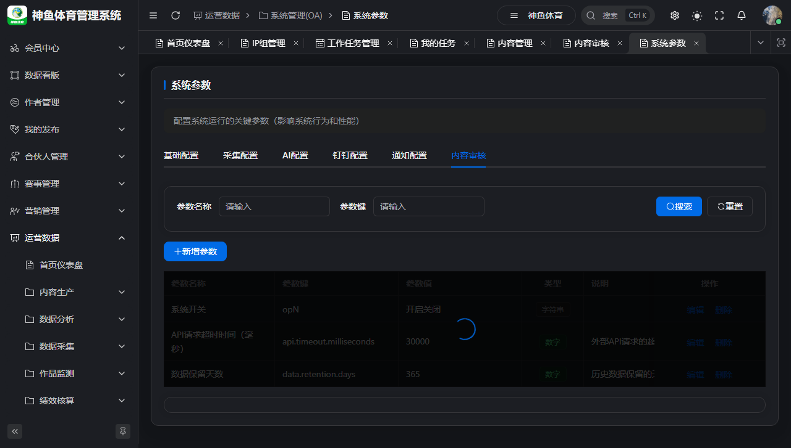  
*图 6-2 系统参数 · 内容审核级别与角色*

| 参数 | 作用 |
|------|------|
| `content.review.level1.enabled` | 是否启用一级审核 |
| `content.review.level2.enabled` | 是否启用二级审核 |
| `content.review.level1.role` | 一级审核角色（常为 IP 组长） |
| `content.review.level2.role` | 二级审核角色（常为运营主管） |

### 6.2 IP 组长 · 一级审核

**范围**：只能审核 **自己担任组长的 IP 组** 下提交的内容（非全租户）。

**步骤**：

1. 打开内容审核，切换到 **「一级审核」** Tab。
2. 按标题、平台、提交人、时间筛选。
3. 点击 **查看** 打开内容详情。

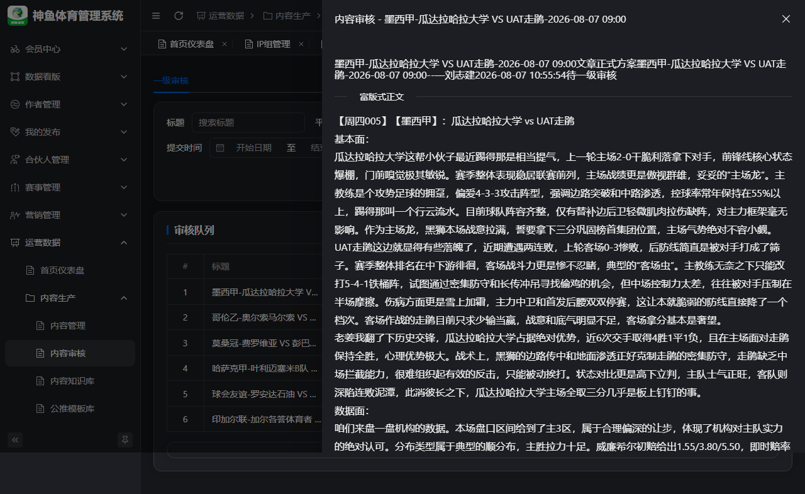  
*图 6-3 内容审核详情 · 正文 + 审核流程 + 通过/驳回*

4. 核对正文、赛事、作者信息；查看审核流程 steps（角色 + 可审人姓名）。
5. 点击 **通过** 或 **驳回**（驳回须填意见；内容回到「已驳回」，执行人改稿后重新提交）。

### 6.3 运营主管 · 二级审核

若启用二级审核：

1. 一级通过后，内容进入 **待二级审核**。
2. 运营主管打开 **「二级审核」** Tab 处理。
3. **末级审核通过** → 内容状态变为 **待发布**（不会自动发布或 Football 上架）。

### 6.4 审核通过之后

| 下一步 | 操作人 | 入口 |
|--------|--------|------|
| OPS 发布 | 运营 | 内容管理 → 该内容 → **发布**（选平台账号） |
| Football 上架 | 运营 | 内容详情 → **上架**（与 OPS 发布独立） |

---

## 7. 常见问题

### Q1. 工作任务管理菜单看不到？

- 确认角色已分配菜单 **6194 工作任务管理** 及权限 `ops:work-task:list`。
- 重新登录刷新菜单缓存。

### Q2. 登记页「作者」下拉为空？

- 回到 **IP 组管理 → 关联作者** Tab，为该小组绑定作者。

### Q3. 选赛事时提示不在赛事池？

- 联系 **运营主管** 在「工作任务管理 → 赛事配置」维护当期赛事池（ADR-073）。

### Q4. 确认登记后执行人看不到任务？

- 确认登记行的 **执行人** 是否为当前登录用户。
- 到 **全部任务** 页用管理员账号排查任务是否生成。

### Q5. 任务「完成」报错内容未完成？

- 须先在内容编辑中 **提交审核**，再回到任务执行页点完成。

### Q6. 一级审核列表为空，但别人说有 pending？

- IP 组长 **只能看本组** 内容；跨组需对应组长或具备二级/全量审核权限的账号处理。

### Q7. 审核通过了 APP 仍不可见？

- 审核只推进 OPS 工作流；须在内容详情检查 **Football 上架状态** 并执行上架。

---

## 附录 · 菜单路由速查

| 页面 | 路径 |
|------|------|
| IP 组管理 | `/ops/operations/ip-group` |
| 工作任务管理 | `/ops/production/work-task` |
| 我的任务 | `/ops/production/task` |
| 全部任务 | `/ops/production/task/all` |
| 内容管理 | `/ops/production/content` |
| 内容审核 | `/ops/production/content/review` |
| 系统参数 | `/ops/system-oa/system-param` |

完整菜单树见 [`OPS-MENU-ROUTE-INDEX.md`](../delivery/OPS-MENU-ROUTE-INDEX.md)。

---

## 修订记录

| 版本 | 日期 | 说明 |
|------|------|------|
| v1.0 | 2026-08-25 | 首版：双业务线操作手册 + Playwright 截图 19 张 |

## 截图复采

```bash
# 先启动栈：.\scripts\start-ops-dev.ps1 -Beta
cd football-front/apps/web-ele
npx playwright test tests/product-manual-workflow.spec.ts --project=chromium
python docs/product/_build_workflow_manual_docx.py
```

输出目录：`docs/product/manual-screenshots/workflow/`  
Word 版本：`docs/product/OPS业务操作手册-IP组与工作任务.docx`（含全部操作截图）
