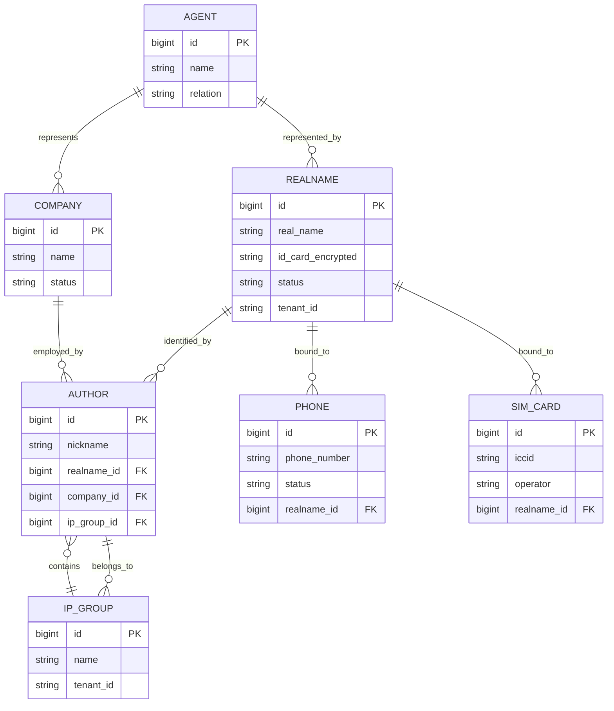

# PRD-M1-运营管理

> **业务域**：M1 运营管理
> **功能模块**：IP 组管理、作者管理、账号分析、粉丝分析、作品分析、内部内容分析、人效盘点
> **详细设计章节**：5.1 ~ 5.7
> **版本**：v1.0 | 2026-06-07
> **状态**：Draft（试点）
> **作者**：齐活林 + 许清楚

---

## 0. 元信息

| 字段 | 值 |
|------|---|
| 模块 | M1 运营管理 |
| 业务域 | 运营管理 |
| 详细设计 | `## 5.1 ~ ## 5.7` |
| 父 PRD | `@完整PRD-v9.1-开发版.md` |
| 关联 UX | `docs/product/UX-M1-运营管理.md` |
| 关联技术规格 | `docs/engineering/API-M1-运营管理.md`、`docs/engineering/STATE-M1-运营管理.md` |
| 关联交付 | `docs/delivery/SLICES-M1-运营管理.md`、`docs/delivery/CHECKLIST-M1-运营管理.md`、`docs/delivery/TESTCASES-M1-运营管理.md` |
| 关联 ADR | `docs/adr/ADR-001-中间件简化.md` |
| 技术约束 | `docs/engineering/TECH-CONSTRAINTS.md` |

---

## 1. 概述

### 1.1 一句话描述

围绕 **IP 组** 的运营管理中枢，串联 IP 组/作者/账号/粉丝/作品/人效 6 大数据视图，是 **多平台账号矩阵** 的日常运营阵地。

### 1.2 目标与指标

| 维度 | 目标 | 可量化指标 |
|------|------|------------|
| 效率 | 替代手工 Excel 收集 | 单个 IP 组的日报、周报、爆款筛选耗时 ≤ 5min |
| 决策 | 快速发现爆款/低分 | 爆款发现延迟 ≤ 1h（数据采集完成 → 列表可见） |
| 归因 | 业绩可归因到人 | 100% 的 ROI、绩效结果可追溯到具体 IP 组→作者→账号 |
| 风控 | 高低粉账号可识别 | 高粉账号/低粉账号自动打标 |

### 1.3 术语表

| 术语 | 定义 |
|------|------|
| **IP 组** | 运营管理的基本单位；一个 IP 组 = 1 个大组（可选）+ N 个小组 + M 个成员 + K 个账号 + L 个主播 |
| **大组 / 小组** | 层级关系：大组不直接管账号/主播，必须通过小组 |
| **主推号** | 一个作者有一个主推账号，公众号/服务号等 OFFICIAL_ACCOUNT 类型 |
| **爆款 / 低分** | 命中 BR-003 / BR-004 阈值规则的作品 |
| **人效** | 单个经办人（运营/主播）的任务完成率、内容产出、ROI 表现 |
| **数据补录** | v9.1 新增，针对接口异常/封号/线下等导致的数据缺失，由运营手工补录（BR-024） |

---

## 2. 用户与权限

### 2.1 角色 × 能力矩阵

| 能力 \ 角色 | 系统管理员 | 运营管理者 | 运营组长 | 运营人员 | 数据分析师 | 数据/财务 |
|------------|------------|-----------|---------|---------|-----------|----------|
| IP 组查看 | ✅ 全 | ✅ 全 | ✅ 本组 | ✅ 本组 | ❌ | ❌ |
| IP 组新增/编辑/删除 | ✅ | ✅ | ❌ | ❌ | ❌ | ❌ |
| IP 组成员配置 | ✅ | ✅ | ✅ 本组 | ❌ | ❌ | ❌ |
| 作者查看 | ✅ | ✅ | ✅ | ✅ | ✅ | ❌ |
| 作者新增/编辑/删除 | ✅ | ✅ | ✅ | ❌ | ❌ | ❌ |
| 账号分析查看 | ✅ | ✅ | ✅ 本组 | ✅ 本组 | ✅ | ❌ |
| 粉丝/作品分析 | ✅ | ✅ | ✅ 本组 | ✅ 本组 | ✅ | ❌ |
| 内部内容分析（数据补录） | ✅ | ✅ 录入 | ✅ 录入 | ❌ | ✅ 审核 | ❌ |
| 人效盘点 | ✅ | ✅ | ✅ 本组 | ✅ 本人 | ✅ | ❌ |

### 2.2 权限规则

- **数据范围**：按 BR-006 实现 4 级（全部/本部门/本 IP 组/仅本人）
- **操作审计**：所有新增/编辑/删除/补录操作均写入审计日志（`oa_audit_log`）
- **越权提示**：无权限时按钮置灰 + tooltip「无权限，请联系管理员」

---

## 3. 范围

### 3.1 In Scope（7 个功能点）

| FR 编号 | 名称 | 优先级 | 章节 |
|---------|------|--------|------|
| FR-M1-001 | IP 组管理（树形结构+成员+账号+主播） | P0 | 5.1 |
| FR-M1-002 | 作者管理（含主推号、运营→主播关联） | P0 | 5.2 |
| FR-M1-003 | 账号分析（多平台 Tab→列表→粉丝/作品详情） | P0 | 5.3 |
| FR-M1-004 | 粉丝分析 | P0 | 5.4 |
| FR-M1-005 | 作品分析 | P0 | 5.5 |
| FR-M1-006 | 内部内容分析（Tab 切换+数据补录） | P0 | 5.6 |
| FR-M1-007 | 人效盘点（含经办人展开详情） | P0 | 5.7 |

### 3.2 Out of Scope（明确不做，防止 scope creep）

1. ❌ **不实现** 实时流式数据大屏（由 `## 5.31 数据大屏` 负责）
2. ❌ **不实现** 跨平台数据自动清洗（由 `## 5.40 采集任务` 负责）
3. ❌ **不实现** AI 智能诊断报告（属于 `## 5.27 数据报表` 子项）
4. ❌ **不实现** 作者业绩排行（属于 `## 5.32 微信数据分析` 的扩展项）
5. ❌ **不实现** IP 组导出 Excel 模板配置（本期固定导出格式）
6. ❌ **不实现** 移动端 H5 版本（仅 Web 端）
7. ❌ **不实现** 自定义字段（IP 组/作者字段本期固定）
8. ❌ **不实现** 操作日志查看 UI（写日志即可，UI 在 `## 5.39 系统管理`）

---

## 4. 功能需求

### FR-M1-001 IP 组管理（对应 5.1）

#### 4.1.1 描述

构建 IP 运营的层级组织结构（**大组 / 小组**），承载人员、账号、主播的归属关系。

#### 4.1.2 前置条件

- 用户已登录
- 用户拥有「IP 组-查看」及以上权限
- 大组由系统管理员或运营管理者创建，小组归属一个且仅一个大组

#### 4.1.3 主流程

1. 用户进入"运营管理 > IP 组管理"页面
2. 页面以**树形结构**展示大组与嵌套的小组
3. 点击"+ 新建大组"按钮，打开新建弹窗
4. 填写"IP 组名称""组长""描述"字段（"组类型"自动=BIG），点击"确认"
5. 系统返回"创建成功"Toast，列表自动刷新
6. 点击某大组下的"+ 新建小组"按钮，打开弹窗
7. 填写名称、上级（自动=该大组），"组类型"自动=SMALL
8. 在小组详情中可配置"成员 / 账号 / 主播"三类关系

#### 4.1.4 备选/异常流

| 异常 | 提示 | 处理 |
|------|------|------|
| 名称已存在（同父级下） | "同上级 IP 组下名称重复" | 弹窗不关闭，标红字段 |
| 选择的上级不是大组 | "上级必须是大组" | 弹窗不关闭 |
| 小组存在成员/账号/主播 | "该 IP 组下存在数据，禁止删除" | 弹窗关闭，按钮置灰 |
| 名称超过 50 字符 | "名称长度 1-50 字符" | 输入框下方红字 |
| 删除失败（如系统管理员锁定） | "系统数据不允许删除" | 弹窗显示，列表不变 |

#### 4.1.5 业务规则

- BR-M1-001 大组不直接管理账号/主播，必须通过小组
- BR-M1-002 一个账号只能属于一个小组
- BR-M1-003 一个主播可同时服务多个小组，但通常只主推一个
- BR-M1-004 统计求和 = 各级子项之和（IP 组粉丝 = 小组粉丝之和）

#### 4.1.6 数据项

| 字段 | 类型 | 必填 | 校验 |
|------|------|------|------|
| group_name | String | ✅ | 1-50 字符、同父级下唯一 |
| group_type | Enum | ✅ | BIG / SMALL |
| parent_id | Long | 小组必填 | 必须指向 BIG |
| description | String | ❌ | 0-200 字符 |
| leader_user_id | Long | ❌ | 必须在用户表 |
| status | Enum | ✅ | 0=停用 1=启用 |

#### 4.1.7 验收标准（AC）

**AC-M1-001-1**（新建大组）
- Given 用户拥有「IP 组-新建」权限，登录并进入"IP 组管理"页
- When 点击"+ 新建大组"，填写名称"娱乐八卦大组"、选择组长"张三"，点击"确认"
- Then 系统弹"创建成功"Toast，列表新增"娱乐八卦大组"节点，刷新"成员/账号/主播"统计为 0

**AC-M1-001-2**（名称重复）
- Given 已存在名为"娱乐八卦大组"的大组
- When 新建同名的另一大组
- Then 表单不关闭，名称字段下方红字"同上级 IP 组下名称重复"

**AC-M1-001-3**（删除受保护）
- Given 大组"娱乐八卦大组"下存在 1 个小组、3 个成员
- When 点击"删除"按钮
- Then 系统弹"该 IP 组下存在数据，禁止删除"错误提示，列表不变

**AC-M1-001-4**（权限校验）
- Given 用户角色为"运营人员"
- When 进入 IP 组管理页
- Then 看不到"+ 新建大组 / + 新建小组"按钮，IP 组下"成员/账号/主播"配置入口置灰

#### 4.1.8 非功能

- 树形加载 ≤ 500ms（200 节点以内）
- 列表分页：page, size, 默认 size=20
- 审计：所有 CRUD 写入 `oa_audit_log`（详见 `docs/engineering/AUDIT.md`）

---

### FR-M1-002 作者管理（对应 5.2）

#### 4.2.1 描述

管理作者/主播信息、主推号（公众号/服务号）、运营→主播关联、作者数据看板。

#### 4.2.2 前置条件

- 用户拥有「作者-查看」权限
- 主推号必须选择 type=OFFICIAL_ACCOUNT 的采集账号

#### 4.2.3 主流程

1. 进入"运营管理 > 作者管理"
2. 默认列表展示：作者名、所属 IP 组、主推号、运营人员、粉丝/作品/直播时长（最新一日）
3. 点击"+ 新建作者"，弹窗含：作者名、IP 组（必须是 SMALL）、作者类型、主推号（OFFICIAL_ACCOUNT）、系统用户绑定
4. 提交后回到列表
5. 点击行内"看板"按钮，进入"作者数据看板"页（4 个 tab：作品/粉丝/直播/订单归因）
6. 在"运营→主播关联"标签页内可绑定/解绑运营人员与主播

#### 4.2.4 异常流

- IP 组选择"大组" → "作者 IP 组必须选择小组"
- 主推号已绑定其他作者 → "该账号已被 [作者X] 绑定为主推号"
- 删除作者有关联任务 → "该作者下存在未完成任务，无法删除"

#### 4.2.5 业务规则

- 一个作者可关联一个主推号（公众号/服务号类型）
- 一个运营人员可服务多个作者（1:N）
- 一个作者可被多个运营人员服务（N:N 通过 `oa_ops_anchor_rel`）
- 作者数据自动从 `oa_content_daily / oa_follower_daily / oa_live_*` 聚合

#### 4.2.6 验收标准

**AC-M1-002-1**（新建作者）
- Given 用户有「作者-新建」权限
- When 填写作者名"李四"、IP 组"娱乐八卦大组/八卦一组"、类型"短视频"、主推号"@娱乐小报"、绑定系统用户"lisi"
- Then 创建成功，作者出现在列表中，"看板"按钮可点击

**AC-M1-002-2**（IP 组类型校验）
- When IP 组选择"娱乐八卦大组"（大组）
- Then 提交时报错"作者 IP 组必须选择小组"

**AC-M1-002-3**（运营→主播关联）
- Given 作者"李四"存在
- When 在关联页添加运营"王五"、开始日期"2026-06-01"、结束日期"2026-12-31"
- Then 作者列表中"运营人员"列显示"王五"，人效盘点中李四的归属运营显示"王五"

---

### FR-M1-003 账号分析（对应 5.3）

#### 4.3.1 描述

按多平台 Tab 切换，展示某平台下全量账号列表，点击单账号可进入粉丝/作品详情。

#### 4.3.2 页面状态矩阵

| 状态 | 条件 | 界面表现 |
|------|------|----------|
| 空 | 筛选后无账号 | 空插图+"该筛选下暂无账号"+"重置筛选" |
| 加载 | 首次进入或切换 Tab | Skeleton 列表 |
| 错误 | 接口 500 | Banner "加载失败，请稍后重试" + 重试按钮 |
| 无权限 | 角色无权限 | 整页（已替换为具体内容）

#### 4.3.3 控件清单（核心）

| 控件 ID | 类型 | 文案 | 状态 | 关联 FR/AC |
|---------|------|------|------|------------|
| TAB-001 | Tab | 公众号/视频号/抖音/快手/小红书/企微/**个微**/全部 | active 时下划线 | FR-M1-003 |
> 注：服务号不是平台（属于 dict_account_type）。**个微**：`dict_platform_type.个微=WECHAT_PERSONAL`（S-R6 同步 V30 迁移补入）|
| F-IP | Select | IP 组筛选 | default | FR-M1-003 |
| F-KEY | Input | 账号名/ID 模糊 | default | FR-M1-003 |
| F-STATUS | Select | 账号状态 | default | FR-M1-003 |
| BTN-SEARCH | Button | "查询" | primary | FR-M1-003 |
| BTN-RESET | Button | "重置" | default | FR-M1-003 |
| ROW-FOLLOWER | Link | "查看粉丝分析" | - | FR-M1-004 / AC-M1-004-1 |
| ROW-CONTENT | Link | "查看作品分析" | - | FR-M1-005 / AC-M1-005-1 |
| BTN-EXPORT | Button | "导出 Excel" | primary | FR-M1-003 / AC-M1-003-3 |

#### 4.3.4 验收标准

**AC-M1-003-1**（Tab 切换）
- Given 进入账号分析页，默认 Tab=公众号
- When 点击"视频号"Tab
- Then 列表请求 `account-analysis/list?platform=视频号`，loading 后展示视频号账号

**AC-M1-003-2**（粉丝详情跳转）
- Given 列表中账号"@娱乐小报"
- When 点击"查看粉丝分析"
- Then 跳转至粉丝分析页（FR-M1-004），自动带入 `account_id=@娱乐小报`

**AC-M1-003-3**（导出）
- Given 列表有数据
- When 点击"导出 Excel"
- Then 调用 `POST /account-analysis/export`，异步返回文件下载，文件名 `accounts_{yyyyMMddHHmmss}.xlsx`

---

### FR-M1-004 粉丝分析（对应 5.4）

#### 4.4.1 验收标准

**AC-M1-004-1**（趋势图）
- Given 进入粉丝分析页，已选日期范围 2026-05-01 ~ 2026-06-01
- When 页面加载完成
- Then 展示粉丝趋势折线图（7 日/30 日切换），关键指标卡：总粉丝、新增、取消、净增、增长率

**AC-M1-004-2**（导出）
- When 点击"导出"
- Then 异步下载 `follower_analysis_{yyyyMMddHHmmss}.csv`（**S-R6 同步：原 spec 写 xlsx，因 yudao-module-oa 未引入 POI 依赖，暂以 UTF-8 BOM CSV 输出兼容 Excel；后续 M10/slice 引入 easyexcel 后升级为 xlsx**）

---

### FR-M1-005 作品分析（对应 5.5）

#### 4.5.1 验收标准

**AC-M1-005-1**（爆款识别）
- Given 作品"标题 A" 阅读=10w、点赞=5000、评论=200、转发=1000
- When 加载作品列表
- Then 该作品"是否爆款"列显示 ✅ 红色标签（命中 BR-003 阈值）

---

### FR-M1-006 内部内容分析 + 数据补录（对应 5.6）

#### 4.6.1 描述

按多平台 Tab 展示内部账号作品列表；支持运营者对缺失数据进行**手工补录**（v9.1 新增）。

#### 4.6.2 补录状态机

```
提交补录 ─▶ 待审核(0) ─┬─ 审核通过 ▶ 生效(1) ─▶ 入统计
                       └─ 审核不通过 ▶ 已驳回(2) ─▶ 补录人修改后可重新提交
```

- 已通过的补录记录 **不可修改/不可删除**（需走作废流程，不在本期）
- 已驳回的记录可由补录人修改后再次提交
- 待审核记录可由补录人撤回/删除

#### 4.6.3 验收标准

**AC-M1-006-1**（补录提交）
- Given 用户"运营组长"进入"内部内容分析"页，选中作品"标题 A"
- When 点击"补录"，选择补录类型"接口异常录入"、日期"2026-05-30"、阅读=8000、点赞=200
- Then 提交成功，记录进入"待审核"状态，补录人可在"我的补录"看到

**AC-M1-006-2**（审核生效）
- Given 补录记录处于"待审核"
- When 数据分析师点击"审核通过"
- Then 该补录数据合并入 `oa_content_daily`，`data_source='IMPORT'`，统计可查询

**AC-M1-006-3**（审核驳回）
- When 数据分析师点击"审核不通过"，备注"数据与 API 不符"
- Then 补录状态变"已驳回"，补录人收到通知，可修改后重新提交

**AC-M1-006-4**（时间窗口限制）
- When 补录日期选择为 2025-01-01（> 90 天前）
- Then 提示"仅可补录过去 90 天内的数据"，不允许提交

---

### FR-M1-007 人效盘点（对应 5.7）

#### 4.7.1 验收标准

**AC-M1-007-1**（展开详情）
- Given 人效列表中"李四"为经办人
- When 点击行内"+"展开按钮
- Then 下方展开 4 大卡片：任务详情/财务指标/内容指标/趋势图

**AC-M1-007-2**（时间维度切换）
- When 切换"按周/按月"
- Then 列表数据按对应维度聚合刷新

---

## 5. 交互与界面

详见 `docs/product/UX-M1-运营管理.md`（包含完整页面矩阵、状态矩阵、按钮级规格）。

### 5.1 页面清单

| 页面 ID | 名称 | 路由 | 关联 FR |
|---------|------|------|---------|
| P-M1-001 | IP 组管理（树形） | `/ip-group` | FR-M1-001 |
| P-M1-002 | 作者管理 | `/author` | FR-M1-002 |
| P-M1-003 | 账号分析 | `/account-analysis` | FR-M1-003 |
| P-M1-004 | 粉丝分析 | `/fans-analysis` | FR-M1-004 |
| P-M1-005 | 作品分析 | `/works-analysis` | FR-M1-005 |
| P-M1-006 | 内部内容分析 | `/internal-content` | FR-M1-006 |
| P-M1-007 | 人效盘点 | `/efficiency` | FR-M1-007 |
| D-M1-001 | IP 组新建/编辑弹窗 | - | FR-M1-001 |
| D-M1-002 | 作者新建/编辑弹窗 | - | FR-M1-002 |
| D-M1-003 | 补录弹窗 | - | FR-M1-006 |

> **S-R4 注**：上述路由已与代码 router/index.ts 对齐（之前 S-R3 留 TODO）。M1 模块全部页面均无 `/ops/` 前缀。

### 5.2 关键状态（统一约定）

| 状态 | 文案/图标 |
|------|----------|
| 空 | 插图 + 引导文字 + 行动按钮 |
| 加载 | Skeleton |
| 错误 | Banner "加载失败" + 重试 |
| 无权限 | 整页（已替换为具体内容）

---

## 6. 集成与数据

### 6.1 上下游系统

- 上游：数据采集（`## 5.40`） → `oa_content_daily / oa_follower_daily / oa_account_*`
- 下游：
  - `## 5.25 ROI 分析` ← IP 组/作者维度
  - `## 5.32 微信数据分析` ← 企微/个微账号
  - `## 5.27 数据报表` ← 8 张报表（含人效盘点）
  - `## 5.24 账号成本` ← 账号成本归因到 IP 组

### 6.2 核心实体生命周期

| 实体 | 关键字段 | 生命周期 |
|------|----------|----------|
| IP 组 | id, parent_id, group_type | 创建→启用→停用→删除（带数据保护） |
| 作者 | id, ip_group_id, primary_account_id | 创建→绑定运营→启用→停用 |
| 数据补录 | id, content_id, review_status | 提交→待审核→通过/驳回→（驳回）修改→重新提交 |
| 账号 | id, ip_group_id, platform | 采集入库→绑定 IP 组→运营→停用 |

---

## 7. 非功能需求（NFR）

| 维度 | 要求 |
|------|------|
| 性能 | 列表 200 条以内首屏 ≤ 1.5s；导出 1w 行 ≤ 30s（异步） |
| 权限 | 与 4 级数据范围一致；越权按钮置灰 + tooltip |
| 审计 | 所有 CUD 操作 + 补录审核写入审计日志 |
| 安全 | 敏感字段（手机、身份证、姓名）脱敏展示；导出需权限 |
| 国际化 | 一期仅中文 |
| 可观测 | 关键操作埋点：ip_group_create, content_import_submit, content_import_review |

---

## 8. 决策记录（ADR）

| 编号 | 问题 | 决策 | 原因 | 日期 |
|------|------|------|------|------|
| ADR-M1-001 | 补录数据与 API 数据冲突时优先用哪个？ | API 优先；补录仅作补充 | API 是真实数据源，补录是补丁 | 2026-06-07 |
| ADR-M1-002 | IP 组下数据保护删除策略？ | 存在成员/账号/主播时禁止删除 | 避免误删导致历史数据无法回溯 | 2026-06-07 |
| ADR-M1-003 | 人效盘点的时间维度 | 默认按周，支持切换按月 | 业绩复盘以周为基本周期 | 2026-06-07 |

详见 `docs/adr/`。

---

## 9. 开放问题（Open Questions）

| 编号 | 问题 | 负责人 | 截止日期 | 状态 |
|------|------|--------|----------|------|
| OQ-M1-001 | IP 组是否需要支持多上级（除大组→小组之外的灵活层级）？ | 产品 | 2026-06-15 | 待定 |
| OQ-M1-002 | 数据补录是否需要支持 Excel 批量导入？ | 产品 | 2026-06-20 | 待定 |
| OQ-M1-003 | 人效盘点的 ROI 字段是否对接 `## 5.24 账号成本`？ | 后端 | 2026-06-15 | 已确认要 |

---

## 10. 验收与发布

- 整体 AC 见各 FR 的 4.X.7 节
- 回归范围：`## 5.17~5.23 账号管理`（IP 组变化会影响账号归属）、`## 5.40 数据采集`（IP 组过滤会作用于所有采集）
- 埋点：见 NFR


## 11. M1 模块全局规范映射（补丁 2026-06-07）

> 🔴 **M1 必须遵循 [`docs/engineering/GLOBAL-CONVENTIONS.md`](./../engineering/GLOBAL-CONVENTIONS.md) 的三大铁律**

### 11.1 关联属性清单（M1 涉及的强关联）

| 字段 | 关联实体 | 选择器 | 强校验 |
|

## 11. M1 模块全局规范映射（补丁 2026-06-07）

> 🔴 **M1 必须遵循 [`docs/engineering/GLOBAL-CONVENTIONS.md`](./../engineering/GLOBAL-CONVENTIONS.md) 的三大铁律**

### 11.1 关联属性清单（M1 涉及的强关联）

| 字段 | 关联实体 | 选择器 | 强校验 |
|

## 11. M1 模块全局规范映射（补丁 2026-06-07）

> 🔴 **M1 必须遵循 [`docs/engineering/GLOBAL-CONVENTIONS.md`](./../engineering/GLOBAL-CONVENTIONS.md) 的三大铁律**

### 11.1 关联属性清单（M1 涉及的强关联）

| 字段 | 关联实体 | 选择器 | 强校验 |
|------|---------|--------|--------|
| `oa_ip_group.parent_id` | `oa_ip_group` | `<IpGroupTreeSelect />` | 小组必填 |
| `oa_ip_group_member.user_id` | `sys_user` | `<UserSelect />` | ✅ |
| `oa_ip_group_account_rel.account_id` | `oa_account` | `<AccountSelect />` | ✅ 强关联 ⭐ |
| `oa_ip_group_anchor_rel.anchor_user_id` | `sys_user` | `<UserSelect />` | ✅ |
| `oa_author.ip_group_id` | `oa_ip_group` | `<IpGroupTreeSelect />`（仅 SMALL） | ✅ |
| `oa_author.primary_account_id` | `oa_account` | `<AccountSelect />`（仅 OFFICIAL_ACCOUNT） | ✅ |
| `oa_ops_anchor_rel.ops_user_id` | `sys_user` | `<UserSelect />` | ✅ |
| `oa_ops_anchor_rel.anchor_user_id` | `sys_user` | `<UserSelect />` | ✅ |
| `oa_content_data_import.content_id` | `oa_content` | `<ContentSelect />` | ✅ |

### 11.2 数据字典清单（M1 涉及）

| 字段 | 字典 type | 控件 |
|------|----------|------|
| IP 组类型 | `dict_ip_group_type` | `<DictSelect dict-type="dict_ip_group_type" />` |
| IP 组状态 | `dict_ip_group_status` | `<DictSelect dict-type="dict_ip_group_status" />` |
| 作者类型 | `dict_author_type` | `<DictSelect dict-type="dict_author_type" />` |
| 作者状态 | `dict_author_status` | `<DictSelect dict-type="dict_author_status" />` |
| 内容类型 | `dict_content_type` | `<DictSelect dict-type="dict_content_type" />` |
| 补录类型 | `dict_content_import_type` | `<DictSelect dict-type="dict_content_import_type" />` |
| 数据来源 | `dict_data_source` | `<DictSelect dict-type="dict_data_source" />` |
| 平台类型 | `dict_platform_type` | `<DictSelect dict-type="dict_platform_type" />` |
| 账号类型 | `dict_account_type` | `<DictSelect dict-type="dict_account_type" />` |
| 账号状态 | `dict_account_status` | `<DictSelect dict-type="dict_account_status" />` |
| 岗位 | `dict_position` | `<DictSelect dict-type="dict_position" />` |
| 是否 | `dict_yes_no` | `<DictSelect dict-type="dict_yes_no" />` |

### 11.3 强校验（必须）

- ✅ 所有 `*_id` 字段强制传 ID，不接收 name
- ✅ 跨租户过滤（错误码 1504）
- ✅ 已停用实体不可选（错误码 1501）
- ✅ 已被引用实体不可重复引用（错误码 1502）
- ✅ 字典值不合法 → 错误码 1503
- ✅ M1 涉及实名人/手机/手机卡/公司 → 通过 `<RealNameSelect />` / `<PhoneSelect />` / `<SimCardSelect />` / `<CompanySelect />` 选择

### 11.4 旧版本差异（v1 → v9.1）

| 字段 | 旧版本（手填） | v9.1（选择器） |
|------|--------------|--------------|
| `ip_group_id` | 手动输入名称 | `<IpGroupTreeSelect />` |
| `account_id` | 手动输入 ID | `<AccountSelect />` |
| `realname_id` | 手动输入姓名 | `<RealNameSelect />` |
| `phone_id` | 手动输入手机号 | `<PhoneSelect />` |
| `platform_type` | 写死 "公众号" | `<DictSelect dict-type="dict_platform_type" />` |
| `account_type` | 写死 "OFFICIAL" | `<DictSelect dict-type="dict_account_type" />` |
| `status` | 写死 "正常" | `<DictSelect dict-type="dict_account_status" />` |

> ⚠️ **v1.0 不再兼容手填字段**，所有关联属性必须用选择器。

### 11.5 M1 与其他模块的关联

- **M1 → M4 账号管理**：`oa_ip_group_account_rel` 关联 `oa_account`
- **M1 → M4 实名人**：`oa_account` 必须从实名人/手机/手机卡/公司选择（M4 § 5.2）
- **M1 → M2 内容生产**：`oa_content` 关联 `oa_account`、SOP 任务
- **M1 → M3 绩效**：`oa_author` 关联绩效记录
- **M1 → M5 财务**：`oa_account_cost` 关联 `oa_account`
- **M1 → M6 数据分析**：`oa_author` / `oa_account` 提供基础数据
- **M1 → M7 作品监测**：`oa_content` 关联监测
- **M1 → M10 数据采集**：`oa_content` / `oa_follower_daily` 来源

### 11.6 实名人管理（M1 关联的最关键模块）

> 🔴 **核心**：M1 中"IP 组"关联的"账号"必须通过 M4 的"实名人管理"绑定。

**关联路径**：

```
oa_ip_group (大组)
    └── oa_ip_group_account_rel
            └── oa_account
                    ├── oa_realname (强关联，从 M4 选)
                    ├── oa_phone (强关联，从 M4 选)
                    ├── oa_sim_card (强关联，从 M4 选)
                    └── oa_company (强关联，从 M4 选)
```

**操作**：
1. 在 M4 中创建实名人/手机/手机卡/公司
2. 在 M1 创建账号 → 通过选择器绑定
3. M1 的 IP 组只能关联"已绑定实名人/手机/手机卡/公司"的账号

---

*补丁完成时间：2026-06-07*
*补丁作者：AI Agent（依据 GLOBAL-CONVENTIONS v1.0）*
------|---------|--------|--------|
| `oa_ip_group.parent_id` | `oa_ip_group` | `<IpGroupTreeSelect />` | 小组必填 |
| `oa_ip_group_member.user_id` | `sys_user` | `<UserSelect />` | ✅ |
| `oa_ip_group_account_rel.account_id` | `oa_account` | `<AccountSelect />` | ✅ 强关联 ⭐ |
| `oa_ip_group_anchor_rel.anchor_user_id` | `sys_user` | `<UserSelect />` | ✅ |
| `oa_author.ip_group_id` | `oa_ip_group` | `<IpGroupTreeSelect />`（仅 SMALL） | ✅ |
| `oa_author.primary_account_id` | `oa_account` | `<AccountSelect />`（仅 OFFICIAL_ACCOUNT） | ✅ |
| `oa_ops_anchor_rel.ops_user_id` | `sys_user` | `<UserSelect />` | ✅ |
| `oa_ops_anchor_rel.anchor_user_id` | `sys_user` | `<UserSelect />` | ✅ |
| `oa_content_data_import.content_id` | `oa_content` | `<ContentSelect />` | ✅ |

### 11.2 数据字典清单（M1 涉及）

| 字段 | 字典 type | 控件 |
|------|----------|------|
| IP 组类型 | `dict_ip_group_type` | `<DictSelect dict-type="dict_ip_group_type" />` |
| IP 组状态 | `dict_ip_group_status` | `<DictSelect dict-type="dict_ip_group_status" />` |
| 作者类型 | `dict_author_type` | `<DictSelect dict-type="dict_author_type" />` |
| 作者状态 | `dict_author_status` | `<DictSelect dict-type="dict_author_status" />` |
| 内容类型 | `dict_content_type` | `<DictSelect dict-type="dict_content_type" />` |
| 补录类型 | `dict_content_import_type` | `<DictSelect dict-type="dict_content_import_type" />` |
| 数据来源 | `dict_data_source` | `<DictSelect dict-type="dict_data_source" />` |
| 平台类型 | `dict_platform_type` | `<DictSelect dict-type="dict_platform_type" />` |
| 账号类型 | `dict_account_type` | `<DictSelect dict-type="dict_account_type" />` |
| 账号状态 | `dict_account_status` | `<DictSelect dict-type="dict_account_status" />` |
| 岗位 | `dict_position` | `<DictSelect dict-type="dict_position" />` |
| 是否 | `dict_yes_no` | `<DictSelect dict-type="dict_yes_no" />` |

### 11.3 强校验（必须）

- ✅ 所有 `*_id` 字段强制传 ID，不接收 name
- ✅ 跨租户过滤（错误码 1504）
- ✅ 已停用实体不可选（错误码 1501）
- ✅ 已被引用实体不可重复引用（错误码 1502）
- ✅ 字典值不合法 → 错误码 1503
- ✅ M1 涉及实名人/手机/手机卡/公司 → 通过 `<RealNameSelect />` / `<PhoneSelect />` / `<SimCardSelect />` / `<CompanySelect />` 选择

### 11.4 旧版本差异（v1 → v9.1）

| 字段 | 旧版本（手填） | v9.1（选择器） |
|------|--------------|--------------|
| `ip_group_id` | 手动输入名称 | `<IpGroupTreeSelect />` |
| `account_id` | 手动输入 ID | `<AccountSelect />` |
| `realname_id` | 手动输入姓名 | `<RealNameSelect />` |
| `phone_id` | 手动输入手机号 | `<PhoneSelect />` |
| `platform_type` | 写死 "公众号" | `<DictSelect dict-type="dict_platform_type" />` |
| `account_type` | 写死 "OFFICIAL" | `<DictSelect dict-type="dict_account_type" />` |
| `status` | 写死 "正常" | `<DictSelect dict-type="dict_account_status" />` |

> ⚠️ **v1.0 不再兼容手填字段**，所有关联属性必须用选择器。

### 11.5 M1 与其他模块的关联

- **M1 → M4 账号管理**：`oa_ip_group_account_rel` 关联 `oa_account`
- **M1 → M4 实名人**：`oa_account` 必须从实名人/手机/手机卡/公司选择（M4 § 5.2）
- **M1 → M2 内容生产**：`oa_content` 关联 `oa_account`、SOP 任务
- **M1 → M3 绩效**：`oa_author` 关联绩效记录
- **M1 → M5 财务**：`oa_account_cost` 关联 `oa_account`
- **M1 → M6 数据分析**：`oa_author` / `oa_account` 提供基础数据
- **M1 → M7 作品监测**：`oa_content` 关联监测
- **M1 → M10 数据采集**：`oa_content` / `oa_follower_daily` 来源

### 11.6 实名人管理（M1 关联的最关键模块）

> 🔴 **核心**：M1 中"IP 组"关联的"账号"必须通过 M4 的"实名人管理"绑定。

**关联路径**：

```
oa_ip_group (大组)
    └── oa_ip_group_account_rel
            └── oa_account
                    ├── oa_realname (强关联，从 M4 选)
                    ├── oa_phone (强关联，从 M4 选)
                    ├── oa_sim_card (强关联，从 M4 选)
                    └── oa_company (强关联，从 M4 选)
```

**操作**：
1. 在 M4 中创建实名人/手机/手机卡/公司
2. 在 M1 创建账号 → 通过选择器绑定
3. M1 的 IP 组只能关联"已绑定实名人/手机/手机卡/公司"的账号

---

*补丁完成时间：2026-06-07*
*补丁作者：AI Agent（依据 GLOBAL-CONVENTIONS v1.0）*
------|---------|--------|--------|
| `oa_ip_group.parent_id` | `oa_ip_group` | `<IpGroupTreeSelect />` | 小组必填 |
| `oa_ip_group_member.user_id` | `sys_user` | `<UserSelect />` | ✅ |
| `oa_ip_group_account_rel.account_id` | `oa_account` | `<AccountSelect />` | ✅ 强关联 ⭐ |
| `oa_ip_group_anchor_rel.anchor_user_id` | `sys_user` | `<UserSelect />` | ✅ |
| `oa_author.ip_group_id` | `oa_ip_group` | `<IpGroupTreeSelect />`（仅 SMALL） | ✅ |
| `oa_author.primary_account_id` | `oa_account` | `<AccountSelect />`（仅 OFFICIAL_ACCOUNT） | ✅ |
| `oa_ops_anchor_rel.ops_user_id` | `sys_user` | `<UserSelect />` | ✅ |
| `oa_ops_anchor_rel.anchor_user_id` | `sys_user` | `<UserSelect />` | ✅ |
| `oa_content_data_import.content_id` | `oa_content` | `<ContentSelect />` | ✅ |

### 11.2 数据字典清单（M1 涉及）

| 字段 | 字典 type | 控件 |
|------|----------|------|
| IP 组类型 | `dict_ip_group_type` | `<DictSelect dict-type="dict_ip_group_type" />` |
| IP 组状态 | `dict_ip_group_status` | `<DictSelect dict-type="dict_ip_group_status" />` |
| 作者类型 | `dict_author_type` | `<DictSelect dict-type="dict_author_type" />` |
| 作者状态 | `dict_author_status` | `<DictSelect dict-type="dict_author_status" />` |
| 内容类型 | `dict_content_type` | `<DictSelect dict-type="dict_content_type" />` |
| 补录类型 | `dict_content_import_type` | `<DictSelect dict-type="dict_content_import_type" />` |
| 数据来源 | `dict_data_source` | `<DictSelect dict-type="dict_data_source" />` |
| 平台类型 | `dict_platform_type` | `<DictSelect dict-type="dict_platform_type" />` |
| 账号类型 | `dict_account_type` | `<DictSelect dict-type="dict_account_type" />` |
| 账号状态 | `dict_account_status` | `<DictSelect dict-type="dict_account_status" />` |
| 岗位 | `dict_position` | `<DictSelect dict-type="dict_position" />` |
| 是否 | `dict_yes_no` | `<DictSelect dict-type="dict_yes_no" />` |

### 11.3 强校验（必须）

- ✅ 所有 `*_id` 字段强制传 ID，不接收 name
- ✅ 跨租户过滤（错误码 1504）
- ✅ 已停用实体不可选（错误码 1501）
- ✅ 已被引用实体不可重复引用（错误码 1502）
- ✅ 字典值不合法 → 错误码 1503
- ✅ M1 涉及实名人/手机/手机卡/公司 → 通过 `<RealNameSelect />` / `<PhoneSelect />` / `<SimCardSelect />` / `<CompanySelect />` 选择

### 11.4 旧版本差异（v1 → v9.1）

| 字段 | 旧版本（手填） | v9.1（选择器） |
|------|--------------|--------------|
| `ip_group_id` | 手动输入名称 | `<IpGroupTreeSelect />` |
| `account_id` | 手动输入 ID | `<AccountSelect />` |
| `realname_id` | 手动输入姓名 | `<RealNameSelect />` |
| `phone_id` | 手动输入手机号 | `<PhoneSelect />` |
| `platform_type` | 写死 "公众号" | `<DictSelect dict-type="dict_platform_type" />` |
| `account_type` | 写死 "OFFICIAL" | `<DictSelect dict-type="dict_account_type" />` |
| `status` | 写死 "正常" | `<DictSelect dict-type="dict_account_status" />` |

> ⚠️ **v1.0 不再兼容手填字段**，所有关联属性必须用选择器。

### 11.5 M1 与其他模块的关联

- **M1 → M4 账号管理**：`oa_ip_group_account_rel` 关联 `oa_account`
- **M1 → M4 实名人**：`oa_account` 必须从实名人/手机/手机卡/公司选择（M4 § 5.2）
- **M1 → M2 内容生产**：`oa_content` 关联 `oa_account`、SOP 任务
- **M1 → M3 绩效**：`oa_author` 关联绩效记录
- **M1 → M5 财务**：`oa_account_cost` 关联 `oa_account`
- **M1 → M6 数据分析**：`oa_author` / `oa_account` 提供基础数据
- **M1 → M7 作品监测**：`oa_content` 关联监测
- **M1 → M10 数据采集**：`oa_content` / `oa_follower_daily` 来源

### 11.6 实名人管理（M1 关联的最关键模块）

> 🔴 **核心**：M1 中"IP 组"关联的"账号"必须通过 M4 的"实名人管理"绑定。

**关联路径**：

```
oa_ip_group (大组)
    └── oa_ip_group_account_rel
            └── oa_account
                    ├── oa_realname (强关联，从 M4 选)
                    ├── oa_phone (强关联，从 M4 选)
                    ├── oa_sim_card (强关联，从 M4 选)
                    └── oa_company (强关联，从 M4 选)
```

**操作**：
1. 在 M4 中创建实名人/手机/手机卡/公司
2. 在 M1 创建账号 → 通过选择器绑定
3. M1 的 IP 组只能关联"已绑定实名人/手机/手机卡/公司"的账号

---

*补丁完成时间：2026-06-07*
*补丁作者：AI Agent（依据 GLOBAL-CONVENTIONS v1.0）*
---

*此文档为 M1 模块试点 PRD，下一步交付：UX Spec / API Spec / SLICES / CHECKLIST / TESTCASES。*

---

## 核心 ER 图



**强关联关系说明**：
- `REALNAME` → `AUTHOR`：`AUTHOR.realname_id` 必须是启用+本租户的实名人（1501/1504 校验）
- `REALNAME` → `PHONE`：1:N 绑定关系
- 详见 [`GLOBAL-CONVENTIONS.md § 3`](../engineering/GLOBAL-CONVENTIONS.md) (强关联铁律)
