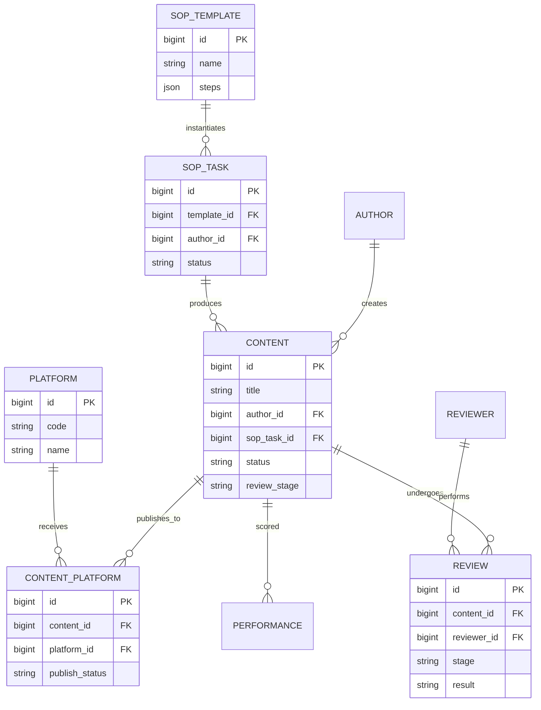

# PRD-M2-内容生产

> **业务域**：M2 内容生产
> **功能模块**：SOP 管理 + 计划管理 + 任务管理 + 内容管理 + **公推模板库** + 知识库
> **详细设计章节**：5.8、5.9、5.10、5.11、**5.11a（公推模板库，草案）**
> **版本**：v1.4 | 2026-06-14
> **状态**：Draft（公推模板库 FR-M2-005 待产品批准；§8.3 阻塞项未闭合前禁止实现）
> **全局规范**：[`docs/engineering/GLOBAL-CONVENTIONS.md`](./../engineering/GLOBAL-CONVENTIONS.md)

---

## 0. 元信息

| 字段 | 值 |
|------|---|
| 模块 | M2 内容生产 |
| 业务域 | 内容生产（PROD） |
| 详细设计 | `## 5.8~5.11` |
| 父 PRD | `@完整PRD-v9.1-开发版.md` |
| 关联 UX | `docs/product/UX-M2-内容生产.md` |
| 关联 API | `docs/engineering/API-M2-内容生产.md` · `docs/engineering/API-M2-计划管理.md` |
| 关联 STATE | `docs/engineering/STATE-M2-内容生产.md` |
| 关联 ADR | `ADR-012` · `ADR-016` · `ADR-017` · `ADR-018` · `ADR-019` · `ADR-021` · `ADR-024`~`026`（跨模块） |

---

## 1. 概述

### 1.1 一句话描述

管理**内容从创作到发布**的全生命周期：SOP 模板编排（DAG + 并行）→ 业务计划编排 → 任务执行 → **可配置二级审核**（系统参数，默认一级 IP 组长 + 二级部门负责人）→ 自动发布 → 知识沉淀。

### 1.2 目标与指标

| 维度 | 目标 | 可量化指标 |
|------|------|------------|
| 提效 | SOP 模板复用 | 80% 内容走预置 SOP |
| 质量 | 可配置二级审核 | 二级通过率 ≥ 70% |
| 并行 | DAG 并行节点 | 平均任务周期缩短 30% |

### 1.3 术语表

| 术语 | 定义 |
|------|------|
| **SOP** | Standard Operating Procedure，标准作业程序 |
| **DAG** | Directed Acyclic Graph，有向无环图（用于编排节点依赖） |
| **并行组** | `parallel_group` 相同的节点可并行分配给不同岗位人员 |
| **预置 SOP** | 系统初始化导入的标准内容生产运营流程（14 节点，4 路并行） |
| **可配置二级审核** | 一级审核 → 二级审核（均可通过 M9 系统参数开关/指定角色；默认一级=IP 组长范围） |
| **AI 辅助创作** | 创作者选择 AI 模型生成草稿（**需人工审核**） |
| **知识库** | 沉淀案例、模板、运营经验供团队复用 |
| **公推模板库** | 公众号推文 **内容版式** 模板（非 SOP 流程模板）；支持链接/Word 导入 |
| **版式正文** | 带块结构/样式的富正文（`layout_json`），区别于 LONGTEXT 纯文本 `body` |

---

## 2. 用户与权限

### 2.1 角色 × 能力

| 能力 \ 角色 | 系统管理员 | 运营管理者 | 运营组长 | 公众号运营 | 剪辑 | 直播运营 | 销售 |
|------------|-----------|-----------|---------|-----------|------|---------|------|
| 查看 SOP 模板 | ✅ | ✅ | ✅ | ✅ | ✅ | ✅ | ✅ |
| 新增/编辑/删除 SOP 节点 | ✅ | ✅ | ❌ | ❌ | ❌ | ❌ | ❌ |
| 接收/审核 SOP 节点 | - | - | 匹配岗位 | - | - | - | - |
| 执行任务 | - | - | 匹配岗位 | 匹配岗位 | 匹配岗位 | 匹配岗位 | 匹配岗位 |
| 创建/编辑内容 | ✅ | ✅ | ✅ | ✅ | ✅ | ✅ | ✅ |
| 提交审核 | ✅ | ✅ | ✅ | ✅ | ✅ | ✅ | ✅ |
| 一级/二级审核 | - | - | 匹配配置角色 / IP 组长 | - | - | - | - |
| AI 辅助创作 | ✅ | ✅ | ✅ | ✅ | ✅ | ✅ | ✅ |
| 知识库 CRUD | ✅（全部） | ✅（全部） | ✅（本人） | ✅（本人） | ✅（本人） | ✅（本人） | ✅（本人） |
| 公推模板库 CRUD | ✅ | ✅ | ✅ | ❌ | ❌ | ❌ | ❌ |
| 公推模板库 使用（应用模板） | ✅ | ✅ | ✅ | ✅ | ✅ | ✅ | ✅ |

### 2.2 权限规则

- **岗位匹配**：节点执行人/审核人 = 任务分配用户的 `position` 字段
- **本人内容**：内容创作者仅可编辑自己创建的内容
- **审核阶段**：每个审核人仅能操作匹配的阶段（一级/二级）；一级角色为 `OPS_LEADER` 时仅可审本 IP 组内容（ADR-017）

---

## 3. 范围

### 3.1 In Scope（5 个 FR 模块）

| FR 编号 | 名称 | 优先级 | 详细设计 |
|---------|------|--------|---------|
| FR-M2-001 | SOP 模板管理（DAG + 审核 + 并行 + 预置模板） | P0 | 5.8 |
| FR-M2-009 | 计划管理（SOP + IP 组 + 赛事 + 任务联动） | P0 | 5.9 |
| FR-M2-002 | 任务管理（任务实例 + 状态机 + SLA） | P0 | 5.9 |
| FR-M2-003 | 内容管理（AI 生成 + 可配置二级审核 + 发布） | P0 | 5.10 |
| FR-M2-004 | 内容知识库 | P1 | 5.11 |
| **FR-M2-005** | **公推模板库（版式模板 CRUD + 导入 + 内容应用）** | **P0** | **5.11a（草案）** |

### 3.2 Out of Scope

1. ❌ **不实现** SOP 版本管理（v1.0 不支持）
2. ❌ **不实现** 视频转码（依赖第三方）
3. ❌ **不实现** 第三方平台接入（公众号 API 等由 `## 5.40 数据采集` 负责）
4. ❌ **不实现** 内容评论/点赞/转发（关注**内容生产**而非消费）
5. ❌ **不实现** 知识库智能推荐（v1.0 仅做搜索）
6. ❌ **不实现** 第三方排版 SaaS（135/秀米）深度集成 — Phase 2
7. ❌ **不实现** 模板版本管理、多人协同编辑模板 — v1.0 不支持

**与知识库边界**：知识库「模板库」分类存放 **运营经验/文案范例**（富文本）；公推模板库存 **可复用版式块结构**（`layout_json`）+ 导入管线，**不合并**。

---

## 4. 功能需求

### FR-M2-001 SOP 模板管理（5.8）

#### 4.1.1 描述

管理员可创建/编辑 SOP 模板，配置节点（执行岗位、审核要求、前置依赖、并行组），DAG 自动检测环。

#### 4.1.2 前置条件

- 用户角色 ∈ {系统管理员, 运营管理者}

#### 4.1.3 主流程

1. 进入"SOP 模板管理"
2. 新建/编辑模板（`template_name`, `content_type`, `platform_type`, `description`）
3. 添加节点（`node_name`, `node_type`, `node_order`, `executor_role`, `need_review`, `reviewer_role`, `predecessors`, `parallel_group`, `sla_hours`）
4. 后端 `validate-dag` 检测环
5. 启用模板（`status=1`）

#### 4.1.4 异常流

| 异常 | 提示 |
|------|------|
| DAG 存在环 | 红色提示"节点 X 形成环，请重新设置前置关系" |
| 节点未配置 `executor_role` | "请选择执行岗位" |
| 启用模板但无节点 | "模板至少包含 1 个节点" |

#### 4.1.5 业务规则

- **DAG 合法性**：拓扑排序检测存在环 → 拒绝保存
- **预置模板**：初始化导入"标准内容生产运营流程"（14 节点，4 路并行，详见 `## 5.8.6`）
- **节点数上限**：单模板 ≤ 50 节点
- **岗位下拉**：使用 `<DictSelect dict-type="dict_position" />`
- **审核要求**：`need_review=1` 时 `reviewer_role` 必填

#### 4.1.5.1 实现补充（2026-06-11，`sop/edit.vue`）

| 项 | 实现 |
|----|------|
| 布局 | `el-row` 栅格 **4 + 14 + 6 = 24**（节点库 / LogicFlow 画布 / 属性面板） |
| 保存持久化 | `persistNodes()`：新节点 `POST create` → ID remap → 全量 `PUT update`（含 `predecessors`） |
| 连线锚点 | 新建节点后 `applyIdRemap` 同步 LogicFlow 边与 `nodes`/`edges` 的 ID |
| 执行/审核岗位 | 属性面板 `<DictSelect dict-type="dict_position" />` |

**已知缺口（Out of Scope 本期）**：

- 前端可删除画布节点，但**无后端节点 DELETE API**；已持久化节点删除仅本地生效，刷新后恢复
- SOP 版本管理仍为 Out of Scope（§3.2）

#### 4.1.6 数据项

| 字段 | 类型 | 控件 | 字典/实体 |
|------|------|------|----------|
| `template_name` | VARCHAR(100) | `<Input />` | - |
| `content_type` | VARCHAR(20) | `<DictSelect dict-type="dict_content_type" />` | 字典 |
| `platform_type` | VARCHAR(20) | `<DictSelect dict-type="dict_platform_type" />` | 字典 |
| `description` | VARCHAR(500) | `<TextArea />` | - |
| `status` | TINYINT | `<Switch />` | - |
| 节点 `executor_role` | VARCHAR(30) | `<DictSelect dict-type="dict_position" />` | 字典 |
| 节点 `need_review` | TINYINT(1) | `<Switch />` | - |
| 节点 `reviewer_role` | VARCHAR(30) | `<DictSelect dict-type="dict_position" />` | 字典（条件必填） |
| 节点 `predecessors` | JSON | `<SelectMultiple />`（节点多选） | `oa_sop_node`（同模板） |
| 节点 `parallel_group` | VARCHAR(50) | `<Input />` | - |
| 节点 `sla_hours` | INT | `<InputNumber />` | - |
| 节点 `node_type` | VARCHAR(30) | `<DictSelect dict-type="dict_sop_node_type" />` | 字典（**必填**，ADR-016） |

**`dict_sop_node_type` 取值**（ADR-016，替代原 7 值）：

| 值 | 含义 |
|----|------|
| `CONTENT_GENERATION` | 内容生成：任务执行页可进入内容创作并完成联动 |
| `CONTENT_PUBLISH` | 内容发布：执行页走发布类操作（交互待 BLK-M2-009） |
| `NORMAL` | 普通节点：常规执行，无内容联动 |

#### 4.1.7 验收标准

**AC-M2-001-1**（DAG 验证）
- Given 编辑模板，添加节点 A，节点 A 的 `predecessors`=[B,C]
- When 节点 B 的 `predecessors` 包含 A（形成环）
- Then 保存失败，提示"节点 A 与 B 形成环"

**AC-M2-001-2**（岗位选择器）
- Given 编辑节点
- When 设置 `executor_role`
- Then 弹出字典选择器 `dict_position`（运营组长/公众号运营/剪辑等）

**AC-M2-001-3**（预置模板加载）
- Given 全新租户
- When 完成初始化
- Then 系统自动导入"标准内容生产运营流程"（14 节点，4 路并行）

**AC-M2-001-4**（审核配置）
- Given 编辑节点
- When 切换 `need_review=1`
- Then `reviewer_role` 字段变为必填

**AC-M2-001-5**（并行组）
- Given 节点 1/2/3 均有 `parallel_group=GROUP_A`
- When SOP 激活到节点 1
- Then 节点 1/2/3 同时被分配

**AC-M2-001-6**（节点类型，需求 2）
- Given 编辑 SOP 节点
- When 设置 `node_type`
- Then 弹出 `dict_sop_node_type` 选择器，仅含「内容生成 / 内容发布 / 普通节点」三值；保存后持久化

---

### FR-M2-009 计划管理（5.9）

> **Slice**：S-09 · **API**：[`API-M2-计划管理.md`](../engineering/API-M2-计划管理.md) · **ADR**：[`ADR-012`](../adr/ADR-012-计划管理任务联动.md)

#### 4.1.9 描述

业务计划关联 SOP 模板、IP 组与外部赛事，保存时自动生成计划任务（草稿期隐藏），启动后任务进入任务列表。

#### 4.1.10 主流程

1. 选择 SOP 模板、IP 组、多个赛事（外部 API，Phase 1 Mock）
2. 自动加载 SOP 节点，逐步分配**赛事**（来自计划赛事池）、执行人及起止时间（默认=计划日期）
3. 保存 → 计划状态=草稿，任务状态=`PLAN_DRAFT` 且 `visible_in_list=0`
4. 启动计划 → 计划=进行中，任务=`PENDING` 且可见
5. 申请终止 → 计划=终止审批中；运营组长审批 → 计划/任务=已终止

#### 4.1.11 数据项

| 字段 | 控件 | 字典/实体 |
|------|------|----------|
| `plan_name` | `<Input />` | - |
| `template_id` | `<Select />`（SOP 模板） | `oa_sop_template` |
| `ip_group_id` | `<IpGroupTreeSelect />` | `oa_ip_group` |
| `start_date` / `end_date` | `<DatePicker />`（范围） | - |
| `competitions` | `<SelectMultiple />`（Mock） | 外部赛事 |
| `steps[].assignee_ids` | `<UserSelect />`（**单选**，后端 `assigneeIds` 长度=1） | `sys_user` |
| `steps[].competition_ids` | `<Select multiple />`（计划赛事池，**可多选**） | 外部赛事（ADR-016/017） |
| `steps[].scheduled_start/end` | `<DateTimePicker />` | 默认计划日期 |
| `status` | 只读 | `dict_plan_status` |

**业务规则（需求 3 + 2026-06-13）**：
- 每 SOP 步骤须从计划已选赛事池中分配 **≥1 个** `competition_id`（UI 多选；JSON 存 `competition_ids`）
- 每步骤 **1 名**执行人（UI 单选；API 仍用 `assigneeIds: [id]`）
- 多赛事 × 单执行人 → 生成 **多条** `oa_task`（每条绑定一个 `competition_id`）
- 计划详情抽屉展示 **生成的任务记录**（节点、赛事、执行人、岗位、状态、计划起止时间）

#### 4.1.12 验收标准

**AC-M2-009-1** 保存草稿后任务列表不可见该计划任务  
**AC-M2-009-2** 启动后任务列表可见且状态=PENDING  
**AC-M2-009-3** 终止须组长审批通过后计划与任务均为 TERMINATED  
**AC-M2-009-4**（需求 3）每步骤分配赛事后，关联 `oa_task.competition_id` 与步骤一致

---

### FR-M2-002 任务管理（5.9）

#### 4.2.1 描述

SOP 任务实例，跟踪任务执行状态、节点进度、审核结果、SLA 超时告警。任务可由**计划管理**（FR-M2-009）批量创建。

#### 4.2.2 主流程

1. 业务计划关联 SOP 模板 → 系统自动创建任务实例（见 FR-M2-009）
2. 按 DAG 顺序激活节点
3. 执行人在「我的任务」中，状态=`PENDING`（待执行）时点击「执行」→ 打开**任务执行页**（需求 4–5）
4. 执行页：查看基本信息 / 执行说明 / 附件；按 `node_type` 展示操作区
5. 执行人保存或完成任务；`node_type=CONTENT_GENERATION` 时须有关联内容且 `status=COMPLETED` 方可完成
6. 需审核节点 → 提交审核 → 审核通过/驳回
7. SLA 超时 → 钉钉通知

#### 4.2.3 业务规则

- **DAG 顺序**：前置节点未完成 → 后续节点不可操作
- **并行组**：`parallel_group` 相同的任务并行激活
- **SLA 超时**：超过 `sla_hours` 自动发送钉钉通知（详见 `## 5.40 钉钉推送`）

#### 4.2.4 状态机

详见 `docs/engineering/STATE-M2-内容生产.md` § 1（SOP 任务状态机）。

#### 4.2.5 数据项

| 字段 | 字典/关联 |
|------|----------|
| `executor_role` | `<DictSelect dict-type="dict_position" />` |
| `status` | `dict_sop_node_status`（待办/进行中/已完成/已驳回/已跳过） |
| `competition_id` | 外部赛事 ID（继承计划步骤，只读） |
| `content_id` | 关联 `oa_content`（内容生成节点，0..1） |
| 节点完成 | 触发"提交审核"（`need_review=1`）或直接 `DONE` |
| 审核驳回 | 任务回到"执行中"状态 |

#### 4.2.5.1 任务执行页（需求 4–5，P-M2-012）

| 区域 | 内容 |
|------|------|
| 基本信息 | 任务名称、节点名称、计划、IP 组、赛事、SLA |
| 执行说明 | 节点/步骤说明文案（来源 **BLK-M2-008**） |
| 附件 | 只读列表 + 上传（存储 **BLK-M2-007**） |
| 操作区-内容生成 | 按钮「进入内容创作」→ 带 `taskId`+`competitionId`；已有关联内容则展示摘要 + 编辑入口 |
| 操作区-普通/发布 | 按 `node_type` 展示（发布节点 **BLK-M2-009**） |
| 底部 | 「保存」（草稿态字段）/「完成」（→ 任务 `DONE` 或 `PENDING_REVIEW`） |

**完成门禁**（`node_type=CONTENT_GENERATION`）：
- 须存在 `oa_content.task_id = 当前任务`
- 且 `oa_content.status = COMPLETED`（ADR-016）
- 否则拒绝完成，错误码 **2008**（待 API Spec 登记）

#### 4.2.6 验收标准

**AC-M2-002-1**（DAG 顺序激活）
- Given 节点 A（predecessors=[B,C]）
- When B 和 C 都未完成
- Then A 状态=待执行，不可操作

**AC-M2-002-2**（并行组同时激活）
- Given 节点 1/2/3 同 `parallel_group`
- When 前置节点完成
- Then 节点 1/2/3 同步显示为"执行中"

**AC-M2-002-3**（SLA 超时通知）
- Given 节点 `sla_hours=24`
- When 已耗时 25h
- Then 钉钉自动发送"任务 X 已超时"

**AC-M2-002-4**（审核驳回回到执行中）
- Given 节点 A 状态=待审核
- When 审核人驳回
- Then A 状态=执行中，原执行人重新操作

**AC-M2-002-5**（我的任务-执行入口，需求 4）
- Given 当前用户为任务执行人，任务状态=`PENDING`
- When 在「我的任务」点击「执行」
- Then 打开任务执行页，展示基本信息与操作区

**AC-M2-002-6**（内容生成节点完成门禁，需求 5）
- Given 任务节点 `node_type=CONTENT_GENERATION`，无关联内容或内容 `status≠COMPLETED`
- When 点击「完成」
- Then 拒绝完成并提示须先完成内容创作

**AC-M2-002-7**（内容生成节点正常完成，需求 5）
- Given 已有关联内容且 `status=COMPLETED`
- When 点击「完成」
- Then 任务状态→`DONE`（或 `PENDING_REVIEW` 若 `need_review=1`）

---

### FR-M2-003 内容管理（5.10）

#### 4.3.1 描述

内容全生命周期管理：创作（AI 辅助）→ **可配置二级审核**（ADR-017）→ 自动发布。

#### 4.3.2 主流程

**独立创作路径**（内容管理列表 → **弹窗** `ContentEditDialog`，菜单无独立「内容创作」页）：
1. 创作者填写内容（`title`, `content_type`, 可选 `platform_types` / `account_ids`, `body`；**无封面 URL 字段**）
2. `ip_group_id` **必填**（须为用户所属 IP 组之一）
3. 可选关联赛事（`MatchSelectDialog` 单选）
4. 可选「AI 辅助生成」→ 选择 M8 已启用模型 + 匹配提示词 → 调 LLM 写入 `body`（LONGTEXT）
5. 「保存」→ `DRAFT`；「**提交审核**」→ 进入 ADR-017 配置的审核流（非「确认」）

**任务驱动创作路径**（任务执行页 / 内容管理 → **弹窗**，`?taskId=` 或 `ContentEditDialog`）：
1. 自动带入 `task_id`、任务 IP 组（只读）；赛事可 `MatchSelectDialog` 选择/清除
2. 选择 `content_type`；若 `ARTICLE` → `document_type`
3. 若 `SHORT_VIDEO` → 只读引用同赛事短视频文案
4. 「生成」：文档/视频 AI（M8 提示词 + 真实 LLM HTTP）
5. 「保存」→ `DRAFT`；「**提交审核**」→ 审核流；待审核态 **只读**（不可编辑）
6. 任务执行页通过弹窗进入创作（非路由跳转菜单）

#### 4.3.3 业务规则

- **可配置二级审核串行**（ADR-017）：按系统参数跳过未启用级别；任一环节驳回 → 流程结束
- **AI 生成内容**：须人工审核通过方可发布
- **平台/账号**：独立创作时 **可选**、**可多选**；任务驱动场景可不填
- **无封面图**：UI 已移除 `cover_image` / `coverUrl` 录入（库字段保留兼容）
- **自动发布**：末级审核通过 → `@Async` 发布

#### 4.3.4 状态机

详见 `docs/engineering/STATE-M2-内容生产.md` § 2（可配置二级审核状态机，ADR-017）。

#### 4.3.5 数据项

| 字段 | 控件 | 字典/实体 |
|------|------|----------|
| `content_type` | `<DictSelect dict-type="dict_content_type" />` | 字典 |
| `platform_types` | `<DictSelect multiple />`（可选） | 字典 |
| `account_ids` | `<AccountSelect multiple />`（可选，联动 platform_types + ip_group_id） | `oa_account` |
| `competition_id` | `<MatchSelectDialog />`（可选/任务只读） | 外部赛事 |
| `body` | `<Textarea />` / 富文本 | LONGTEXT |
| `creator_user_id` | `<UserSelect />` | `sys_user` |
| `ai_generated` | `<Switch />` | - |
| `task_id` | 隐藏/只读 | `oa_task`（任务场景） |
| `competition_id` | 只读 | 外部赛事 |
| `document_type` | `<DictSelect dict-type="dict_document_type" />` | 仅 `content_type=ARTICLE` 必填 |
| `ip_group_id` | `<IpGroupTreeSelect />` | `oa_ip_group`（默认当前用户所属，可切换） |
| `author_id` | 只读/联动 IP 组 | `oa_author` |
| `final_video_url` | `<VideoUploader />` | 短视频最终视频（可空，空则用 AI 生成） |

#### 4.3.5.1 FR-M2-003-AI（占位，依赖 M8 + BLK）

> **不编造 endpoint 细节**。实现前须确认 BLK-M2-004 / BLK-M2-005。

- 文档 AI 生成：输入 `competitionId` + `documentType` → 读取 M8 提示词 → 变量替换 → 调模型 → 写入 `body`
- 短视频 AI 生成：输入 `competitionId` → 读取提示词 → 生成视频 → 写入 `generated_video_url` / `final_video_url`
- 复用或扩展 `POST /admin-api/oa/content/ai-generate`（契约待 Slice S-13 定稿）

#### 4.3.6 验收标准

**AC-M2-003-1**（关联属性强制选择）
- Given 创建内容，平台=抖音
- When 点击"选择发布账号"
- Then 弹出选择器仅显示"抖音类型"账号；不显示"快手类型"账号

**AC-M2-003-2**（三级审核串行）
- Given 内容已提交初审
- When 初审通过
- Then 状态变为"待复审"，复审人可见

**AC-M2-003-3**（驳回后流程结束）
- Given 复审人驳回
- When 点击驳回
- Then 状态变为"已驳回"，创作者可见；终审人不可见

**AC-M2-003-4**（AI 内容必须人工审核）
- Given 内容 `ai_generated=1`
- When 提交
- Then 系统标记"AI 生成"，必须走完三级审核

**AC-M2-003-5**（自动发布）
- Given 终审通过
- When 审核动作完成
- Then 自动触发发布任务，30s 内状态变为"已发布"

**AC-M2-003-6**（文档类型联动，需求 6）
- Given `content_type=ARTICLE`
- When 打开编辑页
- Then 显示 `document_type` 下拉，含五类文档类型

**AC-M2-003-7**（短视频引用文案，需求 6）
- Given `content_type=SHORT_VIDEO` 且同赛事存在 `document_type=SHORT_VIDEO_SCRIPT` 的已完成文档
- When 打开编辑页
- Then 只读展示该文档正文供引用

**AC-M2-003-8**（IP 组作者默认，需求 6）
- Given 用户归属 1 个 IP 组
- When 从任务进入内容创作
- Then 自动填充该 IP 组及组内作者信息

**AC-M2-003-9**（任务内容保存/确认，需求 6）
- Given 任务驱动创作
- When 点击「保存」/「确认」
- Then 状态分别为 `DRAFT` / `COMPLETED`

**AC-M2-003-10**（短视频最终视频，需求 6）
- Given 已 AI 生成视频且未上传
- When 点击「确认」
- Then `final_video_url` 取 AI 生成视频 URL

---

### FR-M2-004 内容知识库（5.11）

#### 4.4.1 描述

沉淀优秀内容、创作模板、行业资料、运营经验，供团队参考复用。

#### 4.4.2 主流程

1. 用户新增知识（`title`, `category`, `content`, `tags`, `is_public`）
2. 搜索（关键字/标签/分类）
3. 查看详情

#### 4.4.3 业务规则

- **分类**：`category` 使用枚举（**注意**：v1.0 用下拉固定值，v2.0 改字典）
- **公开/私有**：`is_public=1` 时租户内全员可见
- **本人内容**：用户可编辑/删除自己创建的知识

#### 4.4.4 数据项

| 字段 | 控件 | 字典/实体 |
|------|------|----------|
| `title` | `<Input />` | - |
| `category` | `<Select />` | 固定值（案例库/模板库/行业资料/运营经验） |
| `content` | `<RichTextEditor />` | - |
| `tags` | `<TagInput />` | - |
| `is_public` | `<Switch />` | - |

#### 4.4.5 验收标准

**AC-M2-004-1**（创建）
- Given 创作者身份
- When 创建知识
- Then 自动 `creator_user_id` 设为本人

**AC-M2-004-2**（公开/私有）
- Given 知识 `is_public=0`
- When 其他用户搜索
- Then 仅本人可见

**AC-M2-004-3**（搜索）
- Given 输入关键字"运营 SOP"
- When 搜索
- Then 返回 title 或 content 包含"运营 SOP"的知识

---

### FR-M2-005 公推模板库（5.11a · 草案）

> **Slice**：S-14 · **UX**：P-M2-013~016 · **API**：`API-M2` §6 · **ADR**：`ADR-019`（Draft）

#### 4.5.1 背景与目标

公众号推文除文案外，须保持 **标题层级、段落样式、引用、配图位** 等版式一致性。当前内容 `body` 为纯文本 Textarea，无法承载版式。本 FR 提供：

1. **模板库**：租户内维护可复用的推文版式模板
2. **导入**：公众号文章链接 **或** Word 文档 → 解析为版式模板
3. **应用**：内容类型为 **文章**（`content_type=ARTICLE`）时，创作/编辑页可选模板并写入富版式正文
4. **一致展示**：内容查看、内容审核须与编辑态相同的富版式渲染

#### 4.5.2 用户故事

| ID | 角色 | 故事 | 优先级 |
|----|------|------|--------|
| US-M2-005-1 | 运营管理者 | 我希望维护标准推文版式库，让团队排版统一 | P0 |
| US-M2-005-2 | 公众号运营 | 我希望从竞品公众号链接导入版式，再改文案 | P0 |
| US-M2-005-3 | 公众号运营 | 我希望上传 Word 稿件提取版式作为模板 | P1 |
| US-M2-005-4 | 内容创作者 | 我在写推文时一键套用模板，并在编辑器里改样式 | P0 |
| US-M2-005-5 | 审核人 | 我审核时能看见与创作者一致的排版效果 | P0 |

#### 4.5.3 前置条件

- 用户已登录；模板 CRUD 须 **系统管理员 / 运营管理者 / 运营组长**（**待产品确认** OQ-M2-023 是否含组长）
- 应用模板场景：内容 `content_type=ARTICLE`（`dict_content_type`）
- 租户隔离：`tenant_id` 全表过滤（铁律三）

#### 4.5.4 主流程

**A. 模板 CRUD**

1. 进入「公推模板库」列表（P-M2-013）
2. 新建模板：填写 `template_name`、`description`；可选 `document_type`（**可空=匹配全部文章子类型**，见 OQ-M2-021）
3. 编辑版式：块编辑器（**BLK-M2-015**）或导入后微调
4. 预览 → 保存；`status=ENABLED` 后可在内容创作页被选择

**B. 从公众号链接导入**

1. 列表页「导入」→ 选择「公众号链接」（P-M2-014）
2. 粘贴 `https://mp.weixin.qq.com/s/...` URL
3. 提交 → 异步 Job 抓取并解析（**BLK-M2-012**）
4. 预览解析结果 → 确认保存为模板；失败时提示 **手动粘贴 HTML** Fallback

**C. 从 Word 导入**

1. 「导入」→ 选择「Word 文档」
2. 上传 `.docx`（≤10MB，**待产品确认**）
3. 异步解析 → 预览 → 确认保存（**BLK-M2-014** 保真度声明）

**D. 内容创作应用模板**

1. 新增内容 / 任务执行内容编辑；`content_type=ARTICLE`
2. 显示「选择版式模板」按钮（仅 ARTICLE）
3. 打开模板选择器：列表过滤 **类型匹配** 的 ENABLED 模板
4. 选中模板 → 二次确认（若已有版式）→ 应用：复制 `layout_json`/`layout_html` 到内容；记录 `layout_template_id`
5. 正文区切换为 **富版式编辑器**（非 Textarea）；保存/提交审核时持久化

**E. 查看与审核**

- 内容列表「查看」、审核抽屉：只读渲染 `layout_html`（无 `layout_json` 时 fallback `body` 纯文本）

#### 4.5.5 异常流

| 异常 | 提示 |
|------|------|
| URL 抓取失败 | 「无法解析该链接，请尝试手动粘贴正文 HTML 或上传 Word」 |
| docx 格式非法 | 「仅支持 .docx，且文件不超过 10MB」 |
| 应用模板类型不匹配 | 「当前内容类型不支持该模板」（非 ARTICLE 或 document_type 不匹配） |
| 模板已停用 | 选择器不展示；已应用的内容保留原版式 |
| 导入 Job 超时 | 「导入处理中，请稍后在导入记录中查看」 |

#### 4.5.6 业务规则

- **类型匹配**（默认，ADR-019 §2.3）：模板与内容均为 `content_type=ARTICLE`；模板 `document_type` **为空** 或 **等于** 内容 `document_type`
- **待产品确认（OQ-M2-021）**：用户需求「文档类型=文章」— 现有 `dict_document_type` **无**「文章」值；见 CHANGELOG-REQ 审批项 #1
- **应用为复制**：应用后内容与模板 **解耦**；改模板不影响已创建内容
- **覆盖策略**：内容已有 `body_format=LAYOUT` 时再应用 → **须二次确认**（OQ-M2-022）
- **AI 生成**：AI 仍写入 `body`（PLAIN）；用户可再应用模板将文本迁入段落块
- **审核/发布**：富版式存 `layout_json`/`layout_html`；发布管线是否仅发纯文本 → **Phase 2 / M10**（Out of Scope 本期）

#### 4.5.7 数据项

**模板 `oa_wechat_layout_template`**

| 字段 | 类型 | 控件 | 字典/实体 |
|------|------|------|----------|
| `template_name` | VARCHAR(100) | `<Input />` | - |
| `description` | VARCHAR(500) | `<TextArea />` | - |
| `content_type` | VARCHAR(20) | 固定 `ARTICLE`（只读） | `dict_content_type` |
| `document_type` | VARCHAR(50) | `<DictSelect dict-type="dict_document_type" />` | **可空** |
| `layout_json` | JSON | 块编辑器 | ADR-019 §2.2 |
| `layout_html` | LONGTEXT | 只读预览 | 服务端渲染+消毒 |
| `thumbnail_url` | VARCHAR(512) | 自动生成首屏截图 | 可选 |
| `source_type` | VARCHAR(30) | 只读 | `dict_layout_template_source` |
| `source_url` | VARCHAR(1024) | 只读 | 导入来源 URL |
| `status` | VARCHAR(20) | `<DictSelect />` | `dict_layout_template_status` |
| `creator_user_id` | Long | `<UserSelect />` | `sys_user` |

**内容扩展 `oa_production_content`**

| 字段 | 说明 |
|------|------|
| `body_format` | `PLAIN` / `LAYOUT`（`dict_content_body_format`） |
| `layout_json` | 富版式 SSOT |
| `layout_html` | 只读渲染 |
| `layout_template_id` | 最近应用的模板 FK（可空） |

#### 4.5.8 验收标准

**AC-M2-005-1**（模板 CRUD）
- Given 运营管理者
- When 新建模板并保存版式块
- Then 列表可见且 `status=ENABLED` 后可被内容创作选择

**AC-M2-005-2**（类型匹配 — 应用）
- Given 内容 `content_type=ARTICLE`，模板 `document_type=POST_MATCH_REVIEW`
- When 内容 `document_type=POST_MATCH_REVIEW` 并打开模板选择器
- Then 可见该模板；当内容 `document_type=NEW_ACCOUNT_TRAFFIC` 时不可见（模板 document_type 非空时）

**AC-M2-005-3**（应用模板写入富版式）
- Given 内容尚无版式
- When 选择模板并确认应用
- Then `body_format=LAYOUT`，正文编辑器展示模板版式且可编辑

**AC-M2-005-4**（审核/查看一致渲染）
- Given 内容已保存 `layout_html`
- When 审核人打开审核抽屉
- Then 正文区渲染与创作者编辑预览一致（非纯文本）

**AC-M2-005-5**（Word 导入 — 成功路径 Mock）
- Given 合法 `.docx`
- When 上传并确认导入
- Then 生成模板且预览区可见标题/段落结构（允许样式偏差，见 BLK-M2-014）

**AC-M2-005-6**（URL 导入 Fallback）
- Given URL 抓取失败
- When 用户改用手动粘贴 HTML
- Then 仍可保存为模板（不依赖外部抓取）

**AC-M2-005-7**（非文章类型隐藏）
- Given 内容 `content_type=SHORT_VIDEO`
- When 打开内容编辑
- Then 不展示「选择版式模板」与富版式编辑器

#### 4.5.9 非目标

- 不实现微信公众号后台草稿同步
- 不实现模板多人实时协同编辑
- 不保证 Word/外链导入 100% 像素级还原

#### 4.5.10 依赖与风险

| 依赖 | 说明 |
|------|------|
| S-06 / S-13 | 内容 CRUD 与 ARTICLE 编辑页 |
| ADR-019 Accept | 存储格式与编辑器选型 |
| 可选异步 Job | docx/URL 导入（BLK-M2-013） |

| 风险 | 缓解 |
|------|------|
| 微信 URL 抓取合规/稳定性 | Fallback 手动粘贴；ADR-019 §2.4.1 |
| 编辑器选型延期 | Phase1 只读 HTML + 简编辑（须产品签字降级） |

---

## 5. 集成与数据

### 5.1 核心实体

| 实体 | 用途 | 关联 |
|------|------|------|
| `oa_sop_template` | SOP 模板 | `oa_sop_node`（一对多） |
| `oa_sop_node` | SOP 节点 | `oa_sop_review`（一对多） |
| `oa_sop_review` | 审核记录 | `oa_task`（多对一） |
| `oa_task` | 任务实例 | `sys_user`（执行人）、`oa_sop_node`、`competition_id` |
| `oa_content` | 内容 | `oa_account`、`sys_user`、`oa_task`（`task_id`）、`competition_id` |
| `oa_content_version` | 内容版本 | `oa_content` |
| `oa_review_record` | 审核记录 | `oa_content` |
| `oa_knowledge_base` | 知识库 | `sys_user`（创作者） |
| `oa_wechat_layout_template` | 公推版式模板 | `sys_user`（创建者） |
| `oa_layout_import_job` | 导入异步任务（可选） | 模板 |

### 5.2 关联属性（🔴 强约束）

| 字段 | 关联 | 选择器 |
|------|------|--------|
| `oa_sop_node.executor_role` | `dict_position` | `<DictSelect dict-type="dict_position" />` |
| `oa_sop_node.reviewer_role` | `dict_position` | `<DictSelect dict-type="dict_position" />` |
| `oa_content.platform_type` | `dict_platform_type` | `<DictSelect dict-type="dict_platform_type" />` |
| `oa_content.content_type` | `dict_content_type` | `<DictSelect dict-type="dict_content_type" />` |
| `oa_content.account_id` | `oa_account` | `<AccountSelect />` |
| `oa_content.creator_user_id` | `sys_user` | `<UserSelect />` |

---

## 6. 非功能需求

| 维度 | 要求 |
|------|------|
| 性能 | DAG 验证 ≤ 500ms（50 节点） |
| 性能 | 审核列表加载 ≤ 1s |
| 安全 | 审核动作需登录 + 权限 + 岗位匹配 |
| 审计 | 所有 SOP 变更、内容发布、审核动作记录审计日志 |
| AI 调用 | 流式响应，3s 内首字符 |

---

## 7. 决策记录

| 编号 | 问题 | 决策 | 原因 | 日期 |
|------|------|------|------|------|
| ADR-M2-001 | 异步发布依赖 RabbitMQ 吗？ | 不依赖，用 Spring `@Async` | 中间件简化（ADR-001） | 2026-06-07 |
| ADR-M2-002 | SOP 模板是否支持版本管理？ | 不支持 | 简化设计，启用新模板时停用旧模板 | 2026-06-07 |

---

## 8. 开放问题与阻塞清单（用户需求 2–6）

### 8.1 开放问题

| 编号 | 问题 | 负责人 | 截止 | 状态 |
|------|------|--------|------|------|
| OQ-M2-001 | AI 模型如何选型？调哪家 API？ | 后端 | 2026-06-15 | 待定 |
| OQ-M2-002 | SOP 模板能否复制？ | 产品 | 2026-06-15 | 待定 |

### 8.2 阻塞问题清单（Spec 未定义 — 实现前须确认）

| 编号 | 阻塞项 | 影响需求 | 状态 |
|------|--------|---------|------|
| BLK-M2-004 | **外部赛事实体/API**：后端代理 `/admin-api/oa/match/list` + 前端 `MatchSelectDialog`；`competitionId`=外部 `scheduleId` | 3, 5, 6 | ✅ 已决（2026-06-12） |
| BLK-M2-005 | **提示词配置键规则**：按赛事+文档类型选取 M8 提示词的匹配规则与 `dict_prompt_type` 扩展 | 6 | 🔴 阻塞 |
| BLK-M2-006 | **内容状态与审核流关系**：任务场景 `COMPLETED` 遗留与 `submit-review` 并存 | 5, 6 | 🟡 部分闭合（ADR-017；`/confirm` 兼容保留） |
| BLK-M2-007 | **任务执行附件存储**：表结构、上传 API、大小限制（ADR-001 本地文件策略待细化） | 5 | 🔴 阻塞 |
| BLK-M2-008 | **执行说明字段来源**：`oa_sop_node.description` vs `oa_content_plan_step.remark` | 5 | 🟡 待确认 |
| BLK-M2-009 | **`CONTENT_PUBLISH` 节点执行页**交互与完成条件 | 2, 5 | 🟡 待确认 |
| BLK-M2-010 | **AI 生成短视频 API**：视频产物存储、与 `final_video_url` 字段契约 | 6 | 🔴 阻塞 |
| BLK-M2-011 | **用户↔IP 组多归属**查询 API（自动带出 IP 组/作者） | 6 | 🟡 待确认 |

### 8.3 阻塞问题清单（公推模板库 FR-M2-005 — 实现前须确认）

| 编号 | 阻塞项 | 影响 | 状态 |
|------|--------|------|------|
| **BLK-M2-012** | **公众号文章 URL 抓取**：无官方 API、反爬、合规；是否允许外部代理 | 链接导入 | 🔴 阻塞 |
| **BLK-M2-013** | **docx 临时文件存储 + 异步 Job** 基础设施 | Word 导入 | 🟡 待确认 |
| **BLK-M2-014** | **Word 版式提取保真度**与用户预期管理 | Word 导入 | 🔴 阻塞 |
| **BLK-M2-015** | **富版式正文编辑器**选型（TipTap / WangEditor / 降级方案） | 编辑/审核/查看 | 🔴 阻塞 |
| **OQ-M2-021** | 「文档类型=文章」与 `dict_document_type` 五类子类型的映射策略 | 模板匹配 | 🔴 待产品确认 |
| **OQ-M2-022** | 应用模板后 `body` 纯文本字段保留/清空策略 | 内容字段 | 🟡 待确认 |
| **OQ-M2-023** | 模板库 CRUD 是否含运营组长；模板是否支持「仅本人」私有 | 权限 | 🟡 待确认 |

---

## 9. 实现补充（2026-06-13 · DOC-SYNC）

| 类别 | 实现 | Spec 位置 |
|------|------|-----------|
| 计划 | 步骤多赛事 + 单执行人；详情含任务表 | § FR-M2-009 · `API-M2-计划管理` |
| 任务 | 「我的任务」为默认 Tab；列表展示计划起止时间 | UX-M2 §4 |
| 任务执行 | 内容创作弹窗；提交审核（非确认） | UX-M2 §4.3 · ADR-017 |
| 内容 | 弹窗创作；无封面；可选多平台/账号；IP 组必填；LONGTEXT 正文 | UX-M2 §5 |
| 内容审核 | 一级/二级 Tab；角色+用户展示；查看只读 | UX-M2 §6 · ADR-017 |
| 导航 | 移除侧栏「内容创作」菜单；路由 `/content/edit` 保留深链 | UX-M2 §5 |
| 布局 | 移除各页重复 `el-breadcrumb`（统一 Layout 顶栏） | ADR-002 |
| 导出 | 内容列表 `exportToExcel` CSV | ADR-018 |
| 系统参数 | M9 Tab「内容审核」四条参数 + 角色下拉 | PRD-M9 · ADR-017 |

---

## 10. 实现补充（2026-06-15 · DOC-SYNC）

> 产品会话编号：**FR-143** · **FR-145** · **FR-147**

### FR-143 · 新建内容统一富文本编辑器

- **范围**：`content_type=ARTICLE` 的创作/编辑（独立弹窗 + 任务驱动 `ContentEditPanel`）
- **控件**：正文主区 **`<RichTextEditor />`**（TipTap），替代原 Textarea
- **存储**：`body_format=LAYOUT`；`layout_html` 为展示 SSOT；`body` 为纯文本摘要（ADR-021）
- **验收**：新建 ARTICLE → 编辑器可见；保存后审核/查看页 `LayoutViewer` 渲染一致

### FR-147 · 公推模板编辑同源编辑器

- **范围**：`layout-template/edit.vue`
- **行为**：模板编辑页「富文本编辑」Tab 使用与内容创作相同的 `RichTextEditor` + `EditorToolbar`
- **保存**：富文本模式保存前 `htmlToLayoutSchema` 同步 `layoutSchema`（ADR-021）

### FR-145 · 图文混排预置模板（V87）

- **范围**：租户 `tenant_id=1` 种子；每个 `document_type` + 通用各 1 条「【预置】图文混排·*」模板
- **结构**：`LayoutPresetSchemas.imageTextMixedSchema()` — 标题 + 导语 + 图/文交替 + 分隔 + 收尾
- **选用**：内容创作「选择版式模板」按 `document_type` 过滤可见

### 编辑器体验增强（2026-06-15）

| 能力 | 说明 |
|------|------|
| 全屏/还原 | `editorMaximized` 覆盖视口；收起版式侧栏 |
| 版式侧栏 | 默认 **收起**（`layoutPanelCollapsed=true`）；按钮「展开/收起版式结构」 |
| 图片宽度 | `ResizableImage` + `data-w` / `style.width` 持久化；`LayoutViewer` 查看态 `ensureImageWidthStyles` 对齐 |
| 微信 HTML | 粘贴 `normalizeWechatPasteHtml`；导出/存储 `sanitizeWechatExportHtml`（`wechatHtml.ts`） |
| 工具栏 | 撤销/重做、清除格式、字号、BIUS、颜色/高亮、对齐、列表、引用、表格、图片上传/宽度 |

---

*下一步：UX Spec / API Spec / STATE / SLICES / CHECKLIST / TESTCASES。*

---

## 核心 ER 图

详见 [`GLOBAL-CONVENTIONS.md § 2`](../engineering/GLOBAL-CONVENTIONS.md) (字典)
