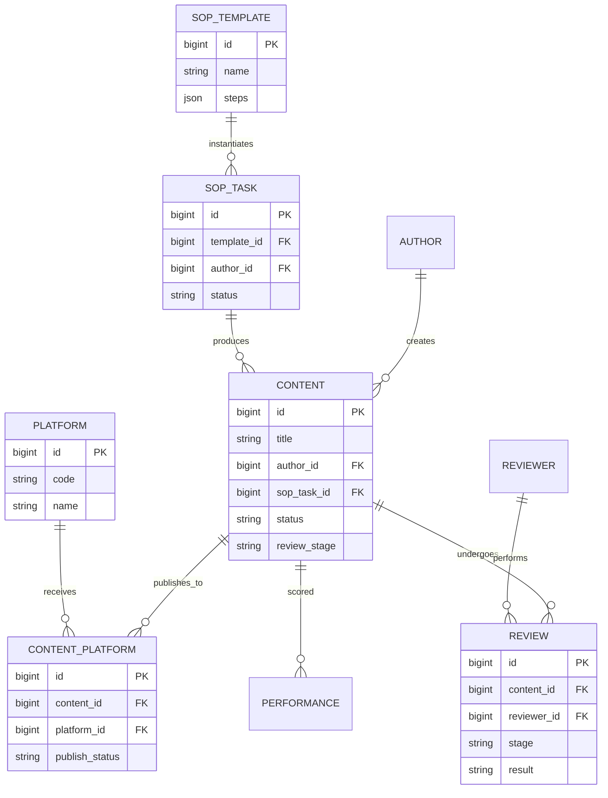

# PRD-M2-内容生产

> **业务域**：M2 内容生产
> **功能模块**：SOP 管理 + 计划管理 + 任务管理 + 内容管理 + 知识库
> **详细设计章节**：5.8、5.9、5.10、5.11
> **版本**：v1.0 | 2026-06-07
> **状态**：Draft
> **全局规范**：[`docs/engineering/GLOBAL-CONVENTIONS.md`](./../engineering/GLOBAL-CONVENTIONS.md)

---

## 0. 元信息

| 字段 | 值 |
|------|---|
| 模块 | M2 内容生产 |
| 业务域 | 内容生产（PROD） |
| 详细设计 | `## 5.8~5.11` |
| 父 PRD | `@完整PRD-v9.1-开发版.md` |
| 关联 UX | `docs/product/UX-M2-内容生产.md` |
| 关联 API | `docs/engineering/API-M2-内容生产.md` · `docs/engineering/API-M2-计划管理.md` |
| 关联 STATE | `docs/engineering/STATE-M2-内容生产.md` |
| 关联 ADR | `ADR-012`（计划任务联动） |

---

## 1. 概述

### 1.1 一句话描述

管理**内容从创作到发布**的全生命周期：SOP 模板编排（DAG + 并行）→ 业务计划编排 → 任务执行 → 三级审核 → 自动发布 → 知识沉淀。

### 1.2 目标与指标

| 维度 | 目标 | 可量化指标 |
|------|------|------------|
| 提效 | SOP 模板复用 | 80% 内容走预置 SOP |
| 质量 | 三级审核 | 终审通过率 ≥ 70% |
| 并行 | DAG 并行节点 | 平均任务周期缩短 30% |

### 1.3 术语表

| 术语 | 定义 |
|------|------|
| **SOP** | Standard Operating Procedure，标准作业程序 |
| **DAG** | Directed Acyclic Graph，有向无环图（用于编排节点依赖） |
| **并行组** | `parallel_group` 相同的节点可并行分配给不同岗位人员 |
| **预置 SOP** | 系统初始化导入的标准内容生产运营流程（14 节点，4 路并行） |
| **三级审核** | 初审 → 复审 → 终审，串行执行 |
| **AI 辅助创作** | 创作者选择 AI 模型生成草稿（**需人工审核**） |
| **知识库** | 沉淀案例、模板、运营经验供团队复用 |

---

## 2. 用户与权限

### 2.1 角色 × 能力

| 能力 \ 角色 | 系统管理员 | 运营管理者 | 运营组长 | 公众号运营 | 剪辑 | 直播运营 | 销售 |
|------------|-----------|-----------|---------|-----------|------|---------|------|
| 查看 SOP 模板 | ✅ | ✅ | ✅ | ✅ | ✅ | ✅ | ✅ |
| 新增/编辑/删除 SOP 节点 | ✅ | ✅ | ❌ | ❌ | ❌ | ❌ | ❌ |
| 接收/审核 SOP 节点 | - | - | 匹配岗位 | - | - | - | - |
| 执行任务 | - | - | 匹配岗位 | 匹配岗位 | 匹配岗位 | 匹配岗位 | 匹配岗位 |
| 创建/编辑内容 | ✅ | ✅ | ✅ | ✅ | ✅ | ✅ | ✅ |
| 提交审核 | ✅ | ✅ | ✅ | ✅ | ✅ | ✅ | ✅ |
| 初审/复审/终审 | - | - | 匹配阶段 | - | - | - | - |
| AI 辅助创作 | ✅ | ✅ | ✅ | ✅ | ✅ | ✅ | ✅ |
| 知识库 CRUD | ✅（全部） | ✅（全部） | ✅（本人） | ✅（本人） | ✅（本人） | ✅（本人） | ✅（本人） |

### 2.2 权限规则

- **岗位匹配**：节点执行人/审核人 = 任务分配用户的 `position` 字段
- **本人内容**：内容创作者仅可编辑自己创建的内容
- **审核阶段**：每个审核人仅能操作匹配的阶段（初审/复审/终审）

---

## 3. 范围

### 3.1 In Scope（5 个 FR 模块）

| FR 编号 | 名称 | 优先级 | 详细设计 |
|---------|------|--------|---------|
| FR-M2-001 | SOP 模板管理（DAG + 审核 + 并行 + 预置模板） | P0 | 5.8 |
| FR-M2-009 | 计划管理（SOP + IP 组 + 赛事 + 任务联动） | P0 | 5.9 |
| FR-M2-002 | 任务管理（任务实例 + 状态机 + SLA） | P0 | 5.9 |
| FR-M2-003 | 内容管理（AI 生成 + 三级审核 + 发布） | P0 | 5.10 |
| FR-M2-004 | 内容知识库 | P1 | 5.11 |

### 3.2 Out of Scope

1. ❌ **不实现** SOP 版本管理（v1.0 不支持）
2. ❌ **不实现** 视频转码（依赖第三方）
3. ❌ **不实现** 第三方平台接入（公众号 API 等由 `## 5.40 数据采集` 负责）
4. ❌ **不实现** 内容评论/点赞/转发（关注**内容生产**而非消费）
5. ❌ **不实现** 知识库智能推荐（v1.0 仅做搜索）

---

## 4. 功能需求

### FR-M2-001 SOP 模板管理（5.8）

#### 4.1.1 描述

管理员可创建/编辑 SOP 模板，配置节点（执行岗位、审核要求、前置依赖、并行组），DAG 自动检测环。

#### 4.1.2 前置条件

- 用户角色 ∈ {系统管理员, 运营管理者}

#### 4.1.3 主流程

1. 进入"SOP 模板管理"
2. 新建/编辑模板（`template_name`, `content_type`, `platform_type`, `description`）
3. 添加节点（`node_name`, `node_order`, `executor_role`, `need_review`, `reviewer_role`, `predecessors`, `parallel_group`, `sla_hours`）
4. 后端 `validate-dag` 检测环
5. 启用模板（`status=1`）

#### 4.1.4 异常流

| 异常 | 提示 |
|------|------|
| DAG 存在环 | 红色提示"节点 X 形成环，请重新设置前置关系" |
| 节点未配置 `executor_role` | "请选择执行岗位" |
| 启用模板但无节点 | "模板至少包含 1 个节点" |

#### 4.1.5 业务规则

- **DAG 合法性**：拓扑排序检测存在环 → 拒绝保存
- **预置模板**：初始化导入"标准内容生产运营流程"（14 节点，4 路并行，详见 `## 5.8.6`）
- **节点数上限**：单模板 ≤ 50 节点
- **岗位下拉**：使用 `<DictSelect dict-type="dict_position" />`
- **审核要求**：`need_review=1` 时 `reviewer_role` 必填

#### 4.1.6 数据项

| 字段 | 类型 | 控件 | 字典/实体 |
|------|------|------|----------|
| `template_name` | VARCHAR(100) | `<Input />` | - |
| `content_type` | VARCHAR(20) | `<DictSelect dict-type="dict_content_type" />` | 字典 |
| `platform_type` | VARCHAR(20) | `<DictSelect dict-type="dict_platform_type" />` | 字典 |
| `description` | VARCHAR(500) | `<TextArea />` | - |
| `status` | TINYINT | `<Switch />` | - |
| 节点 `executor_role` | VARCHAR(30) | `<DictSelect dict-type="dict_position" />` | 字典 |
| 节点 `need_review` | TINYINT(1) | `<Switch />` | - |
| 节点 `reviewer_role` | VARCHAR(30) | `<DictSelect dict-type="dict_position" />` | 字典（条件必填） |
| 节点 `predecessors` | JSON | `<SelectMultiple />`（节点多选） | `oa_sop_node`（同模板） |
| 节点 `parallel_group` | VARCHAR(50) | `<Input />` | - |
| 节点 `sla_hours` | INT | `<InputNumber />` | - |

#### 4.1.7 验收标准

**AC-M2-001-1**（DAG 验证）
- Given 编辑模板，添加节点 A，节点 A 的 `predecessors`=[B,C]
- When 节点 B 的 `predecessors` 包含 A（形成环）
- Then 保存失败，提示"节点 A 与 B 形成环"

**AC-M2-001-2**（岗位选择器）
- Given 编辑节点
- When 设置 `executor_role`
- Then 弹出字典选择器 `dict_position`（运营组长/公众号运营/剪辑等）

**AC-M2-001-3**（预置模板加载）
- Given 全新租户
- When 完成初始化
- Then 系统自动导入"标准内容生产运营流程"（14 节点，4 路并行）

**AC-M2-001-4**（审核配置）
- Given 编辑节点
- When 切换 `need_review=1`
- Then `reviewer_role` 字段变为必填

**AC-M2-001-5**（并行组）
- Given 节点 1/2/3 均有 `parallel_group=GROUP_A`
- When SOP 激活到节点 1
- Then 节点 1/2/3 同时被分配

---

### FR-M2-009 计划管理（5.9）

> **Slice**：S-09 · **API**：[`API-M2-计划管理.md`](../engineering/API-M2-计划管理.md) · **ADR**：[`ADR-012`](../adr/ADR-012-计划管理任务联动.md)

#### 4.1.9 描述

业务计划关联 SOP 模板、IP 组与外部赛事，保存时自动生成计划任务（草稿期隐藏），启动后任务进入任务列表。

#### 4.1.10 主流程

1. 选择 SOP 模板、IP 组、多个赛事（外部 API，Phase 1 Mock）
2. 自动加载 SOP 节点，逐步分配执行人及起止时间（默认=计划日期）
3. 保存 → 计划状态=草稿，任务状态=`PLAN_DRAFT` 且 `visible_in_list=0`
4. 启动计划 → 计划=进行中，任务=`PENDING` 且可见
5. 申请终止 → 计划=终止审批中；运营组长审批 → 计划/任务=已终止

#### 4.1.11 数据项

| 字段 | 控件 | 字典/实体 |
|------|------|----------|
| `plan_name` | `<Input />` | - |
| `template_id` | `<Select />`（SOP 模板） | `oa_sop_template` |
| `ip_group_id` | `<IpGroupTreeSelect />` | `oa_ip_group` |
| `start_date` / `end_date` | `<DatePicker />`（范围） | - |
| `competitions` | `<SelectMultiple />`（Mock） | 外部赛事 |
| `steps[].assignee_ids` | `<UserSelect multiple />` | `sys_user` |
| `steps[].scheduled_start/end` | `<DateTimePicker />` | 默认计划日期 |
| `status` | 只读 | `dict_plan_status` |

#### 4.1.12 验收标准

**AC-M2-009-1** 保存草稿后任务列表不可见该计划任务  
**AC-M2-009-2** 启动后任务列表可见且状态=PENDING  
**AC-M2-009-3** 终止须组长审批通过后计划与任务均为 TERMINATED

---

### FR-M2-002 任务管理（5.9）

#### 4.2.1 描述

SOP 任务实例，跟踪任务执行状态、节点进度、审核结果、SLA 超时告警。任务可由**计划管理**（FR-M2-009）批量创建。

#### 4.2.2 主流程

1. 业务计划关联 SOP 模板 → 系统自动创建任务实例（见 FR-M2-009）
2. 按 DAG 顺序激活节点
3. 执行人/审核人接收任务 → 完成/审核通过/驳回
4. SLA 超时 → 钉钉通知

#### 4.2.3 业务规则

- **DAG 顺序**：前置节点未完成 → 后续节点不可操作
- **并行组**：`parallel_group` 相同的任务并行激活
- **SLA 超时**：超过 `sla_hours` 自动发送钉钉通知（详见 `## 5.40 钉钉推送`）

#### 4.2.4 状态机

详见 `docs/engineering/STATE-M2-内容生产.md` § 1（SOP 任务状态机）。

#### 4.2.5 数据项

| 字段 | 字典/关联 |
|------|----------|
| `executor_role` | `<DictSelect dict-type="dict_position" />` |
| `status` | `dict_sop_node_status`（待办/进行中/已完成/已驳回/已跳过） |
| 节点完成 | 触发"提交审核" |
| 审核驳回 | 任务回到"执行中"状态 |

#### 4.2.6 验收标准

**AC-M2-002-1**（DAG 顺序激活）
- Given 节点 A（predecessors=[B,C]）
- When B 和 C 都未完成
- Then A 状态=待执行，不可操作

**AC-M2-002-2**（并行组同时激活）
- Given 节点 1/2/3 同 `parallel_group`
- When 前置节点完成
- Then 节点 1/2/3 同步显示为"执行中"

**AC-M2-002-3**（SLA 超时通知）
- Given 节点 `sla_hours=24`
- When 已耗时 25h
- Then 钉钉自动发送"任务 X 已超时"

**AC-M2-002-4**（审核驳回回到执行中）
- Given 节点 A 状态=待审核
- When 审核人驳回
- Then A 状态=执行中，原执行人重新操作

---

### FR-M2-003 内容管理（5.10）

#### 4.3.1 描述

内容全生命周期管理：创作（AI 辅助）→ 三级审核 → 自动发布。

#### 4.3.2 主流程

1. 创作者填写内容（`title`, `content_type`, `platform_type`, `account_id`, `body`, `cover_image`）
2. 可选"AI 辅助创作" → 调 AI API 生成草稿
3. 提交初审 → 复审 → 终审
4. 终审通过 → 自动发布到目标平台

#### 4.3.3 业务规则

- **三级审核串行**：任一环节驳回 → 流程结束
- **AI 生成内容**：必须人工审核才能发布
- **自动发布**：终审通过后通过 Spring `@Async` 异步发布（不依赖 RabbitMQ）
- **账号选择器**：使用 `<AccountSelect platformType={platform} accountType="OFFICIAL_ACCOUNT" />`

#### 4.3.4 状态机

详见 `docs/engineering/STATE-M2-内容生产.md` § 2（内容三级审核状态机）。

#### 4.3.5 数据项

| 字段 | 控件 | 字典/实体 |
|------|------|----------|
| `content_type` | `<DictSelect dict-type="dict_content_type" />` | 字典 |
| `platform_type` | `<DictSelect dict-type="dict_platform_type" />` | 字典 |
| `account_id` | `<AccountSelect />`（联动 platform_type） | `oa_account` |
| `creator_user_id` | `<UserSelect />` | `sys_user` |
| `ai_generated` | `<Switch />` | - |

#### 4.3.6 验收标准

**AC-M2-003-1**（关联属性强制选择）
- Given 创建内容，平台=抖音
- When 点击"选择发布账号"
- Then 弹出选择器仅显示"抖音类型"账号；不显示"快手类型"账号

**AC-M2-003-2**（三级审核串行）
- Given 内容已提交初审
- When 初审通过
- Then 状态变为"待复审"，复审人可见

**AC-M2-003-3**（驳回后流程结束）
- Given 复审人驳回
- When 点击驳回
- Then 状态变为"已驳回"，创作者可见；终审人不可见

**AC-M2-003-4**（AI 内容必须人工审核）
- Given 内容 `ai_generated=1`
- When 提交
- Then 系统标记"AI 生成"，必须走完三级审核

**AC-M2-003-5**（自动发布）
- Given 终审通过
- When 审核动作完成
- Then 自动触发发布任务，30s 内状态变为"已发布"

---

### FR-M2-004 内容知识库（5.11）

#### 4.4.1 描述

沉淀优秀内容、创作模板、行业资料、运营经验，供团队参考复用。

#### 4.4.2 主流程

1. 用户新增知识（`title`, `category`, `content`, `tags`, `is_public`）
2. 搜索（关键字/标签/分类）
3. 查看详情

#### 4.4.3 业务规则

- **分类**：`category` 使用枚举（**注意**：v1.0 用下拉固定值，v2.0 改字典）
- **公开/私有**：`is_public=1` 时租户内全员可见
- **本人内容**：用户可编辑/删除自己创建的知识

#### 4.4.4 数据项

| 字段 | 控件 | 字典/实体 |
|------|------|----------|
| `title` | `<Input />` | - |
| `category` | `<Select />` | 固定值（案例库/模板库/行业资料/运营经验） |
| `content` | `<RichTextEditor />` | - |
| `tags` | `<TagInput />` | - |
| `is_public` | `<Switch />` | - |

#### 4.4.5 验收标准

**AC-M2-004-1**（创建）
- Given 创作者身份
- When 创建知识
- Then 自动 `creator_user_id` 设为本人

**AC-M2-004-2**（公开/私有）
- Given 知识 `is_public=0`
- When 其他用户搜索
- Then 仅本人可见

**AC-M2-004-3**（搜索）
- Given 输入关键字"运营 SOP"
- When 搜索
- Then 返回 title 或 content 包含"运营 SOP"的知识

---

## 5. 集成与数据

### 5.1 核心实体

| 实体 | 用途 | 关联 |
|------|------|------|
| `oa_sop_template` | SOP 模板 | `oa_sop_node`（一对多） |
| `oa_sop_node` | SOP 节点 | `oa_sop_review`（一对多） |
| `oa_sop_review` | 审核记录 | `oa_task`（多对一） |
| `oa_task` | 任务实例 | `sys_user`（执行人）、`oa_sop_node` |
| `oa_content` | 内容 | `oa_account`（发布账号）、`sys_user`（创作者） |
| `oa_content_version` | 内容版本 | `oa_content` |
| `oa_review_record` | 审核记录 | `oa_content` |
| `oa_knowledge_base` | 知识库 | `sys_user`（创作者） |

### 5.2 关联属性（🔴 强约束）

| 字段 | 关联 | 选择器 |
|------|------|--------|
| `oa_sop_node.executor_role` | `dict_position` | `<DictSelect dict-type="dict_position" />` |
| `oa_sop_node.reviewer_role` | `dict_position` | `<DictSelect dict-type="dict_position" />` |
| `oa_content.platform_type` | `dict_platform_type` | `<DictSelect dict-type="dict_platform_type" />` |
| `oa_content.content_type` | `dict_content_type` | `<DictSelect dict-type="dict_content_type" />` |
| `oa_content.account_id` | `oa_account` | `<AccountSelect />` |
| `oa_content.creator_user_id` | `sys_user` | `<UserSelect />` |

---

## 6. 非功能需求

| 维度 | 要求 |
|------|------|
| 性能 | DAG 验证 ≤ 500ms（50 节点） |
| 性能 | 审核列表加载 ≤ 1s |
| 安全 | 审核动作需登录 + 权限 + 岗位匹配 |
| 审计 | 所有 SOP 变更、内容发布、审核动作记录审计日志 |
| AI 调用 | 流式响应，3s 内首字符 |

---

## 7. 决策记录

| 编号 | 问题 | 决策 | 原因 | 日期 |
|------|------|------|------|------|
| ADR-M2-001 | 异步发布依赖 RabbitMQ 吗？ | 不依赖，用 Spring `@Async` | 中间件简化（ADR-001） | 2026-06-07 |
| ADR-M2-002 | SOP 模板是否支持版本管理？ | 不支持 | 简化设计，启用新模板时停用旧模板 | 2026-06-07 |

---

## 8. 开放问题

| 编号 | 问题 | 负责人 | 截止 | 状态 |
|------|------|--------|------|------|
| OQ-M2-001 | AI 模型如何选型？调哪家 API？ | 后端 | 2026-06-15 | 待定 |
| OQ-M2-002 | SOP 模板能否复制？ | 产品 | 2026-06-15 | 待定 |

---

*下一步：UX Spec / API Spec / STATE / SLICES / CHECKLIST / TESTCASES。*

---

## 核心 ER 图

详见 [`GLOBAL-CONVENTIONS.md § 2`](../engineering/GLOBAL-CONVENTIONS.md) (字典)
