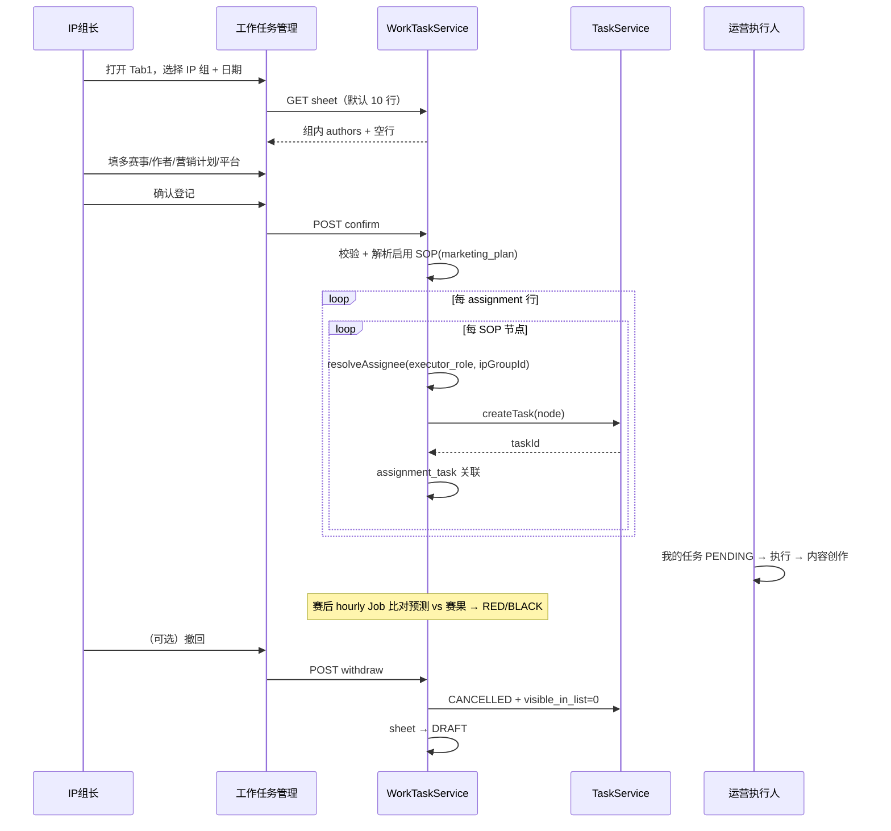
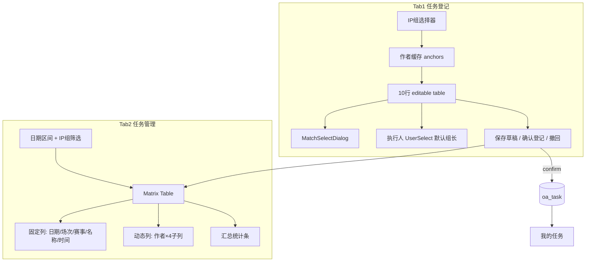

# PRD-M2-工作任务管理（草案）

> **业务域**：M2 内容生产  
> **功能模块**：工作任务管理（任务登记 + 任务管理矩阵）  
> **版本**：v0.8 | 2026-09-03  
> **状态**：**Spec 修订 — ADR-074 + [ADR-077](../adr/ADR-077-SOP内容生成节点文档类型与登记自动草稿AI.md) + [ADR-078](../adr/ADR-078-工作任务确认登记钉钉提醒执行人.md) + [ADR-079](../adr/ADR-079-任务完成工作说明与内容审核通过门禁.md) + [ADR-080](../adr/ADR-080-任务节点名称与执行页登记备注.md) Accepted**  
> **关联**：[`PRD-M2-内容生产.md`](./PRD-M2-内容生产.md) · [`UX-M2-内容生产.md`](./UX-M2-内容生产.md) · ADR-012/016/026/056/066/070/071/072/**074**/075/**077**/**078**/**079**/**080**  
> **需求来源**：产品 Owner（2026-08-18）

---

## 0. 元信息

| 字段 | 值 |
|------|---|
| 建议 FR 编号 | **FR-M2-010**（新增，不在现行 PRD v1.4 内） |
| 建议页面 ID | P-M2-016 |
| 建议路由 | `/ops/production/work-task` |
| 菜单父级 | 6102 内容生产 |
| 建议权限 | `oa:work-task:list` · `oa:work-task:register` · `oa:work-task:manage` |

---

## 1. 概述

### 1.1 一句话描述

IP 组长按日登记「**多赛事 × 作者 × 营销计划**」工作任务；确认后按 **营销计划 → 启用 SOP 模板** 为 **每个 SOP 节点** 生成 `oa_task`（出现在「我的任务」）；节点执行人由 **岗位匹配 IP 组成员**（无匹配则 IP 组长）；组长/管理者在矩阵视图中纵览各作者当日/区间任务分布与统计。

### 1.2 与现有「计划管理」边界

| 维度 | FR-M2-009 计划管理 | FR-M2-010 工作任务管理（本功能） |
|------|-------------------|--------------------------------|
| 驱动 | 完整 SOP 模板 + 多节点 DAG | **单日/短周期**、以「内容产出」为主 |
| 创建人 | 运营管理者/计划员 | **IP 组长**（`ip_group_leader` / `leader_user_id`） |
| 粒度 | IP 组 × SOP 节点 × 赛事 × 执行人 | **作者 × 营销计划 × 多赛事**（确认后 **SOP 全节点** task） |
| 视图 | 计划列表 + 详情任务表 | **登记表格** + **作者矩阵**（见截图） |
| 状态流 | 草稿 → 启动 → 终止审批 | **确认登记即发布**；已确认可 **撤回** 后改再确认（Q6） |

**结论**：复用 `oa_task` / 赛事 / IP 组 / 作者基础设施，**不**直接复用 `oa_content_plan` 创建向导；需 **新表 + 新 API + 新页面**。

---

## 2. 现有代码库分析

### 2.1 前端（football-front / web-ele）

| 资产 | 路径 | 可复用度 |
|------|------|---------|
| 我的任务 | `views/ops/production/task/index.vue` | 消费端；登记后任务在此展示 |
| 计划管理（含按日选赛） | `views/ops/production/plan/index.vue` | **模式参考**（按日赛事矩阵、`preview-tasks`） |
| 赛事选择器 | `components/ops/selectors/MatchSelectDialog.vue` | **直接复用** |
| IP 组树选 | `components/ops/selectors/IpGroupTreeSelect.vue` | Tab1 多组时复用；组长默认 `getLedIpGroups()` |
| 执行人选择 | `components/ops/selectors/UserSelect.vue` | 按 `ipGroupId` 过滤成员/组长（1501） |
| 内容编辑（作者/IP 组） | `views/ops/production/content/ContentEditPanel.vue` | **模式参考**：`getMyIpGroups()` + `getIpGroupAnchors()` |
| API 封装 | `api/ops/ip-group.ts` · `plan.ts` · `task.ts` · `match.ts` · `content.ts` | 部分复用 |

**菜单索引**（`docs/delivery/OPS-MENU-ROUTE-INDEX.md`）：内容生产下现有 6121 计划、6124 我的任务；**无「工作任务管理」**，需新增 menu + route。

### 2.2 后端（football-module-ops-server）

| 能力 | 现状 | 与本功能关系 |
|------|------|-------------|
| `oa_task` | 含 `plan_id` / `competition_id` / `ip_group_id` / `author_id` / `assignee_id` / `visible_in_list` | **任务落库目标** |
| `ContentPlanService` | 计划创建批量生成 task | **参考**任务生成逻辑，非直接调用 |
| `GET /ops/match/list` | 赛事代理（ADR-016 BLK-M2-004 已决） | **直接复用** |
| `GET /ops/ip-group/led` | 当前用户担任组长的 IP 组 | Tab1 默认组 |
| `GET /ops/ip-group/{id}/anchors` | IP 组关联作者（`author_user.id`） | Tab1 作者列 / Tab2 动态列 |
| `GET /ops/user/ip-groups` | 用户所属 IP 组 + 默认作者 | 执行人侧内容创作上下文 |
| `POST /ops/task/create` | 单条任务创建 API 存在 | 可批量封装，需扩展来源字段 |
| AI 内容 / 提示词 | `AiContentServiceImpl` · `oa_ai_prompt_config` | 内容生成；**红黑判定**赛后 Job 用 `scene=WORK_TASK_WIN_PREDICTION` **AI 抽取**预测（ADR-072） |

### 2.3 数据表（wd-schema）

**已有、可关联**：

- `oa_ip_group`（`leader_user_id`）
- `oa_ip_group_member` · `oa_ip_group_anchor_rel`
- `oa_task` · `oa_sop_template` · `oa_sop_node`
- 外部赛事 ID 存于 `oa_task.competition_id`（varchar）

**不存在、需新建**（见 §5）：

- 工作任务登记批次表、登记行表、（可选）任务来源关联

### 2.4 文档 / Slice / Gate

| 文档 | 结论 |
|------|------|
| `PRD-M2-内容生产.md` v1.4 | FR-M2-001~009、005；**无工作任务管理** |
| `SLICES-M2-内容生产.md` | S-01~S-15 已满；需 **S-16+ 新 Slice** |
| `CHECKLIST-M2-内容生产.md` | 需新增 FR-M2-010 检查项 |
| `UX-M2-内容生产.md` | 需新增 P-M2-016 |
| Phase Gate | S7 已 ✅；本功能属 **Post-S7 M2 增强**，非 Phase 2 M10 范围 |
| `.cursor/rules/phase-gate-protocol.mdc` | M10/外部 SSO **Out of Scope** — 本功能 **In Scope（M2）** 但需新 PRD Slice |

### 2.5 ADR / 全局规范

| 规则 | 应用 |
|------|------|
| **ADR-056** | `assignee_id` / 登记人 `registrar_user_id` 存 `system_users.id`；写入前 `FootballSystemUserValidator.resolveStorableUserId` |
| **ADR-066** | 组长视为 IP 组成员；执行人校验含组长 |
| **ADR-070** | 多 IP 组 Tab/并集语义可参考 Tab2 矩阵列 |
| **1501/1502/1504** | 赛事/IP 组/作者/执行人须后端存在性 + 租户校验 |
| **1503** | 营销计划、销售平台、红黑、**文档类型**、**AI 生成状态**枚举 `@InDict` |
| **tenant_id** | 全表隔离 |

---

## 3. Gap 分析与 Spec 对齐

### 3.1 已有 vs 新建

| 能力 | 状态 |
|------|------|
| 我的任务列表 / 执行 / 内容生成节点 | ✅ 已有 |
| 赛事选择 MatchSelectDialog | ✅ 已有 |
| IP 组 + 作者关联 | ✅ 已有 |
| 按日批量登记 UI | ❌ 新建 |
| 作者 × 赛事矩阵视图 | ❌ 新建 |
| 营销计划（直播公推/付费销售）字典 | ❌ 新建 |
| 销售平台（私域/快手/抖音/无）字典 | ❌ 新建 |
| 红黑 AI 自动判定 | ❌ 新建（赛后 hourly Job + AI 提示词抽取预测 + 写回 assignment，ADR-072） |
| 登记 → 按营销计划解析 SOP 全节点生成 task | ✅ **已决**（ADR-074）；**废弃** ADR-071 单 CONTENT_GENERATION 路径 |
| SOP 模板营销计划 1:1 | ❌ 新建（FR-M2-001 扩展，ADR-074 D2） |
| 登记行多赛事 | ❌ 新建（`competition_ids_json`，ADR-074 D4） |
| 矩阵统计汇总 | ❌ 新建 |

### 3.2 阻塞项 / 产品决议（**全部已关闭** · Owner 2026-08-19）

#### 3.2.1 Q1 — assignee_id 含义与登记策略（**⚠️ 已由 ADR-074 修订**）

> **2026-08-31 修订**：登记行 **`assignee_id` 不再驱动** confirm 生成的 task 执行人；执行人由 **SOP 节点 `executor_role`** + `PlanTaskGeneratorService.resolveAssignee` 解析（同 FR-M2-009）。行上 `assignee_id` **保留** 用于审计/可选 UI 展示，**非必填**。

##### 字段对照（SSOT · v0.4）

| 字段 | 存储 | 含义 | 在本功能中的角色 |
|------|------|------|-----------------|
| **`assignee_id`（登记行）** | `oa_work_task_assignment.assignee_id` | 可选审计字段 | Tab1 **可选**；**不写入** confirm 生成的 `oa_task.assignee_id` |
| **`oa_task.assignee_id`** | 生成时写入 | **节点执行人** | 按节点 `executor_role` 匹配 IP 组 `position`；无匹配 → `leader_user_id`（ADR-066） |
| **`author_id`** | `oa_task.author_id` → **`author_user.id`** | **内容作者** | 登记行必填 |
| **`leader_user_id`** | `oa_ip_group.leader_user_id` | **IP 组长** | 矩阵列头；节点无岗位匹配时的 **task assignee 兜底** |

##### 已批准规则（ADR-074 D7）

| 项 | 规则 |
|----|------|
| Tab1 UI | 执行人列 **可选**（UserSelect）；**不**作为 confirm 必填 |
| confirm | 对每个 SOP 节点生成 task：`assignee_id = resolveAssignee(node.executorRole, ipGroupId)` |
| 校验 | assignee 须为 IP 组成员或组长（1501）；写入 `FootballSystemUserValidator.resolveStorableUserId` |

~~原 Q1 选项 A（行选 assignee 写入 task）~~ → **Superseded by ADR-074**。

---

#### 3.2.2 Q2–Q7 — 已关闭（Owner 2026-08-18 / 2026-08-19）

| ID | 问题 | **决议** | 状态 |
|----|------|----------|------|
| **BLK-M2-WT-01** | 确认后 task 的 **assignee_id** 是谁？ | **ADR-074**：按 **SOP 节点岗位** `resolveAssignee`；登记行 assignee **不参与** | ✅ 已修订 |
| **BLK-M2-WT-02** | 走完整 SOP DAG 还是单节点？ | **按营销计划解析启用 SOP**；**每节点 1 条** `oa_task`；不创建 `oa_content_plan`（ADR-074） | ✅ 已修订 |
| **BLK-M2-WT-03** | 「红黑」判定规则与触发 | **赛后**（赛事已结束）：AI 从任务内容 **抽取 ONE 预测**（`oa_ai_prompt_config` · `scene=WORK_TASK_WIN_PREDICTION`）vs 实际赛果；命中→**红**，未命中→**黑**；**hourly Job**（ADR-070 模板，ADR-072） | ✅ 已关闭 |
| **BLK-M2-WT-04** | Tab1 行粒度 | **一行 = 一个作者 + 一个营销计划 + 多赛事**（`competition_ids_json`） | ✅ 已修订 |
| **BLK-M2-WT-05** | 矩阵列头 | **`{authorName}【{ipGroupName}-{leaderDisplayName}】`** — 括号内 = IP 组名称 + `-` + IP 组长显示名；**不是 assignee**。示例：`浩南【华南一组-欧阳】`（Tab2 已筛 IP 组时可简写为 `浩南【欧阳】`） | ✅ 已关闭 |
| **BLK-M2-WT-06** | 已确认是否可编辑/撤回 | **Scheme 1**：`POST /sheet/withdraw` → sheet 回 `DRAFT` 可再编辑；关联 `oa_task` → **`status=CANCELLED`** + **`visible_in_list=0`** | ✅ 已关闭 |
| **BLK-M2-WT-07** | 「场次」序号来源 | **不用** MatchVO 竞彩号；sheet 内按 `row_no` 递增 **3 位**序号 `001`…`010`（按 `work_date` + sheet 独立编号） | ✅ 已关闭 |

### 3.2.3 v0.4 产品决议（Owner 2026-08-31 · ADR-074）

| # | 决议 |
|---|------|
| 1 | SOP 模板增加 **`marketing_plan`**；**启用态**同租户 **1:1**（仅 `status=启用` 占唯一坑） |
| 2 | 营销计划枚举：**快手付费课程** · **公司平台付费** · **免费公推**（测试环境不迁移历史） |
| 3 | 登记行 **多赛事**；不建独立合并组表 |
| 4 | confirm：**1 SOP 节点 → 1 task**；task 携带行内 **全部** `competition_ids` |
| 5 | **废弃** confirm 路径 `work_task.default_template_id` / `default_node_id` |
| 6 | withdraw：取消 assignment 关联的 **全部** task（`oa_work_task_assignment_task`） |

### 3.2.4 v0.5 产品决议（Owner 2026-09-02 · ADR-077）

| # | 决议 |
|---|------|
| 1 | SOP `CONTENT_GENERATION` 节点配置 `documentType`；confirm **拷贝**到 task |
| 2 | confirm 后为每个内容生成 task **自动建 1 条 DRAFT**（例外 ADR-016 懒创建）；标题 = `plan_name` |
| 3 | **afterCommit** 异步 jingcai（五类文档类型均调）；confirm **立即成功**；失败可重试、不回滚 confirm |
| 4 | 无新付费墙列：`OFFICIAL_PLAN` → `paid_body`，其余 → `free_body`（**仅自动首写**） |
| 5 | withdraw：取消未完成 Job + **删除**已生成 DRAFT |

### 3.3 须新增 Spec 工件

1. 本 PRD v0.4 + UX P-M2-016 + [API-M2-工作任务管理.md](../engineering/API-M2-工作任务管理.md)  
2. **ADR-074**（Accepted）：营销计划 1:1 SOP · 全节点 task · 多赛事/行  
3. **ADR-071**（部分 Superseded）· **ADR-072**（Accepted）  
4. `SLICES-M2` 增 **S-20**（v0.4 实现 Slice）  
5. `CHECKLIST-M2` / `TESTCASES-M2` 增补 P0 用例  
6. `system_menu` seed：工作任务管理菜单  

---

## 4. 功能设计

### FR-M2-010 工作任务管理

**用户故事**：作为 IP 组长，我希望按日登记赛事×作者工作任务并指定执行人，确认后运营在「我的任务」收到待办；赛后系统自动判定内容预测红黑；必要时撤回登记重新编辑。

#### FR-M2-010-1 任务登记（Tab1）

- 组长选择 IP 组 + 工作日期，编辑默认 10 行登记表
- 每行：赛事（**多选**）、作者、营销计划、直播/平台等；执行人 **可选**（审计）
- 保存草稿（DRAFT）不生成 task；确认登记按 **SOP 全节点** 批量生成 task

#### FR-M2-010-2 任务管理矩阵（Tab2）

- 按日期区间展示 CONFIRMED 登记；动态列头 `{authorName}【{ipGroupName}-{leaderDisplayName}】`
- 单元格展示营销计划、直播时间、销售平台、红黑

#### FR-M2-010-3 撤回登记

- CONFIRMED sheet 可 withdraw → DRAFT，**批量**取消关联的全部 task；**删除**自动生成的 DRAFT 内容并取消未完成 Job（ADR-077）

#### FR-M2-010-4 赛后红黑判定

- hourly Job：AI 抽取内容预测 vs 赛果 → 写回 RED/BLACK

#### FR-M2-010-5 确认后自动草稿 + jingcai（ADR-077）

- `CONTENT_GENERATION` 节点须已配置 `documentType`（否则 confirm 1503）
- confirm **同事务**为每条内容生成 task 创建 1 条 DRAFT（`task_id` 1:1）；**不**标任务完成
- confirm 返回成功后 **异步**调用 jingcai（玩法可空；`matchScheme` ≥1 场）
- 失败：sheet 仍 CONFIRMED；内容仍 DRAFT；任务/内容展示原因并可重试

#### FR-M2-010-6 确认后提醒执行人（ADR-078）

- confirm **成功且 task 已插入**后（afterCommit），对每条新 `PENDING` task 的 **`oa_task.assignee_id`** 发 `TASK_PENDING`（站内 + 钉钉，同计划启动）
- **不**新建事件类型；**不**调用 `notifyPlanStarted`（`plan_id=NULL`）
- 钉钉失败 **不**回滚 confirm；jingcai Job **不**另发钉钉；withdraw **不** un-notify

**验收标准（AC）**

**AC-M2-010-1**（节点 assignee 解析）  
confirm 后每条 `oa_task.assignee_id` 由 **对应 SOP 节点 `executor_role`** + IP 组岗位匹配决定；无匹配 → IP 组长；**不**取自登记行 `assignee_id`。

**AC-M2-010-2**（我的任务可见性）  
各节点 task 的 **assignee** 登录后在「我的任务」看到对应 PENDING task；非 assignee 不可操作。

**AC-M2-010-3**（SOP 全节点 task 生成）  
confirm 不创建 `oa_content_plan`；每登记行生成 **N 条** task（N = 启用 SOP 节点数），`plan_id=NULL`，`template_id`/`node_id` 来自 SOP（ADR-074）。未配置启用 SOP → 1502。

**AC-M2-010-4**（行粒度唯一）  
同一 `[work_date, author_id]` 下，**同一 `competition_id` 不可出现在两个登记行**（1502）。

**AC-M2-010-5**（场次序号）  
`session_no` 为 sheet 内 `001`…`010`，非 MatchVO 竞彩号。

**AC-M2-010-6**（矩阵列头）  
Tab2 列头格式 `{authorName}【{ipGroupName}-{leaderDisplayName}】`，与 API `headerLabel` 一致。

**AC-M2-010-7**（withdraw）  
CONFIRMED → `POST /sheet/withdraw` → sheet=DRAFT；关联 task `CANCELLED` + `visible_in_list=0`；可再编辑并 confirm。

**AC-M2-010-8**（登记期红黑）  
Tab1/confirm 不调用 AI；`win_prediction=UNKNOWN` 展示「—」。

**AC-M2-010-9**（赛后红黑 Job）  
赛事结束后 hourly Job：AI（`scene=WORK_TASK_WIN_PREDICTION`）抽取 ONE 预测 vs 赛果；命中 RED，未命中 BLACK（ADR-072）。

**AC-M2-010-10**（AI 提示词可配置）  
`WORK_TASK_WIN_PREDICTION` 提示词在「AI提示词配置」维护；无 ENABLED 配置时 Job 跳过并保持 UNKNOWN。

**AC-M2-010-11**（权限）  
非组长无 register 权限（403）；跨租户 1504。

**AC-M2-010-12**（自动 DRAFT · ADR-077）  
confirm 成功后，每个 `CONTENT_GENERATION` task 存在且仅存在 1 条 `task_id` 关联内容，`status=DRAFT`，`document_type` 与 SOP 节点一致，`title=plan_name`。

**AC-M2-010-13**（异步 jingcai · ADR-077）  
confirm HTTP **立即**成功；jingcai 在 afterCommit 执行。AI 失败不改变 sheet=`CONFIRMED`；内容 `ai_generate_status=FAILED` 且可重试。

**AC-M2-010-14**（撤回删草稿 · ADR-077）  
withdraw 取消未完成自动生成 Job，并 **删除**关联 DRAFT 内容；task 仍 `CANCELLED` + `visible_in_list=0`。

**AC-M2-010-15**（确认提醒执行人 · ADR-078）  
confirm 成功后，每条新 PENDING task 的 **节点 assignee** 收到一条 `TASK_PENDING`（站内 + 钉钉，`biz_key=task:{id}:PENDING`）。钉钉未配置或失败时 confirm **仍成功**。jingcai 完成 **不再**发第二条。撤回 **不**撤回已发消息。

**AC-M2-010-16**（任务完成规则 · ADR-079）  
「我的任务」/全部任务列表与执行页同一规则：非 `CONTENT_GENERATION` 完成须 `deliverables`（工作说明）非空；`CONTENT_GENERATION` 仅当关联内容审核通过（`PENDING_PUBLISH` 及之后）可完成；内容 `DRAFT`/`REJECTED` 时展示内容「提交审核」。

**AC-M2-010-17**（节点名称 · ADR-080）  
confirm 生成的 task 在「我的任务 / 全部任务 / 执行页」**节点名称** = 对应 `oa_sop_node.node_name`（按 `node_id`）；**不得**展示营销计划标签。`plan_name` 仍含该节点名（ADR-077 D5）。

**AC-M2-010-18**（执行页登记备注 · ADR-080）  
工作任务来源的执行页隐藏 SLA；只读一行备注 `赛事-营销计划-是否直播（直播时间）-销售平台；`（合并组多场多段；标签非编码；read-through 登记行，不拷贝到 `oa_task`）。

---

### 4.1 角色与权限

| 角色 | Tab1 任务登记 | Tab2 任务管理 | 数据范围 |
|------|--------------|--------------|---------|
| 系统管理员 / 运营管理者 | ✅ | ✅ | 租户内全部 |
| **IP 组长**（`ip_group_leader` + `leader_user_id`） | ✅ | ✅ | **仅任组长的 IP 组** |
| 运营人员（执行人） | ❌ | 👁 只读（可选） | 所属 IP 组 |
| 其他 | ❌ | ❌ | — |

**鉴权**：

- Tab1 写：`oa:work-task:register` + 目标 `ip_group_id ∈ getLedIpGroupIds()`（非 admin）  
- Tab2 读：`oa:work-task:manage` + IP 组数据范围（同计划列表 ADR-064）

### 4.2 数据模型（草案）

#### 4.2.1 `oa_work_task_sheet`（登记批次 / 日表头）

| 字段 | 类型 | 说明 |
|------|------|------|
| id | BIGINT PK | |
| tenant_id | BIGINT | 租户 |
| ip_group_id | BIGINT | 登记 IP 组 |
| work_date | DATE | 工作日期 |
| status | VARCHAR(32) | `dict_work_task_sheet_status`：`DRAFT` / `CONFIRMED`（撤回后回到 `DRAFT`） |
| registrar_user_id | BIGINT | 登记人（Football user id） |
| confirmed_at | TIMESTAMP | 确认时间 |
| remark | VARCHAR(500) | 可选 |
| creator / create_time / updater / update_time / deleted | | 标准字段 |

**唯一约束（建议）**：`(tenant_id, ip_group_id, work_date, deleted)` — 每组每日一张 sheet。

#### 4.2.2 `oa_work_task_assignment`（登记行）

| 字段 | 类型 | 说明 |
|------|------|------|
| id | BIGINT PK | |
| tenant_id | BIGINT | |
| sheet_id | BIGINT FK | → `oa_work_task_sheet` |
| row_no | INT | 行号 1~N（默认 10）；与 `session_no` 一一对应 |
| competition_ids_json | JSON | **多赛事**快照数组：`[{competitionId, competitionName, leagueName, matchTime}, ...]` |
| competition_id | VARCHAR(64) | **冗余**：首场赛事 ID（列表/索引兼容；Slice 可选保留） |
| competition_name | VARCHAR(200) | 首场快照（或多场摘要） |
| session_no | VARCHAR(16) | 场次序号（如 `001`）；**sheet 内按 `row_no` 递增 3 位**，非 MatchVO 竞彩号（Q7） |
| league_name | VARCHAR(100) | 赛事 |
| match_time | TIMESTAMP | 比赛时间 |
| author_id | BIGINT | → `author_user.id`（内容品牌，≠ assignee） |
| assignee_id | BIGINT | **可选**审计；**不驱动** task 生成（ADR-074 D7） |
| work_date | DATE | 行级工作日期（与 sheet.work_date 可同可异；唯一性校验含此字段，Q4） |
| marketing_plan | VARCHAR(32) | `dict_marketing_plan_type` |
| is_live | TINYINT | 是否直播 |
| live_time | TIME | 直播时间（可选） |
| sales_platform | VARCHAR(32) | `dict_sales_platform` |
| win_prediction | VARCHAR(32) | `dict_win_prediction`（`UNKNOWN` / `RED` / `BLACK`；赛后 Job 写回，Q3） |
| win_prediction_source | VARCHAR(16) | `JOB` / `MANUAL`（登记期 `UNKNOWN`，不阻塞 confirm） |
| win_prediction_at | TIMESTAMP | 红黑判定时间（Job 或人工改判） |
| ai_prompt_scene | VARCHAR(64) | 可选快照；Job 使用 `WORK_TASK_WIN_PREDICTION`（ADR-072） |
| generated_task_id | BIGINT | **废弃**；改用 `oa_work_task_assignment_task` 关联多 task |

#### 4.2.3 `oa_work_task_assignment_task`（登记行 ↔ 多 task）

| 字段 | 类型 | 说明 |
|------|------|------|
| id | BIGINT PK | |
| tenant_id | BIGINT | |
| assignment_id | BIGINT FK | → `oa_work_task_assignment` |
| task_id | BIGINT FK | → `oa_task` |
| creator / ... / deleted | | |

#### 4.2.4 `oa_sop_template` 扩展（见 FR-M2-001 · ADR-074 D2）

| 字段 | 类型 | 说明 |
|------|------|------|
| marketing_plan | VARCHAR(32) | `dict_marketing_plan_type`；**启用时必填**；同租户启用态 **1:1** |

#### 4.2.5 `oa_task` 扩展

- `work_task_assignment_id` BIGINT — 反向追溯日任务来源  
- `competition_ids_json` JSON — 复制登记行全部赛事（ADR-074 D5）
- `document_type` VARCHAR(32) — confirm 自 SOP 节点拷贝（ADR-077；`@InDict dict_document_type`）

#### 4.2.6 字典（`@InDict`）

| dict_type | 值（v0.4 · ADR-074 D3） |
|-----------|-------------------------|
| `dict_marketing_plan_type` | `KUAISHOU_PAID_COURSE` 快手付费课程 · `COMPANY_PAID` 公司平台付费 · `FREE_PUBLIC` 免费公推 |
| `dict_sales_platform` | `PRIVATE` 私域 · `KUAISHOU` 快手 · `DOUYIN` 抖音 · `NONE` 无 |
| `dict_win_prediction` | `UNKNOWN` 未知 · `RED` 红 · `BLACK` 黑（**不含走水** v1；走水若需则 ADR-072 扩展） |
| `dict_work_task_sheet_status` | `DRAFT` · `CONFIRMED` |

### 4.3 API 设计（REST 草案）

基路径：`/admin-api/oa/work-task`

| 方法 | 路径 | 说明 |
|------|------|------|
| GET | `/led-ip-groups` | 当前用户任组长的 IP 组（封装 `getLedIpGroups`） |
| GET | `/sheet/get-or-create?ipGroupId=&workDate=` | 获取当日 sheet + 默认 10 空行 |
| PUT | `/sheet/save` | 保存 DRAFT（全量 rows） |
| POST | `/sheet/confirm` | 确认：校验 → 按 **marketing_plan → SOP** 为 **每节点** 生成 `oa_task`（拷贝 `documentType`）→ 内容生成节点 **同 TX 建 DRAFT** → sheet=CONFIRMED；**afterCommit** 异步 jingcai（ADR-077）+ 对每条新 task 的 assignee 发 `TASK_PENDING`（ADR-078）；响应含 `generatedTaskCount`（**不**新增字段） |
| POST | `/sheet/withdraw` | 撤回：取消未完成 Job + **删除 DRAFT 内容** + 关联 **全部** `oa_task` → `CANCELLED` + `visible_in_list=0`；删 assignment_task 关联 |
| GET | `/matrix` | Tab2 矩阵数据（见下） |
| GET | `/matrix/summary` | 统计：各作者任务数、直播公推/付费销售占比等 |
| POST | `/assignment/{id}/refresh-win-prediction` | **可选**人工改判红黑（`win_prediction_source=MANUAL`） |

**GET `/matrix` 参数**：

```
ipGroupId   （可选，多组时可传数组 ipGroupIds）
dateFrom    dateTo
authorIds   （可选过滤）
```

**响应 `WorkTaskMatrixVO`**：

```json
{
  "workDate": "2026-08-13",
  "fixedColumns": ["date", "sessionNo", "leagueName", "matchName", "matchTime"],
  "authorColumns": [
    { "authorId": "68001", "authorName": "浩南", "ipGroupName": "华南一组", "ipGroupLeaderName": "欧阳", "headerLabel": "浩南【华南一组-欧阳】" }
  ],
  "rows": [
    {
      "sessionNo": "001",
      "competitionId": "...",
      "matchName": "克拉约瓦大学VS库奥皮奥",
      "matchTime": "2026-08-14 01:00:00",
      "cells": {
        "68001": {
          "marketingPlan": "LIVE_PUBLIC",
          "liveTime": "19:30",
          "salesPlatform": "PRIVATE",
          "winPrediction": "RED"
        }
      }
    }
  ]
}
```

### 4.4 业务流程



**任务生成规则（ADR-074）**：

- **不创建** `oa_content_plan`；`plan_id = NULL`  
- `template_id` / `node_id`：由 **登记行 `marketing_plan` → 启用 SOP** 解析（**废弃** `work_task.default_template_id`）  
- 每 **SOP 节点** → **1 条** task；`competition_ids_json` = 行内全部赛事  
- `assignee_id`：`PlanTaskGeneratorService.resolveAssignee(node.executorRole, ipGroupId)`  
- `status`：`PENDING`；`visible_in_list`：`1`  

**撤回规则**：批量 CANCEL assignment 关联的全部 task；删 `oa_work_task_assignment_task` 记录

### 4.5 红黑赛后判定（Q3 已决 · ADR-072 须批准）

| 项 | 设计 |
|----|------|
| **触发** | 赛事 **已结束** 后；定时 Job **每小时**扫描（`@XxlJob` + `@TenantJob`，ADR-070 模板；handler `workTaskWinPredictionJobHandler`） |
| **扫描范围** | `CONFIRMED` sheet 下 assignment，关联赛事已结束、关联 task 已有内容、`win_prediction=UNKNOWN` |
| **预测输入** | **无专用 content 预测字段**；Job 读取任务关联 `oa_content` 正文，经 **AI 提示词**（`oa_ai_prompt_config` · **`scene=WORK_TASK_WIN_PREDICTION`**）**抽取 ONE 条 outcome** |
| **提示词维护** | 现有「配置管理 → AI提示词」页面；Flyway 种子 + 运营可编辑（ADR-072 D2） |
| **实际赛果** | match 代理 API（`competition_id` → 全场结果；SSOT ADR-072 D4） |
| **判定** | 抽取预测 **等于** 实际结果 → `RED`；**不等于** → `BLACK` |
| **输出** | 更新 `assignment.win_prediction` + `win_prediction_source=JOB` + `win_prediction_at` |
| **登记期** | Tab1「红黑」列展示 `UNKNOWN`（「—」）；**不**在 confirm 时调用 AI |
| **失败** | 赛果未就绪 / 无内容 / 无 ENABLED 提示词 / AI 失败 → 保持 `UNKNOWN`；下轮 Job 重试 |
| **人工** | Tab2 可 `POST /assignment/{id}/refresh-win-prediction` 改判（`MANUAL`） |

---

## 5. UI 设计

### 5.1 页面结构 P-M2-016

```
+------------------------------------------------------------------+
| 内容生产 > 工作任务管理                    [IP组▼] [日期▼] [查询] |
+------------------------------------------------------------------+
| [ 任务登记 ]  [ 任务管理 ]                                        |
+------------------------------------------------------------------+
```

### 5.2 Tab1 — 任务登记

**布局**：顶部上下文条 + 可编辑表格（默认 **10 行**）+ 底部操作栏。

| 列 | 控件 | 必填 | 说明 |
|----|------|------|------|
| # | 序号 | — | 1~10，可「+ 增行」 |
| 日期 | DatePicker | ✅ | 默认 `workDate` |
| 场次 | 文本只读 | — | **sheet 内按行序生成** 3 位序号（`001`…）；非 MatchVO 字段（Q7） |
| 赛事 | 链接 + MatchSelectDialog（**多选**） | ✅ | 复用弹窗；存 `competition_ids_json` |
| 作者 | Select | ✅ | 来自 `getIpGroupAnchors`；显示 authorName |
| 执行人 | UserSelect `:ip-group-id` | — | **可选**审计；**不驱动** task assignee（ADR-074） |
| 营销计划 | DictSelect / Badge | ✅ | 快手付费课程 **蓝** · 公司平台付费 **橙** · 免费公推 **绿** |
| 是否直播 | Switch | ✅ | |
| 直播时间 | TimePicker | △ | `is_live=1` 时必填 |
| 销售平台 | DictSelect | ✅ | 私域/快手/抖音/无 |
| 红黑 | Badge / Tag | — | 登记期 `UNKNOWN`；赛后 Job 填红/黑（Q3） |

**交互**：

- 进入页：若用户仅 1 个组长 IP 组 → 自动选中；多个 → `IpGroupTreeSelect` 或下拉  
- 切换 IP 组 → 刷新作者下拉选项  
- **保存草稿**：sheet=DRAFT，不生成 task  
- **确认登记**：二次确认 → confirm API → Toast「已生成 N 条任务」（N = 行数 × SOP 节点数）；内容生成节点随后 **异步出草稿**（ADR-077）  
- 校验：同一 `[work_date, author_id]` 下 **赛事 ID 不可跨行重复**（1502）

**空状态**：无组长 IP 组 → 「您不是 IP 组长，无法登记任务」+ 引导联系管理员。

### 5.3 Tab2 — 任务管理（矩阵）

对齐产品截图：

**左侧固定列**（冻结）：日期 | 场次 | 赛事 | 比赛名称 | 比赛时间  

**右侧动态列**：每个作者一列组（colspan=4），列头 **`{authorName}【{ipGroupName}-{leaderDisplayName}】`**（Q5：括号内 = IP 组名 + 组长名，**不是 assignee**）  

**作者子列**：营销计划 | 直播时间 | 销售平台 | 红黑  

**样式**：

- 表头背景：`#1e4fa1`（截图蓝底白字）  
- 场次列：红色数字（`#F56C6C`）  
- 比赛名称：蓝色可点（点击打开赛事详情或内容任务，**待 Q**）  
- 营销计划 Badge：圆角 pill；快手付费课程 / 公司平台付费 / 免费公推（色值 UX 定稿）  
- 多赛事行：矩阵左侧可展示首场或「N 场」摘要

**筛选**：日期区间、IP 组（多选）、作者（多选）  

**统计区**（表格上方或右侧抽屉）：

- 总场次 / 已分配单元格数  
- 各作者：直播公推数、付费销售数、无任务场次  
- 红黑分布（若已判定）  

**空状态**：区间内无 CONFIRMED sheet → 「暂无已登记任务」  

### 5.4 色值 / Badge 规范

| 语义 | 背景色 | 文案 |
|------|--------|------|
| 快手付费课程 | `#409EFF` | 快手付费课程 |
| 公司平台付费 | `#E6A23C` | 公司平台付费 |
| 免费公推 | `#67C23A` | 免费公推 |
| 红 | `#F56C6C` | 红 |
| 黑 | `#303133` | 黑 |
| 未知 | `#909399` | — |

### 5.5 线框（Mermaid）



---

## 6. 开发计划（Slice 建议）

> 遵循「一片一会话」：每 Slice 独立 PR + Gate 自检。

### 6.1 Slice 拆分

| Slice | 名称 | 范围 | 依赖 | 估时 |
|-------|------|------|------|------|
| **S-16** | 工作任务 Spec + Schema + 字典 | Flyway 新表 + dict seed + **ADR-071/072 批准** + 菜单 + `WORK_TASK_WIN_PREDICTION` prompt 种子 | — | 1.5d |
| **S-17** | 登记后端 + Tab1 前端 | sheet CRUD + confirm/withdraw 生成 task + Tab1 执行人列 | S-16, match API, ip-group anchors | 3.5d |
| **S-18** | 矩阵视图 + 统计 | matrix API + Tab2 列头 `{author}【{ipGroup}-{leader}】` | S-17 | 2d |
| **S-19** | 红黑赛后 Job | `@XxlJob` + AI 抽取（`WORK_TASK_WIN_PREDICTION`）+ 写回 assignment + Tab2 人工改判 | S-17, match 赛果 API, ADR-072 | 2d |
| **S-20** | 工作任务 v0.4（ADR-074） | SOP `marketing_plan` 1:1 · 多赛事登记 · confirm 全节点 · withdraw 批量 · 字典替换 | S-17, ADR-074 | 4d |
| **S-21 A–E** | 自动草稿 + jingcai（ADR-077） | A Schema/SOP 文档类型 → B confirm DRAFT → C afterCommit jingcai → D 失败重试 UX → E withdraw 删草稿 | S-20, ADR-077 | 见 ADR-077 §7 |
| **S-22** | confirm 钉钉提醒执行人（ADR-078） | confirm afterCommit `TASK_PENDING`；`plan_id=NULL` 可通知；失败不回滚 | S-17, ADR-026/078 | 0.5d |
| **S-23** | 任务完成门禁（ADR-079） | 非 CG 须工作说明；CG 须内容审核通过 + 可提交时「提交审核」；列表=执行页 | S-12, ADR-016/079 | 0.5d |

**推荐顺序**：S-16 → S-17 → S-18 / S-19 并行 → **S-20** → **S-21 A→E** → **S-22**（一片一会话）。

### 6.2 依赖清单

| 依赖 | 用途 |
|------|------|
| `MatchSelectDialog` + `/ops/match/list` | 赛事选择 |
| `getLedIpGroups` / `getIpGroupAnchors` | IP 组 + 作者 |
| `UserSelect` + `FootballSystemUserValidator` | 执行人（Q1 选项 A） |
| `PlanTaskGeneratorService.resolveAssignee` | 节点执行人（ADR-074） |
| 启用 SOP by `marketing_plan` | confirm 模板解析 |
| `oa_ai_prompt_config` · `scene=WORK_TASK_WIN_PREDICTION` | 红黑 AI 抽取（ADR-072） |
| `@XxlJob` + `@TenantJob`（ADR-070） | 红黑赛后 hourly Job |

### 6.3 P0 测试用例大纲

| 编号 | 场景 |
|------|------|
| TC-M2-010-01 | IP 组长登录 → 自动带出唯一 IP 组 + 作者列表 |
| TC-M2-010-02 | 多 IP 组组长 → 切换组 → 作者联动 |
| TC-M2-010-03 | 默认 10 行；保存 DRAFT 不生成 task |
| TC-M2-010-04 | 确认登记 → **各节点 assignee**（岗位匹配）「我的任务」可见对应 PENDING task |
| TC-M2-010-14 | confirm 未配置启用 SOP → 1502；有 SOP 时 task 数 = 行数 × 节点数 |
| TC-M2-010-16 | 多赛事行：task `competition_ids_json` 含全部赛事 |
| TC-M2-010-05 | 任务执行页带正确 `competitionIds` / `authorId` / `ipGroupId` / 节点 assignee |
| TC-M2-010-06 | Tab2 矩阵列头 `{author}【{ipGroup}-{leader}】` 与 Tab1 一致（Q5） |
| TC-M2-010-07 | 非组长无 register 权限（403） |
| TC-M2-010-08 | 跨租户 IP 组 / 作者 → 1504 |
| TC-M2-010-09 | 营销计划/销售平台非法枚举 → 1503 |
| TC-M2-010-10 | confirm 不依赖红黑 Job；登记期红黑为 UNKNOWN |
| TC-M2-010-11 | CONFIRMED → withdraw → task CANCELLED 且不可见于我的任务；sheet 可再编辑确认 |
| TC-M2-010-12 | 赛后 Job：AI 抽取预测命中→RED，未命中→BLACK |
| TC-M2-010-13 | session_no 为 sheet 内序号 `001`/`002`，非 MatchVO |
| TC-M2-010-15 | 无 `WORK_TASK_WIN_PREDICTION` 提示词时 Job 跳过，红黑保持 UNKNOWN |
| TC-M2-010-17 | confirm 后对每条新 task 的节点 assignee 发 `TASK_PENDING`；钉钉失败 confirm 仍成功 |

### 6.4 Checklist / Gate 更新项

- [ ] `PRD-M2-内容生产.md` 增 FR-M2-010 引用  
- [ ] `UX-M2` 增 P-M2-016  
- [ ] 新建 `API-M2-工作任务管理.md`  
- [ ] `SLICES-M2` 增 S-16~**S-19**  
- [ ] `CHECKLIST-M2` §1 范围 + §2 功能 + §3 字典  
- [ ] `TESTCASES-M2` 增 TC-M2-010-*  
- [ ] `OPS-MENU-ROUTE-INDEX.md` + seed SQL  
- [ ] `M2WorkTaskS17IT` / `M2WorkTaskS18IT`  

---

## 7. 复用 vs 新建 — 总结

| 组件 | 策略 |
|------|------|
| MatchSelectDialog | **复用** |
| IpGroupTreeSelect / getLedIpGroups | **复用** |
| getIpGroupAnchors / UserSelect | **复用** |
| oa_task + 我的任务 + 执行页 | **复用（消费链）** |
| oa_content_plan 创建流 | **不复用** |
| plan/preview-tasks | **参考**，不直接调用 |
| 工作任务 sheet/assignment 表 | **新建** |
| 矩阵 UI 组件 | **新建** `WorkTaskMatrixTable.vue` |
| 红黑赛后 Job | **新建** `@XxlJob` handler + ADR-072 |
| 完整 PRD/ADR/Slice | **新建** |

---

## 8. 变更记录

| 日期 | 说明 |
|------|------|
| 2026-08-18 | v0.1 草案：代码库分析 + Gap + 功能/UI/开发计划 |
| 2026-08-18 | v0.2 部分闭合：Owner 关闭 Q2–Q7；补充 Q1 assignee 选项分析 |
| 2026-08-19 | **v0.3 Spec 闭合**：Owner 关闭 Q1（选项 A）；Q3 补充 AI prompt scene；withdraw API；FR/AC-M2-010；ADR-071/072 Draft 归档 |
| 2026-08-31 | **v0.4**：ADR-074 — 营销计划 1:1 SOP · 多赛事/行 · 全节点 task · 节点 assignee 解析；修订 AC/Schema/API |
| 2026-09-02 | **v0.5**：ADR-077 — SOP 文档类型 · confirm 自动 DRAFT · afterCommit jingcai · withdraw 删草稿；FR-M2-010-5 / AC-010-12~14 |
| 2026-09-03 | **v0.6**：ADR-078 — confirm 后 `TASK_PENDING` 提醒节点 assignee（站内+钉钉）；失败不回滚；FR-M2-010-6 / AC-010-15 |
| 2026-09-03 | **v0.7**：ADR-079 — 任务完成工作说明 / 内容审核通过门禁；AC-010-16 |
| 2026-09-03 | **v0.8**：ADR-080 — 节点名称=SOP 节点名；执行页隐藏 SLA + 登记备注（营销计划/直播/销售平台） |

---

## 9. ADR 引用

| ADR | 标题 | 状态 |
|-----|------|------|
| [ADR-074](../adr/ADR-074-工作任务登记SOP全节点生成与营销计划绑定.md) | 营销计划绑定 SOP · 全节点 task · 多赛事/行 | **Accepted** |
| [ADR-071](../adr/ADR-071-工作任务登记轻量Task生成.md) | 轻量 task（**部分 Superseded → ADR-074**） | Accepted |
| [ADR-072](../adr/ADR-072-工作任务红黑判定与AI提示词.md) | 赛后 hourly Job · AI 抽取预测 | **Accepted** |
| [ADR-077](../adr/ADR-077-SOP内容生成节点文档类型与登记自动草稿AI.md) | SOP 文档类型 · confirm 自动 DRAFT · jingcai | **Accepted** |
| [ADR-078](../adr/ADR-078-工作任务确认登记钉钉提醒执行人.md) | confirm 后 `TASK_PENDING` 提醒执行人 | **Accepted** |
| [ADR-079](../adr/ADR-079-任务完成工作说明与内容审核通过门禁.md) | 完成须工作说明 / 内容审核通过 | **Accepted** |
| [ADR-080](../adr/ADR-080-任务节点名称与执行页登记备注.md) | 节点名称=SOP 节点名；执行页 SLA 隐藏 + 登记备注 | **Accepted** |

### 9.1 ADR-074 要点摘要

| # | 决策要点 |
|---|----------|
| D2 | SOP **`marketing_plan`** 启用态 1:1 |
| D4–D5 | 登记行 **多赛事**；每 **SOP 节点** 1 task |
| D6–D7 | confirm 解析 SOP；**assignee 按节点岗位** |
| D9–D10 | assignment_task 关联；赛事跨行唯一 |

### 9.2 ADR-071 保留要点（未被废止部分）

| # | 决策要点 |
|---|----------|
| D1 | **不创建** `oa_content_plan`；`oa_task.plan_id = NULL` |
| D7 | **withdraw** → 关联 task `CANCELLED` + `visible_in_list=0` |
| D8 | `session_no` = sheet 内 `001`… 递增 |

~~D2/D5/D6（单节点/行选 assignee）~~ → **ADR-074**

### 9.3 ADR-072 要点摘要

| # | 决策要点 |
|---|----------|
| D1–D2 | 无 content 预测字段；AI + `scene=WORK_TASK_WIN_PREDICTION` 抽取 |
| D5–D6 | 命中 RED / 未命中 BLACK；hourly `@XxlJob` |
| D9 | 提示词在「AI提示词配置」可编辑 |

### 9.4 ADR-077 要点摘要

| # | 决策要点 |
|---|----------|
| D1–D2 | SOP 内容生成节点 `documentType`；confirm 拷贝到 task |
| D3–D6 | confirm 自动 DRAFT（例外 ADR-016）；不标任务完成；不等 DAG |
| D7–D12 | afterCommit jingcai；失败 confirm 仍成功；可重试 |
| D11 / D13 | 自动首写列映射（例外 ADR-054 D8）；withdraw 删 DRAFT |

### 9.5 ADR-078 要点摘要

| # | 决策要点 |
|---|----------|
| D1–D4 | confirm afterCommit 发 `TASK_PENDING`；不调用 `notifyPlanStarted` |
| D5–D7 | 每 task 一条；Football `assignee_id`；钉钉失败 confirm 仍成功 |
| D9–D10 | 无 un-notify；jingcai 不另发钉钉 |
