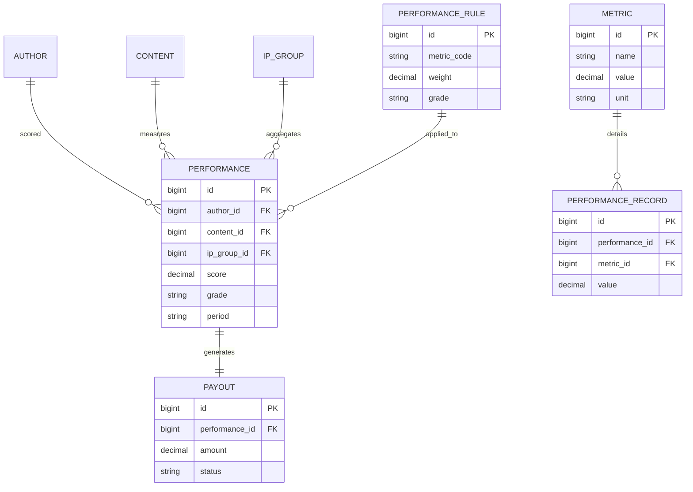

# PRD-M3-绩效核算

> **业务域**：M3 绩效核算
> **功能模块**：考核模板 + 考核执行 + 绩效结果 + 订单归因
> **详细设计章节**：5.12、5.13、5.14、5.15
> **版本**：v1.0 | 2026-06-07
> **状态**：Draft
> **全局规范**：[`docs/engineering/GLOBAL-CONVENTIONS.md`](./../engineering/GLOBAL-CONVENTIONS.md)

---

## 0. 元信息

| 字段 | 值 |
|------|---|
| 模块 | M3 绩效核算 |
| 业务域 | 绩效核算（PERF） |
| 详细设计 | `## 5.12~5.15` |
| 父 PRD | `@完整PRD-v9.1-开发版.md` |
| 关联 UX | `docs/product/UX-M3-绩效核算.md` |
| 关联 API | `docs/engineering/API-M3-绩效核算.md` |
| 关联 STATE | `docs/engineering/STATE-M3-绩效核算.md` |

---

## 1. 概述

### 1.1 一句话描述

为不同岗位创建考核模板 → 发起考核（自动算分 + 人工微调）→ 查看结果（趋势分析）→ 订单归因到账号/IP/人员（支持 ROI 计算）。

### 1.2 目标与指标

| 维度 | 目标 | 可量化指标 |
|------|------|------------|
| 自动化 | 80% 指标自动算分 | 自动算分覆盖率 ≥ 80% |
| 透明 | 考核结果可追溯 | 100% 考核有明细可查 |
| 激励 | 绩效 → 收入挂钩 | 95% 考核影响薪酬 |

### 1.3 术语表

| 术语 | 定义 |
|------|------|
| **考核模板** | 按岗位配置的指标 + 权重 + 评分标准（`oa_perf_template`） |
| **考核执行** | 实际考核记录，包含每项指标的得分（`oa_perf_record`） |
| **自动算分** | 按 `score_standard` 区间规则计算得分（`dict_perf_calc_method=AUTO`） |
| **人工算分** | 考核人手动输入得分（`dict_perf_calc_method=MANUAL`） |
| **混合算分** | 部分自动 + 部分人工（`dict_perf_calc_method=MIXED`） |
| **绩效等级** | S(≥90) / A(80-89) / B(70-79) / C(60-69) / D(<60) |
| **订单归因** | 订单归因到具体账号/IP/运营人员（`oa_order_attribution`） |
| **ROI** | 投资回报率，公式：`SUM(pay_amount) / SUM(in_cost)` |

---

## 2. 用户与权限

### 2.1 角色 × 能力

| 能力 \ 角色 | 系统管理员 | 运营管理者 | 运营组长 | 运营人员 | 数据分析师 | 财务 |
|------------|-----------|-----------|---------|---------|-----------|------|
| 管理考核模板 | ✅ | ✅ | ❌ | ❌ | ❌ | ❌ |
| 发起考核 | ✅ | ✅ | ✅（本组） | ❌ | ❌ | ❌ |
| 人工调整 | ✅ | ✅ | ✅ | ❌ | ❌ | ❌ |
| 查看个人绩效 | - | - | - | ✅（仅本人） | - | - |
| 查看本部门绩效 | - | ✅ | ✅ | ❌ | - | - |
| 查看全部 | ✅ | ✅ | ❌ | ❌ | ✅ | ✅ |
| 订单归因分析 | ✅ | ✅ | ❌ | ❌ | ✅ | ✅ |
| ROI 导出 | ✅ | ✅ | ❌ | ❌ | ✅ | ✅ |

### 2.2 权限规则

- 运营组长仅能考核**本组**成员
- 员工仅能查看**本人**绩效
- 财务仅查看与营收/成本相关的字段

---

## 3. 范围

### 3.1 In Scope（4 个 FR 模块）

| FR 编号 | 名称 | 优先级 | 详细设计 |
|---------|------|--------|---------|
| FR-M3-001 | 考核模板（岗位模板 + 指标关联） | P0 | 5.12 |
| FR-M3-002 | 考核执行（自动算分 + 人工调整） | P0 | 5.13 |
| FR-M3-003 | 绩效结果（查看 + 趋势 + 导出） | P0 | 5.14 |
| FR-M3-004 | 订单归因分析（ROI 计算） | P0 | 5.15 |

### 3.2 Out of Scope

1. ❌ **不实现** 薪酬发放（依赖 HR 系统）
2. ❌ **不实现** 绩效申诉流程
3. ❌ **不实现** 多租户/跨公司汇总（本期仅单租户）
4. ❌ **不实现** AI 评分推荐

---

## 4. 功能需求

### FR-M3-001 考核模板（5.12）

#### 4.1.1 描述

按岗位（运营组长/公众号运营/剪辑/直播运营/销售）创建考核模板，配置指标、权重、评分标准。

#### 4.1.2 主流程

1. 管理员进入"考核模板管理"
2. **新建模板**：列表页点击「新增模板」→ **弹窗**内完成岗位/名称/指标配置（不跳转独立路由）；编辑已有模板仍走 `/perf/template/:id`
3. 添加考核指标：
   - 关联指标库（`<MetricSelect />` → `oa_metric_definition`）
   - 设置权重（%）
   - 配置算分方式（`<DictSelect dict-type="dict_perf_calc_method" />`）
   - 配置 `score_standard`（区间规则）
4. 启用模板（每岗位仅一个生效模板）
5. 指标行 `metricId` 必须从 `<MetricSelect />` 选择真实指标 ID（`PerfTemplateEdit` 校验非空）

#### 4.1.3 业务规则

- **每岗位仅一个生效模板**：启用新模板自动停用旧模板
- **权重合计 = 100%**：保存前校验
- **score_standard**：JSON 数组，区间不能重叠，不能有 gap

#### 4.1.4 数据项

| 字段 | 控件 | 字典/实体 |
|------|------|----------|
| `position` | `<DictSelect dict-type="dict_position" />` | 字典 |
| `template_name` | `<Input />` | - |
| `is_active` | `<Switch />` | - |
| 指标 `metric_id` | `<MetricSelect />` | `oa_metric_definition` |
| 指标 `weight` | `<InputNumber :precision="2" />` | - |
| 指标 `calc_rule` | `<DictSelect dict-type="dict_perf_calc_method" />` | 字典 |
| 指标 `score_standard` | `<ScoreStandardEditor />` | - |

#### 4.1.5 验收标准

**AC-M3-001-1**（每岗位仅一个生效）
- Given 已有"运营组长"生效模板 A
- When 创建"运营组长"模板 B 并启用
- Then 模板 A 自动停用，模板 B 启用

**AC-M3-001-2**（权重合计 100%）
- Given 模板含指标 1（权重 60%）、指标 2（权重 30%）
- When 添加指标 3（权重 20%）
- Then 校验失败"权重合计必须 = 100%"

**AC-M3-001-3**（区间无重叠）
- Given 配置区间 [0,60]、[60,75]、[75,85]
- When 保存
- Then 校验通过

**AC-M3-001-4**（区间不能有 gap）
- Given 配置 [0,60]、[70,80]
- When 保存
- Then 校验失败"区间 [60,70] 有 gap"

**AC-M3-001-5**（岗位选择器）
- Given 编辑模板
- When 设置 `position`
- Then 弹出 `dict_position` 选择器

---

### FR-M3-002 考核执行（5.13）

#### 4.2.1 描述

运营组长发起对团队成员的绩效考核，系统自动拉取指标数据并算分，支持人工微调。

#### 4.2.2 主流程

1. 进入"考核执行"，点击"创建考核"
2. 选择被考核人（`<UserSelect :ipGroupId="..." />`）
3. 选择考核周期（`<DictSelect dict-type="dict_perf_period" />`）
4. 选择模板（按被考核人岗位自动带出）
5. 系统自动拉取数据并计算得分
6. 考核人查看结果 → 可人工调整（仅本人权限）
7. 确认考核结果

#### 4.2.3 业务规则

- **自动算分**：按 `score_standard` 区间计算
- **总分公式**：`SUM(item.final_score * item.weight / 100)`
- **人工调整**：`final_score = COALESCE(score, 0) + COALESCE(manual_adjustment, 0)`
- **调整上限**：`manual_adjustment` 不超过 item 基础分的 ±20%
- **周期锁定**：周期内已有考核 → 不可重复创建

#### 4.2.4 状态机

详见 `docs/engineering/STATE-M3-绩效核算.md` § 1（考核记录状态机）。

#### 4.2.5 数据项

| 字段 | 控件 | 字典/实体 |
|------|------|----------|
| `assessor_id` | 当前用户 | - |
| `target_user_id` | `<UserSelect />` | `sys_user` |
| `template_id` | 自动按 `target_user.position` 匹配 | `oa_perf_template` |
| `period_type` | `<DictSelect dict-type="dict_perf_period" />` | 字典 |
| `period_start` / `period_end` | `<DatePicker />` | - |
| `status` | `<DictSelect dict-type="dict_perf_status" />` | 字典 |

#### 4.2.6 验收标准

**AC-M3-002-1**（自动算分）
- Given 创建考核，模板含 3 个指标（权重 40/30/30）
- When 拉取数据
- Then 自动按 `score_standard` 算分

**AC-M3-002-2**（总分）
- Given 3 项指标得分 80/90/70
- Then 总分 = 80×40% + 90×30% + 70×30% = 80

**AC-M3-002-3**（人工调整）
- Given 自动得分 80
- When 人工调整 +5
- Then `final_score = 85`，记录 `manual_adjustment=5`

**AC-M3-002-4**（调整上限）
- Given 自动得分 80
- When 人工调整 +30
- Then 校验失败"调整幅度不能超过 ±20%"

**AC-M3-002-5**（被考核人选择器）
- Given 运营组长
- When 选择被考核人
- Then 仅显示本组成员

**AC-M3-002-6**（周期内不可重复）
- Given 张三本月已有考核
- When 再创建张三本月考核
- Then 校验失败"该周期已有考核"

---

### FR-M3-003 绩效结果（5.14）

#### 4.3.1 描述

查看历史绩效考核结果，按人员/时间段/绩效等级筛选，提供趋势分析。

#### 4.3.2 主流程

1. 进入"绩效结果"列表
2. 筛选（`<UserSelect />`、`<DictSelect dict-type="dict_perf_period" />`、`<DictSelect dict-type="dict_perf_grade" />`）
3. 查看详情（指标明细）
4. 个人趋势（折线图）

#### 4.3.3 业务规则

- **个人可见**：本人仅看本人
- **部门可见**：部门负责人看本部门
- **全部可见**：系统管理员、运营管理者、财务、数据分析师

#### 4.3.4 数据项

| 字段 | 字典/实体 |
|------|----------|
| `user_name` | `sys_user.real_name` |
| `position` | `dict_position` |
| `period` | `dict_perf_period` |
| `total_score` | 计算字段 |
| `grade` | 派生字段（按 score_standard） |
| `assessor_name` | `sys_user.real_name` |

#### 4.3.5 验收标准

**AC-M3-003-1**（权限隔离）
- Given 员工张三
- When 进入"绩效结果"
- Then 仅显示张三本人

**AC-M3-003-2**（趋势分析）
- Given 进入"个人绩效趋势"
- When 查看
- Then 折线图展示近 6 月得分

**AC-M3-003-3**（导出）
- Given 选中 10 条记录
- When 导出
- Then 生成 Excel（带权限过滤）

---

### FR-M3-004 订单归因分析（5.15）

#### 4.4.1 描述

订单归因到账号/IP 组/运营人员，支持 ROI 计算。

#### 4.4.2 主流程

1. 进入"订单归因"
2. 筛选（日期、IP 组、账号）
3. 查看归因列表
4. ROI 分析（按 IP 组/账号/时间聚合）

#### 4.4.3 业务规则

- **ROI 公式**：`SUM(pay_amount) / SUM(in_cost)`
- **数据来源**：`oa_order_attribution` + `oa_author_cost`

#### 4.4.4 数据项

| 字段 | 字典/实体 |
|------|----------|
| `ip_group_id` | `<IpGroupTreeSelect />` |
| `account_id` | `<AccountSelect />` |
| `start_date` / `end_date` | `<DatePicker />` |

#### 4.4.5 验收标准

**AC-M3-004-1**（归因列表）
- Given 筛选 IP 组=八卦一组
- When 查询
- Then 仅返回该 IP 组的订单

**AC-M3-004-2**（ROI 计算）
- Given 8 月
- When 计算 ROI
- Then `pay_amount / in_cost`

**AC-M3-004-3**（关联属性）
- Given 选择 `ipGroupId`
- Then 弹出 `<IpGroupTreeSelect />`（非手动输入）

---

## 5. 集成与数据

### 5.1 核心实体

| 实体 | 用途 | 关联 |
|------|------|------|
| `oa_perf_template` | 岗位考核模板 | `oa_perf_template_item`（一对多） |
| `oa_perf_template_item` | 考核指标关联 | `oa_perf_template`、`oa_metric_definition` |
| `oa_perf_record` | 考核记录 | `oa_perf_template`、`sys_user`（被考核人、考核人） |
| `oa_perf_item_record` | 考核明细 | `oa_perf_record`、`oa_metric_definition` |
| `oa_order_attribution` | 订单归因 | `oa_account`、`oa_ip_group`、`sys_user` |
| `oa_metric_definition` | 指标定义 | - |

### 5.2 关联属性（🔴 强约束）

| 字段 | 关联 | 选择器 |
|------|------|--------|
| `oa_perf_template.position` | `dict_position` | `<DictSelect dict-type="dict_position" />` |
| `oa_perf_template_item.metric_id` | `oa_metric_definition` | `<MetricSelect />` |
| `oa_perf_template_item.calc_rule` | `dict_perf_calc_method` | `<DictSelect dict-type="dict_perf_calc_method" />` |
| `oa_perf_record.target_user_id` | `sys_user` | `<UserSelect />` |
| `oa_perf_record.period_type` | `dict_perf_period` | `<DictSelect dict-type="dict_perf_period" />` |
| `oa_perf_record.status` | `dict_perf_status` | `<DictSelect dict-type="dict_perf_status" />` |

---

## 6. 非功能需求

| 维度 | 要求 |
|------|------|
| 性能 | 自动算分（100 指标）≤ 5s |
| 性能 | 趋势分析查询 ≤ 2s |
| 安全 | 个人绩效仅本人可见 |
| 审计 | 考核变更记录审计 |
| 性能 | 调整幅度校验在校验层（不能绕过） |

---

## 7. 决策记录

| 编号 | 问题 | 决策 | 原因 | 日期 |
|------|------|------|------|------|
| ADR-M3-001 | 调整幅度是否要限制？ | ±20% | 防止恶意调整，保留人工微调空间 | 2026-06-07 |
| ADR-M3-002 | 每岗位仅 1 个生效模板？ | 是 | 简化设计，避免冲突 | 2026-06-07 |

---

## 8. 开放问题

| 编号 | 问题 | 负责人 | 截止 | 状态 |
|------|------|--------|------|------|
| OQ-M3-001 | ROI 是否要按"现金回款"还是"订单金额"？ | 产品/财务 | 2026-06-15 | 待定 |
| OQ-M3-002 | 绩效申诉流程是否要做？ | 产品 | 2026-06-20 | 待定 |

---

*下一步：UX Spec / API Spec / STATE / SLICES / CHECKLIST / TESTCASES。*

---

## 核心 ER 图

详见 [`GLOBAL-CONVENTIONS.md § 1`](../engineering/GLOBAL-CONVENTIONS.md) (铁律)
