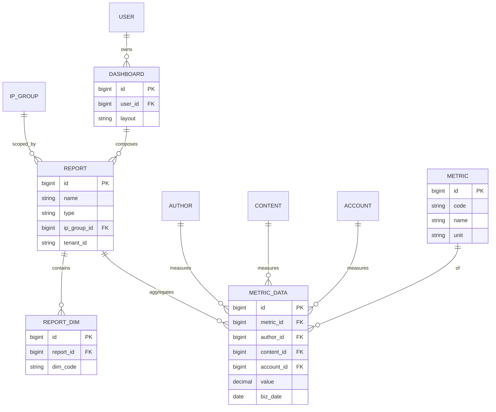

# PRD-M6-数据分析

> **业务域**：M6 数据分析
> **功能模块**：指标管理 + 8 张报表 + 漏斗 + 自定义查询 + 大屏
> **详细设计章节**：5.25、5.26、5.27、5.28、5.29、5.30、5.31
> **版本**：v1.3 | 2026-06-12
> **状态**：Draft（报表/漏斗/自定义查询实现已对齐）
> **全局规范**：[`docs/engineering/GLOBAL-CONVENTIONS.md`](./../engineering/GLOBAL-CONVENTIONS.md)

---

## 0. 元信息

| 字段 | 值 |
|------|---|
| 模块 | M6 数据分析 |
| 业务域 | 数据分析（ANALYSIS） |
| 详细设计 | `## 5.25~5.31` |

---

## 1. 概述

### 1.1 一句话描述

平台**数据中心**：统一管理指标定义、提供 8+ 张预置报表、漏斗分析、自定义查询、可视化大屏，覆盖运营/财务/管理决策需求。

### 1.2 目标

| 维度 | 目标 |
|------|------|
| 替代 Excel | 8 张报表替代 8 个 Excel |
| 灵活分析 | 漏斗 + 自定义查询 |
| 可视化 | 大屏实时呈现 |

### 1.3 术语表

| 术语 | 定义 |
|------|------|
| **基础指标** | 直接映射数据库字段（BASIC） |
| **计算指标** | 由基础指标公式计算（CALCULATED） |
| **派生指标** | 由其他指标进一步计算（DERIVED） |
| **漏斗** | 多步骤转化分析（如关注→阅读→互动→订单） |
| **预置漏斗** | 系统提供 4 个（关注/阅读/互动/订单） |
| **自定义漏斗** | 用户自行配置步骤 |
| **自定义查询** | 自由拼接 SQL 或可视化查询 |
| **大屏** | 数据可视化展示（实时/业务/汇报/监控） |

---

## 2. 范围

### 3.1 In Scope（7 个 FR 模块）

| FR 编号 | 名称 | 优先级 | 详细设计 |
|---------|------|--------|---------|
| FR-M6-001 | 指标管理 | P0 | 5.25 |
| FR-M6-002 | 数据报表（8 张：账号统一视图/状态监控/短视频产出/直播时长/成本分摊/ROI/IP 团队/异常预警） | P0 | 5.26 |
| FR-M6-003 | 财务概览 | P0 | 5.27 |
| FR-M6-004 | 漏斗分析（预置 + 自定义） | P0 | 5.28 |
| FR-M6-005 | 自定义查询 | P0 | 5.29 |
| FR-M6-006 | 数据大屏 | P0 | 5.30 |
| FR-M6-007 | 大屏配置 | P1 | 5.31 |

---

## 3. 关键 FR 详述（节选）

### FR-M6-001 指标管理（5.25）

#### 数据项

| 字段 | 控件 | 字典 |
|------|------|------|
| `metric_name` | `<Input />` | - |
| `metric_code` | `<Input />` | -（英文+下划线+唯一） |
| `metric_formula` | `<MetricBuilder />` 生成 SQL 或 `<CodeEditor />` 手输 | - |
| `data_source` | `<MetricBuilder />` 数据源下拉 | 预定义表（`metricSchema.ts`） |
| `metric_type` | `<DictSelect dict-type="dict_perf_metric_type" />` | 字典 |
| `unit` | `<Input />` | - |
| `description` | `<TextArea />` | 可选；**后端未持久化**（仅前端表单） |

#### 业务规则

- 指标编码全局唯一
- 基础/计算/派生 三种类型
- 被引用时不可删除（错误码 1502）
- **V40 迁移**：`oa_metric` 新增 `metric_formula`、`data_source` 列
- **可视化构建**（`metricType ≠ COMPOSITE`）：数据源、计算方式、汇总字段、关联表、过滤条件 → 自动生成 SQL
- **COMPOSITE**：仍用手动输入 `metric_formula`（无 MetricBuilder）
- **预览**：保存前可调用 `POST /oa/metric/preview` 校验 SQL 并返回样例结果

#### 验收

**AC-M6-001-1**（创建指标）
**AC-M6-001-2**（指标类型字典）
**AC-M6-001-3**（被引用不可删）

---

### FR-M6-002 数据报表（5.26，8 张）

8 张报表：全平台账号视图、账号状态监控、短视频产出、直播时长、账号成本分摊、ROI 分析、IP 团队人员配置、账号异常预警。

通用模式：

| 控件 | 类型 |
|------|------|
| `ipGroupId` | `<IpGroupTreeSelect />` |
| `accountId` | `<AccountSelect />` |
| `platformType` | `<DictSelect dict-type="dict_platform_type" />` |
| `dateRange` | `<DateRangePicker />` |
| `timeDimension` | `<Select />`（DAY/WEEK/MONTH） |
| 表格/图表/导出 | - |

详细字段见 5.26.x 子章节。

#### 实现补充（2026-06-11）

- 列表/统计 API 响应字段为 **snake_case**（`ReportServiceImpl.reportField()` 映射）
- 枚举列前端用 `<DictLabel />` 展示（如 `dict_platform_type`、`dict_roi_dimension`）
- ROI 维度字典：`dict_roi_dimension`（V42 迁移）
- 种子指标：V44 `seed_metrics`；漏斗步骤种子：V45

---

### FR-M6-004 漏斗分析（5.28）

#### 预置漏斗

| 漏斗 | 步骤 |
|------|------|
| 关注转化 | 曝光 → 关注 → 二次访问 |
| 阅读转化 | 推送 → 阅读 → 完读 |
| 互动转化 | 阅读 → 点赞 → 评论 → 转发 |
| 订单转化 | 加购 → 提交订单 → 支付 |

#### 自定义漏斗

- 用户配置步骤；**每步选择一个已定义指标**（`GET /oa/metric/list`，非预设 eventCode）
- 步骤保存 `metricId` / `metricCode`；计算每步转化率
- 前端 `FunnelAnalysis.vue` 自定义 Tab：指标下拉 + 步骤排序

#### 验收

**AC-M6-004-1**（预置漏斗查看）
**AC-M6-004-2**（自定义漏斗）
**AC-M6-004-3**（漏斗类型字典）
- 字段：`funnelType` 用 `<DictSelect dict-type="dict_funnel_type" />`

---

### FR-M6-005 自定义查询（5.29）

#### 描述

可视化查询构建 + SQL 预览；支持保存草稿/发布。

#### 页面结构（实现）

| 层级 | 内容 |
|------|------|
| 页级 Tab | **自定义查询** \| **我的查询** |
| 自定义查询 | 可折叠「查询配置」+ `QueryBuilder`（表/字段/条件/聚合） |
| 结果区 | `QueryResultPanel`：条件摘要 + Tab「结果列表」\|「图表展示」 |
| 我的查询 | 已保存查询列表；执行/编辑/删除 |

#### 交互

- 表头中文映射（字段 label）
- 查询配置/查询条件区块可展开收起
- 图表展示基于当前结果集（配置未持久化）

#### API

- `POST /oa/query/preview` — 试跑（不落库）
- `POST /oa/query/create` / `PUT /oa/query/update` — `paramsJson` 存 QueryBuilder 配置
- `POST /oa/query/{id}/execute` — 执行已保存查询

#### 验收

**AC-M6-005-1**（SQL 查询）
**AC-M6-005-2**（保存查询）
**AC-M6-005-3**（查询状态字典）
- 字段：`status` 用 `<DictSelect dict-type="dict_query_status" />`

---

### FR-M6-006 数据大屏（5.30）

#### 描述

全屏可视化展示运营/竞品数据；支持模板切换、内部/外部数据范围、全局筛选与自动刷新。

#### 全局筛选（顶栏）

| 控件 | 说明 |
|------|------|
| 日期范围 | 今日 / 近 7 天 / 近 30 天（默认近 7 天） |
| IP 组 | 可选；未选表示全部 |
| 平台 | 可选；`dict_platform_type`；未选表示全部 |

- 变更任一筛选项后重新请求 `GET /oa/dashboard/{id}/data`
- **内置组件（BUILTIN）**：后端按全局筛选直接过滤业务查询
- **自定义指标/查询（METRIC/QUERY）**：日期、IP 组通过 layout `globalFilter` 映射注入（见 FR-M6-007）；平台对内置组件自动生效，自定义 SQL 需自行处理（见 ADR-015）

#### 组件类型

| type | 说明 |
|------|------|
| `KPI` | 指标卡；受全局日期/IP 组/平台影响 |
| `STAT` | 今日统计；**始终按当天统计，不受全局日期范围影响**；仍受 IP 组/平台影响 |
| `CHART` | 图表（折线/柱状/饼图） |
| `LIST` | 排行榜/明细列表 |

#### 布局

- 指标卡区：最多 6 个，自适应列数
- 今日统计区：内部 scope 显示「今日工作概览」标题
- 图表区：两列网格；末行仅剩 1 个图表时与列表并排
- 列表区：剩余列表通栏展示

#### 其他

- 暗色主题；ECharts 渲染图表
- 刷新间隔取自 layout `refreshSeconds`（30s / 60s / 300s / 0=不刷新）
- 预置模板：98601 内部运营大屏、98602 外部竞品大屏（V59/V61 seed）

#### 验收

**AC-M6-006-1**（大屏展示：KPI/图表/列表有数据）
**AC-M6-006-2**（大屏类型字典：`dashboardType` → `dict_dashboard_type`）
**AC-M6-006-3**（全局筛选：日期/IP 组/平台变更后组件数据联动刷新）
**AC-M6-006-4**（STAT 组件不受全局日期范围影响，仅统计当天）

---

### FR-M6-007 大屏配置（5.31）

#### 描述

管理员配置大屏模板：组件编排、数据源、全局筛选映射与实时预览。

#### 页面结构

| 区域 | 内容 |
|------|------|
| 左栏 | 模板信息、指标卡/今日统计/图表/列表组件列表与编辑 |
| 右栏 | 实时预览（与全屏共用全局筛选条）+ 配置说明 |

#### 模板信息

| 字段 | 控件 |
|------|------|
| `dashboardName` | `<Input />` |
| `scope` | 单选：INTERNAL / EXTERNAL |
| `refreshSeconds` | `<Select />` |
| `status` | `<Switch />` |

#### 组件配置

- **数据源**：BUILTIN / METRIC / QUERY
- **指标卡**：最多 6 个
- **今日统计（STAT）**：独立区块
- **图表**：最多 4 个；METRIC/QUERY 可配置 `chartType`、`xKey`、`yKey`、`groupKey`、`yAgg`
- **列表**：METRIC/QUERY/BUILTIN 可勾选展示列；支持 `sortKey` / `sortOrder` / `limit`

#### 全局筛选映射（METRIC / QUERY）

编辑自定义指标或查询组件时，配置 **业务字段级映射**（写入 layout `globalFilter`）：

| 映射项 | 说明 |
|--------|------|
| 日期字段 | 来自 `metricSchema.ts` 可过滤日期字段；后端注入 `dateColumn` WHERE |
| IP 组字段 | 来自 `metricSchema.ts` 可过滤 IP 组字段；选中 IP 组后注入；未选不注入 |

- 选「不绑定」则不注入对应全局条件
- 前端保存时解析 `dateColumn` / `ipGroupColumn` / `dateFieldType`（date | datetime）
- **旧版 `filterBind`**（SQL 占位符 → 全局来源）仍被后端兼容，新配置不再写入

#### SQL 与租户

- 指标/查询 SQL 中 `:tenantId` **始终由后端自动绑定**当前租户，无需配置
- 未配置 `globalFilter` 且无 `filterBind` 时，标准占位符（`:startDate` 等）按 legacy 规则绑定

#### 验收

**AC-M6-007-1**（配置页可编辑 METRIC/QUERY 的全局筛选映射并保存到 layout）
**AC-M6-007-2**（预览区全局筛选与全屏页行为一致）
**AC-M6-007-3**（BUILTIN 图表轴字段只读；METRIC/QUERY 图表 X/Y 下拉可选）

---

## 4. 关联属性（🔴 必查）

| 字段 | 选择器 |
|------|--------|
| `ipGroupId` | `<IpGroupTreeSelect />` |
| `accountId` | `<AccountSelect />` |
| `platformType` | `<DictSelect dict-type="dict_platform_type" />` |
| `contentType` | `<DictSelect dict-type="dict_content_type" />` |
| `reportType` | `<DictSelect dict-type="dict_report_type" />` |
| `reportPeriod` | `<DictSelect dict-type="dict_report_period" />` |
| `funnelType` | `<DictSelect dict-type="dict_funnel_type" />` |
| `queryStatus` | `<DictSelect dict-type="dict_query_status" />` |
| `dashboardType` | `<DictSelect dict-type="dict_dashboard_type" />` |
| `metricType` | `<DictSelect dict-type="dict_perf_metric_type" />` |
| `alertType` | `<DictSelect dict-type="dict_alert_type" />` |
| `alertLevel` | `<DictSelect dict-type="dict_alert_level" />` |
| `alertStatus` | `<DictSelect dict-type="dict_alert_status" />` |

---

*下一步：UX / API / STATE / SLICES / CHECKLIST / TESTCASES。*

---

## 核心 ER 图

详见 [`GLOBAL-CONVENTIONS.md § 1`](../engineering/GLOBAL-CONVENTIONS.md) (铁律)
